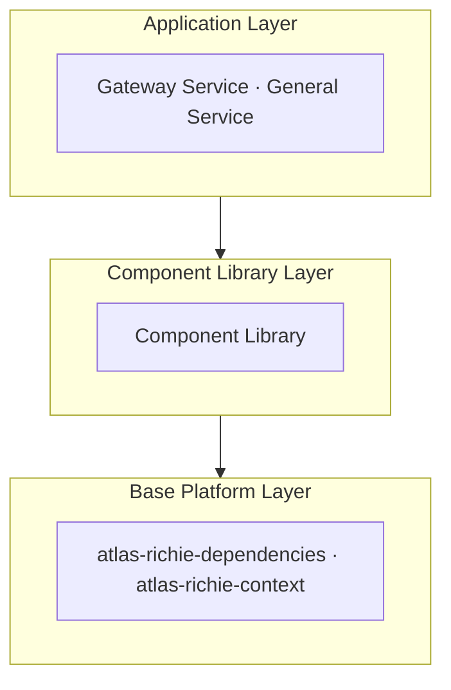
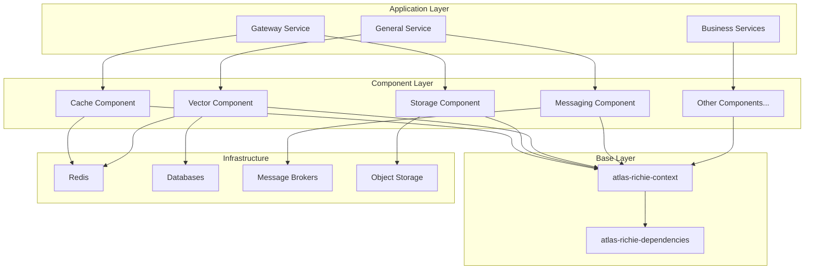

<p align="center">
  
</p>


<p align="center"><b>Enterprise middle platform · Unified components · Config-driven switching · Microservices at speed</b></p>

<p align="center">
  <a href="README.md">English</a> ·
  <a href="README.zh.md">简体中文</a> ·
  <a href="https://docs.richie696.cn/">Docs</a> ·
  <a href="https://github.com/richie696/atlas-richie-platform/issues">Issues</a> ·
  <a href="./CONTRIBUTING.md">Contributing</a> ·
  <a href="./SECURITY.md">Security</a> ·
  <a href="./CHANGELOG.md">Changelog</a>
</p>

<p align="center">
  <a href="https://www.apache.org/licenses/LICENSE-2.0"></a>
  
  
  
  
</p>

---

## 📖 Overview

**Atlas Richie Platform** is the core of the Atlas Richie technology middle platform. It provides unified technical infrastructure and a component library for building enterprise microservice applications quickly. With a layered architecture, unified interfaces, dependency management, and best practices, it separates technology from business concerns to improve development efficiency and maintainability.

## 🎯 Design Philosophy

### 1. Layered Architecture

Each layer has a clear responsibility:



### 2. Unified Interfaces

Components expose unified interfaces that hide underlying technology differences:

- **Storage**: unified `StorageEngine` — S3, OSS, COS, etc.
- **Vector store**: unified `VectorService` — Redis, Milvus, MongoDB, etc.
- **Messaging**: unified `MessageService` — Kafka, RabbitMQ, RocketMQ, etc.

### 3. Dependency Management

`atlas-richie-dependencies` centralizes third-party dependency versions for consistency.

### 4. Convention over Configuration

Sensible defaults and auto-configuration reduce setup effort.

## 🏗️ Project Structure

```
atlas-richie-platform/
├── atlas-richie-base/                    # Base platform
│   ├── atlas-richie-dependencies/        # Dependency BOM
│   └── atlas-richie-context/             # Context & utilities
├── atlas-richie-component/               # Component library
│   ├── atlas-richie-component-cache/
│   ├── atlas-richie-component-dao/
│   ├── atlas-richie-component-http/
│   ├── atlas-richie-component-storage/
│   ├── atlas-richie-component-vector/
│   ├── atlas-richie-component-messaging/
│   └── ...
├── atlas-richie-component-template/      # Sample projects
│   ├── sample-cache/
│   ├── sample-messaging/
│   ├── sample-storage/
│   └── ...
├── atlas-richie-gateway-service/         # API gateway
└── atlas-richie-general-service/         # General service
```

## 📦 Core Modules

### atlas-richie-base

**Base platform** — shared foundation for all services.

**Modules:**

- `atlas-richie-dependencies` — centralized third-party dependency versions
- `atlas-richie-context` — context management, domain models, unified responses, exceptions, utilities

**Docs:** [atlas-richie-base/README.md](./atlas-richie-base/README.md)

**Capabilities:**

- ✅ Unified dependency version management
- ✅ Context management (user, request headers, Spring context)
- ✅ Unified response format (`ResultVO`)
- ✅ Domain abstractions (`BaseDomain`, `TenantDomain`)
- ✅ Exception hierarchy (`BaseException`, `BusinessException`)
- ✅ Utilities (`JsonUtils`, `JwtUtils`, `HashUtils`, etc.)

### atlas-richie-component

**Component library** — reusable, pluggable technical capabilities.

**Components include:**

- **Storage** — object storage (S3, OSS, COS, MinIO, …)
- **Vector** — vector storage & search (Redis, Milvus, MongoDB, …)
- **Messaging** — Kafka, RabbitMQ, RocketMQ, …
- **Cache** — Redis APIs (KV, Hash, List, Set, ZSet, distributed locks, …)
- **DAO** — MyBatis Plus enhancements (pagination, multi-tenant, distributed IDs, …)
- **HTTP** — OkHttp, HttpClient5, JDK, RestClient
- **Web** — CORS, i18n, exception handling, WebSocket, SSE
- **State machine** — Easy Rules–based engine
- **AI** — unified model invocation
- **More** — OCR, search, MongoDB, MQTT, microservice helpers, logging, tracing, …

**Docs:** [atlas-richie-component/README.md](atlas-richie-component/README.md)

**Highlights:**

- ✅ Unified abstractions across implementations
- ✅ Switch implementations via configuration
- ✅ Spring Boot auto-configuration
- ✅ Technology / business separation
- ✅ Documentation and samples

### atlas-richie-component-template

**Sample projects** — examples and best practices per component.

**Samples:**

- `sample-cache`, `sample-messaging`, `sample-storage`, `sample-vector`
- `sample-mqtt-client` / `sample-mqtt-server`, `sample-ai`, `sample-http`
- `sample-threadpool`, `sample-search`, `sample-mongodb`, …

**Docs:** [atlas-richie-component-template/README.md](atlas-richie-component-template/README.md)

**Purpose:**

- 📚 Learning reference
- 🎯 Best practices
- 🧪 Feature demos
- ✅ Validation & testing

### atlas-richie-gateway-service

**API gateway** — unified edge capabilities.

**Features:**

- ✅ Authentication & authorization
- ✅ Token management
- ✅ Routing & forwarding
- ✅ Rate limiting, circuit breaking, degradation
- ✅ Idempotency / duplicate submission protection
- ✅ ECC + AES-GCM encrypted communication
- ✅ Multi-tenant support
- ✅ SSO
- ✅ Internationalization

**Docs:** [atlas-richie-gateway-service/README.md](atlas-richie-gateway-service/README.md)

### atlas-richie-general-service

General-purpose service module (see module README for details).

## 🚀 Quick Start

### 1. Requirements

- **JDK**: 25
- **Maven**: 3.9.0+
- **Redis**: 6.0+ (some components)
- **Database**: MySQL 8.0+ / PostgreSQL 12+ (some components)

### 2. Clone

```bash
git clone https://github.com/richie696/atlas-richie-platform.git
cd atlas-richie-platform
```

### 3. Build

```bash
# Full build
mvn clean install -DskipTests

# Or a single module
cd atlas-richie-base
mvn clean install -DskipTests
```

### 4. Use Components

#### Add dependencies

```xml
<parent>
    <groupId>com.richie.base</groupId>
    <artifactId>atlas-richie-base</artifactId>
    <version>1.0.0-SNAPSHOT</version>
</parent>

<dependencies>
    <dependency>
        <groupId>com.richie.component</groupId>
        <artifactId>atlas-richie-component-cache</artifactId>
    </dependency>
    <dependency>
        <groupId>com.richie.component</groupId>
        <artifactId>atlas-richie-component-storage-core</artifactId>
    </dependency>
    <dependency>
        <groupId>com.richie.component</groupId>
        <artifactId>atlas-richie-component-storage-oss</artifactId>
    </dependency>
</dependencies>
```

#### Configure

```yaml
platform:
  component:
    cache:
      redis:
        host: localhost
        port: 6379
    storage:
      object:
        engine: ALIYUN_OSS
        endpoint: oss-cn-hangzhou.aliyuncs.com
        accessKeyId: your-key
        accessKeySecret: your-secret
        bucketName: my-bucket
```

#### Example usage

```java
@Service
public class BusinessService {

    public void cacheData(String key, String value) {
        GlobalCache.addStringCache(key, value, 3600_000L);
    }

    @Autowired
    private StorageEngine storageEngine;

    public void uploadFile(String key, File file) {
        storageEngine.putObject(key, file);
    }
}
```

### 5. Run Samples

```bash
cd atlas-richie-component-template/sample-cache
mvn spring-boot:run

cd atlas-richie-component-template/sample-messaging/sample-messaging-kafka
mvn spring-boot:run
```

## 📚 Documentation Index

> Module-level README files are currently primarily in Chinese; English module docs may be added later.

### Base

- [atlas-richie-base/README.md](./atlas-richie-base/README.md)

### Components

- [atlas-richie-component/README.md](atlas-richie-component/README.md)
    - [Cache](atlas-richie-component/atlas-richie-component-cache/README.md)
    - [DAO](atlas-richie-component/atlas-richie-component-dao/README.md)
    - [HTTP](atlas-richie-component/atlas-richie-component-http/README.md)
    - [Storage](atlas-richie-component/atlas-richie-component-storage/README.md)
    - [Vector](atlas-richie-component/atlas-richie-component-vector/README.md)
    - [Messaging](atlas-richie-component/atlas-richie-component-messaging/README.md)
    - [State machine](atlas-richie-component/atlas-richie-component-statemachine/README.md)
    - [AI](atlas-richie-component/atlas-richie-component-ai/README.md)
    - [More…](atlas-richie-component/README.md)

### Samples

- [atlas-richie-component-template/README.md](atlas-richie-component-template/README.md)

### Services

- [atlas-richie-gateway-service/README.md](atlas-richie-gateway-service/README.md)

## 🏗️ Architecture

### Overview



### Design Principles

1. **Interface Segregation (ISP)** — clear per-component APIs
2. **Dependency Inversion (DIP)** — depend on abstractions, not implementations
3. **Open/Closed (OCP)** — extend without modifying core code
4. **Single Responsibility (SRP)** — one technical domain per component

## 🎯 Key Features

### Unified abstractions

```java
StorageEngine storageEngine;   // S3, OSS, COS, ...
VectorService vectorService;   // Redis, Milvus, MongoDB, ...
MessageService messageService; // Kafka, RabbitMQ, RocketMQ, ...
```

### Configuration-driven switching

```yaml
platform:
  component:
    storage:
      object:
        engine: ALIYUN_OSS  # or S3, COS, MinIO, ...
```

### Technology / business separation

- **Technology layer** — encapsulates infrastructure
- **Abstraction layer** — stable APIs for applications
- **Business layer** — domain logic only

### Batteries included

- Spring Boot auto-configuration
- Sensible defaults
- Environment-aware setup

## 🔧 Versions

### Current

- **Platform**: `1.0.0-SNAPSHOT`
- **Spring Boot**: `4.0.5`
- **Spring Cloud**: `2025.1.1`
- **JDK**: `25`

### Versioning policy

1. **Backward compatibility** where feasible
2. **Unified upgrades** via the BOM
3. **Testing** after dependency bumps

## 📋 Development

### Code style

- Follow project conventions
- Use JDK 25 features where appropriate
- Document public APIs
- Add unit tests for new behavior

### Branches

- `master` — main development (snapshot iterations)
- `x.y.z` or `x.y.z-RELEASE` — stable release lines

## 📄 License

This project is licensed under the [Apache License 2.0](./LICENSE).

See also [NOTICE](./NOTICE).

## 🔗 Links

- [Atlas Richie documentation](https://docs.richie696.cn/)
- [Contributing](./CONTRIBUTING.md) | [贡献指南](./CONTRIBUTING.md)
- [Security](./SECURITY.md) | [安全策略](./SECURITY.md)
- [Code of Conduct](./CODE_OF_CONDUCT.md) | [行为准则](./CODE_OF_CONDUCT.md)
- [Changelog](./CHANGELOG.md) | [变更日志](./CHANGELOG.md)
- [Issues](https://github.com/richie696/atlas-richie-platform/issues)

## 📞 Contact

- **Maintainer**: Richie Wang
- **Email**: richie696@icloud.com

---

**Atlas Richie Platform** — Simpler technology, sharper business focus 🚀
