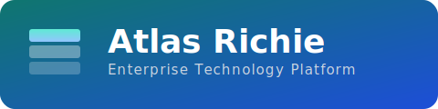
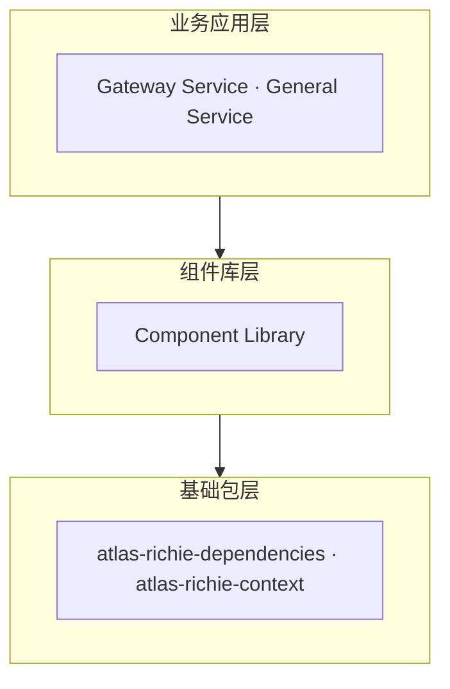
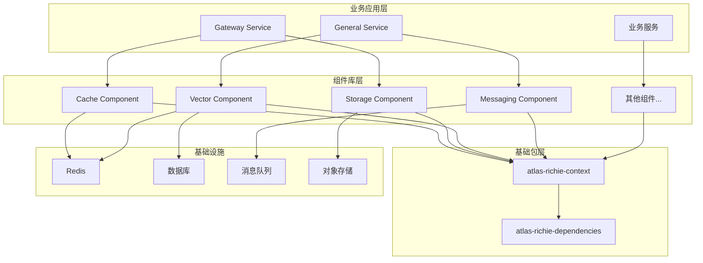

<p align="center">
  
</p>

<p align="center"><b>企业级技术中台 · 统一组件 · 配置化切换 · 快速构建微服务</b></p>

<p align="center">
  <a href="README.md">English</a> ·
  <a href="README.zh.md">简体中文</a> ·
  <a href="https://docs.richie696.cn/">文档</a> ·
  <a href="https://github.com/richie696/atlas-richie-platform/issues">Issues</a> ·
  <a href="./CONTRIBUTING.zh.md">贡献指南</a> ·
  <a href="./SECURITY.zh.md">安全策略</a> ·
  <a href="./CHANGELOG.zh.md">变更日志</a>
</p>

<p align="center">
  <a href="https://www.apache.org/licenses/LICENSE-2.0"></a>
  
  
  
  
</p>

---

## 📖 概述

**Atlas Richie Platform** 是Atlas Richie技术中台的核心平台，提供统一的技术基础设施和组件库，支持快速构建企业级微服务应用。平台采用分层架构设计，通过统一接口、依赖管理和最佳实践，实现技术与业务的完全隔离，提升开发效率和系统可维护性。

## 🎯 设计理念

### 1. 分层架构（Layered Architecture）

平台采用清晰的分层架构，每一层都有明确的职责：



### 2. 统一接口（Unified Interface）

所有组件都提供统一的接口，屏蔽底层技术实现差异：

- **存储组件**：统一的 `StorageEngine` 接口，支持 S3、OSS、COS 等
- **向量数据库**：统一的 `VectorService` 接口，支持 Redis、Milvus、MongoDB 等
- **消息队列**：统一的 `MessageService` 接口，支持 Kafka、RabbitMQ、RocketMQ 等

### 3. 依赖管理（Dependency Management）

通过 `atlas-richie-dependencies` 统一管理所有第三方依赖版本，确保版本一致性。

### 4. 开箱即用（Convention over Configuration）

提供合理的默认配置和自动配置，减少配置工作量。

## 🏗️ 项目结构

```
atlas-richie-platform/
├── atlas-richie-base/                    # 基础包
│   ├── atlas-richie-dependencies/        # 依赖管理模块
│   └── atlas-richie-context/             # 上下文和工具类模块
├── atlas-richie-component/               # 组件库
│   ├── atlas-richie-component-cache/    # 缓存组件
│   ├── atlas-richie-component-dao/      # 数据访问组件
│   ├── atlas-richie-component-http/     # HTTP 客户端组件
│   ├── atlas-richie-component-storage/  # 存储组件
│   ├── atlas-richie-component-vector/   # 向量数据库组件
│   ├── atlas-richie-component-messaging/# 消息队列组件
│   └── ...                        # 更多组件
├── atlas-richie-component-template/     # 组件示例工程
│   ├── sample-cache/              # 缓存示例
│   ├── sample-messaging/          # 消息队列示例
│   ├── sample-storage/            # 存储示例
│   └── ...                       # 更多示例
├── atlas-richie-gateway-service/        # 网关服务
└── atlas-richie-general-service/        # 通用服务
```

## 📦 核心模块

### atlas-richie-base

**基础包**，提供统一的基础能力支撑。

**包含模块**：
- `atlas-richie-dependencies` - 依赖管理模块，统一管理所有第三方依赖版本
- `atlas-richie-context` - 上下文和工具类模块，提供上下文管理、领域模型、统一响应、异常体系、工具类等

**文档**：[atlas-richie-base/README.zh.md](./atlas-richie-base/README.zh.md)

**核心能力**：
- ✅ 统一依赖版本管理
- ✅ 上下文管理（用户上下文、请求头上下文、Spring 上下文）
- ✅ 统一响应格式（ResultVO）
- ✅ 领域模型抽象（BaseDomain、TenantDomain）
- ✅ 异常体系（BaseException、BusinessException）
- ✅ 工具类（JsonUtils、JwtUtils、HashUtils 等）

### atlas-richie-component

**组件库**，提供统一、泛化、可复用的技术能力。

**包含组件**：
- **存储组件**：统一的对象存储接口，支持 S3、OSS、COS、MinIO 等
- **向量数据库组件**：统一的向量存储和检索接口，支持 Redis、Milvus、MongoDB 等
- **消息队列组件**：统一的消息队列接口，支持 Kafka、RabbitMQ、RocketMQ 等
- **缓存组件**：Redis 统一 API，提供 KV、Hash、List、Set、ZSet、分布式锁等
- **数据访问组件**：MyBatis Plus 增强，提供分页、多租户、分布式 ID 等
- **HTTP 客户端组件**：支持 OkHttp 和 HttpClient5
- **Web 组件**：CORS、国际化、异常处理、WebSocket、SSE
- **状态机组件**：基于 Easy Rules 的状态机引擎
- **AI 组件**：统一 AI 模型调用接口
- **更多组件**：OCR、搜索、MongoDB、MQTT、微服务、日志、追踪等

**文档**：[atlas-richie-component/README.md](atlas-richie-component/README.md)

**核心特性**：
- ✅ 统一接口抽象，屏蔽技术差异
- ✅ 多实现支持，配置化切换
- ✅ 开箱即用，自动配置
- ✅ 技术与业务隔离
- ✅ 完整的文档和示例

### atlas-richie-component-template

**组件示例工程**，提供各个组件的完整使用示例和最佳实践。

**包含示例**：
- `sample-cache` - 缓存组件示例
- `sample-messaging` - 消息队列示例（Kafka、RabbitMQ、RocketMQ 等）
- `sample-storage` - 对象存储示例（S3、OSS、COS 等）
- `sample-vector` - 向量数据库示例（Redis、Milvus、MongoDB 等）
- `sample-mqtt-client` / `sample-mqtt-server` - MQTT 示例
- `sample-ai` - AI 组件示例
- `sample-http` - HTTP 客户端示例
- `sample-threadpool` - 线程池示例
- `sample-search` - 搜索组件示例
- `sample-mongodb` - MongoDB 示例

**文档**：[atlas-richie-component-template/README.md](atlas-richie-component-template/README.md)

**用途**：
- 📚 学习参考：快速理解组件使用方法
- 🎯 最佳实践：展示推荐的使用方式
- 🧪 功能演示：演示组件核心功能
- ✅ 测试验证：验证组件功能和性能

### atlas-richie-gateway-service

**通用网关服务**，提供统一的 API 网关能力。

**核心功能**：
- ✅ 统一鉴权认证
- ✅ Token 令牌管理
- ✅ 请求路由和转发
- ✅ 限流、熔断、降级
- ✅ 防重复提交
- ✅ ECC+AES-GCM 加密通信
- ✅ 多租户支持
- ✅ SSO 单点登录
- ✅ 国际化支持

**文档**：[atlas-richie-gateway-service/README.zh.md](atlas-richie-gateway-service/README.zh.md)

### atlas-richie-general-service

## 🚀 快速开始

### 1. 环境要求

- **JDK**: 25
- **Maven**: 3.9.0+
- **Redis**: 6.0+（部分组件需要）
- **数据库**: MySQL 8.0+ / PostgreSQL 12+（部分组件需要）

### 2. 克隆项目

```bash
git clone <repository-url>
cd atlas-richie-platform
```

### 3. 构建项目

```bash
# 构建整个项目
mvn clean install -DskipTests

# 或构建特定模块
cd atlas-richie-base
mvn clean install -DskipTests
```

### 4. 使用组件

#### 在业务应用中添加依赖

```xml
<parent>
    <groupId>com.richie.base</groupId>
    <artifactId>atlas-richie-base</artifactId>
    <version>1.0.0-SNAPSHOT</version>
</parent>

<dependencies>
<!-- 添加需要的组件 -->
<dependency>
    <groupId>com.richie.component</groupId>
    <artifactId>atlas-richie-component-cache</artifactId>
</dependency>

<dependency>
    <groupId>com.richie.component</groupId>
    <artifactId>atlas-richie-component-storage-core</artifactId>
</dependency>

<dependency>
    <groupId>com.richie.component</groupId>
    <artifactId>atlas-richie-component-storage-oss</artifactId>
</dependency>
</dependencies>
```

#### 配置组件

```yaml
platform:
    component:
        cache:
            redis:
                host: localhost
                port: 6379

        storage:
            object:
                engine: ALIYUN_OSS
                endpoint: oss-cn-hangzhou.aliyuncs.com
                accessKeyId: your-key
                accessKeySecret: your-secret
                bucketName: my-bucket
```

#### 使用组件

```java
@Service
public class BusinessService {

    // 使用缓存
    public void cacheData(String key, String value) {
        GlobalCache.addStringCache(key, value, 3600_000L);
    }

    // 使用存储
    @Autowired
    private StorageEngine storageEngine;

    public void uploadFile(String key, File file) {
        storageEngine.putObject(key, file);
    }
}
```

### 5. 运行示例

```bash
# 运行缓存示例
cd atlas-richie-component-template/sample-cache
mvn spring-boot:run

# 运行消息队列示例
cd atlas-richie-component-template/sample-messaging/sample-messaging-kafka
mvn spring-boot:run
```

## 📚 文档索引

### 基础文档

- [atlas-richie-base/README.zh.md](./atlas-richie-base/README.zh.md) - 基础包文档
    - 依赖管理
    - 上下文管理
    - 领域模型
    - 统一响应
    - 异常体系
    - 工具类

### 组件文档

- [atlas-richie-component/README.md](atlas-richie-component/README.md) - 组件库总览
    - [缓存组件](atlas-richie-component/atlas-richie-component-cache/README.md)
    - [数据访问组件](atlas-richie-component/atlas-richie-component-dao/README.md)
    - [HTTP 客户端组件](atlas-richie-component/atlas-richie-component-http/README.md)
    - [存储组件](atlas-richie-component/atlas-richie-component-storage/README.md)
    - [向量数据库组件](atlas-richie-component/atlas-richie-component-vector/README.md)
    - [消息队列组件](atlas-richie-component/atlas-richie-component-messaging/README.md)
    - [状态机组件](atlas-richie-component/atlas-richie-component-statemachine/README.md)
    - [AI 组件](atlas-richie-component/atlas-richie-component-ai/README.md)
    - [更多组件...](atlas-richie-component/README.md#组件分类)

### 示例文档

- [atlas-richie-component-template/README.md](atlas-richie-component-template/README.md) - 组件示例工程文档

### 服务文档

- [atlas-richie-gateway-service/README.zh.md](atlas-richie-gateway-service/README.zh.md) - 网关服务文档

## 🏗️ 架构设计

### 整体架构



### 核心设计原则

1. **接口隔离原则（ISP）**：每个组件提供清晰的接口定义
2. **依赖倒置原则（DIP）**：业务代码依赖抽象接口，而非具体实现
3. **开闭原则（OCP）**：对扩展开放，对修改封闭
4. **单一职责原则（SRP）**：每个组件专注于单一技术领域

## 🎯 核心特性

### 1. 统一接口抽象

所有组件都提供统一的接口，屏蔽底层技术实现差异：

```java
// 存储接口 - 可以是 S3、OSS、COS 等任意实现
StorageEngine storageEngine;

// 向量数据库接口 - 可以是 Redis、Milvus、MongoDB 等任意实现
VectorService vectorService;

// 消息队列接口 - 可以是 Kafka、RabbitMQ、RocketMQ 等任意实现
MessageService messageService;
```

### 2. 配置化切换

通过配置文件即可切换不同的技术实现，无需修改代码：

```yaml
# 切换存储后端
platform:
    component:
        storage:
            object:
                engine: ALIYUN_OSS  # 可以切换为 S3、COS、MinIO 等
```

### 3. 技术与业务隔离

通过分层架构和接口抽象，实现技术与业务的完全隔离：

- **技术层**：封装底层技术细节
- **抽象层**：提供统一的业务接口
- **业务层**：专注于业务逻辑

### 4. 开箱即用

提供合理的默认配置和自动配置，减少配置工作量：

- Spring Boot 自动配置
- 默认配置值
- 智能检测环境

## 🔧 版本信息

### 当前版本

- **Platform Version**: `1.0.0-SNAPSHOT`
- **Spring Boot**: `4.0.5`
- **Spring Cloud**: `2025.1.1`
- **JDK**: `25`

### 版本管理

版本升级遵循以下原则：

1. **向后兼容**：尽量保持 API 向后兼容
2. **统一升级**：所有依赖版本统一管理
3. **测试验证**：升级后进行全面测试

## 📋 开发指南

### 代码规范

- 遵循项目代码风格
- 使用 JDK 25 语法特性
- 提供完整的注释和文档
- 编写单元测试

### 分支管理

- `master` - 主分支，快速迭代快照版本。
- `x.y.z` 或 `x.y.z-RELEASE` - 稳定上线版本。

## 📄 许可证

本项目采用 [Apache License 2.0](./LICENSE) 开源协议。

请同时参考仓库根目录的 [NOTICE](./NOTICE) 文件。

## 🔗 相关链接

- [Atlas Richie技术中台](https://docs.richie696.cn/)
- [贡献指南](./CONTRIBUTING.zh.md) | [Contributing (EN)](./CONTRIBUTING.md)
- [安全策略](./SECURITY.zh.md) | [Security (EN)](./SECURITY.md)
- [行为准则](./CODE_OF_CONDUCT.zh.md) | [Code of Conduct (EN)](./CODE_OF_CONDUCT.md)
- [变更日志](./CHANGELOG.zh.md) | [Changelog (EN)](./CHANGELOG.md)
- [问题反馈](https://github.com/richie696/atlas-richie-platform/issues)

## 📞 联系方式

- **维护者**：Richie Wang
- **邮箱**：richie696@icloud.com

---

**Atlas Richie Platform** - 让技术更简单，让业务更专注 🚀

