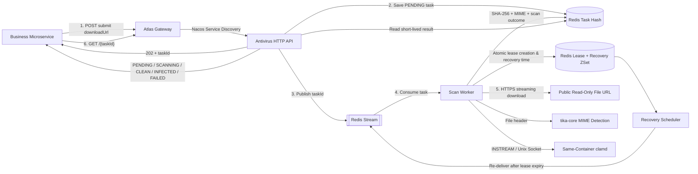
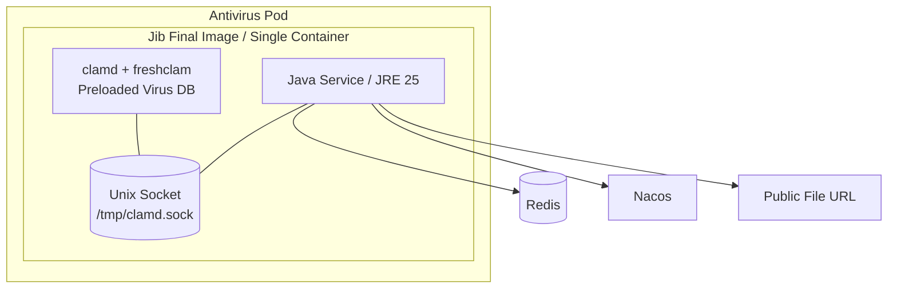
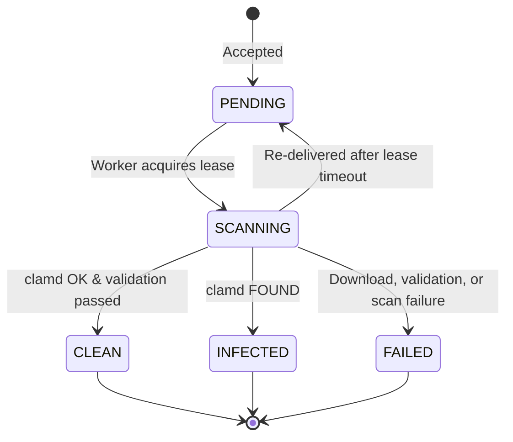

# Atlas Richie Antivirus Service

A standalone async file virus scanning microservice. It registers via Nacos, exposes HTTP APIs through the Gateway for business services; uses Redis for short-lived task state and Redis Stream for task scheduling; the final Jib image bundles ClamAV, freshclam, virus signature databases, and JRE 25; uses `tika-core` for bounded file-header MIME detection.

The service has no dependency on a database, NATS, Storage components, or any cloud storage SDK. Business services only need to provide a publicly readable HTTPS URL, and decide for themselves whether attachment state, access control, and auditing are persisted.

## 📖 Contents

- [1. Design Boundaries](#1-design-boundaries)
- [2. How It Works](#2-how-it-works)
- [3. Pod &amp; Image Structure](#3-pod--image-structure)
- [4. Environment Requirements](#4-environment-requirements)
- [5. Configuration Loading](#5-configuration-loading)
    - [5.1 Local Configuration Files](#51-local-configuration-files)
    - [5.2 Environment Variables](#52-environment-variables)
    - [5.3 Nacos Configuration Example](#53-nacos-configuration-example)
- [6. Building the Container with Jib](#6-building-the-container-with-jib)
    - [6.1 Build and Publish the Combined Base Image](#61-build-and-publish-the-combined-base-image)
    - [6.2 Build the Final Image Tar](#62-build-the-final-image-tar)
    - [6.3 Using a Local Combined Base Image](#63-using-a-local-combined-base-image)
    - [6.4 Build the Final Image Directly to Docker Daemon](#64-build-the-final-image-directly-to-docker-daemon)
    - [6.5 Push the Final Image to a Registry](#65-push-the-final-image-to-a-registry)
- [7. Deploying with Helm](#7-deploying-with-helm)
    - [7.1 Create Secret](#71-create-secret)
    - [7.2 Write Production Values](#72-write-production-values)
    - [7.3 Inspect and Deploy](#73-inspect-and-deploy)
- [8. Gateway Routing](#8-gateway-routing)
- [9. HTTP API](#9-http-api)
    - [9.1 Submit a Scan Task](#91-submit-a-scan-task)
    - [9.2 Query Scan Results](#92-query-scan-results)
    - [9.3 State Machine](#93-state-machine)
- [10. Microservice Invocation](#10-microservice-invocation)
    - [10.1 Recommended Business Orchestration](#101-recommended-business-orchestration)
    - [10.2 OpenFeign Example](#102-openfeign-example)
- [11. Download &amp; Security Restrictions](#11-download--security-restrictions)
- [12. ClamAV Configuration](#12-clamav-configuration)
- [13. Health Checks &amp; Troubleshooting](#13-health-checks--troubleshooting)
- [14. Testing](#14-testing)
- [15. Directory Structure](#15-directory-structure)

## 1. Design Boundaries

| Capability | Owner |
|---|---|
| Generate publicly readable or short-lived pre-signed download URLs | Caller |
| Submit tasks, download files, MIME detection, ClamAV scanning | Antivirus Service |
| Stage task state and scan results | Antivirus Service + Redis |
| Long-term auditing, attachment business state, propagation and access control | Caller |
| Object upload, download, and signing | Business-chosen Storage implementation |

The following release rules must be observed:

- `CLEAN`: Allows the business side to mark the file as accessible;
- `INFECTED`: Prohibits propagation, download, parsing, and execution;
- `FAILED`: Scan did not reach a trustworthy conclusion — must be treated as unsafe;
- `PENDING`, `SCANNING`: Scan has not completed — must remain inaccessible.

## 2. How It Works



Processing flow:

1. The caller first sets its attachment record to `PENDING_SCAN`, then submits the file URL.
2. The accept endpoint immediately generates a `taskId`, writes a `PENDING` task to Redis, and publishes a Redis Stream message.
3. The endpoint returns `202 Accepted` without waiting for download or virus scan completion.
4. The Worker atomically acquires a Redis execution lease and writes the recovery time, then acknowledges the Stream message.
5. The Worker validates the URL and redirect targets, allowing only public HTTPS; the file is streamed concurrently to SHA-256, Tika MIME detection, and the same-container clamd.
6. The Worker writes `CLEAN`, `INFECTED`, or `FAILED` back to Redis; results are retained for 72 hours by default.
7. If a Pod exits during `SCANNING`, the Recovery Scheduler re-delivers the task after the lease expires. After the new instance takes over, the old instance cannot overwrite the new results even if it recovers.
8. The caller polls for the result using the `taskId` and persists the final conclusion in its own business tables.

Tasks follow at-least-once recovery semantics; duplicate messages may exist, but the Redis lease guarantees only one active executor at any given time.

## 3. Pod & Image Structure



Jib does not support executing `apt install` or Dockerfile `RUN` within the image, nor can it merge two base images. Therefore, the repository provides `container/runtime-base/Dockerfile`, which first combines the official `eclipse-temurin:25-jre` and `clamav/clamav:latest-debian13-slim` into a runtime base image; Jib then layers the service code and startup script on top of this base image. The final deliverable is a single image containing Java, ClamAV, and the preloaded signature database.

The container entrypoint script starts freshclam and clamd first, waits for the Unix Socket to be ready, and only then starts Java. If ClamAV fails to start or its process manager exits, the entrypoint script causes the entire container to fail, letting Kubernetes restart it.

## 4. Environment Requirements

Source build requires:

- JDK 25;
- Maven 3.9 or higher;
- Ability to pull the default combined base image
  `registry.new.richie.cn/platform/atlas-richie-antivirus-runtime:clamav-debian13-slim-jre25`;

Runtime requires:

- Nacos: service registration and optional remote configuration;
- Redis: task state, Redis Stream, leases, and recovery ZSet;
- Kubernetes + Helm 3: production deployment;
- Controlled Pod egress with access to internet file URLs;
- Antivirus Service image with ClamAV built-in.

No business database, DDL permissions, or Liquibase required.

## 5. Configuration Loading

### 5.1 Local Configuration Files

- `src/main/resources/bootstrap.yml`: Nacos address, namespace, group, and remote configuration imports;
- `src/main/resources/application.yml`: service port, Redis, scanner, download limits, and Stream Consumer.

The service attempts to import the following Nacos configurations, falling back to local files and environment variables when not configured:

```text
platform-cache.yaml
platform-antivirus.yaml
```

Multi-instance deployments must disable local L2 caching for task objects:

```yaml
spring:
  data:
    redis:
      enable-l2-caching: false
```

If `platform-cache.yaml` sets a global L2 cache, the above value must remain `false` in `platform-antivirus.yaml` for this service; otherwise, different Pods may read stale task state.

### 5.2 Environment Variables

| Environment Variable | Default | Description |
|---|---|---|
| `SERVER_PORT` | `9600` | HTTP port |
| `NACOS_SERVER_ADDR` | `127.0.0.1:8848` | Nacos address |
| `NACOS_NAMESPACE` | `public` | Nacos namespace |
| `NACOS_GROUP` | `global` | Nacos group |
| `NACOS_USERNAME` | empty | Nacos username, use Secret |
| `NACOS_PASSWORD` | empty | Nacos password, use Secret |
| `SPRING_DATA_REDIS_HOST` | `127.0.0.1` | Redis host |
| `SPRING_DATA_REDIS_PORT` | `6379` | Redis port |
| `SPRING_DATA_REDIS_PASSWORD` | empty | Redis password, use Secret |
| `SPRING_DATA_REDIS_TIMEOUT` | `3s` | Redis timeout |
| `ANTIVIRUS_TASK_TTL` | `72h` | Task and result retention time |
| `ANTIVIRUS_TASK_STREAM` | `antivirus-scan-requests` | Redis Stream name |
| `ANTIVIRUS_STREAM_GROUP` | `antivirus-service` | Consumer Group |
| `ANTIVIRUS_STREAM_CONSUMER` | Pod `HOSTNAME` | Consumer name |
| `ANTIVIRUS_WORKER_CONCURRENCY` | `1` | Single Pod consumption concurrency |
| `ANTIVIRUS_STREAM_BATCH_SIZE` | `1` | Messages read per batch |
| `ANTIVIRUS_STREAM_MAX_LEN` | `10000` | Approximate maximum stream length |
| `ANTIVIRUS_SCAN_LEASE_DURATION` | `10m` | Single scan lease duration |
| `ANTIVIRUS_RECOVERY_RETRY_DELAY` | `10s` | Re-delivery delay for pre-consumption exceptions |
| `ANTIVIRUS_RECOVERY_POLL_INTERVAL_MS` | `10000` | Expired task check interval |
| `ANTIVIRUS_RECOVERY_BATCH_SIZE` | `100` | Maximum recovery count per round |
| `ANTIVIRUS_CLAMAV_ENABLED` | `false` | Whether to enable clamd scanning |
| `ANTIVIRUS_CLAMAV_SOCKET_PATH` | `/tmp/clamd.sock` | clamd Unix Socket |
| `ANTIVIRUS_MAX_FILE_SIZE_BYTES` | `209715200` | Maximum file size in bytes (Java side) |
| `ANTIVIRUS_MIME_PROBE_BYTES` | `65536` | Tika file header probe bytes |
| `ANTIVIRUS_DOWNLOAD_ALLOW_HTTP` | `false` | Whether to additionally allow plain HTTP |
| `ANTIVIRUS_DOWNLOAD_CONNECT_TIMEOUT` | `5s` | Download connection timeout |
| `ANTIVIRUS_DOWNLOAD_REQUEST_TIMEOUT` | `3m` | Single download request timeout |
| `ANTIVIRUS_DOWNLOAD_MAX_REDIRECTS` | `3` | Maximum redirects |

`ANTIVIRUS_SCAN_LEASE_DURATION` must be greater than the longest expected total time for "download + clamd scan" under normal conditions. A lease that is too short will not corrupt results, but may cause another Pod to redundantly execute the scan.

### 5.3 Nacos Configuration Example

`platform-antivirus.yaml` can contain only the overrides that need centralized management:

```yaml
spring:
  data:
    redis:
      enable-l2-caching: false

platform:
  antivirus:
    task-ttl: 72h
    recovery:
      lease-duration: 10m
      poll-interval-ms: 10000
      batch-size: 100
    download:
      allow-http: false
      connect-timeout: 5s
      request-timeout: 3m
      max-redirects: 3
    clamav:
      enabled: true
      socket-path: /tmp/clamd.sock
      max-file-size-bytes: 209715200
      mime-probe-bytes: 65536
```

Passwords must not be placed in source code, Values, or plain-text Nacos configuration; inject them via Kubernetes Secrets.

## 6. Building the Container with Jib

Jib is bound to the Maven `package` phase. Since the final image is based on a pre-published combined runtime base image, each build does not require reinstalling ClamAV, nor does it require a local Docker daemon.

### 6.1 Build and Publish the Combined Base Image

For initial pipeline setup, JRE upgrades, or ClamAV upgrades, to be executed by image maintainers:

```bash
docker buildx build \
  --platform linux/amd64,linux/arm64 \
  --file atlas-richie-antivirus-service/container/runtime-base/Dockerfile \
  --tag registry.new.richie.cn/platform/atlas-richie-antivirus-runtime:clamav-debian13-slim-jre25 \
  --push \
  atlas-richie-antivirus-service/container/runtime-base
```

The base image is composed of two official images:

```text
eclipse-temurin:25-jre
clamav/clamav:latest-debian13-slim
```

The ClamAV image already includes the virus signature database; freshclam performs incremental updates at runtime. The base image should undergo vulnerability scanning in CI and lock the upstream image digests. Ordinary business code builds do not need to repeat this step.

For local verification of the base image, you can build only the current architecture:

```bash
docker build \
  --file atlas-richie-antivirus-service/container/runtime-base/Dockerfile \
  --tag atlas-richie-antivirus-runtime:local \
  atlas-richie-antivirus-service/container/runtime-base
```

### 6.2 Build the Final Image Tar

Execute from the repository root:

```bash
mvn -pl atlas-richie-antivirus-service -am clean package
```

The build runs unit tests and outputs:

```text
atlas-richie-antivirus-service/target/
├── atlas-richie-antivirus-service-1.0.0-SNAPSHOT.jar
├── atlas-richie-antivirus-service-image.tar
├── atlas-richie-antivirus-service-image.digest
├── atlas-richie-antivirus-service-image.id
└── atlas-richie-antivirus-service-image.json
```

Default image names:

```text
registry.new.richie.cn/platform/atlas-richie-antivirus-service:1.0.0-SNAPSHOT
registry.new.richie.cn/platform/atlas-richie-antivirus-service:latest
```

The generated final image already contains JRE, ClamAV, freshclam, the signature database, and the Java service — no separate ClamAV installation or Sidecar pull required.

Load into local Docker:

```bash
docker load --input \
  atlas-richie-antivirus-service/target/atlas-richie-antivirus-service-image.tar
```

Jib's `buildTar` produces a loadable container image archive; `jib:dockerBuild` writes directly to the local Docker, and `jib:build` pushes directly to a registry.
For full parameters, refer to the
[Jib Maven Plugin documentation](https://github.com/GoogleContainerTools/jib/tree/master/jib-maven-plugin).

### 6.3 Using a Local Combined Base Image

Jib can read a locally built base image from the Docker daemon:

```bash
mvn -pl atlas-richie-antivirus-service -am clean package \
  -Djib.from.image=docker://atlas-richie-antivirus-runtime:local \
  -Djib.to.image=registry.example.com/platform/atlas-richie-antivirus-service \
  -Ddocker.image.version=1.2.0
```

Do not change `jib.from.image` to a plain JRE image, otherwise the final image will lack ClamAV. Specify only the registry and image name for `jib.to.image` without appending a tag.

### 6.4 Build the Final Image Directly to Docker Daemon

First install the required Reactor dependencies for this module while skipping the lifecycle-bound image build, then write to Docker:

```bash
mvn -pl atlas-richie-antivirus-service -am install \
  -DskipTests \
  -Djib.skip=true

mvn -f atlas-richie-antivirus-service/pom.xml jib:dockerBuild \
  -Djib.to.image=atlas-richie-antivirus-service \
  -Ddocker.image.version=local
```

### 6.5 Push the Final Image to a Registry

Jib reads Docker credential helpers, credentials from `docker login`, or Maven `settings.xml`:

```bash
mvn -pl atlas-richie-antivirus-service -am install -Djib.skip=true

mvn -f atlas-richie-antivirus-service/pom.xml jib:build \
  -Djib.to.image=registry.example.com/platform/atlas-richie-antivirus-service \
  -Ddocker.image.version=1.2.0
```

Private registries should use HTTPS. Only temporarily add the following when explicitly using an HTTP registry in a test environment:

```bash
-Djib.allow.insecure.registries=true
```

## 7. Deploying with Helm

Chart location:

```text
deploy/helm/atlas-richie-antivirus
```

Helm creates:

- A Kubernetes Deployment;
- A ClusterIP Service exposing port 9600;
- Java service ConfigMap;
- clamd configuration ConfigMap;
- A single `antivirus-service` container per Pod with Java, clamd, freshclam, and the virus database built-in.

### 7.1 Create Secret

```bash
kubectl -n platform create secret generic antivirus-service-secret \
  --from-literal=NACOS_USERNAME='<username>' \
  --from-literal=NACOS_PASSWORD='<password>' \
  --from-literal=SPRING_DATA_REDIS_PASSWORD='<password>'
```

### 7.2 Write Production Values

Create `values-production.yaml`:

```yaml
replicaCount: 2

image:
  repository: registry.example.com/platform/atlas-richie-antivirus-service
  tag: "1.2.0"
  pullPolicy: IfNotPresent

imagePullSecrets:
  - name: registry-credential

existingSecret: antivirus-service-secret

config:
  nacosServerAddr: nacos.platform.svc.cluster.local:8848
  nacosNamespace: production
  nacosGroup: global
  redisHost: redis.platform.svc.cluster.local
  redisPort: "6379"
  taskTtl: 72h
  workerConcurrency: "4"
  scanLeaseDuration: 10m
  recoveryRetryDelay: 10s
  recoveryPollIntervalMs: "10000"
  recoveryBatchSize: "100"
  maxFileSizeBytes: "209715200"
  mimeProbeBytes: "65536"
  downloadAllowHttp: "false"
  downloadConnectTimeout: 5s
  downloadRequestTimeout: 3m
  downloadMaxRedirects: "3"

clamav:
  maxThreads: 4
  maxQueue: 8
  streamMaxLength: 200M
  maxScanTime: 120000
  maxFileSize: 200M
  maxScanSize: 400M

resources:
  requests:
    cpu: "1"
    memory: 2Gi
    ephemeral-storage: 1Gi
  limits:
    cpu: "4"
    memory: 5Gi
    ephemeral-storage: 4Gi
```

Resource limits are the combined total for Java and ClamAV. Java's `maxFileSizeBytes`, clamd's `StreamMaxLength`, and `MaxFileSize` should be consistent.

### 7.3 Inspect and Deploy

```bash
helm lint atlas-richie-antivirus-service/deploy/helm/atlas-richie-antivirus

helm template antivirus-service \
  atlas-richie-antivirus-service/deploy/helm/atlas-richie-antivirus \
  -n platform \
  -f values-production.yaml

helm upgrade --install antivirus-service \
  atlas-richie-antivirus-service/deploy/helm/atlas-richie-antivirus \
  -n platform \
  --create-namespace \
  -f values-production.yaml \
  --wait
```

Check status:

```bash
kubectl -n platform get pods
kubectl -n platform logs deploy/antivirus-service-atlas-richie-antivirus \
  -c antivirus-service
kubectl -n platform logs deploy/antivirus-service-atlas-richie-antivirus \
  -c clamd
```

The actual Deployment name is affected by the Helm release name and `fullnameOverride`; first verify with `kubectl -n platform get deploy`.

## 8. Gateway Routing

The service registration name is:

```text
platform-antivirus-service
```

It is recommended to add a route via the Nacos Gateway configuration:

```yaml
spring:
  cloud:
    gateway:
      server:
        webflux:
          routes:
            - id: platform-antivirus-service
              uri: lb://platform-antivirus-service
              predicates:
                - Path=/antivirus/**
              filters:
                - StripPrefix=1
```

After configuration, the external path:

```text
/antivirus/internal/v1/scans
```

is forwarded to the internal service path:

```text
/internal/v1/scans
```

The Gateway must complete authentication and generate a trustworthy `X-Tenant-Id`. The Antivirus Service currently relies on this tenant header for task isolation and must not be exposed to the public internet without going through the Gateway.

## 9. HTTP API

### 9.1 Submit a Scan Task

```http
POST /internal/v1/scans
Content-Type: application/json
X-Tenant-Id: tenant-001
```

Request fields:

| Field | Required | Type | Description |
|---|---|---|---|
| `fileId` | Yes | string | Caller's file business identifier |
| `downloadUrl` | Yes | string | Public HTTPS read-only URL or short-lived pre-signed URL |
| `fileName` | No | string | File name to assist MIME detection |
| `expectedSize` | No | long | Expected byte count from caller, validated after scan |
| `expectedEtag` | No | string | Expected ETag from caller, validated after download |

Request example:

```bash
curl -i -X POST \
  'https://gateway.example.com/antivirus/internal/v1/scans' \
  -H 'Content-Type: application/json' \
  -H 'X-Tenant-Id: tenant-001' \
  -H 'Authorization: Bearer <token>' \
  -d '{
    "fileId": "file-123",
    "downloadUrl": "https://files.example.com/path/file.pdf?signature=...",
    "fileName": "file.pdf",
    "expectedSize": 1048576,
    "expectedEtag": "etag-value"
  }'
```

Successful response `202 Accepted`:

```json
{
  "success": true,
  "data": {
    "taskId": "96dc4f80-bf1f-4e90-a2a5-fba85144c6ab",
    "fileId": "file-123",
    "status": "PENDING",
    "actualSize": null,
    "sha256": null,
    "detectedMimeType": null,
    "threatName": null,
    "engineVersion": null,
    "signatureVersion": null,
    "errorMessage": null,
    "submittedAt": "2026-07-30T15:30:00+08:00",
    "startedAt": null,
    "completedAt": null
  },
  "msg": "ok"
}
```

Returns `503 Service Unavailable` when Redis cannot save the task or Stream cannot accept the message:

```json
{
  "success": false,
  "data": null,
  "msg": "Scan task temporarily cannot be accepted"
}
```

### 9.2 Query Scan Results

```http
GET /internal/v1/scans/{taskId}
X-Tenant-Id: tenant-001
```

```bash
curl \
  'https://gateway.example.com/antivirus/internal/v1/scans/96dc4f80-bf1f-4e90-a2a5-fba85144c6ab' \
  -H 'X-Tenant-Id: tenant-001' \
  -H 'Authorization: Bearer <token>'
```

Clean file:

```json
{
  "success": true,
  "data": {
    "taskId": "96dc4f80-bf1f-4e90-a2a5-fba85144c6ab",
    "fileId": "file-123",
    "status": "CLEAN",
    "actualSize": 1048576,
    "sha256": "0123456789abcdef...",
    "detectedMimeType": "application/pdf",
    "threatName": null,
    "engineVersion": "clamd",
    "signatureVersion": null,
    "errorMessage": null,
    "submittedAt": "2026-07-30T15:30:00+08:00",
    "startedAt": "2026-07-30T15:30:01+08:00",
    "completedAt": "2026-07-30T15:30:03+08:00"
  },
  "msg": "ok"
}
```

For an infected file, the `status` is `INFECTED` and `threatName` contains the threat name returned by clamd. When the scanner is unavailable, download fails, or size/ETag mismatches, the response returns `FAILED` with the reason in `errorMessage`.

When the task does not exist, has expired, or the tenant does not match, the response uniformly returns HTTP 200:

```json
{
  "success": false,
  "data": null,
  "msg": "Task not found"
}
```

When the caller sees `data=null`, it should confirm its attachment is still inaccessible and resubmit a scan task.

### 9.3 State Machine



Redis does not forcibly revert recovery tasks back to `PENDING`; the `SCANNING → PENDING` transition in the diagram represents logical re-queuing. During query, callers may still see `SCANNING` until a new Worker writes a terminal state.

## 10. Microservice Invocation

### 10.1 Recommended Business Orchestration

Business services should follow this non-blocking flow:

```text
Upload completes
  → Write attachment state as PENDING_SCAN
  → POST submit scan task
  → Save taskId
  → Scheduled or background task GET query
  → CLEAN    : Change attachment to READY
  → INFECTED : Change attachment to BLOCKED
  → FAILED   : Change attachment to SCAN_FAILED, can be handled manually or re-scanned
  → Not found: Resubmit scan task
```

Do not block and wait for scan results within the upload request's main path, and do not automatically invoke the Antivirus Service inside HTTP or Storage atomic components.

### 10.2 OpenFeign Example

Business services can call directly through Nacos service discovery, but business code must still pass the trusted tenant ID:

```java
@FeignClient(name = "platform-antivirus-service")
public interface AntivirusClient {

    @PostMapping("/internal/v1/scans")
    ApiResponse<ScanTaskResponse> submit(
            @RequestHeader("X-Tenant-Id") String tenantId,
            @RequestBody SubmitScanRequest request);

    @GetMapping("/internal/v1/scans/{taskId}")
    ApiResponse<ScanTaskResponse> get(
            @RequestHeader("X-Tenant-Id") String tenantId,
            @PathVariable String taskId);
}
```

When sharing across microservices, the caller should define DTOs consistent with this page's API in its own contract/client module, rather than depending on the Antivirus Service's executable JAR.

Polling recommendations:

- Initial interval 1–2 seconds;
- Use exponential backoff, gradually increasing to 10–30 seconds;
- Total wait time determined by business SLA;
- If the task has not reached a terminal state beyond the business wait ceiling, keep the file inaccessible rather than defaulting to allow.

## 11. Download & Security Restrictions

The service enforces the following by default:

- HTTPS only; HTTP is allowed only when explicitly set with `ANTIVIRUS_DOWNLOAD_ALLOW_HTTP=true`;
- Rejects URL user-info, loopback, private network, link-local, cloud metadata, and reserved IPs;
- Every resolved DNS address must be a public address;
- Each redirect is re-validated, with a default maximum of 3 redirects;
- Requests `Accept-Encoding: identity`, rejecting byte-level semantic ambiguity caused by compressed transfers;
- Pre-checks `Content-Length`, and re-limits actual bytes during reading;
- Can validate ETag and expected size;
- Query responses do not return `downloadUrl` to avoid leaking any embedded temporary signatures.

Application-layer address validation cannot fully replace network isolation. In production, Pod egress should be restricted through NetworkPolicy, service mesh, or egress firewalls — in particular, access to cluster management subnets and cloud metadata addresses must be prohibited.

The validity period of short-lived download URLs must cover the queuing time, download time, scan time, and one possible recovery wait. If the URL expires before recovery, the task will enter `FAILED`, and the caller must generate a new URL and resubmit.

## 12. ClamAV Configuration

The final Jib image inherits from the combined base image, whose ClamAV comes from the official `clamav/clamav:latest-debian13-slim`. Java communicates with clamd through the same-container Unix Socket:

```text
/tmp/clamd.sock
```

The clamd configuration is generated by the Chart's `clamav-configmap.yaml`, with key limits including:

- `MaxThreads`, `MaxQueue`;
- `StreamMaxLength`, `MaxFileSize`, `MaxScanSize`;
- `MaxScanTime`;
- `MaxRecursion`, `MaxFiles`.

ClamAV startup and virus database loading can take a considerable amount of time. The container entrypoint waits for the clamd Socket before starting Java; Kubernetes startup/readiness/liveness probes check the Java health endpoint. If the ClamAV initializer exits, the entrypoint script stops Java, causing the entire container to be restarted by Kubernetes.

The Jib image sets `ANTIVIRUS_CLAMAV_ENABLED=true` by default. When running directly from the JAR without clamd, this switch can be turned off, but all scan tasks will safely terminate as `FAILED` and will never be incorrectly reported as `CLEAN`.

## 13. Health Checks & Troubleshooting

Health endpoints:

```text
/actuator/health
/actuator/health/liveness
/actuator/health/readiness
```

Common issues:

| Symptom | Check |
|---|---|
| Pod not Ready for a long time | Whether clamd has loaded the virus database, whether `/tmp/clamd.sock` has been created, whether memory is sufficient |
| Submit returns 503 | Redis connection, StreamMQ configuration, Redis write permissions |
| Stuck at PENDING | Whether Consumer has started, Stream Group configuration, Worker concurrency |
| SCANNING then re-executed | Whether lease is shorter than actual scan time, whether the original Pod restarted |
| FAILED: non-public address | Whether URL resolves to private network, Service, Metadata, or loopback address |
| FAILED: size mismatch | Whether `expectedSize` is accurate, whether the file was replaced during scan |
| Query returns "Task not found" | Wrong taskId, tenant mismatch, or Redis TTL expired |
| ClamAV scan failure | Socket, clamd logs, size limits, scan timeout, virus database status |

Recommended monitoring:

- HTTP acceptance and failure rates;
- Redis Stream backlog;
- Count of `PENDING`, `SCANNING` tasks and the oldest task wait time;
- Recovery re-delivery count;
- `CLEAN`, `INFECTED`, `FAILED` counts;
- Download and scan duration;
- clamd memory, CPU, queue, and virus database update time.

## 14. Testing

Regular unit tests do not require Redis or ClamAV:

```bash
mvn -pl atlas-richie-antivirus-service test
```

EICAR integration tests are skipped by default. After preparing a real clamd Unix Socket, execute:

```bash
ANTIVIRUS_EICAR_IT=true \
ANTIVIRUS_CLAMAV_SOCKET_PATH=/tmp/clamd.sock \
mvn -pl atlas-richie-antivirus-service \
  -Dtest=ClamdEicarIntegrationTest test
```

EICAR is a harmless test payload used by the antivirus industry. The test requires clamd to return `INFECTED`, with the threat name containing `Eicar`, and validates the SHA-256 generated during the scan process.

## 15. Directory Structure

```text
atlas-richie-antivirus-service/
├── pom.xml                         # Maven, Jib image build
├── container/runtime-base/
│   └── Dockerfile                  # JRE 25 + ClamAV combined base image
├── src/main/java/                  # HTTP, task, download, scan, and recovery code
├── src/main/jib/
│   └── opt/antivirus/bin/
│       └── start-antivirus.sh      # clamd/freshclam + Java container entrypoint
├── src/main/resources/
│   ├── bootstrap.yml               # Nacos
│   └── application.yml             # Redis, Stream, scan configuration
├── src/test/                       # Unit tests and optional EICAR integration test
└── deploy/helm/atlas-richie-antivirus/
    ├── Chart.yaml
    ├── values.yaml
    └── templates/
        ├── deployment.yaml         # Single container with built-in ClamAV
        ├── service.yaml
        ├── configmap.yaml
        └── clamav-configmap.yaml
```
