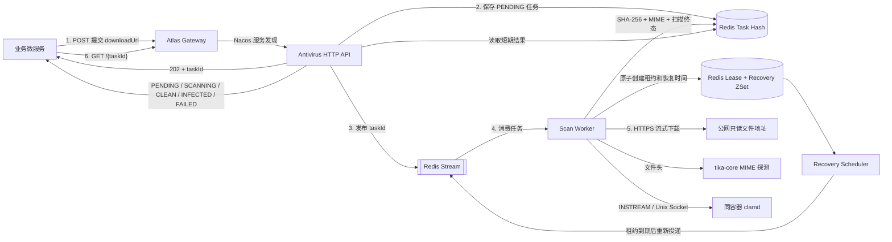
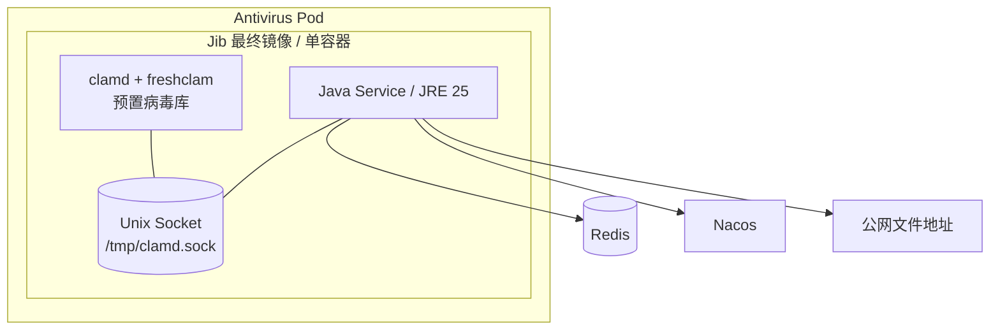
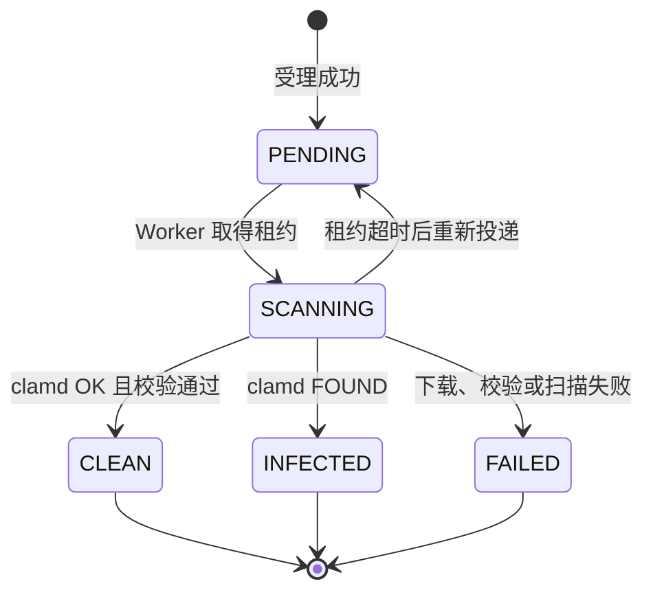

# Atlas Richie Antivirus Service

独立的异步文件病毒扫描微服务。它通过 Nacos 注册，由 Gateway 对业务服务提供 HTTP API；
使用 Redis 保存短期任务状态并通过 Redis Stream 调度任务；最终 Jib 镜像内置 ClamAV、
freshclam、病毒特征库和 JRE 25；使用 `tika-core` 做有界文件头 MIME 探测。

服务不依赖数据库、NATS、Storage 组件或任何云存储 SDK。业务服务只需要提供一个可公开读取的
HTTPS 地址，并自行决定附件状态、访问控制和审计是否持久化。

## 📖 目录

- [1. 设计边界](#1-设计边界)
- [2. 工作原理](#2-工作原理)
- [3. Pod 与镜像结构](#3-pod-与镜像结构)
- [4. 环境要求](#4-环境要求)
- [5. 配置加载](#5-配置加载)
    - [5.1 本地配置文件](#51-本地配置文件)
    - [5.2 环境变量](#52-环境变量)
    - [5.3 Nacos 配置示例](#53-nacos-配置示例)
- [6. 使用 Jib 构建容器](#6-使用-jib-构建容器)
    - [6.1 构建并发布组合基础镜像](#61-构建并发布组合基础镜像)
    - [6.2 构建最终镜像 tar](#62-构建最终镜像-tar)
    - [6.3 使用本地组合基础镜像](#63-使用本地组合基础镜像)
    - [6.4 直接构建最终镜像到 Docker daemon](#64-直接构建最终镜像到-docker-daemon)
    - [6.5 推送最终镜像仓库](#65-推送最终镜像仓库)
- [7. 使用 Helm 部署](#7-使用-helm-部署)
    - [7.1 创建 Secret](#71-创建-secret)
    - [7.2 编写生产 Values](#72-编写生产-values)
    - [7.3 检查并部署](#73-检查并部署)
- [8. Gateway 路由](#8-gateway-路由)
- [9. HTTP API](#9-http-api)
    - [9.1 提交扫描任务](#91-提交扫描任务)
    - [9.2 查询扫描结果](#92-查询扫描结果)
    - [9.3 状态机](#93-状态机)
- [10. 微服务调用方式](#10-微服务调用方式)
    - [10.1 推荐业务编排](#101-推荐业务编排)
    - [10.2 OpenFeign 示例](#102-openfeign-示例)
- [11. 下载与安全限制](#11-下载与安全限制)
- [12. ClamAV 配置](#12-clamav-配置)
- [13. 健康检查与排障](#13-健康检查与排障)
- [14. 测试](#14-测试)
- [15. 目录结构](#15-目录结构)

## 1. 设计边界

| 能力 | 负责方 |
|---|---|
| 生成公开只读或短期预签名下载 URL | 调用方 |
| 提交任务、下载文件、MIME 探测、ClamAV 扫描 | Antivirus Service |
| 暂存任务状态和扫描结果 | Antivirus Service + Redis |
| 长期审计、附件业务状态、传播和访问控制 | 调用方 |
| 对象上传、下载和签名 | 业务方选择的 Storage 实现 |

必须遵守以下放行规则：

- `CLEAN`：允许业务方将文件标记为可访问；
- `INFECTED`：禁止传播、下载、解析和执行；
- `FAILED`：扫描未形成可信结论，必须按不安全处理；
- `PENDING`、`SCANNING`：扫描尚未完成，必须保持不可访问。

## 2. 工作原理



处理过程：

1. 调用方先把自己的附件记录置为 `PENDING_SCAN`，再提交文件 URL。
2. 受理接口立即生成 `taskId`，在 Redis 写入 `PENDING` 任务，然后发布 Redis Stream 消息。
3. 接口返回 `202 Accepted`，不等待下载或病毒扫描。
4. Worker 原子取得 Redis 执行租约并写入恢复时间，随后确认 Stream 消息。
5. Worker 校验 URL 及重定向目标，只允许公网 HTTPS；文件以流方式同时送入 SHA-256、
   Tika MIME 探测和同容器的 clamd。
6. Worker 将 `CLEAN`、`INFECTED` 或 `FAILED` 写回 Redis，结果默认保留 72 小时。
7. 如果 Pod 在 `SCANNING` 期间退出，租约到期后 Recovery Scheduler 会重新投递任务。
   新实例接管后，旧实例即使恢复也不能覆盖新结果。
8. 调用方用 `taskId` 轮询结果，并把最终结论持久化到自己的业务表。

任务采用至少一次恢复语义，重复消息可能存在，但 Redis 租约保证同一时刻只有一个有效执行者。

## 3. Pod 与镜像结构



Jib 不支持在镜像中执行 `apt install` 或 Dockerfile `RUN`，也不能合并两个基础镜像。因此仓库
提供 `container/runtime-base/Dockerfile`，先把官方 `eclipse-temurin:25-jre` 和
`clamav/clamav:latest-debian13-slim` 组合成运行时基础镜像；Jib 再从这个基础镜像分层加入服务代码和
启动脚本。最终交付物仍是一个同时包含 Java、ClamAV 和预置特征库的镜像。

容器入口脚本先启动 freshclam 和 clamd，等待 Unix Socket 就绪后才启动 Java。如果 ClamAV
启动失败或其进程管理器退出，入口脚本会让整个容器失败，由 Kubernetes 重启。

## 4. 环境要求

源码构建需要：

- JDK 25；
- Maven 3.9 或更高版本；
- 能拉取默认组合基础镜像
  `registry.new.richie.cn/platform/atlas-richie-antivirus-runtime:clamav-debian13-slim-jre25`；

运行需要：

- Nacos：服务注册和可选远程配置；
- Redis：任务状态、Redis Stream、租约和恢复 ZSet；
- Kubernetes + Helm 3：生产部署；
- 可访问互联网文件地址的受控 Pod 出口；
- 已内置 ClamAV 的 Antivirus Service 镜像。

不需要业务数据库，也不需要 DDL 权限或 Liquibase。

## 5. 配置加载

### 5.1 本地配置文件

- `src/main/resources/bootstrap.yml`：Nacos 地址、命名空间、分组，以及远程配置导入；
- `src/main/resources/application.yml`：服务端口、Redis、扫描器、下载限制和 Stream Consumer。

服务会尝试导入以下 Nacos 配置，未配置时使用本地文件和环境变量：

```text
platform-cache.yaml
platform-antivirus.yaml
```

多实例必须关闭任务对象的本地二级缓存：

```yaml
spring:
  data:
    redis:
      enable-l2-caching: false
```

如果 `platform-cache.yaml` 设置了全局二级缓存，必须在 `platform-antivirus.yaml` 中为本服务保持
上述值为 `false`，否则不同 Pod 可能读取到旧的任务状态。

### 5.2 环境变量

| 环境变量 | 默认值 | 说明 |
|---|---:|---|
| `SERVER_PORT` | `9600` | HTTP 端口 |
| `NACOS_SERVER_ADDR` | `127.0.0.1:8848` | Nacos 地址 |
| `NACOS_NAMESPACE` | `public` | Nacos 命名空间 |
| `NACOS_GROUP` | `global` | Nacos 分组 |
| `NACOS_USERNAME` | 空 | Nacos 用户名，使用 Secret |
| `NACOS_PASSWORD` | 空 | Nacos 密码，使用 Secret |
| `SPRING_DATA_REDIS_HOST` | `127.0.0.1` | Redis 主机 |
| `SPRING_DATA_REDIS_PORT` | `6379` | Redis 端口 |
| `SPRING_DATA_REDIS_PASSWORD` | 空 | Redis 密码，使用 Secret |
| `SPRING_DATA_REDIS_TIMEOUT` | `3s` | Redis 超时 |
| `ANTIVIRUS_TASK_TTL` | `72h` | 任务及结果保留时间 |
| `ANTIVIRUS_TASK_STREAM` | `antivirus-scan-requests` | Redis Stream 名称 |
| `ANTIVIRUS_STREAM_GROUP` | `antivirus-service` | Consumer Group |
| `ANTIVIRUS_STREAM_CONSUMER` | Pod `HOSTNAME` | Consumer 名称 |
| `ANTIVIRUS_WORKER_CONCURRENCY` | `1` | 单 Pod 消费并发 |
| `ANTIVIRUS_STREAM_BATCH_SIZE` | `1` | 每次读取消息数 |
| `ANTIVIRUS_STREAM_MAX_LEN` | `10000` | Stream 近似最大长度 |
| `ANTIVIRUS_SCAN_LEASE_DURATION` | `10m` | 单次扫描租约 |
| `ANTIVIRUS_RECOVERY_RETRY_DELAY` | `10s` | 前置消费异常的重投延迟 |
| `ANTIVIRUS_RECOVERY_POLL_INTERVAL_MS` | `10000` | 到期任务检查间隔 |
| `ANTIVIRUS_RECOVERY_BATCH_SIZE` | `100` | 单轮最大恢复数量 |
| `ANTIVIRUS_CLAMAV_ENABLED` | `false` | 是否启用 clamd 扫描 |
| `ANTIVIRUS_CLAMAV_SOCKET_PATH` | `/tmp/clamd.sock` | clamd Unix Socket |
| `ANTIVIRUS_MAX_FILE_SIZE_BYTES` | `209715200` | Java 侧最大文件字节数 |
| `ANTIVIRUS_MIME_PROBE_BYTES` | `65536` | Tika 文件头探测字节数 |
| `ANTIVIRUS_DOWNLOAD_ALLOW_HTTP` | `false` | 是否额外允许明文 HTTP |
| `ANTIVIRUS_DOWNLOAD_CONNECT_TIMEOUT` | `5s` | 下载连接超时 |
| `ANTIVIRUS_DOWNLOAD_REQUEST_TIMEOUT` | `3m` | 单次下载请求超时 |
| `ANTIVIRUS_DOWNLOAD_MAX_REDIRECTS` | `3` | 最大重定向次数 |

`ANTIVIRUS_SCAN_LEASE_DURATION` 必须大于正常情况下“下载 + clamd 扫描”的最长总耗时。租约过短
不会写错结果，但会导致另一个 Pod 重复执行扫描。

### 5.3 Nacos 配置示例

`platform-antivirus.yaml` 可以只放需要集中管理的覆盖值：

```yaml
spring:
  data:
    redis:
      enable-l2-caching: false

platform:
  antivirus:
    task-ttl: 72h
    recovery:
      lease-duration: 10m
      poll-interval-ms: 10000
      batch-size: 100
    download:
      allow-http: false
      connect-timeout: 5s
      request-timeout: 3m
      max-redirects: 3
    clamav:
      enabled: true
      socket-path: /tmp/clamd.sock
      max-file-size-bytes: 209715200
      mime-probe-bytes: 65536
```

密码不要放入源码、Values 或 Nacos 明文配置，应通过 Kubernetes Secret 注入。

## 6. 使用 Jib 构建容器

Jib 已绑定到 Maven `package` 阶段。最终镜像基于预先发布的组合运行时基础镜像，所以每次业务
构建不需要重新安装 ClamAV，也不要求本机运行 Docker daemon。

### 6.1 构建并发布组合基础镜像

首次搭建流水线、升级 JRE 或升级 ClamAV 时，由镜像维护人员执行：

```bash
docker buildx build \
  --platform linux/amd64,linux/arm64 \
  --file atlas-richie-antivirus-service/container/runtime-base/Dockerfile \
  --tag registry.new.richie.cn/platform/atlas-richie-antivirus-runtime:clamav-debian13-slim-jre25 \
  --push \
  atlas-richie-antivirus-service/container/runtime-base
```

该基础镜像由两个官方镜像组合而成：

```text
eclipse-temurin:25-jre
clamav/clamav:latest-debian13-slim
```

ClamAV 版本镜像已经包含病毒特征库，运行时由 freshclam 增量更新。基础镜像应在 CI 中执行
漏洞扫描并锁定上游镜像 digest。普通业务代码构建不需要重复执行这一步。

本地验证基础镜像时可以只构建当前架构：

```bash
docker build \
  --file atlas-richie-antivirus-service/container/runtime-base/Dockerfile \
  --tag atlas-richie-antivirus-runtime:local \
  atlas-richie-antivirus-service/container/runtime-base
```

### 6.2 构建最终镜像 tar

在仓库根目录执行：

```bash
mvn -pl atlas-richie-antivirus-service -am clean package
```

构建会执行单元测试，并输出：

```text
atlas-richie-antivirus-service/target/
├── atlas-richie-antivirus-service-1.0.0-SNAPSHOT.jar
├── atlas-richie-antivirus-service-image.tar
├── atlas-richie-antivirus-service-image.digest
├── atlas-richie-antivirus-service-image.id
└── atlas-richie-antivirus-service-image.json
```

默认镜像名称：

```text
registry.new.richie.cn/platform/atlas-richie-antivirus-service:1.0.0-SNAPSHOT
registry.new.richie.cn/platform/atlas-richie-antivirus-service:latest
```

生成的最终镜像已经同时包含 JRE、ClamAV、freshclam、病毒库和 Java 服务，不需要另外安装
ClamAV，也不需要再拉取 Sidecar。

加载到本地 Docker：

```bash
docker load --input \
  atlas-richie-antivirus-service/target/atlas-richie-antivirus-service-image.tar
```

Jib 的 `buildTar` 会生成可加载的容器镜像归档；`jib:dockerBuild` 可以直接写入本地 Docker，
`jib:build` 可以直接推送 Registry。
完整参数可以参考
[Jib Maven Plugin 官方文档](https://github.com/GoogleContainerTools/jib/tree/master/jib-maven-plugin)。

### 6.3 使用本地组合基础镜像

Jib 可以从 Docker daemon 读取前一步构建的本地基础镜像：

```bash
mvn -pl atlas-richie-antivirus-service -am clean package \
  -Djib.from.image=docker://atlas-richie-antivirus-runtime:local \
  -Djib.to.image=registry.example.com/platform/atlas-richie-antivirus-service \
  -Ddocker.image.version=1.2.0
```

不能把 `jib.from.image` 直接改成普通 JRE 镜像，否则最终镜像将缺少 ClamAV。目标
`jib.to.image` 只填写仓库和镜像名，不要附加 tag。

### 6.4 直接构建最终镜像到 Docker daemon

先安装该模块需要的 Reactor 依赖，但跳过生命周期绑定的镜像构建，然后写入 Docker：

```bash
mvn -pl atlas-richie-antivirus-service -am install \
  -DskipTests \
  -Djib.skip=true

mvn -f atlas-richie-antivirus-service/pom.xml jib:dockerBuild \
  -Djib.to.image=atlas-richie-antivirus-service \
  -Ddocker.image.version=local
```

### 6.5 推送最终镜像仓库

Jib 会读取 Docker credential helper、`docker login` 产生的凭证或 Maven `settings.xml`：

```bash
mvn -pl atlas-richie-antivirus-service -am install -Djib.skip=true

mvn -f atlas-richie-antivirus-service/pom.xml jib:build \
  -Djib.to.image=registry.example.com/platform/atlas-richie-antivirus-service \
  -Ddocker.image.version=1.2.0
```

私有仓库应使用 HTTPS。只有明确使用测试环境 HTTP Registry 时才临时添加：

```bash
-Djib.allow.insecure.registries=true
```

## 7. 使用 Helm 部署

Chart 位于：

```text
deploy/helm/atlas-richie-antivirus
```

Helm 会创建：

- 一个 Kubernetes Deployment；
- 一个暴露 9600 端口的 ClusterIP Service；
- Java 服务 ConfigMap；
- clamd 配置 ConfigMap；
- 每个 Pod 中一个已经内置 Java、clamd、freshclam 和病毒库的 `antivirus-service` 容器。

### 7.1 创建 Secret

```bash
kubectl -n platform create secret generic antivirus-service-secret \
  --from-literal=NACOS_USERNAME='<username>' \
  --from-literal=NACOS_PASSWORD='<password>' \
  --from-literal=SPRING_DATA_REDIS_PASSWORD='<password>'
```

### 7.2 编写生产 Values

创建 `values-production.yaml`：

```yaml
replicaCount: 2

image:
  repository: registry.example.com/platform/atlas-richie-antivirus-service
  tag: "1.2.0"
  pullPolicy: IfNotPresent

imagePullSecrets:
  - name: registry-credential

existingSecret: antivirus-service-secret

config:
  nacosServerAddr: nacos.platform.svc.cluster.local:8848
  nacosNamespace: production
  nacosGroup: global
  redisHost: redis.platform.svc.cluster.local
  redisPort: "6379"
  taskTtl: 72h
  workerConcurrency: "4"
  scanLeaseDuration: 10m
  recoveryRetryDelay: 10s
  recoveryPollIntervalMs: "10000"
  recoveryBatchSize: "100"
  maxFileSizeBytes: "209715200"
  mimeProbeBytes: "65536"
  downloadAllowHttp: "false"
  downloadConnectTimeout: 5s
  downloadRequestTimeout: 3m
  downloadMaxRedirects: "3"

clamav:
  maxThreads: 4
  maxQueue: 8
  streamMaxLength: 200M
  maxScanTime: 120000
  maxFileSize: 200M
  maxScanSize: 400M

resources:
  requests:
    cpu: "1"
    memory: 2Gi
    ephemeral-storage: 1Gi
  limits:
    cpu: "4"
    memory: 5Gi
    ephemeral-storage: 4Gi
```

资源限制是 Java 和 ClamAV 的合计。Java 的 `maxFileSizeBytes`、clamd 的 `StreamMaxLength`
和 `MaxFileSize` 应保持一致。

### 7.3 检查并部署

```bash
helm lint atlas-richie-antivirus-service/deploy/helm/atlas-richie-antivirus

helm template antivirus-service \
  atlas-richie-antivirus-service/deploy/helm/atlas-richie-antivirus \
  -n platform \
  -f values-production.yaml

helm upgrade --install antivirus-service \
  atlas-richie-antivirus-service/deploy/helm/atlas-richie-antivirus \
  -n platform \
  --create-namespace \
  -f values-production.yaml \
  --wait
```

检查状态：

```bash
kubectl -n platform get pods
kubectl -n platform logs deploy/antivirus-service-atlas-richie-antivirus \
  -c antivirus-service
kubectl -n platform logs deploy/antivirus-service-atlas-richie-antivirus \
  -c clamd
```

实际 Deployment 名称受 Helm release name 和 `fullnameOverride` 影响，可先通过
`kubectl -n platform get deploy` 确认。

## 8. Gateway 路由

服务注册名是：

```text
platform-antivirus-service
```

推荐通过 Nacos 中的 Gateway 配置增加路由：

```yaml
spring:
  cloud:
    gateway:
      server:
        webflux:
          routes:
            - id: platform-antivirus-service
              uri: lb://platform-antivirus-service
              predicates:
                - Path=/antivirus/**
              filters:
                - StripPrefix=1
```

配置后，外部路径：

```text
/antivirus/internal/v1/scans
```

会转发到服务内部路径：

```text
/internal/v1/scans
```

Gateway 必须完成身份认证并生成可信的 `X-Tenant-Id`。Antivirus Service 当前依赖该租户头进行
任务隔离，不应绕过 Gateway 暴露给公网。

## 9. HTTP API

### 9.1 提交扫描任务

```http
POST /internal/v1/scans
Content-Type: application/json
X-Tenant-Id: tenant-001
```

请求字段：

| 字段 | 必填 | 类型 | 说明 |
|---|---:|---|---|
| `fileId` | 是 | string | 调用方的文件业务标识 |
| `downloadUrl` | 是 | string | 公网 HTTPS 只读地址或短期预签名地址 |
| `fileName` | 否 | string | 用于辅助 MIME 探测的文件名 |
| `expectedSize` | 否 | long | 调用方预期字节数，扫描后校验 |
| `expectedEtag` | 否 | string | 调用方预期 ETag，下载后校验 |

请求示例：

```bash
curl -i -X POST \
  'https://gateway.example.com/antivirus/internal/v1/scans' \
  -H 'Content-Type: application/json' \
  -H 'X-Tenant-Id: tenant-001' \
  -H 'Authorization: Bearer <token>' \
  -d '{
    "fileId": "file-123",
    "downloadUrl": "https://files.example.com/path/file.pdf?signature=...",
    "fileName": "file.pdf",
    "expectedSize": 1048576,
    "expectedEtag": "etag-value"
  }'
```

成功返回 `202 Accepted`：

```json
{
  "success": true,
  "data": {
    "taskId": "96dc4f80-bf1f-4e90-a2a5-fba85144c6ab",
    "fileId": "file-123",
    "status": "PENDING",
    "actualSize": null,
    "sha256": null,
    "detectedMimeType": null,
    "threatName": null,
    "engineVersion": null,
    "signatureVersion": null,
    "errorMessage": null,
    "submittedAt": "2026-07-30T15:30:00+08:00",
    "startedAt": null,
    "completedAt": null
  },
  "msg": "ok"
}
```

Redis 无法保存任务或 Stream 无法接受消息时返回 `503 Service Unavailable`：

```json
{
  "success": false,
  "data": null,
  "msg": "扫描任务暂时无法受理"
}
```

### 9.2 查询扫描结果

```http
GET /internal/v1/scans/{taskId}
X-Tenant-Id: tenant-001
```

```bash
curl \
  'https://gateway.example.com/antivirus/internal/v1/scans/96dc4f80-bf1f-4e90-a2a5-fba85144c6ab' \
  -H 'X-Tenant-Id: tenant-001' \
  -H 'Authorization: Bearer <token>'
```

干净文件：

```json
{
  "success": true,
  "data": {
    "taskId": "96dc4f80-bf1f-4e90-a2a5-fba85144c6ab",
    "fileId": "file-123",
    "status": "CLEAN",
    "actualSize": 1048576,
    "sha256": "0123456789abcdef...",
    "detectedMimeType": "application/pdf",
    "threatName": null,
    "engineVersion": "clamd",
    "signatureVersion": null,
    "errorMessage": null,
    "submittedAt": "2026-07-30T15:30:00+08:00",
    "startedAt": "2026-07-30T15:30:01+08:00",
    "completedAt": "2026-07-30T15:30:03+08:00"
  },
  "msg": "ok"
}
```

感染文件的 `status` 为 `INFECTED`，`threatName` 包含 clamd 返回的威胁名称。扫描器不可用、
下载失败、大小或 ETag 不一致等情况返回 `FAILED`，原因在 `errorMessage`。

任务不存在、已过期或租户不匹配时统一返回 HTTP 200：

```json
{
  "success": false,
  "data": null,
  "msg": "无此任务"
}
```

调用方看到 `data=null` 时，应确认自己的附件仍不可访问，并重新提交一个扫描任务。

### 9.3 状态机



Redis 中不会强制把恢复任务改回 `PENDING`，上图的 `SCANNING → PENDING` 表示逻辑上重新排队；
查询期间可能继续看到 `SCANNING`，直到新 Worker 写入终态。

## 10. 微服务调用方式

### 10.1 推荐业务编排

业务服务应采用下面的非阻塞流程：

```text
上传完成
  → 附件状态写为 PENDING_SCAN
  → POST 提交扫描任务
  → 保存 taskId
  → 定时或后台任务 GET 查询
  → CLEAN    : 附件改为 READY
  → INFECTED : 附件改为 BLOCKED
  → FAILED   : 附件改为 SCAN_FAILED，可人工处理或重新扫描
  → 无此任务  : 重新提交扫描任务
```

不要在上传请求主链路里持续阻塞等待扫描结果，也不要在 HTTP 或 Storage 原子组件内部自动调用
Antivirus Service。

### 10.2 OpenFeign 示例

业务服务可以通过 Nacos 服务发现直接调用，仍应由业务代码传递可信租户 ID：

```java
@FeignClient(name = "platform-antivirus-service")
public interface AntivirusClient {

    @PostMapping("/internal/v1/scans")
    ApiResponse<ScanTaskResponse> submit(
            @RequestHeader("X-Tenant-Id") String tenantId,
            @RequestBody SubmitScanRequest request);

    @GetMapping("/internal/v1/scans/{taskId}")
    ApiResponse<ScanTaskResponse> get(
            @RequestHeader("X-Tenant-Id") String tenantId,
            @PathVariable String taskId);
}
```

跨微服务共享时，调用方应在自己的 contract/client 模块定义与本页 API 一致的 DTO，不要依赖
Antivirus Service 的可执行 JAR。

轮询建议：

- 初始间隔 1～2 秒；
- 使用指数退避，逐步增加到 10～30 秒；
- 总等待时间由业务 SLA 决定；
- 任务超过业务等待上限仍不是终态时保持文件不可访问，而不是默认放行。

## 11. 下载与安全限制

服务默认执行：

- 只允许 HTTPS；只有显式设置 `ANTIVIRUS_DOWNLOAD_ALLOW_HTTP=true` 才允许 HTTP；
- 拒绝 URL user-info、回环、内网、链路本地、云元数据和保留 IP；
- DNS 解析出的每个地址都必须是公网地址；
- 每次重定向都重新校验，默认最多 3 次；
- 请求 `Accept-Encoding: identity`，拒绝压缩传输造成的字节语义偏差；
- 预检查 `Content-Length`，读取时再次限制实际字节数；
- 可校验 ETag 和预期大小；
- 查询响应不会回传 `downloadUrl`，避免泄露其中的临时签名。

应用层地址校验不能完全替代网络隔离。生产环境应通过 NetworkPolicy、服务网格或出口防火墙限制
Pod 出口，尤其禁止访问集群管理网段和云元数据地址。

短期下载 URL 的有效期必须覆盖排队时间、下载时间、扫描时间以及可能发生的一次恢复等待。
如果 URL 在恢复前过期，任务会进入 `FAILED`，调用方需要生成新 URL 并重新提交。

## 12. ClamAV 配置

最终 Jib 镜像继承自组合基础镜像，其中的 ClamAV 来自官方
`clamav/clamav:latest-debian13-slim`。Java 与 clamd 通过同容器 Unix Socket 通信：

```text
/tmp/clamd.sock
```

clamd 配置由 Chart 的 `clamav-configmap.yaml` 生成，主要限制包括：

- `MaxThreads`、`MaxQueue`；
- `StreamMaxLength`、`MaxFileSize`、`MaxScanSize`；
- `MaxScanTime`；
- `MaxRecursion`、`MaxFiles`。

ClamAV 启动并加载病毒库可能耗时较长。容器入口会先等待 clamd Socket，再启动 Java；
Kubernetes 的 startup/readiness/liveness Probe 检查 Java 健康端点。如果 ClamAV 初始化器
退出，入口脚本会停止 Java，使整个容器被 Kubernetes 重启。

Jib 镜像默认设置 `ANTIVIRUS_CLAMAV_ENABLED=true`。通过 JAR 直接启动且没有 clamd 时可以关闭
该开关，但所有扫描任务都会安全地终止为 `FAILED`，不会误报为 `CLEAN`。

## 13. 健康检查与排障

健康端点：

```text
/actuator/health
/actuator/health/liveness
/actuator/health/readiness
```

常见问题：

| 现象 | 检查项 |
|---|---|
| Pod 长时间未 Ready | clamd 是否已加载病毒库、`/tmp/clamd.sock` 是否创建、内存是否足够 |
| 提交返回 503 | Redis 连接、StreamMQ 配置、Redis 写权限 |
| 一直是 PENDING | Consumer 是否启动、Stream Group 配置、Worker 并发 |
| SCANNING 后重新执行 | 租约是否短于实际扫描时间、原 Pod 是否重启 |
| FAILED：非公网地址 | URL 是否解析到内网、Service、Metadata 或回环地址 |
| FAILED：大小不一致 | `expectedSize` 是否准确、文件是否在扫描期间被替换 |
| 查询“无此任务” | taskId 错误、租户不一致或 Redis TTL 已过期 |
| ClamAV 扫描失败 | Socket、clamd 日志、大小限制、扫描超时和病毒库状态 |

建议监控：

- HTTP 受理与失败率；
- Redis Stream backlog；
- `PENDING`、`SCANNING` 的数量和最老任务等待时间；
- 恢复重投次数；
- `CLEAN`、`INFECTED`、`FAILED` 数量；
- 下载与扫描耗时；
- clamd 内存、CPU、队列和病毒库更新时间。

## 14. 测试

普通单元测试不需要 Redis 或 ClamAV：

```bash
mvn -pl atlas-richie-antivirus-service test
```

EICAR 集成测试默认跳过。准备好真实 clamd Unix Socket 后执行：

```bash
ANTIVIRUS_EICAR_IT=true \
ANTIVIRUS_CLAMAV_SOCKET_PATH=/tmp/clamd.sock \
mvn -pl atlas-richie-antivirus-service \
  -Dtest=ClamdEicarIntegrationTest test
```

EICAR 是防病毒行业使用的无害测试载荷。测试要求 clamd 返回 `INFECTED`、威胁名称包含
`Eicar`，并校验扫描过程生成的 SHA-256。

## 15. 目录结构

```text
atlas-richie-antivirus-service/
├── pom.xml                         # Maven、Jib 镜像构建
├── container/runtime-base/
│   └── Dockerfile                  # JRE 25 + ClamAV 组合基础镜像
├── src/main/java/                  # HTTP、任务、下载、扫描和恢复代码
├── src/main/jib/
│   └── opt/antivirus/bin/
│       └── start-antivirus.sh       # clamd/freshclam + Java 容器入口
├── src/main/resources/
│   ├── bootstrap.yml               # Nacos
│   └── application.yml             # Redis、Stream、扫描配置
├── src/test/                       # 单元测试与可选 EICAR 集成测试
└── deploy/helm/atlas-richie-antivirus/
    ├── Chart.yaml
    ├── values.yaml
    └── templates/
        ├── deployment.yaml         # 内置 ClamAV 的单容器
        ├── service.yaml
        ├── configmap.yaml
        └── clamav-configmap.yaml
```
