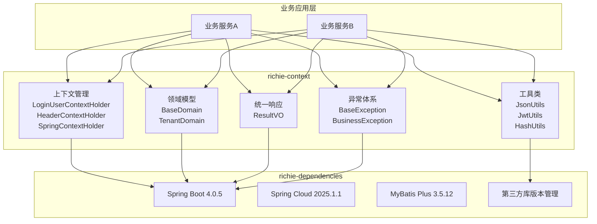

# Richie Base Platform

## 📖 概述

**Richie Base Platform** 是Richie技术中台的基础包，为整个技术平台提供统一的基础能力支撑。它包含依赖版本管理、上下文管理、领域模型、统一响应、异常体系、工具类等核心基础设施，是所有业务应用和组件的基础依赖。

## 🎯 设计理念

### 1. 统一依赖管理（Dependency Management）

通过 `richie-dependencies` 模块统一管理所有第三方依赖版本，确保整个技术平台使用一致的依赖版本：

- **避免版本冲突**：统一版本管理，避免不同模块使用不同版本导致的冲突
- **简化配置**：业务应用只需继承父 POM，无需关心具体版本号
- **统一升级**：版本升级只需在一个地方修改，所有应用自动生效

### 2. 上下文隔离（Context Isolation）

基于 `TransmittableThreadLocal` 实现线程安全的上下文管理，支持异步场景下的上下文传递：

- **用户上下文**：`LoginUserContextHolder` - 管理当前登录用户信息
- **请求头上下文**：`HeaderContextHolder` - 管理请求头信息，支持跨服务传递
- **Spring 上下文**：`SpringContextHolder` - 提供静态方式获取 Spring Bean

### 3. 统一响应格式（Unified Response）

提供统一的 API 响应格式 `ResultVO`，确保所有接口返回格式一致：

- **统一结构**：`code`、`msg`、`data`、`i18nDict`、`timestamp`
- **国际化支持**：内置国际化字典字段
- **类型安全**：泛型支持，类型安全的数据返回

### 4. 领域模型抽象（Domain Model Abstraction）

提供通用的领域模型基类，减少重复代码：

- **BaseDomain**：基础实体类，包含创建/更新时间和逻辑删除
- **TenantDomain**：多租户实体类
- **GuidDomain**：GUID 主键实体类

### 5. 异常体系（Exception Hierarchy）

提供分层的异常体系，支持业务异常和技术异常的区分：

- **BaseException**：基础异常类
- **BusinessException**：业务异常
- **PlatformRuntimeException**：平台运行时异常
- **PlatformDataAccessException**：数据访问异常

## 🏗️ 架构设计

### 模块结构

```
richie-base
├── richie-dependencies    # 依赖管理模块
│   ├── Spring Boot/Cloud 版本管理
│   ├── 第三方库版本管理
│   └── Maven 插件配置
└── richie-context         # 上下文和工具类模块
    ├── 上下文管理
    ├── 领域模型
    ├── 统一响应
    ├── 异常体系
    └── 工具类
```

### 核心组件架构



## 📦 模块说明

### richie-dependencies

**依赖管理模块**，统一管理所有第三方依赖版本。

#### 核心依赖管理

- **Spring 生态**
  - Spring Boot: `4.0.5`
  - Spring Cloud: `2025.1.1`
  - Spring Cloud Alibaba: `2025.1.0.0`
  - Spring Cloud Azure: `5.22.0`
  - Spring AI: `1.1.3`

- **数据访问**
  - MyBatis Plus: `3.5.12`
  - 动态数据源: `4.3.1`
  - MySQL Connector: `9.4.0`
  - PostgreSQL: `42.7.7`

- **缓存和消息**
  - Redisson: `4.3.0`
  - Lettuce: `6.8.1.RELEASE`

- **对象存储 SDK**
  - 阿里云 OSS: `3.18.3`
  - 腾讯云 COS: `5.6.251`
  - 华为云 OBS: `3.25.7`
  - AWS S3: `2.32.28`
  - MinIO: `8.5.17`
  - 火山引擎 TOS: `2.9.4`
  - 金山云 KS3: `1.5.0`

- **工具类库**
  - Hutool: `5.8.41`
  - Guava: `33.4.8-jre`
  - Commons Lang3: `3.18.0`
  - Jackson: Spring Boot 内置版本

- **其他**
  - Lombok: `1.18.42`
  - MapStruct: `1.6.3`
  - EasyExcel: `4.0.3`
  - Easy Rules: `4.1.0`
  - OpenTelemetry: `2.21.0`

#### Maven 插件配置

- **编译插件**：支持 JDK 25，启用预览特性
- **源码插件**：自动生成源码 JAR
- **Javadoc 插件**：生成 API 文档
- **Jib 插件**：Docker 镜像构建
- **Enforcer 插件**：版本和规则检查

### richie-context

**上下文和工具类模块**，提供基础能力支撑。

#### 上下文管理

##### LoginUserContextHolder

登录用户上下文，基于 `TransmittableThreadLocal` 实现，支持异步场景下的用户信息传递。

```java
// 设置用户信息
LoginUserContextHolder.setUserInfo(userVO);

// 获取用户信息
GeneralUserVO user = LoginUserContextHolder.getUserInfo();

// 清除上下文
LoginUserContextHolder.clear();
```

**特性**：
- 线程安全
- 支持异步传递（TransmittableThreadLocal）
- 类型安全（泛型支持）

##### HeaderContextHolder

请求头上下文，管理 HTTP 请求头信息，支持跨服务传递。

```java
// 设置请求头
HeaderContextHolder.setHeader("X-Tenant-Code", "tenant001");

// 获取请求头
String tenantCode = HeaderContextHolder.getHeader("X-Tenant-Code");

// 获取所有请求头
Map<String, String> headers = HeaderContextHolder.getContext();
```

**特性**：
- 支持自定义请求头
- 支持跨服务传递（微服务场景）
- 线程安全

##### SpringContextHolder

Spring 上下文持有者，提供静态方式获取 Spring Bean。

```java
// 根据类型获取 Bean
UserService userService = SpringContextHolder.getBean(UserService.class);

// 根据名称获取 Bean
Object bean = SpringContextHolder.getBean("userService");

// 根据注解获取 Bean
Map<String, Object> beans = SpringContextHolder.getBeansWithAnnotation(Service.class);
```

**特性**：
- 静态方法，无需依赖注入
- 支持类型和名称两种方式
- 支持注解查找

#### 领域模型

##### BaseDomain

基础实体类，包含通用字段：

```java
public class User extends BaseDomain {
    private String id;
    private String username;
    // createId, createTime, updateId, updateTime, deleted 自动继承
}
```

**包含字段**：
- `createId` - 创建人 ID（自动填充）
- `createTime` - 创建时间（自动填充）
- `updateId` - 更新人 ID（自动填充）
- `updateTime` - 更新时间（自动填充）
- `deleted` - 逻辑删除标识（MyBatis Plus）

##### TenantDomain

多租户实体类，在 `BaseDomain` 基础上增加租户字段：

```java
public class Order extends TenantDomain {
    private String id;
    // tenantId 自动继承
}
```

##### 其他领域模型

- `GuidDomain` - GUID 主键实体类
- `BehaviorDomain` - 行为领域模型
- `GeneralDomain` - 通用领域模型

#### 统一响应

##### ResultVO

统一的 API 响应格式：

```java
// 成功响应
ResultVO<User> result = ResultVO.getSuccess(user);
// 或
ResultVO<User> result = ResultVO.getSuccess("操作成功", user);

// 错误响应
ResultVO<Void> result = ResultVO.getError("操作失败");
// 或
ResultVO<Void> result = ResultVO.getError("ERROR_CODE", "操作失败");
```

**响应结构**：
```json
{
  "data": {},
  "code": "200",
  "msg": "操作成功",
  "i18nDict": {},
  "timestamp": 1234567890
}
```

**特性**：
- 统一的响应格式
- 国际化支持（i18nDict）
- 类型安全（泛型）
- 便捷的静态工厂方法

#### 异常体系

##### BaseException

基础异常类，所有自定义异常的基类。

##### BusinessException

业务异常，用于业务逻辑错误：

```java
throw new BusinessException("用户不存在");
throw new BusinessException("ERROR_CODE", "用户不存在");
```

##### PlatformRuntimeException

平台运行时异常，用于系统级错误。

##### PlatformDataAccessException

数据访问异常，用于数据库操作错误。

#### 工具类

##### JsonUtils

JSON 工具类，提供 JSON 序列化和反序列化：

```java
// 对象转 JSON
String json = JsonUtils.getInstance().toJson(user);

// JSON 转对象
User user = JsonUtils.getInstance().fromJson(json, User.class);

// 自定义日期格式
JsonUtils utils = JsonUtils.getInstance("yyyy-MM-dd");
String json = utils.toJson(user);
```

**特性**：
- 支持自定义日期格式
- 支持时区和区域设置
- 线程安全
- 自动从请求头读取日期格式

##### JwtUtils

JWT 工具类，提供 JWT 令牌的生成和解析：

```java
// 生成令牌
String token = JwtUtils.generateToken(userId, claims);

// 解析令牌
Claims claims = JwtUtils.parseToken(token);

// 验证令牌
boolean valid = JwtUtils.validateToken(token);
```

##### HashUtils

哈希工具类，提供各种哈希算法：

```java
// MD5
String md5 = HashUtils.md5(data);

// SHA-256
String sha256 = HashUtils.sha256(data);

// SHA-512
String sha512 = HashUtils.sha512(data);
```

##### RSAUtils

RSA 加密工具类，提供 RSA 加密和解密：

```java
// 加密
String encrypted = RSAUtils.encrypt(data, publicKey);

// 解密
String decrypted = RSAUtils.decrypt(encrypted, privateKey);
```

##### CommonUtils

通用工具类：

```java
// 复制对象属性（忽略空值）
CommonUtils.copyProperties(source, target, true);

// 获取进程 ID
String pid = CommonUtils.getPid();

// 字符串快速分割
String[] parts = CommonUtils.fastSplit(str, ',');
```

##### 其他工具类

- `CharacterUtils` - 字符处理工具
- `Collection2MapUtils` - 集合转 Map 工具
- `Collections` - 集合工具类
- `XmlUtils` - XML 处理工具
- `Timer` - 时间工具类

#### 网关配置

提供网关相关的配置类和枚举：

- `GatewayConfig` - 网关配置
- `AuthenticationConfig` - 认证配置
- `TokenFilterConfig` - Token 过滤器配置
- `TenantFilterConfig` - 租户过滤器配置
- `SecurityFilterConfig` - 安全过滤器配置
- `BannedConfig` - 封禁配置
- `DuplicateSubmitConfig` - 防重复提交配置
- `EccCryptoConfig` - ECC 加密配置
- `SsoConfig` - SSO 配置
- `RedirectConfig` - 重定向配置
- `DeployConfig` - 部署配置
- `CustomReturnConfig` - 自定义返回配置
- `IOAuthFilterConfig` - OAuth 过滤器配置

#### 系统监控

- `SystemUsageMonitor` - 系统使用情况监控
- `ServerClosedListener` - 服务器关闭监听器

#### 常量定义

- `GlobalConstants` - 全局常量，包含：
  - 请求头常量（Token、租户、语言、时区等）
  - 缓存 Key 常量
  - 灰度发布常量
  - 加密相关常量

## 🚀 快速开始

### 1. 添加父依赖

在业务应用的 `pom.xml` 中继承 `richie-base`：

```xml
<parent>
    <groupId>com.richie.base</groupId>
    <artifactId>atlas-richie-base</artifactId>
    <version>1.0.0-SNAPSHOT</version>
</parent>
```

### 2. 添加 context 依赖

```xml
<dependency>
    <groupId>com.richie.base</groupId>
    <artifactId>atlas-richie-context</artifactId>
</dependency>
```

### 3. 使用上下文

```java
@Service
public class UserService {
    
    public UserVO getCurrentUser() {
        // 获取当前登录用户
        GeneralUserVO user = LoginUserContextHolder.getUserInfo();
        // 业务逻辑...
    }
    
    public void processRequest() {
        // 获取请求头
        String tenantCode = HeaderContextHolder.getHeader("X-Tenant-Code");
        // 业务逻辑...
    }
}
```

### 4. 使用统一响应

```java
@RestController
public class UserController {
    
    @GetMapping("/users/{id}")
    public ResultVO<UserVO> getUser(@PathVariable String id) {
        UserVO user = userService.getUser(id);
        return ResultVO.getSuccess(user);
    }
    
    @PostMapping("/users")
    public ResultVO<Void> createUser(@RequestBody UserCreateRequest request) {
        try {
            userService.createUser(request);
            return ResultVO.getSuccess("创建成功");
        } catch (BusinessException e) {
            return ResultVO.getError(e.getMessage());
        }
    }
}
```

### 5. 使用领域模型

```java
@Data
@EqualsAndHashCode(callSuper = true)
@TableName("user")
public class User extends BaseDomain {
    @TableId(type = IdType.ASSIGN_ID)
    private String id;
    
    private String username;
    private String email;
    // createId, createTime, updateId, updateTime, deleted 自动继承
}
```

### 6. 使用工具类

```java
@Service
public class DataService {
    
    public void processData(Object data) {
        // JSON 序列化
        String json = JsonUtils.getInstance().toJson(data);
        
        // 哈希计算
        String hash = HashUtils.sha256(json);
        
        // 对象属性复制
        UserVO vo = new UserVO();
        CommonUtils.copyProperties(data, vo, true);
    }
}
```

## 📋 版本管理

### 当前版本

- **richie-base**: `1.0.0-SNAPSHOT`
- **Spring Boot**: `4.0.5`
- **Spring Cloud**: `2025.1.1`
- **JDK**: `25`

### 版本升级

版本升级遵循以下原则：

1. **向后兼容**：尽量保持 API 向后兼容
2. **统一升级**：所有依赖版本统一管理，避免版本冲突
3. **测试验证**：升级后进行全面测试

## 🎨 最佳实践

### 1. 上下文使用

- **及时清理**：使用完上下文后及时清理，避免内存泄漏
- **异步场景**：使用 `TransmittableThreadLocal` 支持异步传递
- **线程安全**：上下文是线程安全的，但要注意并发访问

```java
try {
    LoginUserContextHolder.setUserInfo(user);
    // 业务逻辑...
} finally {
    LoginUserContextHolder.clear(); // 确保清理
}
```

### 2. 异常处理

- **业务异常**：使用 `BusinessException` 处理业务逻辑错误
- **系统异常**：使用 `PlatformRuntimeException` 处理系统错误
- **统一处理**：在全局异常处理器中统一处理异常

```java
@RestControllerAdvice
public class GlobalExceptionHandler {
    
    @ExceptionHandler(BusinessException.class)
    public ResultVO<Void> handleBusinessException(BusinessException e) {
        return ResultVO.getError(e.getCode(), e.getMessage());
    }
}
```

### 3. 响应格式

- **统一使用 ResultVO**：所有接口统一使用 `ResultVO` 作为返回类型
- **国际化支持**：利用 `i18nDict` 字段支持国际化
- **错误码规范**：使用统一的错误码规范

### 4. 领域模型

- **继承基类**：实体类继承 `BaseDomain` 或相关基类
- **自动填充**：利用 MyBatis Plus 的自动填充功能
- **逻辑删除**：使用逻辑删除而非物理删除

## 🔧 配置说明

### Maven 配置

继承 `richie-base` 后，自动获得以下配置：

- JDK 版本：25
- 编码：UTF-8
- Maven 版本：3.9.0+
- 所有依赖版本统一管理

### Spring Boot 配置

无需额外配置，`richie-context` 会自动配置：

- Spring Context 自动配置
- 上下文持有者自动初始化
- 工具类自动可用

## 📚 相关文档

- [Richie Component Platform](../richie-component/README.md) - 组件库文档
- [Spring Boot 官方文档](https://spring.io/projects/spring-boot)
- [MyBatis Plus 官方文档](https://baomidou.com/)

## 🤝 贡献指南

欢迎贡献代码和文档！请遵循以下规范：

1. **代码规范**：遵循项目代码风格
2. **文档规范**：提供完整的注释和使用说明
3. **测试规范**：提供单元测试
4. **提交规范**：遵循 Conventional Commits 规范

## 🔗 相关链接

- [Richie技术中台](https://docs.richie696.cn/)
- [问题反馈](richie696@icloud.com)
- [功能建议](richie696@icloud.com)

---

**Richie Base Platform** - 技术中台的基础支撑 🚀

