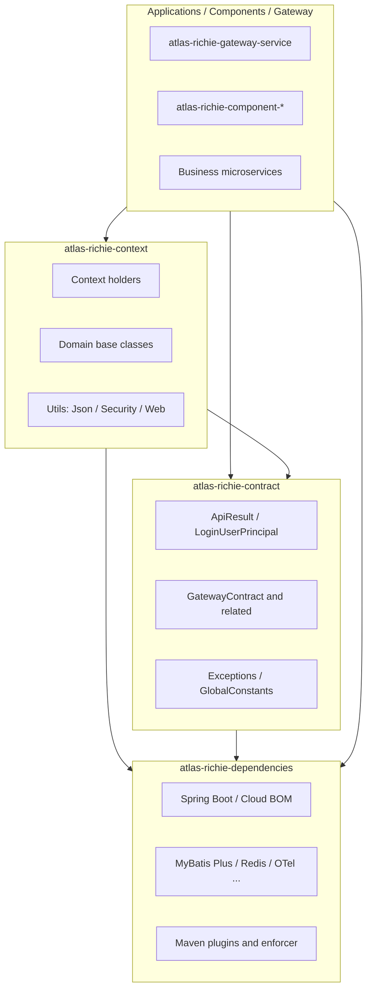
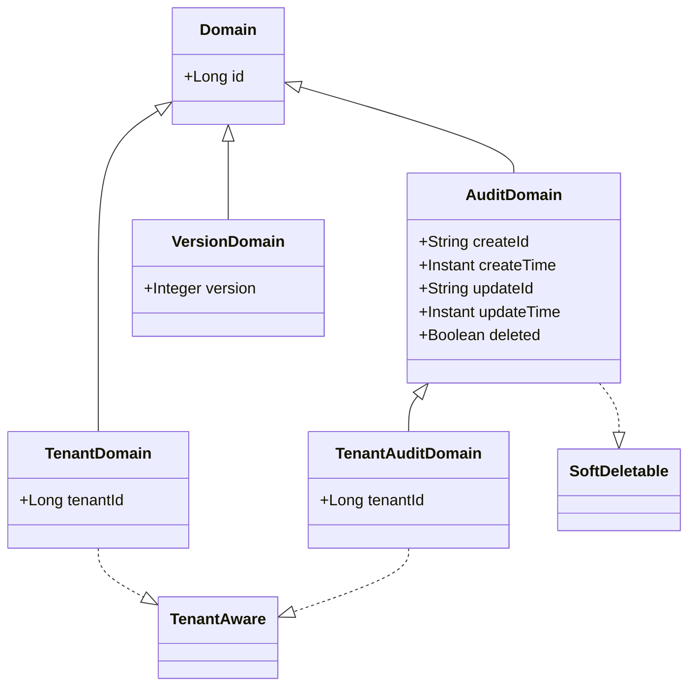

# Atlas Richie Base

**Languages:** [English](README.md) | [简体中文](README.zh.md)

## 📖 Overview

**Atlas Richie Base** (`atlas-richie-base`) is the **foundation aggregator** of the Atlas Richie middle platform. It provides unified dependency versions, cross-service contracts, and runtime context capabilities for the component library and business applications.

The base layer consists of four submodules with clear boundaries:

| Module | ArtifactId | Responsibility |
|--------|------------|----------------|
| Dependency BOM | `atlas-richie-dependencies` | Third-party and internal dependency versions, Maven plugins, build conventions |
| Shared contract | `atlas-richie-contract` | Cross-service models, exceptions, gateway configuration contracts (lightweight, optional standalone dependency) |
| Runtime context | `atlas-richie-context` | Thread context, domain base classes, utilities, JSON auto-configuration (depends on contract) |
| Testing support | `atlas-richie-testing-support` | Testcontainers orchestration, Redis integration test base classes, Spring property initializers |

> **Design note:** Cross-service contracts were extracted from `context` into `contract`, so gateway, messaging, MFA, and similar modules can depend on a lightweight JAR without pulling in Servlet, JWT, and other runtime dependencies.

## 🏗️ Module structure



### Directory layout

```
atlas-richie-base/
├── pom.xml                          # Aggregator POM; imports Spring AI / AgentScope BOMs
├── atlas-richie-dependencies/       # Dependency and plugin version BOM (packaging=pom)
├── atlas-richie-contract/           # Cross-service contracts (packaging=jar)
│   └── src/main/java/com/richie/contract/
│       ├── constant/                # Global constants
│       ├── exception/               # Platform exception hierarchy
│       ├── model/                   # API response, user principal, pagination, stream marker
│       └── gateway/                 # Gateway cross-service configuration contracts
├── atlas-richie-context/            # Runtime capabilities (packaging=jar)
│   └── src/main/java/com/richie/context/
│       ├── common/api/              # Context holders, Spring helpers
│       ├── common/api/domain/        # MyBatis-Plus domain base classes
│       └── utils/                   # data / security / spring / web / time
└── atlas-richie-testing-support/    # Integration testing infrastructure (packaging=jar)
    └── src/main/java/com/richie/testing/
        ├── container/               # Reusable container mode enum
        ├── docker/                  # Testcontainers environment setup
        ├── env/                     # Integration test policies (CI/local)
        ├── redis/                   # Redis container support & test base classes
        └── spring/                  # Spring property initializer helpers
```

---

## 📦 atlas-richie-dependencies

**Role:** Single source of truth for dependency versions and build conventions across the platform.

### Responsibilities

- **Spring stack BOMs:** Spring Boot, Spring Cloud, Spring Cloud Alibaba, Spring Cloud Azure, Spring AI, Spring AI Alibaba, AgentScope (some imported via the `atlas-richie-base` aggregator POM).
- **Data and middleware:** MyBatis Plus, dynamic datasource, MySQL/PostgreSQL drivers, Redisson, Liquibase, Elasticsearch client, and more.
- **Object storage SDKs:** Aligned versions for OSS, COS, OBS, S3, MinIO, TOS, KS3, etc.
- **Observability:** OpenTelemetry, Brave (Zipkin).
- **Internal modules:** `atlas-richie-contract`, `atlas-richie-context` at `${middle.platform.version}` (i.e. `${revision}`).
- **Maven plugins:** Compile (JDK 25), sources/Javadoc, Jib, Enforcer, flatten (from platform root `pluginManagement`).

### Usage

Applications and component modules typically **inherit** this POM (not a JAR dependency):

```xml
<parent>
    <groupId>com.richie.base</groupId>
    <artifactId>atlas-richie-dependencies</artifactId>
    <version>${revision}</version>
    <relativePath>../atlas-richie-base/atlas-richie-dependencies/pom.xml</relativePath>
</parent>
```

Omit versions on managed dependencies; the BOM applies them.

---

## 📦 atlas-richie-contract

**Role:** Lightweight **shared contract** JAR — data structures, exceptions, and configuration binding classes only. Used by the gateway, business services, and components to align semantics at compile time.

### Packages and types

| Package | Contents | Typical consumers |
|---------|----------|-------------------|
| `com.richie.contract.model` | `ApiResult` unified API response; `LoginUserPrincipal`; `SearchRequest` pagination; `BaseStreamMessage` stream marker | All REST services, gateway |
| `com.richie.contract.gateway.config` | `GatewayContract` (`platform.gateway` prefix); `TokenFilterConfig`; `TenantFilterConfig`; `DeployConfig` canary | Gateway, service interceptors, Messaging/MQTT/MFA |
| `com.richie.contract.gateway.model` | `OAuth2AuditEvent` / `OAuth2AuditEventType`; `OAuth2Constants` | Gateway audit publish, general-service consume |
| `com.richie.contract.exception` | `BaseException`, `BusinessException`, `PlatformRuntimeException`, `PlatformDataAccessException` | Global exception handlers |
| `com.richie.contract.constant` | `GlobalConstants` | Platform-wide |

### GatewayContract (core)

Binds to configuration prefix **`platform.gateway`**. It shares the same prefix as the gateway-internal `GatewayConfig`; each `@ConfigurationProperties` type maps only its own fields, so **existing Nacos/YAML for deployed services need no change**.

Shared cross-service fields:

- **`auditEnabled`:** Master audit switch (publisher and consumer must agree)
- **`token`:** Token filter allow/deny lists, login paths, etc.
- **`tenant`:** Multi-tenant filter toggle and header conventions
- **`deploy`:** Canary (gray) flags for gateway load balancing and async propagation

Gateway-only settings (ECC encryption, SSO, circuit breaking, etc.) stay inside `atlas-richie-gateway-service` and are **not** part of this contract.

### Dependency profile

- Minimal dependencies: `spring-boot-autoconfigure`, Jackson annotations, Validation API, MyBatis Plus Extension (pagination types).
- `spring-cloud-context` is **provided** (`@RefreshScope` without forcing Spring Cloud on consumers).

### Contract-only dependency

Use when you need aligned contracts but **not** Servlet/JWT/full utilities, for example:

- `atlas-richie-component-messaging-core`
- `atlas-richie-component-mfa-core`
- `atlas-richie-component-mqtt`

```xml
<dependency>
    <groupId>com.richie.base</groupId>
    <artifactId>atlas-richie-contract</artifactId>
</dependency>
```

---

## 📦 atlas-richie-context

**Role:** Runtime foundation — context propagation, entity base classes, common utilities, and JSON extension points.

It depends on `atlas-richie-contract` and **re-exports** it transitively so both `com.richie.contract.*` and `com.richie.context.*` remain available after upgrades (backward-compatible import paths).

### Packages and capabilities

| Package | Capability |
|---------|------------|
| `com.richie.context.common.api` | `LoginUserContextHolder`, `HeaderContextHolder`, `SpringContextHolder` (TTL / Spring) |
| `com.richie.context.common.api.domain` | Domain base class hierarchy (below) |
| `com.richie.context.utils.data` | `JsonUtils`, `XmlUtils`, collection helpers; `JsonUtilsModuleCustomizer` extension |
| `com.richie.context.utils.data.config` | `JsonUtilsModuleAutoConfiguration` (Boot auto-config) |
| `com.richie.context.utils.security` | `HashUtils`, `RSAUtils`, `SignatureUtils` |
| `com.richie.context.utils.spring` | `JwtUtils`, `SpringBeanUtils`, `CommonUtils` |
| `com.richie.context.utils.web`         | `ServletUtils`                                                                        |

### Auto-configuration

Registered in `META-INF/spring/org.springframework.boot.autoconfigure.AutoConfiguration.imports`:

- `SpringContextHolder`
- `JsonUtilsModuleAutoConfiguration` (collects `JsonUtilsModuleCustomizer` beans and registers modules on global `JsonUtils`)

### Domain model hierarchy



| Base class | Description |
|------------|-------------|
| `Domain` | Snowflake `id` (`IdType.ASSIGN_ID`) |
| `AuditDomain` | Audit fields + logical delete (`@TableLogic`) |
| `TenantAuditDomain` | Audit + logical delete + `tenantId` |
| `TenantDomain` | Tenant field only, no audit |
| `VersionDomain` | Optimistic lock `version` |

### Context management

`LoginUserContextHolder` uses **`TransmittableThreadLocal`** for user and token propagation across thread pools and async work. The user type is **`LoginUserPrincipal`** from the contract module (subclass as needed).

```java
try {
    LoginUserContextHolder.setUserInfo(loginUser);
    LoginUserContextHolder.setToken(accessToken);
    // business logic
    String tenantCode = LoginUserContextHolder.getTenantCode();
} finally {
    LoginUserContextHolder.clear();
}
```

---

## 📦 atlas-richie-testing-support

**Role:** Integration testing infrastructure — Testcontainers environment orchestration, Redis container lifecycle management, and Spring property injection utilities for component integration tests.

### Key classes

| Package | Class | Purpose |
|---------|-------|---------|
| `com.richie.testing.container` | `ContainerMode` | Enum for container reuse mode (local vs. CI) |
| `com.richie.testing.docker` | `TestcontainersEnvironment` | Docker environment detection and resource settings |
| `com.richie.testing.env` | `IntegrationTestPolicy` | Test execution policy — determines whether integration tests should run based on environment conditions |
| `com.richie.testing.env` | `TestEnv` | Environment key constants for property-driven test behaviour |
| `com.richie.testing.redis` | `RedisContainerSupport` | Manages a singleton Redis Testcontainer, reusable across all component integration tests |
| `com.richie.testing.redis` | `AbstractRedisIntegrationTestBase` | Base class for Redis integration tests — auto-starts and configures the Redis container |
| `com.richie.testing.redis` | `GenericRedisIntegrationTestSupport` | Generic support bean providing Redis connection coordinates (host, port, password) |
| `com.richie.testing.redis` | `RedisIntegrationTestAccess` | Accessor interface for retrieving configured Redis parameters in test context |
| `com.richie.testing.spring` | `SpringPropertyInitializer` | Applies dynamic properties (from test containers, etc.) to `ConfigurableApplicationContext` |
| `com.richie.testing.spring` | `PropertyContributor` | Lambda-based callback interface for supplying property pairs to the initializer |

### Design highlights

- **Singleton container reuse** across multiple test suites — the Redis container is started once and reused, significantly reducing CI pipeline time.
- **Environment-aware** — `IntegrationTestPolicy` checks system properties or environment variables to decide whether to start external containers (avoids Docker dependency in non-integration contexts).
- **Declarative property injection** — `SpringPropertyInitializer` bridge makes container dynamic ports available to Spring `@DynamicPropertySource` or application context initializers.

### Usage (within a component module)

```java
public class MyComponentRedisIntegrationTest extends AbstractRedisIntegrationTestBase {

    @Test
    void testWithRedis() {
        // Redis is already available via inherited setUp()
        // Connection details accessible via RedisIntegrationTestAccess
    }
}
```

```xml
<dependency>
    <groupId>com.richie.base</groupId>
    <artifactId>atlas-richie-testing-support</artifactId>
    <scope>test</scope>
</dependency>
```

---

## 🚀 Quick start

### 1. Inherit the BOM (recommended)

```xml
<parent>
    <groupId>com.richie.base</groupId>
    <artifactId>atlas-richie-dependencies</artifactId>
    <version>1.0.0-SNAPSHOT</version>
    <relativePath>../atlas-richie-base/atlas-richie-dependencies/pom.xml</relativePath>
</parent>
```

### 2. Add runtime capabilities

```xml
<dependency>
    <groupId>com.richie.base</groupId>
    <artifactId>atlas-richie-context</artifactId>
</dependency>
```

### 3. Unified API response (ApiResult)

```java
@RestController
public class UserController {

    @GetMapping("/users/{id}")
    public ApiResult<UserVO> getUser(@PathVariable Long id) {
        return ApiResult.success(userService.getById(id));
    }

    @PostMapping("/users")
    public ApiResult<Void> create(@RequestBody UserCreateRequest req) {
        userService.create(req);
        return ApiResult.success("Created successfully", null);
    }
}
```

Response fields: `success`, `code`, `msg`, `data`, `i18nDict`, `timestamp`.

### 4. Extend domain base classes

```java
@Data
@EqualsAndHashCode(callSuper = true)
@TableName("sys_user")
public class User extends TenantAuditDomain {
    private String username;
    private String email;
    // id, audit fields, tenantId, deleted from base classes
}
```

### 5. Gateway contract configuration

```yaml
platform:
  gateway:
    audit-enabled: true
    token:
      enabled: true
      # ... TokenFilterConfig properties
    tenant:
      enabled: true
    deploy:
      enabled: true
      # ... DeployConfig canary properties
```

Business services that use `GatewayContract` read the **same** configuration shape as the gateway.

---

## 📋 Dependency selection guide

| Need | Recommended dependency |
|------|------------------------|
| Unified Maven versions only | `parent` → `atlas-richie-dependencies` |
| ApiResult, GatewayContract, exceptions only | `atlas-richie-contract` |
| Web services, utilities, context, domain bases | `atlas-richie-context` (includes contract) |
| Integration testing with Testcontainers | `atlas-richie-testing-support` (scope: test) |
| Component BOM | `atlas-richie-component-dependencies` (manages context/contract versions) |

---

## 🔧 Versions

| Item | Version |
|------|---------|
| Platform `${revision}` | `1.0.0-SNAPSHOT` |
| JDK | 25 |
| Spring Boot | 4.0.6 |
| Spring Cloud | 2025.1.1 |
| MyBatis Plus | 3.5.16 (defined in BOM) |

Upgrade policy: change versions **only in `atlas-richie-dependencies`** for platform-wide effect; contract changes require compatibility review with the gateway and business services.

---

## 🎨 Best practices

1. **Separate contract from implementation:** Cross-service DTOs and config shapes in `contract`; Servlet/JWT/heavy utilities in `context` or application modules.
2. **Clear context promptly:** Call `LoginUserContextHolder.clear()` in a Filter/Interceptor `finally` block.
3. **Layer exceptions:** `BusinessException` for expected business errors; `PlatformRuntimeException` / `PlatformDataAccessException` for infrastructure.
4. **Align audit and canary switches:** `GatewayContract.auditEnabled` and `DeployConfig` must match between publishers and consumers.
5. **Pick base classes intentionally:** `AuditDomain` / `TenantAuditDomain` when auditing is required; `TenantDomain` for tenant only; `VersionDomain` for concurrent updates.

---

## 📚 Related documentation

- [Atlas Richie Platform](../README.md) · [简体中文](../README.zh.md)
- [Atlas Richie Component](../atlas-richie-component/README.md)
- [Atlas Richie Gateway Service](../atlas-richie-gateway-service/README.md)
- [Contributing](../CONTRIBUTING.md) · [简体中文](../CONTRIBUTING.zh.md)

---

**Atlas Richie Base** — unified versions, shared contracts, runtime foundation
