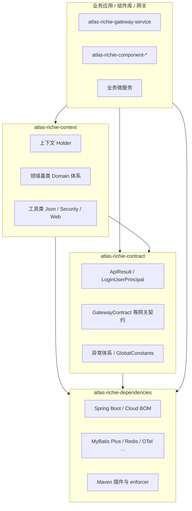
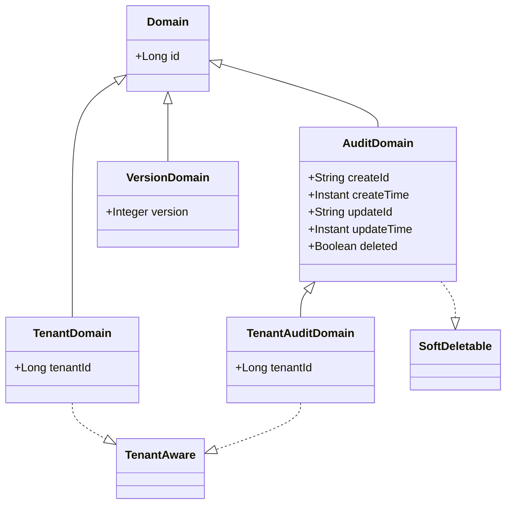

# Atlas Richie Base

**Languages:** [English](README.md) | [简体中文](README.zh.md)

## 📖 概述

**Atlas Richie Base**（`atlas-richie-base`）是 Atlas Richie 技术中台的**基础层聚合模块**，为组件库与业务应用提供统一的依赖版本、跨服务契约与运行时上下文能力。

基础层由四个子模块组成，职责边界清晰：

| 模块        | ArtifactId                     | 职责                                                         |
|-----------|--------------------------------|------------------------------------------------------------|
| 依赖 BOM    | `atlas-richie-dependencies`    | 统一第三方与平台内部依赖版本、Maven 插件与构建约定                                 |
| 共享契约      | `atlas-richie-contract`        | 跨服务共享的模型、异常、网关配置契约（轻量、可独立依赖）                                 |
| 运行时上下文    | `atlas-richie-context`         | 线程上下文、领域基类、工具类、JSON 自动配置（依赖 contract）                        |
| 测试支撑      | `atlas-richie-testing-support` | 集成测试基础设施——Testcontainers 容器编排、Redis 集成测试基类、Spring 属性注入工具 |

> **设计要点**：将原先集中在 `context` 中的「跨服务契约」拆到 `contract`，使网关、消息、MFA 等模块只需依赖轻量 JAR，避免拉入 Servlet、JWT 等运行时依赖。

## 🏗️ 模块结构



### 目录结构

```
atlas-richie-base/
├── pom.xml                          # 聚合 POM，补充 Spring AI / AgentScope 等 BOM import
├── atlas-richie-dependencies/       # 依赖与插件版本 BOM（packaging=pom）
├── atlas-richie-contract/           # 跨服务契约（packaging=jar）
│   └── src/main/java/com/richie/contract/
│       ├── constant/                # 全局常量
│       ├── exception/               # 平台异常体系
│       ├── model/                   # API 响应、用户主体、分页、流消息标记
│       └── gateway/                 # 网关跨服务配置契约
├── atlas-richie-context/            # 运行时能力（packaging=jar）
│   └── src/main/java/com/richie/context/
│       ├── common/api/              # 上下文 Holder、Spring 工具
│       ├── common/api/domain/        # MyBatis-Plus 领域基类
│       └── utils/                   # data / security / spring / web / time
└── atlas-richie-testing-support/    # 集成测试基础设施（packaging=jar）
    └── src/main/java/com/richie/testing/
        ├── container/               # 容器复用模式枚举
        ├── docker/                  # Testcontainers 环境配置
        ├── env/                     # 集成测试策略（CI/本地）
        ├── redis/                   # Redis 容器管理 & 测试基类
        └── spring/                  # Spring 属性注入工具
```

---

## 📦 atlas-richie-dependencies

**定位**：全平台依赖版本与构建约定的单一事实来源（BOM）。

### 主要职责

- **Spring 生态 BOM**：Spring Boot、Spring Cloud、Spring Cloud Alibaba、Spring Cloud Azure、Spring AI、Spring AI Alibaba、AgentScope 等（部分由 `atlas-richie-base` 聚合 POM 再 import）。
- **数据与中间件**：MyBatis Plus、动态数据源、MySQL/PostgreSQL 驱动、Redisson、Liquibase、Elasticsearch 客户端等。
- **对象存储 SDK**：OSS、COS、OBS、S3、MinIO、TOS、KS3 等版本对齐。
- **可观测性**：OpenTelemetry、Brave（Zipkin）相关版本。
- **平台内部模块**：`atlas-richie-contract`、`atlas-richie-context` 版本 `${middle.platform.version}`（即 `${revision}`）。
- **Maven 插件**：编译（JDK 25）、源码/Javadoc、Jib、Enforcer、flatten 等（继承自平台根 POM 的 pluginManagement）。

### 使用方式

业务应用或组件模块通常**继承**该 POM（而非直接依赖其 JAR）：

```xml
<parent>
    <groupId>com.richie.base</groupId>
    <artifactId>atlas-richie-dependencies</artifactId>
    <version>${revision}</version>
    <relativePath>../atlas-richie-base/atlas-richie-dependencies/pom.xml</relativePath>
</parent>
```

声明具体依赖时**无需写 version**，由 BOM 统一管理。

---

## 📦 atlas-richie-contract

**定位**：跨服务共享的**轻量契约包**——只包含数据结构、异常与配置绑定类，供网关、业务服务、组件在编译期对齐语义。

### 包与类型说明

| 包路径                                  | 主要内容                                                                                                | 典型使用方                         |
|--------------------------------------|-----------------------------------------------------------------------------------------------------|-------------------------------|
| `com.richie.contract.model`          | `ApiResult` 统一 API 响应；`LoginUserPrincipal` 登录用户主体；`SearchRequest` 分页查询；`BaseStreamMessage` 流消息标记    | 所有 REST 服务、网关                 |
| `com.richie.contract.gateway.config` | `GatewayContract`（`platform.gateway` 前缀）；`TokenFilterConfig`；`TenantFilterConfig`；`DeployConfig` 灰度 | 网关、业务服务拦截器、Messaging/MQTT/MFA |
| `com.richie.contract.gateway.model`  | `OAuth2AuditEvent` / `OAuth2AuditEventType`；`OAuth2Constants`                                       | 网关审计发布、general-service 消费     |
| `com.richie.contract.exception`      | `BaseException`、`BusinessException`、`PlatformRuntimeException`、`PlatformDataAccessException`        | 全局异常处理                        |
| `com.richie.contract.constant`       | `GlobalConstants` 平台级常量                                                                             | 全平台                           |

### GatewayContract（核心）

绑定配置前缀 **`platform.gateway`**，与网关内部 `GatewayConfig` 共用同一前缀，各 `@ConfigurationProperties` 只映射自身字段，**已上线服务的 Nacos/YAML 无需改动**。

跨服务共享字段包括：

- **`auditEnabled`**：审计总开关（网关发布与消费端须一致）
- **`token`**：Token 过滤器黑白名单、登录路径等
- **`tenant`**：多租户过滤器开关与请求头约定
- **`deploy`**：灰度（金丝雀）标识，供网关负载均衡及异步链路透传

网关专属配置（ECC 加密、SSO、熔断等）保留在 `atlas-richie-gateway-service` 内部，**不在**本契约中。

### 依赖特点

- 依赖尽量轻：`spring-boot-autoconfigure`、Jackson 注解、Validation API、MyBatis Plus Extension（分页模型）等。
- `spring-cloud-context` 为 **provided**（支持 `@RefreshScope`，不强制下游引入 Spring Cloud）。

### 仅依赖 contract 的场景

适合 **不需要** Servlet/JWT/完整工具链、只需对齐契约的模块，例如：

- `atlas-richie-component-messaging-core`
- `atlas-richie-component-mfa-core`
- `atlas-richie-component-mqtt`

```xml
<dependency>
    <groupId>com.richie.base</groupId>
    <artifactId>atlas-richie-contract</artifactId>
</dependency>
```

---

## 📦 atlas-richie-context

**定位**：应用运行时基础能力——上下文传递、实体基类、通用工具与 JSON 扩展点。

依赖 `atlas-richie-contract` 并**传递暴露**，保证升级后 `com.richie.contract.*` 与 `com.richie.context.*` 可同时使用（兼容历史 import 路径）。

### 包与能力说明

| 包路径                                    | 能力                                                                                    |
|----------------------------------------|---------------------------------------------------------------------------------------|
| `com.richie.context.common.api`        | `LoginUserContextHolder`、`HeaderContextHolder`、`SpringContextHolder`（基于 TTL / Spring） |
| `com.richie.context.common.api.domain` | 领域基类体系（见下文）                                                                           |
| `com.richie.context.utils.data`        | `JsonUtils`、`XmlUtils`、集合工具；`JsonUtilsModuleCustomizer` 扩展点                           |
| `com.richie.context.utils.data.config` | `JsonUtilsModuleAutoConfiguration`（Boot 自动配置）                                         |
| `com.richie.context.utils.security`    | `HashUtils`、`RSAUtils`、`SignatureUtils`                                               |
| `com.richie.context.utils.spring`      | `JwtUtils`、`SpringBeanUtils`、`CommonUtils`                                            |
| `com.richie.context.utils.web`         | `ServletUtils`                                                                        |
| `com.richie.context.utils.time`        | `Timer`                                                                               |

### 自动配置

`META-INF/spring/org.springframework.boot.autoconfigure.AutoConfiguration.imports` 注册：

- `SpringContextHolder`
- `JsonUtilsModuleAutoConfiguration`（收集所有 `JsonUtilsModuleCustomizer` Bean，注册到全局 `JsonUtils`）

### 领域模型继承体系



| 基类 | 说明 |
|------|------|
| `Domain` | 雪花算法主键 `id`（`IdType.ASSIGN_ID`） |
| `AuditDomain` | 审计字段 + 逻辑删除（`@TableLogic`） |
| `TenantAuditDomain` | 审计 + 逻辑删除 + `tenantId` |
| `TenantDomain` | 仅租户字段，无审计 |
| `VersionDomain` | 乐观锁 `version` |

### 上下文管理

`LoginUserContextHolder` 使用 **`TransmittableThreadLocal`**，支持线程池/异步场景下的用户与 Token 传递；用户类型为契约包中的 **`LoginUserPrincipal`**（可子类扩展）。

```java
try {
    LoginUserContextHolder.setUserInfo(loginUser);
    LoginUserContextHolder.setToken(accessToken);
    // 业务逻辑
    String tenantCode = LoginUserContextHolder.getTenantCode();
} finally {
    LoginUserContextHolder.clear();
}
```

---

## 📦 atlas-richie-testing-support

**定位**：集成测试基础设施——Testcontainers 容器编排、Redis 容器生命周期管理、Spring 属性注入工具，面向各组件模块的集成测试场景。

### 核心类说明

| 包路径                                   | 类                           | 用途                                    |
|---------------------------------------|-----------------------------|---------------------------------------|
| `com.richie.testing.container`        | `ContainerMode`             | 容器复用模式枚举（本地/CI）                        |
| `com.richie.testing.docker`           | `TestcontainersEnvironment` | Docker 环境探测与资源限制                        |
| `com.richie.testing.env`              | `IntegrationTestPolicy`     | 测试执行策略——判断是否应运行集成测试（基于环境条件）               |
| `com.richie.testing.env`              | `TestEnv`                   | 测试环境常量 Key                            |
| `com.richie.testing.redis`            | `RedisContainerSupport`     | 管理全局单例 Redis Testcontainer，跨组件集测复用        |
| `com.richie.testing.redis`            | `AbstractRedisIntegrationTestBase` | Redis 集成测试基类——自动启动并配置 Redis 容器         |
| `com.richie.testing.redis`            | `GenericRedisIntegrationTestSupport` | 通用支撑 Bean，提供 Redis 连接坐标（host、port、password） |
| `com.richie.testing.redis`            | `RedisIntegrationTestAccess` | 获取 Redis 配置参数的访问器接口                   |
| `com.richie.testing.spring`           | `SpringPropertyInitializer` | 将动态属性（如容器端口）注入 `ConfigurableApplicationContext` |
| `com.richie.testing.spring`           | `PropertyContributor`       | 函数式回调接口，提供属性键值对                        |

### 设计要点

- **单例容器复用**：整个测试会话中只启动一次 Redis 容器，大幅缩短 CI 流水线时间。
- **环境感知**：`IntegrationTestPolicy` 根据系统属性或环境变量决定是否启动外部容器，避免非集成场景下的 Docker 依赖。
- **声明式属性注入**：`SpringPropertyInitializer` 桥接 Testcontainers 动态端口与 Spring `@DynamicPropertySource`，开箱即用。

### 使用方式（组件模块内）

```java
public class MyComponentRedisIntegrationTest extends AbstractRedisIntegrationTestBase {

    @Test
    void testWithRedis() {
        // Redis 已通过基类 setUp() 自动就绪
        // 通过 RedisIntegrationTestAccess 获取连接参数
    }
}
```

```xml
<dependency>
    <groupId>com.richie.base</groupId>
    <artifactId>atlas-richie-testing-support</artifactId>
    <scope>test</scope>
</dependency>
```

---

## 🚀 快速开始

### 1. 继承 BOM（推荐）

```xml
<parent>
    <groupId>com.richie.base</groupId>
    <artifactId>atlas-richie-dependencies</artifactId>
    <version>1.0.0-SNAPSHOT</version>
    <relativePath>../atlas-richie-base/atlas-richie-dependencies/pom.xml</relativePath>
</parent>
```

### 2. 引入运行时能力

```xml
<dependency>
    <groupId>com.richie.base</groupId>
    <artifactId>atlas-richie-context</artifactId>
</dependency>
```

### 3. 统一 API 响应（ApiResult）

```java
@RestController
public class UserController {

    @GetMapping("/users/{id}")
    public ApiResult<UserVO> getUser(@PathVariable Long id) {
        return ApiResult.success(userService.getById(id));
    }

    @PostMapping("/users")
    public ApiResult<Void> create(@RequestBody UserCreateRequest req) {
        userService.create(req);
        return ApiResult.success("创建成功", null);
    }
}
```

响应字段：`success`、`code`、`msg`、`data`、`i18nDict`、`timestamp`。

### 4. 实体继承领域基类

```java
@Data
@EqualsAndHashCode(callSuper = true)
@TableName("sys_user")
public class User extends TenantAuditDomain {
    private String username;
    private String email;
    // id、审计字段、tenantId、deleted 由基类提供
}
```

### 5. 网关契约配置示例

```yaml
platform:
  gateway:
    audit-enabled: true
    token:
      enabled: true
      # ... TokenFilterConfig 字段
    tenant:
      enabled: true
    deploy:
      enabled: true
      # ... DeployConfig 灰度字段
```

业务服务引入 `GatewayContract` 即可与网关读取**同一份**配置结构。

---

## 📋 依赖选择指南

| 需求                                     | 推荐依赖                                                                    |
|----------------------------------------|-------------------------------------------------------------------------|
| 仅需统一 Maven 版本                          | `parent` → `atlas-richie-dependencies`                                  |
| 仅需 ApiResult、GatewayContract、异常类       | `atlas-richie-contract`                                                 |
| Web 服务、工具类、上下文、领域基类                    | `atlas-richie-context`（已含 contract）                                     |
| 集成测试（Testcontainers 容器编排、Redis 集测基类）  | `atlas-richie-testing-support`（scope: test）                             |
| 组件 BOM                                 | `atlas-richie-component-dependencies`（内部已管理 context/contract 版本）        |

---

## 🔧 版本信息

| 项                      | 版本               |
|------------------------|------------------|
| Platform `${revision}` | `1.0.0-SNAPSHOT` |
| JDK                    | 25               |
| Spring Boot            | 4.0.6            |
| Spring Cloud           | 2025.1.1         |
| MyBatis Plus           | 3.5.16（BOM 内定义）  |

版本升级原则：**在 `atlas-richie-dependencies` 单点调整**，全平台继承；契约类变更需评估网关与各业务服务的配置兼容性。

---

## 🎨 最佳实践

1. **契约与实现分离**：跨服务约定的配置与 DTO 放在 `contract`；带 Servlet/JWT/重工具的逻辑放在 `context` 或业务模块。
2. **上下文及时清理**：在 Filter/Interceptor 的 `finally` 中调用 `LoginUserContextHolder.clear()`。
3. **异常分层**：业务可预期错误用 `BusinessException`；基础设施错误用 `PlatformRuntimeException` / `PlatformDataAccessException`。
4. **审计与灰度开关一致**：`GatewayContract.auditEnabled`、`DeployConfig` 在发布端与消费端配置应对齐。
5. **实体基类按需选择**：需要审计用 `AuditDomain` / `TenantAuditDomain`；仅需租户用 `TenantDomain`；并发更新用 `VersionDomain`。

---

## 📚 相关文档

- [Atlas Richie Platform 总览](../README.md) · [简体中文](../README.zh.md)
- [Atlas Richie Component](../atlas-richie-component/README.md)
- [Atlas Richie Gateway Service](../atlas-richie-gateway-service/README.md)
- [贡献指南](../CONTRIBUTING.md) · [简体中文](../CONTRIBUTING.zh.md)

---

**Atlas Richie Base** — 统一版本、共享契约、运行时底座
