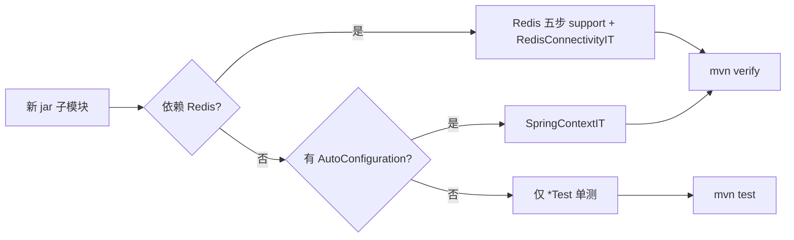

# atlas-richie-testing-support

平台级**集成测试公共支撑库**：统一 Testcontainers（Docker）探测、中间件容器拉起、Spring 集测属性注入，以及跨组件一致的环境变量约定。

业务组件（如 `atlas-richie-component-cache`）只需：

1. 依赖本模块（`test` scope）
2. 在 `pom.xml` 声明 surefire / failsafe / jacoco 插件（模板在 `atlas-richie-component-dependencies`）
3. 编写组件专属的 `*Test` / `*IT` 与 `support` 薄封装

**参考蓝本**：`atlas-richie-component/atlas-richie-component-cache`（含 `TESTING.md` 模块级补充说明）。

---

## 目录

- [测试流程总览](#测试流程总览)
- [Maven 接入](#maven-接入)
- [单元测试编写](#单元测试编写)
- [集成测试编写](#集成测试编写)
- [Docker 容器化](#docker-容器化)
- [环境变量](#环境变量)
- [覆盖率报告](#覆盖率报告)
- [公共 API](#公共-api)
- [组件复刻流程（逐步）](#组件复刻流程逐步)
- [批量脚手架脚本](#批量脚手架脚本)
- [新组件检查清单](#新组件检查清单)
- [CI 示例](#ci-示例)

---

## 测试流程总览

```
mvn test          →  Surefire  →  *Test.java      →  快、无 Docker、Mock 外部 I/O
mvn verify        →  上列 + Failsafe → *IT.java   →  Testcontainers 真容器 / Spring 全链路
                  →  JaCoCo merge  →  单测+集测合并覆盖率 → 门禁 check
                  →  HTML 报告输出到仓库根 coverage-reports/{artifactId}/
```

| 类型   | 类名后缀              | Maven 命令     | 插件       | 是否需要 Docker        |
|------|-------------------|--------------|----------|--------------------|
| 单元测试 | `*Test`           | `mvn test`   | surefire | 否                  |
| 集成测试 | `*IT` / `*ITCase` | `mvn verify` | failsafe | 默认是（可 opt-in 外部服务） |

Surefire **排除** `*IT`，Failsafe **只跑** `*IT`，避免重复执行。

### 推荐目录结构（各组件 `src/test/java`）

```
com/richie/component/{模块}/
├── commons/           # 纯工具、算法        → *Test.java
├── .../impl/          # 门面实现、委托逻辑   → *OpsImplTest.java
├── integration/       # 端到端集测          → *IT.java
└── support/           # 本组件 TestConfig、基类、Mock 辅助（非公共库）
```

---

## Maven 接入

### 1. 依赖（组件 `pom.xml`）

版本由 `atlas-richie-dependencies` 统一管理（Testcontainers **2.0.5** BOM）。

```xml
<dependency>
    <groupId>com.richie.base</groupId>
    <artifactId>atlas-richie-testing-support</artifactId>
    <scope>test</scope>
</dependency>
<dependency>
    <groupId>org.springframework.boot</groupId>
    <artifactId>spring-boot-starter-test</artifactId>
    <scope>test</scope>
</dependency>
```

### 2. 插件（声明即可，配置继承父 POM）

`atlas-richie-component-dependencies` 的 `pluginManagement` 已提供：

- **surefire**：排除 `*IT`，`argLine` 含 JaCoCo agent
- **failsafe**：只包含 `*IT`，`integration-test` + `verify`
- **jacoco**：`prepare-agent` → `prepare-agent-integration` → `merge` → `report` → `check`

组件内只需：

```xml
<build>
    <plugins>
        <plugin>
            <groupId>org.apache.maven.plugins</groupId>
            <artifactId>maven-surefire-plugin</artifactId>
        </plugin>
        <plugin>
            <groupId>org.apache.maven.plugins</groupId>
            <artifactId>maven-failsafe-plugin</artifactId>
        </plugin>
        <plugin>
            <groupId>org.jacoco</groupId>
            <artifactId>jacoco-maven-plugin</artifactId>
            <configuration>
                <!-- 仅本组件：includes / excludes 白名单 + 行覆盖率阈值 -->
                <includes>...</includes>
                <excludes>...</excludes>
                <rules>
                    <rule>
                        <element>BUNDLE</element>
                        <limits>
                            <limit>
                                <counter>LINE</counter>
                                <value>COVEREDRATIO</value>
                                <minimum>0.80</minimum>
                            </limit>
                        </limits>
                    </rule>
                </rules>
            </configuration>
        </plugin>
    </plugins>
</build>
```

> **注意**：JaCoCo 的 `includes` / `excludes` / `minimum` 必须按组件单独配置（包路径与分层不同），不可写入全局父 POM。

### 3. 常用命令

```bash
# 仅单元测试（无需 Docker）
mvn -pl atlas-richie-component/atlas-richie-component-cache test

# 单元 + 集成 + 覆盖率门禁（需 Docker 已启动）
mvn -pl atlas-richie-component/atlas-richie-component-cache verify

# CI：无 Docker 时直接失败，禁止静默跳过 IT
IT_REQUIRE_DOCKER=true mvn -pl atlas-richie-component/atlas-richie-component-cache verify

# 查看覆盖率 HTML（仓库根目录）
open coverage-reports/atlas-richie-component-cache/index.html
```

---

## 单元测试编写

### 原则

| 原则   | 说明                                         |
|------|--------------------------------------------|
| 快    | 无 Spring 上下文、无网络、无 Docker                  |
| 隔离   | Mock 外部 I/O（Redis Manager、Function、Helper） |
| 覆盖分支 | 正常路径 + 异常 + 边界 + 守卫策略                      |
| 断言   | 优先 AssertJ                                 |

### 纯逻辑类

```java
import org.junit.jupiter.api.Test;

import static org.assertj.core.api.Assertions.assertThat;

class CacheKeyUtilsTest {

    @Test
    void normalize_shouldCollapseDuplicateSeparators() {
        assertThat(CacheKeyUtils.normalize("a::b")).isEqualTo("a:b");
    }
}
```

### 门面 / OpsImpl（Mockito）

```java
import org.junit.jupiter.api.Test;
import org.junit.jupiter.api.extension.ExtendWith;
import org.mockito.InjectMocks;
import org.mockito.Mock;
import org.mockito.junit.jupiter.MockitoExtension;

@ExtendWith(MockitoExtension.class)
class ValueOpsImplTest {

    @Mock
    private ValueFunction valueFunction;

    @InjectMocks
    private ValueOpsImpl valueOps;

    @Test
    void get_shouldDelegateToFunction() {
        when(valueFunction.get("k", String.class)).thenReturn("v");
        assertThat(valueOps.get("k", String.class)).isEqualTo("v");
    }
}
```

### 单测不要做的事

- 不要启动 Spring Boot 全上下文（留给 `*IT`）
- 不要连接真实 Redis / DB / MQ
- 不要用 `*IT` 后缀（会被 Failsafe 在 `verify` 阶段拉起，拖慢 `mvn test`）

---

## 集成测试编写

### 原则

| 原则    | 说明                                                          |
|-------|-------------------------------------------------------------|
| 真容器默认 | Docker 可用时 Testcontainers 自动拉起中间件                           |
| 全链路   | `@SpringBootTest` + 组件最小 `@Configuration`                   |
| 数据隔离  | 测试 key 统一前缀（如 `it:`）；容器内 `flushDb`，外部用 `SCAN` 清理            |
| 可跳过   | 无 Docker 且未 opt-in 外部服务时 `@EnabledIf` 跳过，**`mvn test` 不失败** |

### 分层：公共库 vs 组件

```
atlas-richie-testing-support          组件 support/（示例：cache）
├── TestcontainersEnvironment         ├── XxxIntegrationTestConfiguration
├── RedisContainerSupport             ├── XxxIntegrationTestSupport（薄封装）
├── IntegrationTestPolicy             ├── XxxIntegrationTestInitializer
├── SpringPropertyInitializer         ├── @XxxIntegrationTest（元注解）
└── TestEnv                           └── AbstractXxxIntegrationTest（清理、静态委托）
```

### Redis 集测接入步骤（其他中间件可仿照扩展 `*ContainerSupport`）

**① 组件薄封装 — 连接 + 业务属性**

```java
public final class RedisIntegrationTestSupport {

    private static final RedisContainerSupport DELEGATE = RedisContainerSupport.resolve(
            DockerImageName.parse("redis:7-alpine"),
            15,  // 外部 Redis 默认 DB，避免污染 0 号库
            "需要 Docker，参见 atlas-richie-testing-support README",
            "CACHE");  // 环境变量前缀，见下文

    public static boolean isEnabled() {
        return DELEGATE.isAvailable();
    }

    void appendPropertyPairs(List<String> pairs) {
        DELEGATE.appendConnectionPropertyPairs(pairs);
        pairs.add("platform.cache.cache-provider=REDIS");
        // ... 本组件专属开关
    }
}
```

**② Spring 启动前注入属性**

```java
public final class RedisIntegrationTestInitializer
        implements ApplicationContextInitializer<ConfigurableApplicationContext> {

    @Override
    public void initialize(ConfigurableApplicationContext context) {
        SpringPropertyInitializer.applyIfAvailable(
                RedisIntegrationTestSupport::isEnabled,
                pairs -> RedisIntegrationTestSupport.getInstance().appendPropertyPairs(pairs),
                context);
    }
}
```

**③ 元注解**

```java
@Target(ElementType.TYPE)
@Retention(RetentionPolicy.RUNTIME)
@Inherited
@SpringBootTest(classes = CacheIntegrationTestConfiguration.class)
@ContextConfiguration(initializers = RedisIntegrationTestInitializer.class)
@EnabledIf("com.richie.component.cache.support.RedisIntegrationTestSupport#isEnabled")
public @interface RedisIntegrationTest {}
```

**④ 基类 — 每用例清理 + 必要静态委托**

```java
@RedisIntegrationTest
@Execution(ExecutionMode.SAME_THREAD)
public abstract class AbstractRedisIntegrationTest {

    @Autowired
    protected StringRedisTemplate stringRedisTemplate;

    @BeforeEach
    void prepareTestContext() {
        // 容器：flushDb；外部：SCAN 删除 it:*
    }
}
```

**⑤ 用例**

```java
class ValueOpsIT extends AbstractRedisIntegrationTest {

    @Test
    void setAndGet_stringValue() {
        GlobalCache.value().set("it:str", "hello", 60_000L);
        assertThat(GlobalCache.value().get("it:str", String.class)).isEqualTo("hello");
    }
}
```

### 连接策略决策

```mermaid
flowchart TD
    A[mvn verify 启动] --> B{Docker 可用?}
    B -->|是| C[Testcontainers 拉起 redis:7-alpine]
    B -->|否| D{IT_REQUIRE_DOCKER?}
    D -->|是| E[构建失败]
    D -->|否| F{IT_USE_EXTERNAL + 连接配置?}
    F -->|是| G[连接本机/共享 Redis]
    F -->|否| H[@EnabledIf 跳过 IT]
    C --> I[跑 *IT]
    G --> I
```

---

## Docker 容器化

基于 [Testcontainers](https://java.testcontainers.org/) **2.0.5**，本模块内置：

| 能力            | 类 / 资源                      | 说明                                             |
|---------------|-----------------------------|------------------------------------------------|
| Docker API 兼容 | `docker-java.properties`    | 显式 `api.version=1.44`（TC 2.0.5 已内置同版本，双保险防旧 docker-java 回落 1.32） |
| Socket 探测     | `TestcontainersEnvironment` | 自动适配各平台 Docker 连接                              |
| Redis 容器      | `RedisContainerSupport`     | `GenericContainer` + `Wait.forListeningPort()` |

### 跨平台行为

| 平台          | 典型连接                                         | 本库行为                                                                   |
|-------------|----------------------------------------------|------------------------------------------------------------------------|
| **macOS**   | Docker Desktop → `~/.docker/run/docker.sock` | 无 `/var/run/docker.sock` 时自动设置 `docker.host`                           |
| **Linux**   | `/var/run/docker.sock`                       | 检测到标准 socket，走 Testcontainers 默认策略                                     |
| **Windows** | Docker Desktop → 命名管道 / WSL2                 | 依赖 Testcontainers 内置 `DockerDesktop` / `Npipe` 策略；WSL 内跑 Maven 同 Linux |

### 容器生命周期

- **启动**：`RedisContainerSupport.resolve()` 首次加载时 `container.start()`
- **隔离**：每个 JVM 一次解析；用例间由组件基类 `flushDb` / `SCAN` 清理
- **停止**：JVM shutdown hook 调用 `container.stop()`；Ryuk 负责兜底回收

### 本机已有中间件（开发加速，勿用于 CI）

```bash
export IT_USE_EXTERNAL=true
export REDIS_IT_HOST=localhost      # 或 CACHE_IT_REDIS_HOST（兼容）
export REDIS_IT_PORT=6379
export REDIS_IT_PASSWORD='secret'
export REDIS_IT_DATABASE=15

mvn -pl atlas-richie-component/atlas-richie-component-cache verify
```

未设置 `IT_USE_EXTERNAL` 时，即使 shell 残留 `*_IT_REDIS_*` 也**优先走 Docker**，避免换机器连错环境。

### 手动覆盖 Docker 连接（特殊环境）

```bash
export DOCKER_HOST=unix:///var/run/docker.sock
# Windows 探测失败时：
# set DOCKER_HOST=npipe:////./pipe/docker_engine
```

---

## 环境变量

### 全局（所有组件）

| 变量                       | 作用                            |
|--------------------------|-------------------------------|
| `IT_REQUIRE_DOCKER=true` | CI 强制 Docker；无 Docker 时**失败** |
| `IT_USE_EXTERNAL=true`   | 允许连接本机已有中间件，跳过 Testcontainers |
| `DOCKER_HOST`            | 覆盖 Docker 连接地址                |

### Redis 专用（`RedisContainerSupport`）

支持 **`{PREFIX}_IT_*`** 与全局 **`REDIS_IT_*`** 两套命名（`PREFIX` 为 `resolve()` 传入值，如 `CACHE`）：

| 变量                                                 | 说明                                   |
|----------------------------------------------------|--------------------------------------|
| `{PREFIX}_IT_REDIS_HOST` / `REDIS_IT_HOST`         | 外部 Redis 主机                          |
| `{PREFIX}_IT_REDIS_PORT` / `REDIS_IT_PORT`         | 端口，默认 `6379`                         |
| `{PREFIX}_IT_REDIS_PASSWORD` / `REDIS_IT_PASSWORD` | 密码                                   |
| `{PREFIX}_IT_REDIS_DATABASE` / `REDIS_IT_DATABASE` | 库号，默认 `15`                           |
| `{PREFIX}_IT_REDIS_URL` / `REDIS_IT_URL`           | 完整 URL（优先于 host/port）                |
| `{PREFIX}_IT_USE_EXTERNAL`                         | 组件级外部服务开关（兼容 `IT_USE_EXTERNAL`）      |
| `{PREFIX}_IT_REQUIRE_DOCKER`                       | 组件级强制 Docker（兼容 `IT_REQUIRE_DOCKER`） |

---

## 覆盖率报告

`mvn verify` 成功后，HTML 报告输出到**仓库根目录**：

```
coverage-reports/
└── {artifactId}/          # 如 atlas-richie-component-cache
    ├── index.html
    ├── jacoco.xml
    └── jacoco.csv
```

- 单测与集测 exec 在模块 `target/` 下合并为 `jacoco-merged.exec`
- 门禁在组件 `pom.xml` 的 `jacoco:check` 规则中配置（通常行覆盖率 ≥ 80%）
- `/coverage-reports/` 已加入 `.gitignore`

---

## 公共 API

| 类                                    | 包                              | 职责                                            |
|--------------------------------------|--------------------------------|-----------------------------------------------|
| `TestEnv`                            | `com.richie.testing.env`       | 环境变量 / 系统属性读取                                 |
| `IntegrationTestPolicy`              | `com.richie.testing.env`       | `IT_REQUIRE_DOCKER` / `IT_USE_EXTERNAL` 策略    |
| `TestcontainersEnvironment`          | `com.richie.testing.docker`    | Docker Desktop / socket 自动配置                  |
| `ContainerMode`                      | `com.richie.testing.container` | `EXTERNAL` / `TESTCONTAINERS` / `UNAVAILABLE` |
| `RedisContainerSupport`              | `com.richie.testing.redis`     | Redis 容器解析与 Spring Redis 连接属性                 |
| `GenericRedisIntegrationTestSupport` | `com.richie.testing.redis`     | 可配置前缀 + 属性贡献的 Redis 支撑                        |
| `AbstractRedisIntegrationTestBase`   | `com.richie.testing.redis`     | Redis 集测基类（flushDb / SCAN 清理）                 |
| `RedisIntegrationTestAccess`         | `com.richie.testing.redis`     | 集测支撑访问接口                                      |
| `PropertyContributor`                | `com.richie.testing.spring`    | 函数式属性贡献接口                                     |
| `SpringPropertyInitializer`          | `com.richie.testing.spring`    | `ApplicationContextInitializer` 属性注入          |

扩展其他中间件（PostgreSQL、Kafka 等）时，建议在 `com.richie.testing.{middleware}` 下新增 `*ContainerSupport`，复用 `TestcontainersEnvironment` 与 `IntegrationTestPolicy`。

---

## 组件复刻流程（逐步）

以下流程已在 **`atlas-richie-component-cache`** 验证，并可复用到任意 `atlas-richie-component-*` jar 子模块。

### 阶段 0：父 POM 已具备的能力（一般无需重复配置）

继承 `atlas-richie-component-dependencies` 的模块**自动获得**：

- test 依赖：`atlas-richie-testing-support`、`spring-boot-starter-test`
- `pluginManagement`：surefire（排除 IT）、failsafe、jacoco 执行链
- 默认 JaCoCo 门禁：**行覆盖率 ≥ 50%**（`com/richie/component/**`，排除 `*AutoConfiguration` / `config` / `enums`）
- 覆盖率 HTML：`coverage-reports/{artifactId}/`

高成熟度模块（如 cache）在自身 `pom.xml` **覆盖** JaCoCo 为 80% 与更细白名单。

### 阶段 1：声明 Maven 插件（子模块 `pom.xml`）

```xml
<build>
    <plugins>
        <plugin>
            <groupId>org.apache.maven.plugins</groupId>
            <artifactId>maven-surefire-plugin</artifactId>
        </plugin>
        <plugin>
            <groupId>org.apache.maven.plugins</groupId>
            <artifactId>maven-failsafe-plugin</artifactId>
        </plugin>
        <plugin>
            <groupId>org.jacoco</groupId>
            <artifactId>jacoco-maven-plugin</artifactId>
            <!-- 可选：覆盖 includes / excludes / minimum -->
        </plugin>
    </plugins>
</build>
```

### 阶段 2：选择集测类型

| 组件特征                                      | 集测类型             | 公共类                                                                     |
|-------------------------------------------|------------------|-------------------------------------------------------------------------|
| 依赖 Redis / `atlas-richie-component-cache` | **Redis 集测**     | `GenericRedisIntegrationTestSupport`、`AbstractRedisIntegrationTestBase` |
| 仅 Spring 自动配置、无外部中间件                      | **Spring 上下文集测** | `SpringPropertyInitializer` + 本模块 `@SpringBootTest`                     |
| 纯工具库、无 Spring                             | **仅单测**          | 无需 `*IT`                                                                |

### 阶段 3：搭建 `src/test/.../support/`（Redis 类组件）

按顺序创建（名称将 `{Type}` 替换为模块前缀，如 `Cache`、`RedisStreammq`）：

1. `{Type}IntegrationTestConfiguration` — `@Import` 本模块 `*AutoConfiguration`
2. `{Type}RedisIntegrationTestSupport` — `GenericRedisIntegrationTestSupport.create(...)` + 业务属性
3. `{Type}RedisIntegrationTestInitializer` — `SpringPropertyInitializer.applyIfAvailable(...)`
4. `@{Type}RedisIntegrationTest` — `@SpringBootTest` + `@EnabledIf` + initializer
5. `Abstract{Type}RedisIntegrationTest` — 继承 `AbstractRedisIntegrationTestBase`

cache 模块在步骤 2 额外追加 `platform.cache.*` 属性，并在抽象基类中绑定 `GlobalCache` 静态委托。

### 阶段 4：编写用例

```
src/test/java/.../
├── *Test.java              # 单测：Mock、无 Docker
└── integration/
    ├── RedisConnectivityIT.java   # Redis：ping / 写读 it: 前缀 key
    └── SpringContextIT.java       # 非 Redis：contextLoads()
```

### 阶段 5：运行与收敛覆盖率

```bash
# 1. 单测
mvn -pl atlas-richie-component/atlas-richie-component-{模块} test

# 2. 单测 + 集测 + 覆盖率
mvn -pl atlas-richie-component/atlas-richie-component-{模块} verify

# 3. 查看报告
open coverage-reports/atlas-richie-component-{模块}/index.html

# 4. 逐步提高 JaCoCo minimum（50% → 80%）并补充 *Test 覆盖分支
```

### 阶段 6：CI 固化

```bash
IT_REQUIRE_DOCKER=true mvn -pl atlas-richie-component/atlas-richie-component-{模块} -am verify
```

### 决策一览



---

## 批量脚手架脚本

仓库提供脚本，为**尚未具备集测骨架**的 jar 模块自动生成 support + `*IT` + 插件声明：

```bash
python3 atlas-richie-component/scripts/scaffold-component-tests.py
```

行为说明：

- **跳过** `atlas-richie-component-cache`（蓝本手工维护）
- **跳过** `atlas-richie-component-dao-tenant`（仅占位壳，无实现代码，待设计落地后再接入）
- **不覆盖** 已存在的 `support/`、`*IT.java`
- 自动识别 `pom.xml` 是否依赖 Redis，生成对应 Redis / Spring 集测骨架
- 对尚无单测的模块生成 `{Type}ModuleSmokeTest`

生成后仍需人工：**补充业务 `*Test`、深化 `*IT`、按模块收紧 JaCoCo 白名单**。

---

## 新组件检查清单

- [ ] `pom.xml` 依赖 `atlas-richie-testing-support`（test scope）
- [ ] 声明 `maven-surefire-plugin` / `maven-failsafe-plugin` / `jacoco-maven-plugin`
- [ ] 配置本组件 JaCoCo `includes` / `excludes` / 覆盖率阈值
- [ ] `src/test/.../support/`：最小 `@SpringBootTest` 配置 + 集测基类
- [ ] 纯逻辑：`*Test`（Mock，无 Spring）
- [ ] 每类对外能力：至少 1 个 `*IT` happy path
- [ ] 集测数据使用统一前缀（如 `it:`）
- [ ] CI：`IT_REQUIRE_DOCKER=true` + `mvn verify`（Docker runner）
- [ ] 可选：模块级 `TESTING.md` 记录本组件白名单与 IT 清单

---

## CI 示例

### GitHub Actions（Linux + Docker）

```yaml
jobs:
  verify:
    runs-on: ubuntu-latest
    steps:
      - uses: actions/checkout@v4
      - uses: actions/setup-java@v4
        with:
          distribution: temurin
          java-version: '25'
      - name: Verify with integration tests
        env:
          IT_REQUIRE_DOCKER: 'true'
        run: mvn -pl atlas-richie-component/atlas-richie-component-cache -am verify
      - name: Upload coverage report
        uses: actions/upload-artifact@v4
        with:
          name: coverage-cache
          path: coverage-reports/atlas-richie-component-cache/
```

### GitLab CI（dind）

```yaml
verify:cache:
  image: maven:3.9-eclipse-temurin-25
  services:
    - docker:27-dind
  variables:
    DOCKER_HOST: tcp://docker:2375
    IT_REQUIRE_DOCKER: "true"
  script:
    - mvn -pl atlas-richie-component/atlas-richie-component-cache -am verify
```

---

## 相关文档

- 模块蓝本：`atlas-richie-component/atlas-richie-component-cache/TESTING.md`
- Maven 插件模板：`atlas-richie-component/atlas-richie-component-dependencies/pom.xml`（`pluginManagement`）
- 依赖版本：`atlas-richie-base/atlas-richie-dependencies/pom.xml`（`testcontainers.version`）
