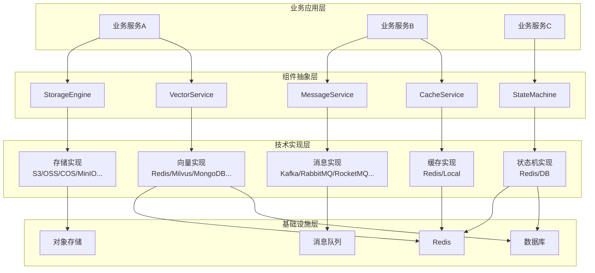
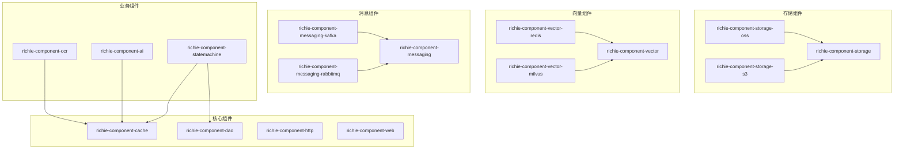

# Richie Component Platform

## 📖 概述

**Richie Component Platform** 是Richie技术中台的核心组件库，致力于提供统一、泛化、可复用的技术能力，实现技术与业务的完全隔离。通过抽象层设计，屏蔽底层技术实现差异，为业务开发提供一致的 API 和开发体验。

## 🎯 设计理念

### 1. 泛化设计（Generalization）

组件库采用**泛化设计**理念，将通用的技术能力抽象为可复用的组件，避免重复造轮子：

- **统一抽象接口**：每个技术领域都提供统一的接口，如 `StorageEngine`、`VectorService`、`MessageService` 等
- **多实现支持**：同一接口支持多种底层实现，业务代码无需关心具体技术选型
- **配置化切换**：通过配置文件即可切换不同的技术实现，无需修改代码

**示例**：
```java
// 业务代码只需使用统一接口
@Autowired
private StorageEngine storageEngine;  // 可以是 S3、OSS、COS、MinIO 等任意实现

// 切换存储后端只需修改配置，代码无需改动
// platform.component.storage.object.engine: S3 → OSS
```

### 2. 技术与业务隔离（Separation of Concerns）

通过**分层架构**和**接口抽象**，实现技术与业务的完全隔离：

- **技术层**：封装底层技术细节（SDK、协议、配置等）
- **抽象层**：提供统一的业务接口
- **业务层**：专注于业务逻辑，无需关心技术实现

**架构示意**：
```
┌─────────────────────────────────────────┐
│           业务代码层                        │
│  (专注于业务逻辑，使用统一接口)              │
└────────────────┬──────────────────────────┘
                 │
┌────────────────▼──────────────────────────┐
│           抽象接口层                        │
│  StorageEngine / VectorService / ...      │
└────────────────┬──────────────────────────┘
                 │
┌────────────────▼──────────────────────────┐
│           技术实现层                        │
│  S3/OSS/COS/MinIO / Redis/Milvus/...      │
└───────────────────────────────────────────┘
```

### 3. 统一 API 设计（Unified API）

所有组件都遵循**统一的 API 设计规范**：

- **一致的命名**：相同功能使用相同的命名（如 `putObject`、`getObject`）
- **统一的返回类型**：使用统一的响应对象（如 `UploadResponse`、`DownloadResponse`）
- **统一的异常处理**：统一的异常体系和错误码
- **统一的配置方式**：使用 `platform.component.*` 配置前缀

### 4. 开箱即用（Convention over Configuration）

- **自动配置**：Spring Boot 自动配置，零代码启动
- **默认配置**：提供合理的默认值，减少配置工作量
- **智能检测**：自动检测环境并应用最佳实践

### 5. 可扩展性（Extensibility）

- **插件化架构**：支持自定义实现和扩展
- **事件机制**：支持事件监听和扩展点
- **AOP 支持**：支持切面编程，增强功能

## 🏗️ 架构设计

### 整体架构



### 核心设计原则

1. **接口隔离原则（ISP）**
   - 每个组件提供清晰的接口定义
   - 接口职责单一，易于理解和维护

2. **依赖倒置原则（DIP）**
   - 业务代码依赖抽象接口，而非具体实现
   - 实现可以随时替换，不影响业务代码

3. **开闭原则（OCP）**
   - 对扩展开放：支持新增实现
   - 对修改封闭：接口稳定，向后兼容

4. **单一职责原则（SRP）**
   - 每个组件专注于单一技术领域
   - 组件之间低耦合，高内聚

## 🎯 解决的业务场景

### 1. 多技术栈统一管理

**问题**：业务系统需要对接多种技术栈（如多个云存储、多个消息队列），代码中充斥着各种 SDK 调用，维护成本高。

**解决方案**：通过统一接口抽象，业务代码只需使用一套 API，底层技术栈通过配置切换。

**示例场景**：
- 开发环境使用 MinIO，生产环境使用阿里云 OSS
- 国内使用腾讯云 COS，海外使用 AWS S3
- 只需修改配置，代码无需改动

### 2. 技术选型灵活性

**问题**：技术选型一旦确定，后续切换成本极高，需要大量代码修改。

**解决方案**：通过抽象层设计，技术选型可以随时切换，只需修改配置和依赖。

**示例场景**：
- 从 Kafka 切换到 RabbitMQ
- 从 Redis 向量数据库切换到 Milvus
- 从本地存储切换到云存储

### 3. 业务与技术解耦

**问题**：业务代码与技术实现强耦合，技术变更影响业务代码。

**解决方案**：通过接口抽象，业务代码只依赖接口，技术实现可以独立演进。

**示例场景**：
- 状态机存储从数据库切换到 Redis，业务代码无需修改
- 消息队列从同步改为异步，业务代码无需感知

### 4. 降低学习成本

**问题**：不同技术栈有不同的 API 和配置方式，开发人员需要学习多种技术。

**解决方案**：提供统一的 API 和配置方式，开发人员只需学习一套接口。

**示例场景**：
- 开发人员无需学习各个云存储的 SDK，只需学习 `StorageEngine` 接口
- 开发人员无需学习各个消息队列的 API，只需学习 `MessageService` 接口

### 5. 提升开发效率

**问题**：重复实现相同的技术能力，开发效率低。

**解决方案**：提供开箱即用的组件，减少重复开发。

**示例场景**：
- 状态机、向量检索、消息队列等通用能力直接使用组件
- 自动配置、默认值、最佳实践内置，减少配置工作量

## 📦 组件分类

### 存储组件（Storage）

提供统一的对象存储接口，支持多种存储后端：

| 组件                               | 说明            | 文档                                                   |
|----------------------------------|---------------|------------------------------------------------------|
| `richie-component-storage`       | 核心存储组件，提供统一接口 | [README](./richie-component-storage/README.md)       |
| `richie-component-storage-local` | 本地文件存储        | [README](./richie-component-storage-local/README.md) |
| `richie-component-storage-s3`    | AWS S3 存储     | [README](./richie-component-storage-s3/README.md)    |
| `richie-component-storage-oss`   | 阿里云 OSS 存储    | [README](./richie-component-storage-oss/README.md)   |
| `richie-component-storage-cos`   | 腾讯云 COS 存储    | [README](./richie-component-storage-cos/README.md)   |
| `richie-component-storage-obs`   | 华为云 OBS 存储    | [README](./richie-component-storage-obs/README.md)   |
| `richie-component-storage-minio` | MinIO 存储      | [README](./richie-component-storage-minio/README.md) |
| `richie-component-storage-ks3`   | 金山云 KS3 存储    | [README](./richie-component-storage-ks3/README.md)   |
| `richie-component-storage-tos`   | 火山引擎 TOS 存储   | [README](./richie-component-storage-tos/README.md)   |
| `richie-component-storage-azure` | Azure Blob 存储 | [README](./richie-component-storage-azure/README.md) |
| `richie-component-storage-sftp`  | SFTP 文件传输     | [README](./richie-component-storage-sftp/README.md)  |
| `richie-component-storage-smb`   | SMB/CIFS 文件共享 | [README](./richie-component-storage-smb/README.md)   |

**统一接口**：`StorageEngine`
- `putObject(key, file)` - 上传文件
- `getObject(key, targetPath)` - 下载文件
- `existsObject(key)` - 检查文件是否存在

### 向量数据库组件（Vector）

提供统一的向量存储和检索接口，支持多种向量数据库：

| 组件                                      | 说明                         | 文档                                                          |
|-----------------------------------------|----------------------------|-------------------------------------------------------------|
| `richie-component-vector`               | 核心向量组件，提供统一接口              | [README](./richie-component-vector/README.md)               |
| `richie-component-vector-redis`         | Redis 向量数据库                | [README](./richie-component-vector-redis/README.md)         |
| `richie-component-vector-milvus`        | Milvus 向量数据库               | [README](./richie-component-vector-milvus/README.md)        |
| `richie-component-vector-mongodb-atlas` | MongoDB Atlas 向量数据库        | [README](./richie-component-vector-mongodb-atlas/README.md) |
| `richie-component-vector-postgresql`    | PostgreSQL 向量数据库（pgvector） | [README](./richie-component-vector-postgresql/README.md)    |
| `richie-component-vector-qdrant`        | Qdrant 向量数据库               | [README](./richie-component-vector-qdrant/README.md)        |
| `richie-component-vector-neo4j`         | Neo4j 向量数据库                | [README](./richie-component-vector-neo4j/README.md)         |
| `richie-component-vector-elasticsearch` | Elasticsearch 向量数据库        | [README](./richie-component-vector-elasticsearch/README.md) |
| `richie-component-vector-weaviate`      | Weaviate 向量数据库             | [README](./richie-component-vector-weaviate/README.md)      |

**统一接口**：`VectorService`
- `addDocument(document)` - 添加文档
- `searchByText(text, limit)` - 文本搜索
- `searchByVector(vector, limit)` - 向量搜索

### 消息队列组件（Messaging）

提供统一的消息队列接口，支持多种消息队列：

| 组件                                      | 说明                     | 文档                                                          |
|-----------------------------------------|------------------------|-------------------------------------------------------------|
| `richie-component-messaging`            | 核心消息组件，提供统一接口          | [README](./richie-component-messaging/README.md)            |
| `richie-component-messaging-kafka`      | Kafka 消息队列             | [README](./richie-component-messaging-kafka/README.md)      |
| `richie-component-messaging-rabbitmq`   | RabbitMQ 消息队列          | [README](./richie-component-messaging-rabbitmq/README.md)   |
| `richie-component-messaging-rocketmq`   | RocketMQ 消息队列          | [README](./richie-component-messaging-rocketmq/README.md)   |
| `richie-component-messaging-pulsar`     | Apache Pulsar 消息队列     | [README](./richie-component-messaging-pulsar/README.md)     |
| `richie-component-messaging-kinesis`    | AWS Kinesis 消息队列       | [README](./richie-component-messaging-kinesis/README.md)    |
| `richie-component-messaging-gcp-pubsub` | Google PubSub 消息队列     | [README](./richie-component-messaging-gcp-pubsub/README.md) |
| `richie-component-messaging-eventhubs`  | Azure Event Hubs 消息队列  | [README](./richie-component-messaging-eventhubs/README.md)  |
| `richie-component-messaging-servicebus` | Azure Service Bus 消息队列 | [README](./richie-component-messaging-servicebus/README.md) |
| `richie-component-messaging-sqs`        | AWS SQS 消息队列           | [README](./richie-component-messaging-sqs/README.md)        |
| `richie-component-messaging-sns`        | AWS SNS 消息队列           | [README](./richie-component-messaging-sns/README.md)        |
| `richie-component-messaging-solace`     | Solace PubSub+ 消息队列    | [README](./richie-component-messaging-solace/README.md)     |

**统一接口**：`MessageService`
- `sendMessage(topic, content)` - 发送消息
- `sendDelayedMessage(topic, content, delay)` - 发送延迟消息

### 核心基础设施组件

| 组件                            | 说明                               | 文档                                                |
|-------------------------------|----------------------------------|---------------------------------------------------|
| `richie-component-cache`      | 缓存组件，提供 Redis 统一 API             | [README](./richie-component-cache/README.md)      |
| `richie-component-dao`        | 数据访问组件，MyBatis Plus 增强           | [README](./richie-component-dao/README.md)        |
| `richie-component-http`       | HTTP 客户端组件，支持 OkHttp/HttpClient5 | [README](./richie-component-http/README.md)       |
| `richie-component-web`        | Web 组件，CORS、国际化、异常处理             | [README](./richie-component-web/README.md)        |
| `richie-component-i18n`       | 国际化组件，资源文件和字典管理                  | [README](./richie-component-i18n/README.md)       |
| `richie-component-logging`    | 日志组件，访问日志和方法追踪                   | [README](./richie-component-logging/README.md)    |
| `richie-component-threadpool` | 线程池组件，动态线程池管理                    | [README](./richie-component-threadpool/README.md) |
| `richie-component-tracing`    | 追踪组件，OpenTelemetry 集成            | [README](./richie-component-tracing/README.md)    |
| `richie-component-skywalking` | APM 组件，SkyWalking 集成             | [README](./richie-component-skywalking/README.md) |

### 业务能力组件

| 组件                              | 说明                         | 文档                                                  |
|---------------------------------|----------------------------|-----------------------------------------------------|
| `richie-component-statemachine` | 状态机组件，基于 Easy Rules        | [README](./richie-component-statemachine/README.md) |
| `richie-component-ai`           | AI 组件，统一 AI 模型调用           | [README](./richie-component-ai/README.md)           |
| `richie-component-ocr`          | OCR 组件，图像识别                | [README](./richie-component-ocr/README.md)          |
| `richie-component-search`       | 搜索组件，Elasticsearch/Solr    | [README](./richie-component-search/README.md)       |
| `richie-component-mongodb`      | MongoDB 组件，MongoDB 客户端     | [README](./richie-component-mongodb/README.md)      |
| `richie-component-mqtt`         | MQTT 组件，MQTT 客户端           | [README](./richie-component-mqtt/README.md)         |
| `richie-component-microservice` | 微服务组件，OpenFeign/RestClient | [README](./richie-component-microservice/README.md) |

## 🚀 快速开始

### 1. 添加父依赖

```xml
 <dependencyManagement>
    <dependencies>
        <dependency>
            <groupId>com.richie.component</groupId>
            <artifactId>atlas-richie-component-dependencies</artifactId>
            <version>1.0.0-SNAPSHOT</version>
            <scope>import</scope>
            <type>pom</type>
        </dependency>
    </dependencies>
</dependencyManagement>
```

### 2. 选择需要的组件

根据业务需求选择相应的组件依赖：

```xml
<!-- 存储组件 -->
<dependency>
    <groupId>com.richie.component</groupId>
    <artifactId>atlas-richie-component-storage-oss</artifactId>
</dependency>

<!-- 向量数据库组件 -->
<dependency>
    <groupId>com.richie.component</groupId>
    <artifactId>atlas-richie-component-vector-redis</artifactId>
</dependency>

<!-- 消息队列组件 -->
<dependency>
    <groupId>com.richie.component</groupId>
    <artifactId>atlas-richie-component-messaging-kafka</artifactId>
</dependency>
```

### 3. 配置组件

```yaml
platform:
  component:
    # 存储配置
    storage:
      object:
        engine: ALIYUN_OSS
        endpoint: oss-cn-hangzhou.aliyuncs.com
        accessKeyId: your-key
        accessKeySecret: your-secret
        bucketName: my-bucket
    
    # 向量数据库配置
    vector:
      provider: REDIS
      embeddingProvider: OPENAI
      apiKey: your-api-key
    
    # 消息队列配置
    messaging:
      # Kafka 配置会自动应用
```

### 4. 使用组件

```java
@Service
@RequiredArgsConstructor
public class BusinessService {
    
    // 注入统一接口，无需关心具体实现
    private final StorageEngine storageEngine;
    private final VectorService vectorService;
    private final MessageService messageService;
    
    public void uploadAndIndex(String filePath) {
        // 上传文件（可以是 S3、OSS、COS 等任意实现）
        UploadResponse response = storageEngine.putObject("documents/file.pdf", new File(filePath));
        
        // 向量化并存储（可以是 Redis、Milvus、MongoDB 等任意实现）
        VectorDocument doc = new VectorDocument()
            .setContent("文档内容")
            .setMetadata(Map.of("fileUrl", response.getUrl()));
        vectorService.addDocument(doc);
        
        // 发送消息（可以是 Kafka、RabbitMQ、RocketMQ 等任意实现）
        messageService.sendMessage("document-indexed", doc.getId());
    }
}
```

## 🎨 设计模式应用

### 1. 策略模式（Strategy Pattern）

不同技术实现作为不同的策略，通过配置选择：

```java
// 存储策略
StorageEngine storageEngine;  // 可以是 S3、OSS、COS 等策略

// 向量数据库策略
VectorService vectorService;  // 可以是 Redis、Milvus、MongoDB 等策略
```

### 2. 适配器模式（Adapter Pattern）

将不同技术栈的 API 适配为统一接口：

```java
// S3StorageEngine 适配 AWS S3 SDK
// OssStorageEngine 适配阿里云 OSS SDK
// 都实现 StorageEngine 接口
```

### 3. 门面模式（Facade Pattern）

提供简化的静态 API，隐藏复杂性：

```java
// StateMachine 静态门面
StateMachine.fire(stateMachineName, businessId, event, context);

// GlobalCache 静态门面
GlobalCache.addStringCache(key, value, ttl);
```

### 4. 模板方法模式（Template Method Pattern）

抽象类定义算法骨架，子类实现具体步骤：

```java
// AbstractObjectStorageEngine 定义上传流程
// 子类实现具体的上传逻辑
```

## 📊 组件依赖关系



## 🔧 配置规范

所有组件遵循统一的配置规范：

### 配置前缀

```yaml
platform:
  component:
    # 组件名称
    storage: ...
    vector: ...
    messaging: ...
    cache: ...
    dao: ...
```

### 配置结构

```yaml
platform:
  component:
    [component-name]:
      # 启用开关
      enable: true
      # 提供商选择
      provider: REDIS  # 或 S3, OSS, KAFKA 等
      # 连接配置
      connection: ...
      # 功能配置
      features: ...
```

## 🎓 最佳实践

### 1. 接口优先

业务代码应该依赖接口，而非具体实现：

```java
// ✅ 正确：依赖接口
@Autowired
private StorageEngine storageEngine;

// ❌ 错误：依赖具体实现
@Autowired
private S3StorageEngine s3StorageEngine;
```

### 2. 配置驱动

通过配置选择技术实现，而非硬编码：

```yaml
# ✅ 正确：通过配置选择
platform:
  component:
    storage:
      object:
        engine: ALIYUN_OSS  # 可以随时切换为 S3、COS 等
```

### 3. 统一异常处理

使用组件提供的统一异常类型：

```java
try {
    storageEngine.putObject(key, file);
} catch (StorageException e) {
    // 统一异常处理
    log.error("存储失败", e);
}
```

### 4. 充分利用自动配置

依赖组件的自动配置能力，减少手动配置：

```java
// ✅ 正确：依赖自动配置
@SpringBootApplication
public class Application {
    public static void main(String[] args) {
        SpringApplication.run(Application.class, args);
    }
}
```

## 📚 文档索引

### 核心组件文档

- [缓存组件](./richie-component-cache/README.md) - Redis 统一 API
- [数据访问组件](./richie-component-dao/README.md) - MyBatis Plus 增强
- [HTTP 客户端组件](./richie-component-http/README.md) - OkHttp/HttpClient5
- [Web 组件](./richie-component-web/README.md) - CORS、国际化、异常处理
- [国际化组件](./richie-component-i18n/README.md) - 资源文件和字典管理
- [日志组件](./richie-component-logging/README.md) - 访问日志和方法追踪
- [线程池组件](./richie-component-threadpool/README.md) - 动态线程池管理
- [追踪组件](./richie-component-tracing/README.md) - OpenTelemetry 集成
- [APM 组件](./richie-component-skywalking/README.md) - SkyWalking 集成

### 存储组件文档

- [存储核心组件](./richie-component-storage/README.md) - 统一存储接口
- [本地存储](./richie-component-storage-local/README.md)
- [AWS S3](./richie-component-storage-s3/README.md)
- [阿里云 OSS](./richie-component-storage-oss/README.md)
- [腾讯云 COS](./richie-component-storage-cos/README.md)
- [华为云 OBS](./richie-component-storage-obs/README.md)
- [MinIO](./richie-component-storage-minio/README.md)
- [更多存储组件...](./richie-component-storage/README.md#相关文档)

### 向量数据库组件文档

- [向量核心组件](./richie-component-vector/README.md) - 统一向量接口
- [Redis 向量数据库](./richie-component-vector-redis/README.md)
- [Milvus 向量数据库](./richie-component-vector-milvus/README.md)
- [MongoDB Atlas 向量数据库](./richie-component-vector-mongodb-atlas/README.md)
- [PostgreSQL 向量数据库](./richie-component-vector-postgresql/README.md)
- [更多向量数据库组件...](./richie-component-vector/README.md#相关文档)

### 消息队列组件文档

- [消息核心组件](./richie-component-messaging/README.md) - 统一消息接口
- [Kafka](./richie-component-messaging-kafka/README.md)
- [RabbitMQ](./richie-component-messaging-rabbitmq/README.md)
- [RocketMQ](./richie-component-messaging-rocketmq/README.md)
- [更多消息队列组件...](./richie-component-messaging/README.md)

### 业务能力组件文档

- [状态机组件](./richie-component-statemachine/README.md) - 基于 Easy Rules
- [AI 组件](./richie-component-ai/README.md) - 统一 AI 模型调用
- [OCR 组件](./richie-component-ocr/README.md) - 图像识别
- [搜索组件](./richie-component-search/README.md) - Elasticsearch/Solr
- [MongoDB 组件](./richie-component-mongodb/README.md) - MongoDB 客户端
- [MQTT 组件](./richie-component-mqtt/README.md) - MQTT 客户端
- [微服务组件](./richie-component-microservice/README.md) - OpenFeign/RestClient

## 🤝 贡献指南

欢迎贡献代码和文档！请遵循以下规范：

1. **代码规范**：遵循项目代码风格
2. **文档规范**：提供完整的 README.md 和使用示例
3. **测试规范**：提供单元测试和集成测试
4. **提交规范**：遵循 Conventional Commits 规范

## 🔗 相关链接

- [Richie技术中台](https://docs.richie696.cn/)
- [问题反馈](richie696@icloud.com)
- [功能建议](richie696@icloud.com)

---

**Richie Component Platform** - 让技术更简单，让业务更专注 🚀

