# Richie Component Platform

> **Technology middle-platform component library** — 24 production-grade Spring Boot components covering four domains: infrastructure, service communication, data storage, and business capabilities. A unified set of interface abstractions with pluggable implementations decouples business code from technology choices.

---

## 📖 Overview

**Richie Component Platform** is the core component library of the Richie technology middle platform, providing unified, generalized, and reusable technical capabilities. Through an **abstraction interface layer**, it hides underlying technology differences; business code depends only on interfaces, not on implementations. Switch storage backends, message queues, or vector databases with a single line of YAML and zero code changes.

```
┌──────────────────────────────────────────────────┐
│                  Business Code Layer             │
│  Depends only on interfaces: StorageEngine /    │
│  VectorService / ...                            │
└────────────────┬─────────────────────────────────┘
                  │ Dependency Inversion
┌────────────────▼─────────────────────────────────┐
│              Abstraction Interface Layer         │
│  StorageEngine  │  VectorService  │  MessageService │
└────────────────┬─────────────────────────────────┘
                  │ Configuration-Driven
┌────────────────▼─────────────────────────────────┐
│            Technology Implementation Layer       │
│  S3/OSS/COS  │  Redis/Milvus  │  Kafka/RabbitMQ  │
└──────────────────────────────────────────────────┘
```

**Core Positioning**: Let business teams focus on "what business to implement" rather than "what technology to use". The component library encapsulates the technical details, enabling configuration-driven switching and out-of-the-box usage.

---

## 🎯 Use Cases

| Scenario | Problem | Component Solution |
|------|------|---------|
| **Multi-environment storage** | dev uses MinIO, prod uses Aliyun OSS, code is full of SDK calls | `StorageEngine` unified interface, config-driven switching |
| **Message queue migration** | migrating from Kafka to RocketMQ requires rewriting all producer/consumer code | `MessageService` unified interface, config-driven switching |
| **Vector store selection** | unsure whether to choose Redis/Milvus/Qdrant, fear of vendor lock-in | `VectorService` unified interface, switch anytime |
| **Container-layer protection** | how to do rate limiting / circuit breaking / replay protection without deploying a gateway | `web` component with 9 major interceptors, opt-in via pure config |
| **Multi-tenant onboarding** | every business unit implements their own tenant isolation, reinventing the wheel | `tenant` component with 5 isolation modes, choose on demand |
| **OAuth authentication** | build custom auth system vs. integrate Spring Authorization Server | `oauth` component with OAuth 2.1 three modules (core/authz/dcr) |
| **Distributed tracing** | OTel SDK version conflicts, cumbersome exporter configuration | `tracing` component with unified version management + 4-scenario onboarding guide |

---

## 🏗️ Architecture Overview

### Four-Layer Architecture

```mermaid
%%{init: {'theme': 'base', 'themeVariables': { 'fontSize': '14px'}}}%%
graph TB
    subgraph B["🎯 Business Capability Layer"]
        direction LR
        B1["statemachine<br/>State Machine"]
        B2["ai<br/>AI Model Invocation"]
        B3["mfa<br/>Multi-Factor Authentication"]
        B4["tenant<br/>Multi-Tenancy"]
        B5["mongodb<br/>MongoDB Fluent API"]
    end

    subgraph C["📡 Service Communication Layer"]
        direction LR
        C1["grpc<br/>gRPC Interceptor Stack"]
        C2["microservice<br/>Microservice Calls"]
        C3["messaging<br/>Unified Message Queue"]
        C4["mqtt<br/>MQTT Client"]
        C5["nats<br/>NATS Message Bus"]
        C6["redis-streammq<br/>Redis Stream MQ"]
        C7["oauth<br/>OAuth 2.1 Authentication"]
    end

    subgraph D["💾 Data Storage Layer"]
        direction LR
        D1["storage<br/>Unified Object Storage"]
        D2["vector<br/>Unified Vector Search"]
        D3["dao<br/>Database Access"]
        D4["mongodb<br/>MongoDB"]
    end

    subgraph E["🛠️ Infrastructure Layer"]
        direction LR
        E1["cache<br/>Redis Cache"]
        E2["web<br/>Container Layer Bus"]
        E3["logging<br/>AOP Logging"]
        E4["i18n<br/>Internationalization"]
        E5["http<br/>HTTP Client"]
        E6["concurrency<br/>Structured Concurrency"]
        E7["tracing<br/>Distributed Tracing"]
        E8["desensitize<br/>Data Desensitization"]
        E9["liquibase<br/>Database Migration"]
    end

    B --> C
    C --> D
    D --> E
```



> **Inter-layer Relationships**: The business capability layer calls the service communication layer, the service communication layer depends on the data storage layer, and all layers are built on top of the infrastructure layer.

### Component Landscape Table

| Layer | Component | One-line Positioning | Documentation |
|----|------|-----------|------|
| 🛠️ Infrastructure | **cache** | Redis cache + data structures + distributed locks + L2 + performance guard | [📖](./atlas-richie-component-cache/README.zh.md) |
| | **web** | 9 cross-cutting value points in Servlet container layer (rate limit/circuit break/Hang detection/protection, etc.) | [📖](./atlas-richie-component-web/README.zh.md) |
| | **logging** | AOP access logging + method tracing, multi-storage backends | [📖](./atlas-richie-component-logging/README.zh.md) |
| | **http** | Unified HTTP client facade (OkHttp/Apache5/JDK/RestClient) | [📖](./atlas-richie-component-http/README.zh.md) |
| | **concurrency** | JDK 25 structured concurrency + virtual thread high-frequency patterns | [📖](./atlas-richie-component-concurrency/README.zh.md) |
| | **tracing** | OpenTelemetry dependency management + 4-scenario onboarding guide | [📖](./atlas-richie-component-tracing/README.zh.md) |
| | **i18n** | Resource file i18n + dictionary management + auto-injection | [📖](./atlas-richie-component-i18n/README.zh.md) |
| | **desensitize** | Unified desensitization for API/log/audit/exception exits | [📖](./atlas-richie-component-desensitize/README.zh.md) |
| | **liquibase** | Database migration management, multi-database + runtime validation | [📖](./atlas-richie-component-liquibase/README.zh.md) |
| | **dao** | MyBatis Plus enhancements (pagination/multi-tenant/distributed ID/SQL monitoring) | [📖](./atlas-richie-component-dao/README.zh.md) |
| 💾 Data Storage | **storage** | Unified object storage interface (S3/OSS/COS/MinIO etc. pluggable) | [📖](./atlas-richie-component-storage/README.zh.md) |
| | **vector** | Unified vector storage and search (Redis/Milvus/Qdrant etc. pluggable) | [📖](./atlas-richie-component-vector/README.zh.md) |
| | **mongodb** | MongoDB Fluent API + cross-cutting annotations + observability + circuit-breaking fallback | [📖](./atlas-richie-component-mongodb/README.zh.md) |
| 📡 Service Communication | **messaging** | Spring Cloud Stream unified messaging (Kafka/RabbitMQ/RocketMQ etc.) | [📖](./atlas-richie-component-messaging/README.zh.md) |
| | **redis-streammq** | Redis Stream reliable MQ (consumer group/retry/dead-letter/idempotency) | [📖](./atlas-richie-component-redis-streammq/README.zh.md) |
| | **mqtt** | MQTT client (event-driven architecture + distributed tracing) | [📖](./atlas-richie-component-mqtt/README.zh.md) |
| | **nats** | NATS message bus + JetStream + KV/Object Store + RPC | [📖](./atlas-richie-component-nats/README.zh.md) |
| | **grpc** | Production-grade gRPC interceptor stack (auth/rate limit/tracing/metrics) | [📖](./atlas-richie-component-grpc/README.zh.md) |
| | **microservice** | OpenFeign/RestClient microservice call unified configuration | [📖](./atlas-richie-component-microservice/README.zh.md) |
| | **oauth** | OAuth 2.1 authentication (core + authz + DCR three modules) | [📖](./atlas-richie-component-oauth/README.zh.md) |
| 🎯 Business Capability | **statemachine** | Lightweight state machine (Easy Rules + Redis persistence + Stream async sync) | [📖](./atlas-richie-component-statemachine/README.zh.md) |
| | **ai** | Unified AI model invocation (multi-provider pluggable) | [📖](./atlas-richie-component-ai/README.zh.md) |
| | **mfa** | Multi-factor authentication (TOTP/SMS/email etc.) | [📖](./atlas-richie-component-mfa/README.zh.md) |
| | **tenant** | 5 multi-tenant isolation modes (SCHEMA/DATABASE/REDIS/...) | [📖](./atlas-richie-component-tenant/README.zh.md) |

---

## 🔄 Component Collaboration: Typical Scenarios

### Scenario 1: End-to-End Protection of API Requests

```
Client Request
    │
    ▼
┌─ gateway ─────────────────────────────────────────┐
│  oauth authentication (Token validation / Scope check)│
│  tenant multi-tenant resolution (X-Tenant-Id → MDC) │
└────────────────────────────────────────────────────┘
    │
    ▼
┌─ web (container layer capability bus) ─────────────┐
│  §1 Rate limit (per clientKey bucket)              │
│  §2 Circuit break (per namespace shared failure rate)│
│  §3 OTEL Trace passthrough                         │
│  §4 Hang detection (threshold triggers thread stack dump)│
│  §5 Hook event publishing (RequestCompleted listener)│
│  §6 HotReload (config hot reload, VT safe)         │
│  §7 Business degradation SPI (CB / rate-limit trigger custom fallback)│
│  §8 Platform protection (BloomFilter / Bot UA / brute-force detection)│
│  §9 Business integration (multi-tenant / Idempotency / API version)│
└────────────────────────────────────────────────────┘
    │
    ▼
┌─ controller / service ─────────────────────────────┐
│  concurrency (structured concurrency orchestrates multiple downstream calls)│
│  logging (AOP method tracing + access logging)     │
│  desensitize (sensitive field auto-desensitization)│
│  cache (Redis cache / distributed lock / Bloom filter pre-check)│
│  dao (MyBatis Plus database operations)            │
│  mongodb (MongoDB operations)                      │
│  storage / vector (object storage / vector search) │
└─────────────────────────────────────────────────────┘
```

### Scenario 2: Event-Driven Asynchronous Processing

```
Business Method
    │
    ├─→ messaging (Kafka / RabbitMQ / RocketMQ etc.)
    │       └─→ Downstream consumer (microservice decoupling)
    │
    ├─→ redis-streammq (Redis Stream reliable MQ)
    │       └─→ Same-process consumption / Cross-process consumption (auto-retry + dead-letter)
    │
    ├─→ mqtt (IoT scenarios)
    │       └─→ Device-side message subscribe / publish
    │
    ├─→ nats (high-performance message bus)
    │       └─→ Pub-sub / RPC request / JetStream persistence
    │
    └─→ statemachine (state machine events)
            └─→ Redis Stream async sync → Database persistence
```

### Scenario 3: Multi-Tenant + OAuth Authentication + Data Isolation

```
┌─ Request carries X-Tenant-Id ───────────────────────┐
│                                                      │
│  oauth component: Token issuance binds tenantId claim│
│  tenant component: resolve tenant → MDC → datasource routing│
│  dao component: MyBatis Plus multi-tenant SQL intercept│
│  cache component: Redis key auto-prepends tenant prefix│
│  web component: tenant context propagates to all interceptors│
│                                                      │
│  Scope control: different tenants can be assigned different API scopes│
│  Data isolation: SCHEMA / DATABASE / REDIS one-click switch│
└──────────────────────────────────────────────────────┘
```

### Scenario 4: AI + Vector Search + Storage Pipeline

```
Document upload
    │
    ▼
storage (object storage: S3 / OSS / MinIO)
    │
    ▼
ai (call Embedding model: OpenAI / Tongyi Qianwen etc.)
    │
    ▼
vector (store in vector DB: Redis / Milvus / Qdrant)
    │
    ▼
messaging (send "document indexed" event to downstream)
    │
    ▼
Downstream service consumes event, updates business state
```

---

## 🚀 Quick Start

### 1. Add Parent Dependency

```xml
<dependencyManagement>
    <dependencies>
        <dependency>
            <groupId>com.richie.component</groupId>
            <artifactId>atlas-richie-component-dependencies</artifactId>
            <version>${richie-component.version}</version>
            <scope>import</scope>
            <type>pom</type>
        </dependency>
    </dependencies>
</dependencyManagement>
```

### 2. Choose Components on Demand

Each component is an independent artifact, import on demand per business scenario:

```xml
<!-- Infrastructure: cache + container protection + logging -->
<dependency>
    <groupId>com.richie.component</groupId>
    <artifactId>atlas-richie-component-cache</artifactId>
</dependency>
<dependency>
    <groupId>com.richie.component</groupId>
    <artifactId>atlas-richie-component-web</artifactId>
</dependency>
<dependency>
    <groupId>com.richie.component</groupId>
    <artifactId>atlas-richie-component-logging</artifactId>
</dependency>

<!-- Data storage: object storage + vector search -->
<dependency>
    <groupId>com.richie.component</groupId>
    <artifactId>atlas-richie-component-storage</artifactId>
</dependency>
<dependency>
    <groupId>com.richie.component</groupId>
    <artifactId>atlas-richie-component-vector</artifactId>
</dependency>

<!-- Service communication: message queue + OAuth -->
<dependency>
    <groupId>com.richie.component</groupId>
    <artifactId>atlas-richie-component-messaging</artifactId>
</dependency>
<dependency>
    <groupId>com.richie.component</groupId>
    <artifactId>atlas-richie-component-oauth</artifactId>
</dependency>
```

### 3. Configure and Enable

Unified `platform.component.*` configuration prefix, opt-in enable:

```yaml
platform:
  component:
    oauth:
      enabled: true
      tokenSecret: ${OAUTH_TOKEN_SECRET}
    web:
      rate-limit:
        enabled: true
        default-permits-per-second: 100
    cache:
      redis:
        mode: cluster
```

### 4. Interface-Oriented Programming

```java
@Service
@RequiredArgsConstructor
public class BusinessService {

    private final StorageEngine storageEngine;   // 不限实现
    private final VectorService vectorService;    // 不限实现
    private final GlobalCache globalCache;        // 缓存门面

    public void processDocument(String path) {
        // 上传文件（S3 / OSS / MinIO … 配置决定）
        String url = storageEngine.putObject("doc/1.pdf", new File(path));

        // 向量化并存储（Redis / Milvus / Qdrant … 配置决定）
        vectorService.addDocument(new VectorDocument()
            .setContent("文档内容")
            .setMetadata(Map.of("url", url)));

        // 缓存结果
        globalCache.setString("doc:url:1", url, Duration.ofHours(1));
    }
}
```

---

## 🎨 Design Philosophy

### 1. Interface-First, Dependency Inversion

Business code depends on abstract interfaces, not concrete implementations. Interfaces like `StorageEngine`, `VectorService`, `MessageService` define the contract, and underlying implementations can be replaced at any time.

```
Business Code → Interface ← Technology Implementation (S3 / OSS / MinIO ...)
```

### 2. Configuration-Driven, Zero-Code Switching

The same code, change the configuration file to switch technology stack:

```yaml
# 存储引擎切换
platform.component.storage.object.engine: S3    # 或 OSS / COS / MinIO

# 向量库切换
platform.component.vector.provider: REDIS       # 或 Milvus / Qdrant / MongoDB

# 消息队列切换（替换依赖 + 修改配置即可，代码不变）
```

### 3. Layered Isolation, Each with Its Own Responsibility

Infrastructure components (cache / web / logging) provide generic capabilities, no business dependencies. Business capability components (statemachine / ai / mfa) build composite functions on top of infrastructure. Upper layers depend on lower layers; lower layers are unaware of upper layers.

### 4. Built-in Observability

Each component automatically outputs the following while providing core capabilities:
- **Metrics** — Micrometer metrics, integrated with Prometheus + Grafana
- **Tracing** — OpenTelemetry traces, integrated with Jaeger / Tempo
- **Logging** — Structured logging, auto-injects traceId / tenantId

Business teams get production-grade observability without additional configuration.

---

## ⚙️ Configuration Conventions

All components follow the same configuration convention:

| Convention | Rule | Example |
|------|------|------|
| **Prefix** | `platform.component.{name}` | `platform.component.oauth` |
| **Enable** | `enabled: true` explicit opt-in | `platform.component.web.rate-limit.enabled: true` |
| **Provider** | provider/engine field selects implementation | `platform.component.vector.provider: REDIS` |
| **Default off** | Protection/security components default to false to prevent accidental enablement | Avoid unexpected activation after going live |

---

## 🤝 Contribution Guide

1. **Code conventions**: follow the project's unified code style and Checkstyle rules
2. **Documentation conventions**: each component provides README.zh.md (Chinese) + README.md (English)
3. **Test conventions**: components must provide unit tests + integration tests
4. **Commit conventions**: follow Conventional Commits (feat/fix/refactor/docs/chore)

---

## 🔗 Related Links

- [Richie Technology Middle Platform](https://docs.richie696.cn/)
- [Issue Feedback](richie696@icloud.com)

---

*Richie Component Platform — Simpler technology, sharper business focus*
