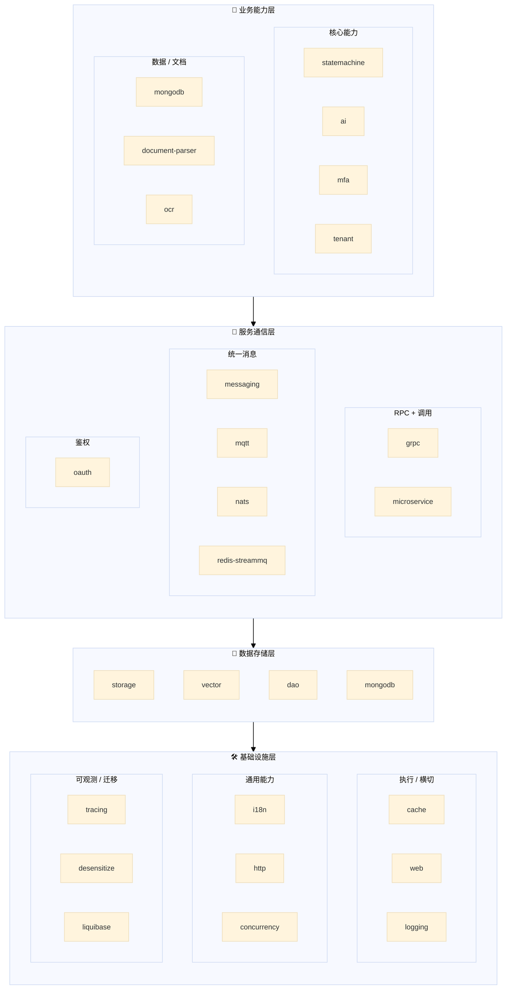

# Richie Component Platform

> **技术中台组件库** — 25 个生产级 Spring Boot 组件，覆盖基础设施、服务通信、数据存储、业务能力四大领域。同一套接口抽象，可插拔实现，业务代码与技术选型解耦。

---

## 📖 概述

**Richie Component Platform** 是 Richie 技术中台的核心组件库，提供统一、泛化、可复用的技术能力。通过**接口抽象层**屏蔽底层技术差异，业务代码只依赖接口不依赖实现——切换存储后端、消息队列、向量数据库时，一行 YAML 搞定，代码零改动。

```
┌──────────────────────────────────────────────────┐
│                    业务代码层                       │
│  只依赖接口：StorageEngine / VectorService / ...  │
└────────────────┬─────────────────────────────────┘
                 │ 依赖倒置
┌────────────────▼─────────────────────────────────┐
│                抽象接口层                          │
│  StorageEngine  │  VectorService  │  MessageService │
└────────────────┬─────────────────────────────────┘
                 │ 配置驱动
┌────────────────▼─────────────────────────────────┐
│                技术实现层                          │
│  S3/OSS/COS  │  Redis/Milvus  │  Kafka/RabbitMQ  │
└──────────────────────────────────────────────────┘
```

**核心定位**：让业务方关注"要实现什么业务"，而非"用什么技术实现"。组件库负责把技术细节封装好，配置化切换，开箱即用。

---

## 🎯 适用场景

| 场景               | 问题                                                                                          | 组件方案                                                                                                                                   |
|--------------------|-----------------------------------------------------------------------------------------------|--------------------------------------------------------------------------------------------------------------------------------------------|
| **多环境存储**     | dev 用 MinIO，prod 用阿里云 OSS，代码全是 SDK 调用                                            | `StorageEngine` 统一接口，配置切换                                                                                                         |
| **消息队列迁移**   | 从 Kafka 迁到 RocketMQ，所有 producer/consumer 重写                                           | `MessageService` 统一接口，配置切换                                                                                                        |
| **向量库选型**     | Redis/Milvus/Qdrant 不确定选哪个，怕锁死                                                      | `VectorService` 统一接口，随时切换                                                                                                         |
| **容器层防护**     | 不部署网关时，请求限流/熔断/防重放怎么做                                                      | `web` 组件 9 大拦截器，纯配置 opt-in                                                                                                       |
| **多租户接入**     | 每个业务方实现一套租户隔离，重复造轮子                                                        | `tenant` 组件 5 种隔离模式，按需选型                                                                                                       |
| **OAuth 鉴权**     | 自建鉴权系统 vs 集成 Spring Authorization Server                                              | `oauth` 组件 OAuth 2.1 三模块 (core/authz/dcr)                                                                                             |
| **分布式追踪**     | OTel SDK 版本冲突、exporter 配置繁琐                                                          | `tracing` 组件统一版本管理 + 四场景接入指南                                                                                                |
| **文档接入 (RAG)** | PDF / DOCX / XLSX / PPTX / ODF 多格式混合、Tika / Fesod SDK 直调易碎、远程 URL 存在 SSRF 风险 | `document-parser` 组件统一 `DocumentReader` 门面 + 三道 SSRF 防线 + 流式 `ParseEvent` + 按页/按段切分                                      |
| **OCR 厂商选型**   | 需接入 OCR 但不确定用阿里云/百度/Paddle/Tesseract/VLM，怕 vendor 锁死                         | `ocr` 组件统一 `OcrEngine` 门面，6 vendor 可插拔（阿里云/百度/Paddle/Tesseract/PaddleOCR-VL/MinerU），yaml 切换，16 语言支持，业务事件回调 |

---

## 🏗️ 架构总览

### 四层架构



> **层间关系**：业务能力层调用服务通信层，服务通信层依赖数据存储层，所有层构建在基础设施层之上。

### 组件全景表

| 层          | 组件                | 一句话定位                                                                                                     | 文档                                                        |
|-------------|---------------------|----------------------------------------------------------------------------------------------------------------|-------------------------------------------------------------|
| 🛠️ 基础设施 | **cache**           | Redis 缓存 + 数据结构 + 分布式锁 + L2 + 性能守卫                                                               | [📖](./atlas-richie-component-cache/README.zh.md)           |
|             | **web**             | Servlet 容器层 9 大横切价值点（限流/熔断/Hang检测/防护等）                                                     | [📖](./atlas-richie-component-web/README.zh.md)             |
|             | **logging**         | AOP 访问日志 + 方法追踪，多存储后端                                                                            | [📖](./atlas-richie-component-logging/README.zh.md)         |
|             | **http**            | 统一 HTTP 客户端门面（OkHttp/Apache5/JDK/RestClient）                                                          | [📖](./atlas-richie-component-http/README.zh.md)            |
|             | **concurrency**     | JDK 25 结构化并发 + 虚拟线程高频模式封装                                                                       | [📖](./atlas-richie-component-concurrency/README.zh.md)     |
|             | **tracing**         | OpenTelemetry 依赖托管 + 四场景接入指南                                                                        | [📖](./atlas-richie-component-tracing/README.zh.md)         |
|             | **i18n**            | 资源文件国际化 + 字典管理 + 自动注入                                                                           | [📖](./atlas-richie-component-i18n/README.zh.md)            |
|             | **desensitize**     | API/日志/审计/异常出口统一脱敏                                                                                 | [📖](./atlas-richie-component-desensitize/README.zh.md)     |
|             | **liquibase**       | 数据库迁移管理，多数据库 + 运行时校验                                                                          | [📖](./atlas-richie-component-liquibase/README.zh.md)       |
|             | **dao**             | MyBatis Plus 增强（分页/多租户/分布式ID/SQL监控）                                                              | [📖](./atlas-richie-component-dao/README.zh.md)             |
| 💾 数据存储 | **storage**         | 统一对象存储接口（S3/OSS/COS/MinIO 等可插拔）                                                                  | [📖](./atlas-richie-component-storage/README.zh.md)         |
|             | **vector**          | 统一向量存储与检索（Redis/Milvus/Qdrant 等可插拔）                                                             | [📖](./atlas-richie-component-vector/README.zh.md)          |
|             | **mongodb**         | MongoDB Fluent API + 横切注解 + 可观测性 + 熔断降级                                                            | [📖](./atlas-richie-component-mongodb/README.zh.md)         |
| 📡 服务通信 | **messaging**       | Spring Cloud Stream 统一消息（Kafka/RabbitMQ/RocketMQ 等）                                                     | [📖](./atlas-richie-component-messaging/README.zh.md)       |
|             | **redis-streammq**  | Redis Stream 可靠 MQ（消费组/重试/死信/幂等）                                                                  | [📖](./atlas-richie-component-redis-streammq/README.zh.md)  |
|             | **mqtt**            | MQTT 客户端（事件驱动架构 + 分布式追踪）                                                                       | [📖](./atlas-richie-component-mqtt/README.zh.md)            |
|             | **nats**            | NATS 消息总线 + JetStream + KV/Object Store + RPC                                                              | [📖](./atlas-richie-component-nats/README.zh.md)            |
|             | **grpc**            | 生产级 gRPC 拦截器栈（鉴权/限流/追踪/指标）                                                                    | [📖](./atlas-richie-component-grpc/README.zh.md)            |
|             | **microservice**    | OpenFeign/RestClient 微服务调用统一配置                                                                        | [📖](./atlas-richie-component-microservice/README.zh.md)    |
|             | **oauth**           | OAuth 2.1 鉴权（core + authz + DCR 三模块）                                                                    | [📖](./atlas-richie-component-oauth/README.zh.md)           |
| 🎯 业务能力 | **statemachine**    | 轻量状态机（Easy Rules + Redis 持久化 + Stream 异步同步）                                                      | [📖](./atlas-richie-component-statemachine/README.zh.md)    |
|             | **ai**              | AI 模型统一调用（多 Provider 可插拔）                                                                          | [📖](./atlas-richie-component-ai/README.zh.md)              |
|             | **mfa**             | 多因素认证（TOTP/短信/邮件等）                                                                                 | [📖](./atlas-richie-component-mfa/README.zh.md)             |
|             | **tenant**          | 多租户 5 种隔离模式（SCHEMA/DATABASE/REDIS/...）                                                               | [📖](./atlas-richie-component-tenant/README.zh.md)          |
|             | **document-parser** | 统一文档解析（PDF / Word / Excel / PPT / ODF / TXT / Markdown），SSRF 防线 + 流式 ParseEvent                   | [📖](./atlas-richie-component-document-parser/README.zh.md) |
|             | **ocr**             | 统一 OCR 门面（6 vendor 可插拔：阿里云/百度/Paddle/Tesseract/PaddleOCR-VL/MinerU），多语言 v0.6 + 业务事件回调 | [📖](./atlas-richie-component-ocr/README.zh.md)             |

---

## 🔄 组件协同：典型场景

### 场景一：API 请求的全路径防护

```
客户端请求
    │
    ▼
┌─ gateway ─────────────────────────────────────────┐
│  oauth 鉴权（Token 校验 / Scope 验证）              │
│  tenant 多租户解析（X-Tenant-Id → MDC）             │
└────────────────────────────────────────────────────┘
    │
    ▼
┌─ web（容器层能力总线）──────────────────────────────┐
│  §1 限流（按 clientKey 分桶限流）                    │
│  §2 熔断（按 namespace 共享失败率）                  │
│  §3 OTEL Trace 透传                                │
│  §4 Hang 检测（阈值触发线程栈 dump）                 │
│  §5 Hook 事件发布（RequestCompleted 监听）           │
│  §6 HotReload（配置热加载，VT 安全）                 │
│  §7 业务降级 SPI（CB / 限流触发自定义 fallback）      │
│  §8 平台防护（BloomFilter / Bot UA / 爆破检测）       │
│  §9 业务集成（多租户 / Idempotency / API 版本）      │
└────────────────────────────────────────────────────┘
    │
    ▼
┌─ controller / service ─────────────────────────────┐
│  concurrency（结构化并发编排多个下游调用）             │
│  logging（AOP 方法追踪 + 访问日志）                   │
│  desensitize（敏感字段自动脱敏）                      │
│  cache（Redis 缓存 / 分布式锁 / 布隆过滤器前置）      │
│  dao（MyBatis Plus 数据库操作）                      │
│  mongodb（MongoDB 操作）                             │
│  storage / vector（对象存储 / 向量检索）              │
└─────────────────────────────────────────────────────┘
```

### 场景二：事件驱动异步处理

```
业务方法
    │
    ├─→ messaging（Kafka / RabbitMQ / RocketMQ 等）
    │       └─→ 下游消费者（微服务解耦）
    │
    ├─→ redis-streammq（Redis Stream 可靠 MQ）
    │       └─→ 同进程消费 / 跨进程消费（自动重试 + 死信）
    │
    ├─→ mqtt（IoT 场景）
    │       └─→ 设备端消息订阅 / 发布
    │
    ├─→ nats（高性能消息总线）
    │       └─→ 发布订阅 / RPC 请求 / JetStream 持久化
    │
    └─→ statemachine（状态机事件）
            └─→ Redis Stream 异步同步 → 数据库持久化
```

### 场景三：多租户 + OAuth 鉴权 + 数据隔离

```
┌─ 请求携带 X-Tenant-Id ───────────────────────────────┐
│                                                        │
│  oauth 组件：Token 签发时绑定 tenantId claim           │
│  tenant 组件：解析租户 → MDC → 数据源路由             │
│  dao 组件：MyBatis Plus 多租户 SQL 拦截               │
│  cache 组件：Redis key 自动拼接租户前缀               │
│  web 组件：租户上下文透传到所有拦截器                   │
│                                                        │
│  Scope 控制：不同租户可分配不同 API scope               │
│  数据隔离：SCHEMA / DATABASE / REDIS 一键切换          │
└────────────────────────────────────────────────────────┘
```

### 场景四：AI + 向量检索 + 存储流水线

```
文档上传
    │
    ▼
storage（对象存储：S3 / OSS / MinIO）
    │
    ▼
ai（调用 Embedding 模型：OpenAI / 通义千问等）
    │
    ▼
vector（存入向量库：Redis / Milvus / Qdrant）
    │
    ▼
messaging（发送"文档已索引"事件给下游）
    │
    ▼
下游服务消费事件，更新业务状态
```

---

## 🚀 快速开始

### 1. 引入父依赖

```xml
<dependencyManagement>
    <dependencies>
        <dependency>
            <groupId>com.richie.component</groupId>
            <artifactId>atlas-richie-component-dependencies</artifactId>
            <version>${richie-component.version}</version>
            <scope>import</scope>
            <type>pom</type>
        </dependency>
    </dependencies>
</dependencyManagement>
```

### 2. 按需选择组件

每个组件独立 artifact，按业务场景引入：

```xml
<!-- 基础设施：缓存 + 容器防护 + 日志 -->
<dependency>
    <groupId>com.richie.component</groupId>
    <artifactId>atlas-richie-component-cache</artifactId>
</dependency>
<dependency>
    <groupId>com.richie.component</groupId>
    <artifactId>atlas-richie-component-web</artifactId>
</dependency>
<dependency>
    <groupId>com.richie.component</groupId>
    <artifactId>atlas-richie-component-logging</artifactId>
</dependency>

<!-- 数据存储：对象存储 + 向量检索 -->
<dependency>
    <groupId>com.richie.component</groupId>
    <artifactId>atlas-richie-component-storage</artifactId>
</dependency>
<dependency>
    <groupId>com.richie.component</groupId>
    <artifactId>atlas-richie-component-vector</artifactId>
</dependency>

<!-- 服务通信：消息队列 + OAuth -->
<dependency>
    <groupId>com.richie.component</groupId>
    <artifactId>atlas-richie-component-messaging</artifactId>
</dependency>
<dependency>
    <groupId>com.richie.component</groupId>
    <artifactId>atlas-richie-component-oauth</artifactId>
</dependency>
```

### 3. 配置并启用

统一 `platform.component.*` 配置前缀，opt-in 启用：

```yaml
platform:
  component:
    oauth:
      enabled: true
      tokenSecret: ${OAUTH_TOKEN_SECRET}
    web:
      rate-limit:
        enabled: true
        default-permits-per-second: 100
    cache:
      redis:
        mode: cluster
```

### 4. 面向接口编程

```java
@Service
@RequiredArgsConstructor
public class BusinessService {

    private final StorageEngine storageEngine;   // 不限实现
    private final VectorService vectorService;    // 不限实现
    private final GlobalCache globalCache;        // 缓存门面

    public void processDocument(String path) {
        // 上传文件（S3 / OSS / MinIO … 配置决定）
        String url = storageEngine.putObject("doc/1.pdf", new File(path));

        // 向量化并存储（Redis / Milvus / Qdrant … 配置决定）
        vectorService.addDocument(new VectorDocument()
            .setContent("文档内容")
            .setMetadata(Map.of("url", url)));

        // 缓存结果
        globalCache.setString("doc:url:1", url, Duration.ofHours(1));
    }
}
```

---

## 🎨 设计理念

### 1. 接口优先，依赖倒置

业务代码依赖抽象接口而非具体实现。`StorageEngine`、`VectorService`、`MessageService` 等接口定义契约，底层实现可随时替换。

```
业务代码 → 接口 ← 技术实现（S3 / OSS / MinIO ...）
```

### 2. 配置驱动，零代码切换

同一套代码，修改配置文件即可切换技术栈：

```yaml
# 存储引擎切换
platform.component.storage.object.engine: S3    # 或 OSS / COS / MinIO

# 向量库切换
platform.component.vector.provider: REDIS       # 或 Milvus / Qdrant / MongoDB

# 消息队列切换（替换依赖 + 修改配置即可，代码不变）
```

### 3. 分层隔离，各司其职

基础设施组件（cache / web / logging）提供通用能力，不依赖业务。业务能力组件（statemachine / ai / mfa）在基础设施之上构建复合功能。上层依赖下层，下层不感知上层。

### 4. 可观测性内置

每个组件在提供核心能力的同时，自动输出：
- **Metrics** — Micrometer 指标，对接 Prometheus + Grafana
- **Tracing** — OpenTelemetry 链路，对接 Jaeger / Tempo
- **Logging** — 结构化日志，自动注入 traceId / tenantId

业务方无需额外配置即可获得生产级可观测性。

---

## ⚙️ 配置规范

所有组件遵循相同配置约定：

| 约定         | 规则                              | 示例                                              |
|--------------|-----------------------------------|---------------------------------------------------|
| **前缀**     | `platform.component.{name}`       | `platform.component.oauth`                        |
| **启用**     | `enabled: true` 显式 opt-in       | `platform.component.web.rate-limit.enabled: true` |
| **Provider** | provider/engine 字段选择实现      | `platform.component.vector.provider: REDIS`       |
| **默认关闭** | 防护/安全组件默认 false，防误开启 | 避免上线后意外生效                                |

---

## 🤝 贡献指南

1. **代码规范**：遵循项目统一的代码风格和 Checkstyle 规则
2. **文档规范**：每个组件提供 README.zh.md（中文）+ README.md（英文）
3. **测试规范**：组件必须提供单元测试 + 集成测试
4. **提交规范**：遵循 Conventional Commits（feat/fix/refactor/docs/chore）

---

## 🔗 相关链接

- [Richie 技术中台](https://docs.richie696.cn/)
- [问题反馈](richie696@icloud.com)

---

*Richie Component Platform — 让技术更简单，让业务更专注*
