# Atlas Richie AI Component (atlas-richie-component-ai)

## 📖 Contents

- [📋 Overview](#-overview)
- [✨ Core Capabilities](#-core-capabilities)
- [🤖 Currently Supported Models](#-currently-supported-models)
  - [1) Built-in Providers (Configuration File Mode)](#1-built-in-providers-configuration-file-mode)
  - [2) Unknown Provider Fallback in Dynamic Mode](#2-unknown-provider-fallback-in-dynamic-mode)
- [📦 Dependency](#-dependency)
- [🔌 EmbeddingModel Auto-Configuration](#-embeddingmodel-auto-configuration)
- [🚀 Usage Method 1: Configuration File Initialization](#-usage-method-1-configuration-file-initialization)
- [🚀 Usage Method 2: Database Configuration + Dynamic Initialization (Recommended)](#-usage-method-2-database-configuration--dynamic-initialization-recommended)
  - [0) Disable Configuration File Initialization (Dynamic-Only Mode)](#0-disable-configuration-file-initialization-dynamic-only-mode)
  - [1) Construct Model Configuration List](#1-construct-model-configuration-list)
  - [2) Invoke Dynamic Initialization](#2-invoke-dynamic-initialization)
- [💡 Unified Call Examples](#-unified-call-examples)
- [🔌 AiModelService Interface](#-aimodelservice-interface)
- [📊 Key Data Structures](#-key-data-structures)
  - [1) `AiRequest`](#1-airequest)
  - [2) `ModelOptions` (Dynamic Initialization Input)](#2-modeloptions-dynamic-initialization-input)
  - [3) `AiResponse`](#3-airesponse)
  - [4) `AiStreamChunk` (Stream Output Chunk)](#4-aistreamchunk-stream-output-chunk)
  - [5) `AiHealthResult` (Health Check Result)](#5-aihealthresult-health-check-result)
  - [6) `AiModelInfo` (Model Information)](#6-aimodelinfo-model-information)
- [📐 Parameters Reference (AiModelOptions)](#-parameters-reference-aimodeloptions)
- [📏 Default & Override Rules](#-default--override-rules)
- [🏭 Production Recommendations](#-production-recommendations)
- [📕 Complete Configuration Reference](#-complete-configuration-reference)
  - [platform.component.ai Configuration Tree](#platformcomponentai-configuration-tree)
  - [Auto-Registered Beans](#auto-registered-beans)
  - [Routing Decision Chain](#routing-decision-chain)
- [🔨 Tool Calling](#-tool-calling)
  - [1) Register Tools](#1-register-tools)
  - [2) Declare Tools at Invocation Time](#2-declare-tools-at-invocation-time)
  - [3) Notes](#3-notes)
- [⚠️ Error Code Reference](#-error-code-reference)
- [🔧 📐 API Implementation Documentation](#-api-implementation-documentation)
  - [Overall Component Architecture](#overall-component-architecture)
  - [1. `call(AiRequest request)` — Synchronous Call](#1-callairequest-request--synchronous-call)
  - [2. `callAsync(AiRequest request)` — Asynchronous Call](#2-callasyncairequest-request--asynchronous-call)
  - [3. `stream(AiRequest request)` — Streaming Call](#3-streamairequest-request--streaming-call)
  - [4. `callWithModel(String modelName, AiRequest request)` — Specify Model Call](#4-callwithmodelstring-modelname-airequest-request--specify-model-call)
  - [5. `initializeModels(List<ModelOptions>)` — Dynamic Initialization](#5-initializemodelslistmodeloptions--dynamic-initialization)
  - [6. `removeModel(String modelName)` — Remove Model](#6-removemodelstring-modelname--remove-model)
  - [7. `probe(String modelName)` — Single Model Health Probe](#7-probestring-modelname--single-model-health-probe)
  - [8. `probeAll()` — Probe All Models](#8-probeall--probe-all-models)
  - [9. `getAvailableModels()` — Get All Available Models](#9-getavailablemodels--get-all-available-models)
  - [10. `getModelInfo(String modelName)` — Get Model Info](#10-getmodelinfostring-modelname--get-model-info)
  - [11. `isModelAvailable(String modelName)` — Check Model Availability](#11-ismodelavailablestring-modelname--check-model-availability)
  - [12. `getDefaultModel()` — Get Default Model](#12-getdefaultmodel--get-default-model)
  - [13. `setDefaultModel(String modelName)` — Set Default Model](#13-setdefaultmodelstring-modelname--set-default-model)

------


## Overview

`richie-component-ai` is a unified LLM integration component based on Spring AI, designed to let business systems manage and invoke different models through a unified interface.

The component supports two initialization modes simultaneously:

- **Configuration File Initialization**: Define models via `application.yml`
- **Runtime Dynamic Initialization**: Business systems load model configurations from a database and inject them at runtime

Both modes can coexist; runtime dynamic initialization can override models with the same name.

## Core Capabilities

- Unified invocation interface: Call different vendor models through the same `AiModelService`
- Multi-model management: List available models, switch default model, invoke by model name
- Dynamic model registration: Support `initializeModels(List<ModelOptions>)` for runtime loading
- Compatibility fallback: Unknown providers during dynamic registration automatically degrade to OpenAI-compatible protocol
- Unified response structure: Includes content, duration, model info, token usage statistics

## Currently Supported Models

### 1) Built-in Providers (Configuration File Mode)

`AiModelProperties.AiProviderType` currently supports:

- `OPENAI`
- `DEEPSEEK`
- `ZHIPUAI` (via OpenAI-compatible protocol)
- `ANTHROPIC`
- `OLLAMA`
- `MINIMAX`
- `MOONSHOT` (via OpenAI-compatible protocol)

### 2) Unknown Provider Fallback in Dynamic Mode

When calling `initializeModels(List<ModelOptions>)`, `ModelOptions.provider` is a string.

- If recognizable as one of the built-in providers above, it initializes via the corresponding logic
- If unrecognizable, it automatically degrades to the `OPENAI` protocol — no failure due to undefined enum

## Dependency

```xml
<dependency>
    <groupId>com.richie.component</groupId>
    <artifactId>atlas-richie-component-ai</artifactId>
    <version>1.0.0-SNAPSHOT</version>
</dependency>
```

## EmbeddingModel Auto-Configuration

Starting from the current version, `richie-component-ai` automatically registers an `EmbeddingModel` Bean (Bean name: `aiEmbeddingModel`) in configuration file initialization mode.

- Default strategy: **Follows the default model** (i.e., the first model in `platform.component.ai.models`)
- Use case: `richie-component-vector` and other provider sub-components can reuse the `EmbeddingModel` directly
- Override mechanism: Business-side `EmbeddingModel` Bean declarations will override the auto-injected one

Note:

- When `config-initialization-enabled: false`, the component will not create a default `EmbeddingModel`
- When no models are configured, no default `EmbeddingModel` is created either
- In the above scenarios, declare the `EmbeddingModel` Bean manually on the business side

## Usage Method 1: Configuration File Initialization

```yaml
platform:
  component:
    ai:
      models:
        gpt-4o:
          provider: OPENAI
          api-key: ${OPENAI_API_KEY:}
          base-url: ${OPENAI_BASE_URL:https://api.openai.com}
          options:
            model: gpt-4o
            max-tokens: 2000
            temperature: 0.7

        deepseek-chat:
          provider: DEEPSEEK
          api-key: ${DEEPSEEK_API_KEY:}
          base-url: ${DEEPSEEK_BASE_URL:https://api.deepseek.com}
          options:
            model: deepseek-chat
            temperature: 0.7

        zhipu-glm:
          provider: ZHIPUAI
          api-key: ${ZHIPUAI_API_KEY:}
          base-url: ${ZHIPUAI_BASE_URL:https://open.bigmodel.cn/api/paas/v4}
          options:
            model: glm-4

        claude-sonnet:
          provider: ANTHROPIC
          api-key: ${ANTHROPIC_API_KEY:}
          base-url: ${ANTHROPIC_BASE_URL:https://api.anthropic.com}
          options:
            model: claude-3-5-sonnet-20240620
            max-tokens: 2000
            temperature: 0.7
            top-k: 40

        minimax-main:
          provider: MINIMAX
          api-key: ${MINIMAX_API_KEY:}
          base-url: ${MINIMAX_BASE_URL:https://api.minimax.chat}
          options:
            model: abab6.5g-chat

        moonshot-main:
          provider: MOONSHOT
          api-key: ${MOONSHOT_API_KEY:}
          base-url: ${MOONSHOT_BASE_URL:https://api.moonshot.cn/v1}
          options:
            model: moonshot-v1-8k

        ollama-local:
          provider: OLLAMA
          base-url: ${OLLAMA_BASE_URL:http://localhost:11434}
          options:
            model: qwen2.5:7b
```

## Usage Method 2: Database Configuration + Dynamic Initialization (Recommended)

### 0) Disable Configuration File Initialization (Dynamic-Only Mode)

To have all models come from the database instead of `application.yml`, disable `@Bean` initialization at startup:

```yaml
platform:
  component:
    ai:
      config-initialization-enabled: false
```

Behavior:

- No `ChatClient` instances are created at component startup
- `initializeModels(List<ModelOptions>)` must be called before any AI invocation
- If `AiModelService.call/callAsync/callWithModel` is called before initialization, it returns:
  - `errorCode = MODEL_NOT_INITIALIZED`
  - `errorMessage = AI model not initialized. Please initialize via configuration file or initializeModels first.`

### 1) Construct Model Configuration List

```java
import com.richie.component.ai.config.AiModelProperties;
import com.richie.component.ai.model.ModelOptions;

List<ModelOptions> options = List.of(
        new ModelOptions()
                .setModelName("tenant-a-openai")
                .setProvider("OPENAI")
                .setBaseUrl("https://api.openai.com")
                .setApiKey("sk-xxx")
                .setOptions(new AiModelProperties.AiModelOptions()
                        .setModel("gpt-4o")
                        .setTemperature(0.6)
                        .setMaxTokens(2000)),

        new ModelOptions()
                .setModelName("tenant-a-custom-compat")
                .setProvider("MY_PRIVATE_PROVIDER") // undefined provider
                .setBaseUrl("https://your-openai-compatible-endpoint/v1")
                .setApiKey("ak-yyy")
                .setOptions(new AiModelProperties.AiModelOptions()
                        .setModel("private-model"))
);
```

### 2) Invoke Dynamic Initialization

```java
aiModelService.initializeModels(options);
```

After execution:

- `tenant-a-openai` initializes via OpenAI logic
- `tenant-a-custom-compat` initializes via OpenAI-compatible protocol (provider unrecognized)

## Unified Call Examples

```java
import com.richie.component.ai.model.AiRequest;
import com.richie.component.ai.model.AiResponse;

// 1. Default model call
AiResponse r1 = aiModelService.call(AiRequest.ofUserMessage("Please briefly introduce yourself"));

// 2. Specify model call
AiResponse r2 = aiModelService.callWithModel(
        "tenant-a-openai",
        AiRequest.ofSystemAndUser("You are a Java architect", "Please explain DDD layering")
);

// 3. Async call
aiModelService.callAsync(AiRequest.ofUserMessage("Generate a Spring Boot Controller example"))
        .thenAccept(resp -> {
            if (resp.isSuccess()) {
                System.out.println(resp.getContent());
            }
        });
```

## AiModelService Interface

```java
AiResponse call(AiRequest request);
CompletableFuture<AiResponse> callAsync(AiRequest request);
AiResponse callWithModel(String modelName, AiRequest request);

List<AiModelInfo> getAvailableModels();
AiModelInfo getModelInfo(String modelName);
boolean isModelAvailable(String modelName);

String getDefaultModel();
void setDefaultModel(String modelName);

void initializeModels(List<ModelOptions> modelOptionsList);
void removeModel(String modelName);

AiHealthResult probe(String modelName);
List<AiHealthResult> probeAll();

Flux<AiStreamChunk> stream(AiRequest request);
```

## Key Data Structures

### 1) `AiRequest`

- `modelName`: Optional, specifies the model name for invocation
- `scene`: Business scene identifier, used with `routing.scene-rules` for scene-based routing
- `fallbackModelNames`: Request-level fallback model chain (tried sequentially if the primary model fails)
- `toolNames`: Tool invocation name list, referencing `ToolCallback` Beans
- `messages`: Conversation messages (`AiRequest.Message`)
- `options`: Request-level parameter overrides (`AiRequest.ModelOptions`, non-null fields override defaults)
- `metadata`: Request metadata (user ID, session ID, etc., does not affect AI responses)

Message type `AiRequest.Message`:
- `role`: Role (`system` / `user` / `assistant`)
- `content`: Message content
- `name`: Message name (optional)

Request-level parameters `AiRequest.ModelOptions` (same structure as config parameters, overrides defaults per request):
- `model` / `maxTokens` / `temperature` / `topP` / `topK`
- `frequencyPenalty` / `presencePenalty` / `stop`
- `logprobs` / `topLogprobs` / `enableThinking` / `thinkingBudgetTokens`

Factory methods:

- `AiRequest.ofUserMessage(content)`: Single user message
- `AiRequest.ofSystemAndUser(systemPrompt, userMessage)`: System instruction + user message
- `AiRequest.ofMessages(messages)`: Full conversation history

### 2) `ModelOptions` (Dynamic Initialization Input)

- `modelName`: Unique model identifier within the component
- `provider`: String provider (supports unknown values for fallback)
- `baseUrl`: Model API endpoint
- `apiKey`: Model API key
- `options`: Model parameters (`AiModelProperties.AiModelOptions`)

### 3) `AiResponse`

- `success`: Whether the call succeeded
- `content`: Model text output
- `modelName` / `provider`: Actual model info used
- `duration`: Response time (milliseconds)
- `usage`: Token statistics (`AiResponse.Usage`, includes `promptTokens` / `completionTokens` / `totalTokens`)
- `errorMessage` / `errorCode`: Error info
- `rawResponse`: Raw response data
- `metadata`: Response metadata

### 4) `AiStreamChunk` (Stream Output Chunk)

- `delta`: Incremental text
- `finished`: Whether this is the last chunk
- `modelName` / `provider`: Model info
- `usage`: Token statistics at stream end (`AiResponse.Usage`)
- `errorCode` / `errorMessage`: Error info

Factory methods:
- `AiStreamChunk.delta(text, modelName, provider)`: Incremental chunk
- `AiStreamChunk.finished(modelName, provider, usage)`: Final chunk (with usage stats)
- `AiStreamChunk.error(message, code)`: Error chunk

### 5) `AiHealthResult` (Health Check Result)

- `modelName` / `provider`: Model info
- `healthy`: Whether healthy
- `liveProbe`: Whether a real LLM call was made
- `durationMs`: Probe duration (milliseconds)
- `message`: Status message
- `checkedAt`: Check timestamp

### 6) `AiModelInfo` (Model Information)

- `name` / `provider`: Model name and provider
- `description`: Model description
- `available`: Whether available (ChatClient exists and not circuit-broken)
- `defaultModel`: Whether this is the current default model
- `type`: Model type (`CHAT` / `TEXT_GENERATION` / `EMBEDDING` / `IMAGE_GENERATION` / `MULTIMODAL`)
- `capabilities`: Capability configuration (`ModelCapabilities`, see capability matrix)
- `lastChecked`: Status check timestamp
- `errorMessage`: Error message when unavailable

## Parameters Reference (AiModelOptions)

Common parameters:

- `model`
- `maxTokens`
- `temperature`
- `topP`
- `frequencyPenalty`
- `presencePenalty`
- `stop`

Provider-specific parameters:

- `topK` (Anthropic)
- `logprobs` / `topLogprobs` (OpenAI/DeepSeek, etc.)
- `enableThinking` / `thinkingBudgetTokens` (Anthropic thinking mode)

Provider capability matrix:

| Parameter | OpenAI | DeepSeek | Anthropic | MiniMax | Ollama |
|---|---|---|---|---|---|
| `temperature` | ✅ | ✅ | ✅ | ✅ | ✅ |
| `topP` | ✅ | ✅ | ✅ | ✅ | ❌ |
| `topK` | ❌ | ❌ | ✅ | ❌ | ❌ |
| `frequencyPenalty` | ✅ | ✅ | ❌ | ✅ | ❌ |
| `presencePenalty` | ✅ | ✅ | ❌ | ✅ | ❌ |
| `stop` | ✅ | ✅ | ❌ | ✅ | ✅ |
| `logprobs` / `topLogprobs` | ✅ | ✅ | ❌ | ❌ | ❌ |
| `enableThinking` | ❌ | ❌ | ✅ | ❌ | ❌ |

## Default & Override Rules

- Startup: Configuration file models are loaded first
- Runtime: Calling `initializeModels(...)` adds/overrides models with the same name
- Default model:
  - If not explicitly set, the first model in the current model collection is used
  - If the current default model is overridden or becomes unavailable, it automatically falls back to the first available model

## Production Recommendations

- Never hardcode API keys in code or plaintext configuration; use a configuration center or secret management service
- Perform connectivity probing before dynamic initialization, then persist and activate
- Maintain model routing strategies per tenant, business line, or scenario (model name mapping)
- Add circuit breaker / degradation strategies for call failures to prevent upstream model fluctuations from impacting the main service chain

## Complete Configuration Reference

### platform.component.ai Configuration Tree

```yaml
platform:
  component:
    ai:
      # --- Initialization Control ---
      config-initialization-enabled: true  # false = disable config file init, dynamic only

      # --- Model Definitions ---
      models:
        gpt-4o:
          provider: OPENAI
          api-key: ${OPENAI_API_KEY}
          base-url: ${OPENAI_BASE_URL:https://api.openai.com}
          options:
            model: gpt-4o
            max-tokens: 2000
            temperature: 0.7

      # --- Routing & Fallback ---
      routing:
        enabled: false              # Enable scene-based routing
        fallback-enabled: true      # Try fallback chain when primary model fails
        fallback-models: []         # Global fallback model list
        scene-rules:                # Scene-based model chain (takes effect when enabled=true)
          translation: [ "gpt-4o", "claude-sonnet" ]
          code-review: [ "deepseek-chat", "gpt-4o" ]

      # --- Circuit Breaker ---
      resilience:
        circuit-breaker-enabled: true   # Enable simple circuit breaker
        failure-threshold: 3            # Open circuit after 3 consecutive failures
        open-duration-ms: 60000          # Circuit stays open for 60 seconds

      # --- Health Check ---
      health-check:
        live-probe: true        # Whether probe() makes real LLM calls
        probe-max-tokens: 1     # Minimum output tokens for live probe
```

### Auto-Registered Beans

| Bean Type | Bean Name | Registration Condition |
|---|---|---|
| `Map<String, ChatClient>` | `aiChatClients` | `config-initialization-enabled = true` |
| `EmbeddingModel` | `aiEmbeddingModel` | Above condition + non-empty models + `@ConditionalOnMissingBean` |
| `AiModelProperties` | — | `@EnableConfigurationProperties` |
| `ToolRegistry` | — | Always registered (`@Component`) |
| `retryTemplate` | — | Auto-registered by `spring-ai-autoconfigure-retry` |

### Routing Decision Chain

`AiModelRouter.resolveModelChain` merges the invocation chain with the following priority:

```
request.modelName（explicitly specified）
  └── routing.scene-rules[request.scene]（scene routing, requires enabled=true）
       └── defaultModel（global default model）
            └── request.fallbackModelNames（request-level fallback chain）
                 └── routing.fallbackModels（global fallback chain）
                      └── filter out models without a ChatClient
```

The final chain is deduplicated and invoked serially; the first success is returned immediately.

## Tool Calling

`richie-component-ai` supports tool calling (Function Calling) via Spring AI M8's `ToolCallback` mechanism.

### 1) Register Tools

Businesses declare `ToolCallback` Beans. `ToolRegistry` indexes them by `ToolDefinition.name()` at startup:

```java
public record WeatherQuery(String city) {}

public class WeatherService implements java.util.function.Function<WeatherQuery, String> {
    @Override
    public String apply(WeatherQuery query) {
        return "Current temperature in Beijing: 22°C, sunny";
    }
}

@Bean
public ToolCallback weatherTool() {
    return FunctionToolCallback.builder("get_weather", new WeatherService())
            .description("Query weather for a specified city")
            .inputType(WeatherQuery.class)
            .build();
}
```

### 2) Declare Tools at Invocation Time

`AiRequest.toolNames` references registered tools by name:

```java
AiResponse response = aiModelService.call(
    AiRequest.ofUserMessage("What's the weather like in Beijing today?")
        .setToolNames(List.of("get_weather"))
);
```

Tool calling works with both synchronous `call()` and streaming `stream()`. Missing tool names silently log a WARN and are skipped.

### 3) Notes

- **Duplicate names**: First registered wins; duplicates are silently discarded
- **Name matching**: Uses `ToolDefinition.name()` (typically matches the name in `FunctionToolCallback.builder(name, ...)`)
- **Activation**: Currently only explicitly enabled via `AiRequest.toolNames`; no global default tools

## Error Code Reference

| Error Code | Trigger Condition | Source Method |
|---|---|---|
| `MODEL_NOT_INITIALIZED` | `chatClients` is empty when `call` / `stream` is invoked | `checkInitialized()` |
| `NO_MODEL_AVAILABLE` | Resolved model chain is empty | `resolveChain()` |
| `CIRCUIT_OPEN` | Model is in circuit-open state, skipped | `circuitBreaker.allow()` |
| `ALL_MODELS_FAILED` | All models in the chain failed | `call()` / `stream()` |
| `MODEL_UNAVAILABLE` | Corresponding `ChatClient` not found at call time | `callSingleModel()` |
| `STREAM_FAILED` | Exception during streaming | `stream()` onErrorResume |
| `UNKNOWN_ERROR` | Default error code for `AiResponse.failure(msg)` without explicit code | — |

## 📐 API Implementation Documentation

> This section documents the **business flow**, **sequence diagram**, and **implementation logic** for each of the 13 public API methods in `AiModelService`.
> Implementation version: M8 (2.0.0-M8), with Observation, Spring 7 built-in Retry, and Tool Calling integrated.

### Overall Component Architecture

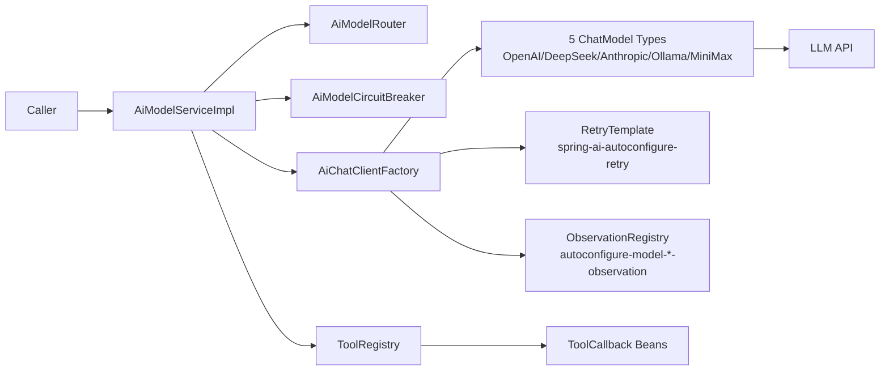
```mermaid
graph LR
    Caller[Caller] --> Service[AiModelServiceImpl]
    Service --> Router[AiModelRouter]
    Service --> CB[AiModelCircuitBreaker]
    Service --> ToolReg[ToolRegistry]
    Service --> Factory[AiChatClientFactory]
    Factory --> Models[5 ChatModel Types<br/>OpenAI/DeepSeek/Anthropic/Ollama/MiniMax]
    Factory --> Retry[RetryTemplate<br/>spring-ai-autoconfigure-retry]
    Factory --> Obs[ObservationRegistry<br/>autoconfigure-model-*-observation]
    Models --> LLM[LLM API]
    ToolReg --> Tools[ToolCallback Beans]
```

### 1. `call(AiRequest request)` — Synchronous Call

Entry method that orchestrates routing / circuit breaker / retry / tool calling.

#### Business Flow

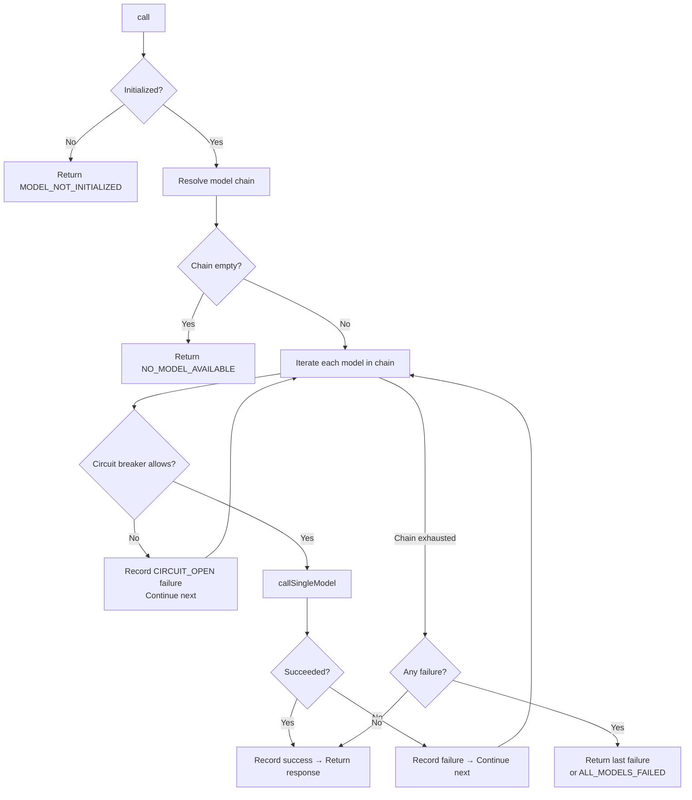
```mermaid
flowchart TD
    A[call] --> B{Initialized?}
    B -- No --> X1[Return MODEL_NOT_INITIALIZED]
    B -- Yes --> C[Resolve model chain]
    C --> D{Chain empty?}
    D -- Yes --> X2[Return NO_MODEL_AVAILABLE]
    D -- No --> E[Iterate each model in chain]
    E --> F{Circuit breaker allows?}
    F -- No --> Y1[Record CIRCUIT_OPEN failure<br/>Continue next]
    F -- Yes --> G[callSingleModel]
    G --> H{Succeeded?}
    H -- Yes --> I[Record success → Return response]
    H -- No --> J[Record failure → Continue next]
    Y1 --> E
    J --> E
    E -- Chain exhausted --> K{Any failure?}
    K -- Yes --> X3[Return last failure<br/>or ALL_MODELS_FAILED]
    K -- No --> I
```

#### Sequence Diagram

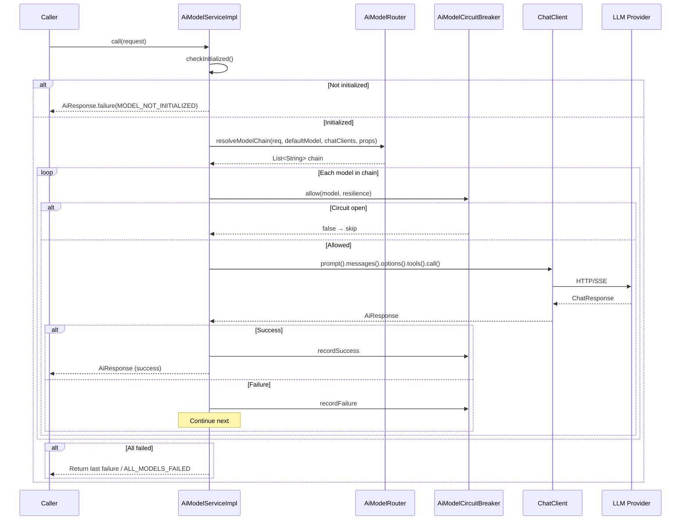
```mermaid
sequenceDiagram
    participant U as Caller
    participant S as AiModelServiceImpl
    participant R as AiModelRouter
    participant CB as AiModelCircuitBreaker
    participant CC as ChatClient
    participant L as LLM Provider

    U->>S: call(request)
    S->>S: checkInitialized()
    alt Not initialized
        S-->>U: AiResponse.failure(MODEL_NOT_INITIALIZED)
    else Initialized
        S->>R: resolveModelChain(req, defaultModel, chatClients, props)
        R-->>S: List<String> chain
        loop Each model in chain
            S->>CB: allow(model, resilience)
            alt Circuit open
                CB-->>S: false → skip
            else Allowed
                S->>CC: prompt().messages().options().tools().call()
                CC->>L: HTTP/SSE
                L-->>CC: ChatResponse
                CC-->>S: AiResponse
                alt Success
                    S->>CB: recordSuccess
                    S-->>U: AiResponse (success)
                else Failure
                    S->>CB: recordFailure
                    Note over S: Continue next
                end
            end
        end
        alt All failed
            S-->>U: Return last failure / ALL_MODELS_FAILED
        end
    end
```

#### Implementation Logic

1. **Initialization check** (`checkInitialized`): Returns `MODEL_NOT_INITIALIZED` immediately when `chatClients` is empty.
2. **Chain resolution** (`resolveChain`): Delegates to `AiModelRouter` to merge `request.modelName` + `request.fallbackModelNames` + `request.scene` routing + global `fallbackModels`, producing an ordered candidate list.
3. **Circuit breaker protection**: For each candidate, first checks `AiModelCircuitBreaker.allow(modelName, resilience)`; circuit-open models are skipped (not counted as failures).
4. **Single call** (`callSingleModel`): Gets `ChatClient` → injects `messages` + request-level `options` + `tools` → `.call()` → wraps into `AiResponse` (with `Usage` + `duration`).
5. **Success path**: Calls `recordSuccess` to reset the model's failure count, returns immediately.
6. **Failure path**: Calls `recordFailure` to increment failure count; after `failureThreshold` consecutive failures, the circuit opens for `openDurationMs`; continues to the next model in chain.
7. **Fallback**: If all models fail, returns the last failure; if no model was attempted at all, returns `ALL_MODELS_FAILED`.

### 2. `callAsync(AiRequest request)` — Asynchronous Call

#### Business Flow

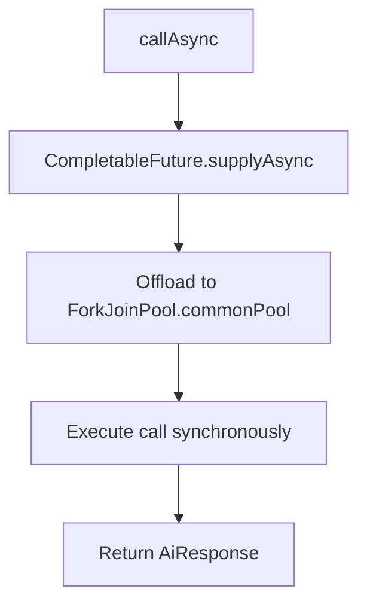
```mermaid
flowchart TD
    A[callAsync] --> B[CompletableFuture.supplyAsync]
    B --> C[Offload to ForkJoinPool.commonPool]
    C --> D[Execute call synchronously]
    D --> E[Return AiResponse]
```

#### Sequence Diagram

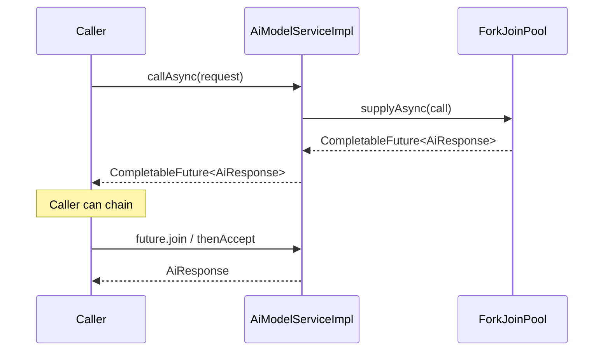
```mermaid
sequenceDiagram
    participant U as Caller
    participant S as AiModelServiceImpl
    participant P as ForkJoinPool
    U->>S: callAsync(request)
    S->>P: supplyAsync(call)
    P-->>S: CompletableFuture<AiResponse>
    S-->>U: CompletableFuture<AiResponse>
    Note over U: Caller can chain
    U->>S: future.join / thenAccept
    S-->>U: AiResponse
```

#### Implementation Logic

Simple wrapper: `CompletableFuture.supplyAsync(() -> call(request), defaultExecutor)`, offloading synchronous logic to `ForkJoinPool.commonPool()`. All routing / circuit breaker / retry / tool calling semantics are identical to `call`. Callers can use `thenAccept` / `thenApply` / `exceptionally` for chaining.

### 3. `stream(AiRequest request)` — Streaming Call

#### Business Flow

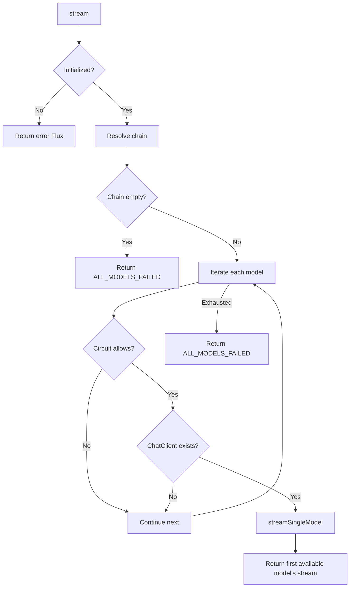
```mermaid
flowchart TD
    A[stream] --> B{Initialized?}
    B -- No --> X1[Return error Flux]
    B -- Yes --> C[Resolve chain]
    C --> D{Chain empty?}
    D -- Yes --> X2[Return ALL_MODELS_FAILED]
    D -- No --> E[Iterate each model]
    E --> F{Circuit allows?}
    F -- No --> Y[Continue next]
    F -- Yes --> G{ChatClient exists?}
    G -- No --> Y
    G -- Yes --> H[streamSingleModel]
    H --> I[Return first available model's stream]
    Y --> E
    E -- Exhausted --> X3[Return ALL_MODELS_FAILED]
```

#### Sequence Diagram

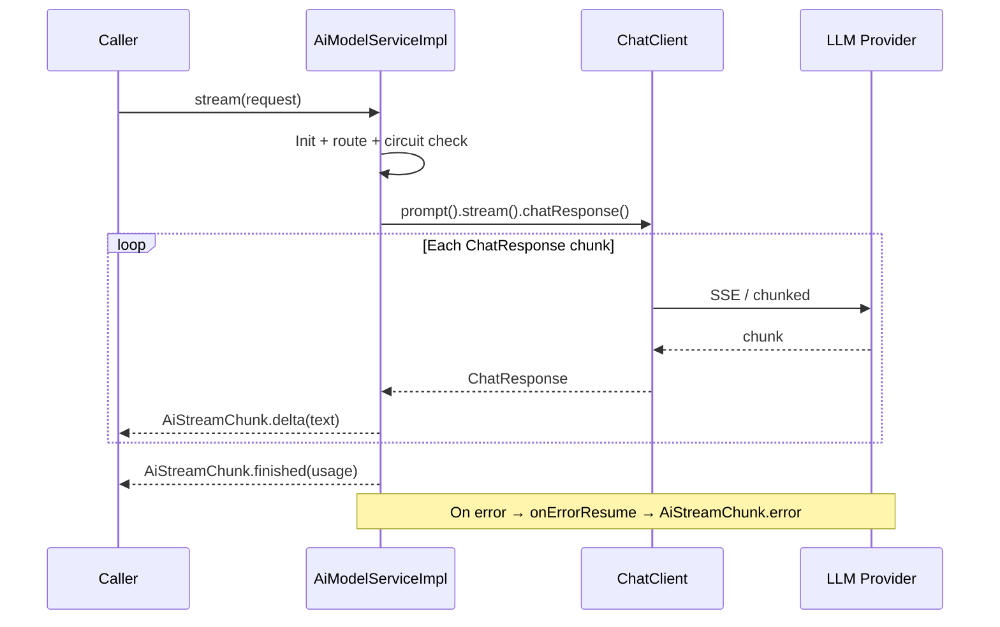
```mermaid
sequenceDiagram
    participant U as Caller
    participant S as AiModelServiceImpl
    participant CC as ChatClient
    participant L as LLM Provider
    U->>S: stream(request)
    S->>S: Init + route + circuit check
    S->>CC: prompt().stream().chatResponse()
    loop Each ChatResponse chunk
        CC->>L: SSE / chunked
        L-->>CC: chunk
        CC-->>S: ChatResponse
        S-->>U: AiStreamChunk.delta(text)
    end
    S-->>U: AiStreamChunk.finished(usage)
    Note over S,L: On error → onErrorResume → AiStreamChunk.error
```

#### Implementation Logic

1. Initialization check, chain resolution, and circuit breaker logic are the same as `call`, but **only the first available model** (not circuit-broken, not missing) starts streaming — no chain-level fallback.
2. `ChatClient.prompt().stream().chatResponse()` returns `Flux<ChatResponse>`. Each chunk extracts `getOutput().getText()`, filters empty values, and wraps into `AiStreamChunk.delta(text, modelName, provider)`.
3. When the stream ends naturally, an `AiStreamChunk.finished(modelName, provider, usage)` terminal chunk is appended (with `Usage`).
4. **Error path**: `onErrorResume` triggers `circuitBreaker.recordFailure` + returns `AiStreamChunk.error(message, STREAM_FAILED)`. Callers identify the error by error code.
5. **No retry**: Errors mid-stream fail immediately without calling `recordSuccess` (avoiding half-success state).

### 4. `callWithModel(String modelName, AiRequest request)` — Specify Model Call

#### Business Flow

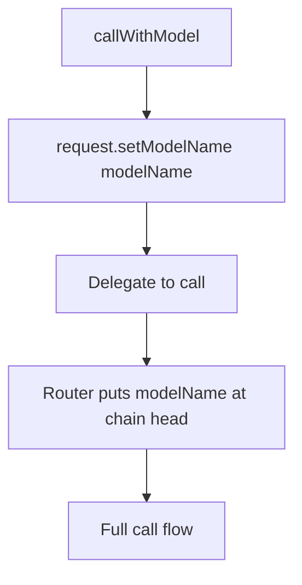
```mermaid
flowchart TD
    A[callWithModel] --> B[request.setModelName modelName]
    B --> C[Delegate to call]
    C --> D[Router puts modelName at chain head]
    D --> E[Full call flow]
```

#### Sequence Diagram

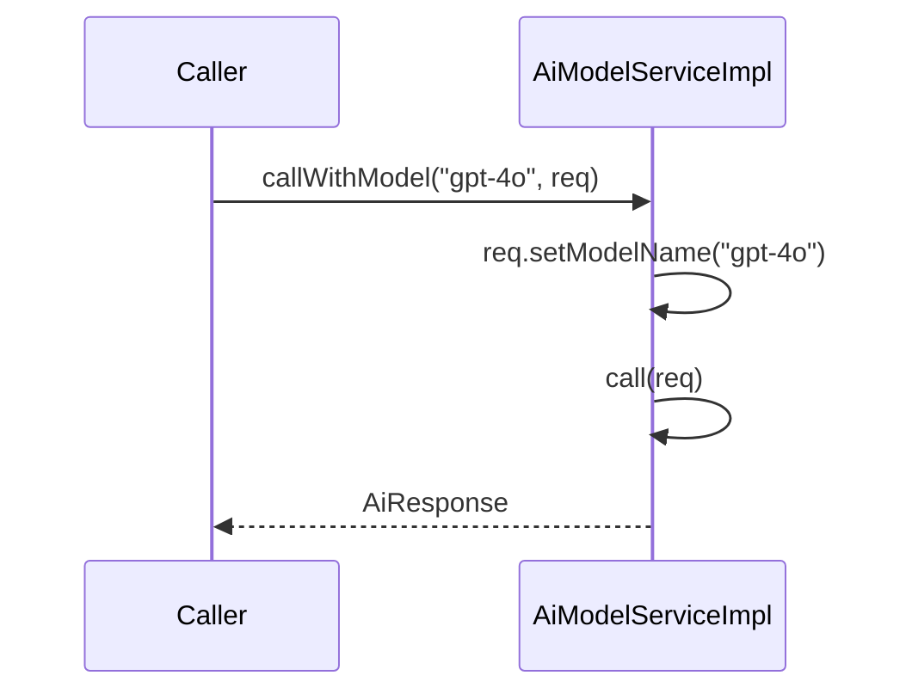
```mermaid
sequenceDiagram
    participant U as Caller
    participant S as AiModelServiceImpl
    U->>S: callWithModel("gpt-4o", req)
    S->>S: req.setModelName("gpt-4o")
    S->>S: call(req)
    S-->>U: AiResponse
```

#### Implementation Logic

Forwarder: Writes `modelName` into `AiRequest.modelName` and delegates to `call`. Internally, `resolveChain` places `modelName` at the head of the chain. **Note**: If `callWithModel` fails, it still falls back through `request.fallbackModelNames` / global fallback chain — to prevent fallback, set `request.fallbackModelNames` to empty.

### 5. `initializeModels(List<ModelOptions>)` — Dynamic Initialization

#### Business Flow

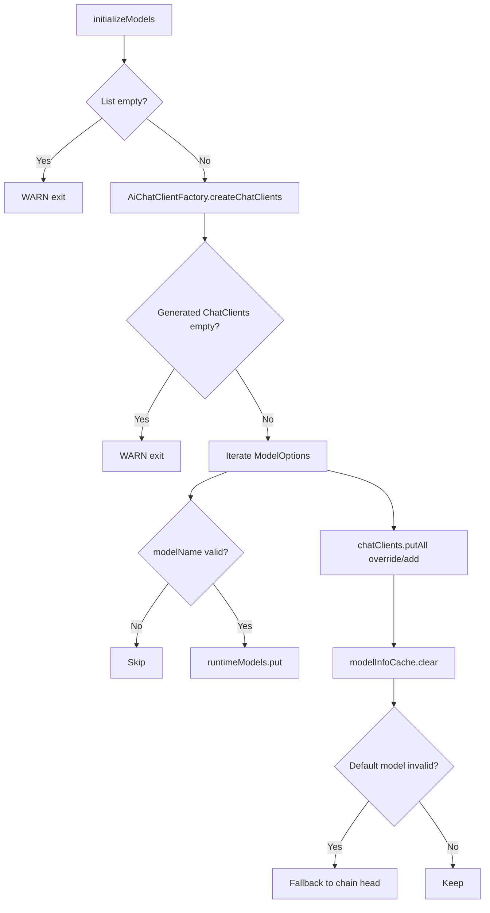
```mermaid
flowchart TD
    A[initializeModels] --> B{List empty?}
    B -- Yes --> X1[WARN exit]
    B -- No --> C[AiChatClientFactory.createChatClients]
    C --> D{Generated ChatClients empty?}
    D -- Yes --> X2[WARN exit]
    D -- No --> E[Iterate ModelOptions]
    E --> F{modelName valid?}
    F -- No --> Y[Skip]
    F -- Yes --> G[runtimeModels.put]
    E --> H[chatClients.putAll override/add]
    H --> I[modelInfoCache.clear]
    I --> J{Default model invalid?}
    J -- Yes --> K[Fallback to chain head]
    J -- No --> L[Keep]
```

#### Sequence Diagram

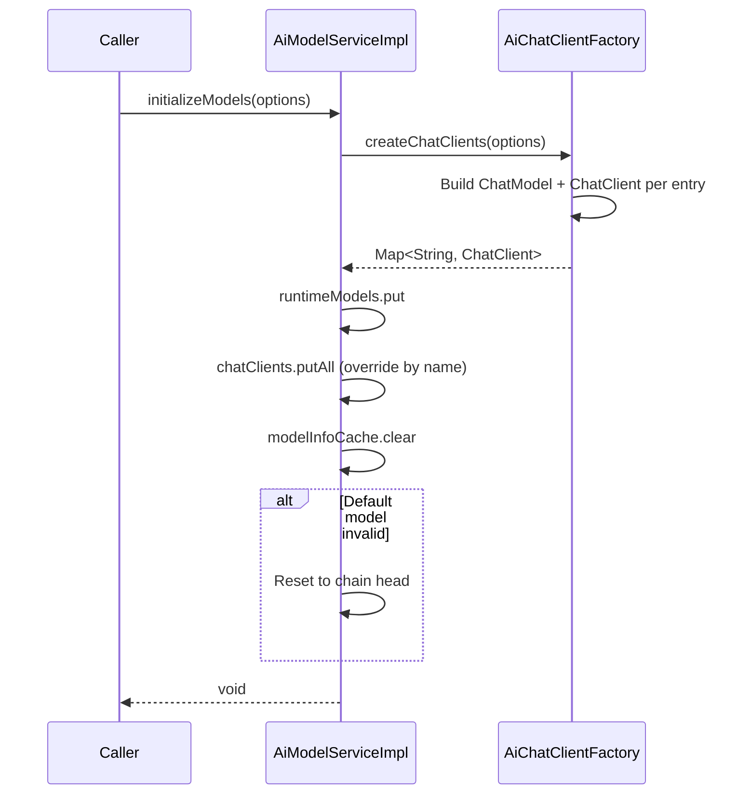
```mermaid
sequenceDiagram
    participant U as Caller
    participant S as AiModelServiceImpl
    participant F as AiChatClientFactory
    U->>S: initializeModels(options)
    S->>F: createChatClients(options)
    F->>F: Build ChatModel + ChatClient per entry
    F-->>S: Map<String, ChatClient>
    S->>S: runtimeModels.put
    S->>S: chatClients.putAll (override by name)
    S->>S: modelInfoCache.clear
    alt Default model invalid
        S->>S: Reset to chain head
    end
    S-->>U: void
```

#### Implementation Logic

Protected by `synchronized` for concurrency safety.

1. Delegates to `AiChatClientFactory.createChatClients(modelOptionsList)` to build the `ChatClient` map (with OpenAI-compatible fallback, ZHIPUAI/MOONSHOT via OpenAI path, unknown provider fallback).
2. Each `ModelOptions` is converted to `AiModelProperties.AiModel` and stored in `runtimeModels` (`getCurrentModels` = `properties.models` ∪ `runtimeModels`).
3. `chatClients.putAll(dynamicClients)`: **Models with the same name are overridden** — this is the core advantage of dynamic initialization, common in multi-tenant / multi-line hot-update scenarios.
4. Invalidates `modelInfoCache`; subsequent `getModelInfo` calls rebuild from new data.
5. Default model fallback: If the current `defaultModel` is not in the new `chatClients`, it resets to `chatClients.keySet().iterator().next()`.

### 6. `removeModel(String modelName)` — Remove Model

#### Business Flow

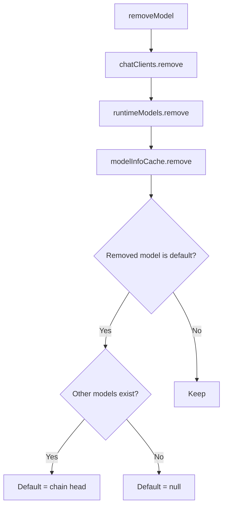
```mermaid
flowchart TD
    A[removeModel] --> B[chatClients.remove]
    B --> C[runtimeModels.remove]
    C --> D[modelInfoCache.remove]
    D --> E{Removed model is default?}
    E -- Yes --> F{Other models exist?}
    F -- Yes --> G[Default = chain head]
    F -- No --> H[Default = null]
    E -- No --> I[Keep]
```

#### Sequence Diagram

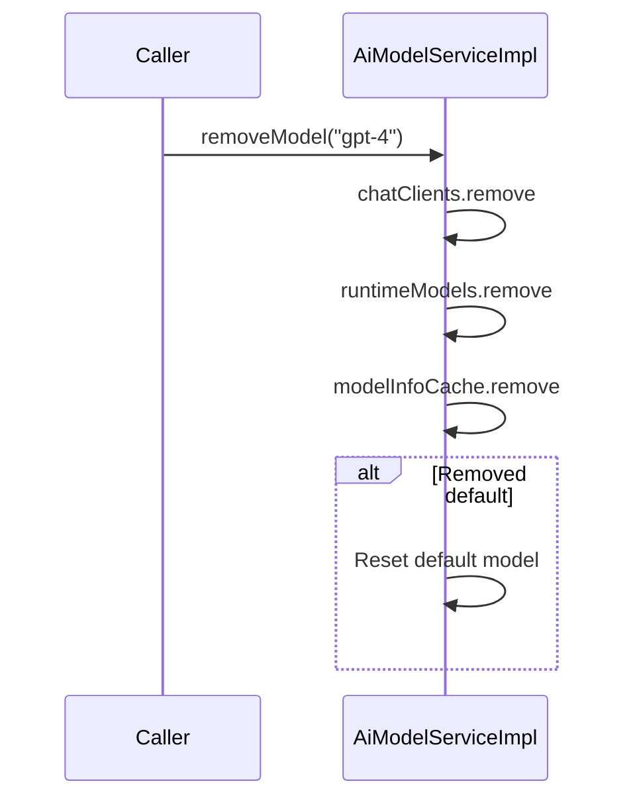
```mermaid
sequenceDiagram
    participant U as Caller
    participant S as AiModelServiceImpl
    U->>S: removeModel("gpt-4")
    S->>S: chatClients.remove
    S->>S: runtimeModels.remove
    S->>S: modelInfoCache.remove
    alt Removed default
        S->>S: Reset default model
    end
```

#### Implementation Logic

Protected by `synchronized`. `properties.models` (configuration file models) are **not cleaned** — subsequent `getCurrentModels` calls still include them. To fully remove a config model, businesses can reset the `chatClients` reference or call `initializeModels` without that model. INFO-level logging records the operation.

### 7. `probe(String modelName)` — Single Model Health Probe

#### Business Flow

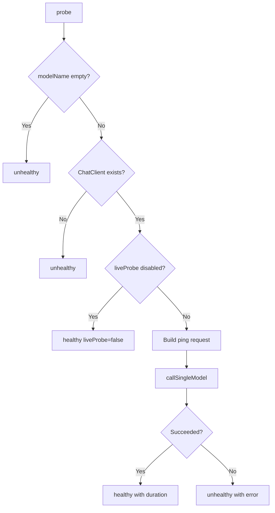
```mermaid
flowchart TD
    A[probe] --> B{modelName empty?}
    B -- Yes --> X1[unhealthy]
    B -- No --> C{ChatClient exists?}
    C -- No --> X2[unhealthy]
    C -- Yes --> D{liveProbe disabled?}
    D -- Yes --> E[healthy liveProbe=false]
    D -- No --> F[Build ping request]
    F --> G[callSingleModel]
    G --> H{Succeeded?}
    H -- Yes --> I[healthy with duration]
    H -- No --> J[unhealthy with error]
```

#### Sequence Diagram

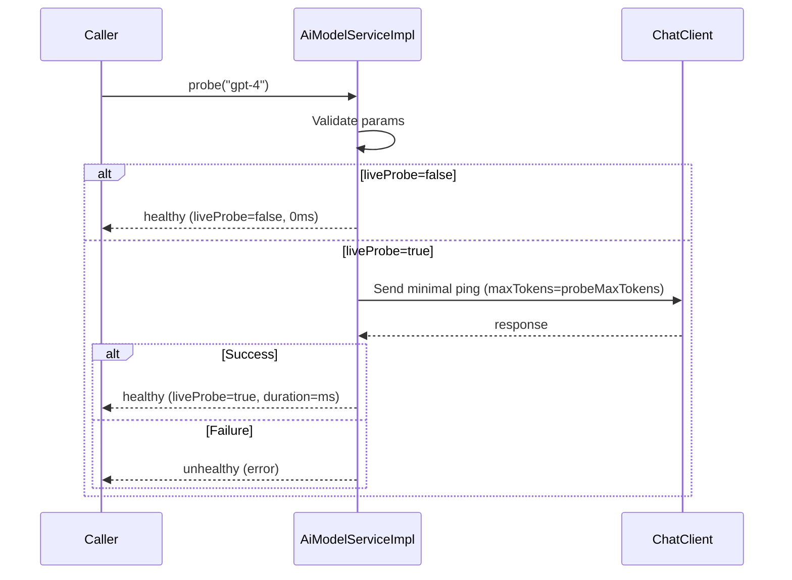
```mermaid
sequenceDiagram
    participant U as Caller
    participant S as AiModelServiceImpl
    participant CC as ChatClient
    U->>S: probe("gpt-4")
    S->>S: Validate params
    alt liveProbe=false
        S-->>U: healthy (liveProbe=false, 0ms)
    else liveProbe=true
        S->>CC: Send minimal ping (maxTokens=probeMaxTokens)
        CC-->>S: response
        alt Success
            S-->>U: healthy (liveProbe=true, duration=ms)
        else Failure
            S-->>U: unhealthy (error)
        end
    end
```

#### Implementation Logic

1. Validates `modelName` is non-null + `chatClients.containsKey`; either check failing returns `unhealthy`.
2. If `health-check.live-probe = false` (default `true`), only returns ChatClient existence (`healthy` + `liveProbe=false` + `0ms`) — no token consumption.
3. If live probe is enabled: builds a minimal request (`maxTokens = probeMaxTokens`, default 1), calls `callSingleModel` to measure actual duration.
4. Returns `AiHealthResult` (with `modelName` / `provider` / `liveProbe` / `durationMs` / `errorMessage`).
5. **Not counted for circuit breaker**: Probe calls do not affect `recordSuccess` / `recordFailure`, preventing business traffic misjudgment.

### 8. `probeAll()` — Probe All Models

#### Business Flow

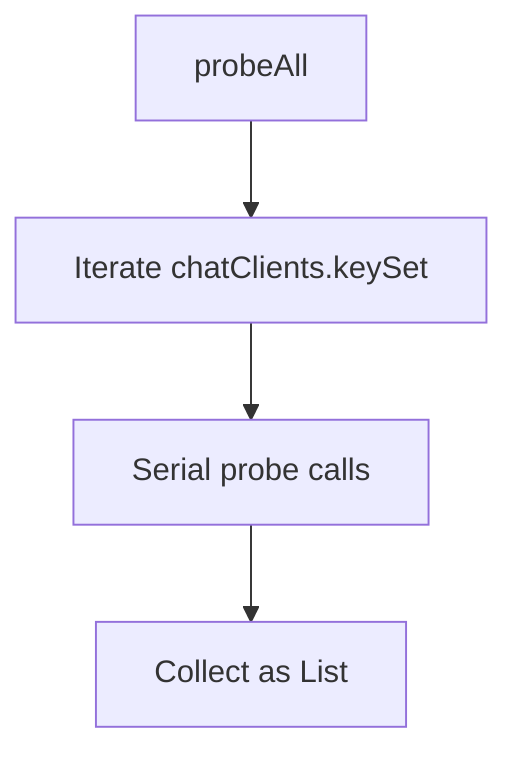
```mermaid
flowchart TD
    A[probeAll] --> B[Iterate chatClients.keySet]
    B --> C[Serial probe calls]
    C --> D[Collect as List]
```

#### Sequence Diagram

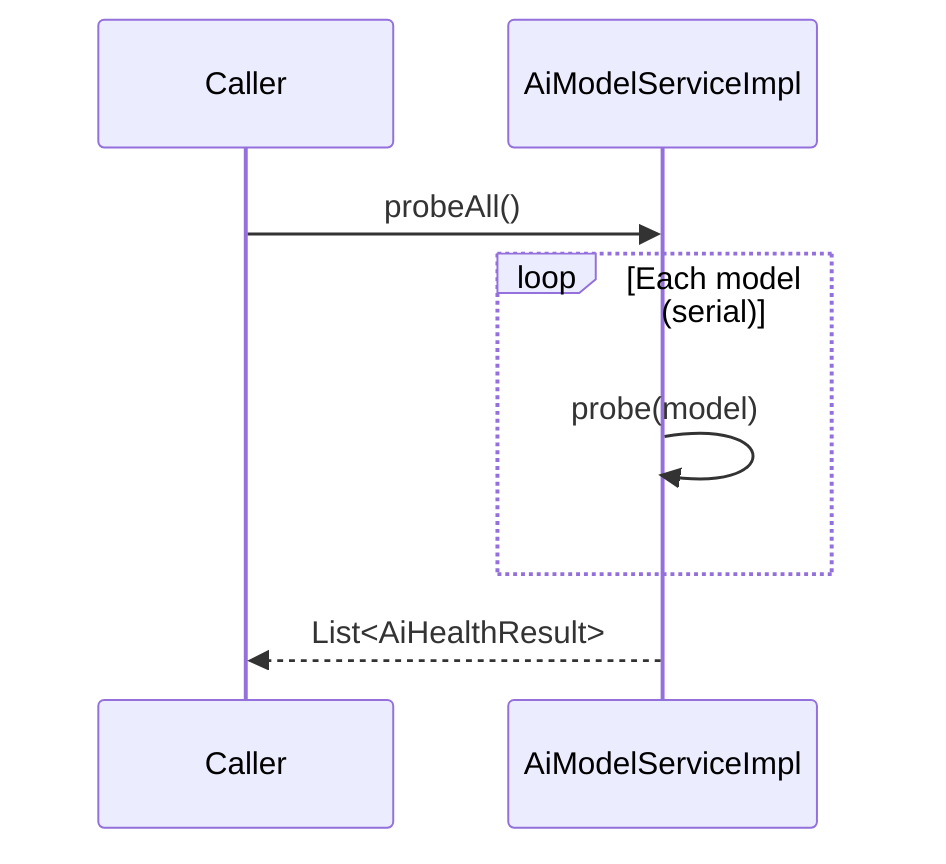
```mermaid
sequenceDiagram
    participant U as Caller
    participant S as AiModelServiceImpl
    U->>S: probeAll()
    loop Each model (serial)
        S->>S: probe(model)
    end
    S-->>U: List<AiHealthResult>
```

#### Implementation Logic

`chatClients.keySet().stream().map(this::probe).toList()`, **serial** invocation. Total latency = N models × average probe latency. For large model counts or slow probes, consider switching to `parallelStream` or `Flux.parallel()`.

### 9. `getAvailableModels()` — Get All Available Models

#### Business Flow

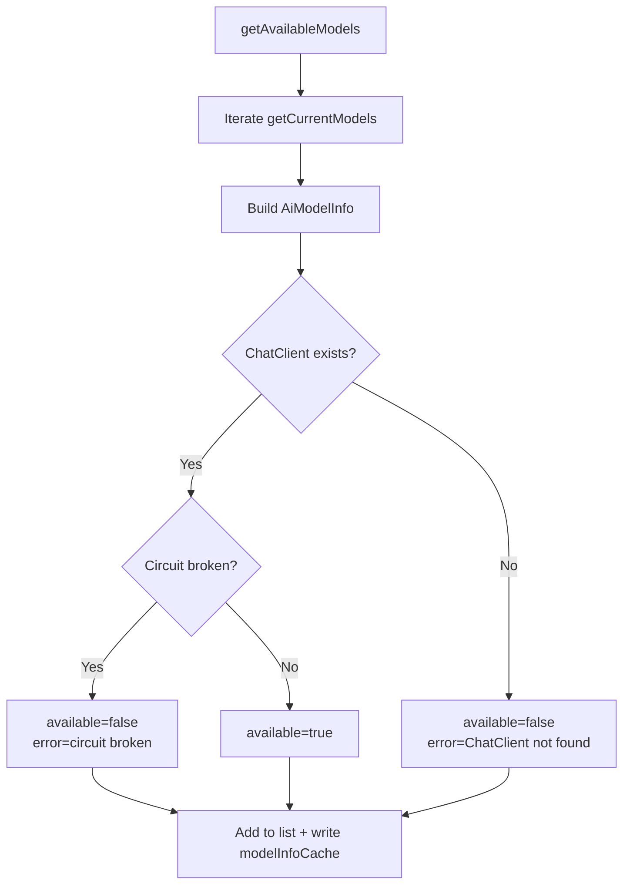
```mermaid
flowchart TD
    A[getAvailableModels] --> B[Iterate getCurrentModels]
    B --> C[Build AiModelInfo]
    C --> D{ChatClient exists?}
    D -- Yes --> E{Circuit broken?}
    E -- Yes --> F[available=false<br/>error=circuit broken]
    E -- No --> G[available=true]
    D -- No --> H[available=false<br/>error=ChatClient not found]
    F --> I[Add to list + write modelInfoCache]
    G --> I
    H --> I
```

#### Sequence Diagram

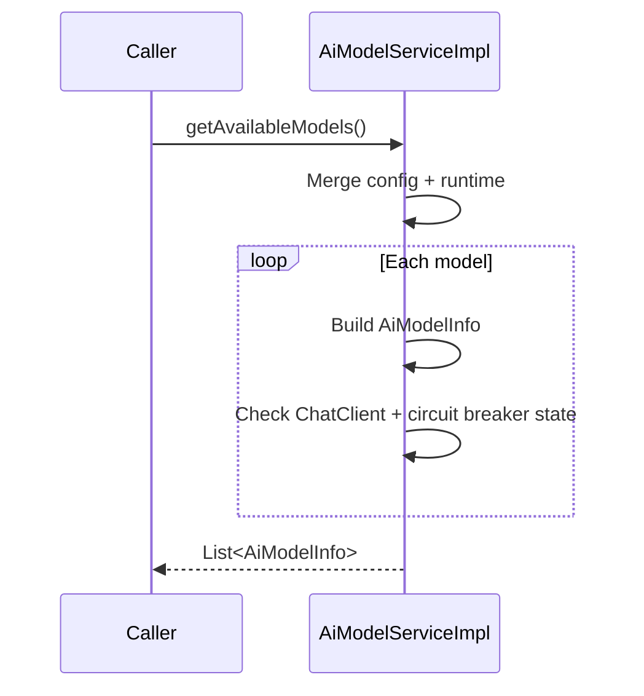
```mermaid
sequenceDiagram
    participant U as Caller
    participant S as AiModelServiceImpl
    U->>S: getAvailableModels()
    S->>S: Merge config + runtime
    loop Each model
        S->>S: Build AiModelInfo
        S->>S: Check ChatClient + circuit breaker state
    end
    S-->>U: List<AiModelInfo>
```

#### Implementation Logic

Merges `properties.models` (config) + `runtimeModels` (dynamic), builds `AiModelInfo` for each:

- `name` / `provider` / `description` (generated per provider via `getModelDescription` switch)
- `defaultModel` flag (compared against current `defaultModel`)
- `capabilities` (per-provider capability matrix: `temperature` / `topP` / `topK` / `frequencyPenalty` / `thinking` / `logprobs`, etc.)
- `available` (ChatClient exists + not circuit-broken; otherwise `false` + error reason)

Also populates `modelInfoCache` (keyed by `modelName`), used by `getModelInfo` via `computeIfAbsent`.

### 10. `getModelInfo(String modelName)` — Get Model Info

#### Business Flow

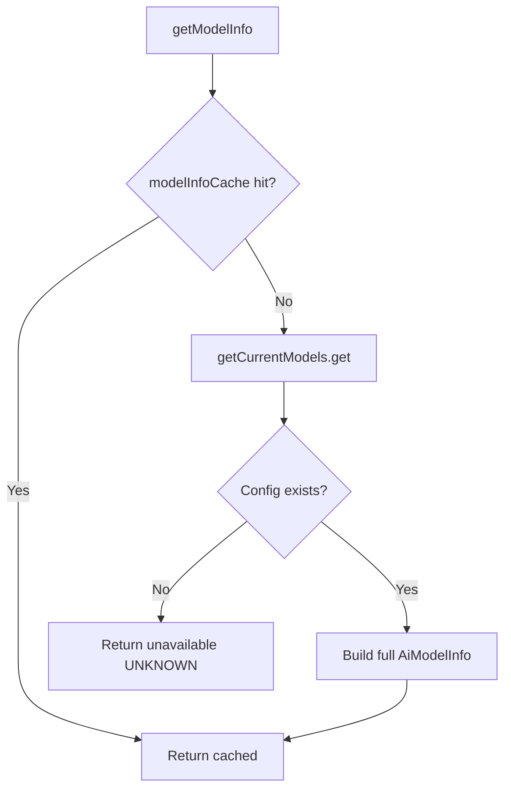
```mermaid
flowchart TD
    A[getModelInfo] --> B{modelInfoCache hit?}
    B -- Yes --> X[Return cached]
    B -- No --> C[getCurrentModels.get]
    C --> D{Config exists?}
    D -- No --> Y[Return unavailable UNKNOWN]
    D -- Yes --> E[Build full AiModelInfo]
    E --> X
```

#### Sequence Diagram

```mermaid
sequenceDiagram
    participant U as Caller
    participant S as AiModelServiceImpl
    U->>S: getModelInfo("gpt-4")
    alt Cache hit
        S-->>U: cached AiModelInfo
    else Cache miss
        S->>S: getCurrentModels
        alt Exists
            S-->>U: Newly built AiModelInfo
        else Not found
            S-->>U: unavailable(UNKNOWN, "Model config not found")
        end
    end
```

#### Implementation Logic

Uses `modelInfoCache.computeIfAbsent(name, ...)` caching:

- **Hit**: Returns directly (O(1))
- **Miss**: Merges config + runtime to find the model; if found, builds full `AiModelInfo` (with `description` + `capabilities` + `defaultModel` flag); if not found, returns `AiModelInfo.unavailable(name, "UNKNOWN", "Model config not found")`
- **Cache population**: Done during `getAvailableModels` path; subsequent queries use cache

### 11. `isModelAvailable(String modelName)` — Check Model Availability

#### Business Flow

```mermaid
flowchart TD
    A[isModelAvailable] --> B{chatClients contains?}
    B -- No --> X[false]
    B -- Yes --> C{circuitBreaker.isOpen?}
    C -- Yes --> X
    C -- No --> Y[true]
```

#### Sequence Diagram

```mermaid
sequenceDiagram
    participant U as Caller
    participant S as AiModelServiceImpl
    participant CB as AiModelCircuitBreaker
    U->>S: isModelAvailable("gpt-4")
    S->>CB: isOpen("gpt-4")
    CB-->>S: boolean
    S-->>U: chatClients.containsKey && !isOpen
```

#### Implementation Logic

`chatClients.containsKey(modelName) && !circuitBreaker.isOpen(modelName)` — **only checks ChatClient existence + circuit breaker state**, no actual call. Commonly used for quick routing decisions and model switching checks.

### 12. `getDefaultModel()` — Get Default Model

#### Business Flow

```mermaid
flowchart TD
    A[getDefaultModel] --> B{defaultModel already set?}
    B -- Yes --> X[Return]
    B -- No --> C{getCurrentModels non-empty?}
    C -- Yes --> D[defaultModel = chain head<br/>Return]
    C -- No --> Y[Return null]
```

#### Sequence Diagram

```mermaid
sequenceDiagram
    participant U as Caller
    participant S as AiModelServiceImpl
    U->>S: getDefaultModel()
    S->>S: Lazy load defaultModel
    S-->>U: String modelName or null
```

#### Implementation Logic

Lazy loading: On first access, if `defaultModel == null`, takes `getCurrentModels().keySet().iterator().next()` (the first model from config or dynamic init). `LinkedHashMap` preserves insertion order, so **the first model in the configuration file is the default**.

### 13. `setDefaultModel(String modelName)` — Set Default Model

#### Business Flow

```mermaid
flowchart TD
    A[setDefaultModel] --> B{Initialized?}
    B -- No --> X1[Throw IllegalStateException]
    B -- Yes --> C{getCurrentModels contains?}
    C -- No --> X2[Throw IllegalArgumentException]
    C -- Yes --> D[defaultModel = modelName]
```

#### Sequence Diagram

```mermaid
sequenceDiagram
    participant U as Caller
    participant S as AiModelServiceImpl
    U->>S: setDefaultModel("gpt-4")
    S->>S: Validate
    alt Validation failed
        S-->>U: throw IllegalStateException / IllegalArgumentException
    else Success
        S-->>U: void
    end
```

#### Implementation Logic

1. If not initialized, throws `IllegalStateException("AI model not initialized, cannot set default model")`.
2. If model not in `getCurrentModels()`, throws `IllegalArgumentException("Model does not exist: %s")`.
3. Otherwise assigns `this.defaultModel = modelName`, INFO-level log.
4. **Not persisted**: Only modifies the runtime field; on restart, `getDefaultModel`'s lazy loading re-determines the default.
