# Atlas Richie AI组件 (atlas-richie-component-ai)

## 📖 目录

- [📋 概述](#-概述)
- [✨ 核心能力](#-核心能力)
- [🤖 当前支持模型](#-当前支持模型)
  - [1) 组件内置 Provider(配置文件模式)](#1-组件内置-provider配置文件模式)
  - [2) 动态模式的未知 Provider 兜底](#2-动态模式的未知-provider-兜底)
- [📦 依赖](#-依赖)
- [🔌 EmbeddingModel 自动注入](#-embeddingmodel-自动注入)
- [🚀 使用方式一:配置文件初始化](#-使用方式一配置文件初始化)
- [🚀 使用方式二:数据库配置 + 动态初始化(推荐业务场景)](#-使用方式二数据库配置--动态初始化推荐业务场景)
  - [0) 关闭配置文件初始化(仅动态初始化模式)](#0-关闭配置文件初始化仅动态初始化模式)
  - [1) 业务系统构造模型配置列表](#1-业务系统构造模型配置列表)
  - [2) 调用组件动态初始化](#2-调用组件动态初始化)
- [💡 统一调用示例](#-统一调用示例)
- [🔌 AiModelService 接口](#-aimodelservice-接口)
- [📊 关键数据结构](#-关键数据结构)
  - [1) `AiRequest`](#1-airequest)
  - [2) `ModelOptions`(动态初始化输入)](#2-modeloptions动态初始化输入)
  - [3) `AiResponse`](#3-airesponse)
  - [4) `AiStreamChunk`(流式输出片段)](#4-aistreamchunk流式输出片段)
  - [5) `AiHealthResult`(健康检查结果)](#5-aihealthresult健康检查结果)
  - [6) `AiModelInfo`(模型信息)](#6-aimodelinfo模型信息)
- [📐 参数说明(AiModelOptions)](#-参数说明aimodeloptions)
- [📏 默认与覆盖规则](#-默认与覆盖规则)
- [🏭 生产建议](#-生产建议)
- [📕 完整配置参考](#-完整配置参考)
  - [platform.component.ai 配置树](#platformcomponentai-配置树)
  - [自动注册 Bean 清单](#自动注册-bean-清单)
  - [路由决策链](#路由决策链)
- [🔨 Tool Calling 功能](#-tool-calling-功能)
  - [1) 注册工具](#1-注册工具)
  - [2) 调用时声明工具](#2-调用时声明工具)
  - [3) 注意事项](#3-注意事项)
- [⚠️ 错误码参考](#-错误码参考)
- [🔧 📐 接口实现文档](#-接口实现文档)
  - [整体组件关系](#整体组件关系)
  - [1. `call(AiRequest request)` — 同步调用](#1-callairequest-request--同步调用)
  - [2. `callAsync(AiRequest request)` — 异步调用](#2-callasyncairequest-request--异步调用)
  - [3. `stream(AiRequest request)` — 流式调用](#3-streamairequest-request--流式调用)
  - [4. `callWithModel(String modelName, AiRequest request)` — 指定模型调用](#4-callwithmodelstring-modelname-airequest-request--指定模型调用)
  - [5. `initializeModels(List<ModelOptions>)` — 动态初始化](#5-initializemodelslistmodeloptions--动态初始化)
  - [6. `removeModel(String modelName)` — 移除模型](#6-removemodelstring-modelname--移除模型)
  - [7. `probe(String modelName)` — 单个模型健康探测](#7-probestring-modelname--单个模型健康探测)
  - [8. `probeAll()` — 全模型健康探测](#8-probeall--全模型健康探测)
  - [9. `getAvailableModels()` — 获取所有可用模型](#9-getavailablemodels--获取所有可用模型)
  - [10. `getModelInfo(String modelName)` — 获取指定模型](#10-getmodelinfostring-modelname--获取指定模型)
  - [11. `isModelAvailable(String modelName)` — 检查模型可用](#11-ismodelavailablestring-modelname--检查模型可用)
  - [12. `getDefaultModel()` — 获取默认模型](#12-getdefaultmodel--获取默认模型)
  - [13. `setDefaultModel(String modelName)` — 设置默认模型](#13-setdefaultmodelstring-modelname--设置默认模型)

------


## 概述

`richie-component-ai` 是基于 Spring AI 的统一大模型接入组件，目标是让业务系统以统一方式管理和调用不同模型。

当前组件同时支持两种初始化模式：

- **配置文件初始化**：通过 `application.yml` 固定配置模型
- **代码动态初始化**：业务系统从数据库读取模型配置后，运行时注入组件

这两种方式可并存，运行时动态初始化可覆盖同名模型。

## 核心能力

- 统一调用接口：同一个 `AiModelService` 调用不同厂商模型
- 多模型管理：支持查看可用模型、切换默认模型、按模型名调用
- 动态模型注册：支持 `initializeModels(List<ModelOptions>)` 运行时装载
- 兼容协议兜底：动态注册遇到未知 provider 时，自动降级为 OpenAI 协议
- 统一响应结构：包含内容、耗时、模型信息、token 使用统计

## 当前支持模型

### 1) 组件内置 Provider（配置文件模式）

`AiModelProperties.AiProviderType` 当前支持：

- `OPENAI`
- `DEEPSEEK`
- `ZHIPUAI`（通过 OpenAI 兼容协议接入）
- `ANTHROPIC`
- `OLLAMA`
- `MINIMAX`
- `MOONSHOT`（通过 OpenAI 兼容协议接入）

### 2) 动态模式的未知 Provider 兜底

当调用 `initializeModels(List<ModelOptions>)` 时，`ModelOptions.provider` 是字符串。

- 若可识别为上述内置 Provider，则按内置逻辑初始化
- 若不可识别，则自动降级为 `OPENAI` 协议初始化，不会因枚举未定义而失败

## 依赖

```xml
<dependency>
    <groupId>com.richie.component</groupId>
    <artifactId>atlas-richie-component-ai</artifactId>
    <version>1.0.0-SNAPSHOT</version>
</dependency>
```

## EmbeddingModel 自动注入

从当前版本开始，`richie-component-ai` 在配置文件初始化模式下会自动注册 `EmbeddingModel` Bean（Bean 名称：`aiEmbeddingModel`）。

- 默认策略：**跟随默认模型**（即 `platform.component.ai.models` 中第一个模型）
- 适用场景：`richie-component-vector` 与各 provider 子组件需要 `EmbeddingModel` 时可直接复用
- 覆盖机制：业务侧若自行声明 `EmbeddingModel` Bean，会覆盖默认自动注入

注意：

- 当 `config-initialization-enabled: false` 时，组件不会创建默认 `EmbeddingModel`
- 当未配置任何模型时，也不会创建默认 `EmbeddingModel`
- 上述场景请在业务侧手工声明 `EmbeddingModel` Bean

## 使用方式一：配置文件初始化

```yaml
platform:
  component:
    ai:
      models:
        gpt-4o:
          provider: OPENAI
          api-key: ${OPENAI_API_KEY:}
          base-url: ${OPENAI_BASE_URL:https://api.openai.com}
          options:
            model: gpt-4o
            max-tokens: 2000
            temperature: 0.7

        deepseek-chat:
          provider: DEEPSEEK
          api-key: ${DEEPSEEK_API_KEY:}
          base-url: ${DEEPSEEK_BASE_URL:https://api.deepseek.com}
          options:
            model: deepseek-chat
            temperature: 0.7

        zhipu-glm:
          provider: ZHIPUAI
          api-key: ${ZHIPUAI_API_KEY:}
          base-url: ${ZHIPUAI_BASE_URL:https://open.bigmodel.cn/api/paas/v4}
          options:
            model: glm-4

        claude-sonnet:
          provider: ANTHROPIC
          api-key: ${ANTHROPIC_API_KEY:}
          base-url: ${ANTHROPIC_BASE_URL:https://api.anthropic.com}
          options:
            model: claude-3-5-sonnet-20240620
            max-tokens: 2000
            temperature: 0.7
            top-k: 40

        minimax-main:
          provider: MINIMAX
          api-key: ${MINIMAX_API_KEY:}
          base-url: ${MINIMAX_BASE_URL:https://api.minimax.chat}
          options:
            model: abab6.5g-chat

        moonshot-main:
          provider: MOONSHOT
          api-key: ${MOONSHOT_API_KEY:}
          base-url: ${MOONSHOT_BASE_URL:https://api.moonshot.cn/v1}
          options:
            model: moonshot-v1-8k

        ollama-local:
          provider: OLLAMA
          base-url: ${OLLAMA_BASE_URL:http://localhost:11434}
          options:
            model: qwen2.5:7b
```

## 使用方式二：数据库配置 + 动态初始化（推荐业务场景）

### 0) 关闭配置文件初始化（仅动态初始化模式）

当你希望模型全部来自数据库，而不是 `application.yml`，请先关闭启动时 `@Bean` 初始化：

```yaml
platform:
  component:
    ai:
      config-initialization-enabled: false
```

行为说明：

- 组件启动时不会构造任何 `ChatClient`
- 必须先调用 `initializeModels(List<ModelOptions>)` 才可执行 AI 调用
- 若在初始化前调用 `AiModelService.call/callAsync/callWithModel`，将返回：
  - `errorCode = MODEL_NOT_INITIALIZED`
  - `errorMessage = AI模型尚未初始化，无法执行调用，请先通过配置文件或 initializeModels 完成初始化`

### 1) 业务系统构造模型配置列表

```java
import config.com.richie.component.ai.AiModelProperties;
import model.com.richie.component.ai.ModelOptions;

List<ModelOptions> options = List.of(
        new ModelOptions()
                .setModelName("tenant-a-openai")
                .setProvider("OPENAI")
                .setBaseUrl("https://api.openai.com")
                .setApiKey("sk-xxx")
                .setOptions(new AiModelProperties.AiModelOptions()
                        .setModel("gpt-4o")
                        .setTemperature(0.6)
                        .setMaxTokens(2000)),

        new ModelOptions()
                .setModelName("tenant-a-custom-compat")
                .setProvider("MY_PRIVATE_PROVIDER") // 未定义provider
                .setBaseUrl("https://your-openai-compatible-endpoint/v1")
                .setApiKey("ak-yyy")
                .setOptions(new AiModelProperties.AiModelOptions()
                        .setModel("private-model"))
);
```

### 2) 调用组件动态初始化

```java


aiModelService.initializeModels(options);
```

执行后：

- `tenant-a-openai` 按 OpenAI 逻辑初始化
- `tenant-a-custom-compat` 因 provider 未识别，自动按 OpenAI 兼容协议初始化

## 统一调用示例

```java
import model.com.richie.component.ai.AiRequest;
import model.com.richie.component.ai.AiResponse;

// 1. 默认模型调用
AiResponse r1 = aiModelService.call(AiRequest.ofUserMessage("请简要介绍你自己"));

        // 2. 指定模型调用
        AiResponse r2 = aiModelService.callWithModel(
                "tenant-a-openai",
                AiRequest.ofSystemAndUser("你是Java架构师", "请解释DDD分层")
        );

// 3. 异步调用
aiModelService.callAsync(AiRequest.ofUserMessage("生成一个Spring Boot Controller示例"))
        .thenAccept(resp ->{
        	if(resp.isSuccess()){
        		System.out.println(resp.getContent());
        	}
        });
```

## AiModelService 接口

```java
AiResponse call(AiRequest request);
CompletableFuture<AiResponse> callAsync(AiRequest request);
AiResponse callWithModel(String modelName, AiRequest request);

List<AiModelInfo> getAvailableModels();
AiModelInfo getModelInfo(String modelName);
boolean isModelAvailable(String modelName);

String getDefaultModel();
void setDefaultModel(String modelName);

void initializeModels(List<ModelOptions> modelOptionsList);
```

## 关键数据结构

### 1) `AiRequest`

- `modelName`：可选，指定调用模型名
- `scene`：业务场景标识，配合 `routing.scene-rules` 做场景路由
- `fallbackModelNames`：请求级降级模型链（主模型失败后按序尝试）
- `toolNames`：工具调用名称列表，引用 `ToolCallback` Bean
- `messages`：对话消息（`AiRequest.Message`）
- `options`：请求级参数覆盖（`AiRequest.ModelOptions`，非 null 字段覆盖默认配置）
- `metadata`：请求元数据（用户 ID、会话 ID 等，不影响 AI 回复）

消息类型 `AiRequest.Message`：
- `role`：角色（`system` / `user` / `assistant`）
- `content`：消息内容
- `name`：消息名称（可选）

请求级参数 `AiRequest.ModelOptions`（与配置参数结构一致，在请求中覆盖默认值）：
- `model` / `maxTokens` / `temperature` / `topP` / `topK`
- `frequencyPenalty` / `presencePenalty` / `stop`
- `logprobs` / `topLogprobs` / `enableThinking` / `thinkingBudgetTokens`

便捷工厂方法：

- `AiRequest.ofUserMessage(content)`：单条用户消息
- `AiRequest.ofSystemAndUser(systemPrompt, userMessage)`：系统指令 + 用户消息
- `AiRequest.ofMessages(messages)`：完整对话历史

### 2) `ModelOptions`（动态初始化输入）

- `modelName`：组件内部模型唯一标识
- `provider`：字符串 provider（支持未知值）
- `baseUrl`：模型 API 地址
- `apiKey`：模型 APIKey
- `options`：模型参数（`AiModelProperties.AiModelOptions`）

### 3) `AiResponse`

- `success`：是否成功
- `content`：模型文本输出
- `modelName` / `provider`：实际调用模型信息
- `duration`：耗时（毫秒）
- `usage`：token 统计（`AiResponse.Usage`，含 `promptTokens` / `completionTokens` / `totalTokens`）
- `errorMessage` / `errorCode`：失败信息
- `rawResponse`：原始响应数据
- `metadata`：响应元数据

### 4) `AiStreamChunk`（流式输出片段）

- `delta`：增量文本
- `finished`：是否为最后一个片段
- `modelName` / `provider`：模型信息
- `usage`：结束时的 token 统计（`AiResponse.Usage`）
- `errorCode` / `errorMessage`：错误信息

工厂方法：
- `AiStreamChunk.delta(text, modelName, provider)`：增量块
- `AiStreamChunk.finished(modelName, provider, usage)`：终态块（含用量统计）
- `AiStreamChunk.error(message, code)`：错误块

### 5) `AiHealthResult`（健康检查结果）

- `modelName` / `provider`：模型信息
- `healthy`：是否健康
- `liveProbe`：是否发起了真实 LLM 调用
- `durationMs`：探测耗时（毫秒）
- `message`：状态消息
- `checkedAt`：检查时间

### 6) `AiModelInfo`（模型信息）

- `name` / `provider`：模型名称与提供商
- `description`：模型描述
- `available`：是否可用（ChatClient 存在且未熔断）
- `defaultModel`：是否为当前默认模型
- `type`：模型类型（`CHAT` / `TEXT_GENERATION` / `EMBEDDING` / `IMAGE_GENERATION` / `MULTIMODAL`）
- `capabilities`：能力配置（`ModelCapabilities`，详见能力矩阵）
- `lastChecked`：状态检查时间
- `errorMessage`：不可用时的错误信息

## 参数说明（AiModelOptions）

常用参数：

- `model`
- `maxTokens`
- `temperature`
- `topP`
- `frequencyPenalty`
- `presencePenalty`
- `stop`

特定模型参数：

- `topK`（Anthropic）
- `logprobs`、`topLogprobs`（OpenAI/DeepSeek 等支持时）
- `enableThinking`、`thinkingBudgetTokens`（Anthropic 思考模式参数）

各 Provider 能力矩阵：

| 参数 | OpenAI | DeepSeek | Anthropic | MiniMax | Ollama |
|---|---|---|---|---|---|
| `temperature` | ✅ | ✅ | ✅ | ✅ | ✅ |
| `topP` | ✅ | ✅ | ✅ | ✅ | ❌ |
| `topK` | ❌ | ❌ | ✅ | ❌ | ❌ |
| `frequencyPenalty` | ✅ | ✅ | ❌ | ✅ | ❌ |
| `presencePenalty` | ✅ | ✅ | ❌ | ✅ | ❌ |
| `stop` | ✅ | ✅ | ❌ | ✅ | ✅ |
| `logprobs` / `topLogprobs` | ✅ | ✅ | ❌ | ❌ | ❌ |
| `enableThinking` | ❌ | ❌ | ✅ | ❌ | ❌ |

## 默认与覆盖规则

- 启动时：先加载配置文件模型
- 运行时：调用 `initializeModels(...)` 后新增/覆盖同名模型
- 默认模型：
  - 如果未主动设置，使用当前可用模型集合中的第一个
  - 若当前默认模型被覆盖或不可用，会自动回退到可用模型

## 生产建议

- API Key 不要写死在代码或明文配置中，建议使用配置中心/密钥管理
- 动态初始化前建议先做连通性探测，再落库并生效
- 业务可按租户、业务线、场景维护模型路由策略（模型名映射）
- 对调用失败增加熔断/降级策略，避免外部模型波动影响主链路

## 完整配置参考

### platform.component.ai 配置树

```yaml
platform:
  component:
    ai:
      # --- 初始化控制 ---
      config-initialization-enabled: true  # false = 禁用配置文件初始化，仅动态初始化

      # --- 模型定义 ---
      models:
        gpt-4o:
          provider: OPENAI
          api-key: ${OPENAI_API_KEY}
          base-url: ${OPENAI_BASE_URL:https://api.openai.com}
          options:
            model: gpt-4o
            max-tokens: 2000
            temperature: 0.7

      # --- 路由与降级 ---
      routing:
        enabled: false              # 是否启用场景路由
        fallback-enabled: true      # 主模型失败后是否尝试 fallback 链
        fallback-models: []         # 全局降级模型列表
        scene-rules:                # 按业务场景选择模型链（enabled=true 时生效）
          translation: [ "gpt-4o", "claude-sonnet" ]
          code-review: [ "deepseek-chat", "gpt-4o" ]

      # --- 熔断 ---
      resilience:
        circuit-breaker-enabled: true   # 启用简易熔断
        failure-threshold: 3            # 连续失败 3 次后熔断
        open-duration-ms: 60000          # 熔断打开持续 60 秒

      # --- 健康检查 ---
      health-check:
        live-probe: true        # probe 时是否发起真实 LLM 调用
        probe-max-tokens: 1     # live probe 使用的最小输出 token
```

### 自动注册 Bean 清单

| Bean 类型 | Bean 名称 | 注册条件 |
|---|---|---|
| `Map<String, ChatClient>` | `aiChatClients` | `config-initialization-enabled = true` |
| `EmbeddingModel` | `aiEmbeddingModel` | 上述条件 + 模型非空 + `@ConditionalOnMissingBean` |
| `AiModelProperties` | — | `@EnableConfigurationProperties` |
| `ToolRegistry` | — | 始终注册（`@Component`） |
| `retryTemplate` | — | 由 `spring-ai-autoconfigure-retry` 自动注册 |

### 路由决策链

`AiModelRouter.resolveModelChain` 按以下优先级合并调用链：

```
request.modelName（请求显式指定）
  └── routing.scene-rules[request.scene]（场景路由，需 enabled=true）
       └── defaultModel（全局默认模型）
            └── request.fallbackModelNames（请求级降级链）
                 └── routing.fallbackModels（全局降级链）
                      └── 过滤 ChatClient 不存在的模型
```

最终链上去重后串行调用，首个成功即返回。

## Tool Calling 功能

`richie-component-ai` 通过 Spring AI M8 的 `ToolCallback` 机制支持工具调用（Function Calling）。

### 1) 注册工具

业务方声明 `ToolCallback` Bean，`ToolRegistry` 在启动时按 `ToolDefinition.name()` 自动索引：

```java
public record WeatherQuery(String city) {}

public class WeatherService implements java.util.function.Function<WeatherQuery, String> {
    @Override
    public String apply(WeatherQuery query) {
        return "北京当前温度 22°C，晴";
    }
}

@Bean
public ToolCallback weatherTool() {
    return FunctionToolCallback.builder("get_weather", new WeatherService())
            .description("查询指定城市的天气")
            .inputType(WeatherQuery.class)
            .build();
}
```

### 2) 调用时声明工具

`AiRequest.toolNames` 按名称引用已注册的工具：

```java
AiResponse response = aiModelService.call(
    AiRequest.ofUserMessage("北京今天天气怎么样？")
        .setToolNames(List.of("get_weather"))
);
```

工具调用同时支持同步 `call()` 与流式 `stream()`。工具名缺失时静默 WARN 跳过，不影响调用。

### 3) 注意事项

- **重名处理**：先注册者获胜，重复项静默丢弃
- **名称匹配**：以 `ToolDefinition.name()` 为准（通常与 `FunctionToolCallback.builder(name, ...)` 的 name 一致）
- **启用方式**：当前仅通过 `AiRequest.toolNames` 显式启用，不支持全局默认工具

## 错误码参考

| 错误码 | 触发条件 | 来源方法 |
|---|---|---|
| `MODEL_NOT_INITIALIZED` | `chatClients` 为空时调用 `call` / `stream` | `checkInitialized()` |
| `NO_MODEL_AVAILABLE` | 路由解析后的模型调用链为空 | `resolveChain()` |
| `CIRCUIT_OPEN` | 模型处于熔断打开状态，跳过该模型 | `circuitBreaker.allow()` |
| `ALL_MODELS_FAILED` | 链中所有模型均调用失败 | `call()` / `stream()` |
| `MODEL_UNAVAILABLE` | 模型对应的 `ChatClient` 在调用时不存在 | `callSingleModel()` |
| `STREAM_FAILED` | 流式调用中途发生异常 | `stream()` onErrorResume |
| `UNKNOWN_ERROR` | `AiResponse.failure(msg)` 无参版本的默认错误码 | — |

## 📐 接口实现文档

> 本节按 `AiModelService` 接口的 13 个 public API 逐个说明**业务流程**、**时序关系**和**实现逻辑**。
> 实现版本：M8（2.0.0-M8），已集成 Observation、Spring 7 内建 Retry、Tool Calling 三大扩展点。

### 整体组件关系

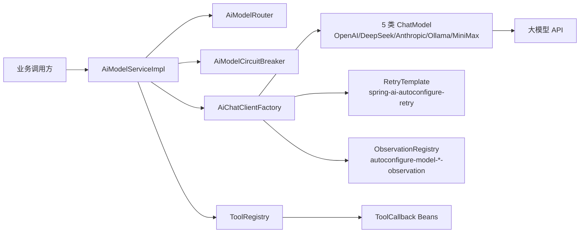
```mermaid
graph LR
    Caller[业务调用方] --> Service[AiModelServiceImpl]
    Service --> Router[AiModelRouter]
    Service --> CB[AiModelCircuitBreaker]
    Service --> ToolReg[ToolRegistry]
    Service --> Factory[AiChatClientFactory]
    Factory --> Models[5 类 ChatModel<br/>OpenAI/DeepSeek/Anthropic/Ollama/MiniMax]
    Factory --> Retry[RetryTemplate<br/>spring-ai-autoconfigure-retry]
    Factory --> Obs[ObservationRegistry<br/>autoconfigure-model-*-observation]
    Models --> LLM[大模型 API]
    ToolReg --> Tools[ToolCallback Beans]
```

### 1. `call(AiRequest request)` — 同步调用

入口方法，串起路由 / 熔断 / 重试 / 工具调用全链路。

#### 业务流程

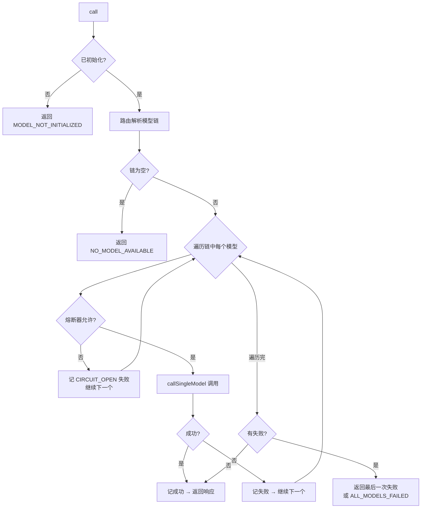
```mermaid
flowchart TD
    A[call] --> B{已初始化?}
    B -- 否 --> X1[返回 MODEL_NOT_INITIALIZED]
    B -- 是 --> C[路由解析模型链]
    C --> D{链为空?}
    D -- 是 --> X2[返回 NO_MODEL_AVAILABLE]
    D -- 否 --> E{遍历链中每个模型}
    E --> F{熔断器允许?}
    F -- 否 --> Y1[记 CIRCUIT_OPEN 失败<br/>继续下一个]
    F -- 是 --> G[callSingleModel 调用]
    G --> H{成功?}
    H -- 是 --> I[记成功 → 返回响应]
    H -- 否 --> J[记失败 → 继续下一个]
    Y1 --> E
    J --> E
    E -- 遍历完 --> K{有失败?}
    K -- 是 --> X3[返回最后一次失败<br/>或 ALL_MODELS_FAILED]
    K -- 否 --> I
```

#### 时序图

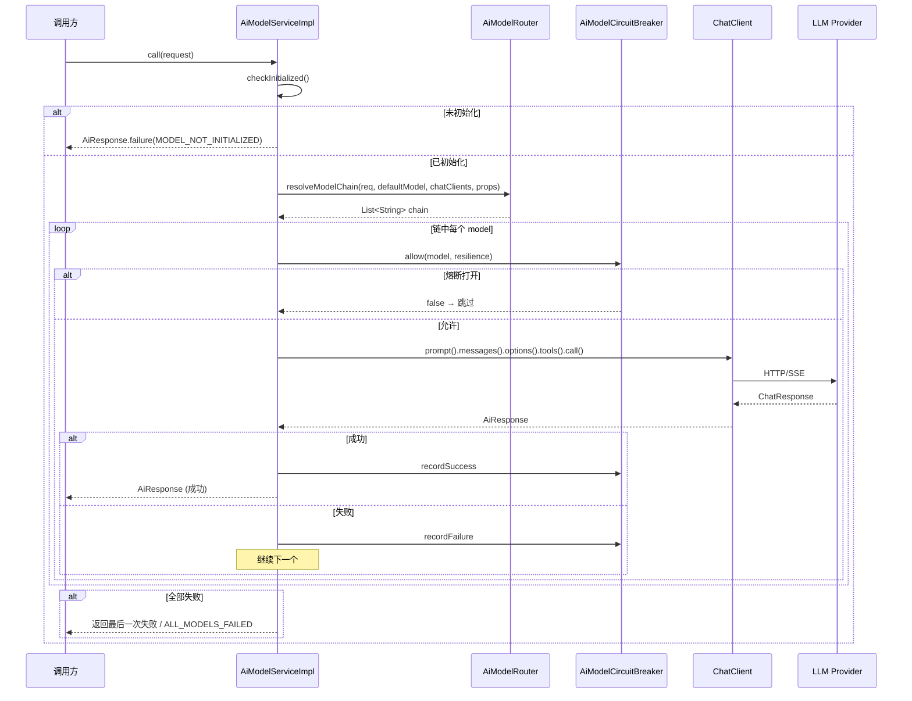
```mermaid
sequenceDiagram
    participant U as 调用方
    participant S as AiModelServiceImpl
    participant R as AiModelRouter
    participant CB as AiModelCircuitBreaker
    participant CC as ChatClient
    participant L as LLM Provider

    U->>S: call(request)
    S->>S: checkInitialized()
    alt 未初始化
        S-->>U: AiResponse.failure(MODEL_NOT_INITIALIZED)
    else 已初始化
        S->>R: resolveModelChain(req, defaultModel, chatClients, props)
        R-->>S: List<String> chain
        loop 链中每个 model
            S->>CB: allow(model, resilience)
            alt 熔断打开
                CB-->>S: false → 跳过
            else 允许
                S->>CC: prompt().messages().options().tools().call()
                CC->>L: HTTP/SSE
                L-->>CC: ChatResponse
                CC-->>S: AiResponse
                alt 成功
                    S->>CB: recordSuccess
                    S-->>U: AiResponse (成功)
                else 失败
                    S->>CB: recordFailure
                    Note over S: 继续下一个
                end
            end
        end
        alt 全部失败
            S-->>U: 返回最后一次失败 / ALL_MODELS_FAILED
        end
    end
```

#### 实现逻辑

1. **初始化检查**（`checkInitialized`）：`chatClients` 为空时立即返回 `MODEL_NOT_INITIALIZED` 错误（业务侧可据此触发"先初始化"分支）。
2. **模型链解析**（`resolveChain`）：委托 `AiModelRouter` 合并 `request.modelName` + `request.fallbackModelNames` + `request.scene` 路由 + 全局 `fallbackModels`，输出有序候选列表。
3. **熔断保护**：对每个候选模型，先询问 `AiModelCircuitBreaker.allow(modelName, resilience)`；熔断中直接跳过（不计入失败统计）。
4. **单次调用**（`callSingleModel`）：取 `ChatClient` → 注入 `messages` + 请求级 `options` + `tools` → `.call()` → 包装成 `AiResponse`（含 `Usage` + `duration`）。
5. **成功路径**：调 `recordSuccess` 重置该模型失败计数，立即返回。
6. **失败路径**：调 `recordFailure` 累计失败次数；连续 `failureThreshold` 次后熔断打开 `openDurationMs` 毫秒；继续链中下一个。
7. **兜底返回**：遍历结束仍有失败则返回最后一次失败响应；若链中无任何模型被尝试，返回 `ALL_MODELS_FAILED`。

### 2. `callAsync(AiRequest request)` — 异步调用

#### 业务流程

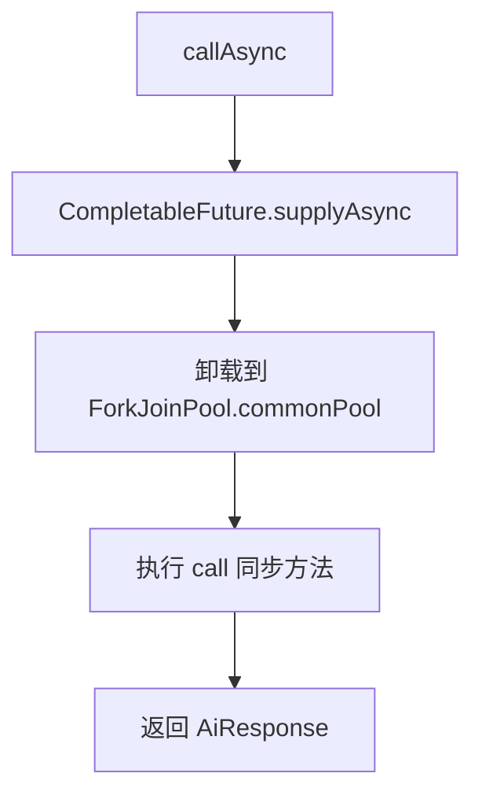
```mermaid
flowchart TD
    A[callAsync] --> B[CompletableFuture.supplyAsync]
    B --> C[卸载到 ForkJoinPool.commonPool]
    C --> D[执行 call 同步方法]
    D --> E[返回 AiResponse]
```

#### 时序图

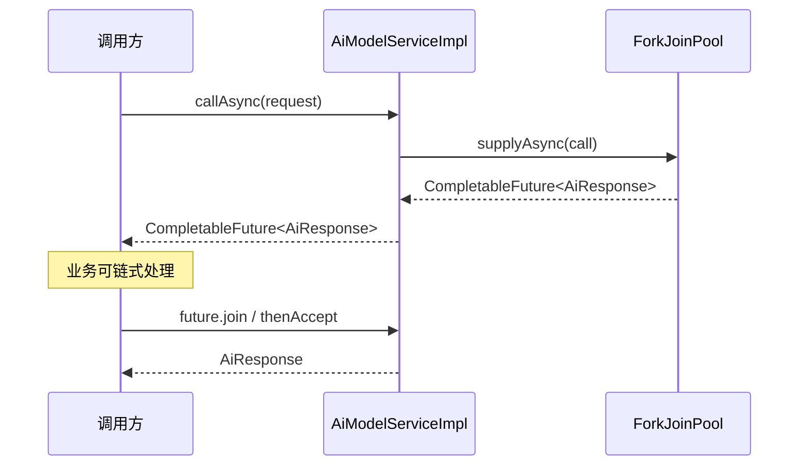
```mermaid
sequenceDiagram
    participant U as 调用方
    participant S as AiModelServiceImpl
    participant P as ForkJoinPool
    U->>S: callAsync(request)
    S->>P: supplyAsync(call)
    P-->>S: CompletableFuture<AiResponse>
    S-->>U: CompletableFuture<AiResponse>
    Note over U: 业务可链式处理
    U->>S: future.join / thenAccept
    S-->>U: AiResponse
```

#### 实现逻辑

最简包装：`CompletableFuture.supplyAsync(() -> call(request), defaultExecutor)`，把同步逻辑卸载到 `ForkJoinPool.commonPool()`。所有路由 / 熔断 / 重试 / 工具调用语义与 `call` 一致。业务侧可用 `thenAccept` / `thenApply` / `exceptionally` 链式处理结果与异常。

### 3. `stream(AiRequest request)` — 流式调用

#### 业务流程

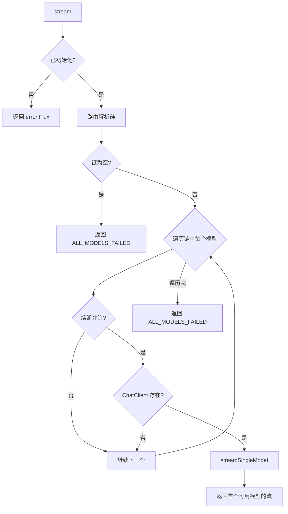
```mermaid
flowchart TD
    A[stream] --> B{已初始化?}
    B -- 否 --> X1[返回 error Flux]
    B -- 是 --> C[路由解析链]
    C --> D{链为空?}
    D -- 是 --> X2[返回 ALL_MODELS_FAILED]
    D -- 否 --> E{遍历链中每个模型}
    E --> F{熔断允许?}
    F -- 否 --> Y[继续下一个]
    F -- 是 --> G{ChatClient 存在?}
    G -- 否 --> Y
    G -- 是 --> H[streamSingleModel]
    H --> I[返回首个可用模型的流]
    Y --> E
    E -- 遍历完 --> X3[返回 ALL_MODELS_FAILED]
```

#### 时序图

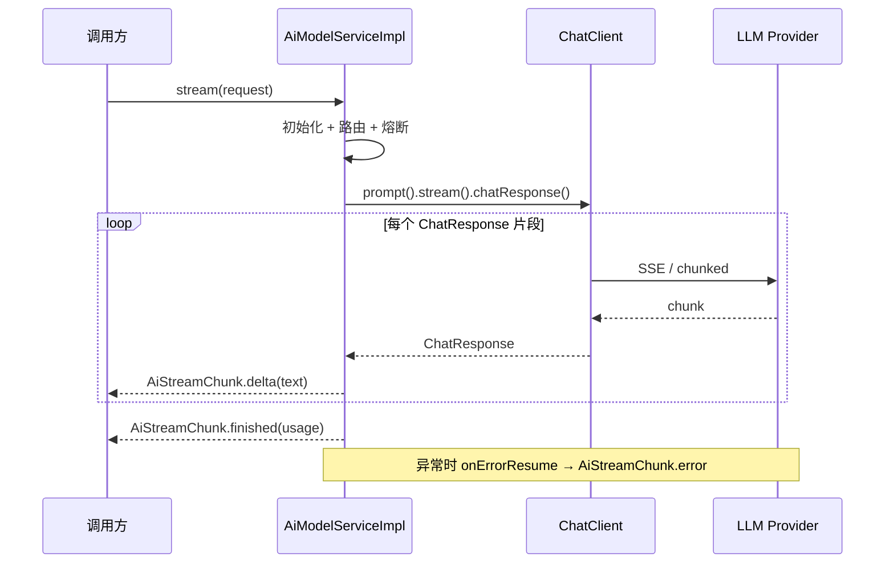
```mermaid
sequenceDiagram
    participant U as 调用方
    participant S as AiModelServiceImpl
    participant CC as ChatClient
    participant L as LLM Provider
    U->>S: stream(request)
    S->>S: 初始化 + 路由 + 熔断
    S->>CC: prompt().stream().chatResponse()
    loop 每个 ChatResponse 片段
        CC->>L: SSE / chunked
        L-->>CC: chunk
        CC-->>S: ChatResponse
        S-->>U: AiStreamChunk.delta(text)
    end
    S-->>U: AiStreamChunk.finished(usage)
    Note over S,L: 异常时 onErrorResume → AiStreamChunk.error
```

#### 实现逻辑

1. 初始化 + 链解析 + 熔断判断与 `call` 一致，但**只取首个可用模型**（不熔断、不缺失）开始流式，不做链路 fallback。
2. `ChatClient.prompt().stream().chatResponse()` 拿到 `Flux<ChatResponse>`，逐片段提取 `getOutput().getText()`，过滤空值，包装为 `AiStreamChunk.delta(text, modelName, provider)`。
3. 流自然结束时追加 `AiStreamChunk.finished(modelName, provider, usage)` 终态块（含 `Usage`）。
4. **异常路径**：`onErrorResume` 触发 `circuitBreaker.recordFailure` + 返回 `AiStreamChunk.error(message, STREAM_FAILED)`，消费方按错误码识别。
5. **不重试**：流中途出错直接失败，不调用 `recordSuccess`（避免半成功状态）。

### 4. `callWithModel(String modelName, AiRequest request)` — 指定模型调用

#### 业务流程

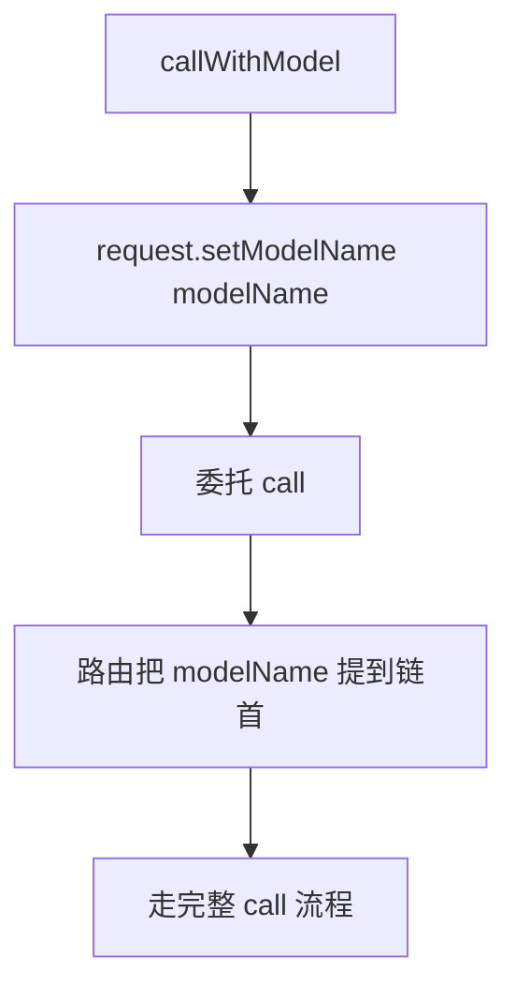
```mermaid
flowchart TD
    A[callWithModel] --> B[request.setModelName modelName]
    B --> C[委托 call]
    C --> D[路由把 modelName 提到链首]
    D --> E[走完整 call 流程]
```

#### 时序图

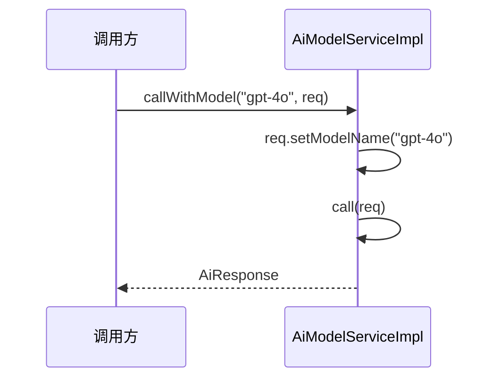
```mermaid
sequenceDiagram
    participant U as 调用方
    participant S as AiModelServiceImpl
    U->>S: callWithModel("gpt-4o", req)
    S->>S: req.setModelName("gpt-4o")
    S->>S: call(req)
    S-->>U: AiResponse
```

#### 实现逻辑

转发器：把 `modelName` 写入 `AiRequest.modelName` 后委托 `call`。`call` 内部 `resolveChain` 会把 `modelName` 提到链首位。**注意**：`callWithModel` 失败时仍会按 `request.fallbackModelNames` / 全局 fallback 链回退——若不想回退，业务侧须把 `request.fallbackModelNames` 设为空。

### 5. `initializeModels(List<ModelOptions>)` — 动态初始化

#### 业务流程

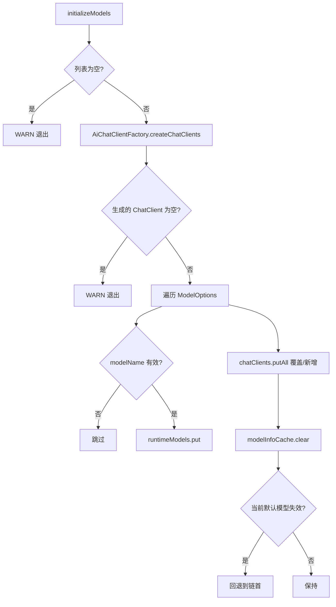
```mermaid
flowchart TD
    A[initializeModels] --> B{列表为空?}
    B -- 是 --> X1[WARN 退出]
    B -- 否 --> C[AiChatClientFactory.createChatClients]
    C --> D{生成的 ChatClient 为空?}
    D -- 是 --> X2[WARN 退出]
    D -- 否 --> E[遍历 ModelOptions]
    E --> F{modelName 有效?}
    F -- 否 --> Y[跳过]
    F -- 是 --> G[runtimeModels.put]
    E --> H[chatClients.putAll 覆盖/新增]
    H --> I[modelInfoCache.clear]
    I --> J{当前默认模型失效?}
    J -- 是 --> K[回退到链首]
    J -- 否 --> L[保持]
```

#### 时序图

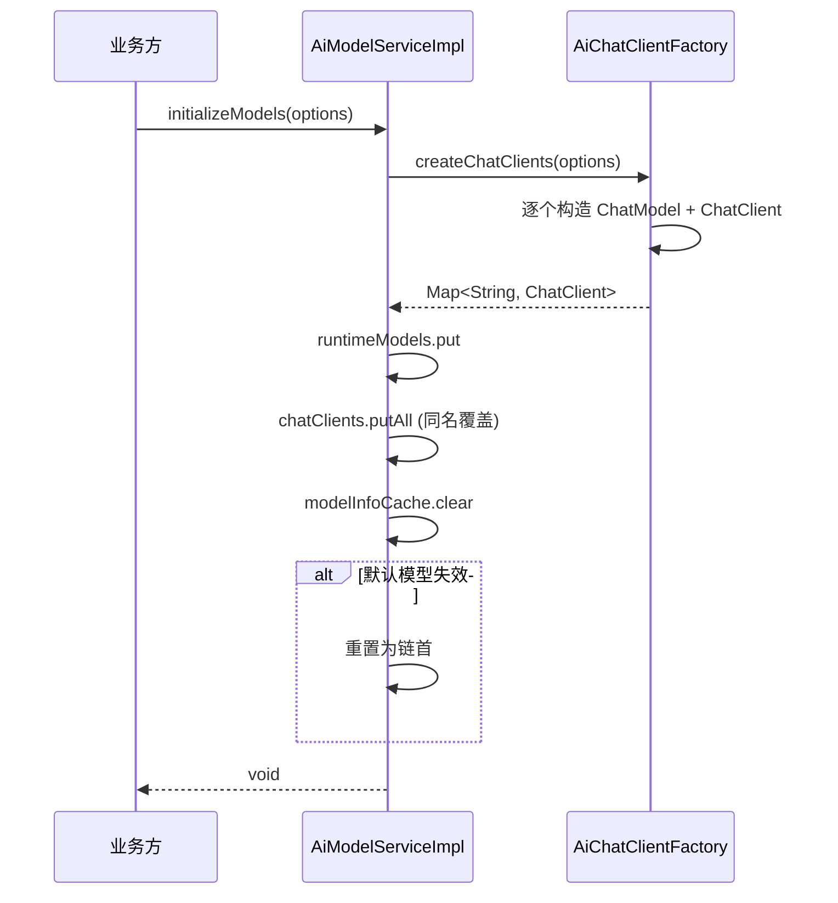
```mermaid
sequenceDiagram
    participant U as 业务方
    participant S as AiModelServiceImpl
    participant F as AiChatClientFactory
    U->>S: initializeModels(options)
    S->>F: createChatClients(options)
    F->>F: 逐个构造 ChatModel + ChatClient
    F-->>S: Map<String, ChatClient>
    S->>S: runtimeModels.put
    S->>S: chatClients.putAll (同名覆盖)
    S->>S: modelInfoCache.clear
    alt 默认模型失效
        S->>S: 重置为链首
    end
    S-->>U: void
```

#### 实现逻辑

`synchronized` 保护并发初始化安全。

1. 委托 `AiChatClientFactory.createChatClients(modelOptionsList)` 构造 `ChatClient` 映射（含 OpenAI 兼容降级、ZHIPUAI/MOONSHOT 复用 OpenAI 路径、未知 provider 兜底）。
2. 每个 `ModelOptions` 转 `AiModelProperties.AiModel` 存入 `runtimeModels`（`getCurrentModels` = `properties.models` ∪ `runtimeModels`）。
3. `chatClients.putAll(dynamicClients)`：**同名模型被覆盖**——这是动态初始化的核心优势，常见于多租户/多业务线热更新。
4. 失效 `modelInfoCache`，下次 `getModelInfo` 按新数据重建。
5. 默认模型回退：若当前 `defaultModel` 不在新 `chatClients` 中，重置为 `chatClients.keySet().iterator().next()`。

### 6. `removeModel(String modelName)` — 移除模型

#### 业务流程

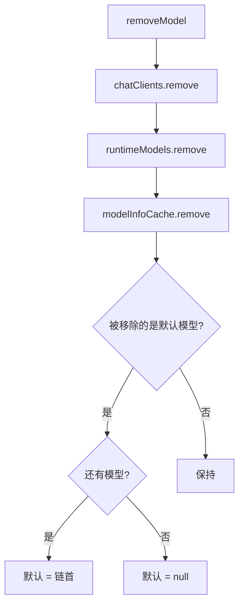
```mermaid
flowchart TD
    A[removeModel] --> B[chatClients.remove]
    B --> C[runtimeModels.remove]
    C --> D[modelInfoCache.remove]
    D --> E{被移除的是默认模型?}
    E -- 是 --> F{还有模型?}
    F -- 是 --> G[默认 = 链首]
    F -- 否 --> H[默认 = null]
    E -- 否 --> I[保持]
```

#### 时序图

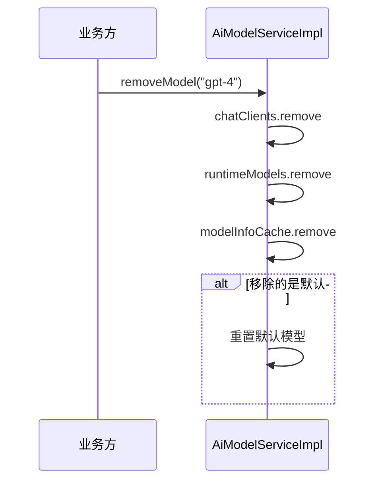
```mermaid
sequenceDiagram
    participant U as 业务方
    participant S as AiModelServiceImpl
    U->>S: removeModel("gpt-4")
    S->>S: chatClients.remove
    S->>S: runtimeModels.remove
    S->>S: modelInfoCache.remove
    alt 移除的是默认
        S->>S: 重置默认模型
    end
```

#### 实现逻辑

`synchronized` 保护。`properties.models`（配置文件初始化的）**不被清理**——下次 `getCurrentModels` 仍会包含配置模型。若需彻底移除配置模型，业务侧可重置 `chatClients` 引用或调用 `initializeModels` 不传该模型。INFO 日志记录操作。

### 7. `probe(String modelName)` — 单个模型健康探测

#### 业务流程

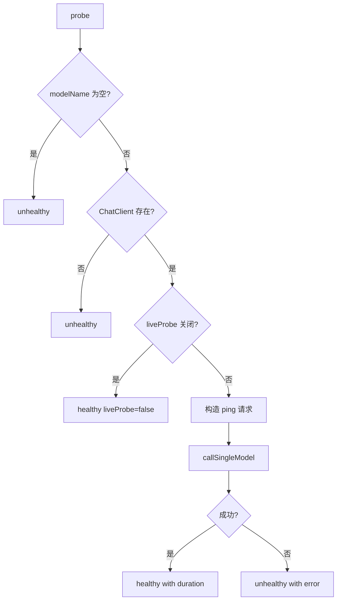
```mermaid
flowchart TD
    A[probe] --> B{modelName 为空?}
    B -- 是 --> X1[unhealthy]
    B -- 否 --> C{ChatClient 存在?}
    C -- 否 --> X2[unhealthy]
    C -- 是 --> D{liveProbe 关闭?}
    D -- 是 --> E[healthy liveProbe=false]
    D -- 否 --> F[构造 ping 请求]
    F --> G[callSingleModel]
    G --> H{成功?}
    H -- 是 --> I[healthy with duration]
    H -- 否 --> J[unhealthy with error]
```

#### 时序图

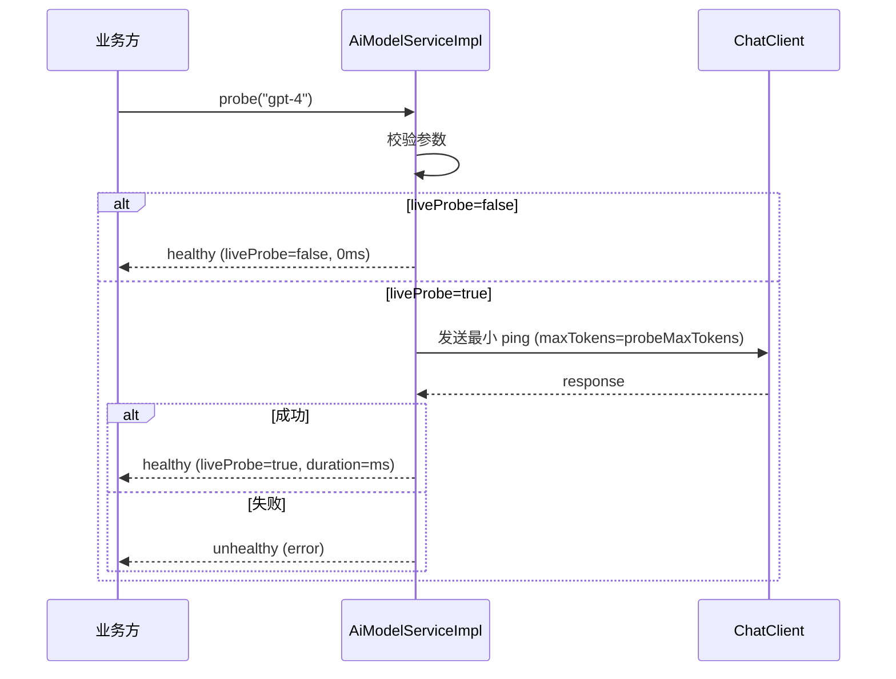
```mermaid
sequenceDiagram
    participant U as 业务方
    participant S as AiModelServiceImpl
    participant CC as ChatClient
    U->>S: probe("gpt-4")
    S->>S: 校验参数
    alt liveProbe=false
        S-->>U: healthy (liveProbe=false, 0ms)
    else liveProbe=true
        S->>CC: 发送最小 ping (maxTokens=probeMaxTokens)
        CC-->>S: response
        alt 成功
            S-->>U: healthy (liveProbe=true, duration=ms)
        else 失败
            S-->>U: unhealthy (error)
        end
    end
```

#### 实现逻辑

1. 校验 `modelName` 非空 + `chatClients.containsKey`；任一不过返回 `unhealthy`。
2. 若 `health-check.live-probe = false`（默认 `true`），仅返回 ChatClient 存在性（`healthy` + `liveProbe=false` + `0ms`）——不消耗 token。
3. 若启用 live probe：构造最小请求（`maxTokens = probeMaxTokens`，默认 1），调用 `callSingleModel` 测量实际耗时。
4. 返回 `AiHealthResult`（含 `modelName` / `provider` / `liveProbe` / `durationMs` / `errorMessage`）。
5. **不参与熔断**：探测调用不计入 `recordSuccess` / `recordFailure`，避免误判业务流量。

### 8. `probeAll()` — 全模型健康探测

#### 业务流程

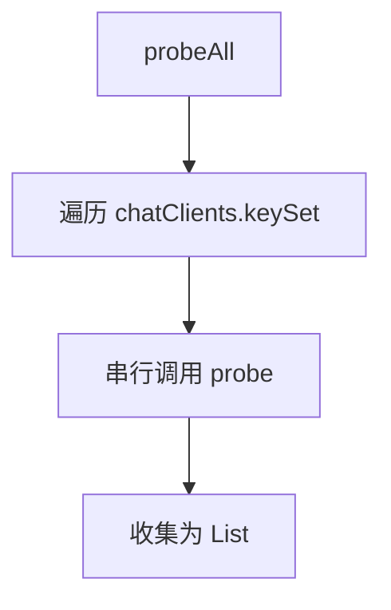
```mermaid
flowchart TD
    A[probeAll] --> B[遍历 chatClients.keySet]
    B --> C[串行调用 probe]
    C --> D[收集为 List]
```

#### 时序图

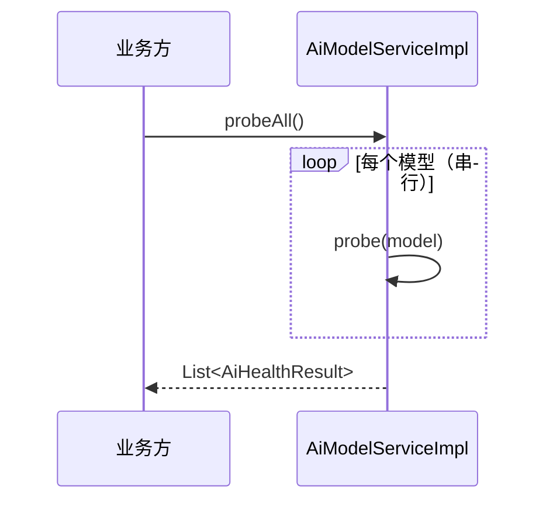
```mermaid
sequenceDiagram
    participant U as 业务方
    participant S as AiModelServiceImpl
    U->>S: probeAll()
    loop 每个模型（串行）
        S->>S: probe(model)
    end
    S-->>U: List<AiHealthResult>
```

#### 实现逻辑

`chatClients.keySet().stream().map(this::probe).toList()`，**串行**调用，N 个模型 × probe 平均延迟 = 总延迟。若模型数量大或 probe 耗时长，建议改造为 `parallelStream` 或 `Flux.parallel()`。

### 9. `getAvailableModels()` — 获取所有可用模型

#### 业务流程

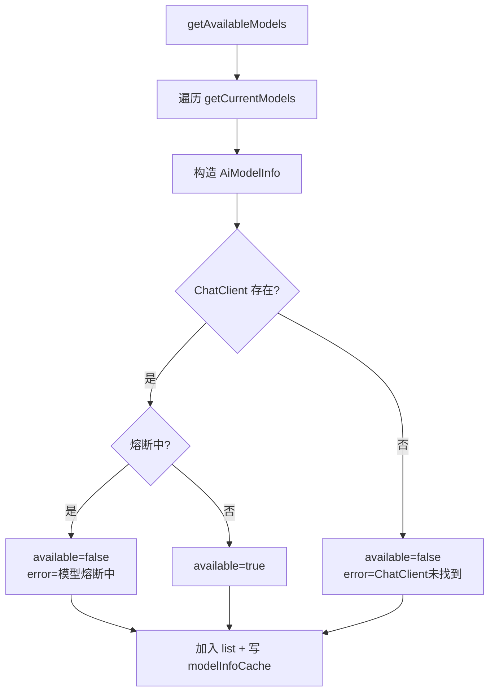
```mermaid
flowchart TD
    A[getAvailableModels] --> B[遍历 getCurrentModels]
    B --> C[构造 AiModelInfo]
    C --> D{ChatClient 存在?}
    D -- 是 --> E{熔断中?}
    E -- 是 --> F[available=false<br/>error=模型熔断中]
    E -- 否 --> G[available=true]
    D -- 否 --> H[available=false<br/>error=ChatClient未找到]
    F --> I[加入 list + 写 modelInfoCache]
    G --> I
    H --> I
```

#### 时序图

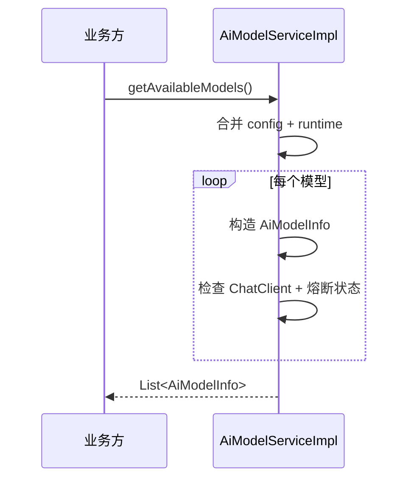
```mermaid
sequenceDiagram
    participant U as 业务方
    participant S as AiModelServiceImpl
    U->>S: getAvailableModels()
    S->>S: 合并 config + runtime
    loop 每个模型
        S->>S: 构造 AiModelInfo
        S->>S: 检查 ChatClient + 熔断状态
    end
    S-->>U: List<AiModelInfo>
```

#### 实现逻辑

合并 `properties.models`（配置）+ `runtimeModels`（动态），逐个构造 `AiModelInfo`：

- `name` / `provider` / `description`（按 provider 的描述生成，见 `getModelDescription` switch）
- `defaultModel` 标志（与当前 `defaultModel` 比对）
- `capabilities`（按 provider 能力矩阵：`temperature` / `topP` / `topK` / `frequencyPenalty` / `thinking` / `logprobs` 等）
- `available`（ChatClient 存在 + 未熔断，否则 `false` + 错误原因）

同时填充 `modelInfoCache`（按 `modelName`），供 `getModelInfo` 走 `computeIfAbsent` 缓存。

### 10. `getModelInfo(String modelName)` — 获取指定模型

#### 业务流程

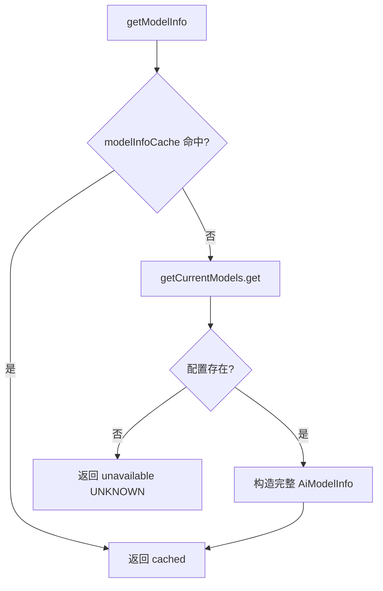
```mermaid
flowchart TD
    A[getModelInfo] --> B{modelInfoCache 命中?}
    B -- 是 --> X[返回 cached]
    B -- 否 --> C[getCurrentModels.get]
    C --> D{配置存在?}
    D -- 否 --> Y[返回 unavailable UNKNOWN]
    D -- 是 --> E[构造完整 AiModelInfo]
    E --> X
```

#### 时序图

```mermaid
sequenceDiagram
    participant U as 业务方
    participant S as AiModelServiceImpl
    U->>S: getModelInfo("gpt-4")
    alt cache hit
        S-->>U: cached AiModelInfo
    else cache miss
        S->>S: getCurrentModels
        alt 存在
            S-->>U: 新构造的 AiModelInfo
        else 不存在
            S-->>U: unavailable(UNKNOWN, "模型配置不存在")
        end
    end
```

#### 实现逻辑

走 `modelInfoCache.computeIfAbsent(name, ...)` 缓存：

- **命中**：直接返回（O(1)）
- **未命中**：合并配置+runtime 查模型；存在则构造完整 `AiModelInfo`（含 `description` + `capabilities` + `defaultModel` 标志）；不存在则返回 `AiModelInfo.unavailable(name, "UNKNOWN", "模型配置不存在")`
- **写时填充缓存**（在 `getAvailableModels` 路径已写），后续查询走缓存

### 11. `isModelAvailable(String modelName)` — 检查模型可用

#### 业务流程

```mermaid
flowchart TD
    A[isModelAvailable] --> B{chatClients 包含?}
    B -- 否 --> X[false]
    B -- 是 --> C{circuitBreaker.isOpen?}
    C -- 是 --> X
    C -- 否 --> Y[true]
```

#### 时序图

```mermaid
sequenceDiagram
    participant U as 业务方
    participant S as AiModelServiceImpl
    participant CB as AiModelCircuitBreaker
    U->>S: isModelAvailable("gpt-4")
    S->>CB: isOpen("gpt-4")
    CB-->>S: boolean
    S-->>U: chatClients.containsKey && !isOpen
```

#### 实现逻辑

`chatClients.containsKey(modelName) && !circuitBreaker.isOpen(modelName)`——**仅看 ChatClient 存在 + 熔断状态**，不发起实际调用。常用于路由前快速判断、业务侧模型切换前检查。

### 12. `getDefaultModel()` — 获取默认模型

#### 业务流程

```mermaid
flowchart TD
    A[getDefaultModel] --> B{defaultModel 已设置?}
    B -- 是 --> X[返回]
    B -- 否 --> C{getCurrentModels 非空?}
    C -- 是 --> D[defaultModel = 链首<br/>返回]
    C -- 否 --> Y[返回 null]
```

#### 时序图

```mermaid
sequenceDiagram
    participant U as 业务方
    participant S as AiModelServiceImpl
    U->>S: getDefaultModel()
    S->>S: 懒加载 defaultModel
    S-->>U: String modelName 或 null
```

#### 实现逻辑

懒加载：首次访问时若 `defaultModel == null`，取 `getCurrentModels().keySet().iterator().next()`（即配置或动态初始化的首个模型）。`LinkedHashMap` 保证插入顺序，所以**配置文件中第一个模型就是默认**。

### 13. `setDefaultModel(String modelName)` — 设置默认模型

#### 业务流程

```mermaid
flowchart TD
    A[setDefaultModel] --> B{已初始化?}
    B -- 否 --> X1[抛 IllegalStateException]
    B -- 是 --> C{getCurrentModels 包含?}
    C -- 否 --> X2[抛 IllegalArgumentException]
    C -- 是 --> D[defaultModel = modelName]
```

#### 时序图

```mermaid
sequenceDiagram
    participant U as 业务方
    participant S as AiModelServiceImpl
    U->>S: setDefaultModel("gpt-4")
    S->>S: 校验
    alt 校验失败
        S-->>U: throw IllegalStateException / IllegalArgumentException
    else 成功
        S-->>U: void
    end
```

#### 实现逻辑

1. 未初始化抛 `IllegalStateException("AI模型尚未初始化，无法设置默认模型")`。
2. 模型不在 `getCurrentModels()` 中，抛 `IllegalArgumentException("模型不存在: %s")`。
3. 否则赋值 `this.defaultModel = modelName`，INFO 日志。
4. **不持久化**：仅修改运行期字段，重启后由 `getDefaultModel` 的懒加载逻辑重新确定。
