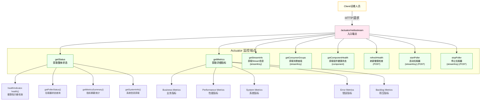
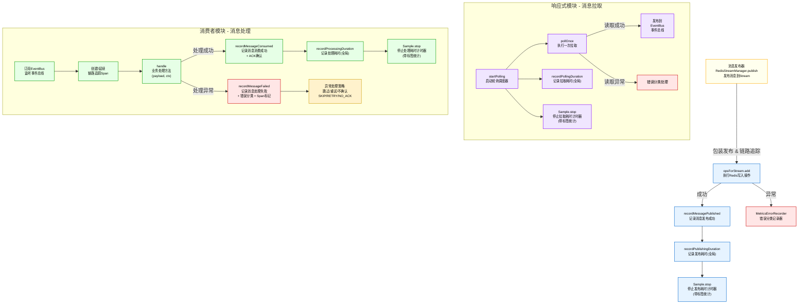

# Redis Stream - Actuator 接入说明

## 概述
本组件基于 Spring Boot Actuator 与 Micrometer 暴露 Redis Stream 的健康、指标、管理能力，支持手动健康刷新、单组件健康查询、拉取器启停与积压统计。

## 暴露的端点

- GET `/actuator/redisstream`
  - 返回整体状态（健康摘要、拉取器状态、指标摘要、JVM 信息）

- GET `/actuator/redisstream/metrics`
  - 返回业务/性能/系统/错误/积压等详细指标

- GET `/actuator/redisstream/{streamKey}`
  - 返回指定 Stream 的基础信息（长度、groups、first/lastId）、响应式拉取器与指标

- GET `/actuator/redisstream/{streamKey}/groups`
  - 返回指定 Stream 的消费者组信息

- GET `/actuator/redisstream/health/{component}`
  - 返回单组件健康（支持：`redis|stream|consumerGroup|poller|business`）

- POST `/actuator/redisstream/health/refresh`
  - 强制刷新健康检查（立即执行各项检查并缓存）

- POST `/actuator/redisstream/{streamKey}/start`
  - 启动指定 Stream 的拉取器（示例默认组/消费者）

- POST `/actuator/redisstream/{streamKey}/stop`
  - 停止指定 Stream 的拉取器

## 指标说明（部分）

- 业务计数：`messagesPublished`、`messagesConsumed`、`messagesAcknowledged`、`messagesFailed`、`messagesRetried`
- 性能耗时：
  - 处理耗时 `redis.stream.processing.duration`（标签：`stream`）
  - 拉取耗时 `redis.stream.polling.duration`（标签：`stream`）
  - 发布耗时 `redis.stream.publishing.duration`（标签：`stream`）
  - 以上同时有“无标签/全局”统计，用于总体观测
- 系统指标：`activeConsumers`、`activePollers`、`messageBacklog`、`activeConnections`
- 错误分类：`timeoutErrors`、`connectionErrors`、`serializationErrors`、`totalErrors`

## 健康检查聚合

`RedisStreamHealthIndicator` 对组件（`redis/stream/consumerGroup/poller/business`）分别检查，使用 `HealthLevel(UP/DEGRADED/DOWN)` 汇总：
- 关键组件（`redis`、`stream`）失败 → 整体 `DOWN`
- 非关键组件失败/告警 → 整体 `DEGRADED`
- 全部正常 → 整体 `UP`

## Actuator 工作流



## 组件内部工作流



## 生产配置建议

```yaml
platform:
  cache:
    redis:
      stream:
        monitoring:
          enabled: true
          metrics:
            enabled: true
            detailed: false          # 直方图/分位数默认关闭，必要时临时开启
            sampling-rate: 0.05      # 高QPS建议 0.05~0.3；低QPS/压测可调高
          performance:
            enabled: true
            record-processing-time: true
            record-polling-time: true
            record-publishing-time: true
          error-monitoring:
            enabled: true
            classify-by-type: true
            record-stack-trace: false
          business-monitoring:
            enabled: true
            record-message-count: true
            record-retry-count: true
            record-ack-count: true
```

## 使用提示

- 标签计时器与无标签计时器已统一采样逻辑，避免重复统计冲突。
- 单组件健康可用于精准定位：`/actuator/redisstream/health/{component}`。
- 未使用的 Endpoint 工具方法（如计时器/仪表读取）建议清理，减少冗余。
