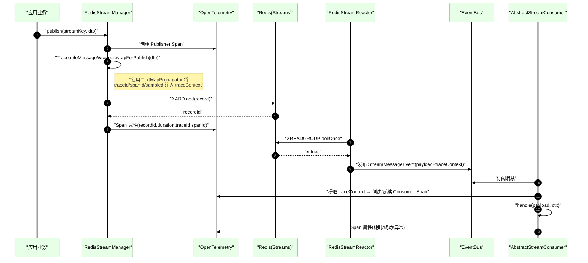
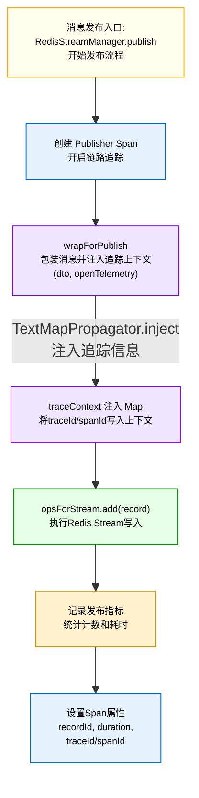
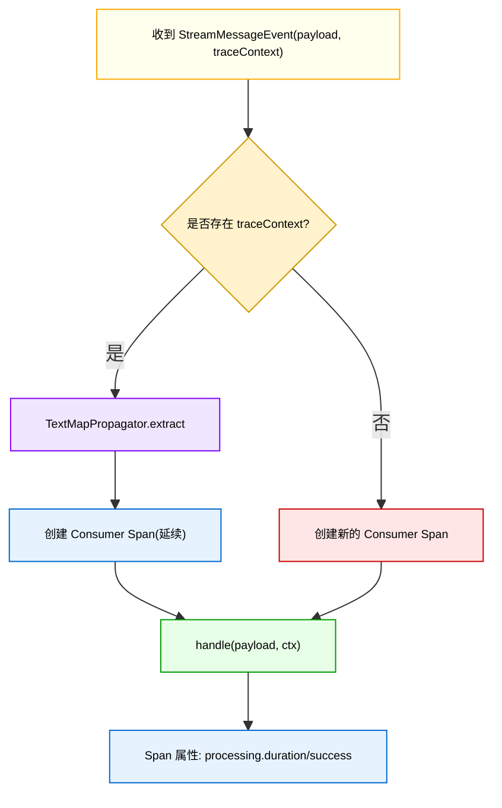
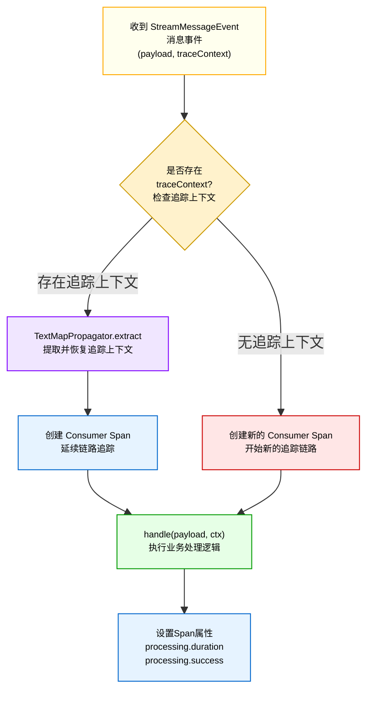

# Redis Stream - OpenTelemetry 链路追踪透传说明

本文说明当前组件如何在“发布 → 拉取 → 消费”的完整链路中透传 OpenTelemetry 上下文（traceId、spanId、sampled），并给出核心流程图与关键逻辑说明。

## 1. 设计目标
- 端到端：发布方生成（或延续）Span，上下游（拉取、消费者）能够延续同一 trace。
- 无侵入：业务消息类不需要实现额外接口，不修改业务字段。
- 标准化：使用 OTel TextMapPropagator 注入/提取上下文。

## 2. 关键参与者
- `RedisStreamManager.publish(...)`：发布入口，创建 Publisher Span，并将 OTel 上下文注入消息包装。
- `TraceableMessageWrapper`：透明包装器，负责 trace 上下文的注入与提取（使用 TextMapPropagator）。
- `RedisStreamReactor`：拉取器，将 Redis 记录转发到应用内 EventBus。
- `AbstractStreamConsumer`：消费者，从事件中提取上下文并创建/延续 Consumer Span。

## 3. 链路透传时序图

## 4. 发布端核心逻辑

要点：
- `TraceableMessageWrapper.wrapForPublish(dto, otel)` 内部：
  - 读取当前 `Span.current().getSpanContext()`；
  - 使用 `openTelemetry.getPropagators().getTextMapPropagator().inject(Context.current(), traceContext, setter)` 注入；
  - 不修改业务对象；透传数据存放在 wrapper 的 `traceContext` Map 中。

## 5. 消费端核心逻辑

要点：
- `AbstractStreamConsumer` 中：
  - 若 `TraceableMessageWrapper` 存在且 `hasValidTraceContext()`，则 `extract` 之后在该上下文上创建 Consumer Span；否则创建新的 Span。
  - 处理异常时写入 `recordError(...)` 并标注 `processing.success=false`。

## 6. TraceableMessageWrapper 角色说明

## 7. 与指标(Micrometer)协同

- 发布/拉取/处理均采用“双通道”计时策略：无标签（全局汇总）+ 按 stream 标签的 `Timer`；
- 采样统一由 `metrics.samplingRate` 与独立开关（processing/polling/publishing）控制，避免重复和不一致；
- 异常细分分类（超时/连接/序列化）通过 `MetricsErrorRecorder`，兼容 Lettuce/Jedis 常见异常。

## 8. 端到端验证建议

- 在发布入口与消费者侧打印 `traceId/spanId`（已在 Span 属性中）；
- 通过 OTel 后端（如 Tempo/Jaeger）搜索发布方 `traceId`，应能串起 Reactor 与 Consumer 的 Span；
- 结合 Actuator `/actuator/redisstream` 与 `/actuator/redisstream/metrics` 验证指标与健康信息。

## 9. 常见问题
- 未能延续链路：检查事件对象中是否正确携带 `traceContext`，以及消费者是否调用了 `extract`；
- 多次包装：务必保证只在发布入口调用 `wrapForPublish`；
- 高开销：调整 `sampling-rate` 与 `detailed=false`，并按需关闭部分耗时统计开关。
