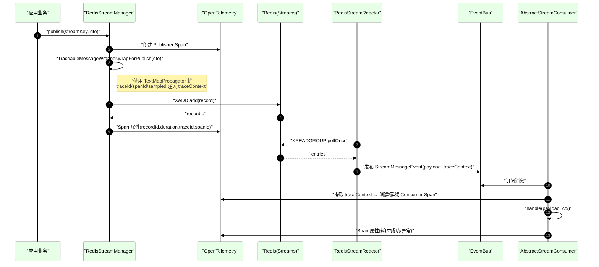
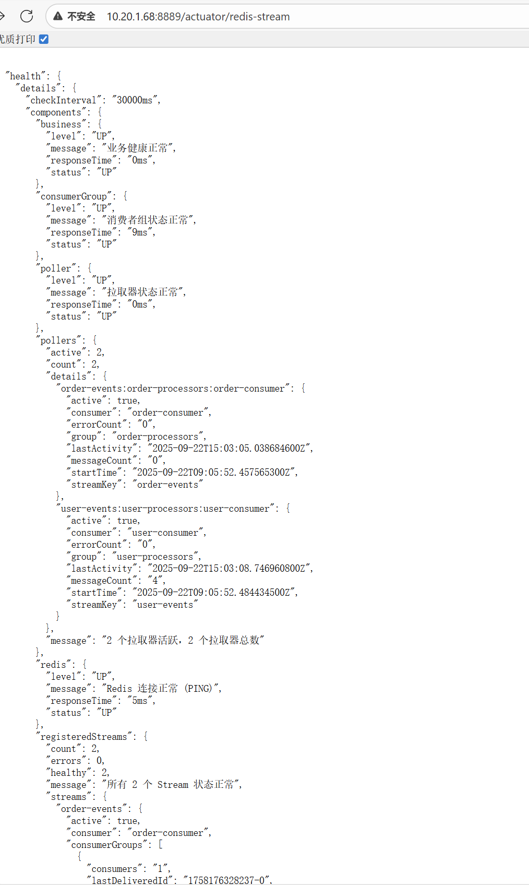
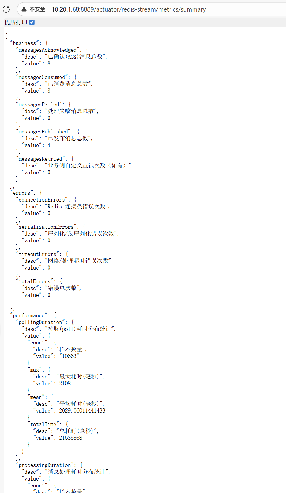
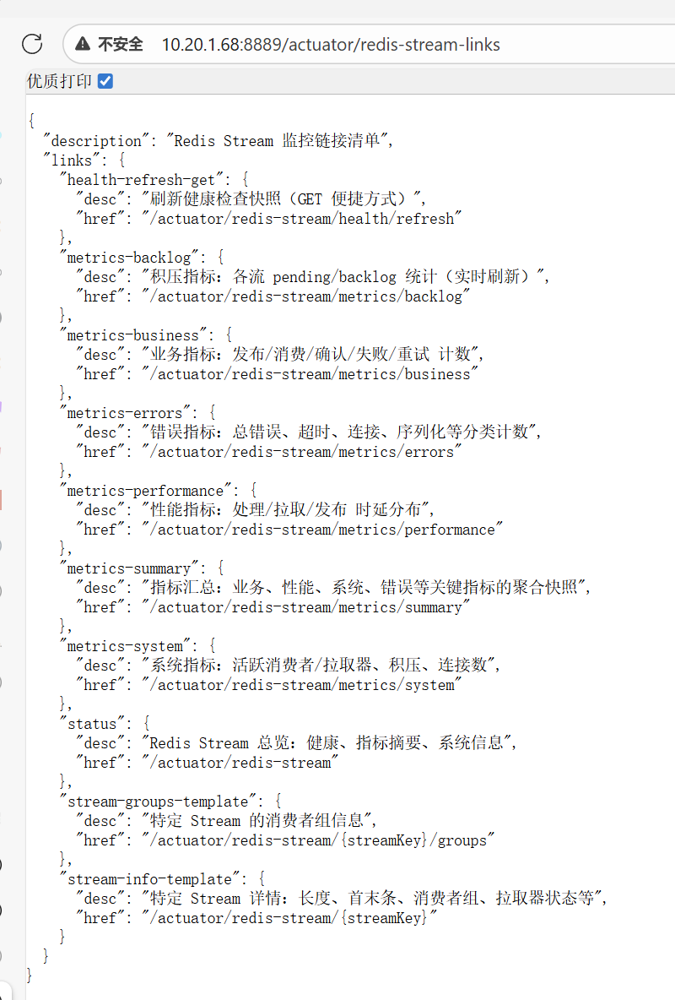

# Richie Redis Stream 使用指南

本文档面向使用 `richie-component-cache` 的业务团队，覆盖三大部分：

- 收发消息（发布与消费）
- 链路追踪（Java Agent 接入与配置）
- 监控与运维（Actuator 端点与健康检查）

---

## 一、收发消息

### 1.1 依赖与术语
- 消息载体需实现或复用 `BaseStreamMessage`；框架内部以 JSON 序列化，并将完整报文（业务载荷 + 追踪上下文）Base64 封装后写入 Redis Stream。
- 生产端通过 `StreamFunction.publish(streamKey, payload)` 发布；消费端通过 `@RedisStreamConsumer` 注解消费者类 + `AbstractStreamConsumer<T>` 实现 `handle` 方法消费。

### 1.2 发布消息（Producer）

- 推荐通过平台封装的 `StreamFunction` 发布消息，已由`GlobalCache`提供了静态方法进行实例获取，方法名`stream()`，即：`GlobalCache.stream()`即可访问。
- 发布时框架会自动：
  - 根据您提供的`streamKey`和消息体，将消息发送到对应的队列中
  
  * 同时，也会一并处理链路追踪和指标的监控

使用要点：
- `streamKey` 建议按领域划分，例如 `order-events`、`user-events`。
- `payload` 为业务 DTO，需可被 JSON 序列化，同时，为了统一发送消息的类型，被发送的DTO必须实现标记接口`BaseStreamMessage`，并且DTO推荐使用`record`类来实现。

### 1.3 消费消息（Consumer）
- 在消费者类上标注：
  
  ```java
  @RedisStreamConsumer("order-events")
  public class OrderEventConsumer extends AbstractStreamConsumer<OrderEvent> {
      @Override
      protected void handle(OrderEvent payload, EventContext ctx) throws Exception {
          // 处理业务逻辑
      }
  }
  ```

- 通过配置驱动消费者实例（示例）：
  
  ```yaml
  platform:
    cache:
      redis:
        stream:
          consumers:
            enabled: true
            configs:
              order-events:
                stream-key: "order-events"
                group: "order-processors"
                consumer: "order-consumer-1"
                target-type: "com.example.OrderEvent"
                auto-ack: true
                concurrency: 4
                error-strategy: SKIP   # SKIP | RETRY | NO_ACK
                max-retries: 3
                retry-delay: 1s
                idempotency-enabled: true
                auto-start: true
  ```

配置项说明（consumers.configs.[name] 下字段）：

| 配置项 | 类型 | 说明 | 示例/默认值 |
|---|---|---|---|
| enabled | boolean | 是否启用基于配置的消费者自动装配 | true |
| configs | map | 消费者配置映射，key 为配置名（需与 `@RedisStreamConsumer("name")` 对应） | - |
| stream-key | string | 目标 Redis Stream 的键名 | "order-events" |
| group | string | 消费者组名称 | "order-processors" |
| consumer | string | 当前实例的消费者名称，用于区分同组内不同实例 | "order-consumer-1"（默认: "default-consumer"） |
| target-type | class | 业务载荷类型（必须是可 JSON 反序列化的类，建议使用 record）。当此字段不配置内容时，默认当前消费者时死信队列消费者，其默认使用 `DeadLetterMessage` | "com.example.OrderEvent" |
| auto-ack | boolean | 处理成功后是否自动 ACK，当设置为false时，需要手工调用handle方法的ctx形参中的ack方法来提交ack来通知Redis。 | true |
| concurrency | int | 并发消费者数量 | 4（默认: 1） |
| error-strategy | enum | 错误处理策略：`SKIP` 跳过并继续；`RETRY` 简单重试一次；`NO_ACK` 不确认，留待后续处理 | SKIP |
| max-retries | int | 最大重试次数（策略为 `RETRY` 时生效，当前实现为一次重试，作为扩展预留） | 3 |
| retry-delay | duration | 重试延迟时间（标准 Spring Duration 表达式） | 1s |
| idempotency-enabled | boolean | 是否启用幂等去重 | true |
| auto-start | boolean | 应用启动后是否自动启动该消费者 | true |


实现细节解释（框架已内置，此处仅作流程解析，了解即可）：
- 框架自动解码 Base64 → 解析 map → 读取 `payload` 并转换为 `target-type`；
- 自动提取追踪上下文，在消费者创建 CONSUMER Span 并建立父子关系；
- 支持并发处理、错误策略（SKIP/RETRY/NO_ACK）与自动确认 ACK；
- 幂等保护：默认开启内存优先 + Redis 兜底的去重（可配置 TTL、命名空间）。

### 1.4 死信队列（DLQ）
- 框架支持“约定优于配置”：当配置名判定为 DLQ（如以 `dlq-`/`dlq:` 开头或包含 `dead-letter`）且未显式 `target-type` 时，默认使用 `DeadLetterMessage`。

- 统一工具方法：`DeadLetterQueueUtil` 提供 `GLOBAL/BY_MESSAGE_TYPE/BY_SOURCE_STREAM/HYBRID` 等策略。

- 消费端可在 `onError` 中按业务决定是否投递到 DLQ。

- 配置示例：

  ```yaml
  
  # 死信队列专用配置
  platform:
      cache:
          redis:
              stream:
                  consumers:
                      enabled: true
                      configs:
                          # ==================== 全局死信队列 ====================
                          # 所有类型的死信消息都发送到 dlq:global
                          # target-type 默认为 DeadLetterMessage，无需显式配置
                          dlq-global:
                              stream-key: "dlq:global"
                              group: "dlq-global-processors"
                              consumer: "dlq-global-consumer"
                              auto-ack: true
                              concurrency: 3
                              error-strategy: skip
                              auto-start: true
  
                          # ==================== 按消息类型分组的死信队列 ====================
                          # UserInfo/OrderInfo 类型的死信消息
                          dlq-type-userinfo:
                              stream-key: "dlq:type:UserInfo"
                              group: "dlq-type-processors"
                              consumer: "dlq-userinfo-consumer"
                              auto-ack: true
                              concurrency: 2
                              error-strategy: skip
                              auto-start: true
  
                          dlq-type-orderinfo:
                              stream-key: "dlq:type:OrderInfo"
                              group: "dlq-type-processors"
                              consumer: "dlq-orderinfo-consumer"
                              auto-ack: true
                              concurrency: 2
                              error-strategy: skip
                              auto-start: true
  
                          # ==================== 按源队列分组的死信队列 ====================
                          # 来自 user-events/order-events 队列的死信消息
                          dlq-stream-user-events:
                              stream-key: "dlq:stream:user-events"
                              group: "dlq-stream-processors"
                              consumer: "dlq-user-events-consumer"
                              auto-ack: true
                              concurrency: 1
                              error-strategy: skip
                              auto-start: true
  
                          dlq-stream-order-events:
                              stream-key: "dlq:stream:order-events"
                              group: "dlq-stream-processors"
                              consumer: "dlq-order-events-consumer"
                              auto-ack: true
                              concurrency: 1
                              error-strategy: skip
                              auto-start: true
  
                          # ==================== 混合模式死信队列策略 ====================
                          # 同时处理全局和类型分组的死信消息
                          dlq-hybrid-global:
                              stream-key: "dlq:global"
                              group: "dlq-hybrid-processors"
                              consumer: "dlq-hybrid-global-consumer"
                              auto-ack: true
                              concurrency: 3
                              error-strategy: skip
                              auto-start: true
  
                          dlq-hybrid-type:
                              stream-key: "dlq:type:UserInfo"
                              group: "dlq-hybrid-processors"
                              consumer: "dlq-hybrid-type-consumer"
                              auto-ack: true
                              concurrency: 2
                              error-strategy: skip
                              auto-start: true
  ```

- 示例代码：

  ```java
  package com.richie.component.cache.subscriber;
  
  import domain.com.richie.component.cache.OrderInfo;
  import stream.redis.com.richie.component.cache.AbstractStreamConsumer;
  import stream.redis.com.richie.component.cache.EventContext;
  import stream.redis.com.richie.component.cache.RedisStreamConsumer;
  import utils.redis.com.richie.component.cache.DeadLetterQueueUtil;
  import service.com.richie.component.cache.OrderService;
  import lombok.RequiredArgsConstructor;
  import lombok.extern.slf4j.Slf4j;
  import org.springframework.stereotype.Component;
  
  import java.math.BigDecimal;
  
  /**
   * 订单信息 Redis Stream 消费者
   *
   * <p>演示如何自定义死信队列策略
   *
   * @author richie696
   * @since 2025-01-27
   */
  @Slf4j
  @Component
  @RequiredArgsConstructor
  @RedisStreamConsumer("order-events")
  public class OrderStreamConsumer extends AbstractStreamConsumer<OrderInfo> {
  
      private final OrderService orderService;
  
      /**
       * 处理订单信息消息
       */
      @Override
      protected void handle(OrderInfo orderInfo, EventContext ctx) throws Exception {
          log.info("处理订单信息: orderId={}, userId={}", orderInfo.getOrderId(), orderInfo.getUserId());
  
          // 模拟业务处理
          orderService.processOrder(orderInfo);
  
          // 手动确认消息
          ctx.ack();
      }
  
      /**
       * 错误处理方法
       *
       * <p>当消息处理发生异常时调用，用户决定如何处理错误
       * <p>包括：是否发送到死信队列、使用什么策略、发送告警通知等
       *
       * @param e 异常对象
       * @param orderInfo 发生错误的消息负载
       * @param ctx 事件上下文
       */
      @Override
      protected void onError(Throwable e, OrderInfo orderInfo, EventContext ctx) {
          log.error("处理订单消息时发生错误: orderId={}, userId={}, error={}",
                  orderInfo.getOrderId(), orderInfo.getUserId(), e.getMessage(), e);
  
          // 用户决定是否发送到死信队列
          boolean shouldSendToDeadLetter = orderService.shouldSendToDeadLetter(e, orderInfo, ctx);
  
          if (shouldSendToDeadLetter) {
              // 根据业务规则选择死信队列策略
              DeadLetterQueueUtil.DeadLetterStrategy strategy = selectDeadLetterStrategy(orderInfo);
  
              // 发送到死信队列（使用指定策略）
              boolean success = sendToDeadLetterQueue(orderInfo, e, ctx, strategy);
              if (success) {
                  log.info("订单消息已发送到死信队列: orderId={}, amount={}, strategy={}",
                          orderInfo.getOrderId(), orderInfo.getAmount(), strategy);
              } else {
                  log.error("发送到死信队列失败: orderId={}, amount={}",
                          orderInfo.getOrderId(), orderInfo.getAmount());
              }
          } else {
              log.info("根据业务规则，不发送到死信队列: orderId={}, amount={}",
                      orderInfo.getOrderId(), orderInfo.getAmount());
          }
  
          // 其他错误处理逻辑：
          // 1. 更新订单状态为处理失败
          // 2. 发送告警通知
          // 3. 记录到业务日志
          // 4. 通知相关业务人员等
  
          // 示例：记录订单处理失败
          log.warn("订单处理失败，需要人工干预: orderId={}, userId={}, error={}",
                  orderInfo.getOrderId(), orderInfo.getUserId(), e.getMessage());
      }
  
      /**
       * 选择死信队列策略
       *
       * <p>根据订单信息选择不同的死信队列策略
       *
       * @param orderInfo 订单信息
       * @return 死信队列策略
       */
      private DeadLetterQueueUtil.DeadLetterStrategy selectDeadLetterStrategy(OrderInfo orderInfo) {
          // 根据订单金额选择不同的死信队列策略
          if (orderInfo.getAmount() != null && orderInfo.getAmount().compareTo(BigDecimal.valueOf(1000)) > 0) {
              // 高金额订单使用按源队列分组策略（便于重点监控）
              return DeadLetterQueueUtil.DeadLetterStrategy.BY_SOURCE_STREAM;
          } else if (orderInfo.getAmount() != null && orderInfo.getAmount().compareTo(BigDecimal.valueOf(100)) > 0) {
              // 中等金额订单使用按消息类型分组策略
              return DeadLetterQueueUtil.DeadLetterStrategy.BY_MESSAGE_TYPE;
          } else {
              // 低金额订单使用全局死信队列策略
              return DeadLetterQueueUtil.DeadLetterStrategy.GLOBAL;
          }
      }
  
  }
  
  ```

  

### 1.5 最佳实践
- 一个 Stream 只承载一个清晰的业务领域事件类型族，避免过于“混装”。
- 消费者组粒度：面向部署单元或职责拆分，消费者名称区分实例；
- 谨慎使用 `NO_ACK`（会保留 pending）；建议优先 SKIP/RETRY；
- 幂等键优先使用业务唯一键（可在 `buildIdempotencyKey` 覆写）。

---

## 二、链路追踪（OpenTelemetry Java Agent）

### 2.0 基础原理概览（透传机制）

以下内容节选自《Redis-Stream-Tracing-透传说明》，便于在使用前快速理解工作原理：

- 关键参与者：
  - 发布端 `RedisStreamManager.publish`：创建 Publisher Span，包装消息并注入 W3C 上下文（traceparent/tracestate）与辅助字段（traceId/spanId/sampled）。
  - 包装器 `TraceableMessageWrapper`：无侵入封装业务消息，在发布端 inject、消费端 extract。
  - 拉取器 `RedisStreamReactor`：XREADGROUP 拉取，将记录转发为应用内事件。
  - 消费端 `AbstractStreamConsumer`：从事件中提取上下文，创建/延续 Consumer Span，记录处理耗时/异常。
- 透传要点：
  - 消息内容以 Base64 序列化字段 `data` 存储，内部包含 `payload` 与 `traceContext`。
  - Java Agent 生效时优先使用 `GlobalOpenTelemetry`；否则回退到应用内实例。
  - 若传播器为 Noop（常见于未挂 Agent），将无法延续 trace，上下游 `traceId` 会脱节。




### 2.1 接入方式
- 采用 Java Agent 无侵入集成（推荐）。
- 应用内的自动配置已做兼容处理，检测到 Java Agent 的全局 `OpenTelemetry` 将优先使用。
- 为避免“双写”，建议关闭 Spring/Micrometer 自带的导出（示例）：
  
  ```yaml
  management:
    tracing:
      enabled: false
    otlp:
      tracing.export.enabled: false
      metrics.export.enabled: false
  platform:
    cache:
      redis:
        stream:
          tracing:
            enabled: false
  ```

### 2.2 开发/测试示例参数（已验证）

```bash
-javaagent:D:\Projects\richie-platform\richie-component-template\sample-cache\libs\opentelemetry-javaagent.jar \
-Dotel.java.global-autoconfigure.enabled=true \
-Dotel.exporter.otlp.protocol=grpc \
-Dotel.exporter.otlp.endpoint=http://10.100.0.90:4317 \
-Dotel.service.name=richie-component-template \
-Dotel.traces.sampler=parentbased_traceidratio \
-Dotel.traces.sampler.arg=1.0
```

说明：上述参数适合开发测试，建议生产环境做区分化配置（见下节）。

### 2.3 生产环境推荐参数（占位符示例）

```bash
-javaagent:${OTEL_AGENT_PATH} \
-Dotel.java.global-autoconfigure.enabled=true \
-Dotel.exporter.otlp.protocol=grpc \
-Dotel.exporter.otlp.endpoint=${OTLP_ENDPOINT} \
-Dotel.service.name=${SERVICE_NAME} \
-Dotel.resource.attributes=deployment.environment=prod,service.version=${SERVICE_VERSION},cloud.region=${REGION} \
-Dotel.traces.sampler=parentbased_traceidratio \
-Dotel.traces.sampler.arg=${SAMPLER_RATIO} \
-Dotel.exporter.otlp.timeout=10s
```

占位符说明：
- `${OTEL_AGENT_PATH}`：javaagent 绝对路径（如 `/opt/otel/opentelemetry-javaagent.jar`）
- `${OTLP_ENDPOINT}`：OTLP Collector 地址（如 `http://otel-collector:4317`）
- `${SERVICE_NAME}`：服务名（与 APM 后台一致）
- `${SERVICE_VERSION}`：服务版本（如 `1.2.3`）
- `${REGION}`：部署区域（如 `cn-north-1`）
- `${SAMPLER_RATIO}`：采样率（建议 `0.05~0.2`，视吞吐与成本）

注意事项：
- 生产建议合理采样，避免全量（`1.0`）带来的成本与性能开销；
- 确保 `GlobalOpenTelemetry` 可用（agent 生效），否则传播器可能为 `Noop`，此时，消息生产者和消费者的traceId可能无法保持一致（即：无法透传），导致链路断开；
- 框架已对消息中注入 `traceparent/tracestate/traceId/spanId/sampled`，下游服务可继续串联链路。

---

## 三、监控与运维

### 3.0 基础结构概览（Actuator 工作流）

以下内容节选自《Redis-Stream-Actuator-结构说明》，用于在操作端点前建立整体认知：

- 暴露端点（当前版本统一为 `/actuator/redis-stream` 体系，详细见 3.2）：
  - 总览：`GET /actuator/redis-stream`
  - 详情：`GET /actuator/redis-stream/{streamKey}`、`GET /actuator/redis-stream/{streamKey}/groups`
  - 指标：`GET /actuator/redis-stream/metrics/*`（summary/business/performance/system/errors/backlog）
  - 健康刷新：`GET|POST /actuator/redis-stream/health/refresh`
  - 链接清单（可选）：`GET /actuator/redis-stream-links`
  
- 工作流要点：
  - 总览调用健康指示器聚合结果（组件级：redis/stream/consumerGroup/poller/business）。
  - 详情页整合：Stream 基本信息、消费者组、拉取器快照与（可选）指标。
  - 指标分项独立可查，返回结构均带 `desc` 便于前端展示。
  - 健康检查优先对“已注册的流/组/拉取器”做动态检查，无活动时回退基础连通性测试。
  
  ```mermaid
  flowchart TD
    A[Client/运维人员] -->|HTTP请求| B["/actuator/redisstream<br/>入口端点"]
    
    subgraph ActuatorEndpoints["Actuator 监控端点"]
      C["getStatus<br/>获取整体状态"]
      D["getMetrics<br/>获取详细指标"]
      E["getStreamInfo<br/>获取Stream信息<br/>{streamKey}"]
      F["getConsumerGroups<br/>获取消费者组<br/>{streamKey}"]
      G["getComponentHealth<br/>获取组件健康状态<br/>{component}"]
      H["refreshHealth<br/>刷新健康检查<br/>(POST)"]
      I["startPoller<br/>启动拉取器<br/>{streamKey} (POST)"]
      J["stopPoller<br/>停止拉取器<br/>{streamKey} (POST)"]
    end
  
    B --> C
    B --> D
    B --> E
    B --> F
    B --> G
    B --> H
    B --> I
    B --> J
  
    C --> C1["healthIndicator.<br/>health()<br/>健康指示器检查"]
    C --> C2["getPollerStatus()<br/>拉取器状态查询"]
    C --> C3["getMetricsSummary()<br/>指标摘要统计"]
    C --> C4["getSystemInfo()<br/>系统信息获取"]
  
    D --> D1["Business Metrics<br/>业务指标"]
    D --> D2["Performance Metrics<br/>性能指标"]
    D --> D3["System Metrics<br/>系统指标"]
    D --> D4["Error Metrics<br/>错误指标"]
    D --> D5["Backlog Metrics<br/>积压指标"]
  
    style A fill:#ffe,stroke:#fa0,color:#000
    style B fill:#ffe6f0,stroke:#999,color:#000
    style C fill:#efe,stroke:#4a4,color:#000
    style D fill:#efe,stroke:#4a4,color:#000
    style E fill:#efe,stroke:#4a4,color:#000
    style F fill:#efe,stroke:#4a4,color:#000
    style G fill:#efe,stroke:#4a4,color:#000
    style H fill:#efe,stroke:#4a4,color:#000
    style I fill:#efe,stroke:#4a4,color:#000
    style J fill:#efe,stroke:#4a4,color:#000
  
    %% 自定义CSS样式来调整节点大小
    classDef default font-size:12px;
    classDef longText font-size:11px,min-width:140px;
    
    class E,F,G,H,I,J,C1,C2,C3,C4 longText;
  ```
  
  

### 3.1 Actuator 暴露配置

```yaml
management:
  endpoints:
    web:
      exposure:
        include: "health,info,redis-stream,redis-stream-links"
```

若统一放开所有端点（仅建议在内网或受保护环境）：

```yaml
management:
  endpoints:
    web:
      exposure:
        include: "*"
```

### 3.2 端点与路径

总览与详情：
- GET `/actuator/redis-stream`：总览状态（含健康、指标摘要、系统信息）

- GET `/actuator/redis-stream/{streamKey}`：特定 Stream 详情（消费者组、拉取器状态、可选指标）

- GET `/actuator/redis-stream/{streamKey}/groups`：特定 Stream 的消费者组信息

  

指标分项：
- GET `/actuator/redis-stream/metrics/summary`：指标汇总（business/performance/system/errors）

- GET `/actuator/redis-stream/metrics/business`

- GET `/actuator/redis-stream/metrics/performance`

- GET `/actuator/redis-stream/metrics/system`

- GET `/actuator/redis-stream/metrics/errors`

- GET `/actuator/redis-stream/metrics/backlog`

  

健康刷新：
- GET `/actuator/redis-stream/health/refresh`（便捷刷新）
- POST `/actuator/redis-stream/health/refresh`

链接清单（可选增强显示）：
- GET `/actuator/redis-stream-links`：在 Actuator 根页提供固定可点击链接与说明（若启用该端点）。

  

说明：
- 指标返回结构统一增加 `desc` 字段，方便前端展示含义；
- 消费者组列表中：`name/consumers/pending/lastDeliveredId` 为 `{ value, desc }` 结构；
- 健康检查会动态遍历已注册的流与消费者组，必要时回退到基础连通性测试；
- 若未启用 `redis-stream-links`，Actuator 根页仅显示模板化路径（`{seg1}/{seg2}`）。

### 3.3 常见问题与排障
- 出现 `NoopTextMapPropagator`：多因未启用 Java Agent 或未正确初始化 `GlobalOpenTelemetry`；
- 指标/健康为空：检查 `management.endpoints.web.exposure.include` 与端点是否启用；
- 双写问题：确保关闭 Micrometer/OTLP 的自动导出或仅保留一种路径；
- 测试流/默认流无意义：健康检查已改为动态检测已注册流，避免误报。


### 3.4 监控配置（业务/性能/错误/健康）

生产推荐配置（示例，来自 `platform.cache.redis.stream.monitoring.*`）：

```yaml
platform:
  cache:
    redis:
      stream:
        monitoring:
          enabled: true                 # 生产建议开启
          metrics:
            enabled: true               # 上报指标
            detailed: false             # 默认关闭直方图/分位数，必要时临时开启
            sampling-rate: 0.1          # 高并发建议 0.05 - 0.3
          performance:
            enabled: true               # 开启性能统计
            record-processing-time: true
            record-polling-time: true
            record-publishing-time: true
          error-monitoring:
            enabled: true
            classify-by-type: true      # 按错误类型分类，便于差异化告警
            record-stack-trace: false   # 仅定位问题时临时开启
          business-monitoring:
            enabled: true               # 业务计数推荐开启
            record-message-count: true
            record-retry-count: true
            record-ack-count: true
          health-check:
            enabled: true
            interval: 30s               # 30s~60s
            timeout: 5s                 # 3s~5s
```

配置项说明：

| 路径 | 类型 | 说明 | 建议/默认 |
|---|---|---|---|
| monitoring.enabled | boolean | 监控总开关（关闭后跳过健康检查与指标采集） | 生产开启（默认 false） |
| monitoring.metrics.enabled | boolean | Micrometer 指标开关 | 生产开启 |
| monitoring.metrics.detailed | boolean | 分位数/直方图（P50/P95/P99），增加 CPU/内存开销 | 默认 true，生产建议 false，按需临时开启 |
| monitoring.metrics.sampling-rate | double | 指标采样率 0.0-1.0 | 高并发 0.05-0.3；低并发/压测 1.0 |
| monitoring.performance.enabled | boolean | 性能统计（处理/拉取/发布耗时） | 生产开启 |
| monitoring.performance.record-processing-time | boolean | 记录处理耗时 | 生产开启 |
| monitoring.performance.record-polling-time | boolean | 记录拉取耗时 | 生产开启 |
| monitoring.performance.record-publishing-time | boolean | 记录发布耗时 | 生产开启 |
| monitoring.error-monitoring.enabled | boolean | 错误指标开关 | 生产开启 |
| monitoring.error-monitoring.classify-by-type | boolean | 是否按错误类型分类计数 | 开启（便于差异化告警） |
| monitoring.error-monitoring.record-stack-trace | boolean | 是否记录堆栈（显著增加开销） | 默认 false，排障临时开启 |
| monitoring.business-monitoring.enabled | boolean | 业务计数开关（发布/消费/确认/重试等） | 生产开启 |
| monitoring.business-monitoring.record-message-count | boolean | 是否记录发布/消费计数 | 开启 |
| monitoring.business-monitoring.record-retry-count | boolean | 是否记录重试计数 | 开启 |
| monitoring.business-monitoring.record-ack-count | boolean | 是否记录 ACK 计数 | 开启 |
| monitoring.health-check.enabled | boolean | 健康检查开关 | 生产开启 |
| monitoring.health-check.interval | duration | 健康检查间隔 | 30s ~ 60s |
| monitoring.health-check.timeout | duration | 单次检查超时 | 3s ~ 5s |


