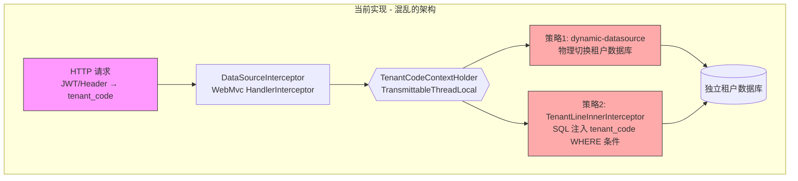

# 多租户实现分析与重构方案

> **分析日期**: 2026-05-26
> **模块**: `atlas-richie-component-dao`
> **状态**: 问题分析已完成，等待确认重构方案

---

## 目录

1. [架构概览](#一架构概览)
2. [当前实现问题清单](#二当前实现问题清单)
3. [业界标准对比](#三业界标准对比)
4. [重构方案](#四重构方案)
5. [附录：现状完整代码清单](#五附录现状完整代码清单)

---

## 一、架构概览

### 1.1 当前实现的核心问题：两种互斥策略同时应用



**关键问题**：数据库隔离（database-per-tenant）和行级过滤（row-level column filtering）是**互斥**的多租户策略。如果已经将 SQL 路由到了租户专属数据库——那里面只有该租户的数据——为什么还要在 SQL 里添加 `AND tenant_code = ?`？

这个设计意味着代码是分阶段"贴上去"的，缺乏统一的架构决策。

### 1.2 策略对比

| 策略 | 说明 | 何时使用 | 互斥？ |
|------|------|---------|--------|
| **动态数据源切换** (`dynamic-datasource`) | 每个租户独立数据库，通过数据源路由访问 | 合规要求高、大客户 | ✅ 与行级过滤互斥 |
| **行级过滤** (`TenantLineInnerInterceptor`) | 所有租户共享数据库，SQL 自动注入 `WHERE tenant_id = ?` | SaaS 中小客户 | ✅ 与动态数据源互斥 |
| **忽略租户表** (`ignoreTable`) | 系统公共表不进行租户隔离 | 字典表、配置表 | 🔗 配合行级过滤 |

---

## 二、当前实现问题清单

### 2.1 按严重度分类

#### 🔴 致命问题 (Critical)

| # | 文件/位置 | 问题描述 |
|---|-----------|---------|
| **1** | 整体架构 | **同时启用 database-per-tenant + row-level filtering 两种互斥策略**。既浪费资源（两次隔离），又引入逻辑矛盾。应选择一个清晰的多租户策略模型。 |
| **2** | `MybatisPlusTenantAutoConfiguration.java:67` | **`extends MybatisConfiguration`** — 业务配置类直接继承 MyBatis 核心配置类，这是严重的架构异味。`MybatisConfiguration` 是 MyBatis 的内部类，不应被业务代码继承。 |
| **3** | `MybatisPlusTenantAutoConfiguration.java:65` | **`@MapperScan("com.richie.component.dao.tenant.mapper")` 在类级别声明**，导致 `@ConditionalOnProperty(enable-tenant=true)` 形同虚设。MapperScan 在类加载时执行，不受 `@Conditional` 控制，即使 `enable-tenant=false` 也会扫描租户 Mapper。 |
| **4** | `MybatisPlusTenantAutoConfiguration.java:100` | **SQL 注入风险**：`String.format("select * from %s where %s='%s'", tableName, col, appName)` 使用字符串拼接构建查询。`appName` 来自 `@Value("${spring.application.name}")`，虽然通常由配置控制，但不安全的 SQL 构建方式不应存在。 |
| **5** | `AutoConfiguration.imports` | **`MybatisPlusTenantAutoConfiguration` 无条件注册**为 Spring Boot 自动配置类。即使 `enable-tenant=false`，该类仍会被 JVM 加载并执行类级别的 `@MapperScan`。 |

#### 🟠 严重问题 (Major)

| # | 文件/位置 | 问题描述 |
|---|-----------|---------|
| **6** | `DataSourceListener.java:34` | **裸线程创建**：`new Thread(() -> { ... }).start()` 绕过 Spring 线程池管理，无法监控、无法优雅关闭、无法控制生命周期。应使用 `@Async` 或 `TaskExecutor`。 |
| **7** | `DatasourceOperator.java:102-104` | **空方法体**：`refreshDatasource()` 方法体完全为空，表明代码尚未完成或重构未清理。 |
| **8** | `DataSourceInterceptor.java:67` | **静默回退到 `"0"`**：当请求中没有租户信息时，回退为 `"0"`，然后 `TenantLineHandler.ignoreTable()` 因为 `tenantCode == 0` 返回 `true`（即跳过隔离）。这个"配置错误被静默吃掉"的设计会掩盖真实错误。 |
| **9** | `ModifyMybatisPlusInterceptor.java:33-46` | **Hack 式修改 MyBatis-Plus 拦截器链**：在 `@PostConstruct` 中获取 `Collections.unmodifiableList` 并重建整个拦截器列表，极其脆弱且不可维护。 |
| **10** | `DataSourceInterceptor` + `WebMvcConfigurerDataSourceInterceptor` | **全局拦截所有 HTTP 请求**：即使对于 health check、swagger、静态资源等非业务请求，也会执行 JWT 解析和数据源切换操作。 |

#### 🟡 中等问题 (Minor)

| # | 文件/位置 | 问题描述 |
|---|-----------|---------|
| **11** | `pom.xml:134-138` | **Redisson 是 compile scope 依赖**：即使应用不启用租户功能，Redisson 也会被强制加载。应改为 `provided` scope 或移除到独立租户模块。 |
| **12** | `TenantProperties.java:18` | **配置前缀使用 `spring.datasource.dynamic.tenant`**：该前缀属于 `dynamic-datasource` 第三方的命名空间，不应将自己的业务配置注入其中。应使用 `platform.component.dao.tenant`。 |
| **13** | `DaoConstant.java` | **DAO 常量与租户常量混在同一文件**：`DAO_ENABLE_TENANT_PREFIX` 放在 `DaoConstant` 中，导致 `DaoAutoConfiguration`（非租户代码）间接关联租户常量。 |
| **14** | `CommonDataSourceAspect.java:37` | **硬编码 `"master"` 数据源名**：`DynamicDataSourceContextHolder.push(TenantConstant.MASTER_DS_NAME)`，如果实际配置的数据源名不是 `"master"` 则会失败。应为可配置项。 |

### 2.2 问题全景图

```
atlas-richie-component-dao/
├── config/
│   ├── DaoAutoConfiguration.java      ← ✅ 核心 DAO 配置，逻辑清晰
│   ├── DaoConstant.java               ← ⚠️ 混入了租户常量（DAO_ENABLE_TENANT_PREFIX）
│   └── DaoProperties.java            ← ✅ OK
│
├── tenant/                            ← 🔴 21 个文件，与核心 DAO 强耦合
│   ├── MybatisPlusTenantAutoConfiguration.java  ← 🔴 extends MybatisConfiguration
│   │                                             🔴 @MapperScan 在类级别
│   │                                             🔴 SQL 注入风险
│   │
│   ├── DataSourceInterceptor.java     ← 🟠 静默回退到 "0"
│   ├── WebMvcConfigurerDataSourceInterceptor.java ← 🟠 全局拦截所有请求
│   ├── DataSourceListener.java        ← 🟠 裸线程创建
│   ├── ModifyMybatisPlusInterceptor.java ← 🟠 Hack 式修改拦截器链
│   ├── DatasourceOperator.java        ← 🟠 空方法体 refreshDatasource()
│   ├── TenantProperties.java          ← 🟡 配置前缀侵入第三方命名空间
│   └── ... (其他 10+ 文件)
│
├── pom.xml                            ← 🟡 Redisson 为 compile scope
└── src/main/resources/META-INF/spring/
    └── org.springframework.boot.autoconfigure.AutoConfiguration.imports
                                       ← 🔴 无条件注册租户配置类
```

---

## 三、业界标准对比

### 3.1 四种标准多租户模型

| 模型 | 隔离级别 | 成本 | 复杂度 | 实现方式 | 适用场景 |
|------|---------|------|--------|---------|---------|
| **① 独立数据库** (Database-per-Tenant) | 最高 | 高 | 中 | `dynamic-datasource` 切换数据源 | 合规要求高、大客户 |
| **② 独立 Schema** (Schema-per-Tenant) | 中高 | 中 | 中 | PostgreSQL/MySQL schema 切换 | Oracle/PG 生态 |
| **③ 共享数据库 + 租户字段** (Shared DB + Discriminator) | 中 | 低 | 低 | `TenantLineInnerInterceptor` 注入 WHERE 条件 | SaaS 中小客户（推荐） |
| **④ 混合模式** (Hybrid) | 混合 | 中 | 高 | 策略模式 + 两者组合 | 复杂企业场景 |

### 3.2 为什么两者不应同时使用

```
场景 A: 共享数据库模型（用 TenantLineInnerInterceptor）

    App → 共享数据库 → 所有租户数据在同一张表
    ✅ TenantLineInnerInterceptor 自动注入 WHERE tenant_id = ?
    ❌ 不需要 (也不应该) 使用 dynamic-datasource 切换数据源

场景 B: 独立数据库模型（用 dynamic-datasource）

    App → 租户A数据库 → 该数据库只有租户A的数据
    ✅ dynamic-datasource 自动切换到正确的数据源
    ❌ 不需要 (也不应该) 使用 TenantLineInnerInterceptor 加 WHERE
```

**当前实现同时做两者 → 既浪费性能（双重隔离）又产生逻辑矛盾。**

### 3.3 业界参考：RuoYi-Vue-Plus 的租户实现

RuoYi-Vue-Plus（star 10k+）是目前最成熟的 Spring Boot + MyBatis-Plus 多租户实现参考之一：

```java
// 1. 清晰的模块分离
ruoyi-common-tenant/          ← 独立可选的租户模块
├── TenantProperties.java     ← 独立配置前缀 "tenant.*"
├── PlusTenantLineHandler.java ← TenantLineHandler 实现
├── TenantConfig.java         ← @ConditionalOnProperty("tenant.enable")
└── TenantHelper.java         ← ThreadLocal 上下文

// 2. 关键设计决策
@AutoConfiguration(after = {RedisConfig.class})
@ConditionalOnProperty(value = "tenant.enable", havingValue = "true")  // 条件启用
public class TenantConfig {
    // 只在 tenant.enable=true 时生效
}

// 3. 正确处理无租户场景
@Override
public Expression getTenantId() {
    String tenantId = TenantHelper.getTenantId();
    if (StringUtils.isBlank(tenantId)) {
        return new NullValue();  // ⚠️ 返回 NULL，不会泄露数据
    }
    return new StringValue(tenantId);
}
```

| 对比维度 | RuoYi-Vue-Plus | 当前实现 |
|---------|---------------|---------|
| 模块位置 | 独立可选模块 `ruoyi-common-tenant` | 嵌在 DAO 模块的 `tenant/` 子包 |
| 启用方式 | `@ConditionalOnProperty("tenant.enable")` | 同样的 `@ConditionalOnProperty`，但 `@MapperScan` 不受控制 |
| 租户策略 | 单一策略：行级过滤 | 两种互斥策略同时混用 |
| 无租户处理 | 返回 `NullValue`（安全） | 静默回退 `"0"`（不安全） |
| 配置前缀 | `tenant.*` | `spring.datasource.dynamic.tenant`（侵入第三方命名空间） |
| 线程安全 | ThreadLocal | TransmittableThreadLocal ✅ |

---

## 四、重构方案

### 4.1 推荐架构

```
atlas-richie-component/                              # 现有组件目录
│
├── atlas-richie-component-dao/                      # 核心 DAO 模块（清理后）
│   ├── config/
│   │   ├── DaoAutoConfiguration.java               # MyBatis-Plus 核心配置
│   │   ├── DaoConstant.java                        # 只保留非租户常量
│   │   └── DaoProperties.java
│   ├── interceptor/                                # 分页、批量更新限制
│   ├── handler/                                    # 字段填充、国际化
│   ├── snowflake/                                  # 雪花 ID
│   └── pom.xml                                     # 移除 Redisson、dynamic-datasource
│
└── atlas-richie-component-dao-tenant/               # 🆕 独立的可选租户模块
    ├── strategy/                                   # 策略模式
    │   ├── TenantIsolationStrategy.java             # 接口
    │   ├── DiscriminatorColumnStrategy.java         # 共享库+租户字段（策略③）
    │   └── DatabasePerTenantStrategy.java           # 独立数据库（策略①）
    ├── interceptor/
    │   ├── TenantContextInterceptor.java            # WebMvc 拦截器（仅租户请求）
    │   └── TenantContextHolder.java                 # ThreadLocal 上下文
    ├── config/
    │   ├── TenantAutoConfiguration.java             # 真·条件化自动配置
    │   └── TenantProperties.java                    # 独立配置前缀
    ├── handler/
    │   └── TenantLineHandlerImpl.java               # TenantLineHandler 实现
    └── pom.xml
        ├── atlas-richie-component-dao               # 依赖核心 DAO
        ├── dynamic-datasource-spring-boot3-starter   # provided（仅独立库策略需要）
        └── redisson-spring-boot-starter             # provided（仅动态添加数据源需要）
```

### 4.2 关键设计原则

#### 原则 1：单一策略选择

```yaml
platform:
  component:
    dao:
      tenant:
        enabled: true
        strategy: DISCRIMINATOR  # DISCRIMINATOR | DATABASE | HYBRID
```

- `DISCRIMINATOR` → 启用 `TenantLineInnerInterceptor`，不启用 `dynamic-datasource`
- `DATABASE` → 启用 `dynamic-datasource`，不启用 `TenantLineInnerInterceptor`
- 不再同时启用两种互斥策略

#### 原则 2：真·条件化

```java
// ❌ 当前做法：@MapperScan 在类级别，不受 Conditional 控制
@MapperScan("com.richie.component.dao.tenant.mapper")
@ConditionalOnProperty(prefix = "...", name = "enable-tenant", havingValue = "true")
public class MybatisPlusTenantAutoConfiguration extends MybatisConfiguration { ... }

// ✅ 正确做法：所有租户相关 bean 都在 Conditional 保护的内部 @Configuration 中
@AutoConfiguration
public class TenantAutoConfiguration {

    @Configuration(proxyBeanMethods = false)
    @ConditionalOnProperty(prefix = "platform.component.dao.tenant", name = "enabled", havingValue = "true")
    @MapperScan("com.richie.component.dao.tenant.mapper")  // ← MapperScan 在内部类
    static class DiscriminatorTenantConfiguration {
        // TenantLineInnerInterceptor + TenantLineHandler
    }

    @Configuration(proxyBeanMethods = false)
    @ConditionalOnProperty(prefix = "platform.component.dao.tenant", name = "strategy", havingValue = "DATABASE")
    static class DatabasePerTenantConfiguration {
        // dynamic-datasource 提供器 + 数据源路由
    }
}
```

#### 原则 3：正确处理无租户请求

```java
// ❌ 当前做法：静默回退到 "0"
return "0";

// ✅ 正确做法：区分"无租户（管理接口）"和"租户未识别（错误）"
public class TenantContextInterceptor implements HandlerInterceptor {
    @Override
    public boolean preHandle(HttpServletRequest request, ...) {
        String tenantId = extractTenantId(request);

        // 场景 1：明确标记为管理接口（白名单路径）
        if (isAdminEndpoint(request)) {
            TenantContextHolder.setTenantId(null);  // null = 无租户上下文
            return true;
        }

        // 场景 2：无法识别租户 → 拒绝请求
        if (StringUtils.isBlank(tenantId)) {
            throw new TenantNotFoundException("无法识别租户身份");
        }

        TenantContextHolder.setTenantId(tenantId);
        return true;
    }
}
```

#### 原则 4：独立模块，按需引入

```
# 不需要租户的应用
<dependency>
    <groupId>com.richie.component</groupId>
    <artifactId>atlas-richie-component-dao</artifactId>
</dependency>
<!-- 不引入 atlas-richie-component-dao-tenant -->

# 需要租户的应用
<dependency>
    <groupId>com.richie.component</groupId>
    <artifactId>atlas-richie-component-dao</artifactId>
</dependency>
<dependency>
    <groupId>com.richie.component</groupId>
    <artifactId>atlas-richie-component-dao-tenant</artifactId>
</dependency>
```

### 4.3 迁移步骤

| 阶段 | 内容 | 影响范围 |
|------|------|---------|
| **Phase 1** | 创建 `atlas-richie-component-dao-tenant` 模块，将 `tenant/` 下 21 个文件迁移过去 | 新模块 |
| **Phase 2** | 按原则重写租户核心逻辑（策略模式、真条件化、正确错误处理） | 租户模块 |
| **Phase 3** | 清理 `atlas-richie-component-dao`：移除 `tenant/` 目录、清理 `pom.xml`、更新 `AutoConfiguration.imports` | DAO 模块 |
| **Phase 4** | 更新所有引用 `atlas-richie-component-dao` 并启用租户的业务模块，添加 `atlas-richie-component-dao-tenant` 依赖 | 业务模块 |

### 4.4 预期收益

- ✅ **非租户应用不再加载租户代码**：JVM 完全不加载 21 个租户类
- ✅ **Redisson 不再被强制引入**：非租户应用的依赖树减少
- ✅ **策略清晰**：`strategy = DISCRIMINATOR | DATABASE`，不再同时启用两种互斥逻辑
- ✅ **错误不再被静默吃掉**：无租户请求直接抛出明确异常
- ✅ **可独立演进**：租户模块的修改不影响 DAO 核心模块

---

## 五、附录：现状完整代码清单

### 5.1 模块文件结构

```
atlas-richie-component-dao/
├── pom.xml
├── src/main/java/com/richie/component/dao/
│   ├── config/
│   │   ├── DaoAutoConfiguration.java          # MyBatis-Plus 核心配置
│   │   ├── DaoConstant.java                   # 常量（含租户开关 key）
│   │   ├── DaoProperties.java                 # DAO 配置属性
│   │   ├── DaoPropertiesHolder.java
│   │   └── RedissonConfig.java
│   │
│   ├── interceptor/
│   │   ├── BatchUpdateLimitInterceptor.java   # 批量更新限制
│   │   └── PaginationInterceptor.java         # 智能分页
│   │
│   ├── handler/
│   │   ├── DefaultFieldHandler.java           # 默认字段填充
│   │   └── I18nTypeHandler.java              # 国际化
│   │
│   ├── snowflake/
│   │   ├── IdBuilder.java                     # 雪花 ID
│   │   └── IdBuilderAutoConfiguration.java
│   │
│   ├── spy/
│   │   ├── DaoSlf4jLogger.java
│   │   └── OptimizeLineFormat.java
│   │
│   └── tenant/                                # 🔴 多租户代码（21 个文件）
│       ├── MybatisPlusTenantAutoConfiguration.java
│       ├── TenantProperties.java
│       ├── TenantCodeContextHolder.java
│       ├── TenantDataSourcePropertyMapCache.java
│       ├── TenantConstant.java
│       ├── TenantOperator.java
│       ├── DatasourceOperator.java
│       ├── DataSourceInterceptor.java
│       ├── DataSourceListener.java
│       ├── DynamicDataSourceCustomAnnotationInterceptor.java
│       ├── WebMvcConfigurerDataSourceInterceptor.java
│       ├── ModifyMybatisPlusInterceptor.java
│       ├── AddTenantCode.java
│       ├── controller/
│       │   └── TenantDatasourceController.java
│       ├── service/
│       │   ├── TenantDatasourceService.java
│       │   └── impl/TenantDatasourceServiceImpl.java
│       ├── mapper/
│       │   └── TenantDatasourceMapper.java
│       ├── domain/
│       │   └── TenantDatasource.java
│       ├── annotation/
│       │   └── CommonDataSource.java
│       └── aspect/
│           └── CommonDataSourceAspect.java
│
└── src/main/resources/
    └── META-INF/spring/
        └── org.springframework.boot.autoconfigure.AutoConfiguration.imports
```

### 5.2 Maven 依赖分析

| 依赖 | Scope | 是否租户专用 | 影响 |
|------|-------|-------------|------|
| `mybatis-plus-spring-boot4-starter` | compile | ❌ 核心功能 | 所有应用都需要 |
| `dynamic-datasource-spring-boot3-starter` | **provided** | ✅ 仅租户 | 租户功能需要的应用自行引入 |
| `redisson-spring-boot-starter` | **compile** | ✅ 仅租户 | 🔴 但被标记为 compile，所有应用都加载 |
| `spring-boot-starter-data-redis` | compile | ✅ 仅租户 | 🔴 租户监听器需要 |
| `p6spy-spring-boot-starter` | compile | ❌ SQL 监控 | 所有应用可用 |

### 5.3 业界参考资源

| 项目 | 地址 | 说明 |
|------|------|------|
| MyBatis-Plus 多租户文档 | [官方文档](https://github.com/baomidou/mybatis-plus-doc/blob/master/src/content/docs/plugins/tenant.md) | `TenantLineInnerInterceptor` 官方用法 |
| dynamic-datasource | [GitHub](https://github.com/baomidou/dynamic-datasource) | 动态数据源官方文档 |
| RuoYi-Vue-Plus 租户实现 | [GitHub](https://github.com/dromara/RuoYi-Vue-Plus/tree/5.X/ruoyi-common/ruoyi-common-tenant) | 成熟的多租户参考实现 |
| Hibernate 多租户指南 | [官方文档](https://docs.jboss.org/hibernate/orm/6.5/userguide/html_single/Hibernate_User_Guide.html#multitenancy) | 4 种标准模型的权威定义 |

---

> **下一步**: 确认重构方案后，按 Phase 1-4 逐步执行。
