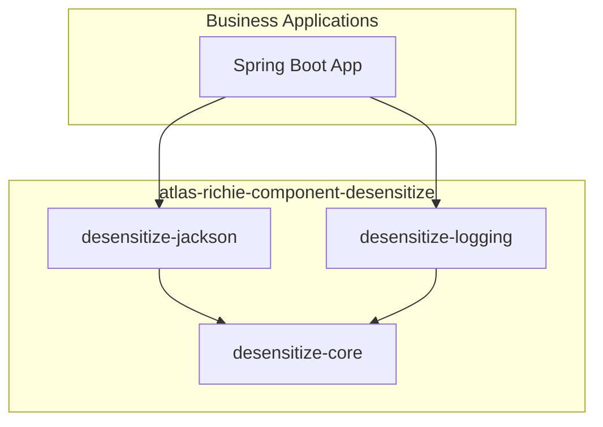
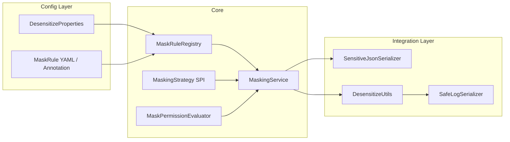
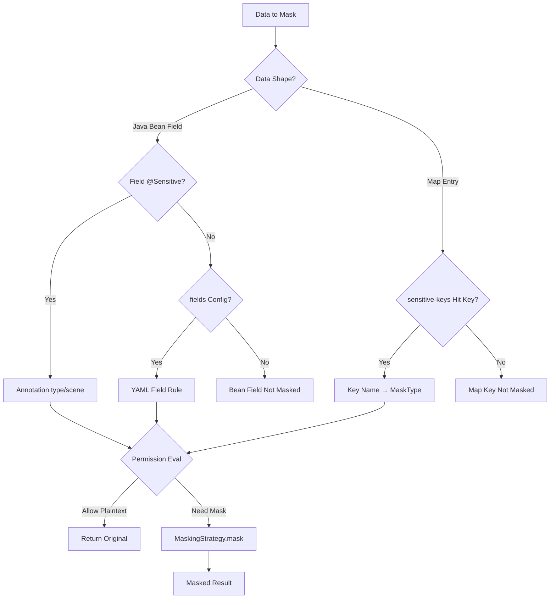
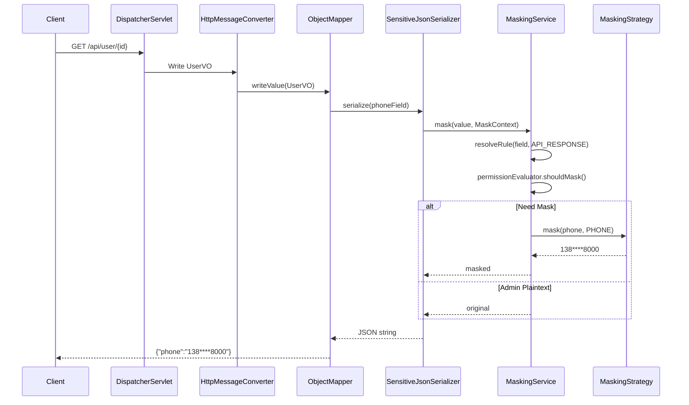
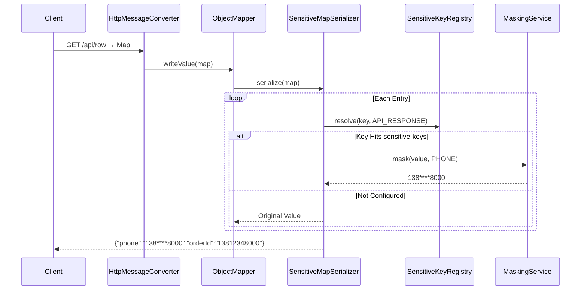
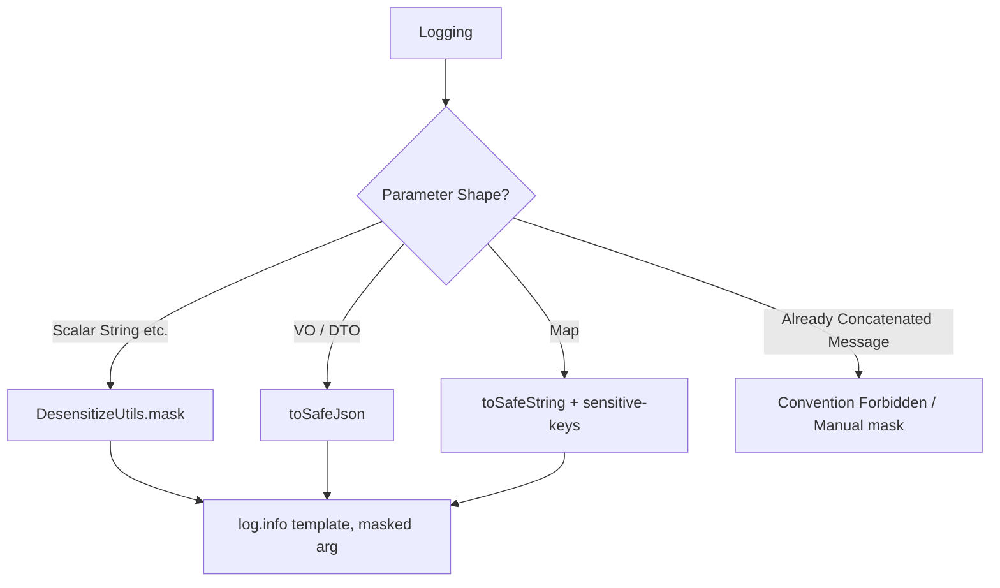
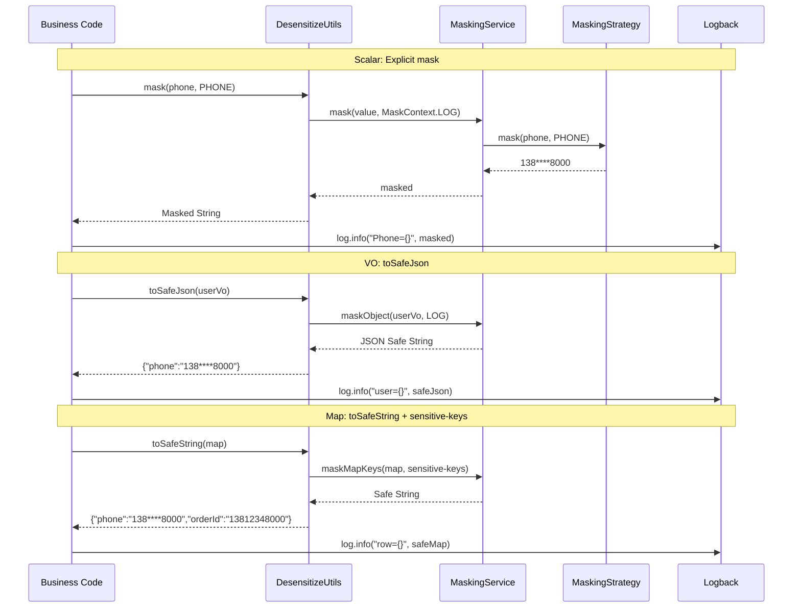
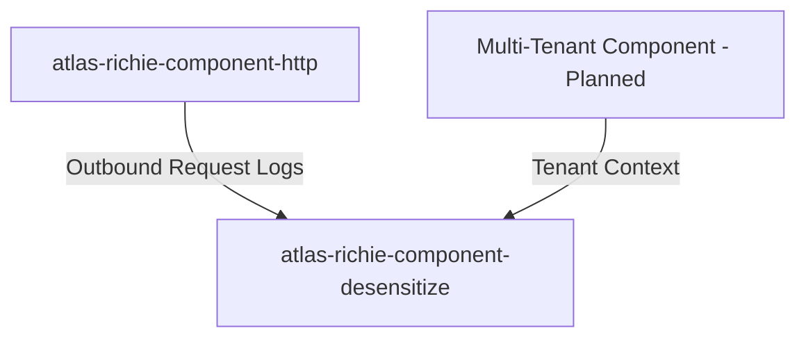

# Atlas Richie Desensitize Component (atlas-richie-component-desensitize)

> Unified data desensitization component: applies consistent processing to sensitive fields in **API responses**, **logs**, **audits**, and **exception messages**, preventing plaintext leakage at every egress.

> **Current Status**: **P0 Core**, **P1 Jackson**, and **P2 Logging (basic version)** have been implemented and passed unit/integration tests; enhancements like JSON Layout can be iterated on later.

---

## 📖 Contents

- [Sub-module Documentation at a Glance](#sub-module-documentation-at-a-glance)
- [1. Goals & Scope](#1-goals-&-scope)
  - [1.1 Goals](#11-goals)
  - [1.2 Scope (V1)](#12-scope-v1)
  - [1.3 Non-Goals (V1 Not Done)](#13-non-goals-v1-not-done)
- [2. Architecture Design](#2-architecture-design)
  - [2.1 Module Dependency Relationships](#21-module-dependency-relationships)
  - [2.2 Runtime Component Relationships](#22-runtime-component-relationships)
- [3. Working Principles](#3-working-principles)
  - [3.1 Rule Resolution Priority](#31-rule-resolution-priority)
  - [3.2 API Response Desensitization Sequence](#32-api-response-desensitization-sequence)
  - [3.3 Log Desensitization Dedicated Design](#33-log-desensitization-dedicated-design)
  - [3.4 Exception Message Desensitization (Planned)](#34-exception-message-desensitization-planned)
- [4. Key Objects](#4-key-objects)
  - [4.1 Domain Model](#41-domain-model)
  - [4.2 Core Services & Extensions](#42-core-services-&-extensions)
  - [4.3 Jackson Integration](#43-jackson-integration)
  - [4.4 Logging Related (Core + Logging Modules)](#44-logging-related-core-+-logging-modules)
  - [4.5 Built-in Strategies (Planned Implementation)](#45-built-in-strategies-planned-implementation)
- [5. Configuration Model](#5-configuration-model)
  - [5.0 Default Strategy (Recommended)](#50-default-strategy-recommended)
  - [5.1 Configuration Prefix](#51-configuration-prefix)
  - [5.2 Annotation Usage (Planned)](#52-annotation-usage-planned)
  - [5.3 API Return Map Example (Planned)](#53-api-return-map-example-planned)
  - [5.4 Log Usage Example (Planned)](#54-log-usage-example-planned)
  - [5.5 Dependency Introduction (Planned)](#55-dependency-introduction-planned)
- [6. Extension Points](#6-extension-points)
  - [6.1 Custom Strategy](#61-custom-strategy)
  - [6.2 Permission Evaluation](#62-permission-evaluation)
- [7. Relationship with Other Platform Components](#7-relationship-with-other-platform-components)
- [8. Implementation Roadmap](#8-implementation-roadmap)
  - [Definition of Done (Coding Phase)](#definition-of-done-coding-phase)
- [9. Risks & Constraints](#9-risks-&-constraints)
- [10. Documentation Index](#10-documentation-index)
  - [10.1 Parent Component (this document)](#101-parent-component-this-document)
  - [10.2 Sub-module Documentation](#102-sub-module-documentation)
- [11. Version](#11-version)
---

## Sub-module Documentation at a Glance

This component ships as three Maven modules. Each has its own README with detailed usage, configuration, and design notes:

| Module | English | 中文 | Primary Use |
|--------|---------|------|-------------|
| `desensitize-core` | [README](./atlas-richie-component-desensitize-core/README.md) | Pure-Java rules, strategies, `MaskingService`, `DesensitizeUtils`, Spring Boot auto-config |
| `desensitize-jackson` | [README](./atlas-richie-component-desensitize-jackson/README.md) | `@Sensitive` annotation + Map serialization for REST API responses |
| `desensitize-logging` | [README](./atlas-richie-component-desensitize-logging/README.md) | Logback `ConversionRule` / TurboFilter for log output masking |

---

## 1. Goals & Scope

### 1.1 `Goals`

| Goal | Description |
|------|-------------|
| Unified Rules | Built-in strategies for phone numbers, ID cards, bank cards, emails + extensible SPI |
| Multi-Scenario | The same `MaskingService` powers JSON serialization, logs, exception messages, etc. |
| Configurable | YAML global rules + annotation field-level overrides |
| Optional Permission | Decide whether to mask by role/permission (e.g. admins see plaintext) |
| Low-Intrusion | API-side DTO with `@Sensitive`; log-side `DesensitizeUtils` for explicit masking and safe serialization |

### 1.2 `Scope` (`V1`)

- ✅ String field desensitization (scalar `String`)
- ✅ Jackson serialization egress: Bean field `@Sensitive` + **Map key-name `sensitive-keys`**
- ✅ Logs: `DesensitizeUtils` explicit masking (scalar), `toSafeJson` / `toSafeString` (VO / Map)
- ✅ Map (API / log): desensitize by global `sensitive-keys` (no value-shape guessing)
- ✅ Global toggle and scene-level toggles (`API_RESPONSE` / `LOG` / `AUDIT` / `EXCEPTION`)
- ⏳ V2: Nested Map path expressions, JSON Layout auto encoder, OpenTelemetry attributes

### 1.3 `Non`-`Goals` (`V1` `Not` `Done`)

- Encrypted storage, KMS, field-level database encryption
- Dynamic desensitization gateway (independent middleware)
- Full-link APM auto-recognition of PII (only reserved `MaskScene` extension)
- Whole-line regex blind scanning of log messages, auto-guessing PII in natural-language / i18n text (see §3.4)

---

## 2. Architecture Design

### 2.1 `Module` `Dependency` `Relationships`



| Module | Dependency-Side Use Case | Documentation |
|--------|--------------------------|---------------|
| `desensitize-core` | Programmatic desensitization only, or custom integration | [English](./atlas-richie-component-desensitize-core/README.md) |
| `desensitize-jackson` | REST API response JSON desensitization | [English](./atlas-richie-component-desensitize-jackson/README.md) |
| `desensitize-logging` | Log output desensitization | [English](./atlas-richie-component-desensitize-logging/README.md) |

### 2.2 `Runtime` `Component` `Relationships`



**Design Principles**:

1. **Core has no Web / no Jackson dependencies**: `MaskingService` is pure-Java capability for easy unit testing and reuse.
2. **Thin integration layer**: Jackson handles API serialization; the log side uses `DesensitizeUtils` as the main entry.
3. **Scene-driven**: `MaskScene` decides whether the current egress performs masking and the rule priority.
4. **Logs do not guess types**: sensitive semantics are explicitly marked by developers, VO annotations, or Map key-name config — no PII inference on Chinese / i18n free text.

---

## 3. Working Principles

### 3.1 `Rule` `Resolution` `Priority`



### 3.2 `API` `Response` `Desensitization` `Sequence`



#### 3.2.1 `API` `Returns` `Map` — `Annotation` `Ineffective`, `Key`-`Name` `Config` + `Jackson` `Map` `Serializer`

`@Sensitive` can only be marked on **Bean fields**; in the following scenarios Jackson will **not** auto-desensitize:

```java
@GetMapping("/user")
public Map<String, Object> getUser() {
    return Map.of("phone", "13812348000", "orderId", "13812348000");
}

public class UserVO {
    private Map<String, Object> extra;  // Inner Map keys have no annotation
}
```

| Return Shape | `@Sensitive` / Bean Serializer | Handling |
|--------------|-------------------------------|----------|
| `UserVO` scalar field | ✅ `SensitiveJsonSerializer` | Annotation + `MaskScene.API_RESPONSE` |
| `Map` as root return value | ❌ | `SensitiveMapSerializer` + **`sensitive-keys`** |
| `Map` field inside `UserVO` | ❌ (inner Map keys have no annotation) | When property type is `Map`, also goes through `SensitiveMapSerializer` |
| Dynamic keys, cannot configure | ❌ | **`DesensitizeUtils.maskMap(map)`** before return, or change to VO |

**Same rules as log Map**: look up `MaskType` by **key name**, mask value, **do not guess value shape**. LOG and API can share global `sensitive-keys`, or override per-scene (see §5.1).



**Implementation Notes (planned, `desensitize-jackson`)**:

1. Register `SensitiveMapSerializer` (`JsonSerializer<Map>`) to process each entry when serializing to JSON object.
2. `SensitiveBeanSerializerModifier`: bind Map serializer when property type is `Map` (including `Map<String, Object>`).
3. Nested `Map` / `List`: recursive desensitization (V1 one level; V2 depth + cycle-reference protection).
4. Integrated with `MaskPermissionEvaluator`: admin role can see plaintext in API response.

**Recommended priority for business-side**:

1. **Preferred**: external API uses **VO + `@Sensitive`**, type-safe and reviewable.
2. **Map required** (dynamic columns, legacy interfaces): maintain **`sensitive-keys`**, ensure stable key naming (`phone`, not `mobilePhone` / `user_phone` mixed).
3. **Fallback**: `return DesensitizeUtils.maskMap(map);` (Core generates masked Map in memory, Jackson writes it as-is).

```java
// Programmatic fallback (dynamic keys or temporary interface)
return DesensitizeUtils.maskMap(rawMap);  // Returns new Map, does not modify original
```

> **Convention**: Do not rely on "Jackson default Map serialization" to auto-desensitize; Map returns without `sensitive-keys` and without `maskMap` will output **plaintext**.

### 3.3 `Log` `Desensitization` `Dedicated` `Design`

Key difference between logs and API responses: **SLF4J defaults to calling `toString()` on parameters, not Jackson**. Therefore the log side takes **developer-explicit masking + safe serialization** as the main path, and **does not run full-string rule blind scanning on already-formatted messages** (especially when containing Chinese, i18n templates where PII types cannot be reliably inferred).

#### 3.3.1 `Core` `Principles`

| Principle | Description |
|-----------|-------------|
| **Explicit over Inference** | Scalars are `mask`ed by developers before logging; VO uses `toSafeJson`; Map uses `sensitive-keys` + `toSafeString` |
| **Semantics in Data, Not in Text** | Chinese / English / i18n only affects templates, not type judgment |
| **Forbidden to Concatenate into Message** | `msg + phone`, `getMessage() + idCard` and similar anti-patterns, the component cannot fix |
| **Regex Only as Fallback** | `log.regex-fallback.enabled` defaults to `false`, not part of the main solution |

#### 3.3.2 `Choose` `Strategy` by `Data` `Shape`



| Shape | Can "Look Like Phone" by String? | Recommended Approach |
|-------|----------------------------------|----------------------|
| **Scalar** (`phone`, `idCard`) | No | `log.info("...", DesensitizeUtils.mask(phone, PHONE))` |
| **VO / DTO** | No (`log.info("{}", vo)` calls `toString()`, `@Sensitive` doesn't apply) | `log.info("user={}", DesensitizeUtils.toSafeJson(vo))` |
| **Map** | No (no field annotations) | `log.info("row={}", DesensitizeUtils.toSafeString(map))`, key name hits `sensitive-keys` |
| **i18n Template + Parameters** | No (template language-independent) | Explicitly `mask` only the **sensitive parameters**, template text outputs as-is |
| **Free Text Message** | No | Development convention forbidden; optional regex fallback (off by default) |

#### 3.3.3 `Scalar` `Parameters` — `Explicit` `Masking` (`Main` `Path`, `Most` `Reliable`)

```java
import static com.richie.component.desensitize.core.util.DesensitizeUtils.*;

// Chinese template
log.info("User {}'s phone is {}", name, mask(phone, MaskType.PHONE));

// i18n: sensitive value is still in parameter position, independent of template language
log.info(messageSource.getMessage("user.phone", new Object[]{ name, mask(phone, PHONE) }, locale));
```

`DesensitizeUtils` is a static facade that internally delegates to the `MaskingService` in the Spring container, sharing rules and `MaskingStrategy` with API and `@Sensitive`.

#### 3.3.4 `VO` / `DTO` — `Safe` `Serialization` (`Annotation`-`Driven`)

```java
// ❌ @Sensitive will not apply: Logback calls vo.toString()
log.info("user={}", userVo);

// ✅ Goes through component-controlled serialization (reflection reads @Sensitive, or reuses Jackson Module)
log.info("user={}", DesensitizeUtils.toSafeJson(userVo));
```

`toSafeJson(Object)` Behavior (planned):

1. `null` → `"null"`
2. **Java Bean**: output JSON string after masking by field `@Sensitive` + `MaskScene.LOG`
3. **Collection / Array**: process elements recursively
4. Optional: if Jackson is on classpath and `desensitize.jackson.log-enabled` is enabled, delegate to `ObjectMapper` + `SensitiveModule` (consistent with API rules)

#### 3.3.5 `Map` — `Key`-`Name` `Config` `Driven` (`No` `Annotation`)

`Map` has no field annotations, masks value by **key semantics**, **does not guess type by value shape** (avoid `orderId=138...` false positive). Shares global **`sensitive-keys`** with API-returned Map (§3.2.1); `log.sensitive-keys` is only an optional override.

```yaml
platform:
  component:
    desensitize:
      sensitive-keys:
        phone: PHONE
        mobile: PHONE
        idCard: ID_CARD
        id_card: ID_CARD
        bankCard: BANK_CARD
```

```java
Map<String, Object> row = Map.of("phone", "13812348000", "orderId", "13812348000");

// ❌
log.info("row={}", row);

// ✅ Only phone key hits rule
log.info("row={}", DesensitizeUtils.toSafeString(row));
// → {"phone":"138****8000","orderId":"13812348000"}
```

`toSafeString(Map)` Behavior (planned):

- key matches `sensitive-keys` **case-insensitively**
- when value is `String`, mask by corresponding `MaskType`
- **Nested Map / List**: recursive (V1 one level nested; V2 supports paths like `user.phone`)
- Unconfigured key: **output as-is**, no guessing
- Runtime dynamic key Map: config cannot cover → **explicit `mask` for each value before writing**, or change to VO

#### 3.3.6 `Optional` — `Parameter` `Wrapper` `Types`

If you want to write `mask` one less time, you can use `SensitiveLogArg` (still explicit type marking):

```java
log.info("phone={}", SensitiveLogArg.phone(phone));
```

`desensitize-logging` provides two log enhancement paths:

1. `DesensitizeConverter`: output masked message via `%desensitizeMsg`.
2. `SensitiveLogArgTurboFilter`: replace `SensitiveLogArg` parameters in-place before log event creation, even with plain `%msg`.
3. `DesensitizeJsonMessageConverter`: auto-mask JSON text messages by `sensitive-keys` via `%desensitizeJsonMsg`.
4. `SensitiveMdcTurboFilter`: auto-mask sensitive MDC key-values (e.g. `phone`, `idCard`) before log events, suitable for JSON Layout `includeMdc` scenarios.

JSON Layout is still an optional enhancement.

#### 3.3.7 `Optional` — `Structured` `JSON` `Log` `Layout`

In production with unified JSON Layout, you can mask **known JSON field names** at the Encoder layer (sharing config with `sensitive-keys`). VO can also go through `ObjectMapper` + `SensitiveModule` inside the Encoder. This is a P2 enhancement, **does not replace** the business-side `toSafeJson` / explicit `mask` convention.

#### 3.3.8 `Regex` `Fallback` (`Off` by `Default`, `Not` `Recommended`)

Only for legacy logs that cannot be modified; **cannot handle** pure natural language, multi-language mixing, or i18n already concatenated into message scenarios.

```yaml
platform:
  component:
    desensitize:
      log:
        regex-fallback:
          enabled: false   # Default false
          rules:
            - type: PHONE
              pattern: "(1[3-9]\\d{9})"
```

When enabled: pre-compile regex scan on **whole-line message** once; accept false positives / false negatives risk. Isolated from `EXCEPTION` scene config.

#### 3.3.9 `Log` `Desensitization` `Sequence` (`Main` `Path`)



#### 3.3.10 `Log` `Development` `Specification` (`DoD` `Checklist`)

- [ ] Sensitive scalar: **`DesensitizeUtils.mask(...)` before output**, independent of message language
- [ ] Printing VO: **forbidden** to use bare `log.info("{}", vo)`; use `toSafeJson(vo)`
- [ ] Printing Map: use `toSafeString(map)`, unify key naming and maintain `sensitive-keys`
- [ ] **Forbidden** to concatenate plaintext PII into message / i18n strings
- [ ] Do not enable `log.regex-fallback` by default

> **Detailed usage, configuration, and Logback wiring (`%desensitizeMsg` / `%desensitizeJsonMsg` / TurboFilters) live in the sub-module documentation:**
> [`atlas-richie-component-desensitize-logging/README.md`](./atlas-richie-component-desensitize-logging/README.md) · 

---

### 3.4 `Exception` `Message` `Desensitization` (`Planned`)

If exception `getMessage()` is concatenated by business and contains PII, parameters should be explicitly `mask`ed **before throwing**, or wrapped as error code messages not containing plaintext.

Under `MaskScene.EXCEPTION`, you can optionally enable `exception.regex-fallback` (default `false`) **independent of logs**, as the last line of defense at the framework layer; **does not replace** business-side explicit handling.

---

## 4. Key Objects

### 4.1 `Domain` `Model`

| Type | Responsibility |
|------|---------------|
| `MaskType` | Desensitization type enum: `PHONE`, `ID_CARD`, `EMAIL`, `BANK_CARD`, `NAME`, `ADDRESS`, `PASSWORD`, `CUSTOM`, etc. |
| `MaskScene` | Egress scene: `API_RESPONSE`, `LOG`, `AUDIT`, `EXCEPTION` |
| `MaskRule` | Single rule: `type`, `scenes`, `keepLeft`/`keepRight`, `maskChar`; `pattern` only for optional regex fallback |
| `MaskContext` | One-time masking context: `scene`, `fieldName`, `declaringClass`, `principal` (optional) |
| `DesensitizeProperties` | `@ConfigurationProperties(prefix = "platform.component.desensitize")` |

### 4.2 `Core` `Services` & `Extensions`

| Type | Responsibility |
|------|---------------|
| `MaskingStrategy` | SPI: `boolean supports(MaskType)`, `String mask(String raw, MaskRule rule)` |
| `MaskRuleRegistry` | Merges YAML + annotation metadata, queries rules by field name/type |
| `MaskingService` | Unified entry: `mask(String, MaskType)`, `mask(String, MaskContext)`, `maskObject(Object, MaskScene)`, `maskMap(Map, Map<String, MaskType>)` |
| `MaskPermissionEvaluator` | `boolean shouldMask(MaskContext)`, default masks everyone; can connect to Spring Security |
| `ObjectMaskingService` | VO reflection masking, `toSafeJson` / `toSafeString` implementation carrier |
| `DesensitizeUtils` | Static facade: `mask`, `toSafeJson`, `toSafeString`, delegates to `MaskingService` |
| `SensitiveLogArg` | Optional log parameter wrapper: `SensitiveLogArg.phone(value)` etc., marks `MaskType` |

### 4.3 `Jackson` `Integration`

| Type | Responsibility |
|------|---------------|
| `@Sensitive` | Field annotation: `MaskType type`, `MaskScene[] scenes`, `String customStrategy` |
| `SensitiveJsonSerializer` | `JsonSerializer<String>`, delegates to `MaskingService` |
| `SensitiveBeanSerializerModifier` | Registers Bean properties with `@Sensitive`; `Map` type properties bind Map serializer |
| `SensitiveMapSerializer` | `JsonSerializer<Map>`: mask entry value by `sensitive-keys` (API_RESPONSE) |
| `SensitiveKeyRegistry` | Resolves global / per-scene `sensitive-keys`, shared by Map serializer and `toSafeString` |
| `JacksonDesensitizeAutoConfiguration` | Registers `Module` / `SerializerModifier` / `SensitiveMapSerializer` |

### 4.4 `Logging` `Related` (`Core` + `Logging` `Modules`)

| Type | Responsibility |
|------|---------------|
| `DesensitizeUtils` | **Main entry** (Core `util` package): scalar `mask`, VO `toSafeJson`, Map `toSafeString` |
| `SafeLogSerializer` | Converts Bean / Map to log-safe string (used internally by `ObjectMaskingService`) |
| `SensitiveKeyRegistry` | Resolves `sensitive-keys` (global and per-scene), shared by LOG / API |
| `SensitiveLogArg` | Optional: SLF4J parameter wrapper, replaced before formatting |
| `JsonLogEncoderEnhancer` | Optional enhancement: Logback JSON Encoder field-level masking |
| `LoggingDesensitizeAutoConfiguration` | Conditional assembly of log desensitization services (`LoggingMaskingService`) |
| `DesensitizeConverter` | Logback `ClassicConverter`: `%desensitizeMsg` outputs masked message |

### 4.5 `Built`-in `Strategies` (`Planned` `Implementation`)

| MaskType | Example Input | Example Output | Rule Notes |
|----------|---------------|----------------|------------|
| `PHONE` | 13812348000 | 138****8000 | Keep first 3 + last 4 |
| `ID_CARD` | 110101199001011234 | 110101********1234 | Keep first 6 + last 4 |
| `EMAIL` | user@example.com | u***@example.com | Local part masked |
| `BANK_CARD` | 6222021234567890 | 6222 **** **** 7890 | Keep first 4 + last 4 |
| `NAME` | Zhang Sanfeng | Zhang** | Keep first character |
| `PASSWORD` | any | ****** | Fully masked |
| `CUSTOM` | - | - | Specify via SPI Bean name or class |

---

## 5. Configuration Model

### 5.0 `Default` `Strategy` (`Recommended`)

Defaults to **all-scene desensitization**, only allowing "explicit whitelist" to bypass non-masking scenes:

| Scene | Default Mask? | Description |
|-------|---------------|-------------|
| `API_RESPONSE` | Yes | External responses default masked, avoid frontend/packet capture link leakage |
| `LOG` | Yes | Logs are long-retained and widely propagated, must default mask |
| `AUDIT` | Yes | Audit data may be retrieved and exported, recommend default mask |
| `EXCEPTION` | Yes | Exception messages may enter logs/alert systems, default mask |

Common "non-masking" is only used as exception bypass; do not recommend changing global scene toggles:

| Exception Scene | Recommended Approach |
|-----------------|----------------------|
| User viewing/editing own profile | Enable `permission.enabled=true` + `plain-text-roles` bypass |
| Controlled audit plaintext viewing | Bypass via restricted roles, ensure access audit trails |

> Recommendation: keep `scenes.* = true`, consolidate "non-masking" into permission whitelist, rather than disabling the entire scene's desensitization capability.

### 5.1 `Configuration` `Prefix`

```yaml
platform:
  component:
    desensitize:
      enabled: true
      default-mask-char: "*"
      scenes:
        api-response: true
        log: true
        audit: true
        exception: true
      permission:
        enabled: false
        plain-text-roles: []
      # Exception bypass example (not enabled by default, enable as needed)
      # permission:
      #   enabled: true
      #   plain-text-roles:
      #     - ROLE_SELF_PROFILE
      #     - ROLE_AUDIT_PLAINTEXT
      # Map key name → MaskType (API response + log shared, see §3.2.1, §3.3.5)
      sensitive-keys:
        phone: PHONE
        mobile: PHONE
        idCard: ID_CARD
        id_card: ID_CARD
        bankCard: BANK_CARD
      # API / Bean field fallback (when no @Sensitive)
      fields:
        com.example.vo.UserVO:
          phone: PHONE
          idCard: ID_CARD
      # Optional: per-scene override/append sensitive-keys
      api-response:
        sensitive-keys: {}   # Empty means only use global sensitive-keys
      log:
        sensitive-keys: {}   # Empty means only use global; see §3.3.5
        features:
          auto-register-turbo-filters: true
          sensitive-log-arg-turbo-filter-enabled: true
          sensitive-mdc-turbo-filter-enabled: true
        regex-fallback:
          enabled: false
          rules: []
        # Optional: i18n message key → the Nth parameter needs masking (fragile, supplementary only)
        message-keys: {}
      exception:
        regex-fallback:
          enabled: false
```

### 5.2 `Annotation` `Usage` (`Planned`)

```java
public class UserVO {
    @Sensitive(type = MaskType.PHONE, scenes = {MaskScene.API_RESPONSE, MaskScene.LOG})
    private String phone;

    @Sensitive(type = MaskType.ID_CARD)
    private String idCard;
}
```

> `@Sensitive(scenes = LOG)` only applies when using `DesensitizeUtils.toSafeJson(vo)` or JSON Layout Encoder; **does not** affect `log.info("{}", vo)`.

### 5.3 `API` `Return` `Map` `Example` (`Planned`)

```java
// Method A: Rely on Jackson SensitiveMapSerializer + sensitive-keys (key must be stable)
@GetMapping("/row")
public Map<String, Object> row() {
    return Map.of("phone", "13812348000", "orderId", "O-1");
}

// Method B: Dynamic keys, explicitly handle before return
@GetMapping("/dynamic")
public Map<String, Object> dynamic() {
    return DesensitizeUtils.maskMap(buildDynamicMap());
}
```

### 5.4 `Log` `Usage` `Example` (`Planned`)

```java
// Scalar
log.info("Phone={}", DesensitizeUtils.mask(phone, MaskType.PHONE));

// VO
log.info("user={}", DesensitizeUtils.toSafeJson(userVo));

// Map
log.info("row={}", DesensitizeUtils.toSafeString(dataMap));
```

### 5.5 `Dependency` `Introduction` (`Planned`)

```xml
<!-- API response desensitization -->
<dependency>
    <groupId>com.richie.component</groupId>
    <artifactId>atlas-richie-component-desensitize-jackson</artifactId>
</dependency>

<!-- Log desensitization -->
<dependency>
    <groupId>com.richie.component</groupId>
    <artifactId>atlas-richie-component-desensitize-logging</artifactId>
</dependency>
```

The log module (`desensitize-logging`) is **optional**: V1 business-side only needs to depend on `desensitize-core` + `DesensitizeUtils` to satisfy the main path. JSON Layout / `SensitiveLogArg` filters are P2 enhancements.

Logback Integration Example (Implemented):

```xml
<configuration>
    <conversionRule conversionWord="desensitizeMsg"
        converterClass="com.richie.component.desensitize.logging.logback.DesensitizeConverter"/>

    <appender name="CONSOLE" class="ch.qos.logback.core.ConsoleAppender">
        <encoder>
            <pattern>%d{yyyy-MM-dd HH:mm:ss} [%thread] %-5level %logger{36} - %desensitizeMsg%n</pattern>
        </encoder>
    </appender>

    <root level="INFO">
        <appender-ref ref="CONSOLE"/>
    </root>
</configuration>
```

Companion code:

```java
log.info("phone={}, orderId={}",
        SensitiveLogArg.phone("13812348000"),
        "ORDER-13812348000");
```

If using the regular `%msg`, after enabling the logging module it will also be auto-handled by `SensitiveLogArgTurboFilter`.

For JSON message scenarios:

```xml
<conversionRule conversionWord="desensitizeJsonMsg"
    converterClass="com.richie.component.desensitize.logging.logback.DesensitizeJsonMessageConverter"/>
<pattern>%d %-5level %logger - %desensitizeJsonMsg%n</pattern>
```

Structured Log (MDC) Scenario:

```java
MDC.put("phone", "13812348000");
MDC.put("traceId", "T-1");
log.info("user login");
```

If JSON Layout/Encoder outputs MDC (e.g. `includeMdc=true`), `phone` will be auto-masked to `138****8000`, `traceId` remains unchanged.

You can disable enhancements via config toggle:

```yaml
platform:
  component:
    desensitize:
      log:
        features:
          auto-register-turbo-filters: false
          sensitive-log-arg-turbo-filter-enabled: false
          sensitive-mdc-turbo-filter-enabled: false
```

---

## 6. Extension Points

### 6.1 `Custom` `Strategy`

Implement `MaskingStrategy` and register as a Spring Bean; `MaskType.CUSTOM` + `customStrategy = "beanName"` points to that implementation.

```mermaid
flowchart LR
    DEV[Business Side] -->|implements| SPI[MaskingStrategy]
    SPI -->|@Component| SPRING[Spring Context]
    SPRING --> REG[MaskRuleRegistry]
    REG --> SVC[MaskingService]
```

### 6.2 `Permission` `Evaluation`

Replace or decorate `MaskPermissionEvaluator`: combine `SecurityContext`, tenant, data permissions to decide whether the current user can see plaintext.

---

## 7. Relationship with Other Platform Components



- **HTTP Client**: Use `DesensitizeUtils.toSafeJson` / `mask` before printing outbound request/response body logs, avoiding duplicate rule implementation inside Adapter.
- **Multi-Tenant**: `MaskContext` can carry `tenantId`, supporting tenant-level desensitization strategies (V2).

---

## 8. Implementation Roadmap

| Phase | Content | Output | Documentation |
|-------|---------|--------|---------------|
| **P0** | Core: `MaskingService`, `DesensitizeUtils`, `ObjectMaskingService`, `SensitiveKeyRegistry`, `sensitive-keys`, built-in Strategy | Unit-testable; log main path usable | [core / 核心](./atlas-richie-component-desensitize-core/README.md) ·  |
| **P1** | Jackson: `@Sensitive` + `SensitiveMapSerializer` + Module | API: Bean + Map response desensitization | [jackson / Jackson](./atlas-richie-component-desensitize-jackson/README.md) ·  |
| **P2** | Logging Basic: `DesensitizeConverter` + `SensitiveLogArgTurboFilter` + `DesensitizeJsonMessageConverter` + `SensitiveMdcTurboFilter` + `LoggingMaskingService`; optional enhancement: JSON Layout Encoder | Log parameters, JSON text, MDC field desensitization directly applicable | [logging / 日志](./atlas-richie-component-desensitize-logging/README.md) ·  |
| **P3** | Permission Evaluation + Integration Tests + `sample-desensitize` (Optional) | Demonstrable, regression-testable | – |

### `Definition` of `Done` (`Coding` `Phase`)

- [ ] Each built-in `MaskType` has unit tests (boundaries: empty string, short string, illegal format)
- [ ] `desensitize-jackson` integration tests: VO `@Sensitive`; root `Map` and VO-internal `Map` fields masked by `sensitive-keys`
- [ ] `DesensitizeUtils`: scalar `mask`, `toSafeJson` (`@Sensitive`), `toSafeString` (Map key) unit and integration tests
- [ ] Documentation example: `log.info("{}", vo)` does not auto-desensitize (negative case)
- [ ] `platform.component.desensitize.enabled=false` bypasses the entire chain
- [ ] README configuration examples consistent with code

---

## 9. Risks & Constraints

| Item | Description | Mitigation |
|------|-------------|------------|
| Misbelieve annotation protects logs | `log.info("{}", vo)` calls `toString()` | Documentation + Code Review; enforce `toSafeJson` |
| Map dynamic keys | Config cannot cover | Explicit `mask` before writing or change to VO |
| i18n / Chinese message | Cannot guess PII from text | Only mask parameters; forbidden to concatenate into message |
| Missed masking | Not `mask`ed / Not `toSafeJson` | Convention checklist; optional ArchUnit rule (V2) |
| Performance | `toSafeJson` reflection has serialization overhead | Only call when debug/info needed; production prefers JSON Layout |
| Over-masking | Admins cannot troubleshoot | `MaskPermissionEvaluator` plaintext roles |
| Regex fallback false positives | Order number looks like phone number | `regex-fallback` off by default |
| Serialization compatibility | Gson/Protobuf | V1 only Jackson API; others go through `DesensitizeUtils` |

---

## 10. Documentation Index

### 10.1 `Parent` `Component` (this document)

| Document | Description |
|----------|-------------|
| [README.md](./README.md) | This document: design plan, principle diagrams, sequence diagrams, key objects |
| [README §3.2.1](./README.zh.md#321-api-returns-map-annotation-ineeffective-key-name-config--jackson-map-serializer) | API returns `Map`: `SensitiveMapSerializer` + `sensitive-keys` |
| [README §3.3](./README.zh.md#33-log-desensitization-dedicated-design) | Logs: explicit `mask`, VO `toSafeJson`, Map `toSafeString`, i18n constraints |
| [docs/MODULE_STRUCTURE.md](./docs/MODULE_STRUCTURE.md) | Package paths, module responsibilities and resource file planning |

### 10.2 `Sub`-module `Documentation`

Each sub-module has its own README with detailed API usage, configuration, and design notes. Read in this order for first-time onboarding:

| # | Sub-module | English | 中文 | When to read |
|---|------------|---------|------|--------------|
| 1 | **`desensitize-core`** | [README](./atlas-richie-component-desensitize-core/README.md) | [README.zh.md](./atlas-richie-component-desensitize-core/README.md) | Always — the pure-Java rule engine, `MaskingService`, `DesensitizeUtils`, `@Sensitive`, built-in strategies, and permission bypass |
| 2 | **`desensitize-jackson`** | [README](./atlas-richie-component-desensitize-jackson/README.md) | [README.zh.md](./atlas-richie-component-desensitize-jackson/README.md) | When exposing REST APIs that return VOs or `Map` payloads and need `@Sensitive` / `sensitive-keys` driven JSON masking |
| 3 | **`desensitize-logging`** | [README](./atlas-richie-component-desensitize-logging/README.md) | [README.zh.md](./atlas-richie-component-desensitize-logging/README.md) | When emitting logs that may contain sensitive values — `%desensitizeMsg` / `%desensitizeJsonMsg` / `SensitiveLogArg` / MDC filtering |

> Each sub-module README cross-links back to this parent document, so navigation is bi-directional.

---

## 11. Version

| Attribute | Value |
|-----------|-------|
| Component Version | Follows `${middle.platform.version}` |
| Design Document Version | 1.3.0 |
| Status | P0/P1/P2 (basic version) implemented; JSON Layout and other enhancements pending |