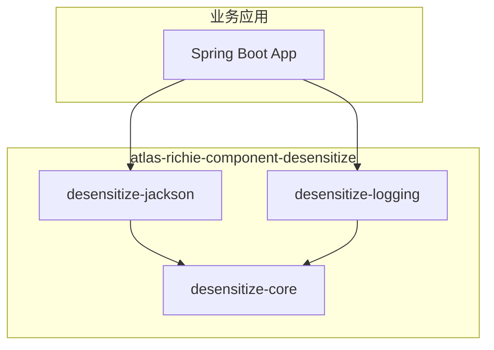
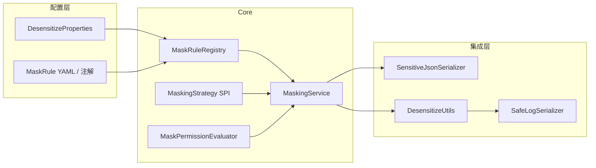
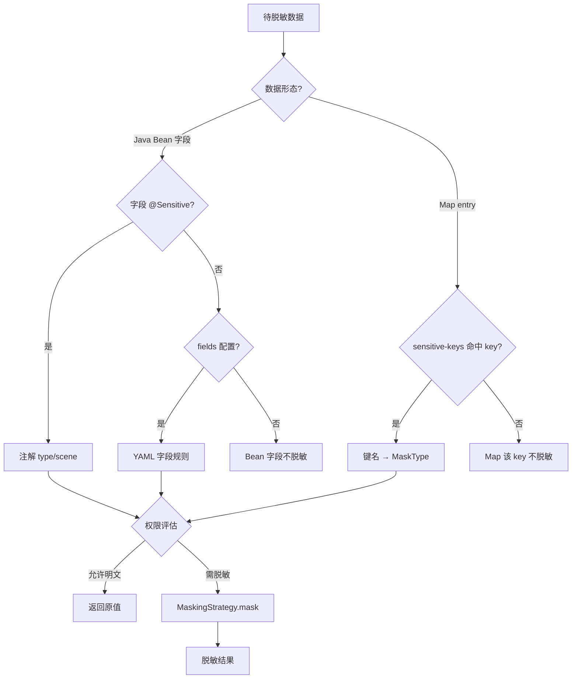
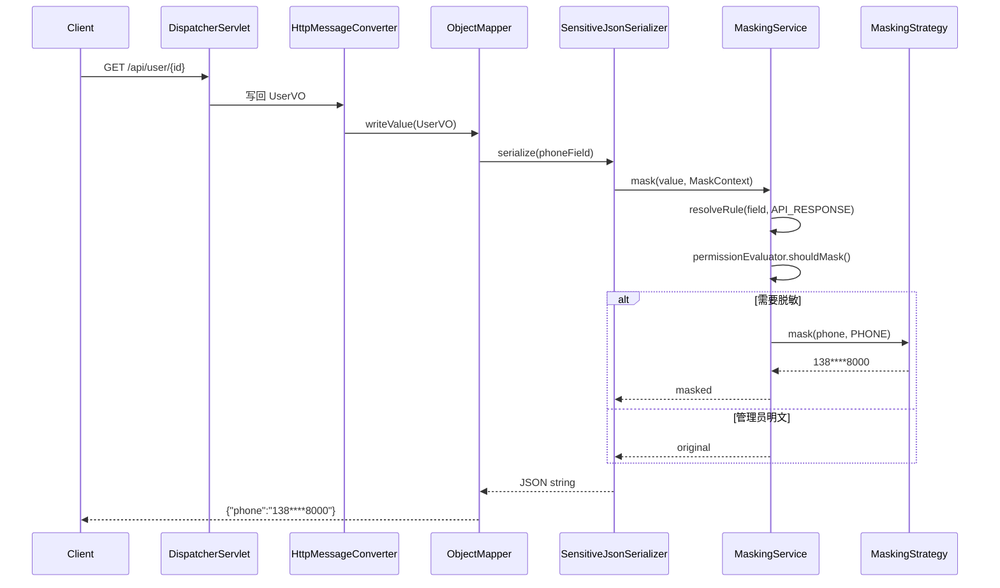
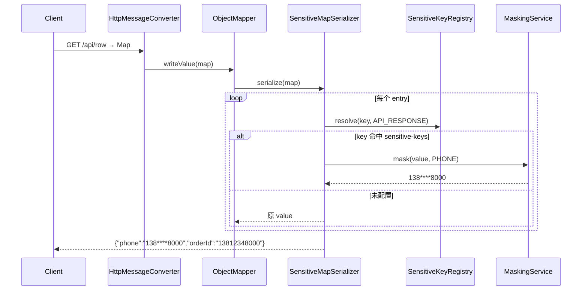
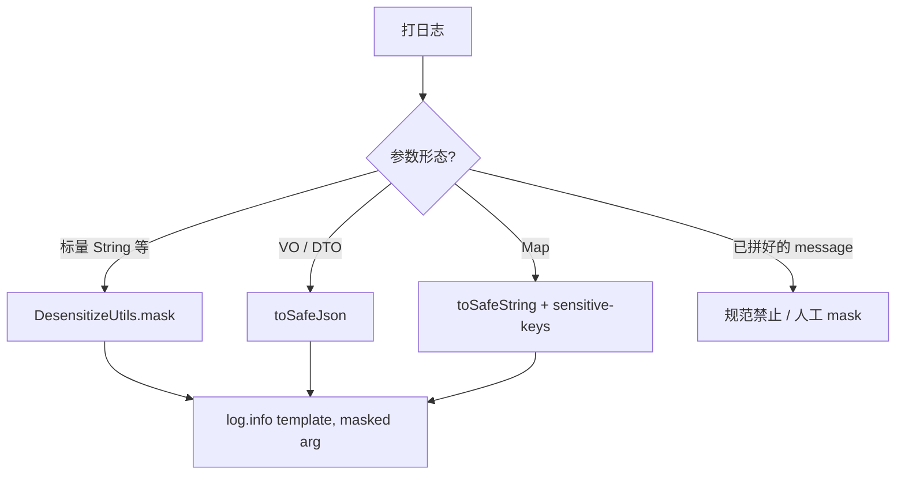
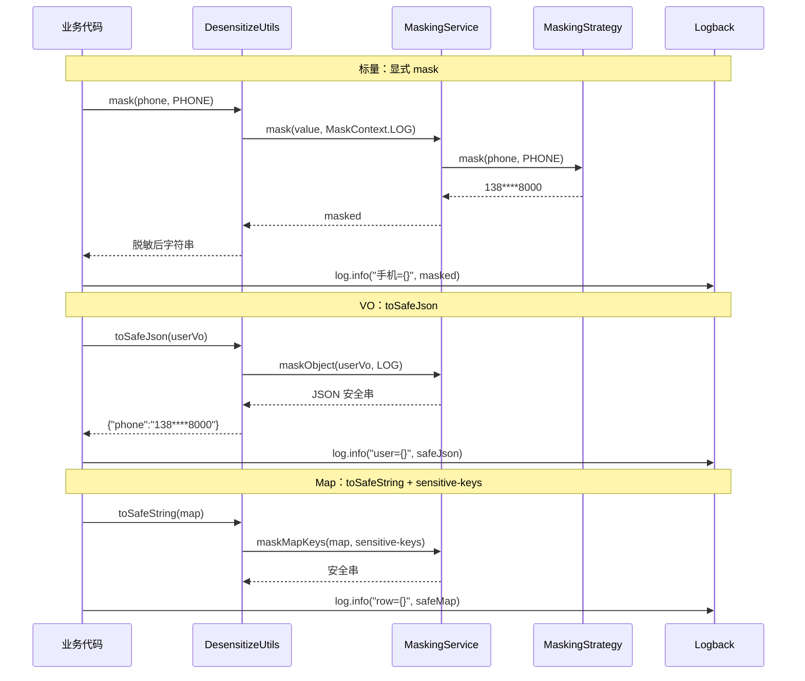
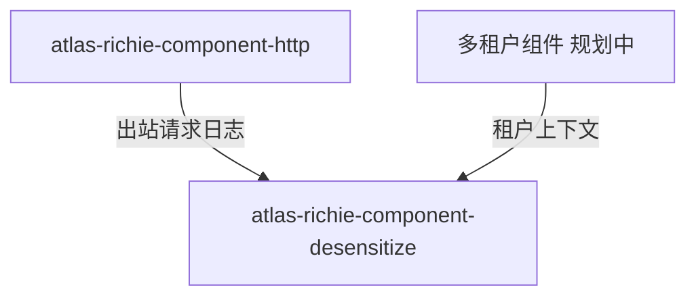

# Atlas Richie 脱敏组件 (atlas-richie-component-desensitize)

统一数据脱敏组件：在 **API 返回值**、**日志**、**审计**、**异常信息** 等出口对敏感字段进行一致化处理，避免明文泄露。

> **当前状态**：**P0 Core**、**P1 Jackson**、**P2 Logging（基础版）** 已实现并通过单元/集成测试；JSON Layout 等增强仍可后续迭代。

---

## 📖 目录

- [子模块文档一览](#子模块文档一览)
- [1. 目标与范围](#1-目标与范围)
  - [1.1 目标](#11-目标)
  - [1.2 范围（V1）](#12-范围（v1）)
  - [1.3 非目标（V1 不做）](#13-非目标（v1-不做）)
- [2. 架构设计](#2-架构设计)
  - [2.1 模块依赖关系](#21-模块依赖关系)
  - [2.2 运行时组件关系](#22-运行时组件关系)
- [3. 工作原理](#3-工作原理)
  - [3.1 规则解析优先级](#31-规则解析优先级)
  - [3.2 API 返回值脱敏时序](#32-api-返回值脱敏时序)
  - [3.3 日志脱敏专项设计](#33-日志脱敏专项设计)
  - [3.4 异常信息脱敏（规划）](#34-异常信息脱敏（规划）)
- [4. 关键对象](#4-关键对象)
  - [4.1 领域模型](#41-领域模型)
  - [4.2 核心服务与扩展](#42-核心服务与扩展)
  - [4.3 Jackson 集成](#43-jackson-集成)
  - [4.4 日志相关（Core + Logging 模块）](#44-日志相关（core-+-logging-模块）)
  - [4.5 内置策略（规划实现）](#45-内置策略（规划实现）)
- [5. 配置模型](#5-配置模型)
  - [5.0 默认策略（推荐）](#50-默认策略（推荐）)
  - [5.1 配置前缀](#51-配置前缀)
  - [5.2 注解用法（规划）](#52-注解用法（规划）)
  - [5.3 API 返回 Map 示例（规划）](#53-api-返回-map-示例（规划）)
  - [5.4 日志用法示例（规划）](#54-日志用法示例（规划）)
  - [5.5 依赖引入（规划）](#55-依赖引入（规划）)
- [6. 扩展点](#6-扩展点)
  - [6.1 自定义策略](#61-自定义策略)
  - [6.2 权限评估](#62-权限评估)
- [7. 与平台其他组件的关系](#7-与平台其他组件的关系)
- [8. 实现路线图](#8-实现路线图)
  - [Definition of Done（编码阶段）](#definition-of-done（编码阶段）)
- [9. 风险与约束](#9-风险与约束)
- [10. 文档索引](#10-文档索引)
  - [10.1 父组件文档（本文）](#101-父组件文档（本文）)
  - [10.2 子模块文档](#102-子模块文档)
- [11. 版本](#11-版本)
---

## 子模块文档一览

本组件包含三个 Maven 子模块，各自都有独立的 README，详细说明使用方式、配置项与设计要点：

| 模块 | English | 中文 | 主要用途 |
|--------|---------|------|---------|
| `desensitize-core` | [`README.zh.md`](./atlas-richie-component-desensitize-core/README.zh.md) | 纯 Java 规则、策略、`MaskingService`、`DesensitizeUtils`、Spring Boot 自动装配 |
| `desensitize-jackson` | [`README.zh.md`](./atlas-richie-component-desensitize-jackson/README.zh.md) | `@Sensitive` 注解 + Map 序列化，REST 接口响应脱敏 |
| `desensitize-logging` | [`README.zh.md`](./atlas-richie-component-desensitize-logging/README.zh.md) | Logback `ConversionRule` / TurboFilter，日志输出脱敏 |

---

## 1. 目标与范围

### 1.1 目标

| 目标   | 说明                                                           |
|------|--------------------------------------------------------------|
| 统一规则 | 手机号、身份证、银行卡、邮箱等内置策略 + 可扩展 SPI                                |
| 多场景  | 同一套 `MaskingService` 支撑 JSON 序列化、日志、异常消息等                    |
| 可配置  | YAML 全局规则 + 注解字段级覆盖                                          |
| 可选权限 | 按角色/权限决定是否脱敏（如管理员看明文）                                        |
| 低侵入  | API 侧 DTO 加 `@Sensitive`；日志侧提供 `DesensitizeUtils` 显式脱敏与安全序列化 |

### 1.2 范围（`V1`）

- ✅ 字符串字段脱敏（标量 `String`）
- ✅ Jackson 序列化出口：Bean 字段 `@Sensitive` + **Map 键名 `sensitive-keys`**
- ✅ 日志：`DesensitizeUtils` 显式脱敏（标量）、`toSafeJson` / `toSafeString`（VO / Map）
- ✅ Map（API / 日志）：按全局 `sensitive-keys` 键名脱敏（不认 value 形态）
- ✅ 全局开关与场景级开关（`API_RESPONSE` / `LOG` / `AUDIT` / `EXCEPTION`）
- ⏳ V2：嵌套 Map 路径表达式、JSON Layout 自动 Encoder、OpenTelemetry 属性

### 1.3 非目标（`V1` 不做）

- 加密存储、KMS、字段级数据库加密
- 动态脱敏网关（独立中间件）
- 全链路 APM 自动识别 PII（仅预留 `MaskScene` 扩展）
- 日志 message 整行正则盲扫、自然语言 / i18n 文案内自动猜 PII（见 §3.4）

---

## 2. 架构设计

### 2.1 模块依赖关系



| 模块 | 依赖方引入场景 | 文档 |
|------|----------------|------|
| `desensitize-core` | 仅需编程式脱敏、或自定义集成 | [中文](./atlas-richie-component-desensitize-core/README.zh.md) |
| `desensitize-jackson` | REST API 返回 JSON 脱敏 | [中文](./atlas-richie-component-desensitize-jackson/README.zh.md) |
| `desensitize-logging` | 日志输出脱敏 | [中文](./atlas-richie-component-desensitize-logging/README.zh.md) |

### 2.2 运行时组件关系



**设计原则**：

1. **Core 无 Web/无 Jackson 依赖**：`MaskingService` 为纯 Java 能力，便于单测与复用。
2. **集成层薄适配**：Jackson 负责 API 序列化；日志侧以 `DesensitizeUtils` 为主入口。
3. **场景驱动**：`MaskScene` 决定当前出口是否执行脱敏及规则优先级。
4. **日志不猜类型**：敏感语义由开发者显式标明、VO 注解或 Map 键名配置提供，不对中文 / i18n 自由文本做 PII 推断。

---

## 3. 工作原理

### 3.1 规则解析优先级



### 3.2 `API` 返回值脱敏时序



#### 3.2.1 `API` 返回 `Map`：注解无效，键名配置 + `Jackson` `Map` 序列化器

`@Sensitive` 只能标在 **Bean 字段** 上；下列场景 Jackson **不会**自动脱敏：

```java
@GetMapping("/user")
public Map<String, Object> getUser() {
    return Map.of("phone", "13812348000", "orderId", "13812348000");
}

public class UserVO {
    private Map<String, Object> extra;  // Map 内层 key 无注解
}
```

| 返回形态 | `@Sensitive` / Bean Serializer | 处理方式 |
|----------|-------------------------------|----------|
| `UserVO` 标量字段 | ✅ `SensitiveJsonSerializer` | 注解 + `MaskScene.API_RESPONSE` |
| `Map` 作为根返回值 | ❌ | `SensitiveMapSerializer` + **`sensitive-keys`** |
| `UserVO` 内的 `Map` 字段 | ❌（Map 内 key 无注解） | 属性类型为 `Map` 时同样走 `SensitiveMapSerializer` |
| 动态 key、无法配置 | ❌ | 返回前 **`DesensitizeUtils.maskMap(map)`** 或改 VO |

**与日志 Map 同一套规则**：按 **key 名** 查 `MaskType`，对 value 脱敏，**不猜 value 形态**。LOG 与 API 可共用全局 `sensitive-keys`，也可分场景覆盖（见 §5.1）。



**实现要点（规划，`desensitize-jackson`）**：

1. 注册 `SensitiveMapSerializer`（`JsonSerializer<Map>`），写出 JSON 对象时逐 entry 处理。
2. `SensitiveBeanSerializerModifier`：属性类型为 `Map`（含 `Map<String, Object>`）时绑定 Map 序列化器。
3. 嵌套 `Map` / `List`：递归脱敏（V1 一层；V2 深度与循环引用保护）。
4. 与 `MaskPermissionEvaluator` 集成：管理员角色可对 API 返回明文。

**业务侧推荐优先级**：

1. **首选**：对外 API 使用 **VO + `@Sensitive`**，类型安全、可 Review。
2. **必须用 Map**（动态列、遗留接口）：维护 **`sensitive-keys`**，保证 key 命名稳定（`phone`，不要 `mobilePhone` / `user_phone` 混用）。
3. **兜底**：`return DesensitizeUtils.maskMap(map);`（Core 在内存中生成已脱敏 Map，Jackson 原样写出）。

```java
// 编程式兜底（动态 key 或临时接口）
return DesensitizeUtils.maskMap(rawMap);  // 返回新 Map，不修改原对象
```

> **规范**：禁止指望「Jackson 默认序列化 Map」自动脱敏；无 `sensitive-keys` 且无 `maskMap` 的 Map 返回值将 **明文输出**。

### 3.3 日志脱敏专项设计

日志与 API 返回值的关键差异：**SLF4J 默认对参数调用 `toString()`，不会走 Jackson**。因此日志侧以 **开发者显式脱敏 + 安全序列化** 为主路径，**不对已格式化的 message 做全串规则盲扫**（尤其含简体中文、i18n 模板时无法可靠推断 PII 类型）。

#### 3.3.1 核心原则

| 原则 | 说明 |
|------|------|
| **显式优于推断** | 标量由开发者在打日志前 `mask`；VO 走 `toSafeJson`；Map 走 `sensitive-keys` + `toSafeString` |
| **语义在数据，不在文案** | 中文 / 英文 / i18n 只影响模板，不参与类型判断 |
| **禁止拼进 message** | `msg + phone`、`getMessage() + idCard` 等反模式，组件无法补救 |
| **正则仅兜底** | `log.regex-fallback.enabled` 默认 `false`，不纳入主方案 |

#### 3.3.2 按数据形态选择策略



| 形态 | 能否靠「看字符串像不像手机号」 | 推荐做法 |
|------|--------------------------------|----------|
| **标量**（`phone`、`idCard`） | 否 | `log.info("...", DesensitizeUtils.mask(phone, PHONE))` |
| **VO / DTO** | 否（`log.info("{}", vo)` 走 `toString()`，`@Sensitive` 不生效） | `log.info("user={}", DesensitizeUtils.toSafeJson(vo))` |
| **Map** | 否（无字段注解） | `log.info("row={}", DesensitizeUtils.toSafeString(map))`，键名命中 `sensitive-keys` |
| **i18n 模板 + 参数** | 否（模板语言无关） | 仅对**敏感参数**显式 `mask`，模板原文原样输出 |
| **自由文本 message** | 否 | 开发规范禁止；可选正则兜底（默认关） |

#### 3.3.3 标量参数：显式脱敏（主路径，最靠谱）

```java
import static com.richie.component.desensitize.core.util.DesensitizeUtils.*;

// 中文模板
log.info("用户{}的手机号是{}", name, mask(phone, MaskType.PHONE));

// i18n：敏感值仍在参数位，与文案语言无关
log.info(messageSource.getMessage("user.phone", new Object[]{ name, mask(phone, PHONE) }, locale));
```

`DesensitizeUtils` 为静态门面，内部委托 Spring 容器中的 `MaskingService`，与 API、`@Sensitive` 共用规则与 `MaskingStrategy`。

#### 3.3.4 `VO` / `DTO`：安全序列化（注解驱动）

```java
// ❌ @Sensitive 不会生效：Logback 调用 vo.toString()
log.info("user={}", userVo);

// ✅ 走组件控制的序列化（反射读 @Sensitive，或复用 Jackson Module）
log.info("user={}", DesensitizeUtils.toSafeJson(userVo));
```

`toSafeJson(Object)` 行为（规划）：

1. `null` → `"null"`
2. **Java Bean**：按字段 `@Sensitive` + `MaskScene.LOG` 脱敏后输出 JSON 字符串
3. **集合 / 数组**：元素递归处理
4. 可选：若 classpath 存在 Jackson 且启用 `desensitize.jackson.log-enabled`，委托 `ObjectMapper` + `SensitiveModule`（与 API 规则一致）

#### 3.3.5 `Map`：键名配置驱动（无注解）

`Map` 无字段注解，按 **key 语义** 脱敏 value，**不根据 value 形态猜测类型**（避免 `orderId=138...` 误伤）。与 API 返回 Map 共用全局 **`sensitive-keys`**（§3.2.1）；`log.sensitive-keys` 仅作可选覆盖。

```yaml
platform:
  component:
    desensitize:
      sensitive-keys:
        phone: PHONE
        mobile: PHONE
        idCard: ID_CARD
        id_card: ID_CARD
        bankCard: BANK_CARD
```

```java
Map<String, Object> row = Map.of("phone", "13812348000", "orderId", "13812348000");

// ❌
log.info("row={}", row);

// ✅ 仅 phone 键命中规则
log.info("row={}", DesensitizeUtils.toSafeString(row));
// → {"phone":"138****8000","orderId":"13812348000"}
```

`toSafeString(Map)` 行为（规划）：

- key 与 `sensitive-keys` **忽略大小写**匹配
- value 为 `String` 时按对应 `MaskType` 脱敏
- **嵌套 Map / List**：递归（V1 一层嵌套；V2 支持路径如 `user.phone`）
- 未配置 key：**原样输出**，不猜测
- 运行时动态 key 的 Map：配置无法覆盖 → **写入前对每个 value 显式 `mask`**，或改用 VO

#### 3.3.6 可选：参数包装类型

若希望少写一次 `mask`，可使用 `SensitiveLogArg`（仍属显式标明类型）：

```java
log.info("phone={}", SensitiveLogArg.phone(phone));
```

`desensitize-logging` 已提供两种日志增强路径：

1. `DesensitizeConverter`：通过 `%desensitizeMsg` 输出脱敏后的消息。
2. `SensitiveLogArgTurboFilter`：在日志事件创建前就地替换 `SensitiveLogArg` 参数，即使使用普通 `%msg` 也能生效。
3. `DesensitizeJsonMessageConverter`：通过 `%desensitizeJsonMsg` 对 JSON 文本消息按 `sensitive-keys` 自动脱敏。
4. `SensitiveMdcTurboFilter`：对 MDC 中的敏感键值（如 `phone`、`idCard`）在日志事件前自动脱敏，适配 JSON Layout `includeMdc` 场景。

JSON Layout 仍属于可选增强。

#### 3.3.7 可选：结构化 `JSON` 日志 `Layout`

生产环境若统一 JSON Layout，可在 Encoder 层对 **已知 JSON 字段名** 脱敏（与 `sensitive-keys` 共用配置）。VO 也可在 Encoder 内走 `ObjectMapper` + `SensitiveModule`。属 P2 增强，**不替代** 业务侧 `toSafeJson` / 显式 `mask` 规范。

#### 3.3.8 正则兜底（默认关闭，不推荐）

仅用于无法改造的遗留日志；**无法处理** 纯自然语言、多语言混排名、i18n 已拼进 message 的场景。

```yaml
platform:
  component:
    desensitize:
      log:
        regex-fallback:
          enabled: false   # 默认 false
          rules:
            - type: PHONE
              pattern: "(1[3-9]\\d{9})"
```

启用时：对**整行 message** 预编译正则扫描一次；接受误判 / 漏判风险。与 `EXCEPTION` 场景隔离配置。

#### 3.3.9 日志脱敏时序（主路径）



#### 3.3.10 日志开发规范（`DoD` 对照）

- [ ] 敏感标量：**输出前** `DesensitizeUtils.mask(...)`，不依赖 message 语言
- [ ] 打印 VO：**禁止**裸 `log.info("{}", vo)`；使用 `toSafeJson(vo)`
- [ ] 打印 Map：使用 `toSafeString(map)`，团队统一 key 命名并维护 `sensitive-keys`
- [ ] **禁止**将明文 PII 拼进 message / i18n 字符串
- [ ] 不默认开启 `log.regex-fallback`

> **详细用法、配置项、Logback 接入方式（`%desensitizeMsg` / `%desensitizeJsonMsg` / TurboFilter）见子模块文档：**
> [`atlas-richie-component-desensitize-logging/README.zh.md`](./atlas-richie-component-desensitize-logging/README.zh.md) · [English](./README.zh.md)

---

### 3.4 异常信息脱敏（规划）

异常 `getMessage()` 若由业务拼接且含 PII，应在 **抛出前** 对参数显式 `mask`，或包装为不含明文的错误码 message。

`MaskScene.EXCEPTION` 下可选启用 **独立于日志** 的 `exception.regex-fallback`（默认 `false`），仅作框架层最后防线；**不替代** 业务侧显式处理。

---

## 4. 关键对象

### 4.1 领域模型

| 类型 | 职责 |
|------|------|
| `MaskType` | 脱敏类型枚举：`PHONE`、`ID_CARD`、`EMAIL`、`BANK_CARD`、`NAME`、`ADDRESS`、`PASSWORD`、`CUSTOM` 等 |
| `MaskScene` | 出口场景：`API_RESPONSE`、`LOG`、`AUDIT`、`EXCEPTION` |
| `MaskRule` | 单条规则：`type`、`scenes`、`keepLeft`/`keepRight`、`maskChar`；`pattern` 仅用于可选正则兜底 |
| `MaskContext` | 一次脱敏上下文：`scene`、`fieldName`、`declaringClass`、`principal`（可选） |
| `DesensitizeProperties` | `@ConfigurationProperties(prefix = "platform.component.desensitize")` |

### 4.2 核心服务与扩展

| 类型 | 职责 |
|------|------|
| `MaskingStrategy` | SPI：`boolean supports(MaskType)`、`String mask(String raw, MaskRule rule)` |
| `MaskRuleRegistry` | 合并 YAML + 注解元数据，按字段名/类型查询规则 |
| `MaskingService` | 统一入口：`mask(String, MaskType)`、`mask(String, MaskContext)`、`maskObject(Object, MaskScene)`、`maskMap(Map, Map<String, MaskType>)` |
| `MaskPermissionEvaluator` | `boolean shouldMask(MaskContext)`，默认全员脱敏；可接 Spring Security |
| `ObjectMaskingService` | VO 反射脱敏、`toSafeJson` / `toSafeString` 实现载体 |
| `DesensitizeUtils` | 静态门面：`mask`、`toSafeJson`、`toSafeString`，委托 `MaskingService` |
| `SensitiveLogArg` | 可选日志参数包装：`SensitiveLogArg.phone(value)` 等，标明 `MaskType` |

### 4.3 `Jackson` 集成

| 类型 | 职责 |
|------|------|
| `@Sensitive` | 字段注解：`MaskType type`、`MaskScene[] scenes`、`String customStrategy` |
| `SensitiveJsonSerializer` | `JsonSerializer<String>`，委托 `MaskingService` |
| `SensitiveBeanSerializerModifier` | 注册带 `@Sensitive` 的 Bean 属性；`Map` 类型属性绑定 Map 序列化器 |
| `SensitiveMapSerializer` | `JsonSerializer<Map>`：按 `sensitive-keys` 脱敏 entry value（API_RESPONSE） |
| `SensitiveKeyRegistry` | 解析全局 / 分场景 `sensitive-keys`，供 Map 序列化与 `toSafeString` 共用 |
| `JacksonDesensitizeAutoConfiguration` | 注册 `Module` / `SerializerModifier` / `SensitiveMapSerializer` |

### 4.4 日志相关（`Core` + `Logging` 模块）

| 类型 | 职责 |
|------|------|
| `DesensitizeUtils` | **主入口**（Core `util` 包）：标量 `mask`、VO `toSafeJson`、Map `toSafeString` |
| `SafeLogSerializer` | 将 Bean / Map 转为日志安全字符串（`ObjectMaskingService` 内部使用） |
| `SensitiveKeyRegistry` | 解析 `sensitive-keys`（全局及分场景），LOG / API 共用 |
| `SensitiveLogArg` | 可选：SLF4J 参数包装，格式化前替换 |
| `JsonLogEncoderEnhancer` | 可选增强：Logback JSON Encoder 字段级脱敏 |
| `LoggingDesensitizeAutoConfiguration` | 条件装配日志脱敏服务（`LoggingMaskingService`） |
| `DesensitizeConverter` | Logback `ClassicConverter`：`%desensitizeMsg` 输出脱敏消息 |

### 4.5 内置策略（规划实现）

| MaskType | 示例输入 | 示例输出 | 规则要点 |
|----------|----------|----------|----------|
| `PHONE` | 13812348000 | 138****8000 | 保留前3后4 |
| `ID_CARD` | 110101199001011234 | 110101********1234 | 保留前6后4 |
| `EMAIL` | user@example.com | u***@example.com | 本地部分掩码 |
| `BANK_CARD` | 6222021234567890 | 6222 **** **** 7890 | 保留前4后4 |
| `NAME` | 张三丰 | 张** | 保留首字 |
| `PASSWORD` | any | ****** | 全掩码 |
| `CUSTOM` | - | - | 通过 SPI Bean 名或 class 指定 |

---

## 5. 配置模型

### 5.0 默认策略（推荐）

默认采用 **全场景脱敏**，仅通过“显式白名单”放行不脱敏场景：

| 场景 | 默认是否脱敏 | 说明 |
|------|--------------|------|
| `API_RESPONSE` | 是 | 对外返回默认脱敏，避免前端/抓包链路泄露 |
| `LOG` | 是 | 日志长期留存、传播面广，必须默认脱敏 |
| `AUDIT` | 是 | 审计数据同样可能被检索和导出，建议默认脱敏 |
| `EXCEPTION` | 是 | 异常信息可能进入日志/告警系统，默认脱敏 |

常见“不脱敏”仅作为例外放行，不建议改全局场景开关：

| 例外场景 | 推荐做法 |
|----------|----------|
| 用户查看/编辑本人资料 | 通过 `permission.enabled=true` + `plain-text-roles` 放行 |
| 受控审计明文查看 | 通过受限角色放行，并确保访问留痕 |

> 建议：保持 `scenes.* = true`，将“不脱敏”收敛为权限白名单，而不是关闭整个场景的脱敏能力。

### 5.1 配置前缀

```yaml
platform:
  component:
    desensitize:
      enabled: true
      default-mask-char: "*"
      scenes:
        api-response: true
        log: true
        audit: true
        exception: true
      permission:
        enabled: false
        plain-text-roles: []
      # 例外放行示例（默认不启用，按需打开）
      # permission:
      #   enabled: true
      #   plain-text-roles:
      #     - ROLE_SELF_PROFILE
      #     - ROLE_AUDIT_PLAINTEXT
      # Map 键名 → MaskType（API 返回值 + 日志共用，见 §3.2.1、§3.3.5）
      sensitive-keys:
        phone: PHONE
        mobile: PHONE
        idCard: ID_CARD
        id_card: ID_CARD
        bankCard: BANK_CARD
      # API / Bean 字段兜底（无 @Sensitive 时）
      fields:
        com.example.vo.UserVO:
          phone: PHONE
          idCard: ID_CARD
      # 可选：分场景覆盖/追加 sensitive-keys
      api-response:
        sensitive-keys: {}   # 为空则仅用全局 sensitive-keys
      log:
        sensitive-keys: {}   # 为空则仅用全局；见 §3.3.5
        features:
          auto-register-turbo-filters: true
          sensitive-log-arg-turbo-filter-enabled: true
          sensitive-mdc-turbo-filter-enabled: true
        regex-fallback:
          enabled: false
          rules: []
        # 可选：i18n message key → 第 N 个参数需脱敏（脆弱，仅作补充）
        message-keys: {}
      exception:
        regex-fallback:
          enabled: false
```

### 5.2 注解用法（规划）

```java
public class UserVO {
    @Sensitive(type = MaskType.PHONE, scenes = {MaskScene.API_RESPONSE, MaskScene.LOG})
    private String phone;

    @Sensitive(type = MaskType.ID_CARD)
    private String idCard;
}
```

> `@Sensitive(scenes = LOG)` 仅在使用 `DesensitizeUtils.toSafeJson(vo)` 或 JSON Layout Encoder 时生效；**不**作用于 `log.info("{}", vo)`。

### 5.3 `API` 返回 `Map` 示例（规划）

```java
// 方式 A：依赖 Jackson SensitiveMapSerializer + sensitive-keys（key 须稳定）
@GetMapping("/row")
public Map<String, Object> row() {
    return Map.of("phone", "13812348000", "orderId", "O-1");
}

// 方式 B：动态 key，返回前显式处理
@GetMapping("/dynamic")
public Map<String, Object> dynamic() {
    return DesensitizeUtils.maskMap(buildDynamicMap());
}
```

### 5.4 日志用法示例（规划）

```java
// 标量
log.info("手机={}", DesensitizeUtils.mask(phone, MaskType.PHONE));

// VO
log.info("user={}", DesensitizeUtils.toSafeJson(userVo));

// Map
log.info("row={}", DesensitizeUtils.toSafeString(dataMap));
```

### 5.5 依赖引入（规划）

```xml
<!-- API 返回值脱敏 -->
<dependency>
    <groupId>com.richie.component</groupId>
    <artifactId>atlas-richie-component-desensitize-jackson</artifactId>
</dependency>

<!-- 日志脱敏 -->
<dependency>
    <groupId>com.richie.component</groupId>
    <artifactId>atlas-richie-component-desensitize-logging</artifactId>
</dependency>
```

日志模块（`desensitize-logging`）为 **可选**：V1 业务侧仅依赖 `desensitize-core` + `DesensitizeUtils` 即可满足主路径。JSON Layout / `SensitiveLogArg` 过滤器为 P2 增强。

Logback 接入示例（已实现）：

```xml
<configuration>
    <conversionRule conversionWord="desensitizeMsg"
        converterClass="com.richie.component.desensitize.logging.logback.DesensitizeConverter"/>

    <appender name="CONSOLE" class="ch.qos.logback.core.ConsoleAppender">
        <encoder>
            <pattern>%d{yyyy-MM-dd HH:mm:ss} [%thread] %-5level %logger{36} - %desensitizeMsg%n</pattern>
        </encoder>
    </appender>

    <root level="INFO">
        <appender-ref ref="CONSOLE"/>
    </root>
</configuration>
```

配合代码：

```java
log.info("phone={}, orderId={}",
        SensitiveLogArg.phone("13812348000"),
        "ORDER-13812348000");
```

若使用常规 `%msg`，启用 logging 模块后也会被 `SensitiveLogArgTurboFilter` 自动处理。

JSON message 场景可使用：

```xml
<conversionRule conversionWord="desensitizeJsonMsg"
    converterClass="com.richie.component.desensitize.logging.logback.DesensitizeJsonMessageConverter"/>
<pattern>%d %-5level %logger - %desensitizeJsonMsg%n</pattern>
```

结构化日志（MDC）场景：

```java
MDC.put("phone", "13812348000");
MDC.put("traceId", "T-1");
log.info("user login");
```

若 JSON Layout/Encoder 输出 MDC（如 `includeMdc=true`），`phone` 会被自动脱敏为 `138****8000`，`traceId` 保持不变。

可通过配置开关关闭增强项：

```yaml
platform:
  component:
    desensitize:
      log:
        features:
          auto-register-turbo-filters: false
          sensitive-log-arg-turbo-filter-enabled: false
          sensitive-mdc-turbo-filter-enabled: false
```

---

## 6. 扩展点

### 6.1 自定义策略

实现 `MaskingStrategy` 并注册为 Spring Bean；`MaskType.CUSTOM` + `customStrategy = "beanName"` 指向该实现。

```mermaid
flowchart LR
    DEV[业务方] -->|implements| SPI[MaskingStrategy]
    SPI -->|@Component| SPRING[Spring Context]
    SPRING --> REG[MaskRuleRegistry]
    REG --> SVC[MaskingService]
```

### 6.2 权限评估

替换或装饰 `MaskPermissionEvaluator`：结合 `SecurityContext`、租户、数据权限判断当前用户是否可见明文。

---

## 7. 与平台其他组件的关系



- **HTTP 客户端**：出站请求/响应体日志打印前使用 `DesensitizeUtils.toSafeJson` / `mask`，避免在 Adapter 内重复实现规则。
- **多租户**：`MaskContext` 可携带 `tenantId`，支持租户级脱敏策略（V2）。

---

## 8. 实现路线图

| 阶段 | 内容 | 产出 | 文档 |
|------|------|------|------|
| **P0** | Core：`MaskingService` / `DesensitizeUtils` / `ObjectMaskingService` / `SensitiveKeyRegistry` / `sensitive-keys` / 内置策略 | 可单测；日志主路径可用 | [core / 核心](./atlas-richie-component-desensitize-core/README.zh.md) · [English](./README.zh.md) |
| **P1** | Jackson：`@Sensitive` + `SensitiveMapSerializer` + Module | API：Bean + Map 返回值脱敏 | [jackson / Jackson](./atlas-richie-component-desensitize-jackson/README.zh.md) · [English](./README.zh.md) |
| **P2** | 日志基础：`DesensitizeConverter` + `SensitiveLogArgTurboFilter` + `DesensitizeJsonMessageConverter` + `SensitiveMdcTurboFilter` + `LoggingMaskingService`；可选增强：JSON Layout Encoder | 日志参数、JSON 文本、MDC 字段脱敏直接可用 | [logging / 日志](./atlas-richie-component-desensitize-logging/README.zh.md) · [English](./README.zh.md) |
| **P3** | 权限评估 + 集成测试 + `sample-desensitize`（可选） | 可演示、可回归 | – |

### `Definition` of `Done`（编码阶段）

- [ ] 各内置 `MaskType` 有单元测试（边界：空串、短串、非法格式）
- [ ] `desensitize-jackson` 集成测试：VO `@Sensitive`；根 `Map` 与 VO 内 `Map` 字段按 `sensitive-keys` 脱敏
- [ ] `DesensitizeUtils`：标量 `mask`、`toSafeJson`（`@Sensitive`）、`toSafeString`（Map key）单测与集成测试
- [ ] 文档示例：`log.info("{}", vo)` 不会自动脱敏（负面用例）
- [ ] `platform.component.desensitize.enabled=false` 时全链路旁路
- [ ] README 配置示例与代码一致

---

## 9. 风险与约束

| 项 | 说明 | 缓解 |
|----|------|------|
| 误以为注解保日志 | `log.info("{}", vo)` 走 `toString()` | 文档 + Code Review；强制 `toSafeJson` |
| Map 动态 key | 配置无法覆盖 | 写入前显式 `mask` 或改 VO |
| i18n / 中文 message | 无法从文案猜 PII | 只脱敏参数；禁止拼进 message |
| 漏脱敏 | 未 `mask` / 未 `toSafeJson` | 规范 checklist；可选 ArchUnit 规则（V2） |
| 性能 | `toSafeJson` 反射有序列化开销 | 仅 debug/info 需要时调用；生产优先 JSON Layout |
| 过度脱敏 | 管理员无法排障 | `MaskPermissionEvaluator` 明文角色 |
| 正则兜底误判 | 订单号像手机号 | 默认关闭 `regex-fallback` |
| 序列化兼容 | Gson/Protobuf | V1 仅 Jackson API；其余走 `DesensitizeUtils` |

---

## 10. 文档索引

### 10.1 父组件文档（本文）

| 文档 | 描述 |
|------|------|
| [README.md](./README.zh.md) | 本文：设计方案、原理图、时序图、关键对象 |
| [README §3.2.1](./README.zh.md#321-api-returns-map-annotation-ineffective-key-name-config--jackson-map-serializer) | API 返回 `Map`：`SensitiveMapSerializer` + `sensitive-keys` |
| [README §3.3](./README.zh.md#33-log-desensitization-dedicated-design) | 日志：显式 `mask`、VO `toSafeJson`、Map `toSafeString`、i18n 约束 |
| [docs/MODULE_STRUCTURE.md](./docs/MODULE_STRUCTURE.md) | 包路径、模块职责与资源文件规划 |

### 10.2 子模块文档

每个子模块都有独立的 README，含详细的 API 用法、配置项与设计说明。首次接入建议按以下顺序阅读：

| # | 子模块 | English | 中文 | 阅读时机 |
|---|--------|---------|------|---------|
| 1 | **`desensitize-core`** | [README](./README.zh.md) | [README.zh.md](./atlas-richie-component-desensitize-core/README.zh.md) | 必读——纯 Java 规则引擎、`MaskingService`、`DesensitizeUtils`、`@Sensitive`、内置策略与权限豁免 |
| 2 | **`desensitize-jackson`** | [README](./README.zh.md) | [README.zh.md](./atlas-richie-component-desensitize-jackson/README.zh.md) | 当对外 REST 接口返回 VO 或 `Map` 时——基于 `@Sensitive` / `sensitive-keys` 的 JSON 脱敏 |
| 3 | **`desensitize-logging`** | [README](./README.zh.md) | [README.zh.md](./atlas-richie-component-desensitize-logging/README.zh.md) | 当日志可能包含敏感值时——`%desensitizeMsg` / `%desensitizeJsonMsg` / `SensitiveLogArg` / MDC 过滤 |

> 每个子模块 README 均反向链接回本文档，构成双向引用。

---

## 11. 版本

| 属性 | 值 |
|------|-----|
| 组件版本 | 跟随 `${middle.platform.version}` |
| 设计文档版本 | 1.3.0 |
| 状态 | P0/P1/P2（基础版）已实现；JSON Layout 等增强待实现 |
