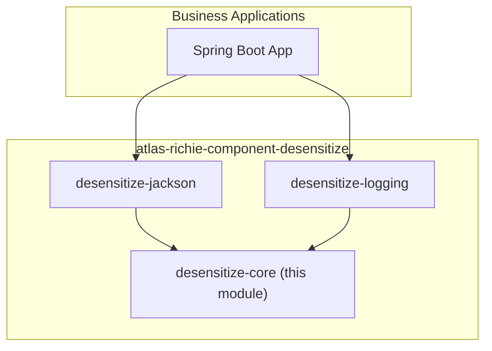

# Atlas Richie Desensitize Core (atlas-richie-component-desensitize-core)

> Pure-Java desensitization core: rules, strategies, registries, the `MaskingService` facade, the static `DesensitizeUtils`, and Spring Boot auto-configuration. No Web / Jackson dependencies — reusable in **any** JVM runtime and easy to unit-test.

This is the **foundation layer** of `atlas-richie-component-desensitize`. It is consumed by the `desensitize-jackson` and `desensitize-logging` modules, and can be used directly in business code via `DesensitizeUtils.mask(...)` / `DesensitizeUtils.toSafeJson(...)`.

---

## 📖 Contents

- [🎯 Purpose](#🎯-purpose)
- [🏗️ Module Position](#🏗️-module-position)
- [🧠 Design Philosophy](#🧠-design-philosophy)
- [📦 Key Classes](#📦-key-classes)
- [⚙️ Configuration Reference](#⚙️-configuration-reference)
- [🚀 Quick Start](#🚀-quick-start)
  - [1. Add dependency](#1-add-dependency)
  - [2. (Optional) Configure](#2-optional-configure)
  - [3. Inject or call statically](#3-inject-or-call-statically)
- [🧪 Usage Examples & Effects](#🧪-usage-examples-&-effects)
  - [A. Scalar masking](#a-scalar-masking)
  - [B. Explicit scene](#b-explicit-scene)
  - [C. Map masking (case-insensitive key lookup)](#c-map-masking-case-insensitive-key-lookup)
  - [D. Bean → safe JSON](#d-bean-→-safe-json)
  - [E. Map → safe string](#e-map-→-safe-string)
- [🔌 Extension Points](#🔌-extension-points)
  - [1. Register a custom strategy](#1-register-a-custom-strategy)
  - [2. Replace the permission evaluator](#2-replace-the-permission-evaluator)
  - [3. Add a custom `MaskType`](#3-add-a-custom-masktype)
- [🧩 Integration with Other Modules](#🧩-integration-with-other-modules)
- [📐 Built-in Strategies](#📐-built-in-strategies)
- [🛡️ Permission Bypass](#🛡️-permission-bypass)
- [📚 Further Reading](#📚-further-reading)
---

## 🎯 Purpose

| Concern | How core solves it |
|---------|--------------------|
| Single source of truth for masking rules | `MaskRuleRegistry` merges YAML fields + `@Sensitive` annotations into one view |
| Multiple scenes (API / LOG / AUDIT / EXCEPTION) | `MaskScene` enum + per-scene `sensitive-keys` overrides |
| Multiple data shapes (String / Map / Bean / Collection) | `MaskingService` (scalar + Map), `ObjectMaskingService` (Bean / Collection via reflection) |
| Extensibility | SPI `MaskingStrategy` + `MaskType.CUSTOM` |
| Testability | No Spring required for the model & strategy layers |
| Static-callable API for any code path | `DesensitizeUtils.mask` / `toSafeJson` / `toSafeString` |

## 🏗️ Module Position



You can depend on `desensitize-core` alone if you only need programmatic / log-safe desensitization (no Jackson serialization hooks). Add `desensitize-jackson` for REST API egress; add `desensitize-logging` for Logback `ConversionRule` / TurboFilter hooks.

## 🧠 Design Philosophy

1. **Pure-Java core, zero infrastructure coupling.** The core has no Spring Web, no Jackson, no SLF4J on the classpath. Models and strategies are plain POJOs that can be exercised in a unit test in milliseconds.
2. **Three orthogonal axes: Type × Scene × Rule.**
   - **Type** (`MaskType`) — what kind of data (PHONE, ID_CARD, EMAIL, ...).
   - **Scene** (`MaskScene`) — where the data is leaving the system (API_RESPONSE / LOG / AUDIT / EXCEPTION).
   - **Rule** (`MaskRule`) — concrete masking parameters (keep-left, keep-right, mask-char, custom-strategy).
3. **Static facade backed by Spring beans.** `DesensitizeUtils` keeps a `volatile` reference to the Spring-managed `MaskingService`, so business code can call `DesensitizeUtils.mask(...)` from anywhere without injecting a bean — while still benefiting from Spring lifecycle, configuration, and tests.
4. **Annotation first, configuration second.** `@Sensitive` on a Bean field is the recommended API-side declaration. YAML `fields` and `sensitive-keys` cover edge cases (third-party DTOs, dynamic keys).
5. **Permission bypass is an *exception*, not a default.** `MaskPermissionEvaluator` lets you opt into "admins see plaintext" while keeping everyone else masked.

## 📦 Key Classes

| Package | Type | Responsibility |
|---------|------|---------------|
| `model` | `MaskType` | `PHONE` / `ID_CARD` / `EMAIL` / `BANK_CARD` / `NAME` / `ADDRESS` / `PASSWORD` / `CUSTOM` |
| `model` | `MaskScene` | `API_RESPONSE` / `LOG` / `AUDIT` / `EXCEPTION` |
| `model` | `MaskRule` | `type`, `keepLeft`, `keepRight`, `maskChar`, `customStrategy`; provides `defaultKeepLeft/Right` |
| `model` | `MaskContext` | record `(scene, fieldName, declaringClass, roles)`; `withRoles(...)` |
| `annotation` | `@Sensitive` | field-level declaration: `type`, `scenes`, `customStrategy` |
| `support` | `SensitiveLogArg` | `record(value, type)` wrapper for SLF4J parameters; factory methods per type |
| `strategy` | `MaskingStrategy` | SPI: `supports(MaskType)` + `mask(raw, rule)` |
| `strategy` | `AbstractKeepEdgeMaskingStrategy` | common "keep N left + keep N right" algorithm |
| `strategy` | `*MaskingStrategy` | built-ins: `Phone`, `IdCard`, `BankCard`, `Name`, `Address`, `Password`, `Email` |
| `strategy` | `MaskingStrategyRegistry` | SPI loader: indexes strategies by `supports` |
| `registry` | `MaskRuleRegistry` | resolves a field's `MaskType` from `@Sensitive` → YAML `fields`; builds `MaskRule` from `type-rules` |
| `registry` | `SensitiveKeyRegistry` | resolves Map key → `MaskType` with global + per-scene overrides (case-insensitive) |
| `service` | `MaskingService` | `mask(String, MaskType[, MaskScene])` and `maskMap(Map[, MaskScene])` |
| `service` | `DefaultMaskingService` | default impl; honors global toggle, scene toggle, permission evaluator |
| `service` | `ObjectMaskingService` | `toSafeJson(Object)`, `toSafeString(Map)` for Bean / Map / Collection |
| `service` | `DefaultObjectMaskingService` | default impl backed by reflection-based `SafeLogSerializer` |
| `serializer` | `SafeLogSerializer` | pure-Java recursive serializer producing JSON-like strings; honors `@Sensitive` and `sensitive-keys`; MAX_DEPTH = 8 |
| `permission` | `MaskPermissionEvaluator` | `@FunctionalInterface boolean shouldMask(MaskContext)` |
| `permission` | `DefaultMaskPermissionEvaluator` | returns `true` unless `permission.enabled` AND current role is in `plainTextRoles` |
| `util` | `DesensitizeUtils` | **static facade** — entry point for application code |
| `config` | `DesensitizeProperties` | `@ConfigurationProperties("platform.component.desensitize")` |
| `config` | `DesensitizeAutoConfiguration` | registers `MaskingService`, `MaskRuleRegistry`, `SensitiveKeyRegistry`, `MaskingStrategyRegistry`, `MaskPermissionEvaluator`, `SafeLogSerializer`, `ObjectMaskingService`, `DesensitizeUtilsInitializer` |

## ⚙️ Configuration Reference

`DesensitizeProperties` is bound to `platform.component.desensitize.*`.

| Property | Type | Default | Description |
|----------|------|---------|-------------|
| `enabled` | `boolean` | `true` | Global on/off. `false` short-circuits all masking (returns original). |
| `default-mask-char` | `char` | `*` | Default mask character for all rules. |
| `scenes.api-response` | `boolean` | `true` | API scene toggle. |
| `scenes.log` | `boolean` | `true` | LOG scene toggle. |
| `scenes.audit` | `boolean` | `true` | AUDIT scene toggle. |
| `scenes.exception` | `boolean` | `true` | EXCEPTION scene toggle. |
| `permission.enabled` | `boolean` | `false` | When `true`, look at `plainTextRoles` to bypass masking. |
| `permission.plainTextRoles` | `Set<String>` | `[]` | Roles that see plaintext when `permission.enabled=true`. |
| `sensitive-keys` | `Map<String, MaskType>` | `{}` | Global key-name → type. Used for API-returned `Map` and log `Map`. Case-insensitive. |
| `type-rules.<TYPE>.keepLeft` | `Integer` | per-type default | Override default left retention (e.g. `PHONE → 3`). |
| `type-rules.<TYPE>.keepRight` | `Integer` | per-type default | Override default right retention (e.g. `PHONE → 4`). |
| `type-rules.<TYPE>.maskChar` | `Character` | `default-mask-char` | Per-type mask character override. |
| `fields.<FQN>.<field>` | `MaskType` | `{}` | Class-name + field-name fallback when no `@Sensitive` annotation is present. |
| `api-response.sensitive-keys` | `Map<String, MaskType>` | `{}` | Scene override (merged on top of global). |
| `log.sensitive-keys` | `Map<String, MaskType>` | `{}` | LOG/AUDIT scene override (also used by logging module). |
| `log-regex-fallback.enabled` | `boolean` | `false` | (Used by future regex fallback path) |
| `log-regex-fallback.rules` | `Map<MaskType, String>` | `{}` | Regex patterns per type. |
| `exception-regex-fallback.enabled` | `boolean` | `false` | (Used by future exception fallback path) |
| `exception-regex-fallback.rules` | `Map<MaskType, String>` | `{}` | Regex patterns per type. |

Minimal example:

```yaml
platform:
  component:
    desensitize:
      enabled: true
      default-mask-char: "*"
      scenes:
        api-response: true
        log: true
        audit: true
        exception: true
      sensitive-keys:
        phone: PHONE
        mobile: PHONE
        idCard: ID_CARD
        id_card: ID_CARD
        bankCard: BANK_CARD
        email: EMAIL
      type-rules:
        PHONE:
          keep-left: 3
          keep-right: 4
        ID_CARD:
          keep-left: 6
          keep-right: 4
        EMAIL:
          mask-char: "#"
      fields:
        com.example.api.UserVO:
          phone: PHONE
          idCard: ID_CARD
      permission:
        enabled: false
        plain-text-roles: []
      log:
        sensitive-keys: {}
```

## 🚀 Quick Start

### 1. Add dependency

```xml
<dependencies>
    <dependency>
        <groupId>com.richie.component</groupId>
        <artifactId>atlas-richie-component-desensitize-core</artifactId>
    </dependency>
</dependencies>
```

(`atlas-richie-component-desensitize-core` is automatically registered with Spring Boot auto-configuration through `META-INF/spring/org.springframework.boot.autoconfigure.AutoConfiguration.imports`.)

### 2. (Optional) Configure

Add the YAML from the section above to `application.yml`.

### 3. Inject or call statically

```java
@Service
@RequiredArgsConstructor
public class UserService {

    private final MaskingService maskingService;

    public String showPhone(String phone) {
        // Scene defaults to LOG; switch to API_RESPONSE if you need API semantics.
        return maskingService.mask(phone, MaskType.PHONE, MaskScene.API_RESPONSE);
    }
}
```

Or call the static facade directly (e.g. inside a `toString`, a mapper, or a logger call):

```java
String masked = DesensitizeUtils.mask("13812348000", MaskType.PHONE);
// -> 138****8000
```

## 🧪 Usage Examples & Effects

### A. Scalar masking

```java
DesensitizeUtils.mask("13812348000", MaskType.PHONE);
// -> "138****8000"

DesensitizeUtils.mask("110101199001011234", MaskType.ID_CARD);
// -> "110101********1234"

DesensitizeUtils.mask("6222021234567890", MaskType.BANK_CARD);
// -> "6222***********7890"

DesensitizeUtils.mask("zhangsan@example.com", MaskType.EMAIL);
// -> "z***@example.com"

DesensitizeUtils.mask("ZhangSan", MaskType.NAME);
// -> "Z*****"

DesensitizeUtils.mask("Beijing Chaoyang Wangjing...", MaskType.ADDRESS);
// -> "Beijing***************"

DesensitizeUtils.mask("supersecret", MaskType.PASSWORD);
// -> "***********"
```

### B. Explicit scene

```java
DesensitizeUtils.mask("13812348000", MaskType.PHONE, MaskScene.API_RESPONSE);
DesensitizeUtils.mask("13812348000", MaskType.PHONE, MaskScene.LOG);
DesensitizeUtils.mask("13812348000", MaskType.PHONE, MaskScene.AUDIT);
DesensitizeUtils.mask("13812348000", MaskType.PHONE, MaskScene.EXCEPTION);
```

If the scene is disabled via `scenes.<scene>: false`, the call returns the original string.

### C. Map masking (case-insensitive key lookup)

With global config:

```yaml
platform:
  component:
    desensitize:
      sensitive-keys:
        phone: PHONE
        idCard: ID_CARD
```

```java
Map<String, Object> row = Map.of(
        "Phone",   "13812348000",
        "idcard",  "110101199001011234",
        "orderId", "O-1"
);

DesensitizeUtils.maskMap(row, MaskScene.LOG);
// -> {"Phone":"138****8000","idcard":"110101********1234","orderId":"O-1"}
```

Nested `Map` values are processed recursively; non-String values are passed through.

### D. Bean → safe JSON

```java
public class UserVO {
    @Sensitive(type = MaskType.PHONE, scenes = {MaskScene.API_RESPONSE, MaskScene.LOG})
    private String phone;

    @Sensitive(type = MaskType.ID_CARD)
    private String idCard;
}

UserVO user = new UserVO();
user.setPhone("13812348000");
user.setIdCard("110101199001011234");

DesensitizeUtils.toSafeJson(user);
// -> {"phone":"138****8000","idCard":"110101********1234"}
```

`toSafeJson` uses reflection (no Jackson needed). It walks the class hierarchy, respects `@Sensitive.scenes()`, and applies `MaskType` resolution through `MaskRuleRegistry`.

### E. Map → safe string

```java
Map<String, Object> row = Map.of("phone", "13812348000", "name", "Alice");
DesensitizeUtils.toSafeString(row);
// -> {"phone":"138****8000","name":"Alice"}
```

## 🔌 Extension Points

### 1. Register a custom strategy

```java
@Component
public class OrderIdMaskingStrategy implements MaskingStrategy {
    @Override
    public boolean supports(MaskType type) {
        return type == MaskType.CUSTOM;
    }
    @Override
    public String mask(String raw, MaskRule rule) {
        // Keep prefix and last 3 digits
        if (raw == null || raw.length() < 6) return "****";
        return raw.substring(0, 2) + "***" + raw.substring(raw.length() - 3);
    }
}
```

Pair it with a custom rule via `@Sensitive(type = MaskType.CUSTOM, customStrategy = "...")`. (The lookup chain is planned in V2; for now route by `MaskType.CUSTOM` and read parameters from `rule.customStrategy()`.)

### 2. Replace the permission evaluator

```java
@Component
@Primary
public class RoleAwareMaskPermissionEvaluator implements MaskPermissionEvaluator {
    @Override
    public boolean shouldMask(MaskContext context) {
        // Pull roles from Spring Security, tenant context, etc.
        Set<String> roles = currentRoles();
        return !roles.contains("ROLE_AUDIT_PLAINTEXT");
    }
}
```

The default `DefaultMaskPermissionEvaluator` returns `true` (i.e. "should mask") unless `permission.enabled=true` and a role in `plainTextRoles` is present.

### 3. Add a custom `MaskType`

`MaskType` is an enum. To extend without modifying core, use `MaskType.CUSTOM` and dispatch on `rule.customStrategy()` inside your strategy.

## 🧩 Integration with Other Modules

| Consumer | What it gets from core |
|----------|------------------------|
| `desensitize-jackson` | `MaskingService`, `SensitiveKeyRegistry`, `@Sensitive` annotation, `MaskScene` |
| `desensitize-logging` | `DesensitizeUtils`, `SensitiveLogArg`, `MaskScene`, `sensitive-keys` |
| Application code | `DesensitizeUtils` static facade for log + debug output |

## 📐 Built-in Strategies

| `MaskType` | Algorithm | Default keep | Example in → out |
|------------|-----------|--------------|------------------|
| `PHONE` | keep edge | 3 + 4 | `13812348000` → `138****8000` |
| `ID_CARD` | keep edge | 6 + 4 | `110101199001011234` → `110101********1234` |
| `BANK_CARD` | keep edge | 4 + 4 | `6222021234567890` → `6222***********7890` |
| `EMAIL` | keep first local char | 1 + 0 | `zhangsan@example.com` → `z***@example.com` |
| `NAME` | keep edge | 1 + 0 | `ZhangSan` → `Z*****` |
| `ADDRESS` | keep edge | 6 + 0 | `北京市朝阳区望京东路四号` → `北京市朝******` |
| `PASSWORD` | full mask | 0 + 0 | `supersecret` → `***********` |
| `CUSTOM` | (no built-in; bring your own) | 0 + 0 | – |

`AbstractKeepEdgeMaskingStrategy.mask` is shared by `PHONE` / `ID_CARD` / `BANK_CARD` / `NAME` / `ADDRESS`. If `keepLeft + keepRight >= raw.length()`, the entire string is replaced with the mask char (i.e. fully masked).

## 🛡️ Permission Bypass

```yaml
platform:
  component:
    desensitize:
      permission:
        enabled: true
        plain-text-roles:
          - ROLE_SELF_PROFILE
          - ROLE_AUDIT_PLAINTEXT
```

When enabled, calls carrying a `MaskContext` whose roles intersect `plain-text-roles` return the **original** string. Use this to allow "user viewing own profile" or "auditor viewing plaintext with audit trail" without disabling the scene entirely.

Programmatic usage:

```java
MaskContext ctx = MaskContext.of(MaskScene.API_RESPONSE, "phone", UserVO.class)
        .withRoles(currentUserRoles());
maskingService.mask("13812348000", ctx, MaskType.PHONE);
```

## 📚 Further Reading

- **Parent component**: [`../README.md`](../README.md) — overall design, sequence diagrams, configuration model.
- **Jackson integration**: [`../atlas-richie-component-desensitize-jackson/README.md`](../atlas-richie-component-desensitize-jackson/README.md) — `@Sensitive` + `Map` desensitization for REST responses.
- **Logging integration**: [`../atlas-richie-component-desensitize-logging/README.md`](../atlas-richie-component-desensitize-logging/README.md) — Logback `ConversionRule` / TurboFilter hooks.