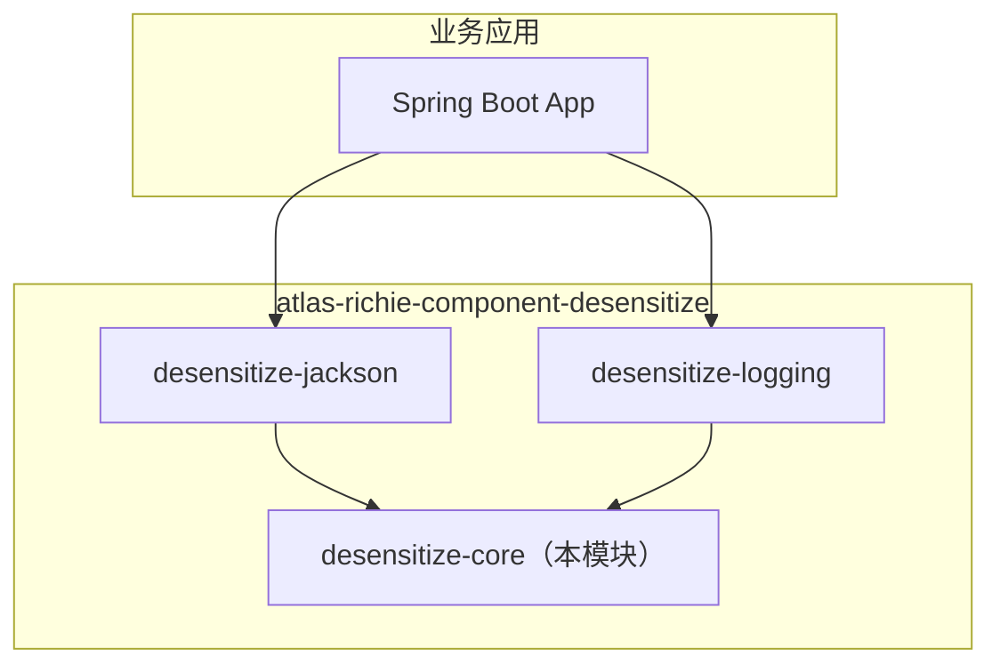

# Atlas Richie 脱敏 Core (atlas-richie-component-desensitize-core)

> 纯 Java 脱敏内核：规则、策略、注册表、`MaskingService` 统一门面、静态工具类 `DesensitizeUtils`、Spring Boot 自动装配。**不依赖 Web / Jackson**，可在任意 JVM 运行时复用，单元测试零成本。

本模块是 `atlas-richie-component-desensitize` 的**基础层**，被 `desensitize-jackson`、`desensitize-logging` 引用，业务代码也可直接通过 `DesensitizeUtils.mask(...)` / `toSafeJson(...)` 调用。

---

## 📖 目录

- [🎯 子组件作用](#🎯-子组件作用)
- [🏗️ 模块定位](#🏗️-模块定位)
- [🧠 设计思路](#🧠-设计思路)
- [📦 关键对象](#📦-关键对象)
- [⚙️ 配置参考](#⚙️-配置参考)
- [🚀 快速开始](#🚀-快速开始)
  - [1. 添加依赖](#1-添加依赖)
  - [2. （可选）补充配置](#2-（可选）补充配置)
  - [3. 注入服务 或 调用静态门面](#3-注入服务-或-调用静态门面)
- [🧪 使用示例与效果](#🧪-使用示例与效果)
  - [A. 标量脱敏](#a-标量脱敏)
  - [B. 指定场景](#b-指定场景)
  - [C. Map 脱敏（key 大小写不敏感）](#c-map-脱敏（key-大小写不敏感）)
  - [D. Bean → 安全 JSON](#d-bean-→-安全-json)
  - [E. Map → 安全字符串](#e-map-→-安全字符串)
- [🔌 扩展点](#🔌-扩展点)
  - [1. 注册自定义策略](#1-注册自定义策略)
  - [2. 替换权限评估器](#2-替换权限评估器)
  - [3. 扩展 MaskType](#3-扩展-masktype)
- [🧩 与其他子模块的协作](#🧩-与其他子模块的协作)
- [📐 内置策略](#📐-内置策略)
- [🛡️ 权限豁免](#🛡️-权限豁免)
- [📚 相关文档](#📚-相关文档)
---

## 🎯 子组件作用

`desensitize-core` 是脱敏组件的**能力底座**，不绑定任何具体场景：

| 关注点 | core 如何解决 |
|--------|---------------|
| 脱敏规则的唯一来源 | `MaskRuleRegistry` 合并 YAML `fields` 与 `@Sensitive` 注解 |
| 多场景出口（API/日志/审计/异常） | `MaskScene` 枚举 + 分场景 `sensitive-keys` 覆盖 |
| 多数据形态（String/Map/Bean/集合） | `MaskingService`（标量+Map）、`ObjectMaskingService`（Bean/集合，反射） |
| 可扩展性 | SPI `MaskingStrategy` + `MaskType.CUSTOM` |
| 可测试性 | 模型与策略层不依赖 Spring，毫秒级单测 |
| 业务代码随处可用 | `DesensitizeUtils.mask` / `toSafeJson` / `toSafeString` 静态门面 |

## 🏗️ 模块定位



- 只需要**程序化脱敏 / 日志脱敏**：单独引入 `desensitize-core` 即可。
- 需要 **REST 接口返回值脱敏**：再加 `desensitize-jackson`。
- 需要 **Logback 输出脱敏**：再加 `desensitize-logging`。

## 🧠 设计思路

1. **纯 Java 内核，零基础设施耦合。** core 不依赖 Spring Web、Jackson、SLF4J。模型和策略都是普通 POJO，可直接 `new` 出来跑单测。
2. **三个正交维度：Type × Scene × Rule。**
   - **Type**（`MaskType`）—— 数据的种类（PHONE / ID_CARD / EMAIL …）。
   - **Scene**（`MaskScene`）—— 数据离开系统的出口（API_RESPONSE / LOG / AUDIT / EXCEPTION）。
   - **Rule**（`MaskRule`）—— 具体的脱敏参数（保留位数、掩码字符、自定义策略）。
3. **静态门面 + Spring 后端。** `DesensitizeUtils` 用 `volatile` 引用 Spring 容器中的 `MaskingService`，业务代码无需注入也能调用，同时享受 Spring 生命周期、配置与单测支持。
4. **注解优先，配置兜底。** API 侧推荐用 `@Sensitive` 注解；YAML `fields` 与 `sensitive-keys` 解决三方 DTO、动态键等边界场景。
5. **权限豁免是“特例”，不是默认。** `MaskPermissionEvaluator` 让"管理员看明文"成为一种显式能力，而不是默认行为。

## 📦 关键对象

| 包 | 类型 | 职责 |
|---|---|---|
| `model` | `MaskType` | `PHONE` / `ID_CARD` / `EMAIL` / `BANK_CARD` / `NAME` / `ADDRESS` / `PASSWORD` / `CUSTOM` |
| `model` | `MaskScene` | `API_RESPONSE` / `LOG` / `AUDIT` / `EXCEPTION` |
| `model` | `MaskRule` | `type`, `keepLeft`, `keepRight`, `maskChar`, `customStrategy`；提供默认左右保留位 |
| `model` | `MaskContext` | record `(scene, fieldName, declaringClass, roles)`；`withRoles(...)` 附加角色 |
| `annotation` | `@Sensitive` | 字段注解：`type`, `scenes`, `customStrategy` |
| `support` | `SensitiveLogArg` | `record(value, type)` 日志参数包装；提供 phone/idCard/email 等工厂方法 |
| `strategy` | `MaskingStrategy` | SPI：`supports(MaskType)` + `mask(raw, rule)` |
| `strategy` | `AbstractKeepEdgeMaskingStrategy` | 通用"左右保留"算法 |
| `strategy` | `*MaskingStrategy` | 内置：Phone / IdCard / BankCard / Name / Address / Password / Email |
| `strategy` | `MaskingStrategyRegistry` | SPI 加载器：按 `supports` 索引 |
| `registry` | `MaskRuleRegistry` | 解析字段脱敏类型：`@Sensitive` → YAML `fields`；按 `type-rules` 构造 `MaskRule` |
| `registry` | `SensitiveKeyRegistry` | 解析 Map key → `MaskType`，支持全局 + 分场景覆盖（大小写不敏感） |
| `service` | `MaskingService` | 字符串 `mask` 和 `maskMap` 接口 |
| `service` | `DefaultMaskingService` | 默认实现，遵循总开关 / 场景开关 / 权限评估器 |
| `service` | `ObjectMaskingService` | `toSafeJson(Object)`、`toSafeString(Map)`，面向 Bean / Map / 集合 |
| `service` | `DefaultObjectMaskingService` | 默认实现，内部走反射的 `SafeLogSerializer` |
| `serializer` | `SafeLogSerializer` | 纯 Java 递归 JSON 风格序列化，识别 `@Sensitive` 与 `sensitive-keys`，最大深度 8 |
| `permission` | `MaskPermissionEvaluator` | `@FunctionalInterface boolean shouldMask(MaskContext)` |
| `permission` | `DefaultMaskPermissionEvaluator` | 默认：未启用权限 → 始终脱敏；启用后命中明文角色 → 跳过 |
| `util` | `DesensitizeUtils` | **静态门面**，业务代码的统一入口 |
| `config` | `DesensitizeProperties` | `@ConfigurationProperties("platform.component.desensitize")` |
| `config` | `DesensitizeAutoConfiguration` | 注册所有上述核心 Bean + `DesensitizeUtilsInitializer`（将 Spring Bean 绑定到静态门面） |

## ⚙️ 配置参考

`DesensitizeProperties` 绑定到 `platform.component.desensitize.*`：

| 配置项 | 类型 | 默认值 | 说明 |
|--------|------|--------|------|
| `enabled` | `boolean` | `true` | 总开关，`false` 时全部返回原文 |
| `default-mask-char` | `char` | `*` | 全局默认掩码字符 |
| `scenes.api-response` | `boolean` | `true` | API 场景开关 |
| `scenes.log` | `boolean` | `true` | LOG 场景开关 |
| `scenes.audit` | `boolean` | `true` | AUDIT 场景开关 |
| `scenes.exception` | `boolean` | `true` | EXCEPTION 场景开关 |
| `permission.enabled` | `boolean` | `false` | 是否启用角色豁免 |
| `permission.plainTextRoles` | `Set<String>` | `[]` | 命中这些角色可看明文（仅 `enabled=true` 时生效） |
| `sensitive-keys` | `Map<String, MaskType>` | `{}` | 全局 key 名 → 类型，用于 API 返回 Map 和日志 Map；**大小写不敏感** |
| `type-rules.<TYPE>.keepLeft` | `Integer` | 类型默认 | 覆盖默认左保留位数（如 PHONE 默认 3） |
| `type-rules.<TYPE>.keepRight` | `Integer` | 类型默认 | 覆盖默认右保留位数（如 PHONE 默认 4） |
| `type-rules.<TYPE>.maskChar` | `Character` | `default-mask-char` | 类型专属掩码字符 |
| `fields.<类全限定名>.<字段>` | `MaskType` | `{}` | 当字段未标注 `@Sensitive` 时的兜底配置 |
| `api-response.sensitive-keys` | `Map<String, MaskType>` | `{}` | API 场景的覆盖（在全局之上合并） |
| `log.sensitive-keys` | `Map<String, MaskType>` | `{}` | LOG/AUDIT 场景的覆盖（同时被 logging 模块使用） |
| `log-regex-fallback.enabled` | `boolean` | `false` | 预留：日志正则兜底 |
| `log-regex-fallback.rules` | `Map<MaskType, String>` | `{}` | 预留：每类正则表达式 |
| `exception-regex-fallback.enabled` | `boolean` | `false` | 预留：异常正则兜底 |
| `exception-regex-fallback.rules` | `Map<MaskType, String>` | `{}` | 预留：每类正则表达式 |

最小示例：

```yaml
platform:
  component:
    desensitize:
      enabled: true
      default-mask-char: "*"
      scenes:
        api-response: true
        log: true
        audit: true
        exception: true
      sensitive-keys:
        phone: PHONE
        mobile: PHONE
        idCard: ID_CARD
        id_card: ID_CARD
        bankCard: BANK_CARD
        email: EMAIL
      type-rules:
        PHONE:
          keep-left: 3
          keep-right: 4
        ID_CARD:
          keep-left: 6
          keep-right: 4
        EMAIL:
          mask-char: "#"
      fields:
        com.example.api.UserVO:
          phone: PHONE
          idCard: ID_CARD
      permission:
        enabled: false
        plain-text-roles: []
      log:
        sensitive-keys: {}
```

## 🚀 快速开始

### 1. 添加依赖

```xml
<dependencies>
    <dependency>
        <groupId>com.richie.component</groupId>
        <artifactId>atlas-richie-component-desensitize-core</artifactId>
    </dependency>
</dependencies>
```

Spring Boot 自动配置通过 `META-INF/spring/org.springframework.boot.autoconfigure.AutoConfiguration.imports` 自动加载，无需额外配置。

### 2. （可选）补充配置

将上面的 YAML 加入 `application.yml`。

### 3. 注入服务 或 调用静态门面

```java
@Service
@RequiredArgsConstructor
public class UserService {

    private final MaskingService maskingService;

    public String showPhone(String phone) {
        // 不指定 scene 时默认 LOG；如需 API 语义请显式传 MaskScene.API_RESPONSE
        return maskingService.mask(phone, MaskType.PHONE, MaskScene.API_RESPONSE);
    }
}
```

或在 `toString`、Mapper、Logger 中直接调用静态门面：

```java
String masked = DesensitizeUtils.mask("13812348000", MaskType.PHONE);
// -> 138****8000
```

## 🧪 使用示例与效果

### A. 标量脱敏

```java
DesensitizeUtils.mask("13812348000", MaskType.PHONE);
// -> "138****8000"

DesensitizeUtils.mask("110101199001011234", MaskType.ID_CARD);
// -> "110101********1234"

DesensitizeUtils.mask("6222021234567890", MaskType.BANK_CARD);
// -> "6222***********7890"

DesensitizeUtils.mask("zhangsan@example.com", MaskType.EMAIL);
// -> "z***@example.com"

DesensitizeUtils.mask("ZhangSan", MaskType.NAME);
// -> "Z*****"

DesensitizeUtils.mask("北京市朝阳区望京东路四号", MaskType.ADDRESS);
// -> "北京市朝******"

DesensitizeUtils.mask("supersecret", MaskType.PASSWORD);
// -> "***********"
```

### B. 指定场景

```java
DesensitizeUtils.mask("13812348000", MaskType.PHONE, MaskScene.API_RESPONSE);
DesensitizeUtils.mask("13812348000", MaskType.PHONE, MaskScene.LOG);
DesensitizeUtils.mask("13812348000", MaskType.PHONE, MaskScene.AUDIT);
DesensitizeUtils.mask("13812348000", MaskType.PHONE, MaskScene.EXCEPTION);
```

若通过 `scenes.<scene>: false` 关闭了对应场景，则直接返回原文。

### C. Map 脱敏（key 大小写不敏感）

全局配置：

```yaml
platform:
  component:
    desensitize:
      sensitive-keys:
        phone: PHONE
        idCard: ID_CARD
```

```java
Map<String, Object> row = Map.of(
        "Phone",   "13812348000",
        "idcard",  "110101199001011234",
        "orderId", "O-1"
);

DesensitizeUtils.maskMap(row, MaskScene.LOG);
// -> {"Phone":"138****8000","idcard":"110101********1234","orderId":"O-1"}
```

嵌套 Map 会递归处理；非 String 值保持原样。

### D. Bean → 安全 JSON

```java
public class UserVO {
    @Sensitive(type = MaskType.PHONE, scenes = {MaskScene.API_RESPONSE, MaskScene.LOG})
    private String phone;

    @Sensitive(type = MaskType.ID_CARD)
    private String idCard;
}

UserVO user = new UserVO();
user.setPhone("13812348000");
user.setIdCard("110101199001011234");

DesensitizeUtils.toSafeJson(user);
// -> {"phone":"138****8000","idCard":"110101********1234"}
```

`toSafeJson` 基于反射（不依赖 Jackson），遍历类层级，遵循 `@Sensitive.scenes()`，并通过 `MaskRuleRegistry` 解析 `MaskType`。

### E. Map → 安全字符串

```java
Map<String, Object> row = Map.of("phone", "13812348000", "name", "Alice");
DesensitizeUtils.toSafeString(row);
// -> {"phone":"138****8000","name":"Alice"}
```

## 🔌 扩展点

### 1. 注册自定义策略

```java
@Component
public class OrderIdMaskingStrategy implements MaskingStrategy {
    @Override
    public boolean supports(MaskType type) {
        return type == MaskType.CUSTOM;
    }
    @Override
    public String mask(String raw, MaskRule rule) {
        if (raw == null || raw.length() < 6) return "****";
        return raw.substring(0, 2) + "***" + raw.substring(raw.length() - 3);
    }
}
```

配合 `@Sensitive(type = MaskType.CUSTOM, customStrategy = "...")` 使用。当前 `MaskType` 是枚举，请用 `CUSTOM` 承载扩展点，并在 `rule.customStrategy()` 中读取参数。

### 2. 替换权限评估器

```java
@Component
@Primary
public class RoleAwareMaskPermissionEvaluator implements MaskPermissionEvaluator {
    @Override
    public boolean shouldMask(MaskContext context) {
        // 从 Spring Security / 租户上下文等读取角色
        Set<String> roles = currentRoles();
        return !roles.contains("ROLE_AUDIT_PLAINTEXT");
    }
}
```

默认实现 `DefaultMaskPermissionEvaluator` 在 `permission.enabled=false` 时**总是脱敏**；启用后只有命中 `plainTextRoles` 才返回明文。

### 3. 扩展 MaskType

如需新增枚举类型，建议在自有业务模块定义常量并用 `MaskType.CUSTOM` + 自定义策略承载。

## 🧩 与其他子模块的协作

| 上游消费者 | 从 core 获取 |
|-----------|-------------|
| `desensitize-jackson` | `MaskingService` / `SensitiveKeyRegistry` / `@Sensitive` 注解 / `MaskScene` |
| `desensitize-logging` | `DesensitizeUtils` / `SensitiveLogArg` / `MaskScene` / `sensitive-keys` |
| 业务代码 | 静态门面 `DesensitizeUtils`，便于日志、调试、Mapper 等场景 |

## 📐 内置策略

| `MaskType` | 算法 | 默认保留位 | 示例 |
|------------|------|----------|------|
| `PHONE` | 左右保留 | 3 + 4 | `13812348000` → `138****8000` |
| `ID_CARD` | 左右保留 | 6 + 4 | `110101199001011234` → `110101********1234` |
| `BANK_CARD` | 左右保留 | 4 + 4 | `6222021234567890` → `6222***********7890` |
| `EMAIL` | 本地部分保首字符 | 1 + 0 | `zhangsan@example.com` → `z***@example.com` |
| `NAME` | 左右保留 | 1 + 0 | `ZhangSan` → `Z*****` |
| `ADDRESS` | 左右保留 | 6 + 0 | `北京市朝阳区望京东路四号` → `北京市朝******` |
| `PASSWORD` | 全掩码 | 0 + 0 | `supersecret` → `***********` |
| `CUSTOM` | （无内置） | 0 + 0 | – |

`AbstractKeepEdgeMaskingStrategy.mask` 被 `PHONE` / `ID_CARD` / `BANK_CARD` / `NAME` / `ADDRESS` 共用。当 `keepLeft + keepRight >= raw.length()` 时整串被掩码字符替换（即"全部掩码"）。

## 🛡️ 权限豁免

```yaml
platform:
  component:
    desensitize:
      permission:
        enabled: true
        plain-text-roles:
          - ROLE_SELF_PROFILE
          - ROLE_AUDIT_PLAINTEXT
```

开启后，携带角色的 `MaskContext` 只要命中 `plain-text-roles` 中任一角色就**返回原文**。用于"用户查看自己的资料"、"审计员带审计轨迹查看明文"等场景，避免关闭整个场景的脱敏能力。

编程式用法：

```java
MaskContext ctx = MaskContext.of(MaskScene.API_RESPONSE, "phone", UserVO.class)
        .withRoles(currentUserRoles());
maskingService.mask("13812348000", ctx, MaskType.PHONE);
```

## 📚 相关文档

- **父组件**：[`../README.zh.md`](../README.zh.md) — 整体设计、时序图、配置模型。
- **Jackson 集成**：[`../atlas-richie-component-desensitize-jackson/README.md`](../atlas-richie-component-desensitize-jackson/README.zh.md) — `@Sensitive` + Map 序列化，对外接口响应。
- **Logging 集成**：[`../atlas-richie-component-desensitize-logging/README.md`](../atlas-richie-component-desensitize-logging/README.zh.md) — Logback `ConversionRule` / TurboFilter，日志输出脱敏。