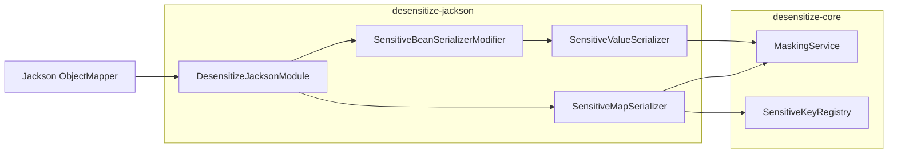

# Atlas Richie Desensitize Jackson (atlas-richie-component-desensitize-jackson)

> Jackson integration for the desensitization component. Auto-registers a `JacksonModule` that masks **String fields annotated with `@Sensitive`** and **Map values keyed by `sensitive-keys`** during JSON serialization — with **zero changes** to your business code. REST controllers using the platform's `JsonUtils` (or any standard Spring MVC `MappingJackson2HttpMessageConverter` on the classpath) pick up the masking automatically.

This module sits on top of [`desensitize-core`](../atlas-richie-component-desensitize-core/README.md) and is the **recommended way to apply desensitization at the API egress**.

---

## 📖 Contents

- [🎯 Purpose](#🎯-purpose)
- [🏗️ Module Position](#🏗️-module-position)
- [🧠 Design Philosophy](#🧠-design-philosophy)
- [📦 Key Classes](#📦-key-classes)
- [🚀 Quick Start](#🚀-quick-start)
  - [1. Add dependency](#1-add-dependency)
  - [2. Configure](#2-configure)
  - [3. Annotate your DTOs](#3-annotate-your-dtos)
  - [4. Return from a controller — no code change required](#4-return-from-a-controller-—-no-code-change-required)
- [🧪 Usage Examples & Effects](#🧪-usage-examples-&-effects)
  - [A. Annotated Bean field](#a-annotated-bean-field)
  - [B. Root `Map` return value](#b-root-map-return-value)
  - [C. Bean property of type `Map<String, Object>`](#c-bean-property-of-type-mapstring,-object)
  - [D. Nested Map](#d-nested-map)
  - [E. Programmatic fallback (dynamic keys)](#e-programmatic-fallback-dynamic-keys)
- [⚙️ Configuration Reference](#⚙️-configuration-reference)
- [🔌 Custom Module Wiring](#🔌-custom-module-wiring)
- [⚠️ Caveats](#⚠️-caveats)
- [📚 Further Reading](#📚-further-reading)
---

## 🎯 Purpose

| Concern | How this module solves it |
|---------|---------------------------|
| Bean field desensitization in JSON responses | `@Sensitive(type = ..., scenes = ...)` on String fields |
| `Map` (root or nested) desensitization in JSON responses | `sensitive-keys` config + `SensitiveMapSerializer` |
| Composability with existing `ObjectMapper` setups | Registers as a standard `tools.jackson.databind.JacksonModule` |
| Integration with the platform `JsonUtils` | Provides a `JsonUtilsModuleCustomizer` so `JsonUtils.getInstance().writeValueAsString(...)` also masks |

## 🏗️ Module Position



| Dependency | Notes |
|------------|-------|
| `atlas-richie-component-desensitize-core` | Provides `MaskingService` + `SensitiveKeyRegistry` + `@Sensitive` + `MaskScene` |
| `tools.jackson.core:jackson-databind` | Jackson 3 (the project's choice for Spring Boot 4.x) |

## 🧠 Design Philosophy

1. **Annotation + config, two complementary paths.** `@Sensitive` is the type-safe, review-friendly default for owned DTOs. `sensitive-keys` covers dynamic-keyed `Map` shapes (legacy interfaces, dynamic columns). They share the same `MaskingService` so rules never drift.
2. **Map keys are *semantics*, not values.** A value that *looks* like a phone number does not get masked just because of its shape — only because its **key** (or its **containing field's annotation**) says so. This eliminates false positives like `orderId = 13812348000`.
3. **`Sensitive` is the only authoritative scene for `API_RESPONSE`.** When `@Sensitive(scenes = {API_RESPONSE, LOG})` is declared on a String field, the Jackson serializer is bound at property-write time. The serializer carries the field/bean metadata into `MaskContext` so that `MaskPermissionEvaluator` can apply role-aware plaintext bypass per-field.
4. **Map-as-property is handled in the same serializer modifier.** `SensitiveBeanSerializerModifier` swaps the default Map serializer for `SensitiveMapSerializer` whenever a Bean property's type is `Map`. This is what makes `UserVO.extra: Map<String, Object>` safe even though the inner keys have no annotations.
5. **Module is composable.** Registered as a standard `JacksonModule` + a `JsonUtilsModuleCustomizer`. If your project uses the platform's `JsonUtils`, the masking works there too — without code changes.

## 📦 Key Classes

| Type | Responsibility |
|------|---------------|
| `@Sensitive` | Field annotation (provided by `core`); declares `MaskType`, `MaskScene[]`, optional `customStrategy`. |
| `DesensitizeJacksonModule` | `SimpleModule("desensitize-jackson")`; wires the `ValueSerializerModifier` and registers `SensitiveMapSerializer` for the API_RESPONSE scene. |
| `SensitiveBeanSerializerModifier` | `ValueSerializerModifier` that inspects each `BeanPropertyWriter`: if it carries `@Sensitive` and the raw type is `CharSequence`, bind `SensitiveValueSerializer`; if the type is `Map`, bind `SensitiveMapSerializer`. |
| `SensitiveValueSerializer` | `StdSerializer<String>` that calls `maskingService.mask(value, MaskContext.of(scene, fieldName, declaringClass), maskType)` on serialize. Supports `createContextual(...)` so property-level annotations override class-level defaults. |
| `SensitiveMapSerializer` | `StdSerializer<Map<?, ?>>` that walks every entry, resolves `MaskType` from `sensitiveKeyRegistry.resolve(key, API_RESPONSE)`, and masks String values. Recurses into nested `Map`. |
| `JacksonDesensitizeAutoConfiguration` | `@AutoConfiguration(after = DesensitizeAutoConfiguration.class)`, conditional on `JacksonModule` class + `MaskingService` bean. Registers `JacksonModule desensitizeJacksonModule(...)` and a `JsonUtilsModuleCustomizer` for `JsonUtils`. |

## 🚀 Quick Start

### 1. Add dependency

```xml
<dependencies>
    <dependency>
        <groupId>com.richie.component</groupId>
        <artifactId>atlas-richie-component-desensitize-core</artifactId>
    </dependency>
    <dependency>
        <groupId>com.richie.component</groupId>
        <artifactId>atlas-richie-component-desensitize-jackson</artifactId>
    </dependency>
</dependencies>
```

### 2. Configure

```yaml
platform:
  component:
    desensitize:
      enabled: true
      default-mask-char: "*"
      scenes:
        api-response: true
      sensitive-keys:
        phone: PHONE
        idCard: ID_CARD
        bankCard: BANK_CARD
        email: EMAIL
      type-rules:
        PHONE: { keep-left: 3, keep-right: 4 }
        ID_CARD: { keep-left: 6, keep-right: 4 }
      permission:
        enabled: false
        plain-text-roles: []
```

### 3. Annotate your DTOs

```java
public class UserVO {
    @Sensitive(type = MaskType.PHONE, scenes = {MaskScene.API_RESPONSE, MaskScene.LOG})
    private String phone;

    @Sensitive(type = MaskType.ID_CARD)
    private String idCard;

    @Sensitive(type = MaskType.EMAIL)
    private String email;

    // Map values keyed by sensitive keys will be masked automatically.
    private Map<String, Object> extra;
}
```

### 4. Return from a controller — no code change required

```java
@RestController
@RequestMapping("/api/user")
public class UserController {

    @GetMapping("/{id}")
    public UserVO get(@PathVariable String id) {
        UserVO vo = userService.load(id);
        vo.setExtra(Map.of("phone", "13812348000", "orderId", "O-1"));
        return vo;
    }
}
```

The HTTP response body is automatically masked by the registered Jackson serializers.

## 🧪 Usage Examples & Effects

### A. Annotated Bean field

```java
@GetMapping("/user/{id}")
public UserVO user(@PathVariable String id) {
    return userService.load(id);
}
```

```http
GET /api/user/u-1
```
```json
{
  "phone": "138****8000",
  "idCard": "110101********1234",
  "email": "z***@example.com",
  "name": "Alice"
}
```

### B. Root `Map` return value

```java
@GetMapping("/row")
public Map<String, Object> row() {
    return Map.of(
        "phone",   "13812348000",
        "orderId", "O-1",
        "idCard",  "110101199001011234"
    );
}
```

```json
{
  "phone": "138****8000",
  "orderId": "O-1",
  "idCard": "110101********1234"
}
```

`SensitiveMapSerializer` is registered as the root Map serializer; it iterates the entries and looks up each key in `SensitiveKeyRegistry` (case-insensitive).

### C. Bean property of type `Map<String, Object>`

```java
public class OrderVO {
    private String orderId;
    private Map<String, Object> attributes;  // <- masked
}
```

```http
GET /api/order/o-1
```
```json
{
  "orderId": "O-1",
  "attributes": {
    "phone": "138****8000",
    "amount": 100
  }
}
```

The `SensitiveBeanSerializerModifier` rebinds the `attributes` writer to `SensitiveMapSerializer`.

### D. Nested Map

```java
@GetMapping("/profile")
public Map<String, Object> profile() {
    return Map.of("user", Map.of("phone", "13812348000", "name", "Alice"));
}
```

```json
{
  "user": {
    "phone": "138****8000",
    "name": "Alice"
  }
}
```

`SensitiveMapSerializer` recurses one level; further nesting is preserved but values inside deeper maps are kept as POJOs (and so won't be masked). For deeper recursion use `DesensitizeUtils.maskMap(...)` programmatically and return the result.

### E. Programmatic fallback (dynamic keys)

If the key set is unbounded / unknown, use the core facade **before** returning — Jackson then writes the already-masked Map as-is:

```java
@GetMapping("/dynamic")
public Map<String, Object> dynamic() {
    Map<String, Object> raw = buildDynamicMap();
    return DesensitizeUtils.maskMap(raw, MaskScene.API_RESPONSE);
}
```

## ⚙️ Configuration Reference

| Property | Effect in this module |
|----------|-----------------------|
| `enabled=false` | `MaskingService.mask` returns original; serializers are still bound but no-ops. |
| `scenes.api-response=false` | API scene bypassed → original values emitted. |
| `permission.enabled=true` + role match | Returns plaintext for matching roles (auditor, self-profile). |
| `sensitive-keys.<key>: <TYPE>` | Drives `SensitiveMapSerializer` lookups. |
| `api-response.sensitive-keys` | Scene-level override on top of global. |
| `type-rules.<TYPE>.{keepLeft,keepRight,maskChar}` | Controls retention/mask character. |
| `fields.<FQN>.<field>: <TYPE>` | Optional Bean-field fallback when `@Sensitive` is missing. |

## 🔌 Custom Module Wiring

The module is auto-registered. If your app builds its own `ObjectMapper`:

```java
@Bean
public JacksonModule desensitizeJacksonModule(MaskingService maskingService, SensitiveKeyRegistry sensitiveKeyRegistry) {
    return new DesensitizeJacksonModule(maskingService, sensitiveKeyRegistry);
}
```

The `JsonUtilsModuleCustomizer` from `JacksonDesensitizeAutoConfiguration` automatically plugs the module into the platform `JsonUtils`, so `JsonUtils.getInstance().writeValueAsString(...)` also masks — including outbound HTTP client logs that go through `JsonUtils`.

## ⚠️ Caveats

1. **Map values that are non-String are emitted as POJOs.** If a sensitive value happens to be a `Long` or `LocalDate`, it is **not** masked. The component masks by **string pattern**, not by value shape. Convert to string or annotate the containing field's DTO with `@Sensitive`.
2. **Single level of Map nesting is masked.** Deeper nesting falls back to POJO write. Use `DesensitizeUtils.maskMap(...)` if you need deeper traversal.
3. **`@Sensitive` does not apply to `log.info("{}", vo)`.** SLF4J calls `toString()`, not Jackson. Use `DesensitizeUtils.toSafeJson(vo)` (from `desensitize-core`) or the logging module's converters.
4. **Custom `ObjectMapper` beans must register the module.** Auto-configuration only registers on the platform's default `JsonUtils`. If your code creates `ObjectMapper` directly, register `DesensitizeJacksonModule` explicitly.
5. **Permission bypass is by role on the `MaskContext`.** The framework carries the current user's roles (if your security stack populates `MaskContext.withRoles(...)`) so per-field bypass is possible. Out-of-the-box, all roles are masked.

## 📚 Further Reading

- **Parent component**: [`../README.md`](../README.md) — overall design.
- **Core**: [`../atlas-richie-component-desensitize-core/README.md`](../atlas-richie-component-desensitize-core/README.md) — rules, strategies, `MaskingService`, `DesensitizeUtils`.
- **Logging**: [`../atlas-richie-component-desensitize-logging/README.md`](../atlas-richie-component-desensitize-logging/README.md) — Logback `ConversionRule` / TurboFilter for log-side masking.