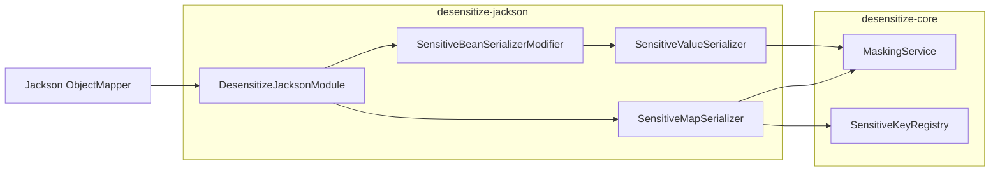

# Atlas Richie 脱敏 Jackson (atlas-richie-component-desensitize-jackson)

> 脱敏组件的 Jackson 集成模块。自动注册一个 `JacksonModule`，在 JSON 序列化阶段对 **`@Sensitive` 注解的 String 字段** 与 **按 `sensitive-keys` 命中的 Map 值** 做脱敏，**业务代码零改动**。使用平台 `JsonUtils` 或任何标准 Spring MVC `MappingJackson2HttpMessageConverter` 的接口都会自动生效。

本模块构建在 [`desensitize-core`](../atlas-richie-component-desensitize-core/README.zh.md) 之上，是**接口出口（API_RESPONSE）侧脱敏的推荐方式**。

---

## 📖 目录

- [🎯 子组件作用](#🎯-子组件作用)
- [🏗️ 模块定位](#🏗️-模块定位)
- [🧠 设计思路](#🧠-设计思路)
- [📦 关键对象](#📦-关键对象)
- [🚀 快速开始](#🚀-快速开始)
  - [1. 引入依赖](#1-引入依赖)
  - [2. 补充配置](#2-补充配置)
  - [3. 给 DTO 加注解](#3-给-dto-加注解)
  - [4. Controller 返回即可，无需额外代码](#4-controller-返回即可，无需额外代码)
- [🧪 使用示例与效果](#🧪-使用示例与效果)
  - [A. 注解字段](#a-注解字段)
  - [B. 顶层返回 Map](#b-顶层返回-map)
  - [C. Bean 内 `Map<String, Object>` 属性](#c-bean-内-mapstring,-object-属性)
  - [D. 嵌套 Map](#d-嵌套-map)
  - [E. 动态 key 的兜底方案](#e-动态-key-的兜底方案)
- [⚙️ 配置参考](#⚙️-配置参考)
- [🔌 自定义 ObjectMapper 集成](#🔌-自定义-objectmapper-集成)
- [⚠️ 注意事项](#⚠️-注意事项)
- [📚 相关文档](#📚-相关文档)
---

## 🎯 子组件作用

| 关注点 | 本模块如何解决 |
|--------|---------------|
| Bean 字段在 JSON 响应中脱敏 | 在 String 字段上标注 `@Sensitive(type=..., scenes=...)` |
| Map（顶层或嵌套）在 JSON 响应中脱敏 | 全局 `sensitive-keys` + `SensitiveMapSerializer` |
| 与现有 `ObjectMapper` 组合 | 注册为标准 `tools.jackson.databind.JacksonModule` |
| 平台 `JsonUtils` 一起脱敏 | 提供 `JsonUtilsModuleCustomizer`，`JsonUtils.getInstance().writeValueAsString(...)` 同样脱敏 |

## 🏗️ 模块定位



| 依赖 | 说明 |
|------|------|
| `atlas-richie-component-desensitize-core` | 提供 `MaskingService` / `SensitiveKeyRegistry` / `@Sensitive` / `MaskScene` |
| `tools.jackson.core:jackson-databind` | Jackson 3（项目对齐 Spring Boot 4.x） |

## 🧠 设计思路

1. **注解 + 配置，两条互补的路径。** `@Sensitive` 是自有 DTO 的首选，类型安全、可评审；`sensitive-keys` 解决动态键 Map（遗留接口、动态列）。两条路径共用 `MaskingService`，规则零漂移。
2. **Map 的 key 是"语义"，不是"值"。** 看起来像手机号的 `orderId = 13812348000` **不会**被误脱敏——只有当 **key 名**（或外层字段的 `@Sensitive`）命中规则时才脱敏。这是组件防误杀的基石。
3. **`@Sensitive` 是 API_RESPONSE 场景的唯一定义来源。** 当字段声明 `@Sensitive(scenes = {API_RESPONSE, LOG})` 时，`SensitiveBeanSerializerModifier` 在属性写入阶段就把 `SensitiveValueSerializer` 绑定到该 writer，序列化器携带字段/类元数据进入 `MaskContext`，使 `MaskPermissionEvaluator` 可以按字段做角色级明文放行。
4. **Bean 内 Map 属性走同一序列化器修饰器。** `SensitiveBeanSerializerModifier` 在属性类型为 `Map` 时把默认 Map 序列化器替换为 `SensitiveMapSerializer`。`UserVO.extra: Map<String, Object>` 即便内部 key 没有注解也能脱敏。
5. **模块可组合。** 既注册为标准 `JacksonModule`，又通过 `JsonUtilsModuleCustomizer` 注入平台 `JsonUtils`。如果项目用平台 `JsonUtils`，无需改业务代码即可生效。

## 📦 关键对象

| 类型 | 职责 |
|------|------|
| `@Sensitive` | 字段注解（来自 core）：声明 `MaskType` / `MaskScene[]` / `customStrategy` |
| `DesensitizeJacksonModule` | `SimpleModule("desensitize-jackson")`；绑定 `ValueSerializerModifier` 并注册 `SensitiveMapSerializer`（API_RESPONSE 场景） |
| `SensitiveBeanSerializerModifier` | `ValueSerializerModifier`：每个 `BeanPropertyWriter` —— 字段是 `CharSequence` 且带 `@Sensitive` 时绑定 `SensitiveValueSerializer`；类型是 `Map` 时绑定 `SensitiveMapSerializer` |
| `SensitiveValueSerializer` | `StdSerializer<String>`：序列化时调用 `maskingService.mask(value, MaskContext.of(scene, fieldName, declaringClass), maskType)`；支持 `createContextual(...)` 按属性注解覆盖类级默认 |
| `SensitiveMapSerializer` | `StdSerializer<Map<?, ?>>`：遍历每个 entry，按 `sensitiveKeyRegistry.resolve(key, API_RESPONSE)` 取类型脱敏；嵌套 Map 递归 |
| `JacksonDesensitizeAutoConfiguration` | `@AutoConfiguration(after = DesensitizeAutoConfiguration.class)`，依赖 `JacksonModule` 类与 `MaskingService` Bean；注册 `JacksonModule desensitizeJacksonModule(...)` 与 `JsonUtilsModuleCustomizer` |

## 🚀 快速开始

### 1. 引入依赖

```xml
<dependencies>
    <dependency>
        <groupId>com.richie.component</groupId>
        <artifactId>atlas-richie-component-desensitize-core</artifactId>
    </dependency>
    <dependency>
        <groupId>com.richie.component</groupId>
        <artifactId>atlas-richie-component-desensitize-jackson</artifactId>
    </dependency>
</dependencies>
```

### 2. 补充配置

```yaml
platform:
  component:
    desensitize:
      enabled: true
      default-mask-char: "*"
      scenes:
        api-response: true
      sensitive-keys:
        phone: PHONE
        idCard: ID_CARD
        bankCard: BANK_CARD
        email: EMAIL
      type-rules:
        PHONE: { keep-left: 3, keep-right: 4 }
        ID_CARD: { keep-left: 6, keep-right: 4 }
      permission:
        enabled: false
        plain-text-roles: []
```

### 3. 给 DTO 加注解

```java
public class UserVO {
    @Sensitive(type = MaskType.PHONE, scenes = {MaskScene.API_RESPONSE, MaskScene.LOG})
    private String phone;

    @Sensitive(type = MaskType.ID_CARD)
    private String idCard;

    @Sensitive(type = MaskType.EMAIL)
    private String email;

    // Map 内部按 sensitive-keys 自动脱敏
    private Map<String, Object> extra;
}
```

### 4. Controller 返回即可，无需额外代码

```java
@RestController
@RequestMapping("/api/user")
public class UserController {

    @GetMapping("/{id}")
    public UserVO get(@PathVariable String id) {
        UserVO vo = userService.load(id);
        vo.setExtra(Map.of("phone", "13812348000", "orderId", "O-1"));
        return vo;
    }
}
```

## 🧪 使用示例与效果

### A. 注解字段

```java
@GetMapping("/user/{id}")
public UserVO user(@PathVariable String id) {
    return userService.load(id);
}
```

```http
GET /api/user/u-1
```
```json
{
  "phone": "138****8000",
  "idCard": "110101********1234",
  "email": "z***@example.com",
  "name": "Alice"
}
```

### B. 顶层返回 Map

```java
@GetMapping("/row")
public Map<String, Object> row() {
    return Map.of(
        "phone",   "13812348000",
        "orderId", "O-1",
        "idCard",  "110101199001011234"
    );
}
```

```json
{
  "phone": "138****8000",
  "orderId": "O-1",
  "idCard": "110101********1234"
}
```

`SensitiveMapSerializer` 注册为顶层 Map 的序列化器，遍历每个 entry，按 key 在 `SensitiveKeyRegistry` 中查找（大小写不敏感）。

### C. Bean 内 `Map<String, Object>` 属性

```java
public class OrderVO {
    private String orderId;
    private Map<String, Object> attributes;  // <- 自动脱敏
}
```

```http
GET /api/order/o-1
```
```json
{
  "orderId": "O-1",
  "attributes": {
    "phone": "138****8000",
    "amount": 100
  }
}
```

`SensitiveBeanSerializerModifier` 会把 `attributes` 的 writer 替换成 `SensitiveMapSerializer`。

### D. 嵌套 Map

```java
@GetMapping("/profile")
public Map<String, Object> profile() {
    return Map.of("user", Map.of("phone", "13812348000", "name", "Alice"));
}
```

```json
{
  "user": {
    "phone": "138****8000",
    "name": "Alice"
  }
}
```

`SensitiveMapSerializer` 递归一层；更深层会被当作 POJO 输出（不会脱敏）。如需更深递归，可在业务侧使用 `DesensitizeUtils.maskMap(...)` 处理后再返回。

### E. 动态 key 的兜底方案

如果 key 集合是动态 / 不可枚举，建议用 core 的工具**先处理再返回**：

```java
@GetMapping("/dynamic")
public Map<String, Object> dynamic() {
    Map<String, Object> raw = buildDynamicMap();
    return DesensitizeUtils.maskMap(raw, MaskScene.API_RESPONSE);
}
```

Jackson 直接序列化已被脱敏的 Map。

## ⚙️ 配置参考

| 配置项 | 在本模块的效果 |
|--------|---------------|
| `enabled=false` | `MaskingService.mask` 返回原文，序列化器仍在但空转 |
| `scenes.api-response=false` | API 场景绕过，输出原文 |
| `permission.enabled=true` + 命中角色 | 返回明文（审计员、用户本人等） |
| `sensitive-keys.<key>: <TYPE>` | 驱动 `SensitiveMapSerializer` 查找 |
| `api-response.sensitive-keys` | 场景级覆盖，叠加在全局之上 |
| `type-rules.<TYPE>.{keepLeft,keepRight,maskChar}` | 调整保留位 / 掩码字符 |
| `fields.<类全限定名>.<字段>: <TYPE>` | 当字段未标注 `@Sensitive` 时的兜底 |

## 🔌 自定义 ObjectMapper 集成

模块已自动注册。若你的项目自定义 `ObjectMapper`，请显式注册：

```java
@Bean
public JacksonModule desensitizeJacksonModule(MaskingService maskingService, SensitiveKeyRegistry sensitiveKeyRegistry) {
    return new DesensitizeJacksonModule(maskingService, sensitiveKeyRegistry);
}
```

`JacksonDesensitizeAutoConfiguration` 同时注册的 `JsonUtilsModuleCustomizer` 会自动把模块注入平台 `JsonUtils`，所以 `JsonUtils.getInstance().writeValueAsString(...)` 也脱敏——包括走 `JsonUtils` 的 HTTP 客户端出站日志。

## ⚠️ 注意事项

1. **Map 中非 String 值不会被脱敏。** 组件按"字符串模式"脱敏；如 `Long` / `LocalDate` 类型的敏感值，请转字符串或用 `@Sensitive` 标注外层 DTO。
2. **Map 仅一层嵌套脱敏。** 更深层会走 POJO 写。若需更深，请用 `DesensitizeUtils.maskMap(...)` 预处理。
3. **`@Sensitive` 不会作用于 `log.info("{}", vo)`。** SLF4J 调用的是 `toString()`，不是 Jackson。要在日志场景生效请用 `DesensitizeUtils.toSafeJson(vo)`（来自 `desensitize-core`）或 logging 模块的转换器。
4. **自定义 `ObjectMapper` 需手动注册模块。** 自动装配只对平台默认 `JsonUtils` 生效，业务侧 `new ObjectMapper()` 需显式注册 `DesensitizeJacksonModule`。
5. **权限放行依赖角色进入 `MaskContext`。** 默认所有角色都被脱敏；如果你的安全栈能把角色写入 `MaskContext.withRoles(...)`，即可按字段做角色级明文放行。

## 📚 相关文档

- **父组件**：[`../README.zh.md`](../README.zh.md) — 整体设计、时序图、配置模型。
- **Core**：[`README.zh.md`](../atlas-richie-component-desensitize-core/README.zh.md) — 规则、策略、`MaskingService`、`DesensitizeUtils`。
- **Logging**：[`README.zh.md`](../atlas-richie-component-desensitize-logging/README.zh.md) — Logback `ConversionRule` / TurboFilter。