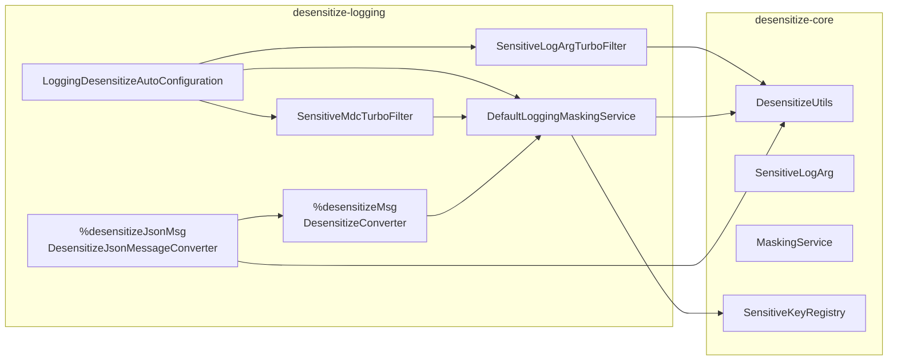

# Atlas Richie Desensitize Logging (atlas-richie-component-desensitize-logging)

> Logback integration for the desensitization component. Provides three layered desensitization points so sensitive data never reaches your log files in plaintext:

> 1. **TurboFilter** — replace `SensitiveLogArg` parameters and mask MDC entries **before** the log event is created. Works with plain `%msg` patterns.
> 2. **`%desensitizeMsg` ConversionRule** — for `%msg` strings that contain `SensitiveLogArg` parameters, renders the formatted message with masked values.
> 3. **`%desensitizeJsonMsg` ConversionRule** — for log messages that are themselves JSON text, parse → mask by `sensitive-keys` → re-serialize.

> All three share the same `MaskingService` / `sensitive-keys` / `MaskScene.LOG` rule chain with [`desensitize-core`](../atlas-richie-component-desensitize-core/README.md) and [`desensitize-jackson`](../atlas-richie-component-desensitize-jackson/README.md). One rule definition, every egress.

---

## 📖 Contents

- [🎯 Purpose](#🎯-purpose)
- [🏗️ Module Position](#🏗️-module-position)
- [🧠 Design Philosophy](#🧠-design-philosophy)
- [📦 Key Classes](#📦-key-classes)
- [🚀 Quick Start](#🚀-quick-start)
  - [1. Add dependency](#1-add-dependency)
  - [2. Configure](#2-configure)
  - [3. Pick your pattern](#3-pick-your-pattern)
- [🧪 Usage Examples & Effects](#🧪-usage-examples-&-effects)
  - [A. Scalar via `SensitiveLogArg` (most reliable)](#a-scalar-via-sensitivelogarg-most-reliable)
  - [B. MDC masking](#b-mdc-masking)
  - [C. `%desensitizeMsg` for full-message masking](#c-%desensitizemsg-for-full-message-masking)
  - [D. `%desensitizeJsonMsg` for JSON messages](#d-%desensitizejsonmsg-for-json-messages)
  - [E. Disabling a TurboFilter](#e-disabling-a-turbofilter)
- [⚙️ Configuration Reference](#⚙️-configuration-reference)
- [🧩 Which Path Should I Use?](#🧩-which-path-should-i-use?)
- [⚠️ Caveats](#⚠️-caveats)
- [📚 Further Reading](#📚-further-reading)
---

## 🎯 Purpose

| Concern | How this module solves it |
|---------|---------------------------|
| Scalars (phone, idCard) leak through `log.info("phone={}", phone)` | Use `SensitiveLogArg.phone(phone)` — replaced by `SensitiveLogArgTurboFilter` before formatting |
| MDC fields leak in JSON Layout output | `SensitiveMdcTurboFilter` masks MDC keys against `sensitive-keys` |
| Entire `%msg` should be the masked version | Use `%desensitizeMsg` conversion word |
| Log message is a JSON text that needs to be masked structurally | Use `%desensitizeJsonMsg` conversion word |
| Need a turnkey convention without rewiring appenders | Two TurboFilters are auto-registered when the module is on the classpath |

## 🏗️ Module Position



| Dependency | Notes |
|------------|-------|
| `atlas-richie-component-desensitize-core` | Provides `MaskingService`, `DesensitizeUtils`, `SensitiveLogArg`, `sensitive-keys`, `MaskScene.LOG` |
| `ch.qos.logback:logback-classic` | TurboFilter + ClassicConverter APIs |
| `org.slf4j:slf4j-api` | SLF4J + MDC |

## 🧠 Design Philosophy

1. **Logs are different from API.** SLF4J calls `toString()` on parameters by default — it does **not** invoke Jackson. So the API solution (`@Sensitive` on fields) doesn't apply to `log.info("phone={}", phone)`. This module provides log-native hooks instead.
2. **Three layers, each optimized for one shape.**
   - **Scalar** (one or two values) → `SensitiveLogArg` + TurboFilter. Smallest change to existing log lines, no pattern change required.
   - **MDC** → `SensitiveMdcTurboFilter`. Covers JSON Layout's `includeMdc` and any pattern that prints MDC.
   - **Whole message** → `%desensitizeMsg` / `%desensitizeJsonMsg`. Last line of defense when the message text or JSON body needs handling.
3. **No regex on free text by default.** Regex-blind-scanning natural-language log messages is unreliable for Chinese / i18n templates. This module only masks values that are *explicitly* marked (`SensitiveLogArg`), or values whose keys are listed in `sensitive-keys` (MDC / JSON message).
4. **Reuse the core rule chain.** A `phone` masked by the API layer masks the same way here. No parallel config.
5. **Auto-registration, but disable-able.** Two TurboFilters are added to the Logback context automatically. Each is gated by a property so projects can opt out per filter.

## 📦 Key Classes

| Type | Responsibility |
|------|---------------|
| `LoggingMaskingService` | Interface — `toMaskedMessage(ILoggingEvent)` and `maskMdc(Map)`. |
| `DefaultLoggingMaskingService` | Default impl; renders an event with `SensitiveLogArg` parameters replaced; for MDC it delegates to `DesensitizeUtils.maskMap(map, MaskScene.LOG)`. Defensive `IllegalStateException` handling so a missing core context never breaks the log call. |
| `DesensitizeConverter` | `ClassicConverter` registered as conversion word `desensitizeMsg`; outputs `loggingMaskingService.toMaskedMessage(event)`. |
| `DesensitizeJsonMessageConverter` | Subclass of `DesensitizeConverter` registered as `desensitizeJsonMsg`; if the formatted message parses as a JSON object (`{...}`), it is deserialized, masked via `DesensitizeUtils.maskMap(...)`, and re-serialized; otherwise falls back to the parent. |
| `SensitiveLogArgTurboFilter` | `TurboFilter`; replaces `SensitiveLogArg` arguments with `DesensitizeUtils.mask(value, type)` **before** the log event is created. Works with plain `%msg` patterns. |
| `SensitiveMdcTurboFilter` | `TurboFilter`; copies MDC, calls `loggingMaskingService.maskMdc(...)`, and writes the masked values back. Keys are matched via `sensitive-keys` (case-insensitive). |
| `LoggingDesensitizeAutoConfiguration` | `@AutoConfiguration(after = DesensitizeAutoConfiguration.class)`, gated by `MaskingService` bean + Logback classpath. Registers `LoggingMaskingService`, the two TurboFilters (each toggleable via property), and a `SmartInitializingSingleton` that adds the TurboFilters to the `LoggerContext`. |

## 🚀 Quick Start

### 1. Add dependency

```xml
<dependencies>
    <dependency>
        <groupId>com.richie.component</groupId>
        <artifactId>atlas-richie-component-desensitize-core</artifactId>
    </dependency>
    <dependency>
        <groupId>com.richie.component</groupId>
        <artifactId>atlas-richie-component-desensitize-logging</artifactId>
    </dependency>
    <dependency>
        <groupId>ch.qos.logback</groupId>
        <artifactId>logback-classic</artifactId>
    </dependency>
</dependencies>
```

Two TurboFilters are auto-registered (see `LoggingDesensitizeAutoConfiguration#loggingTurboFilterRegistrar`). No further wiring is required for the basic path.

### 2. Configure

```yaml
platform:
  component:
    desensitize:
      enabled: true
      default-mask-char: "*"
      scenes:
        log: true
        audit: true
      sensitive-keys:
        phone: PHONE
        idCard: ID_CARD
        bankCard: BANK_CARD
        email: EMAIL
        userPhone: PHONE
      type-rules:
        PHONE: { keep-left: 3, keep-right: 4 }
      log:
        sensitive-keys: {}   # scene override; merged on top of global
        features:
          auto-register-turbo-filters: true
          sensitive-log-arg-turbo-filter-enabled: true
          sensitive-mdc-turbo-filter-enabled: true
        regex-fallback:
          enabled: false      # do NOT enable for natural-language logs
          rules: {}
```

### 3. Pick your pattern

**Plain `%msg`** — the TurboFilter approach is enough:

```xml
<configuration>
    <appender name="CONSOLE" class="ch.qos.logback.core.ConsoleAppender">
        <encoder>
            <pattern>%d{yyyy-MM-dd HH:mm:ss} [%thread] %-5level %logger{36} - %msg%n</pattern>
        </encoder>
    </appender>
    <root level="INFO">
        <appender-ref ref="CONSOLE"/>
    </root>
</configuration>
```

**Masked message via conversion word**:

```xml
<configuration>
    <conversionRule conversionWord="desensitizeMsg"
        converterClass="com.richie.component.desensitize.logging.logback.DesensitizeConverter"/>

    <appender name="CONSOLE" class="ch.qos.logback.core.ConsoleAppender">
        <encoder>
            <pattern>%d %-5level %logger - %desensitizeMsg%n</pattern>
        </encoder>
    </appender>
    <root level="INFO">
        <appender-ref ref="CONSOLE"/>
    </root>
</configuration>
```

**JSON-shaped messages**:

```xml
<configuration>
    <conversionRule conversionWord="desensitizeJsonMsg"
        converterClass="com.richie.component.desensitize.logging.logback.DesensitizeJsonMessageConverter"/>

    <appender name="CONSOLE" class="ch.qos.logback.core.ConsoleAppender">
        <encoder>
            <pattern>%d %-5level %logger - %desensitizeJsonMsg%n</pattern>
        </encoder>
    </appender>
    <root level="INFO">
        <appender-ref ref="CONSOLE"/>
    </root>
</configuration>
```

## 🧪 Usage Examples & Effects

### A. Scalar via `SensitiveLogArg` (most reliable)

```java
import static com.richie.component.desensitize.core.support.SensitiveLogArg.*;

log.info("User {}'s phone is {}", name, phone("13812348000"));
// -> "User Alice's phone is 138****8000"

log.info("idCard={}, bankCard={}",
        idCard("110101199001011234"),
        bankCard("6222021234567890"));
// -> "idCard=110101********1234, bankCard=6222***********7890"
```

The TurboFilter walks the args array, sees `SensitiveLogArg`, calls `DesensitizeUtils.mask(value, type)` (default scene LOG), and substitutes in-place. After that, SLF4J formats normally — so plain `%msg` works.

If `desensitize-core` is not yet initialized when the first log fires, `DefaultLoggingMaskingService` falls back to the original value (defensive — the log line is never broken).

### B. MDC masking

```java
MDC.put("phone", "13812348000");
MDC.put("traceId", "T-1");
log.info("user login");
MDC.clear();
```

With `sensitive-keys: { phone: PHONE }`:

- **`%X{phone} - %X{traceId}`** → `138****8000 - T-1`
- **JSON Layout `includeMdc=true`** → `{"phone":"138****8000","traceId":"T-1"}`

The `SensitiveMdcTurboFilter` is invoked before the event is created; it copies MDC, masks the keys that hit `sensitive-keys`, and writes back. Unmatched keys are passed through unchanged.

### C. `%desensitizeMsg` for full-message masking

```java
log.info("user login: phone={}", phone("13812348000"));
```

With pattern `%desensitizeMsg`:

```
2026-07-03 14:22:01 INFO  c.r.s.UserService - user login: phone=138****8000
```

### D. `%desensitizeJsonMsg` for JSON messages

```java
log.info("{\"phone\":\"13812348000\",\"orderId\":\"O-1\",\"idCard\":\"110101199001011234\"}");
```

With pattern `%desensitizeJsonMsg`:

```
2026-07-03 14:22:01 INFO  c.r.s.UserService - {"phone":"138****8000","orderId":"O-1","idCard":"110101********1234"}
```

Behavior:

- If the message starts with `{` and ends with `}` → try `JsonUtils.deserialize(...)`.
- On success → `DesensitizeUtils.maskMap(map, MaskScene.LOG)` → re-serialize.
- On failure (not JSON, parse error, etc.) → falls back to `DesensitizeConverter`'s output (which already handles `SensitiveLogArg` parameters).

### E. Disabling a TurboFilter

```yaml
platform:
  component:
    desensitize:
      log:
        features:
          sensitive-mdc-turbo-filter-enabled: false
```

This removes only the MDC filter; `SensitiveLogArg` TurboFilter remains active.

## ⚙️ Configuration Reference

| Property | Default | Effect |
|----------|---------|--------|
| `enabled` | `true` | Master switch — `false` makes `MaskingService.mask` return original. |
| `scenes.log` | `true` | LOG scene toggle. |
| `scenes.audit` | `true` | AUDIT scene toggle (logging module also routes MDC through LOG scene by default; AUDIT uses the same `log.sensitive-keys` override). |
| `sensitive-keys` | `{}` | Drives both `maskMdc` and `%desensitizeJsonMsg`. Case-insensitive. |
| `log.sensitive-keys` | `{}` | Scene-level override (merged on top of global). |
| `type-rules.<TYPE>.{keepLeft,keepRight,maskChar}` | per-type | Controls the actual masking in this module. |
| `log.features.auto-register-turbo-filters` | `true` | When `false`, no TurboFilter is added at startup (you must register manually). |
| `log.features.sensitive-log-arg-turbo-filter-enabled` | `true` | When `false`, the `SensitiveLogArgTurboFilter` bean is not created. |
| `log.features.sensitive-mdc-turbo-filter-enabled` | `true` | When `false`, the `SensitiveMdcTurboFilter` bean is not created. |
| `log.regex-fallback.enabled` | `false` | Whole-line regex fallback (off by default). |

## 🧩 Which Path Should I Use?

| Data shape | Recommended approach |
|------------|----------------------|
| Scalar (`String phone`, `String idCard`) | `SensitiveLogArg.phone(phone)` + TurboFilter (no pattern change) |
| MDC field | TurboFilter auto-handles — just configure `sensitive-keys` |
| Whole VO/DTO that I want to print | Use `DesensitizeUtils.toSafeJson(vo)` from core (don't rely on `%msg`) |
| Free-text Chinese / i18n template | **Do not** concatenate PII into the message — pass as `SensitiveLogArg` parameter instead |
| JSON text message | `%desensitizeJsonMsg` conversion word |

## ⚠️ Caveats

1. **`%msg` does not call Jackson.** `log.info("user={}", userVo)` invokes `toString()`. Use `DesensitizeUtils.toSafeJson(userVo)` (from `desensitize-core`) or wrap into `SensitiveLogArg` — the Jackson serialization is irrelevant here.
2. **MDC filter mutates the global MDC map.** If multiple threads share the same MDC keys, masking runs per-event — that's safe because each TurboFilter invocation sees its own thread-local MDC.
3. **JSON message converter only acts on `{...}` shapes.** Lists / arrays / free text fall back to `DesensitizeConverter`.
4. **Auto-registered TurboFilters execute for every event.** Cost is O(n params) for `SensitiveLogArg` filter and O(k) for MDC filter — both negligible. Disable per project via the toggle properties if needed.
5. **`regex-fallback` is intentionally off.** Enabling it requires accepting the risk of false positives (e.g. order numbers that look like phone numbers). Prefer explicit marking.
6. **Manual registration without auto-config.** If your application builds `LoggerContext` itself, instantiate the TurboFilters and call `loggerContext.addTurboFilter(...)` after `start()`. The `SmartInitializingSingleton` bean only runs if the bean exists.

## 📚 Further Reading

- **Parent component**: [`../README.md`](../README.md) — overall design, sequence diagrams, DoD checklist.
- **Core**: [`../atlas-richie-component-desensitize-core/README.md`](../atlas-richie-component-desensitize-core/README.md) — `MaskingService`, `DesensitizeUtils`, `SensitiveLogArg`.
- **Jackson**: [`../atlas-richie-component-desensitize-jackson/README.md`](../atlas-richie-component-desensitize-jackson/README.md) — REST API egress masking.