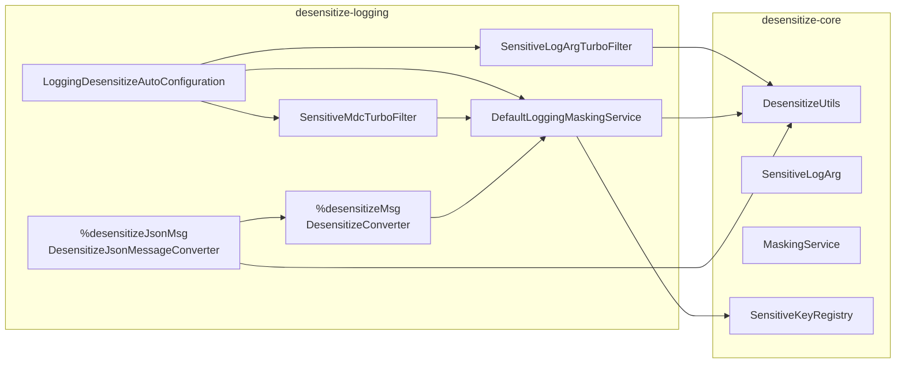

# Atlas Richie 脱敏 Logging (atlas-richie-component-desensitize-logging)

> 脱敏组件的 Logback 集成模块。在日志事件**创建之前**完成三类脱敏，确保敏感数据绝不以明文进入日志文件：

> 1. **TurboFilter** —— 在 Logback 创建日志事件前，把 `SensitiveLogArg` 参数就地替换为脱敏值；同时按 `sensitive-keys` 对 MDC 字段脱敏。**普通 `%msg` pattern 直接生效**。
> 2. **`%desensitizeMsg` 转换字** —— 当 `%msg` 字符串中包含 `SensitiveLogArg` 参数时，渲染为脱敏后的格式化消息。
> 3. **`%desensitizeJsonMsg` 转换字** —— 当日志消息本身就是 JSON 文本时，按 `sensitive-keys` 解析 → 脱敏 → 重新序列化。

> 上述三条路径与 [`desensitize-core`](../atlas-richie-component-desensitize-core/README.zh.md)、[`desensitize-jackson`](../atlas-richie-component-desensitize-jackson/README.zh.md) 共享同一套 `MaskingService` / `sensitive-keys` / `MaskScene.LOG` 规则链。**一份规则，多出口生效**。

---

## 📖 目录

- [🎯 子组件作用](#🎯-子组件作用)
- [🏗️ 模块定位](#🏗️-模块定位)
- [🧠 设计思路](#🧠-设计思路)
- [📦 关键对象](#📦-关键对象)
- [🚀 快速开始](#🚀-快速开始)
  - [1. 引入依赖](#1-引入依赖)
  - [2. 补充配置](#2-补充配置)
  - [3. 选择你的 pattern](#3-选择你的-pattern)
- [🧪 使用示例与效果](#🧪-使用示例与效果)
  - [A. 标量用 `SensitiveLogArg`（最可靠）](#a-标量用-sensitivelogarg（最可靠）)
  - [B. MDC 脱敏](#b-mdc-脱敏)
  - [C. `%desensitizeMsg` 输出完整脱敏消息](#c-%desensitizemsg-输出完整脱敏消息)
  - [D. `%desensitizeJsonMsg` 处理 JSON 消息](#d-%desensitizejsonmsg-处理-json-消息)
  - [E. 关闭某个 TurboFilter](#e-关闭某个-turbofilter)
- [⚙️ 配置参考](#⚙️-配置参考)
- [🧩 我该用哪条路径？](#🧩-我该用哪条路径？)
- [⚠️ 注意事项](#⚠️-注意事项)
- [📚 相关文档](#📚-相关文档)
---

## 🎯 子组件作用

| 关注点 | 本模块如何解决 |
|--------|---------------|
| 标量（手机号、身份证）在 `log.info("phone={}", phone)` 中泄露 | 使用 `SensitiveLogArg.phone(phone)` —— `SensitiveLogArgTurboFilter` 在格式化前替换 |
| MDC 字段在 JSON Layout 中泄露 | `SensitiveMdcTurboFilter` 按 `sensitive-keys` 对 MDC key 脱敏 |
| 整条 `%msg` 想直接输出脱敏版本 | 使用 `%desensitizeMsg` 转换字 |
| 日志消息本身就是 JSON 文本，想结构化脱敏 | 使用 `%desensitizeJsonMsg` 转换字 |
| 不希望改动 appender 配置也能脱敏 | 引入本模块后两个 TurboFilter 自动注册 |

## 🏗️ 模块定位



| 依赖 | 说明 |
|------|------|
| `atlas-richie-component-desensitize-core` | 提供 `MaskingService` / `DesensitizeUtils` / `SensitiveLogArg` / `sensitive-keys` / `MaskScene.LOG` |
| `ch.qos.logback:logback-classic` | TurboFilter + ClassicConverter API |
| `org.slf4j:slf4j-api` | SLF4J + MDC |

## 🧠 设计思路

1. **日志 ≠ API。** SLF4J 默认调用参数的 `toString()`，**不**走 Jackson。API 侧那套 `@Sensitive` 在 `log.info("phone={}", phone)` 上无效，本模块提供日志原生的脱敏钩子。
2. **三层覆盖，分别针对一种形态。**
   - **标量**（一两个值）→ `SensitiveLogArg` + TurboFilter。改动最小，无需改 pattern。
   - **MDC** → `SensitiveMdcTurboFilter`。覆盖 JSON Layout `includeMdc` 与所有打印 MDC 的 pattern。
   - **整条消息** → `%desensitizeMsg` / `%desensitizeJsonMsg`。当消息文本或 JSON 文本本身需要处理时的最后一道防线。
3. **默认不开启正则盲扫。** 自然语言（中文 / i18n 模板）里靠正则盲猜 PII 不可靠。本模块只对**显式标记**（`SensitiveLogArg`）或**键名命中规则**（MDC / JSON 消息）的值脱敏。
4. **复用 core 的规则链。** API 侧怎么脱敏，日志侧就怎么脱敏。不会存在"两套规则各脱各的"。
5. **自动注册，但可关闭。** 默认两个 TurboFilter 会装到 `LoggerContext` 上，每个都对应一个配置开关，按需关闭。

## 📦 关键对象

| 类型 | 职责 |
|------|------|
| `LoggingMaskingService` | 接口 —— `toMaskedMessage(ILoggingEvent)` 与 `maskMdc(Map)` |
| `DefaultLoggingMaskingService` | 默认实现：把事件中 `SensitiveLogArg` 参数替换后渲染；MDC 委托给 `DesensitizeUtils.maskMap(map, MaskScene.LOG)`；对 `IllegalStateException` 做防御性兜底（core 未初始化时回退原值，绝不丢日志） |
| `DesensitizeConverter` | 注册为转换字 `desensitizeMsg` 的 `ClassicConverter`；输出 `loggingMaskingService.toMaskedMessage(event)` |
| `DesensitizeJsonMessageConverter` | `DesensitizeConverter` 子类，注册为 `desensitizeJsonMsg`；若格式化后的消息是 JSON 对象（`{...}`），反序列化 → `DesensitizeUtils.maskMap(...)` → 再序列化；否则回退父类 |
| `SensitiveLogArgTurboFilter` | `TurboFilter`：把 `SensitiveLogArg` 参数就地替换为 `DesensitizeUtils.mask(value, type)`，**早于**日志事件创建。**普通 `%msg` pattern 直接生效** |
| `SensitiveMdcTurboFilter` | `TurboFilter`：复制 MDC，调用 `loggingMaskingService.maskMdc(...)`，回写。键名匹配 `sensitive-keys`（大小写不敏感） |
| `LoggingDesensitizeAutoConfiguration` | `@AutoConfiguration(after = DesensitizeAutoConfiguration.class)`，条件：`MaskingService` Bean + Logback 类路径。注册 `LoggingMaskingService`、两个 TurboFilter（每个可独立开关）、`SmartInitializingSingleton`（把 TurboFilter 装到 `LoggerContext`） |

## 🚀 快速开始

### 1. 引入依赖

```xml
<dependencies>
    <dependency>
        <groupId>com.richie.component</groupId>
        <artifactId>atlas-richie-component-desensitize-core</artifactId>
    </dependency>
    <dependency>
        <groupId>com.richie.component</groupId>
        <artifactId>atlas-richie-component-desensitize-logging</artifactId>
    </dependency>
    <dependency>
        <groupId>ch.qos.logback</groupId>
        <artifactId>logback-classic</artifactId>
    </dependency>
</dependencies>
```

两个 TurboFilter 自动注册（见 `LoggingDesensitizeAutoConfiguration#loggingTurboFilterRegistrar`）。基础路径无需任何额外装配。

### 2. 补充配置

```yaml
platform:
  component:
    desensitize:
      enabled: true
      default-mask-char: "*"
      scenes:
        log: true
        audit: true
      sensitive-keys:
        phone: PHONE
        idCard: ID_CARD
        bankCard: BANK_CARD
        email: EMAIL
        userPhone: PHONE
      type-rules:
        PHONE: { keep-left: 3, keep-right: 4 }
      log:
        sensitive-keys: {}   # 场景级覆盖，在全局之上合并
        features:
          auto-register-turbo-filters: true
          sensitive-log-arg-turbo-filter-enabled: true
          sensitive-mdc-turbo-filter-enabled: true
        regex-fallback:
          enabled: false      # 自然语言日志不建议开启
          rules: {}
```

### 3. 选择你的 pattern

**普通 `%msg`** —— TurboFilter 即可生效，无需改 pattern：

```xml
<configuration>
    <appender name="CONSOLE" class="ch.qos.logback.core.ConsoleAppender">
        <encoder>
            <pattern>%d{yyyy-MM-dd HH:mm:ss} [%thread] %-5level %logger{36} - %msg%n</pattern>
        </encoder>
    </appender>
    <root level="INFO">
        <appender-ref ref="CONSOLE"/>
    </root>
</configuration>
```

**用转换字渲染脱敏后的消息**：

```xml
<configuration>
    <conversionRule conversionWord="desensitizeMsg"
        converterClass="com.richie.component.desensitize.logging.logback.DesensitizeConverter"/>

    <appender name="CONSOLE" class="ch.qos.logback.core.ConsoleAppender">
        <encoder>
            <pattern>%d %-5level %logger - %desensitizeMsg%n</pattern>
        </encoder>
    </appender>
    <root level="INFO">
        <appender-ref ref="CONSOLE"/>
    </root>
</configuration>
```

**JSON 消息**：

```xml
<configuration>
    <conversionRule conversionWord="desensitizeJsonMsg"
        converterClass="com.richie.component.desensitize.logging.logback.DesensitizeJsonMessageConverter"/>

    <appender name="CONSOLE" class="ch.qos.logback.core.ConsoleAppender">
        <encoder>
            <pattern>%d %-5level %logger - %desensitizeJsonMsg%n</pattern>
        </encoder>
    </appender>
    <root level="INFO">
        <appender-ref ref="CONSOLE"/>
    </root>
</configuration>
```

## 🧪 使用示例与效果

### A. 标量用 `SensitiveLogArg`（最可靠）

```java
import static com.richie.component.desensitize.core.support.SensitiveLogArg.*;

log.info("用户 {} 的手机号是 {}", name, phone("13812348000"));
// -> "用户 Alice 的手机号是 138****8000"

log.info("idCard={}, bankCard={}",
        idCard("110101199001011234"),
        bankCard("6222021234567890"));
// -> "idCard=110101********1234, bankCard=6222***********7890"
```

`SensitiveLogArgTurboFilter` 遍历参数数组，发现 `SensitiveLogArg` 调用 `DesensitizeUtils.mask(value, type)`（默认 LOG 场景）就地替换，然后 SLF4J 正常格式化 —— **普通 `%msg` 直接生效**。

如果首次日志触发时 `desensitize-core` 还未初始化，`DefaultLoggingMaskingService` 会回退原值（防御性 —— 日志链绝不中断）。

### B. MDC 脱敏

```java
MDC.put("phone", "13812348000");
MDC.put("traceId", "T-1");
log.info("user login");
MDC.clear();
```

`platform.component.desensitize.sensitive-keys` 配置 `phone: PHONE` 后：

- **`%X{phone} - %X{traceId}`** → `138****8000 - T-1`
- **JSON Layout `includeMdc=true`** → `{"phone":"138****8000","traceId":"T-1"}`

`SensitiveMdcTurboFilter` 在事件创建前复制 MDC、按 `sensitive-keys` 命中规则脱敏后写回；未命中 key 原样透传。

### C. `%desensitizeMsg` 输出完整脱敏消息

```java
log.info("user login: phone={}", phone("13812348000"));
```

Pattern 为 `%desensitizeMsg` 时：

```
2026-07-03 14:22:01 INFO  c.r.s.UserService - user login: phone=138****8000
```

### D. `%desensitizeJsonMsg` 处理 JSON 消息

```java
log.info("{\"phone\":\"13812348000\",\"orderId\":\"O-1\",\"idCard\":\"110101199001011234\"}");
```

Pattern 为 `%desensitizeJsonMsg` 时：

```
2026-07-03 14:22:01 INFO  c.r.s.UserService - {"phone":"138****8000","orderId":"O-1","idCard":"110101********1234"}
```

行为约定：

- 消息以 `{` 起、`}` 止 → 走 `JsonUtils.deserialize(...)`。
- 解析成功 → `DesensitizeUtils.maskMap(map, MaskScene.LOG)` → 再序列化。
- 解析失败（非 JSON 或异常）→ 回退 `DesensitizeConverter` 的输出（仍然处理 `SensitiveLogArg` 参数）。

### E. 关闭某个 TurboFilter

```yaml
platform:
  component:
    desensitize:
      log:
        features:
          sensitive-mdc-turbo-filter-enabled: false
```

这会移除 MDC 过滤器；`SensitiveLogArg` 过滤器仍然生效。

## ⚙️ 配置参考

| 配置项 | 默认值 | 作用 |
|--------|--------|------|
| `enabled` | `true` | 总开关，`false` 时 `MaskingService.mask` 返回原文 |
| `scenes.log` | `true` | LOG 场景开关 |
| `scenes.audit` | `true` | AUDIT 场景开关（logging 模块默认同样走 `log.sensitive-keys` 覆盖） |
| `sensitive-keys` | `{}` | 驱动 `maskMdc` 与 `%desensitizeJsonMsg`；大小写不敏感 |
| `log.sensitive-keys` | `{}` | LOG/AUDIT 场景级覆盖（叠加在全局之上） |
| `type-rules.<TYPE>.{keepLeft,keepRight,maskChar}` | 各类型默认 | 控制本模块实际脱敏的保留位 / 掩码字符 |
| `log.features.auto-register-turbo-filters` | `true` | `false` 时不自动注册任何 TurboFilter，需手动注册 |
| `log.features.sensitive-log-arg-turbo-filter-enabled` | `true` | `false` 时不创建 `SensitiveLogArgTurboFilter` Bean |
| `log.features.sensitive-mdc-turbo-filter-enabled` | `true` | `false` 时不创建 `SensitiveMdcTurboFilter` Bean |
| `log.regex-fallback.enabled` | `false` | 整行正则兜底（默认关闭） |

## 🧩 我该用哪条路径？

| 数据形态 | 推荐做法 |
|---------|---------|
| 标量（`String phone`、`String idCard`） | `SensitiveLogArg.phone(phone)` + TurboFilter（不改 pattern） |
| MDC 字段 | 配置 `sensitive-keys`，TurboFilter 自动处理 |
| 整体打印 VO/DTO | 用 core 的 `DesensitizeUtils.toSafeJson(vo)`（**不要**靠 `%msg`） |
| 中 / i18n 自由文本模板 | **禁止**把明文 PII 拼到 message；改用 `SensitiveLogArg` 参数 |
| JSON 文本消息 | `%desensitizeJsonMsg` 转换字 |

## ⚠️ 注意事项

1. **`%msg` 不走 Jackson。** `log.info("user={}", userVo)` 调用的是 `toString()`。请用 `DesensitizeUtils.toSafeJson(userVo)`（来自 core）或包成 `SensitiveLogArg` —— Jackson 序列化在这里无关。
2. **MDC 过滤器会改全局 MDC。** 多线程各自 ThreadLocal，TurboFilter 每次执行看到的是当前线程 MDC，互不干扰。
3. **JSON 消息转换器仅作用于 `{...}` 形态。** 数组 / 列表 / 自由文本回退 `DesensitizeConverter`。
4. **自动注册的 TurboFilter 对每个事件生效。** 复杂度：`SensitiveLogArg` 过滤器 O(n 参数)，MDC 过滤器 O(k 键) —— 都可忽略。如需关闭，按上述配置开关。
5. **`regex-fallback` 故意关闭。** 启用需接受误杀风险（如订单号长得像手机号）。请优先用显式标记。
6. **手动注册而不走自动配置。** 如果应用自己构建 `LoggerContext`，可 `new` 出 TurboFilter 后调用 `start()` 再 `loggerContext.addTurboFilter(...)`。`SmartInitializingSingleton` 仅在 Bean 存在时执行。

## 📚 相关文档

- **父组件**：[`../README.zh.md`](../README.zh.md) — 整体设计、时序图、DoD 清单。
- **Core**：[`README.zh.md`](../atlas-richie-component-desensitize-core/README.zh.md) — `MaskingService`、`DesensitizeUtils`、`SensitiveLogArg`。
- **Jackson**：[`README.zh.md`](../atlas-richie-component-desensitize-jackson/README.zh.md) — REST API 出口脱敏。