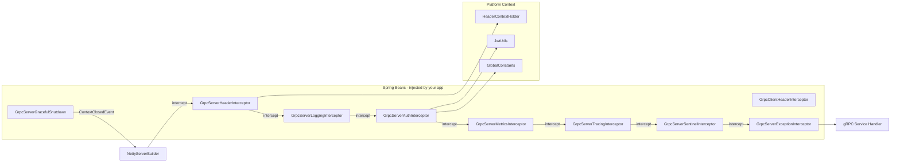
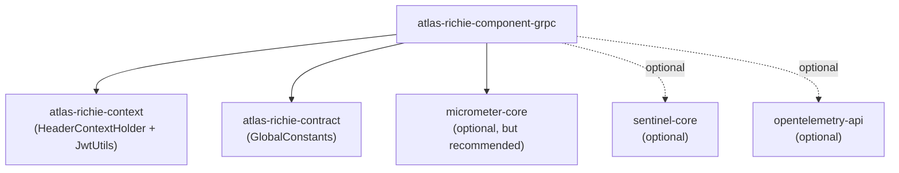
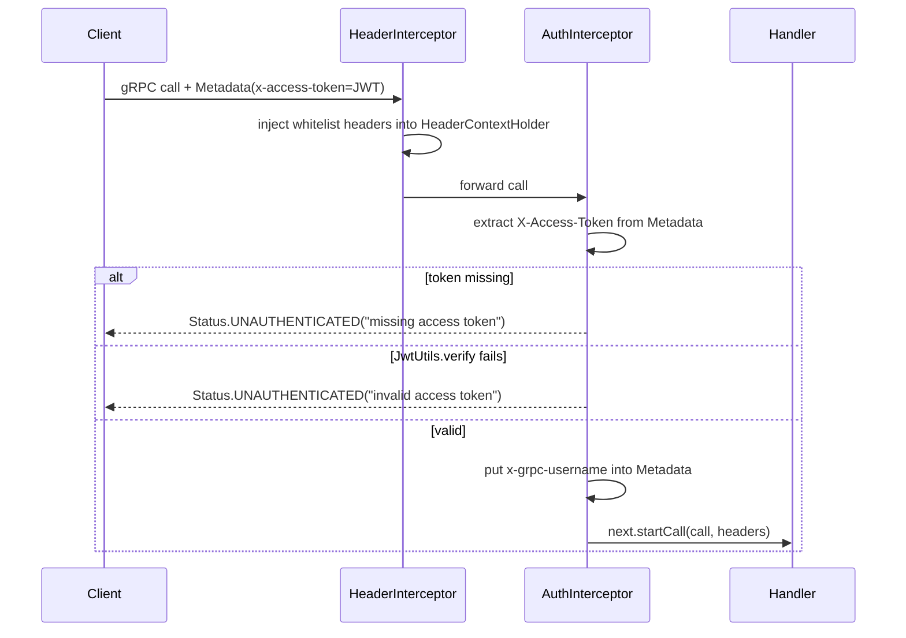
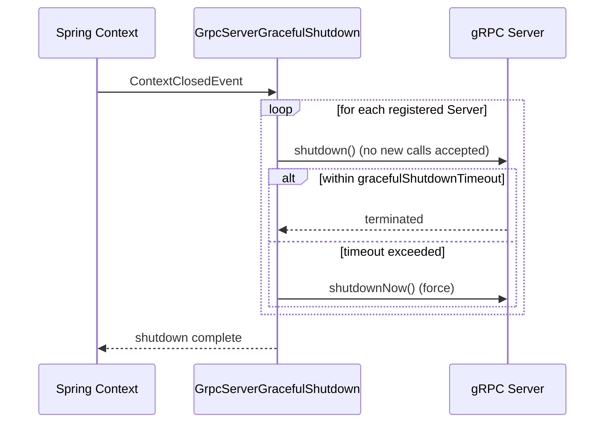

# Atlas Richie gRPC Component (atlas-richie-component-grpc)

> Production-grade **gRPC interceptor stack** for Spring Boot 4.x on JDK 25. Provides header propagation, JWT auth, Sentinel flow control, OpenTelemetry tracing, Micrometer metrics, exception mapping, and graceful shutdown — all as opt-in Spring Beans that you wire into your own `NettyServerBuilder` / `ManagedChannelBuilder`.
>
> This component **does not** start a gRPC server or open channels for you. It supplies the cross-cutting interceptors and a `GrpcServerGracefulShutdown` lifecycle hook; you keep full ownership of the actual `Server` / `ManagedChannel` lifecycles.

---

## 📖 Contents

- [📖 Overview](#📖-overview)
  - [What this component is — and what it isn't](#what-this-component-is-—-and-what-it-isnt)
- [✨ Features](#✨-features)
  - [Core capabilities](#core-capabilities)
  - [Design choices](#design-choices)
- [🏗️ Architecture & Module Layout](#🏗️-architecture-&-module-layout)
  - [Runtime component relationships](#runtime-component-relationships)
  - [Dependency graph (optional integrations)](#dependency-graph-optional-integrations)
- [🚀 Quick Start](#🚀-quick-start)
  - [1. Add the dependency](#1-add-the-dependency)
  - [2. Configure](#2-configure)
  - [3. Wire interceptors on your `NettyServerBuilder`](#3-wire-interceptors-on-your-nettyserverbuilder)
  - [4. Your gRPC implementation can read headers via `HeaderContextHolder`](#4-your-grpc-implementation-can-read-headers-via-headercontextholder)
- [🔧 Core Capabilities](#🔧-core-capabilities)
  - [1. Header propagation (`HeaderContextHolder`)](#1-header-propagation-headercontextholder)
  - [2. JWT authentication](#2-jwt-authentication)
  - [3. Exception → `Status` mapping](#3-exception-→-status-mapping)
  - [4. Micrometer metrics](#4-micrometer-metrics)
  - [5. Sentinel flow control](#5-sentinel-flow-control)
  - [6. OpenTelemetry tracing](#6-opentelemetry-tracing)
  - [7. Structured logging](#7-structured-logging)
  - [8. Graceful shutdown](#8-graceful-shutdown)
- [⚙️ Configuration Reference](#⚙️-configuration-reference)
  - [`platform.grpc.server`](#platformgrpcserver)
  - [`platform.grpc.client`](#platformgrpcclient)
  - [`platform.grpc.header-propagation`](#platformgrpcheader-propagation)
- [🎯 Best Practices](#🎯-best-practices)
  - [1. Recommended interceptor order on the server side](#1-recommended-interceptor-order-on-the-server-side)
  - [2. Recommended client order](#2-recommended-client-order)
  - [3. Don't manage `HeaderContextHolder` manually when using header interceptors](#3-dont-manage-headercontextholder-manually-when-using-header-interceptors)
  - [4. Always call `gracefulShutdown.register(server)`](#4-always-call-gracefulshutdownregisterserver)
  - [5. Pair with the platform's desensitization component](#5-pair-with-the-platforms-desensitization-component)
  - [6. Disable what you don't use](#6-disable-what-you-dont-use)
- [⚠️ Known Limitations](#⚠️-known-limitations)
- [❓ FAQ](#❓-faq)
  - [Q1: I added the dependency but no interceptor Beans are created — why?](#q1-i-added-the-dependency-but-no-interceptor-beans-are-created-—-why?)
  - [Q2: Can I use this without Sentinel / OpenTelemetry on the classpath?](#q2-can-i-use-this-without-sentinel-/-opentelemetry-on-the-classpath?)
  - [Q3: How do I read a custom header from the client side and use it on the server?](#q3-how-do-i-read-a-custom-header-from-the-client-side-and-use-it-on-the-server?)
  - [Q4: Why does my JWT-protected call get rejected with "missing access token"?](#q4-why-does-my-jwt-protected-call-get-rejected-with-missing-access-token?)
  - [Q5: Does the metrics interceptor support client-side too?](#q5-does-the-metrics-interceptor-support-client-side-too?)
  - [Q6: How do I add a custom interceptor without losing the platform ones?](#q6-how-do-i-add-a-custom-interceptor-without-losing-the-platform-ones?)
  - [Q7: How do I migrate from this component's auth to Spring Security gRPC support later?](#q7-how-do-i-migrate-from-this-components-auth-to-spring-security-grpc-support-later?)
- [📚 Further Reading](#📚-further-reading)
---

## 📖 Overview

|
 Item |
 Value |
 ------|
-------|
 **Artifact** 
 `com.richie.component:atlas-richie-component-grpc` |
 **Category** |
 Cross-cutting infrastructure — gRPC interceptor stack |
 **JDK / Spring Boot** |
 JDK 25 / Spring Boot 4.x |
 **Hard dependencies** 
 `atlas-richie-context` (for `HeaderContextHolder` + `JwtUtils`), `atlas-richie-contract` (for `GlobalConstants`) | **Optional dependencies** 
 `sentinel-core`, `opentelemetry-api`, `micrometer-core` | **Output style** | Spring Boot auto-configuration registers 12 interceptor Beans; you `.intercept(...)` them on your `ServerBuilder` / `ChannelBuilder`. |

### `What` this component is — and what it isn't

|
 ✅ It gives you |
 ❌ It does not give you |
 -----------------|
------------------------|
 Production-ready **interceptors** (12 of them) |
 A turnkey gRPC server starter |
 Centralized config (`platform.grpc.*`) |
 A `GrpcServerTemplate` / `ChannelFactory` — you build your own |
 Graceful shutdown lifecycle hook |
 A Netty / OkHttp channel wrapper |
 Cross-cutting concerns (auth, tracing, metrics, …) |
 A replacement for `grpc-spring-boot-starter` |
 Compatible with the platform's `HeaderContextHolder` |
 Server-side `@GrpcService` annotation processing |

---

## ✨ Features

### `Core` capabilities

- ✅ **Header propagation** — `GrpcServerHeaderInterceptor` / `GrpcClientHeaderInterceptor` move a configurable whitelist of headers between gRPC `Metadata` and the platform's `HeaderContextHolder` (lowercase, case-insensitive).
- ✅ **JWT authentication** — `GrpcServerAuthInterceptor` validates the `X-Access-Token` header via `JwtUtils`; user name is forwarded downstream as `x-grpc-username`.
- ✅ **Exception → Status mapping** — `GrpcServerExceptionInterceptor` catches `IllegalArgumentException` / `IllegalStateException` / `UnsupportedOperationException` / `TimeoutException` / generic `RuntimeException` and maps them to canonical gRPC `Status` codes.
- ✅ **Structured logging** — `GrpcServerLoggingInterceptor` and `GrpcClientLoggingInterceptor` log method, status code, and duration per call.
- ✅ **Micrometer metrics** — `grpc.server.requests` (counter), `grpc.server.request.duration` (timer), `grpc.server.responses.errors` (counter), all tagged by `method` and `status`.
- ✅ **Sentinel flow control / circuit breaking** (optional) — `GrpcServerSentinelInterceptor` returns `RESOURCE_EXHAUSTED` on block, `UNAVAILABLE` on degrade; `GrpcClientSentinelInterceptor` covers outbound calls.
- ✅ **OpenTelemetry tracing** (optional) — `GrpcServerTracingInterceptor` and `GrpcClientTracingInterceptor` create `SERVER` / `CLIENT` spans and propagate W3C `traceparent`.
- ✅ **Graceful shutdown** — `GrpcServerGracefulShutdown` listens on Spring's `ContextClosedEvent`, calls `Server.shutdown()` then `shutdownNow()` after `gracefulShutdownTimeout`.

### `Design` choices

- ✅ **Opt-in by default** — every interceptor has its own toggle (`platform.grpc.<scope>.<feature>-enabled`) so you can enable only what you need.
- ✅ **Auto-detect optional integrations** — Sentinel / OpenTelemetry interceptors are activated only if their library is on the classpath (`@ConditionalOnClass`).
- ✅ **No hidden magic** — the component only registers Beans. You wire them on your `ServerBuilder` / `ChannelBuilder` explicitly, so the gRPC lifecycle stays in your hands.

---

## 🏗️ Architecture & Module Layout

This component is a single Maven module (no sub-modules). Internally it is organized into three packages:

```
com.richie.component.grpc
├── config
│   ├── GrpcProperties                # @ConfigurationProperties("platform.grpc")
│   └── GrpcAutoConfiguration         # 12 @Bean definitions
├── interceptor
│   ├── GrpcServerHeaderInterceptor
│   ├── GrpcClientHeaderInterceptor
│   ├── GrpcServerAuthInterceptor
│   ├── GrpcServerExceptionInterceptor
│   ├── GrpcServerMetricsInterceptor
│   ├── GrpcClientMetricsInterceptor
│   ├── GrpcServerLoggingInterceptor
│   ├── GrpcClientLoggingInterceptor
│   ├── GrpcServerSentinelInterceptor
│   ├── GrpcClientSentinelInterceptor
│   ├── GrpcServerTracingInterceptor
│   └── GrpcClientTracingInterceptor
└── lifecycle
    └── GrpcServerGracefulShutdown    # ApplicationListener<ContextClosedEvent>
```

### `Runtime` component relationships



### `Dependency` graph (optional integrations)



---

## 🚀 Quick Start

### 1) `Add` the dependency

```xml
<dependency>
    <groupId>com.richie.component</groupId>
    <artifactId>atlas-richie-component-grpc</artifactId>
</dependency>

<!-- Optional but recommended: metrics + tracing + flow control -->
<dependency>
    <groupId>io.micrometer</groupId>
    <artifactId>micrometer-core</artifactId>
</dependency>
<dependency>
    <groupId>com.alibaba.csp</groupId>
    <artifactId>sentinel-core</artifactId>
</dependency>
<dependency>
    <groupId>io.opentelemetry</groupId>
    <artifactId>opentelemetry-api</artifactId>
</dependency>
```

### 2) `Configure`

```yaml
platform:
  grpc:
    server:
      header-enabled: true
      logging-enabled: true
      auth-enabled: true              # enable JWT auth
      auth-secret: ${JWT_SECRET:change-me-please}
      sentinel-enabled: true
      tracing-enabled: true
      metrics-enabled: true
      exception-mapping-enabled: true
      graceful-shutdown-timeout: 30s
    client:
      header-enabled: true
      logging-enabled: true
      sentinel-enabled: true
      tracing-enabled: true
      metrics-enabled: true
    header-propagation:
      enabled: true
      headers:
        - x-rd-request-apitoken
        - x-tenant-id
        - x-trace-id                # additional header you want to thread through
```

### 3) Wire interceptors on your `NettyServerBuilder`

```java
import com.richie.component.grpc.interceptor.*;
import com.richie.component.grpc.lifecycle.GrpcServerGracefulShutdown;
import io.grpc.Server;
import io.grpc.netty.NettyServerBuilder;
import org.springframework.beans.factory.annotation.Autowired;
import org.springframework.stereotype.Component;

@Component
public class GrpcServerBootstrap {

    @Autowired GrpcServerHeaderInterceptor  headerInterceptor;
    @Autowired GrpcServerLoggingInterceptor loggingInterceptor;
    @Autowired GrpcServerAuthInterceptor    authInterceptor;
    @Autowired GrpcServerMetricsInterceptor metricsInterceptor;
    @Autowired GrpcServerTracingInterceptor tracingInterceptor;
    @Autowired GrpcServerSentinelInterceptor sentinelInterceptor;
    @Autowired GrpcServerExceptionInterceptor exceptionInterceptor;
    @Autowired GrpcServerGracefulShutdown   gracefulShutdown;

    @Autowired MyGrpcServiceImpl myService;

    public Server start(int port) throws IOException {
        Server server = NettyServerBuilder.forPort(port)
                .intercept(headerInterceptor)
                .intercept(loggingInterceptor)
                .intercept(authInterceptor)
                .intercept(metricsInterceptor)
                .intercept(tracingInterceptor)
                .intercept(sentinelInterceptor)
                .intercept(exceptionInterceptor)
                .addService(myService)
                .build()
                .start();

        gracefulShutdown.register(server);
        return server;
    }
}
```

### 4) Your gRPC implementation can read headers via `HeaderContextHolder`

```java
import com.richie.context.common.api.HeaderContextHolder;
import io.grpc.stub.StreamObserver;

public class MyGrpcServiceImpl extends MyGrpcServiceGrpc.MyGrpcServiceImplBase {

    @Override
    public void getUser(GetUserRequest req, StreamObserver<GetUserResponse> resp) {
        // Headers propagated by GrpcServerHeaderInterceptor are already in the ThreadLocal
        String tenantId  = HeaderContextHolder.getHeader("x-tenant-id");
        String apiToken  = HeaderContextHolder.getHeader("x-rd-request-apitoken");

        // ...business logic...
        resp.onNext(GetUserResponse.newBuilder().setTenantId(tenantId).build());
        resp.onComplete();
    }
}
```

---

## 🔧 Core Capabilities

### 1) Header propagation (`HeaderContextHolder`)

|
 Direction |
 Interceptor |
 Behavior |
 -----------|
-------------|
----------|
 Inbound (server) 
 `GrpcServerHeaderInterceptor` | Iterates `Metadata.keys()`, picks up only those in the whitelist, and stores them in `HeaderContextHolder`. Cleans up on `onCancel` / `onComplete`. | Outbound (client) 
 `GrpcClientHeaderInterceptor` | Reads `HeaderContextHolder` on each call and attaches whitelisted keys as ASCII `Metadata`. |

Header names are normalized to **lowercase** for matching. The default whitelist is:

|
 Key |
 Use |
 -----|
-----
 `x-rd-request-apitoken` | API token 
 `x-tenant-id` | Tenant ID |

Add more via `platform.grpc.header-propagation.headers` (set semantics). The component intentionally does not propagate every header — only explicit whitelisted ones, to avoid leaking unrelated context.

### 2) `JWT` authentication

`GrpcServerAuthInterceptor` runs after the header interceptor (so any context is set first). Behavior:



Configuration:

```yaml
platform:
  grpc:
    server:
      auth-enabled: true         # must be true, otherwise the bean is not created
      auth-secret: ${JWT_SECRET} # shared with the issuer side
```

The token is read from `GlobalConstants.X_ACCESS_TOKEN` (i.e. `X-Access-Token` metadata key). On success, the username is added to the Metadata as `x-grpc-username`, so downstream interceptors or service implementations can read it without re-parsing the JWT.

### 3) Exception → `Status` mapping

`GrpcServerExceptionInterceptor` must be **closest to the handler** in the chain so it catches everything. Default mapping:

|
 Exception |
 gRPC `Status` |
 -----------|
---------------
 `IllegalArgumentException` 
 `INVALID_ARGUMENT` 
 `IllegalStateException` 
 `FAILED_PRECONDITION` 
 `UnsupportedOperationException` 
 `UNIMPLEMENTED` 
 `TimeoutException` 
 `DEADLINE_EXCEEDED` | Other `RuntimeException` 
 `INTERNAL` |

The interceptor wraps `onHalfClose` / `onMessage` / `onReady` so async exceptions are also captured; the call is then closed with the mapped status.

### 4) `Micrometer` metrics

Three metrics are emitted per call:

|
 Metric |
 Type |
 Tags |
 Meaning |
 --------|
------|
------|
---------
 `grpc.server.requests` | Counter 
 `method`, `status` | Total requests 
 `grpc.server.request.duration` | Timer 
 `method`, `status` | End-to-end latency 
 `grpc.server.responses.errors` | Counter 
 `method`, `status` | Errors only (status ≠ OK) |

Sample Prometheus query:

```promql
# p99 latency of GetUser
histogram_quantile(0.99,
  sum by (le) (
    rate(grpc_server_request_duration_seconds_bucket{method="my_service/GetUser"}[5m])
  )
)
```

The metrics interceptor requires a `MeterRegistry` bean. The client interceptor emits the same shape with `grpc.client.*` prefix.

### 5) `Sentinel` flow control

`GrpcServerSentinelInterceptor` (when `sentinel-core` is on the classpath) wraps the call in a Sentinel entry. On block/degrade, the call is closed with:

|
 Sentinel signal |
 gRPC `Status` |
 -----------------|
---------------|
 Flow blocked 
 `RESOURCE_EXHAUSTED` | Degraded (circuit open) 
 `UNAVAILABLE` |

You define rules via the standard Sentinel APIs (e.g. `@SentinelResource`, dynamic rule loader) — the interceptor does not provide rule management itself. See [`atlas-richie-component-microservice`](../atlas-richie-component-microservice/README.md) for rule management patterns.

### 6) `OpenTelemetry` tracing

`GrpcServerTracingInterceptor` reads the W3C `traceparent` from the incoming `Metadata`, creates a `SERVER` span, and sets `traceparent` on outgoing `Metadata` for the response. `GrpcClientTracingInterceptor` mirrors the behavior for outbound calls.

You must have an OpenTelemetry SDK on the classpath (e.g. via `opentelemetry-sdk-extension-autoconfigure`) and a `GlobalOpenTelemetry` registered.

### 7) `Structured` logging

`GrpcServerLoggingInterceptor` logs:

```
gRPC call: method=my_service/GetUser status=OK duration=12.3ms
```

`GrpcClientLoggingInterceptor` logs the symmetric outbound view. Both are SLF4J-bound (`log.info(...)`); their verbosity follows the application's logging configuration.

### 8) `Graceful` shutdown

`GrpcServerGracefulShutdown` is registered as a `SmartLifecycle`-style listener (it listens on `ContextClosedEvent`). Sequence on context close:



To enroll a server, call `gracefulShutdown.register(server)` after building it (see Quick Start step 3).

---

## ⚙️ Configuration Reference

All properties are bound under the `platform.grpc` prefix.

### `platform.grpc.server`

|
 Property |
 Type |
 Default |
 Description |
 ----------|
------|
---------|
-------------
 `header-enabled` 
 `boolean` 
 `true` | Register `GrpcServerHeaderInterceptor`. 
 `logging-enabled` 
 `boolean` 
 `true` | Register `GrpcServerLoggingInterceptor`. 
 `exception-mapping-enabled` 
 `boolean` 
 `true` | Register `GrpcServerExceptionInterceptor`. 
 `auth-enabled` 
 `boolean` 
 `false` | Register `GrpcServerAuthInterceptor`. **No bean created unless explicitly `true`.** 
 `auth-secret` 
 `String` | — | JWT signing secret. Required when `auth-enabled=true`. 
 `sentinel-enabled` 
 `boolean` 
 `true` | Register `GrpcServerSentinelInterceptor` (requires `sentinel-core` on classpath). 
 `tracing-enabled` 
 `boolean` 
 `true` | Register `GrpcServerTracingInterceptor` (requires `opentelemetry-api` on classpath). 
 `metrics-enabled` 
 `boolean` 
 `true` | Register `GrpcServerMetricsInterceptor` (requires a `MeterRegistry` bean). 
 `graceful-shutdown-timeout` 
 `Duration` 
 `30s` | How long `GrpcServerGracefulShutdown` waits between `shutdown()` and `shutdownNow()`. 
 `keep-alive-time` 
 `Duration` 
 `30s` | Hint you can read in your own server builder (the component does not auto-build one). 
 `keep-alive-timeout` 
 `Duration` 
 `10s` | Same as above. 
 `permit-keep-alive-without-calls` 
 `boolean` 
 `true` | Same as above. |

### `platform.grpc.client`

|
 Property |
 Type |
 Default |
 Description |
 ----------|
------|
---------|
-------------
 `header-enabled` 
 `boolean` 
 `true` | Register `GrpcClientHeaderInterceptor`. 
 `logging-enabled` 
 `boolean` 
 `true` | Register `GrpcClientLoggingInterceptor`. 
 `tracing-enabled` 
 `boolean` 
 `true` | Register `GrpcClientTracingInterceptor` (requires `opentelemetry-api`). 
 `metrics-enabled` 
 `boolean` 
 `true` | Register `GrpcClientMetricsInterceptor` (requires `MeterRegistry`). 
 `sentinel-enabled` 
 `boolean` 
 `true` | Register `GrpcClientSentinelInterceptor` (requires `sentinel-core`). 
 `keep-alive-time` 
 `Duration` 
 `30s` | Hint for your channel builder. 
 `keep-alive-timeout` 
 `Duration` 
 `10s` | Same. 
 `keep-alive-without-calls` 
 `boolean` 
 `true` | Same. |

### `platform.grpc.header-propagation`

|
 Property |
 Type |
 Default |
 Description |
 ----------|
------|
---------|
-------------
 `enabled` 
 `boolean` 
 `true` | Master switch for header propagation in both directions. 
 `headers` 
 `Set<String>` 
 `[x-rd-request-apitoken, x-tenant-id]` | Whitelist (case-insensitive). Header names are normalized to lowercase before matching. |

> ⚠️ **Known inconsistency (will be fixed in next release)**: `@ConfigurationProperties` is bound under `platform.grpc`, but the `@ConditionalOnProperty` checks inside `GrpcAutoConfiguration` currently use the prefix `platform.grpc.*`. The properties above are the **canonical** form. If you must use the current snapshot, also set the matching `platform.grpc.*` keys; otherwise the Bean conditions will not match.

---

## 🎯 Best Practices

### 1) `Recommended` interceptor order on the server side

The order matters because gRPC invokes interceptors in registration order — the first registered runs first on the inbound path and last on the outbound path.

```
1. GrpcServerHeaderInterceptor     (extract whitelist → HeaderContextHolder)
2. GrpcServerLoggingInterceptor    (start timing)
3. GrpcServerAuthInterceptor       (validate JWT, reject early)
4. GrpcServerMetricsInterceptor    (capture status code in close())
5. GrpcServerTracingInterceptor    (create SERVER span around the call)
6. GrpcServerSentinelInterceptor   (apply flow control)
7. GrpcServerExceptionInterceptor  (catch & map exceptions, closest to handler)
8. (your service)
```

Rationale:

- Header first → business code can read tenant ID even during auth check.
- Logging second → measures total wall time including auth / tracing overhead.
- Auth third → unauthorized calls are rejected before tracing overhead.
- Metrics records the final `Status`, which auth rejects may have already set.
- Tracing wraps as much as possible.
- Sentinel protects downstream services; sits in front of the handler.
- Exception is closest to the handler — so it catches everything inside.

### 2) `Recommended` client order

```
1. GrpcClientTracingInterceptor    (create CLIENT span)
2. GrpcClientMetricsInterceptor    (capture latency)
3. GrpcClientSentinelInterceptor   (block before sending)
4. GrpcClientHeaderInterceptor     (attach Metadata, uses HeaderContextHolder)
5. GrpcClientLoggingInterceptor    (log outbound call)
```

### 3) Don't manage `HeaderContextHolder` manually when using header interceptors

If you also use this pattern in HTTP/REST services, the existing `atlas-richie-context` filter sets the same `HeaderContextHolder`. With `GrpcServerHeaderInterceptor`, the gRPC server reuses that mechanism — never call `HeaderContextHolder.setHeader(...)` from within a service implementation; the interceptor handles it.

### 4) Always call `gracefulShutdown.register(server)`

Without it, your gRPC server is shut down by gRPC's own Netty transport **after** Spring's context close — typically resulting in `UNAVAILABLE` errors during rolling deployments. The registration order in Quick Start step 3 is the recommended pattern.

### 5) `Pair` with the platform's desensitization component

If your gRPC handlers read sensitive fields from `Metadata` or `HeaderContextHolder`, combine this component with [`atlas-richie-component-desensitize-logging`](../atlas-richie-component-desensitize/atlas-richie-component-desensitize-logging/README.md) — wrap your log calls in `DesensitizeUtils.mask(...)` so tokens / IDs don't leak into log files.

### 6) `Disable` what you don't use

Interceptors are cheap individually, but they still allocate objects per call. In tight performance loops, set the corresponding `<feature>-enabled: false` (e.g. disable `logging-enabled` for batch RPCs).

---

## ⚠️ Known Limitations

|
 Limitation |
 Impact |
 Workaround |
 ------------|
--------|
------------|
 **No built-in `Server`/`Channel` lifecycle** |
 You build Netty servers / managed channels yourself |
 Wrap them in your own `@Component`; this is intentional — the platform's gRPC starter is a separate concern. |
 **`@ConditionalOnProperty` prefix mismatch** |
 `platform.grpc.*` vs `platform.grpc.*` |
 Until the next release, duplicate keys under both prefixes, or override the auto-config. See Configuration Reference. |
 **Single auth secret only** |
 The `auth-secret` is global; no per-method auth |
 Replace `GrpcServerAuthInterceptor` with your own if you need per-route keys. |
 **No streaming-specific interceptors** |
 Stream back-pressure / cancel hooks rely on default gRPC |
 Add your own `ServerInterceptor` for stream-specific concerns. |
 **Sentinel rule management is not included** |
 The interceptor only enforces; you load rules via Sentinel APIs |
 Combine with `atlas-richie-component-microservice` for rule management. |
 **No client-side load-balancing policy** |
 Channel construction is yours |
 Use gRPC's `NameResolverProvider` for DNS-based discovery, or `@GrpcLoadBalancer` from elsewhere. |
 **No TLS / mTLS integration** |
 Server certs, trust stores, etc. are yours |
 Configure on the underlying `NettyServerBuilder` / `OkHttpChannelBuilder`. |

---

## ❓ FAQ

### `Q1`: `I` added the dependency but no interceptor `Beans` are created — why?

Check three things:

1. Your Spring Boot main class is annotated with `@SpringBootApplication` (so component scan reaches `com.richie.component.grpc`).
2. For `auth-enabled`, you set it to `true`; for others, the default is `true`.
3. The properties are under `platform.grpc.*` — if you used `platform.grpc.*` only, the Bean conditions will not match (see Known Limitations).

You can verify with `/actuator/beans` or just `@Autowired` the interceptor and see whether the field is `null`.

### `Q2` — `Can` `I` use this without `Sentinel` / `OpenTelemetry` on the classpath?

Yes. The corresponding interceptors are guarded by `@ConditionalOnClass`, so the Beans are simply not created. The remaining interceptors still work normally.

### `Q3` — `How` do `I` read a custom header from the client side and use it on the server?

1. Add the header to `platform.grpc.header-propagation.headers` (e.g. `x-tenant-id`).
2. In your client code, set it on the outbound call:

```java
Metadata headers = new Metadata();
headers.put(Metadata.Key.of("x-tenant-id", Metadata.ASCII_STRING_MARSHALLER), tenantId);
myStub.withInterceptors(MetadataUtils.newAttachHeadersInterceptor(headers)).getXxx(req);
```

> Note: this only works if `x-tenant-id` is already in `HeaderContextHolder`. To propagate from an upstream HTTP request, use the platform's HTTP filter chain — `HeaderContextHolder` is shared across servlet and gRPC layers.

3. On the server, read it via `HeaderContextHolder.getHeader("x-tenant-id")`.

### `Q4` — `Why` does my `JWT`-protected call get rejected with "missing access token"?

The `GrpcServerAuthInterceptor` reads from the metadata key `X-Access-Token` (`GlobalConstants.X_ACCESS_TOKEN`). On the client side:

```java
Metadata headers = new Metadata();
headers.put(Metadata.Key.of("X-Access-Token", Metadata.ASCII_STRING_MARSHALLER), token);
stub.withInterceptors(MetadataUtils.newAttachHeadersInterceptor(headers)).getUser(req);
```

If your client doesn't attach this metadata, the server has no way to authenticate. Consider adding it to the `GrpcClientHeaderInterceptor` whitelist if you want it auto-forwarded from `HeaderContextHolder`.

### `Q5` — `Does` the metrics interceptor support client-side too?

Yes. `GrpcClientMetricsInterceptor` emits `grpc.client.requests` / `grpc.client.request.duration` / `grpc.client.responses.errors` with the same `method` + `status` tags.

### `Q6` — `How` do `I` add a custom interceptor without losing the platform ones?

Just chain `.intercept(myCustomInterceptor)` after all the platform ones. The platform does not own the chain; it only registers Beans. Whatever order you put them in is the order gRPC executes them.

### `Q7` — `How` do `I` migrate from this component's auth to `Spring` `Security` gRPC support later?

Disable `auth-enabled` and remove `GrpcServerAuthInterceptor` from the chain. Replace with your Spring Security equivalent. The rest of the chain (header / tracing / metrics) is unaffected.

---

## 📚 Further Reading

- **Platform context utilities** — [`atlas-richie-context`](../../atlas-richie-base/atlas-richie-context/README.md) for `HeaderContextHolder`, `JwtUtils`.
- **Platform contract constants** — [`atlas-richie-contract`](../../atlas-richie-base/atlas-richie-contract/README.md) for `GlobalConstants.X_ACCESS_TOKEN`.
- **gRPC over HTTP/2 transport** — [gRPC Java documentation](https://grpc.io/docs/languages/java/).
- **Spring Boot auto-configuration** — [Spring Boot reference](https://docs.spring.io/spring-boot/reference/using/auto-configuration.html).
- **Sentinel flow control** — [`atlas-richie-component-microservice`](../atlas-richie-component-microservice/README.md) for rule management patterns.
- **OpenTelemetry tracing** — [OpenTelemetry Java SDK](https://opentelemetry.io/docs/languages/java/).
- **Micrometer** — [Micrometer documentation](https://docs.micrometer.io/micrometer/reference/).

---

**Richie gRPC Component** — production-grade cross-cutting concerns for gRPC, with the platform's ergonomic conventions 🚀