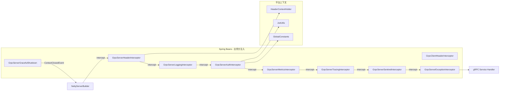
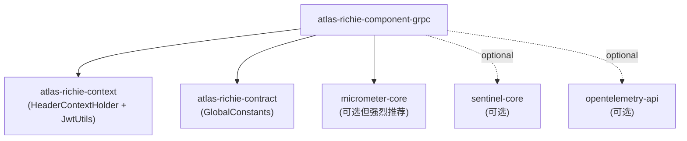
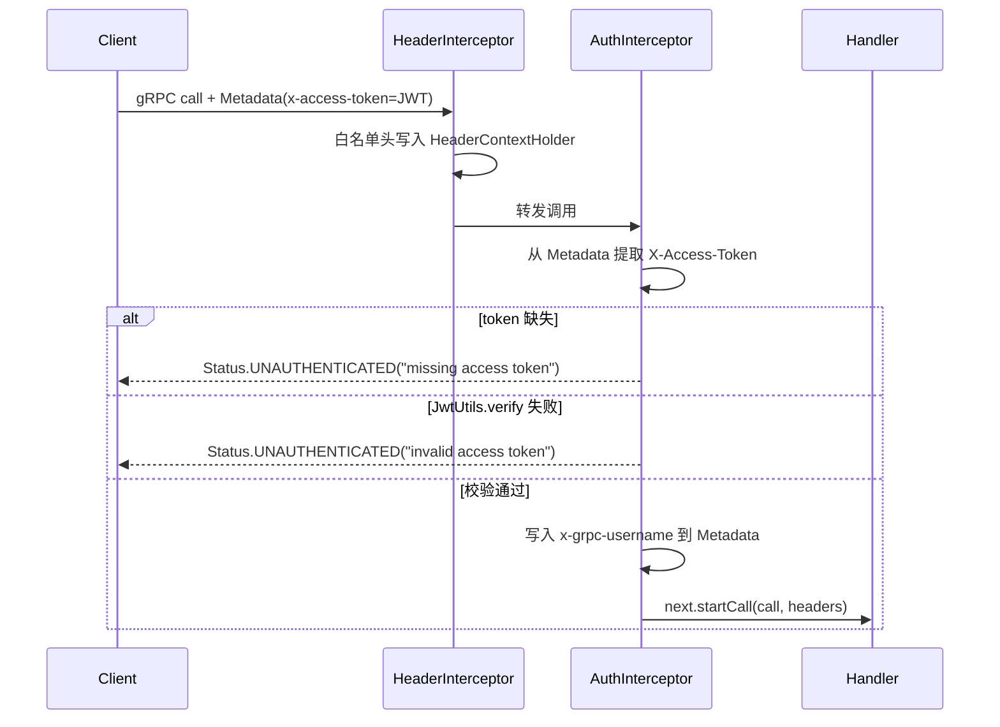
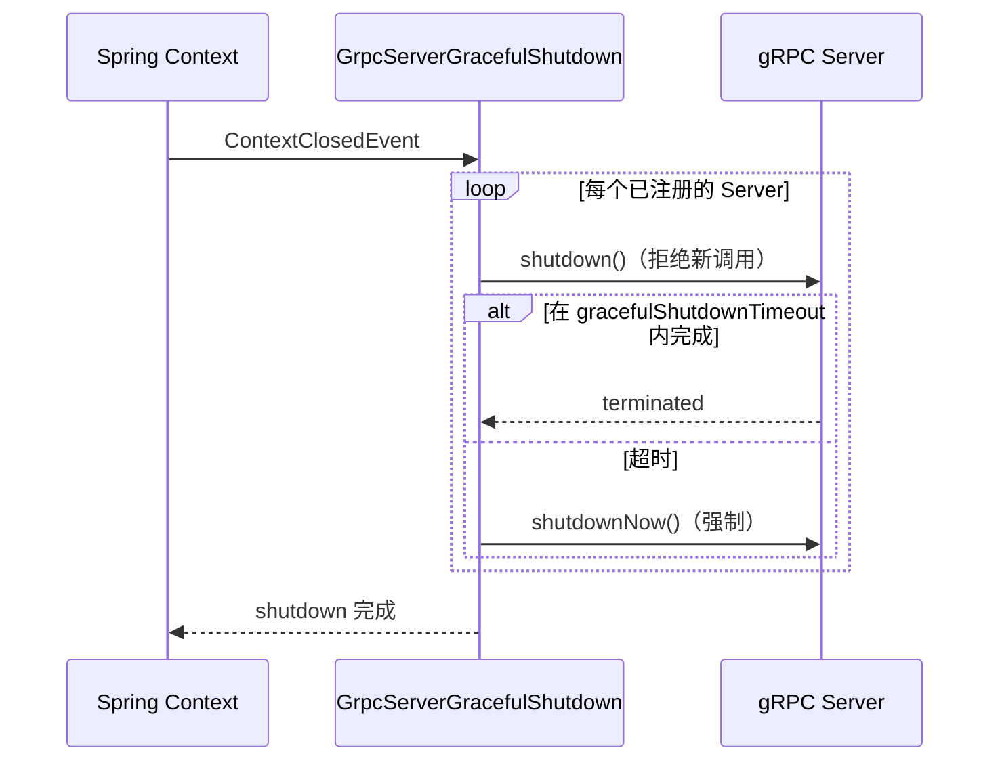

# Atlas Richie gRPC组件 (atlas-richie-component-grpc)

> 面向 Spring Boot 4.x / JDK 25 的**生产级 gRPC 拦截器栈**。提供头信息透传、JWT 鉴权、Sentinel 限流、OpenTelemetry 链路追踪、Micrometer 指标、异常映射、优雅停服——全部以可选 Spring Bean 形式提供，由你在自己的 `NettyServerBuilder` / `ManagedChannelBuilder` 上挂载。
>
> 本组件**不**替你启动 gRPC Server，也不帮你打开 Channel。它只负责横切关注点（cross-cutting interceptors）和 `GrpcServerGracefulShutdown` 生命周期钩子；Server / Channel 的完整生命周期仍由业务方掌控。

---

## 📖 目录

- [📖 概述](#📖-概述)
  - [本组件的"是"与"不是"](#本组件的是与不是)
- [✨ 功能特性](#✨-功能特性)
  - [核心能力](#核心能力)
  - [设计选择](#设计选择)
- [🏗️ 架构设计](#🏗️-架构设计)
  - [运行时组件关系](#运行时组件关系)
  - [依赖图（可选集成）](#依赖图（可选集成）)
- [🚀 快速开始](#🚀-快速开始)
  - [1. 引入依赖](#1-引入依赖)
  - [2. 配置](#2-配置)
  - [3. 在自己的 `NettyServerBuilder` 上挂载拦截器](#3-在自己的-nettyserverbuilder-上挂载拦截器)
  - [4. gRPC 实现类通过 `HeaderContextHolder` 读取头信息](#4-grpc-实现类通过-headercontextholder-读取头信息)
- [🔧 核心能力](#🔧-核心能力)
  - [1. 头信息透传（`HeaderContextHolder`）](#1-头信息透传（headercontextholder）)
  - [2. JWT 鉴权](#2-jwt-鉴权)
  - [3. 异常 → `Status` 映射](#3-异常-→-status-映射)
  - [4. Micrometer 指标](#4-micrometer-指标)
  - [5. Sentinel 限流](#5-sentinel-限流)
  - [6. OpenTelemetry 链路追踪](#6-opentelemetry-链路追踪)
  - [7. 结构化日志](#7-结构化日志)
  - [8. 优雅停服](#8-优雅停服)
- [⚙️ 配置参考](#⚙️-配置参考)
  - [`platform.grpc.server`](#platformgrpcserver)
  - [`platform.grpc.client`](#platformgrpcclient)
  - [`platform.grpc.header-propagation`](#platformgrpcheader-propagation)
- [🎯 最佳实践](#🎯-最佳实践)
  - [1. 服务端推荐拦截器顺序](#1-服务端推荐拦截器顺序)
  - [2. 客户端推荐顺序](#2-客户端推荐顺序)
  - [3. 已挂载 Header 拦截器时不要手动设置 `HeaderContextHolder`](#3-已挂载-header-拦截器时不要手动设置-headercontextholder)
  - [4. 务必调用 `gracefulShutdown.register(server)`](#4-务必调用-gracefulshutdownregisterserver)
  - [5. 与平台脱敏组件配合](#5-与平台脱敏组件配合)
  - [6. 按需关闭不需要的能力](#6-按需关闭不需要的能力)
- [⚠️ 已知限制](#⚠️-已知限制)
- [❓ 常见问题](#❓-常见问题)
  - [Q1：依赖加了但没有任何拦截器 Bean 被创建——为什么？](#q1：依赖加了但没有任何拦截器-bean-被创建——为什么？)
  - [Q2：不引入 Sentinel / OpenTelemetry 能用吗？](#q2：不引入-sentinel-/-opentelemetry-能用吗？)
  - [Q3：客户端如何携带自定义头并在服务端读取？](#q3：客户端如何携带自定义头并在服务端读取？)
  - [Q4：JWT 调用被 "missing access token" 拒绝，怎么办？](#q4：jwt-调用被-missing-access-token-拒绝，怎么办？)
  - [Q5：指标拦截器是否支持客户端？](#q5：指标拦截器是否支持客户端？)
  - [Q6：如何在不丢平台拦截器的前提下加自定义拦截器？](#q6：如何在不丢平台拦截器的前提下加自定义拦截器？)
  - [Q7：未来想从本组件鉴权迁到 Spring Security gRPC 怎么过渡？](#q7：未来想从本组件鉴权迁到-spring-security-grpc-怎么过渡？)
- [📚 相关文档](#📚-相关文档)
---

## 📖 概述

|
 项 |
 值 |
 ---|
---|
 **坐标** 
 `com.richie.component:atlas-richie-component-grpc` |
 **类别** |
 横切基础设施——gRPC 拦截器栈 |
 **JDK / Spring Boot** |
 JDK 25 / Spring Boot 4.x |
 **强依赖** 
 `atlas-richie-context`（提供 `HeaderContextHolder` + `JwtUtils`）、`atlas-richie-contract`（提供 `GlobalConstants`） | **可选依赖** 
 `sentinel-core`、`opentelemetry-api`、`micrometer-core` | **输出形态** | Spring Boot 自动装配注册 12 个拦截器 Bean；业务方在 `ServerBuilder` / `ChannelBuilder` 上 `.intercept(...)` 挂载 |

### 本组件的"是"与"不是"

|
 ✅ 提供 |
 ❌ 不提供 |
 --------|
---------|
 生产级**拦截器**（12 个） |
 一键启动 gRPC Server 的 starter |
 集中化配置（`platform.grpc.*`） 
 `GrpcServerTemplate` / `ChannelFactory`——自行构建 | 优雅停服生命周期钩子 | Netty / OkHttp Channel 包装器 | 横切关注点（鉴权、追踪、指标 …） 
 `grpc-spring-boot-starter` 的替代品 | 与平台 `HeaderContextHolder` 兼容 | 服务端 `@GrpcService` 注解处理 |

---

## ✨ 功能特性

### 核心能力

- ✅ **头信息透传**：`GrpcServerHeaderInterceptor` / `GrpcClientHeaderInterceptor`，按白名单在 gRPC `Metadata` 与平台 `HeaderContextHolder` 之间搬运（统一小写、忽略大小写）。
- ✅ **JWT 鉴权**：`GrpcServerAuthInterceptor` 通过 `JwtUtils` 校验 `X-Access-Token`，用户名以 `x-grpc-username` 向下游传递。
- ✅ **异常 → Status 映射**：`GrpcServerExceptionInterceptor` 捕获 `IllegalArgumentException` / `IllegalStateException` / `UnsupportedOperationException` / `TimeoutException` / 通用 `RuntimeException`，映射为标准 gRPC `Status`。
- ✅ **结构化日志**：`GrpcServerLoggingInterceptor` 与 `GrpcClientLoggingInterceptor` 记录方法、状态码、耗时。
- ✅ **Micrometer 指标**：`grpc.server.requests`（Counter）、`grpc.server.request.duration`（Timer）、`grpc.server.responses.errors`（Counter），均按 `method` + `status` 打 Tag。
- ✅ **Sentinel 限流 / 熔断**（可选）：`GrpcServerSentinelInterceptor` 限流时返回 `RESOURCE_EXHAUSTED`，熔断时返回 `UNAVAILABLE`；`GrpcClientSentinelInterceptor` 覆盖出站。
- ✅ **OpenTelemetry 链路追踪**（可选）：`GrpcServerTracingInterceptor` / `GrpcClientTracingInterceptor` 创建 `SERVER` / `CLIENT` Span，传递 W3C `traceparent`。
- ✅ **优雅停服**：`GrpcServerGracefulShutdown` 监听 Spring `ContextClosedEvent`，先调用 `Server.shutdown()`，超时后调用 `shutdownNow()`。

### 设计选择

- ✅ **默认按需启用**：每个拦截器都有独立开关（`platform.grpc.<scope>.<feature>-enabled`），按需打开。
- ✅ **可选集成自动检测**：Sentinel / OpenTelemetry 拦截器仅在类路径存在对应库时激活（`@ConditionalOnClass`）。
- ✅ **无隐式魔法**：组件仅注册 Bean，业务方显式挂载到自己的 `ServerBuilder` / `ChannelBuilder` 上，gRPC 生命周期仍在业务手中。

---

## 🏗️ 架构设计

本组件为**单 Maven 模块**（不含子模块），内部按三个包组织：

```
com.richie.component.grpc
├── config
│   ├── GrpcProperties                # @ConfigurationProperties("platform.grpc")
│   └── GrpcAutoConfiguration         # 12 个 @Bean 定义
├── interceptor
│   ├── GrpcServerHeaderInterceptor
│   ├── GrpcClientHeaderInterceptor
│   ├── GrpcServerAuthInterceptor
│   ├── GrpcServerExceptionInterceptor
│   ├── GrpcServerMetricsInterceptor
│   ├── GrpcClientMetricsInterceptor
│   ├── GrpcServerLoggingInterceptor
│   ├── GrpcClientLoggingInterceptor
│   ├── GrpcServerSentinelInterceptor
│   ├── GrpcClientSentinelInterceptor
│   ├── GrpcServerTracingInterceptor
│   └── GrpcClientTracingInterceptor
└── lifecycle
    └── GrpcServerGracefulShutdown    # ApplicationListener<ContextClosedEvent>
```

### 运行时组件关系



### 依赖图（可选集成）



---

## 🚀 快速开始

### 1) 引入依赖

```xml
<dependency>
    <groupId>com.richie.component</groupId>
    <artifactId>atlas-richie-component-grpc</artifactId>
</dependency>

<!-- 可选但强烈推荐：指标 + 追踪 + 限流 -->
<dependency>
    <groupId>io.micrometer</groupId>
    <artifactId>micrometer-core</artifactId>
</dependency>
<dependency>
    <groupId>com.alibaba.csp</groupId>
    <artifactId>sentinel-core</artifactId>
</dependency>
<dependency>
    <groupId>io.opentelemetry</groupId>
    <artifactId>opentelemetry-api</artifactId>
</dependency>
```

### 2) 配置

```yaml
platform:
  grpc:
    server:
      header-enabled: true
      logging-enabled: true
      auth-enabled: true              # 启用 JWT 鉴权
      auth-secret: ${JWT_SECRET:change-me-please}
      sentinel-enabled: true
      tracing-enabled: true
      metrics-enabled: true
      exception-mapping-enabled: true
      graceful-shutdown-timeout: 30s
    client:
      header-enabled: true
      logging-enabled: true
      sentinel-enabled: true
      tracing-enabled: true
      metrics-enabled: true
    header-propagation:
      enabled: true
      headers:
        - x-rd-request-apitoken
        - x-tenant-id
        - x-trace-id                # 业务想透传的额外头
```

### 3) 在自己的 `NettyServerBuilder` 上挂载拦截器

```java
import com.richie.component.grpc.interceptor.*;
import com.richie.component.grpc.lifecycle.GrpcServerGracefulShutdown;
import io.grpc.Server;
import io.grpc.netty.NettyServerBuilder;
import org.springframework.beans.factory.annotation.Autowired;
import org.springframework.stereotype.Component;

@Component
public class GrpcServerBootstrap {

    @Autowired GrpcServerHeaderInterceptor  headerInterceptor;
    @Autowired GrpcServerLoggingInterceptor loggingInterceptor;
    @Autowired GrpcServerAuthInterceptor    authInterceptor;
    @Autowired GrpcServerMetricsInterceptor metricsInterceptor;
    @Autowired GrpcServerTracingInterceptor tracingInterceptor;
    @Autowired GrpcServerSentinelInterceptor sentinelInterceptor;
    @Autowired GrpcServerExceptionInterceptor exceptionInterceptor;
    @Autowired GrpcServerGracefulShutdown   gracefulShutdown;

    @Autowired MyGrpcServiceImpl myService;

    public Server start(int port) throws IOException {
        Server server = NettyServerBuilder.forPort(port)
                .intercept(headerInterceptor)
                .intercept(loggingInterceptor)
                .intercept(authInterceptor)
                .intercept(metricsInterceptor)
                .intercept(tracingInterceptor)
                .intercept(sentinelInterceptor)
                .intercept(exceptionInterceptor)
                .addService(myService)
                .build()
                .start();

        gracefulShutdown.register(server);
        return server;
    }
}
```

### 4) gRPC 实现类通过 `HeaderContextHolder` 读取头信息

```java
import com.richie.context.common.api.HeaderContextHolder;
import io.grpc.stub.StreamObserver;

public class MyGrpcServiceImpl extends MyGrpcServiceGrpc.MyGrpcServiceImplBase {

    @Override
    public void getUser(GetUserRequest req, StreamObserver<GetUserResponse> resp) {
        // 头信息已被 GrpcServerHeaderInterceptor 写入 ThreadLocal
        String tenantId  = HeaderContextHolder.getHeader("x-tenant-id");
        String apiToken  = HeaderContextHolder.getHeader("x-rd-request-apitoken");

        // ...业务逻辑...
        resp.onNext(GetUserResponse.newBuilder().setTenantId(tenantId).build());
        resp.onComplete();
    }
}
```

---

## 🔧 核心能力

### 1) 头信息透传（`HeaderContextHolder`）

|
 方向 |
 拦截器 |
 行为 |
 ------|
--------|
------|
 入站（服务端） 
 `GrpcServerHeaderInterceptor` | 遍历 `Metadata.keys()`，按白名单命中后写入 `HeaderContextHolder`；`onCancel` / `onComplete` 自动清理。 | 出站（客户端） 
 `GrpcClientHeaderInterceptor` | 每次调用从 `HeaderContextHolder` 读取白名单键，作为 ASCII `Metadata` 附加。 |

头名称统一**小写**匹配。默认白名单：

|
 Key |
 用途 |
 -----|
------
 `x-rd-request-apitoken` | API 令牌 
 `x-tenant-id` | 租户 ID |

通过 `platform.grpc.header-propagation.headers` 扩展。**不**透传所有头，只透传显式声明的白名单——避免无关上下文泄露。

### 2) `JWT` 鉴权

`GrpcServerAuthInterceptor` 紧随 Header 拦截器运行（保证上下文先建立）。流程：



配置：

```yaml
platform:
  grpc:
    server:
      auth-enabled: true         # 必须显式 true，否则 Bean 不创建
      auth-secret: ${JWT_SECRET} # 与签发方共享
```

Token 从 `GlobalConstants.X_ACCESS_TOKEN`（即 `X-Access-Token` metadata key）读取。校验通过后，将用户名以 `x-grpc-username` 写入 Metadata，下游拦截器或 Service 实现可读取，无须重复解析 JWT。

### 3) 异常 → `Status` 映射

`GrpcServerExceptionInterceptor` 必须**最靠近 Handler**（调用链最内层）以捕获所有异常。默认映射：

|
 异常 |
 gRPC `Status` |
 ------|
---------------
 `IllegalArgumentException` 
 `INVALID_ARGUMENT` 
 `IllegalStateException` 
 `FAILED_PRECONDITION` 
 `UnsupportedOperationException` 
 `UNIMPLEMENTED` 
 `TimeoutException` 
 `DEADLINE_EXCEEDED` | 其他 `RuntimeException` 
 `INTERNAL` |

拦截器同时包装 `onHalfClose` / `onMessage` / `onReady`，异步异常也会被捕获，然后以映射后的状态关闭调用。

### 4) `Micrometer` 指标

每个调用采集三个指标：

|
 指标 |
 类型 |
 Tag |
 含义 |
 ------|
------|
-----|
------
 `grpc.server.requests` | Counter 
 `method`、`status` | 请求总数 
 `grpc.server.request.duration` | Timer 
 `method`、`status` | 端到端耗时 
 `grpc.server.responses.errors` | Counter 
 `method`、`status` | 仅错误（status ≠ OK） |

PromQL 示例：

```promql
# GetUser 的 p99 延迟
histogram_quantile(0.99,
  sum by (le) (
    rate(grpc_server_request_duration_seconds_bucket{method="my_service/GetUser"}[5m])
  )
)
```

指标拦截器依赖 `MeterRegistry` Bean。客户端拦截器使用相同形态，前缀为 `grpc.client.*`。

### 5) `Sentinel` 限流

`GrpcServerSentinelInterceptor`（当 `sentinel-core` 在类路径上）在调用外层包裹 Sentinel entry。被 Block / Degrade 时关闭调用并返回：

|
 Sentinel 信号 |
 gRPC `Status` |
 --------------|
---------------|
 限流 
 `RESOURCE_EXHAUSTED` | 降级（熔断） 
 `UNAVAILABLE` |

规则由业务方通过 Sentinel 标准 API（`@SentinelResource`、动态规则加载器等）定义——本拦截器不提供规则管理。可结合 `atlas-richie-component-microservice` 的规则管理模式。

### 6) `OpenTelemetry` 链路追踪

`GrpcServerTracingInterceptor` 从入站 `Metadata` 读取 W3C `traceparent`，创建 `SERVER` Span，并在响应 `Metadata` 透出 `traceparent`。`GrpcClientTracingInterceptor` 对出站调用做对称处理。

需要在类路径上同时引入 OpenTelemetry SDK（如 `opentelemetry-sdk-extension-autoconfigure`）并注册 `GlobalOpenTelemetry`。

### 7) 结构化日志

`GrpcServerLoggingInterceptor` 输出形如：

```
gRPC call: method=my_service/GetUser status=OK duration=12.3ms
```

`GrpcClientLoggingInterceptor` 输出对称的出站视图。两者均绑定 SLF4J（`log.info(...)`），日志级别跟随应用配置。

### 8) 优雅停服

`GrpcServerGracefulShutdown` 作为监听器（监听 `ContextClosedEvent`）。容器关闭流程：



要把 Server 加入停服列表，在构建后调用 `gracefulShutdown.register(server)`（见快速开始步骤 3）。

---

## ⚙️ 配置参考

所有属性绑定到 `platform.grpc` 前缀。

### `platform.grpc.server`

|
 属性 |
 类型 |
 默认值 |
 说明 |
 ------|
------|
--------|
------
 `header-enabled` 
 `boolean` 
 `true` | 注册 `GrpcServerHeaderInterceptor` 
 `logging-enabled` 
 `boolean` 
 `true` | 注册 `GrpcServerLoggingInterceptor` 
 `exception-mapping-enabled` 
 `boolean` 
 `true` | 注册 `GrpcServerExceptionInterceptor` 
 `auth-enabled` 
 `boolean` 
 `false` | 注册 `GrpcServerAuthInterceptor`。**未显式置 true 时 Bean 不创建** 
 `auth-secret` 
 `String` | — | JWT 签名密钥。`auth-enabled=true` 时必填 
 `sentinel-enabled` 
 `boolean` 
 `true` | 注册 `GrpcServerSentinelInterceptor`（需 `sentinel-core` 在类路径） 
 `tracing-enabled` 
 `boolean` 
 `true` | 注册 `GrpcServerTracingInterceptor`（需 `opentelemetry-api` 在类路径） 
 `metrics-enabled` 
 `boolean` 
 `true` | 注册 `GrpcServerMetricsInterceptor`（需 `MeterRegistry` Bean） 
 `graceful-shutdown-timeout` 
 `Duration` 
 `30s` 
 `GrpcServerGracefulShutdown` 在 `shutdown()` 与 `shutdownNow()` 之间的等待时间 
 `keep-alive-time` 
 `Duration` 
 `30s` | 业务可读取的提示值（组件本身不构建 Server） 
 `keep-alive-timeout` 
 `Duration` 
 `10s` | 同上 
 `permit-keep-alive-without-calls` 
 `boolean` 
 `true` | 同上 |

### `platform.grpc.client`

|
 属性 |
 类型 |
 默认值 |
 说明 |
 ------|
------|
--------|
------
 `header-enabled` 
 `boolean` 
 `true` | 注册 `GrpcClientHeaderInterceptor` 
 `logging-enabled` 
 `boolean` 
 `true` | 注册 `GrpcClientLoggingInterceptor` 
 `tracing-enabled` 
 `boolean` 
 `true` | 注册 `GrpcClientTracingInterceptor`（需 `opentelemetry-api`） 
 `metrics-enabled` 
 `boolean` 
 `true` | 注册 `GrpcClientMetricsInterceptor`（需 `MeterRegistry`） 
 `sentinel-enabled` 
 `boolean` 
 `true` | 注册 `GrpcClientSentinelInterceptor`（需 `sentinel-core`） 
 `keep-alive-time` 
 `Duration` 
 `30s` | Channel Builder 提示值 
 `keep-alive-timeout` 
 `Duration` 
 `10s` | 同上 
 `keep-alive-without-calls` 
 `boolean` 
 `true` | 同上 |

### `platform.grpc.header-propagation`

|
 属性 |
 类型 |
 默认值 |
 说明 |
 ------|
------|
--------|
------
 `enabled` 
 `boolean` 
 `true` | 头信息透传总开关（双向） 
 `headers` 
 `Set<String>` 
 `[x-rd-request-apitoken, x-tenant-id]` | 白名单（忽略大小写）；匹配前统一小写 |

> ⚠️ **已知不一致（下一个版本修复）**：`@ConfigurationProperties` 绑定前缀为 `platform.grpc`，但 `GrpcAutoConfiguration` 内部 `@ConditionalOnProperty` 当前使用的是 `platform.grpc.*`。上表中的属性是**正式**形式；若你必须使用当前快照，请同时配置 `platform.grpc.*` 同名 key，否则 Bean 条件不会命中。

---

## 🎯 最佳实践

### 1) 服务端推荐拦截器顺序

顺序很关键：gRPC 按注册顺序执行入站拦截器，按相反顺序执行出站拦截器。

```
1. GrpcServerHeaderInterceptor     (白名单提取 → HeaderContextHolder)
2. GrpcServerLoggingInterceptor    (开始计时)
3. GrpcServerAuthInterceptor       (JWT 校验，未通过则早退)
4. GrpcServerMetricsInterceptor    (记录最终 status)
5. GrpcServerTracingInterceptor    (创建 SERVER span)
6. GrpcServerSentinelInterceptor   (限流保护下游)
7. GrpcServerExceptionInterceptor  (捕获 + 异常映射，最靠近 handler)
8. (你的 service)
```

理由：

- Header 第一——业务代码即使在校验阶段也能读到租户 ID。
- Logging 第二——覆盖 auth/tracing 的总体耗时。
- Auth 第三——未授权调用在 tracing 开销前就被拒绝。
- Metrics 记录最终 `Status`，auth 拒绝时已经设置好。
- Tracing 覆盖尽可能多的逻辑。
- Sentinel 保护下游，放在 handler 之前。
- Exception 最靠近 handler——捕获内部所有异常。

### 2) 客户端推荐顺序

```
1. GrpcClientTracingInterceptor    (创建 CLIENT span)
2. GrpcClientMetricsInterceptor    (记录延迟)
3. GrpcClientSentinelInterceptor   (发送前阻断)
4. GrpcClientHeaderInterceptor     (附加 Metadata，从 HeaderContextHolder 读)
5. GrpcClientLoggingInterceptor    (出站日志)
```

### 3) 已挂载 Header 拦截器时不要手动设置 `HeaderContextHolder`

HTTP/REST 服务由 `atlas-richie-context` 的过滤器写入 `HeaderContextHolder`；gRPC 服务端由 `GrpcServerHeaderInterceptor` 复用同一机制。**禁止**在 Service 实现内手动 `HeaderContextHolder.setHeader(...)`。

### 4) 务必调用 `gracefulShutdown.register(server)`

不注册时，gRPC Server 会由 gRPC 自身的 Netty 传输层在 Spring 容器关闭**之后**才关闭——通常导致灰度发布期间出现 `UNAVAILABLE`。注册顺序见快速开始步骤 3。

### 5) 与平台脱敏组件配合

如果 gRPC Handler 从 `Metadata` / `HeaderContextHolder` 读取敏感字段，结合 [`atlas-richie-component-desensitize-logging`](../atlas-richie-component-desensitize/atlas-richie-component-desensitize-logging/README.zh.md)：日志调用统一走 `DesensitizeUtils.mask(...)`，防止 token / ID 写入日志。

### 6) 按需关闭不需要的能力

拦截器本身开销小，但每次调用都会分配对象。在性能敏感链路中，将对应的 `<feature>-enabled: false` 关闭（例如批量 RPC 关闭 `logging-enabled`）。

---

## ⚠️ 已知限制

|
 限制 |
 影响 |
 临时方案 |
 ------|
------|
---------|
 **不内置 Server / Channel 生命周期** |
 业务方自行构建 Netty Server / Managed Channel |
 在自己的 `@Component` 中组装；这是有意为之——gRPC 启动器是另一独立关注点 |
 **`@ConditionalOnProperty` 前缀不一致** 
 `platform.grpc.*` 与 `platform.grpc.*` | 在下个版本修复之前，同时配置两套同名 key，或覆盖自动装配 | **仅支持单一 auth secret** 
 `auth-secret` 全局生效，无按方法粒度 |
 如需按路由 key，自行替换 `GrpcServerAuthInterceptor` |
 **无流式专属拦截器** |
 流控背压 / cancel 钩子依赖 gRPC 默认实现 |
 流式特定关注点自行实现 `ServerInterceptor` |
 **不包含 Sentinel 规则管理** |
 仅做执行，规则加载由业务方负责 |
 结合 `atlas-richie-component-microservice` 使用 |
 **无客户端负载均衡策略** |
 Channel 构建由业务方负责 |
 使用 gRPC `NameResolverProvider` 或其他 LB 库 |
 **无 TLS / mTLS 集成** |
 证书 / truststore 等配置由业务方负责 |
 在底层 `NettyServerBuilder` / `OkHttpChannelBuilder` 上配置 |

---

## ❓ 常见问题

### `Q1`：依赖加了但没有任何拦截器 `Bean` 被创建——为什么？

请检查三点：

1. Spring Boot 主类带 `@SpringBootApplication`（确保组件扫描覆盖 `com.richie.component.grpc`）。
2. `auth-enabled` 已显式置为 `true`（其他功能默认 `true`）。
3. 配置项在 `platform.grpc.*` 下；若只配了 `platform.grpc.*`，Bean 条件不会命中（见已知限制）。

可通过 `/actuator/beans` 或 `@Autowired` 注入并观察字段是否为 `null` 来排查。

### `Q2`：不引入 `Sentinel` / `OpenTelemetry` 能用吗？

能。相应拦截器受 `@ConditionalOnClass` 保护，类路径上没库就不创建 Bean；其余拦截器正常工作。

### `Q3`：客户端如何携带自定义头并在服务端读取？

1. 在 `platform.grpc.header-propagation.headers` 加白名单（如 `x-tenant-id`）。
2. 客户端把头写入 Metadata：

```java
Metadata headers = new Metadata();
headers.put(Metadata.Key.of("x-tenant-id", Metadata.ASCII_STRING_MARSHALLER), tenantId);
myStub.withInterceptors(MetadataUtils.newAttachHeadersInterceptor(headers)).getXxx(req);
```

> 仅当 `x-tenant-id` 已在 `HeaderContextHolder` 时才自动透传。若上游是 HTTP 请求，请通过平台 HTTP 过滤器链写入——`HeaderContextHolder` 在 Servlet 与 gRPC 层之间共享。

3. 服务端通过 `HeaderContextHolder.getHeader("x-tenant-id")` 读取。

### `Q4`：`JWT` 调用被 "missing access token" 拒绝，怎么办？

`GrpcServerAuthInterceptor` 从 metadata key `X-Access-Token`（`GlobalConstants.X_ACCESS_TOKEN`）读取。客户端：

```java
Metadata headers = new Metadata();
headers.put(Metadata.Key.of("X-Access-Token", Metadata.ASCII_STRING_MARSHALLER), token);
stub.withInterceptors(MetadataUtils.newAttachHeadersInterceptor(headers)).getUser(req);
```

如果客户端没有附加该 metadata，服务端无法鉴权。若希望从 `HeaderContextHolder` 自动透传，把它加到 `GrpcClientHeaderInterceptor` 白名单即可。

### `Q5`：指标拦截器是否支持客户端？

支持。`GrpcClientMetricsInterceptor` 产出 `grpc.client.requests` / `grpc.client.request.duration` / `grpc.client.responses.errors`，Tag 一致（`method` + `status`）。

### `Q6`：如何在不丢平台拦截器的前提下加自定义拦截器？

直接在平台拦截器之后链式 `.intercept(myCustomInterceptor)`。组件不拥有调用链，只注册 Bean；你安排什么顺序，gRPC 就执行什么顺序。

### `Q7`：未来想从本组件鉴权迁到 `Spring` `Security` gRPC 怎么过渡？

关闭 `auth-enabled`，从链中移除 `GrpcServerAuthInterceptor`，用 Spring Security 对应实现替代。其余拦截器（header / tracing / metrics）不受影响。

---

## 📚 相关文档

- **平台上下文工具**：`atlas-richie-context` — `HeaderContextHolder`、`JwtUtils`。
- **平台契约常量**：`atlas-richie-contract` — `GlobalConstants.X_ACCESS_TOKEN`。
- **gRPC over HTTP/2 传输**：[gRPC Java documentation](https://grpc.io/docs/languages/java/)。
- **Spring Boot 自动装配**：[Spring Boot reference](https://docs.spring.io/spring-boot/reference/using/auto-configuration.html)。
- **Sentinel 限流**：`atlas-richie-component-microservice` — 规则管理模式。
- **OpenTelemetry 追踪**：[OpenTelemetry Java SDK](https://opentelemetry.io/docs/languages/java/)。
- **Micrometer**：[Micrometer documentation](https://docs.micrometer.io/micrometer/reference/)。

---

**Richie gRPC 组件**——为 gRPC 提供生产级横切关注点，沿用平台约定 🚀