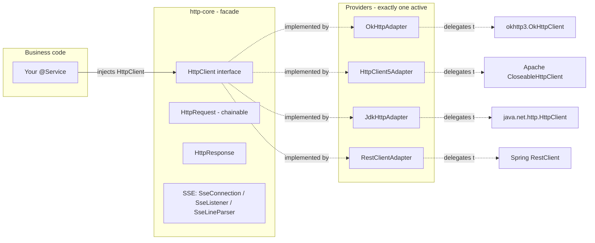
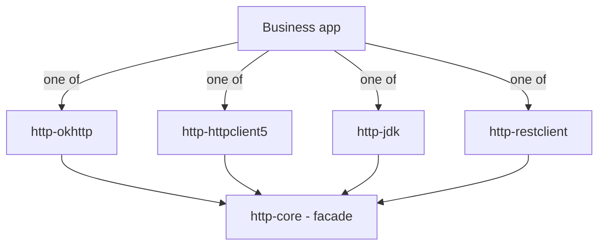

# Atlas Richie HTTP Component (atlas-richie-component-http)

> Unified **HTTP client facade** for Spring Boot 4.x on JDK 25. One API (`HttpClient` + `HttpRequest` + `HttpResponse`), four pluggable providers — **OkHttp** (default), **Apache HttpClient 5**, **JDK 11+ `java.net.http.HttpClient`**, and **Spring `RestClient`**. Pick a provider with one line of YAML; business code never changes.

---

## 📖 Contents

- [📖 Overview](#📖-overview)
  - [What this component is — and what it isn't](#what-this-component-is-—-and-what-it-isnt)
- [✨ Features](#✨-features)
  - [Core capabilities](#core-capabilities)
  - [Provider matrix](#provider-matrix)
- [🏗️ Architecture & Module Layout](#🏗️-architecture-&-module-layout)
  - [Runtime wiring](#runtime-wiring)
  - [Dependency relationships](#dependency-relationships)
- [🚀 Quick Start](#🚀-quick-start)
  - [1. Add the dependencies](#1-add-the-dependencies)
  - [2. Pick a provider](#2-pick-a-provider)
  - [3. Inject `HttpClient` and call](#3-inject-httpclient-and-call)
  - [4. First requests in each execution mode](#4-first-requests-in-each-execution-mode)
- [🔧 Core Capabilities](#🔧-core-capabilities)
  - [1. Request building — `HttpRequest` chainable Builder](#1-request-building-—-httprequest-chainable-builder)
  - [2. Execution modes](#2-execution-modes)
  - [3. Response handling — `HttpResponse`](#3-response-handling-—-httpresponse)
  - [4. SSE — `http.sse(url, listener)`](#4-sse-—-httpsseurl,-listener)
  - [5. Multipart upload](#5-multipart-upload)
  - [6. Strict SSL master switch](#6-strict-ssl-master-switch)
- [⚙️ Configuration Reference](#⚙️-configuration-reference)
  - [Common — `platform.component.http`](#common-—-platformcomponenthttp)
  - [OkHttp — `platform.component.http.okhttp`](#okhttp-—-platformcomponenthttpokhttp)
  - [HttpClient5 — `platform.component.http.httpclient5`](#httpclient5-—-platformcomponenthttphttpclient5)
  - [JDK — `platform.component.http.jdk`](#jdk-—-platformcomponenthttpjdk)
  - [RestClient — no provider-specific config](#restclient-—-no-provider-specific-config)
- [🎯 Best Practices](#🎯-best-practices)
  - [1. Pick the right provider](#1-pick-the-right-provider)
  - [2. Timeout tuning](#2-timeout-tuning)
  - [3. Large file uploads](#3-large-file-uploads)
  - [4. Standardize common headers](#4-standardize-common-headers)
  - [5. Always check `isSuccessful()` before deserializing](#5-always-check-issuccessful-before-deserializing)
  - [6. Combine with platform desensitization for logs](#6-combine-with-platform-desensitization-for-logs)
- [⚠️ Known Limitations](#⚠️-known-limitations)
- [❓ FAQ](#❓-faq)
  - [Q1: `NoSuchBeanDefinitionException: HttpClient` on startup](#q1-nosuchbeandefinitionexception-httpclient-on-startup)
  - [Q2: `BeanDefinitionOverrideException` after switching `provider`](#q2-beandefinitionoverrideexception-after-switching-provider)
  - [Q3: How do I set a per-request timeout?](#q3-how-do-i-set-a-per-request-timeout?)
  - [Q4: Which thread does the async callback run on?](#q4-which-thread-does-the-async-callback-run-on?)
  - [Q5: Which provider should I use for file upload?](#q5-which-provider-should-i-use-for-file-upload?)
  - [Q6: How do I disable request logs?](#q6-how-do-i-disable-request-logs?)
  - [Q7: Can I share my own Spring `RestClient` Bean?](#q7-can-i-share-my-own-spring-restclient-bean?)
  - [Q8: How do I handle 4xx / 5xx?](#q8-how-do-i-handle-4xx-/-5xx?)
  - [Q9: Will PATCH / HEAD / OPTIONS be added later?](#q9-will-patch-/-head-/-options-be-added-later?)
  - [Q10: Can I trust all certificates for testing only?](#q10-can-i-trust-all-certificates-for-testing-only?)
- [📚 Further Reading](#📚-further-reading)
---

## 📖 Overview

| Item | Value |
|------|-------|
| **Artifact set** | `atlas-richie-component-http` (parent POM) + 5 sub-modules |
| **Category** | Cross-cutting infrastructure — HTTP client facade |
| **JDK / Spring Boot** | JDK 25 / Spring Boot 4.x |
| **JSON stack** | Jackson 3 (`tools.jackson.*`) |
| **Default provider** | `okhttp` |

### `What` this component is — and what it isn't

| ✅ It gives you | ❌ It does not give you |
|-----------------|------------------------|
| One facade `HttpClient` + chainable `HttpRequest` | A retry / circuit-breaker / rate-limit layer (use [`atlas-richie-component-microservice`](../atlas-richie-component-microservice/README.md) or Sentinel) |
| Sync / async-callback / `CompletableFuture` execution | A server-side HTTP framework |
| 4 pluggable providers via `platform.component.http.provider` | A Netty / servlet container |
| JSON / XML / SOAP / form / multipart content types | Auto-generated HTTP clients (e.g. OpenAPI) |
| SSE (Server-Sent Events) long-lived streaming | WebSocket / gRPC streaming |
| `strictSsl` master switch across providers | mTLS per-route configuration |

---

## ✨ Features

### `Core` capabilities

- ✅ **Single facade `HttpClient`** — one API across OkHttp / HttpClient5 / JDK / RestClient; switch by YAML, not by code.
- ✅ **Chainable `HttpRequest`** — `http.get(url).param().header().timeout().execute()` expresses a full request in one line.
- ✅ **Three execution modes** — sync / async-callback / `CompletableFuture`, all returning the same `HttpResponse`.
- ✅ **Four content types** — `asJson()` / `asXml()` / `asSoap()` / `asForm()` make business intent explicit; multipart for uploads.
- ✅ **Pluggable providers** — `platform.component.http.provider` selects OkHttp / HttpClient5 / RestClient / JDK without code change.
- ✅ **SSE streaming** — `http.sse(url, listener)` opens a `text/event-stream` long-lived connection.
- ✅ **Generic deserialization** — `TypeReference<Page<User>>`, `TypeReference<Map<String, List<X>>>` etc.
- ✅ **SSL master switch** — `platform.component.http.strict-ssl=false` enables trust-all with a clear startup WARN.

### `Provider` matrix

| Provider | Use case | Strengths |
|----------|---------|-----------|
| **`okhttp`** (default) | General Web API, HTTPS, connection pool, response cache | Balanced performance, mature pool, configurable log level |
| **`http_client_5`** | High concurrency, Apache-ecosystem alignment | Fine-grained pool (`maxTotal` / `defaultMaxPerRoute`), TLS 1.2/1.3, **full multipart** |
| **`jdk`** | Zero 3rd-party deps, HTTP/2 + virtual threads | Built into JDK 11+, virtual-thread-friendly (`use-virtual-threads=true`) |
| **`rest_client`** | You already use Spring `RestClient` | Reuses the Spring `RestClient.Builder` you configured |

---

## 🏗️ Architecture & Module Layout

```
atlas-richie-component-http                      ← parent POM (no code)
├── atlas-richie-component-http-core             ← facade API: HttpClient / HttpRequest / HttpResponse / SSE
├── atlas-richie-component-http-okhttp           ← provider: OkHttp
├── atlas-richie-component-http-httpclient5      ← provider: Apache HttpClient 5
├── atlas-richie-component-http-jdk              ← provider: JDK 11+ java.net.http.HttpClient
└── atlas-richie-component-http-restclient       ← provider: Spring 6+ RestClient
```

### `Runtime` wiring



### `Dependency` relationships



> Only **one** provider should be on the classpath. Multiple providers will produce multiple `HttpClient` beans and Spring will fail with `BeanDefinitionOverrideException` unless one is explicitly `@Primary`.

---

## 🚀 Quick Start

### 1) `Add` the dependencies

```xml
<!-- Required: facade API -->
<dependency>
    <groupId>com.richie.component</groupId>
    <artifactId>atlas-richie-component-http-core</artifactId>
</dependency>

<!-- Pick exactly one provider -->
<dependency>
    <groupId>com.richie.component</groupId>
    <artifactId>atlas-richie-component-http-okhttp</artifactId>
</dependency>
<!-- Alternatives:
<dependency><groupId>com.richie.component</groupId><artifactId>atlas-richie-component-http-httpclient5</artifactId></dependency>
<dependency><groupId>com.richie.component</groupId><artifactId>atlas-richie-component-http-jdk</artifactId></dependency>
<dependency><groupId>com.richie.component</groupId><artifactId>atlas-richie-component-http-restclient</artifactId></dependency>
-->
```

> **You must include exactly one provider** to get the `HttpClient` bean. With `core` only, startup throws `NoSuchBeanDefinitionException`.

### 2) `Pick` a provider

```yaml
platform:
  component:
    http:
      provider: okhttp         # okhttp | http_client_5 | jdk | rest_client
      strict-ssl: true         # default; only flip to false in dev/staging
```

### 3) Inject `HttpClient` and call

```java
import com.richie.component.http.core.HttpClient;
import org.springframework.stereotype.Service;

@Service
@RequiredArgsConstructor
public class UserService {

    private final HttpClient http;

    public User getById(String id) {
        return http.get("https://api.example.com/users/{id}", id)
                   .execute(User.class);
    }
}
```

### 4) `First` requests in each execution mode

```java
// Sync — deserialize to POJO
User user = http.get("https://api.example.com/users/123").execute(User.class);

// Sync — POST a body, auto-serialized to JSON
String response = http.post("https://api.example.com/users", newUser).execute();

// Async (callback)
http.get("https://api.example.com/users")
    .async(new AsyncCallback<List<User>>() {
        @Override public void onResponse(HttpResponse resp, List<User> data) { /* ... */ }
        @Override public void onFailure(IOException ex) { /* ... */ }
    }, new TypeReference<List<User>>() {});

// CompletableFuture
CompletableFuture<User> f = http.get(url).future(User.class);
User user = f.get(5, TimeUnit.SECONDS);

// SSE
SseConnection conn = http.sse("https://api.example.com/events", new SseListener() {
    @Override public void onEvent(SseConnection c, SseEvent e) {
        log.info("event id={} data={}", e.id(), e.data());
    }
});
```

---

## 🔧 Core Capabilities

### 1) Request building — `HttpRequest` chainable Builder

| Method | Purpose |
|--------|---------|
| `param(k, v)` / `params(map)` | Add URL query parameters (UTF-8 encoded, fragment-safe) |
| `header(k, v)` / `headers(map)` | Add HTTP request headers |
| `timeout(Duration)` | Override global timeout for **this** request |
| `asJson()` | `application/json; charset=utf-8` |
| `asXml()` | `application/xml; charset=utf-8` |
| `asSoap()` | `application/soap+xml` |
| `asForm()` | `application/x-www-form-urlencoded` |
| `multipart(fieldName, fileName, InputStream)` | `multipart/form-data` upload (single file) |

> The default `Content-Type` is `application/json; charset=utf-8`. Body objects are JSON-serialized automatically (String → UTF-8 bytes; POJO → Jackson).

### 2) `Execution` modes

| Mode | Returns | Use when |
|------|---------|----------|
| `execute()` | `HttpResponse` (raw status / headers / body) | You need fine-grained control over status handling |
| `execute(Class<T>)` / `execute(TypeReference<T>)` | Deserialized object | You just want the result |
| `async(callback, type)` | void | You want fire-and-forget with typed callback |
| `future(type)` | `CompletableFuture<T>` | You want to chain / combine with other async work |

### 3) Response handling — `HttpResponse`

| Method | Returns |
|--------|---------|
| `statusCode()` | HTTP status code |
| `isSuccessful()` | `true` iff 200 ≤ status < 300 |
| `headers()` | `Map<String, List<String>>` (HTTP-style multi-value headers) |
| `body()` | `byte[]` (always available in current providers) |
| `bodyAsString()` | UTF-8 decoded string |
| `bodyAs(Class<T>)` / `bodyAs(TypeReference<T>)` | JSON-deserialized object |

### 4) SSE — `http.sse(url, listener)`

Open a long-lived `text/event-stream` connection:

```java
SseConnection conn = http.sse("https://api.example.com/events", new SseListener() {
    @Override public void onOpen(SseConnection c) { log.info("open: status={}", c.statusCode()); }
    @Override public void onEvent(SseConnection c, SseEvent e) { /* e.id(), e.event(), e.data(), e.retry() */ }
    @Override public void onClosed(SseConnection c) { log.info("closed"); }
    @Override public void onFailure(SseConnection c, Throwable cause) { log.error("sse failure", cause); }
});
```

- `SseListener` has all-`default` methods; override only what you care about.
- `SseLineParser` (core) implements the SSE wire protocol per [HTML5 SSE spec](https://html.spec.whatwg.org/multipage/server-sent-events.html): empty line = event boundary, `:` prefix = comment, multi-line `data:` is `"
"`-joined, `retry:` only accepts positive integers.
- `SseConnection.close()` is idempotent — safe to call from any thread.

### 5) `Multipart` upload

```java
try (InputStream in = new FileInputStream("/tmp/report.pdf")) {
    HttpResponse resp = http.post("https://api.example.com/files")
        .param("bucket", "reports")                       // form fields
        .param("category", "monthly")
        .header("Authorization", "Bearer " + token)
        .multipart("file", "report.pdf", in)              // multipart field
        .timeout(Duration.ofMinutes(2))
        .execute();
}
```

- Currently **single file** per request. Multi-file uploads: loop, or use `http_client_5` provider which has the most mature multipart support.

### 6) `Strict` `SSL` master switch

```yaml
platform:
  component:
    http:
      strict-ssl: false   # ⚠️ WARN at startup; trust-all certs
```

- Currently implemented for **OkHttp** and **JDK** providers.
- **HttpClient5** and **RestClient** providers inherit the default platform `SSLContext`; if you need trust-all there, configure your own SSLContext via the underlying client builder.

---

## ⚙️ Configuration Reference

All properties are bound under the `platform.component.http` prefix.

### Common — `platform.component.http`

| Property | Type | Default | Description |
|----------|------|---------|-------------|
| `provider` | enum | `okhttp` | One of `okhttp` / `http_client_5` / `jdk` / `rest_client` |
| `strict-ssl` | boolean | `true` | When `false`, enable trust-all with WARN log |

### OkHttp — `platform.component.http.okhttp`

| Property | Type | Default | Description |
|----------|------|---------|-------------|
| `read-timeout` / `-time-unit` | int / TimeUnit | `5` / `SECONDS` | Socket read timeout |
| `write-timeout` / `-time-unit` | int / TimeUnit | `5` / `SECONDS` | Socket write timeout (raise for large uploads) |
| `connect-timeout` / `-time-unit` | int / TimeUnit | `5` / `SECONDS` | TCP/TLS handshake timeout |
| `call-timeout` / `-time-unit` | int / TimeUnit | `15` / `SECONDS` | End-to-end timeout; should be ≈ connect+read+write, ideally ≤ 3× the sum |
| `level` | `NONE` / `BASIC` / `HEADERS` / `BODY` | `BODY` | OkHttp `HttpLoggingInterceptor` verbosity |
| `enable-cache` / `cache-path` / `cache-size` (MB) | boolean / String / int | `false` / `/opt/okhttp3/cache/` / `100` | GET-only response cache |
| `max-requests` / `max-requests-per-host` | int / int | `250` / `25` | Dispatcher concurrency caps |
| `keep-alive-duration` / `-time-unit` | long / TimeUnit | `5` / `MINUTES` | Connection-pool idle retention |

### HttpClient5 — `platform.component.http.httpclient5`

| Property | Type | Default | Description |
|----------|------|---------|-------------|
| `connection-request-timeout` / `-time-unit` | int / TimeUnit | `5` / `SECONDS` | Wait time for a connection from the pool |
| `response-timeout` / `-time-unit` | int / TimeUnit | `5` / `SECONDS` | Wait for server response after request is sent |
| `max-total` | int | `250` | Pool total connections |
| `default-max-per-route` | int | `25` | Pool connections per route |

### JDK — `platform.component.http.jdk`

| Property | Type | Default | Description |
|----------|------|---------|-------------|
| `connect-timeout` | Duration | `5s` | TCP/TLS handshake timeout |
| `version` | `HTTP_1_1` / `HTTP_2` | `HTTP_2` | Protocol version |
| `follow-redirects` | boolean | `false` | Auto-follow 3xx |
| `priority` | int (1..256) | `16` | HTTP/2 priority (lower = higher) |
| `keep-alive-time` | Duration | `30s` | Idle connection retention |
| `max-concurrent-streams` | int | `100` | HTTP/2 max concurrent streams |
| `proxy-host` / `proxy-port` | String / int | – / `80` | Optional proxy |
| `use-virtual-threads` | boolean | `true` | Async executor uses virtual threads (JDK 21+/25) |

### `RestClient` — no provider-specific config

RestClient provider reuses the Spring `RestClient` bean if you provide one. To customize:

```java
@Bean
public RestClient.Builder customRestClientBuilder() {
    return RestClient.builder()
                     .baseUrl("https://api.example.com")
                     .defaultHeader("X-Custom", "value");
}
```

---

## 🎯 Best Practices

### 1) `Pick` the right provider

| Scenario | Provider | Why |
|----------|----------|-----|
| General Web API + HTTPS | `okhttp` (default) | Balanced, mature pool, log level adjustable |
| Apache-ecosystem alignment | `http_client_5` | Fine-grained pool, mature multipart |
| Zero 3rd-party deps + JDK 25 | `jdk` | Built-in, virtual threads native |
| Already using Spring `RestClient` | `rest_client` | Reuse your configured builder |

### 2) `Timeout` tuning

```yaml
# Internal services — low latency, high concurrency
connect-timeout: 3
read-timeout: 5
write-timeout: 5
call-timeout: 15

# External services — tolerate slow responses
connect-timeout: 10
read-timeout: 30
write-timeout: 30
call-timeout: 90

# File uploads — raise write-timeout
write-timeout: 120
call-timeout: 300
```

### 3) `Large` file uploads

```java
try (InputStream in = new BufferedInputStream(new FileInputStream(bigFile))) {
    http.post(uploadUrl, null)
        .multipart("file", bigFile.getName(), in)
        .timeout(Duration.ofMinutes(5))    // override global default per request
        .execute();
}
```

### 4) `Standardize` common headers

```java
private HttpRequest withCommonHeaders(HttpRequest req) {
    return req.header("X-Trace-Id", TraceContext.traceId())
              .header("X-Request-Time", Instant.now().toString());
}
```

### 5) Always check `isSuccessful()` before deserializing

```java
HttpResponse resp = http.get(url).execute();
if (resp.isSuccessful()) {
    return resp.bodyAs(User.class);
} else {
    log.warn("Remote failure: status={} body={}", resp.statusCode(), resp.bodyAsString());
    throw new BizException("REMOTE_CALL_FAILED", resp.statusCode());
}
```

### 6) `Combine` with platform desensitization for logs

If you log outbound request / response bodies for debugging, route them through `DesensitizeUtils.toSafeJson(...)` from [`atlas-richie-component-desensitize-logging`](../atlas-richie-component-desensitize/atlas-richie-component-desensitize-logging/README.md) — otherwise tokens / IDs / signatures leak into your log files.

---

## ⚠️ Known Limitations

| Limitation | Impact | Workaround |
|------------|--------|------------|
| **HTTP method set is fixed**: GET / POST / PUT / DELETE — **no PATCH / HEAD / OPTIONS** | Cannot call PATCH endpoints directly | Use a different provider or wrap the underlying client manually |
| **Multipart is single-file** | Multi-file uploads need a loop | Loop, or switch to `http_client_5` (most mature multipart) |
| **Body is read into `byte[]` once** | All four providers use `BodyHandlers.ofByteArray()` (or equivalent) | For GB-scale downloads, wait for streaming support in your chosen provider |
| **`strict-ssl=false` is OkHttp + JDK only** | HttpClient5 / RestClient don't honor this switch | Configure trust-all on the underlying builder manually |
| **No built-in interceptor hooks** (e.g. auth refresh, retry) | Cross-cutting retry / auth policies are missing | Wrap `HttpRequest` in a decorator or inject the underlying client |
| **Multiple providers on the classpath** | Multiple `HttpClient` Beans — Spring fails with `BeanDefinitionOverrideException` | Keep exactly one provider; or annotate one `@Primary` |
| **SSE: no auto-reconnect** | The listener's `onFailure` fires once, no retry | Implement your own reconnect loop in `onFailure`; check `retry` field of last `SseEvent` |

---

## ❓ FAQ

### Q1 — `NoSuchBeanDefinitionException: HttpClient` on startup

You imported `http-core` but no provider. Add **exactly one** provider:

```xml
<dependency>
    <groupId>com.richie.component</groupId>
    <artifactId>atlas-richie-component-http-okhttp</artifactId>
</dependency>
```

### Q2 — `BeanDefinitionOverrideException` after switching `provider`

Multiple `HttpClient` Beans are on the classpath. Either:
- Keep only one provider dependency; or
- Annotate your preferred `HttpClient` with `@Primary` in your own `@Configuration`.

### `Q3` — `How` do `I` set a per-request timeout?

```java
http.get(url).timeout(Duration.ofSeconds(5)).execute(JsonNode.class);
```

Per-request `timeout()` overrides provider defaults for **that** call only.

### `Q4` — `Which` thread does the async callback run on?

Depends on the provider:
- **OkHttp** — `Dispatcher` thread pool (configurable).
- **HttpClient5** — `CompletableFuture.runAsync(ForkJoinPool.commonPool())` (note: blocks a common-pool thread).
- **JDK** — virtual-thread-per-task executor (`use-virtual-threads=true`).
- **RestClient** — `CompletableFuture.runAsync(...)` similar to HttpClient5.

**Be thread-safe** in callbacks. Move heavy work to a business thread pool.

### `Q5` — `Which` provider should `I` use for file upload?

**HttpClient5** — the most mature multipart support. OkHttp / JDK / RestClient currently have partial support for `multipart()` and may produce empty bodies in some edge cases.

### `Q6` — `How` do `I` disable request logs?

```yaml
platform:
  component:
    http:
      okhttp:
        level: NONE
```

Only OkHttp exposes a configurable log level right now.

### Q7 — Can I share my own Spring `RestClient` Bean?

Yes. RestClient provider reuses any `RestClient.Builder` you provide:

```java
@Bean
public RestClient.Builder customRestClientBuilder() { ... }
```

### `Q8` — `How` do `I` handle 4xx / 5xx?

Providers do **not** throw on non-2xx — use `isSuccessful()`:

```java
if (!resp.isSuccessful()) {
    log.warn("Remote failure: status={} body={}", resp.statusCode(), resp.bodyAsString());
    throw new BizException("REMOTE_CALL_FAILED", resp.statusCode());
}
```

### `Q9` — `Will` `PATCH` / `HEAD` / `OPTIONS` be added later?

Planned. Add to `HttpMethod` enum + handle the new case in each provider's `buildRequest(...)`; the facade signature does not change.

### `Q10` — `Can` `I` trust all certificates for testing only?

Yes — but only on `okhttp` or `jdk`. Set `platform.component.http.strict-ssl=false`; the component logs a clear WARN at startup. **Never** use this in production.

---

## 📚 Further Reading

- **Sub-module docs (each follows the same 10-section skeleton)**:
  - [`atlas-richie-component-http-core`](./atlas-richie-component-http-core/README.md) — facade API: `HttpClient`, `HttpRequest`, `HttpResponse`, SSE.
  - [`atlas-richie-component-http-okhttp`](./atlas-richie-component-http-okhttp/README.md) — OkHttp provider.
  - [`atlas-richie-component-http-httpclient5`](./atlas-richie-component-http-httpclient5/README.md) — Apache HttpClient 5 provider.
  - [`atlas-richie-component-http-jdk`](./atlas-richie-component-http-jdk/README.md) — JDK 11+ `java.net.http.HttpClient` provider.
  - [`atlas-richie-component-http-restclient`](./atlas-richie-component-http-restclient/README.md) — Spring `RestClient` provider.
- **Related platform components**:
  - [`atlas-richie-component-desensitize-logging`](../atlas-richie-component-desensitize/atlas-richie-component-desensitize-logging/README.md) — mask sensitive fields in HTTP debug logs.
  - [`atlas-richie-component-microservice`](../atlas-richie-component-microservice/README.md) — Sentinel / OpenFeign for retry / circuit-breaker on top of `HttpClient`.
- **External references**:
  - [OkHttp official docs](https://square.github.io/okhttp/)
  - [Apache HttpClient 5 docs](https://hc.apache.org/httpcomponents-client-5.2.x/)
  - [JDK 11+ `java.net.http.HttpClient` docs](https://docs.oracle.com/en/java/javase/21/docs/api/java.net.http/java/net/http/HttpClient.html)
  - [Spring `RestClient` docs](https://docs.spring.io/spring-framework/reference/integration/rest-clients.html)
  - [HTML Living Standard — Server-Sent Events](https://html.spec.whatwg.org/multipage/server-sent-events.html)

---

**Richie HTTP Component** — one facade, four providers, zero business-code churn 🚀
