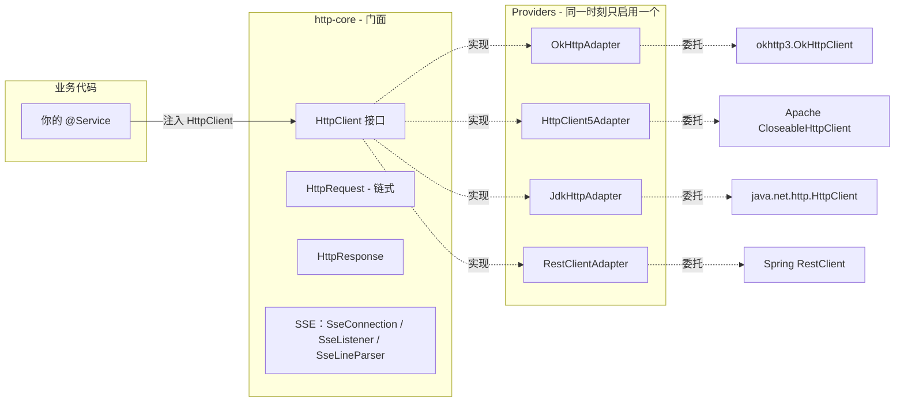
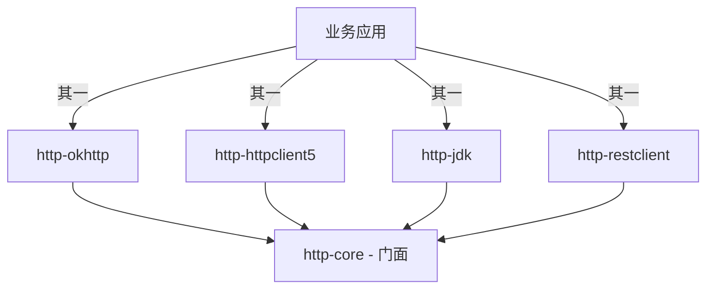

# Atlas Richie HTTP组件 (atlas-richie-component-http)

> 面向 Spring Boot 4.x / JDK 25 的**统一 HTTP 客户端门面**。一套 API（`HttpClient` + `HttpRequest` + `HttpResponse`），四种可插拔实现——**OkHttp**（默认）、**Apache HttpClient 5**、**JDK 11+ `java.net.http.HttpClient`**、**Spring `RestClient`**。一行 YAML 切换底层，业务代码零改动。

---

## 📖 目录

- [📖 概述](#📖-概述)
  - [本组件的"是"与"不是"](#本组件的是与不是)
- [✨ 功能特性](#✨-功能特性)
  - [核心能力](#核心能力)
  - [Provider 矩阵](#provider-矩阵)
- [🏗️ 架构与模块布局](#🏗️-架构与模块布局)
  - [运行时装配](#运行时装配)
  - [依赖关系](#依赖关系)
- [🚀 快速开始](#🚀-快速开始)
  - [1. 引入依赖](#1-引入依赖)
  - [2. 选择 Provider](#2-选择-provider)
  - [3. 注入 `HttpClient`](#3-注入-httpclient)
  - [4. 四种执行模式示例](#4-四种执行模式示例)
- [🔧 核心能力](#🔧-核心能力)
  - [1. 请求构建——`HttpRequest` 链式 Builder](#1-请求构建——httprequest-链式-builder)
  - [2. 执行模式](#2-执行模式)
  - [3. 响应处理——`HttpResponse`](#3-响应处理——httpresponse)
  - [4. SSE——`http.sse(url, listener)`](#4-sse——httpsseurl,-listener)
  - [5. Multipart 上传](#5-multipart-上传)
  - [6. Strict SSL 主开关](#6-strict-ssl-主开关)
- [⚙️ 配置参考](#⚙️-配置参考)
  - [公共——`platform.component.http`](#公共——platformcomponenthttp)
  - [OkHttp——`platform.component.http.okhttp`](#okhttp——platformcomponenthttpokhttp)
  - [HttpClient5——`platform.component.http.httpclient5`](#httpclient5——platformcomponenthttphttpclient5)
  - [JDK——`platform.component.http.jdk`](#jdk——platformcomponenthttpjdk)
  - [RestClient——无 Provider 专属配置](#restclient——无-provider-专属配置)
- [🎯 最佳实践](#🎯-最佳实践)
  - [1. 选择合适的 Provider](#1-选择合适的-provider)
  - [2. 超时调优](#2-超时调优)
  - [3. 大文件上传](#3-大文件上传)
  - [4. 统一 Header 管理](#4-统一-header-管理)
  - [5. 反序列化前先检查成功状态](#5-反序列化前先检查成功状态)
  - [6. 与平台脱敏组件配合做日志](#6-与平台脱敏组件配合做日志)
- [⚠️ 已知限制](#⚠️-已知限制)
- [❓ 常见问题](#❓-常见问题)
  - [Q1：启动报 `NoSuchBeanDefinitionException: HttpClient` 怎么办？](#q1：启动报-nosuchbeandefinitionexception-httpclient-怎么办？)
  - [Q2：切换 `provider` 后启动报 `BeanDefinitionOverrideException`？](#q2：切换-provider-后启动报-beandefinitionoverrideexception？)
  - [Q3：如何对单个请求设置超时？](#q3：如何对单个请求设置超时？)
  - [Q4：异步回调在哪个线程执行？](#q4：异步回调在哪个线程执行？)
  - [Q5：上传文件应该用哪个 Provider？](#q5：上传文件应该用哪个-provider？)
  - [Q6：如何禁用请求日志？](#q6：如何禁用请求日志？)
  - [Q7：能否共享自己的 Spring `RestClient` Bean？](#q7：能否共享自己的-spring-restclient-bean？)
  - [Q8：如何处理 4xx / 5xx？](#q8：如何处理-4xx-/-5xx？)
  - [Q9：未来会支持 PATCH / HEAD / OPTIONS 吗？](#q9：未来会支持-patch-/-head-/-options-吗？)
  - [Q10：能否在测试环境跳过证书校验？](#q10：能否在测试环境跳过证书校验？)
- [📚 相关文档](#📚-相关文档)
---

## 📖 概述

| 项 | 值 |
|---|---|
| **坐标集** | `atlas-richie-component-http`（父 POM） + 5 个子模块 |
| **类别** | 横切基础设施——HTTP 客户端门面 |
| **JDK / Spring Boot** | JDK 25 / Spring Boot 4.x |
| **JSON 栈** | Jackson 3（`tools.jackson.*`） |
| **默认 Provider** | `okhttp` |

### 本组件的"是"与"不是"

| ✅ 提供 | ❌ 不提供 |
|--------|---------|
| 统一门面 `HttpClient` + 链式 `HttpRequest` | 重试 / 熔断 / 限流层（用 `atlas-richie-component-microservice` (microservice has no ZH README) 或 Sentinel） |
| 同步 / 异步回调 / `CompletableFuture` 三种执行模式 | 服务端 HTTP 框架 |
| 4 个可插拔 Provider，通过 `platform.component.http.provider` 切换 | Netty / Servlet 容器 |
| JSON / XML / SOAP / Form / Multipart 内容类型 | 自动生成 HTTP 客户端（如 OpenAPI） |
| SSE（Server-Sent Events）长连接流 | WebSocket / gRPC 流 |
| `strictSsl` 主开关（跨 Provider） | 按路由粒度的 mTLS |

---

## ✨ 功能特性

### 核心能力

- ✅ **单一门面 `HttpClient`**：一套 API 覆盖 OkHttp / HttpClient5 / JDK / RestClient；通过 YAML 切换，无需改代码。
- ✅ **链式 `HttpRequest`**：`http.get(url).param().header().timeout().execute()` 一行表达完整请求。
- ✅ **三种执行模式**：同步 / 异步回调 / `CompletableFuture`，均返回同一 `HttpResponse`。
- ✅ **四种内容类型**：`asJson()` / `asXml()` / `asSoap()` / `asForm()` 显式表达业务意图；`multipart()` 处理文件上传。
- ✅ **可插拔 Provider**：`platform.component.http.provider` 切换 OkHttp / HttpClient5 / RestClient / JDK。
- ✅ **SSE 长连接流**：`http.sse(url, listener)` 打开 `text/event-stream` 长连接。
- ✅ **泛型反序列化**：`TypeReference<Page<User>>`、`TypeReference<Map<String, List<X>>>` 等。
- ✅ **SSL 主开关**：`platform.component.http.strict-ssl=false` 启用 trust-all，启动时输出 WARN 日志。

### `Provider` 矩阵

| Provider | 适用场景 | 关键优势 |
|----------|---------|---------|
| **`okhttp`**（默认） | 通用 Web API、HTTPS、连接池、响应缓存 | 性能均衡、连接池成熟、日志级别可调 |
| **`http_client_5`** | 高并发、与 Apache 生态混用 | 精细连接池（`maxTotal` / `defaultMaxPerRoute`）、TLS 1.2/1.3、**Multipart 最成熟** |
| **`jdk`** | 零三方依赖诉求、HTTP/2 + 虚拟线程 | JDK 11+ 内置，JDK 21+/25 原生虚拟线程（`use-virtual-threads=true`） |
| **`rest_client`** | 已用 Spring `RestClient` | 复用业务侧已配置的 `RestClient.Builder` |

---

## 🏗️ 架构与模块布局

```
atlas-richie-component-http                      ← 父 POM（不含代码）
├── atlas-richie-component-http-core             ← 门面 API：HttpClient / HttpRequest / HttpResponse / SSE
├── atlas-richie-component-http-okhttp           ← Provider：OkHttp
├── atlas-richie-component-http-httpclient5      ← Provider：Apache HttpClient 5
├── atlas-richie-component-http-jdk              ← Provider：JDK 11+ java.net.http.HttpClient
└── atlas-richie-component-http-restclient       ← Provider：Spring 6+ RestClient
```

### 运行时装配



### 依赖关系



> 只能引入**一个** Provider。引入多个会产生多个 `HttpClient` Bean，Spring 启动报 `BeanDefinitionOverrideException`（除非显式 `@Primary`）。

---

## 🚀 快速开始

### 1) 引入依赖

```xml
<!-- 必选：门面 API -->
<dependency>
    <groupId>com.richie.component</groupId>
    <artifactId>atlas-richie-component-http-core</artifactId>
</dependency>

<!-- 选一个 Provider（四选一） -->
<dependency>
    <groupId>com.richie.component</groupId>
    <artifactId>atlas-richie-component-http-okhttp</artifactId>
</dependency>
<!-- 其他可选 Provider（二选一或都不加）：
<dependency><groupId>com.richie.component</groupId><artifactId>atlas-richie-component-http-httpclient5</artifactId></dependency>
<dependency><groupId>com.richie.component</groupId><artifactId>atlas-richie-component-http-jdk</artifactId></dependency>
<dependency><groupId>com.richie.component</groupId><artifactId>atlas-richie-component-http-restclient</artifactId></dependency>
-->
```

> **必须**引入一个 Provider 才能拿到 `HttpClient` Bean。仅引入 `core` 时启动报 `NoSuchBeanDefinitionException`。

### 2) 选择 `Provider`

```yaml
platform:
  component:
    http:
      provider: okhttp         # okhttp | http_client_5 | jdk | rest_client
      strict-ssl: true         # 默认；仅开发/联调可置 false
```

### 3) 注入 `HttpClient`

```java
import com.richie.component.http.core.HttpClient;
import org.springframework.stereotype.Service;

@Service
@RequiredArgsConstructor
public class UserService {

    private final HttpClient http;

    public User getById(String id) {
        return http.get("https://api.example.com/users/{id}", id)
                   .execute(User.class);
    }
}
```

### 4) 四种执行模式示例

```java
// 同步：自动反序列化为 POJO
User user = http.get("https://api.example.com/users/123").execute(User.class);

// 同步：POST 对象，自动序列化为 JSON
String response = http.post("https://api.example.com/users", newUser).execute();

// 异步回调
http.get("https://api.example.com/users")
    .async(new AsyncCallback<List<User>>() {
        @Override public void onResponse(HttpResponse resp, List<User> data) { /* ... */ }
        @Override public void onFailure(IOException ex) { /* ... */ }
    }, new TypeReference<List<User>>() {});

// CompletableFuture
CompletableFuture<User> f = http.get(url).future(User.class);
User user = f.get(5, TimeUnit.SECONDS);

// SSE
SseConnection conn = http.sse("https://api.example.com/events", new SseListener() {
    @Override public void onEvent(SseConnection c, SseEvent e) {
        log.info("event id={} data={}", e.id(), e.data());
    }
});
```

---

## 🔧 核心能力

### 1) 请求构建——`HttpRequest` 链式 Builder

| 方法 | 作用 |
|------|------|
| `param(k, v)` / `params(map)` | URL 查询参数（UTF-8 编码，fragment 安全） |
| `header(k, v)` / `headers(map)` | HTTP 请求头 |
| `timeout(Duration)` | 本次请求覆盖全局超时 |
| `asJson()` | `application/json; charset=utf-8` |
| `asXml()` | `application/xml; charset=utf-8` |
| `asSoap()` | `application/soap+xml` |
| `asForm()` | `application/x-www-form-urlencoded` |
| `multipart(fieldName, fileName, InputStream)` | `multipart/form-data` 上传（单文件） |

> 默认 `Content-Type` 为 `application/json; charset=utf-8`。Body 对象自动 JSON 序列化（String → UTF-8 字节；POJO → Jackson）。

### 2) 执行模式

| 模式 | 返回 | 适用场景 |
|------|------|---------|
| `execute()` | `HttpResponse`（原始状态/头/body） | 需要精细控制状态码处理 |
| `execute(Class<T>)` / `execute(TypeReference<T>)` | 反序列化对象 | 只想拿到结果 |
| `async(callback, type)` | void | 一次性 fire-and-forget，类型化回调 |
| `future(type)` | `CompletableFuture<T>` | 想链式 / 与其他异步任务组合 |

### 3) 响应处理——`HttpResponse`

| 方法 | 返回 |
|------|------|
| `statusCode()` | HTTP 状态码 |
| `isSuccessful()` | `200 ≤ status < 300` 即返回 `true` |
| `headers()` | `Map<String, List<String>>`（HTTP 多值头） |
| `body()` | `byte[]`（当前所有 Provider 都可用） |
| `bodyAsString()` | UTF-8 解码字符串 |
| `bodyAs(Class<T>)` / `bodyAs(TypeReference<T>)` | JSON 反序列化对象 |

### 4) SSE——`http.sse(url, listener)`

打开 `text/event-stream` 长连接：

```java
SseConnection conn = http.sse("https://api.example.com/events", new SseListener() {
    @Override public void onOpen(SseConnection c) { log.info("open: status={}", c.statusCode()); }
    @Override public void onEvent(SseConnection c, SseEvent e) { /* e.id(), e.event(), e.data(), e.retry() */ }
    @Override public void onClosed(SseConnection c) { log.info("closed"); }
    @Override public void onFailure(SseConnection c, Throwable cause) { log.error("sse failure", cause); }
});
```

- `SseListener` 所有方法都是 `default`，按需覆盖即可。
- `SseLineParser`（core）按 [HTML5 SSE 规范](https://html.spec.whatwg.org/multipage/server-sent-events.html) 解析：空行 = 事件边界，`:` 前缀 = 注释，多行 `data:` 以 `
` 拼接，`retry:` 仅接受正整数。
- `SseConnection.close()` 幂等，可在任意线程调用。

### 5) `Multipart` 上传

```java
try (InputStream in = new FileInputStream("/tmp/report.pdf")) {
    HttpResponse resp = http.post("https://api.example.com/files")
        .param("bucket", "reports")                       // 业务表单字段
        .param("category", "monthly")
        .header("Authorization", "Bearer " + token)
        .multipart("file", "report.pdf", in)              // multipart 字段
        .timeout(Duration.ofMinutes(2))
        .execute();
}
```

- 当前**单文件**。多文件：循环调用，或切换到 `http_client_5`（multipart 最成熟）。

### 6) `Strict` `SSL` 主开关

```yaml
platform:
  component:
    http:
      strict-ssl: false   # ⚠️ 启动输出 WARN；信任所有证书
```

- 当前在 **OkHttp** 和 **JDK** Provider 中已实现。
- **HttpClient5** / **RestClient** Provider 继承平台默认 `SSLContext`；如需 trust-all，需自行在底层 Builder 上配置。

---

## ⚙️ 配置参考

所有属性绑定到 `platform.component.http` 前缀。

### 公共——`platform.component.http`

| 属性 | 类型 | 默认值 | 说明 |
|------|------|--------|------|
| `provider` | enum | `okhttp` | 取值：`okhttp` / `http_client_5` / `jdk` / `rest_client` |
| `strict-ssl` | boolean | `true` | `false` 时启用 trust-all 并输出 WARN |

### OkHttp——`platform.component.http.okhttp`

| 属性 | 类型 | 默认值 | 说明 |
|------|------|--------|------|
| `read-timeout` / `-time-unit` | int / TimeUnit | `5` / `SECONDS` | 读超时 |
| `write-timeout` / `-time-unit` | int / TimeUnit | `5` / `SECONDS` | 写超时（大文件上传应调大） |
| `connect-timeout` / `-time-unit` | int / TimeUnit | `5` / `SECONDS` | TCP/TLS 握手超时 |
| `call-timeout` / `-time-unit` | int / TimeUnit | `15` / `SECONDS` | 端到端超时；应 ≈ connect+read+write，建议 ≤ 3× 之和 |
| `level` | `NONE` / `BASIC` / `HEADERS` / `BODY` | `BODY` | OkHttp `HttpLoggingInterceptor` 详细程度 |
| `enable-cache` / `cache-path` / `cache-size` (MB) | boolean / String / int | `false` / `/opt/okhttp3/cache/` / `100` | GET 响应缓存 |
| `max-requests` / `max-requests-per-host` | int / int | `250` / `25` | Dispatcher 并发上限 |
| `keep-alive-duration` / `-time-unit` | long / TimeUnit | `5` / `MINUTES` | 连接池空闲保留时长 |

### HttpClient5——`platform.component.http.httpclient5`

| 属性 | 类型 | 默认值 | 说明 |
|------|------|--------|------|
| `connection-request-timeout` / `-time-unit` | int / TimeUnit | `5` / `SECONDS` | 从连接池取连接的超时 |
| `response-timeout` / `-time-unit` | int / TimeUnit | `5` / `SECONDS` | 等待服务端响应的超时 |
| `max-total` | int | `250` | 连接池总连接数 |
| `default-max-per-route` | int | `25` | 每个路由最大连接数 |

### JDK——`platform.component.http.jdk`

| 属性 | 类型 | 默认值 | 说明 |
|------|------|--------|------|
| `connect-timeout` | Duration | `5s` | TCP/TLS 握手超时 |
| `version` | `HTTP_1_1` / `HTTP_2` | `HTTP_2` | 协议版本 |
| `follow-redirects` | boolean | `false` | 自动跟随 3xx |
| `priority` | int (1..256) | `16` | HTTP/2 优先级（越小越高） |
| `keep-alive-time` | Duration | `30s` | 空闲连接保留时长 |
| `max-concurrent-streams` | int | `100` | HTTP/2 最大并发流数 |
| `proxy-host` / `proxy-port` | String / int | – / `80` | 可选代理 |
| `use-virtual-threads` | boolean | `true` | 异步执行器使用虚拟线程（JDK 21+/25） |

### `RestClient`——无 `Provider` 专属配置

RestClient Provider 复用业务侧已配置的 Spring `RestClient` Bean。如需自定义：

```java
@Bean
public RestClient.Builder customRestClientBuilder() {
    return RestClient.builder()
                     .baseUrl("https://api.example.com")
                     .defaultHeader("X-Custom", "value");
}
```

---

## 🎯 最佳实践

### 1) 选择合适的 `Provider`

| 场景 | Provider | 原因 |
|------|----------|------|
| 通用 Web API + HTTPS | `okhttp`（默认） | 性能均衡、连接池成熟、日志级别可调 |
| Apache 生态混用 | `http_client_5` | 精细连接池、成熟的 multipart |
| 零三方依赖 + JDK 25 | `jdk` | 内置、原生虚拟线程 |
| 业务侧已用 Spring `RestClient` | `rest_client` | 复用已配置的 Builder |

### 2) 超时调优

```yaml
# 内部服务：低延迟高并发
connect-timeout: 3
read-timeout: 5
write-timeout: 5
call-timeout: 15

# 外部服务：容忍慢响应
connect-timeout: 10
read-timeout: 30
write-timeout: 30
call-timeout: 90

# 文件上传：放大 write-timeout
write-timeout: 120
call-timeout: 300
```

### 3) 大文件上传

```java
try (InputStream in = new BufferedInputStream(new FileInputStream(bigFile))) {
    http.post(uploadUrl, null)
        .multipart("file", bigFile.getName(), in)
        .timeout(Duration.ofMinutes(5))    // 本次请求覆盖全局默认
        .execute();
}
```

### 4) 统一 `Header` 管理

```java
private HttpRequest withCommonHeaders(HttpRequest req) {
    return req.header("X-Trace-Id", TraceContext.traceId())
              .header("X-Request-Time", Instant.now().toString());
}
```

### 5) 反序列化前先检查成功状态

```java
HttpResponse resp = http.get(url).execute();
if (resp.isSuccessful()) {
    return resp.bodyAs(User.class);
} else {
    log.warn("远端失败: status={} body={}", resp.statusCode(), resp.bodyAsString());
    throw new BizException("REMOTE_CALL_FAILED", resp.statusCode());
}
```

### 6) 与平台脱敏组件配合做日志

如果为调试打印出/入站 body，统一走 `DesensitizeUtils.toSafeJson(...)`（来自 [`atlas-richie-component-desensitize-logging`](../atlas-richie-component-desensitize/atlas-richie-component-desensitize-logging/README.zh.md)），避免 token / ID / 签名进入日志文件。

---

## ⚠️ 已知限制

| 限制 | 影响 | 临时方案 |
|------|------|---------|
| **HTTP 方法集固定**：GET / POST / PUT / DELETE——**无 PATCH / HEAD / OPTIONS** | 无法直接调用 PATCH 端点 | 换 Provider 或自行包装底层客户端 |
| **Multipart 仅单文件** | 多文件上传需循环 | 循环调用，或切到 `http_client_5`（multipart 最成熟） |
| **响应体一次性读为 `byte[]`** | 四个 Provider 都用 `BodyHandlers.ofByteArray()`（或等价物） | GB 级下载等待流式支持 |
| **`strict-ssl=false` 仅 OkHttp + JDK 实现** | HttpClient5 / RestClient 不响应此开关 | 在底层 Builder 上手动配置 trust-all |
| **无统一拦截器钩子**（鉴权刷新 / 重试等） | 缺乏跨切关注点 | 装饰 `HttpRequest` 或注入底层客户端 |
| **多个 Provider 同时引入** | 多个 `HttpClient` Bean——Spring 报 `BeanDefinitionOverrideException` | 只留一个 Provider，或显式 `@Primary` |
| **SSE 无自动重连** | `onFailure` 触发一次，不自动重试 | 在 `onFailure` 中实现自己的重连循环；读取最后一条事件的 `retry` 字段 |

---

## ❓ 常见问题

### Q1：启动报 `NoSuchBeanDefinitionException — HttpClient` 怎么办？

你引入了 `http-core` 但没引入 Provider。补一个：

```xml
<dependency>
    <groupId>com.richie.component</groupId>
    <artifactId>atlas-richie-component-http-okhttp</artifactId>
</dependency>
```

### Q2：切换 `provider` 后启动报 `BeanDefinitionOverrideException`？

多个 `HttpClient` Bean 同时装配。请只保留**唯一一个** Provider 依赖；或在自己 `@Configuration` 中给期望的 `HttpClient` 加 `@Primary`。

### `Q3`：如何对单个请求设置超时？

```java
http.get(url).timeout(Duration.ofSeconds(5)).execute(JsonNode.class);
```

`timeout()` 仅对本次调用生效，不影响全局客户端实例。

### `Q4`：异步回调在哪个线程执行？

取决于 Provider：

- **OkHttp**：`Dispatcher` 线程池（可配）。
- **HttpClient5**：`CompletableFuture.runAsync(ForkJoinPool.commonPool())`（占用 common-pool 线程）。
- **JDK**：虚拟线程执行器（`use-virtual-threads=true`）。
- **RestClient**：`CompletableFuture.runAsync(...)`，类似 HttpClient5。

**注意线程安全**。重活请转交业务线程池。

### `Q5`：上传文件应该用哪个 `Provider`？

**HttpClient5**——multipart 支持最成熟。OkHttp / JDK / RestClient 当前对 `multipart()` 支持尚不完整，部分场景会得到空 body。

### `Q6`：如何禁用请求日志？

```yaml
platform:
  component:
    http:
      okhttp:
        level: NONE
```

当前仅 OkHttp 暴露日志级别配置。

### Q7：能否共享自己的 Spring `RestClient` Bean？

可以。RestClient Provider 复用任何你提供的 `RestClient.Builder`：

```java
@Bean
public RestClient.Builder customRestClientBuilder() { ... }
```

### `Q8`：如何处理 4xx / 5xx？

Provider **不会**把 4xx/5xx 包装为异常——用 `isSuccessful()` 判断：

```java
if (!resp.isSuccessful()) {
    log.warn("远端失败: status={} body={}", resp.statusCode(), resp.bodyAsString());
    throw new BizException("REMOTE_CALL_FAILED", resp.statusCode());
}
```

### `Q9`：未来会支持 `PATCH` / `HEAD` / `OPTIONS` 吗？

计划中。在 `HttpMethod` 枚举追加 + Provider 内 `buildRequest(...)` 处理新 case；门面 API 形态不变。

### `Q10`：能否在测试环境跳过证书校验？

可以，但**仅** `okhttp` / `jdk` 已实现。设置 `platform.component.http.strict-ssl=false`，启动时输出明确 WARN。**生产严禁**打开。

---

## 📚 相关文档

- **子模块文档（同样遵循 10 段骨架）**：
  - [`atlas-richie-component-http-core`](./atlas-richie-component-http-core/README.zh.md) — 门面 API：`HttpClient`、`HttpRequest`、`HttpResponse`、SSE。
  - [`atlas-richie-component-http-okhttp`](./atlas-richie-component-http-okhttp/README.zh.md) — OkHttp Provider。
  - [`atlas-richie-component-http-httpclient5`](./atlas-richie-component-http-httpclient5/README.zh.md) — Apache HttpClient 5 Provider。
  - [`atlas-richie-component-http-jdk`](./atlas-richie-component-http-jdk/README.zh.md) — JDK 11+ `java.net.http.HttpClient` Provider。
  - [`atlas-richie-component-http-restclient`](./atlas-richie-component-http-restclient/README.zh.md) — Spring `RestClient` Provider。
- **相关平台组件**：
  - [`atlas-richie-component-desensitize-logging`](../atlas-richie-component-desensitize/atlas-richie-component-desensitize-logging/README.zh.md) — HTTP 调试日志中的敏感字段脱敏。
  - `atlas-richie-component-microservice` (microservice has no ZH README) — Sentinel / OpenFeign，在 `HttpClient` 之上叠加重试 / 熔断。
- **外部参考**：
  - [OkHttp 官方文档](https://square.github.io/okhttp/)
  - [Apache HttpClient 5 文档](https://hc.apache.org/httpcomponents-client-5.2.x/)
  - [JDK 11+ `java.net.http.HttpClient` 文档](https://docs.oracle.com/en/java/javase/21/docs/api/java.net.http/java/net/http/HttpClient.html)
  - [Spring `RestClient` 文档](https://docs.spring.io/spring-framework/reference/integration/rest-clients.html)
  - [HTML Living Standard — Server-Sent Events](https://html.spec.whatwg.org/multipage/server-sent-events.html)

---

**Richie HTTP 组件**——一套门面，四种实现，业务代码零变更 🚀
