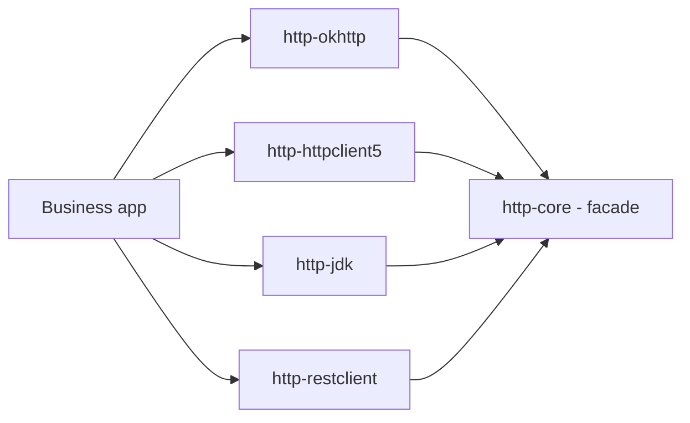

# Atlas Richie HTTP Core (atlas-richie-component-http-core)

> Pure-Java HTTP client **facade API**: `HttpClient` + `HttpRequest` + `HttpResponse` + SSE types. No third-party HTTP library dependency. Implemented by every Provider module in the parent component.

This module is the **only thing your business code depends on**. It defines the contracts; the four Providers (`okhttp` / `http_client_5` / `jdk` / `rest_client`) all implement `HttpClient` against it. Provider choice is configuration-driven.

---

## 📖 Contents

- [📖 Overview](#📖-overview)
  - [What this module is — and what it isn't](#what-this-module-is-—-and-what-it-isnt)
- [✨ Features](#✨-features)
- [🏗️ Architecture & Module Layout](#🏗️-architecture-&-module-layout)
  - [Dependency relationships](#dependency-relationships)
- [🚀 Quick Start](#🚀-quick-start)
  - [1. Add the dependency](#1-add-the-dependency)
  - [2. Use the API](#2-use-the-api)
- [🔧 Core Capabilities](#🔧-core-capabilities)
  - [1. `HttpClient` — the only facade](#1-httpclient-—-the-only-facade)
  - [2. `HttpRequest` — chainable Builder](#2-httprequest-—-chainable-builder)
  - [3. `HttpResponse` — uniform response](#3-httpresponse-—-uniform-response)
  - [4. SSE — full protocol support](#4-sse-—-full-protocol-support)
  - [5. `HttpRequestSupport` — shared helpers](#5-httprequestsupport-—-shared-helpers)
  - [6. `HttpProvider` enum (config-driven)](#6-httpprovider-enum-config-driven)
- [⚙️ Configuration Reference](#⚙️-configuration-reference)
  - [`platform.component.http`](#platformcomponenthttp)
- [🎯 Best Practices](#🎯-best-practices)
- [⚠️ Known Limitations](#⚠️-known-limitations)
- [❓ FAQ](#❓-faq)
  - [Q1: Why does `HttpRequest` need a back-reference to `HttpClient`?](#q1-why-does-httprequest-need-a-back-reference-to-httpclient?)
  - [Q2: Why are there two `execute` overloads — `Class<T>` and `TypeReference<T>`?](#q2-why-are-there-two-execute-overloads-—-classt-and-typereferencet?)
  - [Q3: Does `HttpClient` close connections after each call?](#q3-does-httpclient-close-connections-after-each-call?)
  - [Q4: Can I write my own `HttpClient` implementation?](#q4-can-i-write-my-own-httpclient-implementation?)
  - [Q5: Is `HttpRequest` thread-safe?](#q5-is-httprequest-thread-safe?)
  - [Q6: How do I share the same `HttpClient` across multiple modules?](#q6-how-do-i-share-the-same-httpclient-across-multiple-modules?)
  - [Q7: What happens if I call `execute()` twice on the same `HttpRequest`?](#q7-what-happens-if-i-call-execute-twice-on-the-same-httprequest?)
- [📚 Further Reading](#📚-further-reading)
## 📖 Overview

| Item | Value |
|------|-------|
| **Artifact** | `com.richie.component:atlas-richie-component-http-core` |
| **Category** | Facade / contract layer |
| **Hard dependencies** | `tools.jackson.core:jackson-databind`, `atlas-richie-context` (for `JsonUtils`) |
| **Third-party HTTP** | **None** — every Provider contributes its own library |
| **Output style** | Pure-Java interfaces + records + POJO builders + helpers |

### What this module is — and what it isn't

| ✅ It gives you | ❌ It does not give you |
|-----------------|------------------------|
| One stable API: `HttpClient` / `HttpRequest` / `HttpResponse` | An actual HTTP client (use a Provider) |
| Sync / async / `CompletableFuture` execution signatures | A `OkHttpClient` / `CloseableHttpClient` / `java.net.http.HttpClient` / `RestClient` bean |
| SSE types: `SseConnection` / `SseListener` / `SseEvent` / `SseLineParser` | A real streaming HTTP connection (Providers implement it) |
| `HttpMethod` enum, `ContentType` enum, `AsyncCallback` interface | `PATCH` / `HEAD` / `OPTIONS` (planned) |
| `HttpRequestSupport` helpers (URL building, body serialization, timeout wrapper) | A connection pool, timeouts, TLS config (Provider-specific) |
| `HttpCoreProperties` (`provider` + `strictSsl`) | Provider-specific config (`platform.component.http.{okhttp,httpclient5,jdk,restclient}.*`) |

## ✨ Features

- ✅ **Stable contract** — switching providers does not change your imports.
- ✅ **Chainable `HttpRequest`** — one Builder, four execution modes (`execute()` / `execute(T)` / `async()` / `future()`).
- ✅ **SSE spec compliance** — `SseLineParser` follows the [HTML Living Standard](https://html.spec.whatwg.org/multipage/server-sent-events.html): empty line boundary, `:` comment prefix, multi-line `data:` joined by `\n`, `retry:` only accepts positive integers.
- ✅ **Generic deserialization** — `TypeReference<T>` for `Page<User>`, `Map<String, List<X>>`, etc.
- ✅ **Cross-Provider helpers** — `HttpRequestSupport.buildUrlWithParams(...)` handles URL fragment + UTF-8 encoding; `serializeBody(...)` unifies String vs. POJO handling; `executeWithTimeout(...)` wraps sync calls.
- ✅ **Zero 3rd-party HTTP deps** — `core` is safe to depend on from any module that needs the HTTP API contract.

## 🏗️ Architecture & Module Layout

```
com.richie.component.http.core
├── HttpClient              ← interface; Provider implementers
├── HttpRequest             ← chainable Builder (URL, method, body, headers, timeout, content-type, multipart)
├── HttpResponse            ← status, headers, body (byte[] / String / deserialized)
├── AsyncCallback<T>        ← async-callback contract
├── HttpMethod              ← enum: GET, POST, PUT, DELETE
├── ContentType             ← enum: JSON / XML / SOAP / FORM / MULTIPART / DEFAULT (mime strings)
├── HttpProvider            ← enum: OKHTTP / HTTP_CLIENT_5 / REST_CLIENT / JDK (driven by `provider` config)
├── HttpCoreProperties      ← @ConfigurationProperties("platform.component.http")
├── HttpClientCoreConfiguration   ← registers HttpCoreProperties
├── HttpRequestSupport      ← URL / body / timeout helpers (no state)
├── SseConnection           ← handle interface (status, headers, isOpen, close)
├── SseListener             ← lifecycle callbacks (onOpen / onEvent / onClosed / onFailure)
├── SseEvent                ← record (id / event / data / retry)
└── SseLineParser           ← line-level SSE protocol state machine
```

### Dependency relationships



`http-core` is depended on by every Provider; business code depends on `core` + **exactly one** Provider.

## 🚀 Quick Start

### 1. Add the dependency

```xml
<!-- Always required: the facade -->
<dependency>
    <groupId>com.richie.component</groupId>
    <artifactId>atlas-richie-component-http-core</artifactId>
</dependency>

<!-- Pick exactly one Provider -->
<dependency>
    <groupId>com.richie.component</groupId>
    <artifactId>atlas-richie-component-http-okhttp</artifactId>
</dependency>
```

### 2. Use the API

```java
import com.richie.component.http.core.HttpClient;

@Service
@RequiredArgsConstructor
public class UserService {
    private final HttpClient http;

    public User get(String id) {
        return http.get("https://api/users/{id}", id).execute(User.class);
    }
}
```

That's it. The provider-specific configuration is in the Provider's README:

- [OkHttp](../atlas-richie-component-http-okhttp/README.md)
- [HttpClient5](../atlas-richie-component-http-httpclient5/README.md)
- [JDK](../atlas-richie-component-http-jdk/README.md)
- [RestClient](../atlas-richie-component-http-restclient/README.md)

## 🔧 Core Capabilities

### 1. `HttpClient` — the only facade

```java
public interface HttpClient {
    HttpRequest get(String url);
    HttpRequest post(String url, Object body);
    HttpRequest post(String url);
    HttpRequest put(String url, Object body);
    HttpRequest delete(String url, Object body);
    HttpRequest delete(String url);

    SseConnection sse(String url, SseListener listener);
    SseConnection sse(String url, Map<String, String> headers, SseListener listener);

    HttpResponse execute(HttpRequest request);
    <T> T execute(HttpRequest request, Class<T> type);
    <T> T execute(HttpRequest request, TypeReference<T> typeRef);
    <T> void async(HttpRequest request, AsyncCallback<T> callback, Class<T> type);
    <T> void async(HttpRequest request, AsyncCallback<T> callback, TypeReference<T> typeRef);
    <T> CompletableFuture<T> future(HttpRequest request, Class<T> type);
    <T> CompletableFuture<T> future(HttpRequest request, TypeReference<T> typeRef);
}
```

> **Why does `HttpRequest` carry a back-reference to `HttpClient`?** So that `http.get(url).execute(...)` works without the caller holding both the client and the request. The Provider's adapter sets this back-reference when constructing the request.

### 2. `HttpRequest` — chainable Builder

| Method | Behavior |
|--------|----------|
| `param(k, v)` / `params(map)` | Add URL query parameters |
| `header(k, v)` / `headers(map)` | Add HTTP request headers |
| `timeout(Duration)` | Per-request timeout override |
| `asJson()` / `asXml()` / `asSoap()` / `asForm()` | Content-Type selection |
| `multipart(fieldName, fileName, InputStream)` | Multipart body; Content-Type auto-derived |

| Execution method | Returns |
|------------------|---------|
| `execute()` | `HttpResponse` (raw) |
| `execute(Class<T>)` / `execute(TypeReference<T>)` | Deserialized body |
| `async(AsyncCallback<T>, Class<T>)` | void |
| `future(Class<T>)` / `future(TypeReference<T>)` | `CompletableFuture<T>` |

### 3. `HttpResponse` — uniform response

| Method | Returns |
|--------|---------|
| `statusCode()` | HTTP status code |
| `isSuccessful()` | `true` iff `200 ≤ status < 300` |
| `headers()` | `Map<String, List<String>>` (multi-value HTTP headers) |
| `body()` | `byte[]` — raw response body, eagerly loaded |
| `bodyAsString()` | UTF-8 decoded string |
| `bodyAs(Class<T>)` / `bodyAs(TypeReference<T>)` | JSON-deserialized object (Jackson 3 via `JsonUtils`) |

### 4. SSE — full protocol support

#### Types

| Type | Role |
|------|------|
| `SseListener` | Lifecycle callbacks: `onOpen` / `onEvent` / `onClosed` / `onFailure` — all `default` |
| `SseConnection` | Handle: `statusCode()` / `headers()` / `isOpen()` / `close()` (idempotent) |
| `SseEvent` | Record: `(id, event, data, retry)`; default event name `message` |
| `SseLineParser` | State machine — feed it one line at a time, get a complete event back |

#### `SseLineParser` behavior

| Input | Result |
|-------|--------|
| empty line | Returns the currently buffered event (if any) and resets |
| `:` prefix | comment — ignored |
| `id:` | updates `event.id()`; later value wins |
| `event:` | updates `event.event()`; later value wins; empty → default `message` |
| `data:` | appends to the data buffer; multi-line `data:` are joined by `\n` |
| `retry:` | parses positive-integer milliseconds; non-positive values discarded |
| other fields | ignored per spec |

### 5. `HttpRequestSupport` — shared helpers

```java
String url = HttpRequestSupport.buildUrlWithParams(
        "https://api/users#section",
        Map.of("page", "1", "size", "20"));

byte[] bytes = HttpRequestSupport.serializeBody(newUser);

T result = HttpRequestSupport.executeWithTimeout(
        Duration.ofSeconds(5),
        () -> doBlockingCall());
```

### 6. `HttpProvider` enum (config-driven)

```java
public enum HttpProvider {
    OKHTTP,
    HTTP_CLIENT_5,
    REST_CLIENT,
    JDK
}
```

## ⚙️ Configuration Reference

### `platform.component.http`

| Property | Type | Default | Description |
|----------|------|---------|-------------|
| `provider` | `HttpProvider` enum | (none — must be set) | Selects which Provider's auto-config activates. |
| `strict-ssl` | `boolean` | `true` | Master SSL toggle. |

Provider-specific configuration lives under `platform.component.http.{okhttp,httpclient5,jdk,restclient}.*` and is documented in each Provider's README.

## 🎯 Best Practices

1. **Depend only on `core` in shared modules** — keep library code provider-agnostic.
2. **Prefer `execute(TypeReference<T>)` for generics** — type erasure loses the parameterization in `Class<Page<User>>`.
3. **Per-request timeout override** — `http.get(url).timeout(Duration.ofSeconds(2))` for fast-fail hot paths.
4. **Always check `isSuccessful()` before deserializing** — Providers do **not** throw on non-2xx.
5. **SSE: never assume `data` is non-null** — protocol-compliant events may have only `id:` or `retry:` fields.
6. **Treat `HttpClient` as a singleton** — Provider adapters are Spring singletons.

## ⚠️ Known Limitations

| Limitation | Impact | Workaround |
|------------|--------|------------|
| **HTTP methods fixed at GET / POST / PUT / DELETE** | No PATCH / HEAD / OPTIONS | Wait for the planned extension; meanwhile call the underlying client directly |
| **`HttpResponse.body()` is `byte[]` only** | No streaming API for very large downloads | Wait for streaming support in your chosen Provider |
| **No interceptor hooks** (auth refresh, retry, circuit-breaker) | Cross-cutting policies must wrap `HttpRequest` | Use [`atlas-richie-component-microservice`](../../atlas-richie-component-microservice/README.md) |
| **SSE: no auto-reconnect** | Disconnects do not retry | Implement reconnect in your `SseListener.onFailure(...)` |
| **One Provider per application** | Multiple Providers on the classpath cause bean conflicts | Keep exactly one provider in your dependency set |

## ❓ FAQ

### Q1: Why does `HttpRequest` need a back-reference to `HttpClient`?

So that `http.get(url).execute(...)` works without callers holding two references. The Provider's adapter sets this reference when building the request, so business code never has to think about it.

### Q2: Why are there two `execute` overloads — `Class<T>` and `TypeReference<T>`?

Because Java erases generic parameters at runtime. `Page<User>` cannot survive `Class<Page<User>>`; `TypeReference<T>` captures the full generic type via subclass token.

### Q3: Does `HttpClient` close connections after each call?

No. The Provider's underlying client manages its own connection pool. Do not close the `HttpClient` bean yourself.

### Q4: Can I write my own `HttpClient` implementation?

Yes — implement the interface and register it as a `@Bean`. Mark it `@Primary` if other Provider beans are present.

### Q5: Is `HttpRequest` thread-safe?

**No** — each request is meant to be built by one thread, executed, then discarded.

### Q6: How do I share the same `HttpClient` across multiple modules?

It already is a Spring singleton. `@Autowired HttpClient http` in any bean gets the same instance.

### Q7: What happens if I call `execute()` twice on the same `HttpRequest`?

Behavior depends on the Provider — most will execute twice. Treat `HttpRequest` as one-shot.

## 📚 Further Reading

- **Parent component** — [`../README.md`](../README.md) / [`../README.zh.md`](../README.md): full feature matrix, provider comparison, configuration catalog.
- **Provider docs**:
  - [`../atlas-richie-component-http-okhttp/README.md`](../atlas-richie-component-http-okhttp/README.md)
  - [`../atlas-richie-component-http-httpclient5/README.md`](../atlas-richie-component-http-httpclient5/README.md)
  - [`../atlas-richie-component-http-jdk/README.md`](../atlas-richie-component-http-jdk/README.md)
  - [`../atlas-richie-component-http-restclient/README.md`](../atlas-richie-component-http-restclient/README.md)
- **External**:
  - [HTML Living Standard — Server-Sent Events](https://html.spec.whatwg.org/multipage/server-sent-events.html)
  - [Jackson 3 `TypeReference`](https://github.com/FasterXML/jackson-databind)
- **Related platform components**:
  - [`atlas-richie-component-microservice`](../../atlas-richie-component-microservice/README.md) — retry / circuit-breaker on top of `HttpClient`.
  - [`atlas-richie-component-desensitize-logging`](../../atlas-richie-component-desensitize/atlas-richie-component-desensitize-logging/README.md) — mask sensitive fields in HTTP debug logs.

---

**atlas-richie-component-http-core** — the only thing your code depends on 🚀
