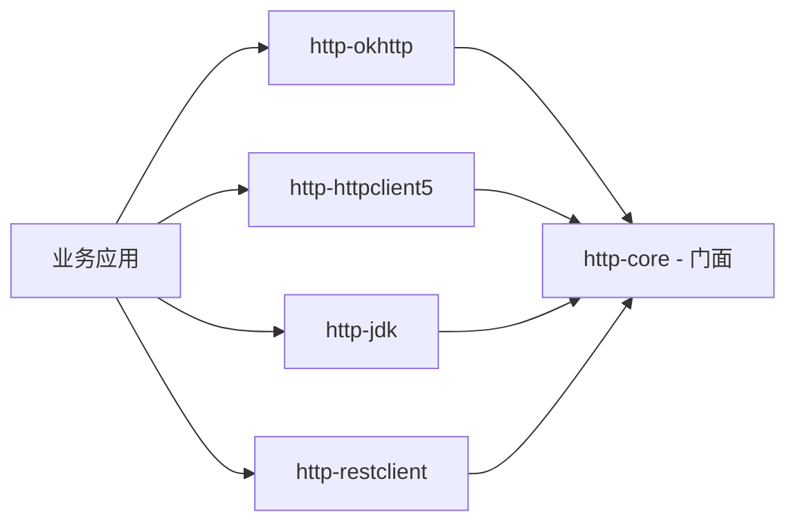

# Atlas Richie HTTP Core (atlas-richie-component-http-core)

> 纯 Java 的 HTTP 客户端**门面 API**：`HttpClient` + `HttpRequest` + `HttpResponse` + SSE 类型。**不依赖**任何三方 HTTP 库。父组件下每个 Provider 模块都实现这套接口。

本模块是**业务代码唯一直接依赖**的对象。它定义契约，4 个 Provider（`okhttp` / `http_client_5` / `jdk` / `rest_client`）按它实现。Provider 的选择完全由配置驱动。

---

## 📖 目录

- [📖 概述](#📖-概述)
  - [本模块的"是"与"不是"](#本模块的是与不是)
- [✨ 功能特性](#✨-功能特性)
- [🏗️ 架构与模块布局](#🏗️-架构与模块布局)
  - [依赖关系](#依赖关系)
- [🚀 快速开始](#🚀-快速开始)
  - [1. 引入依赖](#1-引入依赖)
  - [2. 使用 API](#2-使用-api)
- [🔧 核心能力](#🔧-核心能力)
  - [1. `HttpClient` —— 唯一门面](#1-httpclient-——-唯一门面)
  - [2. `HttpRequest` —— 链式 Builder](#2-httprequest-——-链式-builder)
  - [3. `HttpResponse` —— 统一响应](#3-httpresponse-——-统一响应)
  - [4. SSE —— 全协议支持](#4-sse-——-全协议支持)
  - [5. `HttpRequestSupport` —— 跨 Provider 工具](#5-httprequestsupport-——-跨-provider-工具)
  - [6. `HttpProvider` 枚举（配置驱动）](#6-httpprovider-枚举（配置驱动）)
- [⚙️ 配置参考](#⚙️-配置参考)
  - [`platform.component.http`](#platformcomponenthttp)
- [🎯 最佳实践](#🎯-最佳实践)
- [⚠️ 已知限制](#⚠️-已知限制)
- [❓ 常见问题](#❓-常见问题)
  - [Q1：为什么 `HttpRequest` 需要反向引用 `HttpClient`？](#q1：为什么-httprequest-需要反向引用-httpclient？)
  - [Q2：为什么有两个 `execute` 重载——`Class<T>` 和 `TypeReference<T>`？](#q2：为什么有两个-execute-重载——classt-和-typereferencet？)
  - [Q3：`HttpClient` 每次调用后会关闭连接吗？](#q3：httpclient-每次调用后会关闭连接吗？)
  - [Q4：可以自己实现 `HttpClient` 吗？](#q4：可以自己实现-httpclient-吗？)
  - [Q5：`HttpRequest` 线程安全吗？](#q5：httprequest-线程安全吗？)
  - [Q6：如何在多个模块共享同一个 `HttpClient`？](#q6：如何在多个模块共享同一个-httpclient？)
  - [Q7：同一个 `HttpRequest` 调用两次 `execute()` 会怎样？](#q7：同一个-httprequest-调用两次-execute-会怎样？)
- [📚 相关文档](#📚-相关文档)
---

## 📖 概述

| 项 | 值 |
|---|---|
| **坐标** | `com.richie.component:atlas-richie-component-http-core` |
| **类别** | 门面 / 契约层 |
| **强依赖** | `tools.jackson.core:jackson-databind`、`atlas-richie-context`（提供 `JsonUtils`） |
| **三方 HTTP 库** | **无**——每个 Provider 自带 |
| **输出形态** | 纯 Java 接口 + record + POJO Builder + 工具类 |

### 本模块的"是"与"不是"

| ✅ 提供 | ❌ 不提供 |
|--------|---------|
| 稳定 API：`HttpClient` / `HttpRequest` / `HttpResponse` | 实际 HTTP 客户端（请用 Provider） |
| 同步 / 异步 / `CompletableFuture` 三种执行入口 | `OkHttpClient` / `CloseableHttpClient` / `java.net.http.HttpClient` / `RestClient` Bean |
| SSE 类型：`SseConnection` / `SseListener` / `SseEvent` / `SseLineParser` | 真正的流式 HTTP 连接（由 Provider 实现） |
| `HttpMethod` 枚举、`ContentType` 枚举、`AsyncCallback` 接口 | `PATCH` / `HEAD` / `OPTIONS`（计划中） |
| `HttpRequestSupport` 工具（URL 构建 / body 序列化 / 超时包装） | 连接池、超时、TLS 配置（Provider 专属） |
| `HttpCoreProperties`（`provider` + `strictSsl`） | Provider 专属配置（`platform.component.http.{okhttp,httpclient5,jdk,restclient}.*`） |

---

## ✨ 功能特性

- ✅ **稳定契约**：切换 Provider 不改变业务 import。
- ✅ **链式 `HttpRequest`**：一个 Builder，4 种执行模式（`execute()` / `execute(T)` / `async()` / `future()`）。
- ✅ **SSE 协议合规**：`SseLineParser` 严格遵循 [HTML Living Standard](https://html.spec.whatwg.org/multipage/server-sent-events.html)：空行边界、`:` 注释、多行 `data:` 以 `
` 拼接、`retry:` 仅接受正整数。
- ✅ **泛型反序列化**：`TypeReference<T>` 支持 `Page<User>`、`Map<String, List<X>>` 等。
- ✅ **跨 Provider 工具**：`HttpRequestSupport.buildUrlWithParams(...)` 处理 URL fragment + UTF-8 编码；`serializeBody(...)` 统一 String 与 POJO；`executeWithTimeout(...)` 包装同步调用。
- ✅ **零三方 HTTP 依赖**：`core` 可被任何需要 HTTP 契约的模块安全依赖。

---

## 🏗️ 架构与模块布局

```
com.richie.component.http.core
├── HttpClient              ← 接口；Provider 实现
├── HttpRequest             ← 链式 Builder（URL / method / body / headers / timeout / content-type / multipart）
├── HttpResponse            ← 状态、响应头、响应体（byte[] / String / 反序列化）
├── AsyncCallback<T>        ← 异步回调契约
├── HttpMethod              ← 枚举：GET / POST / PUT / DELETE
├── ContentType             ← 枚举：JSON / XML / SOAP / FORM / MULTIPART / DEFAULT（对应 mime）
├── HttpProvider            ← 枚举：OKHTTP / HTTP_CLIENT_5 / REST_CLIENT / JDK（由 `provider` 配置驱动）
├── HttpCoreProperties      ← @ConfigurationProperties("platform.component.http")
├── HttpClientCoreConfiguration   ← 注册 HttpCoreProperties
├── HttpRequestSupport      ← URL / body / 超时工具类（无状态）
├── SseConnection           ← 连接句柄接口（status / headers / isOpen / close）
├── SseListener             ← 生命周期回调（onOpen / onEvent / onClosed / onFailure）
├── SseEvent                ← record（id / event / data / retry）
└── SseLineParser           ← 行级 SSE 协议状态机
```

### 依赖关系



`http-core` 被每个 Provider 依赖；业务代码依赖 `core` + **唯一** 一个 Provider。

---

## 🚀 快速开始

### 1. 引入依赖

```xml
<!-- 必选：门面 -->
<dependency>
    <groupId>com.richie.component</groupId>
    <artifactId>atlas-richie-component-http-core</artifactId>
</dependency>

<!-- 选一个 Provider（四选一） -->
<dependency>
    <groupId>com.richie.component</groupId>
    <artifactId>atlas-richie-component-http-okhttp</artifactId>
</dependency>
```

### 2. 使用 API

```java
import com.richie.component.http.core.HttpClient;

@Service
@RequiredArgsConstructor
public class UserService {
    private final HttpClient http;

    public User get(String id) {
        return http.get("https://api/users/{id}", id).execute(User.class);
    }
}
```

Provider 专属配置在各 Provider 的 README 中：

- [OkHttp](../atlas-richie-component-http-okhttp/README.zh.md)
- [HttpClient5](../atlas-richie-component-http-httpclient5/README.zh.md)
- [JDK](../atlas-richie-component-http-jdk/README.zh.md)
- [RestClient](../atlas-richie-component-http-restclient/README.zh.md)

---

## 🔧 核心能力

### 1. `HttpClient` —— 唯一门面

```java
public interface HttpClient {
    HttpRequest get(String url);
    HttpRequest post(String url, Object body);
    HttpRequest post(String url);
    HttpRequest put(String url, Object body);
    HttpRequest delete(String url, Object body);
    HttpRequest delete(String url);

    SseConnection sse(String url, SseListener listener);
    SseConnection sse(String url, Map<String, String> headers, SseListener listener);

    HttpResponse execute(HttpRequest request);
    <T> T execute(HttpRequest request, Class<T> type);
    <T> T execute(HttpRequest request, TypeReference<T> typeRef);
    <T> void async(HttpRequest request, AsyncCallback<T> callback, Class<T> type);
    <T> void async(HttpRequest request, AsyncCallback<T> callback, TypeReference<T> typeRef);
    <T> CompletableFuture<T> future(HttpRequest request, Class<T> type);
    <T> CompletableFuture<T> future(HttpRequest request, TypeReference<T> typeRef);
}
```

> **为什么 `HttpRequest` 持有 `HttpClient` 的反向引用？** 为了让 `http.get(url).execute(...)` 一气呵成，调用方无须同时持有 client 和 request。Provider 的 Adapter 在构造 request 时设置这个引用——业务代码完全不感知。

### 2. `HttpRequest` —— 链式 Builder

| 方法 | 行为 |
|------|------|
| `param(k, v)` / `params(map)` | 添加 URL 查询参数（不支持同名多值；需要多值请用不同 key） |
| `header(k, v)` / `headers(map)` | 添加 HTTP 请求头 |
| `timeout(Duration)` | 本次请求覆盖全局超时 |
| `asJson()` | Content-Type → `application/json; charset=utf-8` |
| `asXml()` | Content-Type → `application/xml; charset=utf-8` |
| `asSoap()` | Content-Type → `application/soap+xml` |
| `asForm()` | Content-Type → `application/x-www-form-urlencoded` |
| `multipart(fieldName, fileName, InputStream)` | Multipart body；Content-Type 自动推导 |

| 执行方法 | 返回 |
|---------|------|
| `execute()` | `HttpResponse`（原始） |
| `execute(Class<T>)` / `execute(TypeReference<T>)` | 反序列化 body |
| `async(AsyncCallback<T>, Class<T>)` | void |
| `future(Class<T>)` / `future(TypeReference<T>)` | `CompletableFuture<T>` |

### 3. `HttpResponse` —— 统一响应

| 方法 | 返回 |
|------|------|
| `statusCode()` | HTTP 状态码 |
| `isSuccessful()` | `200 ≤ status < 300` 即返回 `true` |
| `headers()` | `Map<String, List<String>>`（HTTP 多值头） |
| `body()` | `byte[]`——原始 body，由 Provider 一次性加载 |
| `bodyAsString()` | UTF-8 解码字符串 |
| `bodyAs(Class<T>)` / `bodyAs(TypeReference<T>)` | JSON 反序列化对象（Jackson 3，通过 `JsonUtils`） |

> `bodyAs(...)` 在 `body()` 为 `null` 时（如 204 No Content）返回 `null`。

### 4. SSE —— 全协议支持

#### 类型

| 类型 | 角色 |
|------|------|
| `SseListener` | 生命周期回调：`onOpen` / `onEvent` / `onClosed` / `onFailure`，均为 `default` |
| `SseConnection` | 句柄：`statusCode()` / `headers()` / `isOpen()` / `close()`（幂等） |
| `SseEvent` | record：`(id, event, data, retry)`；`SseEvent.of(data)` 工厂用默认事件名 `message` |
| `SseLineParser` | 状态机——按行喂入，返回完整事件 |

#### 用法

```java
SseConnection conn = http.sse("https://api/events", new SseListener() {
    @Override public void onOpen(SseConnection c) {
        log.info("open: status={}", c.statusCode());
    }
    @Override public void onEvent(SseConnection c, SseEvent e) {
        log.info("event id={} type={} data={} retry={}",
                e.id(), e.event(), e.data(), e.retry());
    }
    @Override public void onClosed(SseConnection c) {
        log.info("closed");
    }
    @Override public void onFailure(SseConnection c, Throwable cause) {
        log.error("sse failure", cause);
    }
});
```

#### `SseLineParser` 行为

| 输入 | 结果 |
|------|------|
| 空行 | 返回当前缓冲的事件（如有）并重置 |
| `:` 前缀 | 注释——忽略 |
| `id:` | 更新 `event.id()`；后出现的值覆盖 |
| `event:` | 更新 `event.event()`；后出现的值覆盖；空 → 默认 `message` |
| `data:` | 追加到 data 缓冲；多行 `data:` 以 `\n` 拼接 |`
` 拼接 |
| `retry:` | 解析正整数毫秒；非正整数值丢弃 |
| 其他字段 | 按协议忽略 |

### 5. `HttpRequestSupport` —— 跨 Provider 工具

```java
// URL 组合（处理 fragment + 编码 + ? / & 衔接）
String url = HttpRequestSupport.buildUrlWithParams(
        "https://api/users#section",
        Map.of("page", "1", "size", "20"));

// Body 序列化：String → UTF-8 字节；POJO → JSON 字节
byte[] bytes = HttpRequestSupport.serializeBody(newUser);

// 给同步调用加超时（RestClient 内部使用）
T result = HttpRequestSupport.executeWithTimeout(
        Duration.ofSeconds(5),
        () -> doBlockingCall());
```

### 6. `HttpProvider` 枚举（配置驱动）

```java
public enum HttpProvider {
    OKHTTP,
    HTTP_CLIENT_5,
    REST_CLIENT,
    JDK
}
```

`platform.component.http.provider` 的字符串值（如 `okhttp`、`http_client_5`）映射到上述枚举；Provider 通过 `@ConditionalOnProperty(prefix = "platform.component.http", name = "provider", havingValue = "<value>")` 条件激活。

---

## ⚙️ 配置参考

### `platform.component.http`

| 属性 | 类型 | 默认值 | 说明 |
|------|------|--------|------|
| `provider` | `HttpProvider` 枚举 | （必须设置） | 选择哪个 Provider 的自动装配激活 |
| `strict-ssl` | `boolean` | `true` | SSL 主开关；`false` 时，`okhttp` 与 `jdk` Provider 启用 trust-all 并打 WARN |

Provider 专属配置位于 `platform.component.http.{okhttp,httpclient5,jdk,restclient}.*`，详见各 Provider 的 README。

---

## 🎯 最佳实践

1. **公共模块只依赖 `core`**：库、公共模块、任何需要 HTTP 契约的代码，应仅依赖 `core`。在**应用**模块选择 Provider。
2. **泛型反序列化用 `TypeReference<T>`**：Java 运行期擦除泛型参数；`Class<Page<User>>` 无法表达。
3. **单请求超时覆盖**：`http.get(url).timeout(Duration.ofSeconds(2))`，仅本次调用覆盖全局。
4. **反序列化前先检查成功状态**：Provider **不会**把 4xx/5xx 包装为异常。
5. **SSE 不要假设 `data` 非空**：协议合规的事件可能只有 `id:` 或 `retry:` 字段。
6. **把 `HttpClient` 当单例**：Provider Adapter 设计为 Spring 单例。

---

## ⚠️ 已知限制

| 限制 | 影响 | 临时方案 |
|------|------|---------|
| **HTTP 方法固定为 GET / POST / PUT / DELETE** | 无 PATCH / HEAD / OPTIONS | 等计划中的扩展；或者直接调底层 client |
| **`HttpResponse.body()` 仅 `byte[]`** | 无流式 API，下载超大文件不便 | 等 Provider 流式支持 |
| **无拦截器钩子**（鉴权刷新 / 重试 / 熔断） | 跨切关注点需包 `HttpRequest` | 用 `atlas-richie-component-microservice` (microservice has no ZH README) |
| **SSE 无自动重连** | 断开不重试 | 在 `SseListener.onFailure(...)` 中自行实现 |
| **同一应用只能一个 Provider** | 多个 Provider 同时装配会 Bean 冲突 | 保持只有一个 Provider |

---

## ❓ 常见问题

### Q1：为什么 `HttpRequest` 需要反向引用 `HttpClient`？

为了 `http.get(url).execute(...)` 一气呵成——调用方无需同时持有 client 和 request。Provider Adapter 在构造 request 时设置，业务代码完全不感知。

### Q2：为什么有两个 `execute` 重载——`Class<T>` 和 `TypeReference<T>`？

因为 Java 在运行期会擦除泛型参数。`Page<User>` 无法用 `Class<Page<User>>` 表达；`TypeReference<T>` 通过子类 token 捕获完整泛型类型。

### Q3：`HttpClient` 每次调用后会关闭连接吗？

不会。Provider 底层客户端各自管理连接池。请勿自行关闭 `HttpClient` Bean。

### Q4：可以自己实现 `HttpClient` 吗？

可以。实现接口并注册为 `@Bean`，若存在其他 Provider Bean，标记为 `@Primary`。

### Q5：`HttpRequest` 线程安全吗？

**不安全**——每个 request 应当由一个线程构造、执行、丢弃。

### Q6：如何在多个模块共享同一个 `HttpClient`？

它已经是 Spring 单例。任意 Bean 里 `@Autowired HttpClient http` 拿到的是同一个实例。

### Q7：同一个 `HttpRequest` 调用两次 `execute()` 会怎样？

行为取决于 Provider——大多数会执行两次。请把 `HttpRequest` 当一次性使用。

---

## 📚 相关文档

- **父组件** — [`../README.zh.md`](../README.zh.md)
- **Provider 文档**：
  - [`../atlas-richie-component-http-okhttp/README.zh.md`](../atlas-richie-component-http-okhttp/README.zh.md)
  - [`../atlas-richie-component-http-httpclient5/README.zh.md`](../atlas-richie-component-http-httpclient5/README.zh.md)
  - [`../atlas-richie-component-http-jdk/README.zh.md`](../atlas-richie-component-http-jdk/README.zh.md)
  - [`../atlas-richie-component-http-restclient/README.zh.md`](../atlas-richie-component-http-restclient/README.zh.md)
- **外部**：
  - [HTML Living Standard — Server-Sent Events](https://html.spec.whatwg.org/multipage/server-sent-events.html)
  - [Jackson 3 `TypeReference`](https://github.com/FasterXML/jackson-databind)
- **相关平台组件**：
  - `atlas-richie-component-microservice` (microservice has no ZH README) — 在 `HttpClient` 之上叠加重试 / 熔断。
  - [`atlas-richie-component-desensitize-logging`](../../atlas-richie-component-desensitize/atlas-richie-component-desensitize-logging/README.zh.md) — HTTP 调试日志中的敏感字段脱敏。

---

**atlas-richie-component-http-core** — 业务代码唯一依赖的对象 🚀
