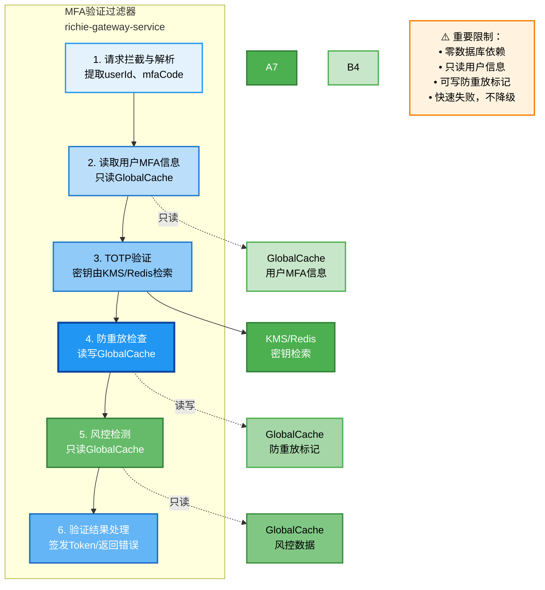
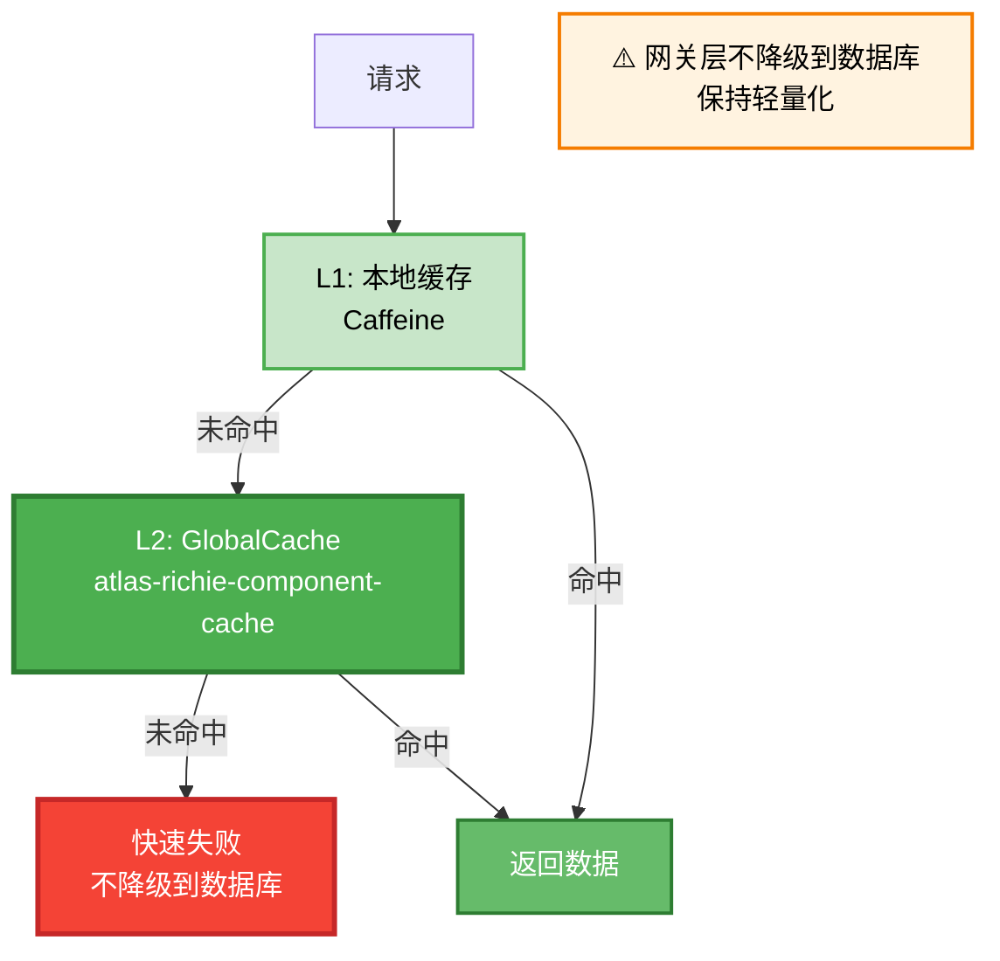
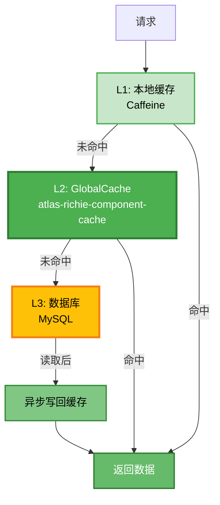
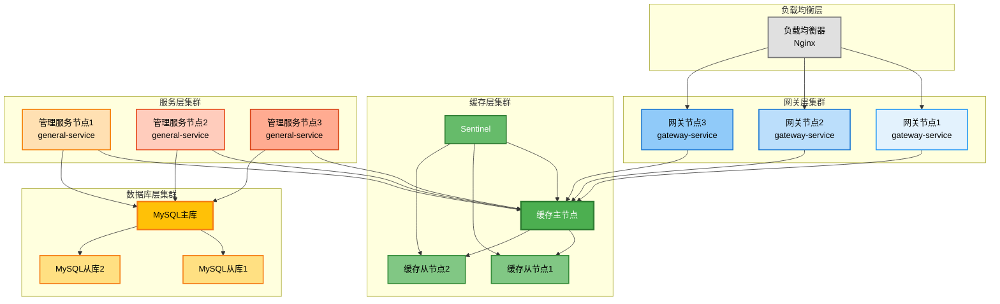
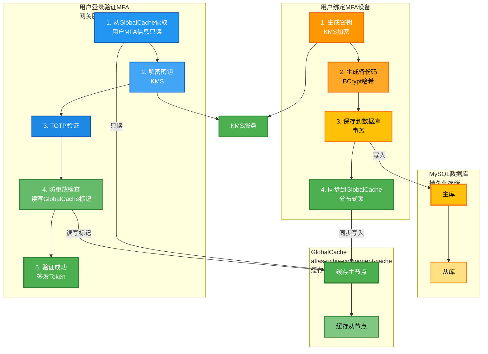

# Richie MFA 多因子认证组件完整设计方案

## 📋 目录

- [1. 概述](#1-概述)
- [2. 设计原则](#2-设计原则)
- [3. 系统架构](#3-系统架构)
- [4. 核心功能](#4-核心功能)
- [5. 安全设计](#5-安全设计)
- [6. 性能设计](#6-性能设计)
- [7. 容错与降级](#7-容错与降级)
- [8. 数据模型](#8-数据模型)
- [9. API设计](#9-api设计)
- [10. 配置管理](#10-配置管理)
- [11. 审计日志](#11-审计日志)
- [12. 部署方案](#12-部署方案)
- [13. 合规性](#13-合规性)
- [14. 附录](#14-附录)

---

## 1. 概述

### 1.1 组件定位

Richie MFA组件是一个企业级多因子认证解决方案，基于RFC 6238/4226标准实现TOTP/HOTP算法，为企业应用提供高性能、高安全性的身份验证能力。

**重要架构说明**：MFA组件采用**分离式架构设计**，拆分为两个独立的模块：

- **richie-component-mfa-validation**：验证模块，部署在 `richie-gateway-service` 中
  - **职责**：MFA验证逻辑，只读GlobalCache（richie-component-cache），**零数据库依赖**
  - **特点**：轻量级、高性能、毫秒级响应
- **richie-component-mfa-management**：管理模块，部署在 `richie-general-service` 中
  - **职责**：MFA管理功能（绑定、解绑、状态管理等），操作数据库
  - **特点**：完整的CRUD操作，使用Liquibase管理DDL

### 1.2 核心特性

- **多种认证方式**：TOTP、HOTP、SMS、Email
- **高性能验证**：网关层毫秒级验证响应（<10ms），只读GlobalCache（richie-component-cache）
- **架构分离**：验证与管理完全分离，网关零数据库依赖
- **安全可靠**：密钥加密存储、防重放攻击、审计日志
- **容错降级**：缓存降级、熔断保护、优雅降级
- **设备信任**：设备指纹识别、可信设备管理
- **合规支持**：符合NIST 800-63B、OWASP MFA指南

### 1.3 设计目标


| 指标       | 目标值         | 说明        |
| -------- | ----------- | --------- |
| 验证响应时间   | < 10ms      | 网关层通过缓存验证 |
| 管理操作响应时间 | < 100ms     | 数据库操作     |
| 并发验证能力   | 10,000+ QPS | 支持高并发场景   |
| 系统可用性    | 99.99%      | 4个9可用性    |
| 缓存命中率    | > 95%       | 热点数据缓存    |
| 数据一致性    | 最终一致性       | 缓存与数据库同步  |


---

## 2. 设计原则

### 2.1 架构分离原则

- **网关验证层（richie-component-mfa-validation）**：
  - 部署位置：`richie-gateway-service`
  - 职责：MFA验证逻辑，只读GlobalCache（richie-component-cache）
  - **严格限制**：零数据库依赖，不操作数据库
  - 性能目标：毫秒级响应（<10ms）
- **管理服务层（richie-component-mfa-management）**：
  - 部署位置：`richie-general-service`
  - 职责：MFA管理功能（绑定、解绑、状态管理等）
  - 数据库操作：所有CRUD操作，使用Liquibase管理DDL
  - 缓存同步：数据库变更后同步到GlobalCache（richie-component-cache）
- **职责清晰**：验证与管理完全分离，降低耦合度，符合网关轻量化原则

### 2.2 安全优先原则

- **密钥加密存储**：使用KMS/HSM管理主密钥，用户密钥AES-256-GCM加密
- **防重放攻击**：记录已使用验证码，防止重复使用
- **审计完整性**：审计日志数字签名，防止篡改
- **最小权限**：细粒度权限控制，最小化攻击面

### 2.3 性能优先原则

- **缓存优先**：热点数据优先使用缓存，减少数据库访问
- **异步处理**：非关键路径异步处理，提升响应速度
- **批量操作**：支持批量验证、批量缓存更新
- **连接池优化**：合理配置连接池，避免资源浪费

### 2.4 容错降级原则

- **熔断保护**：缓存不可用时自动熔断，避免雪崩
- **降级策略**：网关验证层缓存故障时，**拒绝验证请求**（不降级到数据库，保持网关轻量化）
- **重试机制**：管理服务层失败自动重试，提高成功率
- **优雅降级**：部分功能不可用时，核心功能仍可用

### 2.5 网关轻量化原则

- **零数据库依赖**：网关验证层严格禁止操作数据库
- **只读缓存**：网关验证层只从GlobalCache（richie-component-cache）读取数据，不写入
- **快速失败**：缓存不可用时快速失败，不阻塞请求

---

## 3. 系统架构

### 3.1 整体架构

```mermaid
graph TB
    subgraph Client["客户端层"]
        A1[Web浏览器]
        A2[移动APP]
        A3[桌面客户端]
        A4[第三方应用]
    end
    
    subgraph Gateway["richie-gateway-service<br/>网关服务"]
        B1[MFA验证过滤器<br/>atlas-richie-component-mfa-validation]
        B2[快速验证 <10ms]
        B3[防重放检查]
        B4[MFA状态检查<br/>仅读缓存返回元数据]
        B5[只读GlobalCache<br/>零数据库依赖]
        
        B1 --> B2
        B1 --> B3
        B1 --> B4
        B1 --> B5
    end
    
    subgraph Cache["GlobalCache<br/>atlas-richie-component-cache<br/>缓存集群"]
        C1[缓存主节点]
        C2[缓存从节点]
        C1 --> C2
    end
    
    subgraph General["richie-general-service<br/>通用服务"]
        D1[MFA管理服务<br/>atlas-richie-component-mfa-management]
        D2[绑定管理<br/>CRUD操作]
        D3[解绑管理]
        D4[状态管理]
        D5[备份码管理]
        D6[缓存同步<br/>数据库→GlobalCache]
        D7[Liquibase迁移<br/>atlas-richie-component-liquibase]
        D8[DDL首次创建]
        D9[数据库表结构升级]
        
        D1 --> D2
        D1 --> D3
        D1 --> D4
        D1 --> D5
        D1 --> D6
        D1 --> D7
        D7 --> D8
        D7 --> D9
    end
    
    subgraph Database["MySQL数据库<br/>主从复制"]
        E1[MySQL主库]
        E2[MySQL从库]
        E1 --> E2
    end
    
    A1 --> B1
    A2 --> B1
    A3 --> B1
    A4 --> B1
    
    B1 -->|只读| C1
    D6 -->|同步写入| C1
    D2 -->|读写| E1
    D3 -->|读写| E1
    D4 -->|读写| E1
    D5 -->|读写| E1
    D7 -->|DDL| E1
    
    %% 客户端层 - 浅蓝色
    style A1 fill:#E3F2FD,stroke:#2196F3,stroke-width:2px,color:#000
    style A2 fill:#E3F2FD,stroke:#2196F3,stroke-width:2px,color:#000
    style A3 fill:#E3F2FD,stroke:#2196F3,stroke-width:2px,color:#000
    style A4 fill:#E3F2FD,stroke:#2196F3,stroke-width:2px,color:#000
    
    %% 网关层 - 蓝色系
    style B1 fill:#2196F3,stroke:#0D47A1,stroke-width:3px,color:#FFF
    style B2 fill:#42A5F5,stroke:#1565C0,stroke-width:2px,color:#FFF
    style B3 fill:#1E88E5,stroke:#0D47A1,stroke-width:2px,color:#FFF
    style B4 fill:#1976D2,stroke:#0D47A1,stroke-width:2px,color:#FFF
    style B5 fill:#1565C0,stroke:#0D47A1,stroke-width:2px,color:#FFF
    
    %% 缓存层 - 绿色系
    style C1 fill:#4CAF50,stroke:#2E7D32,stroke-width:3px,color:#FFF
    style C2 fill:#81C784,stroke:#388E3C,stroke-width:2px,color:#000
    
    %% 通用服务层 - 橙色系
    style D1 fill:#FF9800,stroke:#E65100,stroke-width:3px,color:#FFF
    style D2 fill:#FFB74D,stroke:#E65100,stroke-width:2px,color:#000
    style D3 fill:#FFA726,stroke:#E65100,stroke-width:2px,color:#000
    style D4 fill:#FF9800,stroke:#F57C00,stroke-width:2px,color:#FFF
    style D5 fill:#FB8C00,stroke:#E65100,stroke-width:2px,color:#FFF
    style D6 fill:#4CAF50,stroke:#2E7D32,stroke-width:2px,color:#FFF
    style D7 fill:#2196F3,stroke:#0D47A1,stroke-width:2px,color:#FFF
    style D8 fill:#42A5F5,stroke:#1565C0,stroke-width:2px,color:#FFF
    style D9 fill:#1E88E5,stroke:#0D47A1,stroke-width:2px,color:#FFF
    
    %% 数据库层 - 黄色系
    style E1 fill:#FFC107,stroke:#F57F17,stroke-width:3px,color:#000
    style E2 fill:#FFE082,stroke:#F57F17,stroke-width:2px,color:#000
```



### 3.1.1 模块职责划分

#### 验证模块（richie-component-mfa-validation）

**部署位置**：`richie-gateway-service`

**核心职责**：

- MFA验证逻辑（TOTP/HOTP验证）
- 防重放攻击检查
- MFA状态检查（`checkMfaStatus` 仅根据缓存判断是否绑定 MFA 并返回元数据，**不做可信设备校验**；可信设备校验在业务登录层）
- 风控检测

**数据访问**：

- ✅ 只读GlobalCache（richie-component-cache）
- ❌ **禁止操作数据库**
- ❌ **禁止写入缓存**（只读用户信息）

**性能要求**：

- 验证响应时间 < 10ms
- 支持10,000+ QPS并发验证

#### 管理模块（richie-component-mfa-management）

**部署位置**：`richie-general-service`

**核心职责**：

- 用户绑定MFA设备
- 用户解绑MFA设备
- MFA状态管理
- 备份码管理
- 设备信任管理
- 缓存同步（数据库→Redis）

**数据访问**：

- ✅ 操作MySQL数据库（CRUD）
- ✅ 使用Liquibase管理DDL
- ✅ 同步数据到GlobalCache（richie-component-cache）

**依赖组件**：

- `richie-component-liquibase`：数据库迁移管理
- `richie-component-cache`：缓存操作
- `richie-component-dao`：数据库访问

### 3.2 网关验证层架构（richie-component-mfa-validation）



**⚠️ 重要限制**：

- 零数据库依赖：不操作数据库
- 只读用户信息：从GlobalCache（richie-component-cache）读取，不写入
- 可写防重放标记：仅在GlobalCache中标记验证码已使用（TTL控制）
- 缓存故障处理：快速失败，不降级到数据库

### 3.3 管理服务层架构（richie-component-mfa-management）

```mermaid
graph TB
    subgraph Management["MFA管理服务<br/>richie-general-service"]
        A[API接口层] --> B[服务编排层]
        
        B --> C1[绑定管理服务]
        B --> C2[状态管理服务]
        B --> C3[设备管理服务]
        B --> C4[备份码服务]
        B --> C5[恢复服务]
        
        C1 --> D1[生成密钥<br/>KMS加密]
        C1 --> D2[生成二维码]
        C1 --> D3[生成备份码<br/>BCrypt哈希]
        C1 --> D4[保存数据库<br/>事务]
        C1 --> D5[同步GlobalCache]
        
        C2 --> E1[启用/禁用MFA<br/>数据库操作]
        C2 --> E2[查询MFA状态]
        C2 --> E3[账户锁定/解锁<br/>数据库+缓存]
        
        C3 --> F1[设备注册<br/>数据库]
        C3 --> F2[设备信任管理<br/>数据库+缓存]
        C3 --> F3[设备列表查询]
        
        C4 --> G1[备份码生成<br/>BCrypt哈希]
        C4 --> G2[备份码验证<br/>数据库]
        C4 --> G3[备份码删除<br/>数据库]
        
        C5 --> H1[备份码恢复<br/>数据库]
        C5 --> H2[恢复密钥恢复<br/>数据库]
        C5 --> H3[管理员重置<br/>数据库]
        
        C1 --> J[缓存同步服务]
        C2 --> J
        C3 --> J
        C4 --> J
        
        J --> K[分布式锁]
        J --> L[GlobalCache<br/>同步写入]
        
        C1 --> M[Liquibase迁移服务]
        M --> N[DDL首次创建]
        M --> O[数据库表结构升级]
        M --> P[版本管理]
        
        C1 --> Q[发布审计事件<br/>ApplicationEventPublisher]
        C2 --> Q
        C3 --> Q
        C4 --> Q
        C5 --> Q
        
        Note over Q: MFA组件只发布事件<br/>业务系统监听并处理
    end
    
    D4 --> U[MySQL数据库]
    E1 --> U
    E3 --> U
    F1 --> U
    F2 --> U
    G2 --> U
    G3 --> U
    H1 --> U
    H2 --> U
    H3 --> U
    N --> U
    O --> U
    
    D5 --> V[GlobalCache<br/>atlas-richie-component-cache]
    E3 --> V
    F2 --> V
    L --> V
    
    D1 --> W[KMS服务]
    
    %% API层 - 橙色
    style A fill:#FF9800,stroke:#E65100,stroke-width:3px,color:#FFF
    style B fill:#FFB74D,stroke:#E65100,stroke-width:2px,color:#000
    
    %% 管理服务 - 橙色系
    style C1 fill:#FFA726,stroke:#E65100,stroke-width:2px,color:#000
    style C2 fill:#FF9800,stroke:#E65100,stroke-width:2px,color:#FFF
    style C3 fill:#FB8C00,stroke:#E65100,stroke-width:2px,color:#FFF
    style C4 fill:#F57C00,stroke:#E65100,stroke-width:2px,color:#FFF
    style C5 fill:#EF6C00,stroke:#E65100,stroke-width:2px,color:#FFF
    
    %% 绑定服务细节 - 蓝色/绿色/黄色
    style D1 fill:#2196F3,stroke:#0D47A1,stroke-width:2px,color:#FFF
    style D2 fill:#42A5F5,stroke:#1565C0,stroke-width:2px,color:#FFF
    style D3 fill:#81C784,stroke:#388E3C,stroke-width:2px,color:#000
    style D4 fill:#FFC107,stroke:#F57F17,stroke-width:2px,color:#000
    style D5 fill:#4CAF50,stroke:#2E7D32,stroke-width:2px,color:#FFF
    
    %% 状态管理 - 黄色/绿色
    style E1 fill:#FFC107,stroke:#F57F17,stroke-width:2px,color:#000
    style E2 fill:#FFE082,stroke:#F57F17,stroke-width:2px,color:#000
    style E3 fill:#FF9800,stroke:#E65100,stroke-width:2px,color:#FFF
    
    %% 设备管理 - 黄色/绿色
    style F1 fill:#FFC107,stroke:#F57F17,stroke-width:2px,color:#000
    style F2 fill:#81C784,stroke:#388E3C,stroke-width:2px,color:#000
    style F3 fill:#FFE082,stroke:#F57F17,stroke-width:2px,color:#000
    
    %% 备份码 - 绿色
    style G1 fill:#81C784,stroke:#388E3C,stroke-width:2px,color:#000
    style G2 fill:#FFC107,stroke:#F57F17,stroke-width:2px,color:#000
    style G3 fill:#FFC107,stroke:#F57F17,stroke-width:2px,color:#000
    
    %% 恢复服务 - 黄色
    style H1 fill:#FFC107,stroke:#F57F17,stroke-width:2px,color:#000
    style H2 fill:#FFD54F,stroke:#F57F17,stroke-width:2px,color:#000
    style H3 fill:#FFE082,stroke:#F57F17,stroke-width:2px,color:#000
    
    %% 缓存同步 - 绿色
    style J fill:#4CAF50,stroke:#2E7D32,stroke-width:3px,color:#FFF
    style K fill:#81C784,stroke:#388E3C,stroke-width:2px,color:#000
    style L fill:#66BB6A,stroke:#2E7D32,stroke-width:2px,color:#FFF
    
    %% Liquibase - 蓝色
    style M fill:#2196F3,stroke:#0D47A1,stroke-width:2px,color:#FFF
    style N fill:#42A5F5,stroke:#1565C0,stroke-width:2px,color:#FFF
    style O fill:#1E88E5,stroke:#0D47A1,stroke-width:2px,color:#FFF
    style P fill:#1976D2,stroke:#0D47A1,stroke-width:2px,color:#FFF
    
    %% 审计事件发布 - 紫色
    style Q fill:#BA68C8,stroke:#6A1B9A,stroke-width:2px,color:#FFF
    
    %% 数据库 - 黄色
    style U fill:#FFC107,stroke:#F57F17,stroke-width:3px,color:#000
    
    %% 缓存 - 绿色
    style V fill:#4CAF50,stroke:#2E7D32,stroke-width:3px,color:#FFF
    
    %% KMS - 绿色
    style W fill:#4CAF50,stroke:#2E7D32,stroke-width:2px,color:#FFF
```

**✅ 核心能力**：

- 完整的数据库CRUD操作
- Liquibase管理DDL
- 数据库变更后自动同步到GlobalCache
- 保证数据一致性

---

## 4. 核心功能

### 4.1 认证方式

#### 4.1.1 TOTP (Time-based One-Time Password)

- **算法标准**：RFC 6238
- **时间窗口**：30秒
- **验证码长度**：6位或8位（可配置）
- **哈希算法**：SHA1/SHA256/SHA512（可配置）
- **容错窗口**：±1个时间窗口（可配置）

#### 4.1.2 HOTP (HMAC-based One-Time Password)

- **算法标准**：RFC 4226
- **基于计数器**：每次验证后计数器递增
- **验证码长度**：6位或8位
- **同步机制**：支持计数器同步

#### 4.1.3 SMS验证码

- **集成方式**：通过消息组件发送
- **验证码长度**：6位数字
- **有效期**：5分钟
- **发送频率限制**：每分钟1次

#### 4.1.4 Email验证码

- **集成方式**：通过邮件服务发送
- **验证码长度**：6位数字
- **有效期**：10分钟
- **发送频率限制**：每5分钟1次

### 4.2 设备绑定流程

**执行位置**：`richie-general-service`（管理服务）

```
1. 用户请求绑定（调用管理服务API）
   ↓
2. 生成密钥（KMS加密）
   ↓
3. 生成二维码（otpauth://格式）
   ↓
4. 生成备份码（BCrypt哈希）
   ↓
5. 保存到数据库（事务，使用Liquibase管理的表）
   ↓
6. 同步到GlobalCache（分布式锁保证原子性）
   ↓
7. 返回二维码和备份码给客户端
   ↓
8. 用户扫描二维码（使用Authenticator应用）
   ↓
9. 用户输入验证码验证（调用管理服务API）
   ↓
10. 验证成功后激活MFA（更新数据库状态+同步缓存）
```

**关键点**：

- 所有数据库操作在管理服务中完成
- 绑定成功后立即同步到GlobalCache，供网关验证使用
- 使用Liquibase管理数据库表结构

### 4.3 验证流程

**执行位置**：`richie-gateway-service`（网关服务）

```
1. 用户提交验证码（登录请求）
   ↓
2. 网关过滤器拦截（MfaValidationFilter）
   ↓
3. 检查设备信任（从GlobalCache读取，可选）
   ↓
4. 从GlobalCache获取用户MFA信息（只读）
   ↓
5. 解密密钥（KMS）
   ↓
6. 生成TOTP验证码
   ↓
7. 验证码比对
   ↓
8. 防重放检查（检查GlobalCache中的使用标记）
   ↓
9. 标记验证码已使用（写入GlobalCache，TTL控制）
   ↓
10. 验证成功：签发访问Token
   验证失败：返回错误信息，执行风控逻辑
```

**关键点**：

- 网关验证层只读GlobalCache（richie-component-cache），不操作数据库
- 验证成功后签发Token，不更新数据库
- 防重放标记写入GlobalCache（这是网关层唯一可写的操作）
- 缓存不可用时快速失败，不降级到数据库

### 4.4 设备信任机制

#### 4.4.1 概述

可信设备（Trusted Device）功能允许用户在首次通过MFA验证后，将当前登录的设备标记为"可信设备"。在信任期内，该设备再次登录时可以跳过MFA验证，提升用户体验的同时保持安全性。

**核心价值**：

- **提升用户体验**：减少重复的MFA验证操作
- **平衡安全与便利**：信任期有限，过期后需重新验证
- **用户可控**：用户可主动管理可信设备列表

#### 4.4.2 工作流程

##### 4.4.2.1 设备注册流程（首次验证成功后）

```
1. 用户登录请求（携带 deviceId）
   ↓
2. 基础认证通过（用户名密码正确）
   ↓
3. 需要MFA验证（设备未信任）
   ↓
4. 用户输入MFA验证码
   ↓
5. MFA验证成功
   ↓
6. 检查用户是否选择"信任此设备"（前端复选框 trustDevice=true）
   ↓
7. 如果选择信任：
   - 生成/获取设备指纹（deviceId）
   - 计算信任过期时间（当前时间 + defaultTrustDays）
   - 保存到 mfa_trusted_device 表（事务）
   - 同步到 GlobalCache（用于快速查询）
   ↓
8. 登录成功，返回 {trustedDevice: true}
```

**关键点**：

- 设备注册是**可选的**，用户可以选择是否信任设备
- 设备信息保存到数据库，同时同步到缓存
- 信任过期时间由配置决定（默认30天）

##### 4.4.2.2 设备验证流程（后续登录）

```
1. 用户登录请求（携带 deviceId）
   ↓
2. 基础认证通过
   ↓
3. **业务登录层**调用 `MfaBindManager.checkLoginMfa(tenantId, userId, deviceId)`：
   - 先校验是否为可信设备（从 GlobalCache/DB 查询）；若是可信且未过期则不需要 MFA
   - 再查 MFA 绑定状态
   - 返回 `LoginMfaCheckResult`（mfaRequired、mfaBound）
   ↓
4. 根据 mfaRequired 分支：
   ┌─────────────────────────────────────┐
   │ mfaRequired == false（可信设备或未绑定） │
   └─────────────────────────────────────┘
   ↓ 是
   业务直接返回 accessToken，网关不再做 MFA 检查
   ↓
   若为可信设备，更新 last_used_time（缓存和数据库）
   ↓
   登录成功（网关签发 Token）
   
   ↓ 否（mfaRequired == true，已绑定且非可信设备）
   业务不返回 accessToken；网关调用 checkMfaStatus 返回 MFA_REQUIRED
   ↓
   用户输入 MFA 验证码
   ↓
   MFA 验证成功
   ↓
   （若用户勾选信任，注册可信设备）
   ↓
   登录成功
```

**关键点**：

- 设备信任与“是否需要 MFA”的判断在**业务登录层**执行（`MfaBindManager.checkLoginMfa`），不在网关
- 网关仅当业务未返回 accessToken 时调用 `MfaValidationService.checkMfaStatus`，根据缓存返回 mfaRequired 及前端展示用元数据（trustedDeviceSupported 等），**不做可信设备校验**
- 信任过期后需重新进行 MFA 验证

#### 4.4.3 设备指纹生成

设备指纹（Device Fingerprint）用于唯一标识设备，通常由以下信息组合生成：

##### 4.4.3.1 网页端设备指纹生成

网页端由于没有固定的设备ID（不像移动应用可以获取设备UUID），需要依赖**浏览器指纹技术**来识别设备。

**完整的浏览器指纹生成方案（JavaScript）**：

```javascript
/**
 * 生成网页端设备指纹
 * 使用多种浏览器特征组合生成唯一标识
 */
async function generateWebDeviceFingerprint() {
    const components = [];
    
    // 1. 基础信息
    components.push(navigator.userAgent);                    // 用户代理
    components.push(navigator.language);                     // 语言
    components.push(navigator.platform);                     // 平台
    components.push(navigator.hardwareConcurrency || 0);     // CPU核心数
    components.push(navigator.maxTouchPoints || 0);          // 最大触摸点数
    
    // 2. 屏幕信息
    components.push(`${screen.width}x${screen.height}`);     // 屏幕分辨率
    components.push(`${screen.availWidth}x${screen.availHeight}`); // 可用分辨率
    components.push(screen.colorDepth);                       // 颜色深度
    components.push(screen.pixelDepth);                       // 像素深度
    
    // 3. 时区信息
    components.push(new Date().getTimezoneOffset());         // 时区偏移
    components.push(Intl.DateTimeFormat().resolvedOptions().timeZone); // 时区名称
    
    // 4. Canvas指纹（重要：浏览器渲染差异）
    try {
        const canvas = document.createElement('canvas');
        const ctx = canvas.getContext('2d');
        ctx.textBaseline = 'top';
        ctx.font = '14px Arial';
        ctx.fillText('Device fingerprint 🔒', 2, 2);
        components.push(canvas.toDataURL());
    } catch (e) {
        components.push('canvas-unsupported');
    }
    
    // 5. WebGL指纹（GPU信息）
    try {
        const gl = document.createElement('canvas').getContext('webgl');
        if (gl) {
            const debugInfo = gl.getExtension('WEBGL_debug_renderer_info');
            if (debugInfo) {
                components.push(gl.getParameter(debugInfo.UNMASKED_VENDOR_WEBGL));
                components.push(gl.getParameter(debugInfo.UNMASKED_RENDERER_WEBGL));
            }
            components.push(gl.getParameter(gl.VERSION));
            components.push(gl.getParameter(gl.SHADING_LANGUAGE_VERSION));
        }
    } catch (e) {
        components.push('webgl-unsupported');
    }
    
    // 6. 字体检测（可选，需要加载字体列表）
    try {
        const fonts = await detectFonts();
        components.push(fonts.join(','));
    } catch (e) {
        // 字体检测失败，跳过
    }
    
    // 7. 音频指纹（可选，更精确但性能开销较大）
    // 注意：音频指纹可能被浏览器限制，谨慎使用
    
    // 组合所有特征并生成哈希
    const fingerprintString = components.join('|');
    
    // 使用 Web Crypto API 生成 SHA-256 哈希
    const encoder = new TextEncoder();
    const data = encoder.encode(fingerprintString);
    const hashBuffer = await crypto.subtle.digest('SHA-256', data);
    const hashArray = Array.from(new Uint8Array(hashBuffer));
    const deviceId = hashArray.map(b => b.toString(16).padStart(2, '0')).join('');
    
    return deviceId;
}

/**
 * 检测系统字体（简化版）
 * 注意：完整字体检测需要加载大量字体，可能影响性能
 */
async function detectFonts() {
    const baseFonts = ['monospace', 'sans-serif', 'serif'];
    const testString = 'mmmmmmmmmmlli';
    const testSize = '72px';
    const h = document.getElementsByTagName('body')[0];
    
    const s = document.createElement('span');
    s.style.fontSize = testSize;
    s.innerHTML = testString;
    const defaultWidth = {};
    const defaultHeight = {};
    
    for (let baseFont of baseFonts) {
        s.style.fontFamily = baseFont;
        h.appendChild(s);
        defaultWidth[baseFont] = s.offsetWidth;
        defaultHeight[baseFont] = s.offsetHeight;
        h.removeChild(s);
    }
    
    const detected = [];
    const fonts = ['Arial', 'Verdana', 'Times New Roman', 'Courier New', 'Georgia'];
    
    for (let font of fonts) {
        let detected_font = false;
        for (let baseFont of baseFonts) {
            s.style.fontFamily = font + ',' + baseFont;
            h.appendChild(s);
            const matched = (s.offsetWidth !== defaultWidth[baseFont] || 
                           s.offsetHeight !== defaultHeight[baseFont]);
            h.removeChild(s);
            if (matched) {
                detected_font = true;
            }
        }
        if (detected_font) {
            detected.push(font);
        }
    }
    
    return detected;
}
```

**设备ID存储策略**：

```javascript
/**
 * 获取或生成设备ID
 * 优先从LocalStorage读取，不存在则生成并保存
 */
async function getOrCreateDeviceId() {
    const STORAGE_KEY = 'mfa_device_id';
    
    // 1. 尝试从LocalStorage读取
    let deviceId = localStorage.getItem(STORAGE_KEY);
    
    if (deviceId) {
        return deviceId;
    }
    
    // 2. 如果不存在，生成新的设备ID
    deviceId = await generateWebDeviceFingerprint();
    
    // 3. 保存到LocalStorage（持久化）
    try {
        localStorage.setItem(STORAGE_KEY, deviceId);
    } catch (e) {
        // LocalStorage可能被禁用，使用SessionStorage作为降级
        console.warn('LocalStorage不可用，使用SessionStorage', e);
        sessionStorage.setItem(STORAGE_KEY, deviceId);
    }
    
    return deviceId;
}

/**
 * 获取设备名称（用于显示）
 */
function getDeviceName() {
    const ua = navigator.userAgent;
    
    // 检测设备类型
    if (/Mobile|Android|iPhone|iPad/.test(ua)) {
        // 移动设备
        if (/iPhone/.test(ua)) {
            return 'iPhone';
        } else if (/iPad/.test(ua)) {
            return 'iPad';
        } else if (/Android/.test(ua)) {
            return 'Android Device';
        }
        return 'Mobile Device';
    } else {
        // 桌面设备
        if (/Windows/.test(ua)) {
            return 'Windows PC';
        } else if (/Mac/.test(ua)) {
            return 'Mac';
        } else if (/Linux/.test(ua)) {
            return 'Linux PC';
        }
        return 'Desktop';
    }
}

/**
 * 获取浏览器名称
 */
function getBrowserName() {
    const ua = navigator.userAgent;
    
    if (/Chrome/.test(ua) && !/Edge|OPR/.test(ua)) {
        return 'Chrome';
    } else if (/Firefox/.test(ua)) {
        return 'Firefox';
    } else if (/Safari/.test(ua) && !/Chrome/.test(ua)) {
        return 'Safari';
    } else if (/Edge/.test(ua)) {
        return 'Edge';
    } else if (/OPR/.test(ua)) {
        return 'Opera';
    }
    return 'Unknown Browser';
}
```

**前端集成示例（登录流程）**：

```javascript
/**
 * 登录时携带设备信息
 */
async function login(username, password, mfaCode, trustDevice) {
    // 1. 获取设备ID
    const deviceId = await getOrCreateDeviceId();
    const deviceName = `${getBrowserName()} on ${getDeviceName()}`;
    
    // 2. 构建登录请求
    const loginRequest = {
        username: username,
        password: password,
        mfaCode: mfaCode,
        deviceId: deviceId,
        deviceName: deviceName,
        trustDevice: trustDevice  // 用户是否选择信任此设备
    };
    
    // 3. 发送登录请求
    const response = await fetch('/api/login', {
        method: 'POST',
        headers: {
            'Content-Type': 'application/json'
        },
        body: JSON.stringify(loginRequest)
    });
    
    const result = await response.json();
    
    // 4. 如果设备已信任，保存信任标记（可选）
    if (result.data?.trustedDevice) {
        sessionStorage.setItem('mfa_device_trusted', 'true');
    }
    
    return result;
}

/**
 * 检查设备是否已信任（用于跳过MFA验证）
 * 注意：实际验证在网关层执行，这里只是前端提示
 */
async function checkDeviceTrusted() {
    const deviceId = await getOrCreateDeviceId();
    
    // 查询设备信任状态（可选，用于前端UI提示）
    try {
        const response = await fetch(`/api/mfa/trusted-devices/check?deviceId=${deviceId}`);
        const result = await response.json();
        return result.data?.trusted === true;
    } catch (e) {
        // 查询失败，默认需要MFA验证
        return false;
    }
}
```

##### 4.4.3.2 移动端设备指纹生成

移动端应用可以使用更稳定的设备标识，相比网页端具有更好的稳定性和唯一性。

###### 4.4.3.2.1 Android原生应用（Java/Kotlin）

**Android设备指纹生成方案**：

```kotlin
import android.content.Context
import android.provider.Settings
import android.os.Build
import java.security.MessageDigest
import java.util.UUID

/**
 * Android设备指纹生成工具类
 */
class AndroidDeviceFingerprint(private val context: Context) {
    
    /**
     * 生成设备唯一标识
     * 优先级：Android ID > 自定义UUID（保存在SharedPreferences）
     */
    fun getDeviceId(): String {
        // 1. 优先使用Android ID（Android 8.0+需要应用签名）
        val androidId = Settings.Secure.getString(
            context.contentResolver,
            Settings.Secure.ANDROID_ID
        )
        
        // Android ID在某些设备上可能为null或重复，需要验证
        if (androidId != null && androidId != "9774d56d682e549c") {
            // "9774d56d682e549c" 是已知的无效Android ID
            return generateDeviceFingerprint(androidId)
        }
        
        // 2. 如果Android ID不可用，使用自定义UUID（保存在SharedPreferences）
        val prefs = context.getSharedPreferences("mfa_device", Context.MODE_PRIVATE)
        var deviceId = prefs.getString("device_id", null)
        
        if (deviceId == null) {
            // 生成新的UUID并保存
            deviceId = UUID.randomUUID().toString()
            prefs.edit().putString("device_id", deviceId).apply()
        }
        
        return generateDeviceFingerprint(deviceId)
    }
    
    /**
     * 生成设备指纹（组合多个设备特征）
     */
    private fun generateDeviceFingerprint(baseId: String): String {
        val components = mutableListOf<String>()
        
        // 基础ID
        components.add(baseId)
        
        // 设备信息
        components.add(Build.MANUFACTURER)        // 制造商（如：Samsung）
        components.add(Build.MODEL)                // 设备型号（如：SM-G991B）
        components.add(Build.BRAND)                 // 品牌（如：samsung）
        components.add(Build.DEVICE)                // 设备名称
        components.add(Build.PRODUCT)               // 产品名称
        components.add(Build.HARDWARE)              // 硬件平台
        components.add(Build.FINGERPRINT)           // 完整指纹
        
        // 系统信息
        components.add(Build.VERSION.RELEASE)       // Android版本（如：13）
        components.add(Build.VERSION.SDK_INT.toString()) // SDK版本
        
        // 屏幕信息
        val displayMetrics = context.resources.displayMetrics
        components.add("${displayMetrics.widthPx}x${displayMetrics.heightPx}") // 屏幕分辨率
        components.add(displayMetrics.densityDpi.toString()) // 屏幕密度
        
        // 组合所有特征并生成SHA-256哈希
        val fingerprintString = components.joinToString("|")
        return sha256(fingerprintString)
    }
    
    /**
     * SHA-256哈希
     */
    private fun sha256(input: String): String {
        val digest = MessageDigest.getInstance("SHA-256")
        val hash = digest.digest(input.toByteArray(Charsets.UTF_8))
        return hash.joinToString("") { "%02x".format(it) }
    }
    
    /**
     * 获取设备名称（用于显示）
     */
    fun getDeviceName(): String {
        return "${Build.MANUFACTURER} ${Build.MODEL}"
    }
    
    /**
     * 获取设备类型
     */
    fun getDeviceType(): String {
        return when {
            context.packageManager.hasSystemFeature("android.hardware.type.phone") -> "Phone"
            context.packageManager.hasSystemFeature("android.hardware.type.tablet") -> "Tablet"
            else -> "Android Device"
        }
    }
}

// 使用示例
class LoginActivity : AppCompatActivity() {
    private val deviceFingerprint = AndroidDeviceFingerprint(this)
    
    private fun performLogin(username: String, password: String, mfaCode: String, trustDevice: Boolean) {
        val deviceId = deviceFingerprint.getDeviceId()
        val deviceName = deviceFingerprint.getDeviceName()
        val deviceType = deviceFingerprint.getDeviceType()
        
        // 发送登录请求
        val loginRequest = LoginRequest(
            username = username,
            password = password,
            mfaCode = mfaCode,
            deviceId = deviceId,
            deviceName = deviceName,
            deviceType = deviceType,
            trustDevice = trustDevice
        )
        
        // 调用登录API
        apiService.login(loginRequest)
    }
}
```

**Android权限要求**：

```xml
<!-- AndroidManifest.xml -->
<uses-permission android:name="android.permission.READ_PHONE_STATE" />
<!-- 注意：Android 10+需要READ_PHONE_STATE权限才能获取某些设备信息 -->
```

**注意事项**：

- **Android ID限制**：
  - Android 8.0+：Android ID与应用签名绑定，不同签名的应用获取的ID不同
  - 恢复出厂设置：Android ID会改变
  - 某些设备：Android ID可能为null或固定值
- **备用方案**：如果Android ID不可用，使用自定义UUID保存在SharedPreferences
- **隐私考虑**：Android 10+对设备标识符有严格限制，建议使用Android ID或自定义UUID

###### 4.4.3.2.2 iOS原生应用（Swift）

**iOS设备指纹生成方案**：

```swift
import UIKit
import Foundation
import Security

/**
 * iOS设备指纹生成工具类
 */
class IOSDeviceFingerprint {
    
    /**
     * 生成设备唯一标识
     * iOS使用IdentifierForVendor（IDFV）作为设备标识
     */
    static func getDeviceId() -> String {
        // 1. 优先使用IdentifierForVendor（IDFV）
        // IDFV：同一厂商的同一应用在不同设备上不同，同一设备上相同
        if let idfv = UIDevice.current.identifierForVendor?.uuidString {
            return generateDeviceFingerprint(baseId: idfv)
        }
        
        // 2. 如果IDFV不可用，使用Keychain存储的自定义UUID
        if let storedId = getStoredDeviceId() {
            return generateDeviceFingerprint(baseId: storedId)
        }
        
        // 3. 生成新的UUID并保存到Keychain
        let newId = UUID().uuidString
        saveDeviceIdToKeychain(newId)
        return generateDeviceFingerprint(baseId: newId)
    }
    
    /**
     * 生成设备指纹（组合多个设备特征）
     */
    private static func generateDeviceFingerprint(baseId: String) -> String {
        var components: [String] = []
        
        // 基础ID
        components.append(baseId)
        
        // 设备信息
        let device = UIDevice.current
        components.append(device.model)              // 设备型号（iPhone、iPad等）
        components.append(device.name)                // 设备名称
        components.append(device.systemName)          // 系统名称（iOS）
        components.append(device.systemVersion)       // 系统版本（如：17.0）
        
        // 硬件信息
        components.append(getDeviceModel())            // 具体设备型号（如：iPhone14,2）
        components.append(getDeviceType())             // 设备类型（Phone/Tablet）
        
        // 屏幕信息
        let screen = UIScreen.main
        let bounds = screen.bounds
        components.append("\(Int(bounds.width))x\(Int(bounds.height))") // 屏幕分辨率
        components.append("\(screen.scale)")           // 屏幕缩放比例
        
        // 时区信息
        components.append(TimeZone.current.identifier) // 时区标识符
        
        // 语言信息
        components.append(Locale.current.identifier)   // 语言标识符
        
        // 组合所有特征并生成SHA-256哈希
        let fingerprintString = components.joined(separator: "|")
        return sha256(input: fingerprintString)
    }
    
    /**
     * 获取具体设备型号（如：iPhone14,2）
     */
    private static func getDeviceModel() -> String {
        var systemInfo = utsname()
        uname(&systemInfo)
        let modelCode = withUnsafePointer(to: &systemInfo.machine) {
            $0.withMemoryRebound(to: CChar.self, capacity: 1) {
                String(validatingUTF8: $0)
            }
        }
        return modelCode ?? "unknown"
    }
    
    /**
     * 获取设备类型
     */
    private static func getDeviceType() -> String {
        switch UIDevice.current.userInterfaceIdiom {
        case .phone:
            return "iPhone"
        case .pad:
            return "iPad"
        case .tv:
            return "Apple TV"
        case .carPlay:
            return "CarPlay"
        case .mac:
            return "Mac"
        @unknown default:
            return "iOS Device"
        }
    }
    
    /**
     * SHA-256哈希
     */
    private static func sha256(input: String) -> String {
        guard let data = input.data(using: .utf8) else { return "" }
        var hash = [UInt8](repeating: 0, count: Int(CC_SHA256_DIGEST_LENGTH))
        data.withUnsafeBytes {
            _ = CC_SHA256($0.baseAddress, CC_LONG(data.count), &hash)
        }
        return hash.map { String(format: "%02x", $0) }.joined()
    }
    
    /**
     * 从Keychain读取设备ID
     */
    private static func getStoredDeviceId() -> String? {
        let query: [String: Any] = [
            kSecClass as String: kSecClassGenericPassword,
            kSecAttrAccount as String: "mfa_device_id",
            kSecReturnData as String: true
        ]
        
        var result: AnyObject?
        let status = SecItemCopyMatching(query as CFDictionary, &result)
        
        if status == errSecSuccess,
           let data = result as? Data,
           let deviceId = String(data: data, encoding: .utf8) {
            return deviceId
        }
        
        return nil
    }
    
    /**
     * 保存设备ID到Keychain
     */
    private static func saveDeviceIdToKeychain(_ deviceId: String) {
        let query: [String: Any] = [
            kSecClass as String: kSecClassGenericPassword,
            kSecAttrAccount as String: "mfa_device_id",
            kSecValueData as String: deviceId.data(using: .utf8)!
        ]
        
        // 先删除旧的（如果存在）
        SecItemDelete(query as CFDictionary)
        
        // 添加新的
        SecItemAdd(query as CFDictionary, nil)
    }
    
    /**
     * 获取设备名称（用于显示）
     */
    static func getDeviceName() -> String {
        let device = UIDevice.current
        let model = getDeviceModel()
        return "\(device.model) (\(model))"
    }
}

// 使用示例
class LoginViewController: UIViewController {
    func performLogin(username: String, password: String, mfaCode: String, trustDevice: Bool) {
        let deviceId = IOSDeviceFingerprint.getDeviceId()
        let deviceName = IOSDeviceFingerprint.getDeviceName()
        let deviceType = IOSDeviceFingerprint.getDeviceType()
        
        // 构建登录请求
        let loginRequest = LoginRequest(
            username: username,
            password: password,
            mfaCode: mfaCode,
            deviceId: deviceId,
            deviceName: deviceName,
            deviceType: deviceType,
            trustDevice: trustDevice
        )
        
        // 调用登录API
        APIService.shared.login(loginRequest) { result in
            // 处理登录结果
        }
    }
}
```

**iOS注意事项**：

- **IdentifierForVendor（IDFV）**：
  - 同一厂商的同一应用在不同设备上不同
  - 同一设备上，卸载重装后IDFV会改变
  - 如果所有该厂商的应用都被卸载，IDFV会重置
- **备用方案**：使用Keychain存储自定义UUID，即使应用卸载重装也能保持（除非用户清除Keychain）
- **隐私合规**：iOS对设备标识符有严格限制，禁止使用IDFA（广告标识符）用于非广告目的

###### 4.4.3.2.3 React Native混合应用

**React Native设备指纹生成**：

```javascript
import DeviceInfo from 'react-native-device-info';
import { Platform } from 'react-native';

/**
 * React Native设备指纹生成
 */
class ReactNativeDeviceFingerprint {
    /**
     * 获取设备唯一标识
     */
    static async getDeviceId() {
        let baseId;
        
        if (Platform.OS === 'ios') {
            // iOS: 使用IdentifierForVendor
            baseId = await DeviceInfo.getUniqueId(); // 返回IDFV
        } else if (Platform.OS === 'android') {
            // Android: 使用Android ID
            baseId = await DeviceInfo.getAndroidId();
            
            // 如果Android ID不可用，使用自定义UUID
            if (!baseId || baseId === '9774d56d682e549c') {
                baseId = await DeviceInfo.getUniqueId(); // 返回自定义UUID
            }
        }
        
        // 组合设备特征生成指纹
        return await this.generateDeviceFingerprint(baseId);
    }
    
    /**
     * 生成设备指纹
     */
    static async generateDeviceFingerprint(baseId) {
        const components = [
            baseId,
            await DeviceInfo.getManufacturer(),      // 制造商
            await DeviceInfo.getModel(),              // 设备型号
            await DeviceInfo.getBrand(),              // 品牌
            await DeviceInfo.getDeviceId(),           // 设备ID
            await DeviceInfo.getSystemName(),         // 系统名称
            await DeviceInfo.getSystemVersion(),      // 系统版本
            await DeviceInfo.getDeviceName(),         // 设备名称
            `${await DeviceInfo.getDeviceWidth()}x${await DeviceInfo.getDeviceHeight()}`, // 屏幕分辨率
            await DeviceInfo.getTimezone(),           // 时区
            await DeviceInfo.getLocale(),             // 语言
        ];
        
        const fingerprintString = components.join('|');
        return await this.sha256(fingerprintString);
    }
    
    /**
     * SHA-256哈希（使用react-native-crypto或crypto-js）
     */
    static async sha256(input) {
        // 使用react-native-crypto
        const crypto = require('react-native-crypto');
        const hash = crypto.createHash('sha256');
        hash.update(input);
        return hash.digest('hex');
    }
    
    /**
     * 获取设备名称（用于显示）
     */
    static async getDeviceName() {
        const brand = await DeviceInfo.getBrand();
        const model = await DeviceInfo.getModel();
        return `${brand} ${model}`;
    }
    
    /**
     * 获取设备类型
     */
    static getDeviceType() {
        return Platform.OS === 'ios' 
            ? (DeviceInfo.isTablet() ? 'iPad' : 'iPhone')
            : (DeviceInfo.isTablet() ? 'Android Tablet' : 'Android Phone');
    }
}

// 使用示例
import ReactNativeDeviceFingerprint from './ReactNativeDeviceFingerprint';

async function handleLogin(username, password, mfaCode, trustDevice) {
    const deviceId = await ReactNativeDeviceFingerprint.getDeviceId();
    const deviceName = await ReactNativeDeviceFingerprint.getDeviceName();
    const deviceType = ReactNativeDeviceFingerprint.getDeviceType();
    
    const loginRequest = {
        username,
        password,
        mfaCode,
        deviceId,
        deviceName,
        deviceType,
        trustDevice
    };
    
    const response = await fetch('/api/login', {
        method: 'POST',
        headers: { 'Content-Type': 'application/json' },
        body: JSON.stringify(loginRequest)
    });
    
    return await response.json();
}
```

**依赖安装**：

```bash
# React Native设备信息库
npm install react-native-device-info

# iOS需要pod install
cd ios && pod install

# 加密库（可选，也可以使用原生crypto）
npm install react-native-crypto
# 或
npm install crypto-js
```

###### 4.4.3.2.4 Flutter混合应用

**Flutter设备指纹生成**：

```dart
import 'dart:io';
import 'package:device_info_plus/device_info_plus.dart';
import 'package:crypto/crypto.dart';
import 'dart:convert';

/**
 * Flutter设备指纹生成工具类
 */
class FlutterDeviceFingerprint {
  static final DeviceInfoPlugin _deviceInfo = DeviceInfoPlugin();
  
  /**
   * 获取设备唯一标识
   */
  static Future<String> getDeviceId() async {
    String baseId;
    
    if (Platform.isAndroid) {
      // Android: 使用Android ID
      AndroidDeviceInfo androidInfo = await _deviceInfo.androidInfo;
      baseId = androidInfo.id; // Android ID
      
      // 如果Android ID不可用，使用自定义UUID（保存在SharedPreferences）
      if (baseId.isEmpty || baseId == '9774d56d682e549c') {
        baseId = await _getStoredDeviceId() ?? _generateAndStoreDeviceId();
      }
    } else if (Platform.isIOS) {
      // iOS: 使用IdentifierForVendor
      IosDeviceInfo iosInfo = await _deviceInfo.iosInfo;
      baseId = iosInfo.identifierForVendor ?? _generateAndStoreDeviceId();
    } else {
      // 其他平台：生成UUID
      baseId = _generateAndStoreDeviceId();
    }
    
    return await generateDeviceFingerprint(baseId);
  }
  
  /**
   * 生成设备指纹
   */
  static Future<String> generateDeviceFingerprint(String baseId) async {
    List<String> components = [baseId];
    
    if (Platform.isAndroid) {
      AndroidDeviceInfo androidInfo = await _deviceInfo.androidInfo;
      components.addAll([
        androidInfo.manufacturer,      // 制造商
        androidInfo.model,              // 设备型号
        androidInfo.brand,              // 品牌
        androidInfo.device,             // 设备名称
        androidInfo.product,            // 产品名称
        androidInfo.hardware,           // 硬件平台
        androidInfo.fingerprint,        // 完整指纹
        androidInfo.version.release,    // Android版本
        androidInfo.version.sdkInt.toString(), // SDK版本
      ]);
    } else if (Platform.isIOS) {
      IosDeviceInfo iosInfo = await _deviceInfo.iosInfo;
      components.addAll([
        iosInfo.name,                   // 设备名称
        iosInfo.model,                  // 设备型号
        iosInfo.systemName,             // 系统名称
        iosInfo.systemVersion,          // 系统版本
        iosInfo.utsname.machine,        // 机器标识符
        iosInfo.identifierForVendor ?? '', // IDFV
      ]);
    }
    
    // 组合所有特征并生成SHA-256哈希
    String fingerprintString = components.join('|');
    return sha256(fingerprintString);
  }
  
  /**
   * SHA-256哈希
   */
  static String sha256(String input) {
    var bytes = utf8.encode(input);
    var digest = sha256.convert(bytes);
    return digest.toString();
  }
  
  /**
   * 获取设备名称（用于显示）
   */
  static Future<String> getDeviceName() async {
    if (Platform.isAndroid) {
      AndroidDeviceInfo androidInfo = await _deviceInfo.androidInfo;
      return '${androidInfo.manufacturer} ${androidInfo.model}';
    } else if (Platform.isIOS) {
      IosDeviceInfo iosInfo = await _deviceInfo.iosInfo;
      return '${iosInfo.name} (${iosInfo.model})';
    }
    return 'Unknown Device';
  }
  
  /**
   * 获取设备类型
   */
  static Future<String> getDeviceType() async {
    if (Platform.isAndroid) {
      return 'Android';
    } else if (Platform.isIOS) {
      IosDeviceInfo iosInfo = await _deviceInfo.iosInfo;
      return iosInfo.model.contains('iPad') ? 'iPad' : 'iPhone';
    }
    return 'Unknown';
  }
  
  /**
   * 从SharedPreferences读取设备ID
   */
  static Future<String?> _getStoredDeviceId() async {
    // 使用shared_preferences包
    final prefs = await SharedPreferences.getInstance();
    return prefs.getString('mfa_device_id');
  }
  
  /**
   * 生成并保存设备ID
   */
  static String _generateAndStoreDeviceId() {
    final deviceId = Uuid().v4();
    // 异步保存到SharedPreferences
    SharedPreferences.getInstance().then((prefs) {
      prefs.setString('mfa_device_id', deviceId);
    });
    return deviceId;
  }
}

// 使用示例
import 'package:flutter/material.dart';

class LoginPage extends StatefulWidget {
  @override
  _LoginPageState createState() => _LoginPageState();
}

class _LoginPageState extends State<LoginPage> {
  Future<void> handleLogin(String username, String password, String mfaCode, bool trustDevice) async {
    final deviceId = await FlutterDeviceFingerprint.getDeviceId();
    final deviceName = await FlutterDeviceFingerprint.getDeviceName();
    final deviceType = await FlutterDeviceFingerprint.getDeviceType();
    
    final loginRequest = {
      'username': username,
      'password': password,
      'mfaCode': mfaCode,
      'deviceId': deviceId,
      'deviceName': deviceName,
      'deviceType': deviceType,
      'trustDevice': trustDevice,
    };
    
    // 调用登录API
    final response = await http.post(
      Uri.parse('/api/login'),
      headers: {'Content-Type': 'application/json'},
      body: jsonEncode(loginRequest),
    );
    
    // 处理响应
  }
}
```

**依赖配置（pubspec.yaml）**：

```yaml
dependencies:
  device_info_plus: ^9.0.0
  crypto: ^3.0.0
  shared_preferences: ^2.0.0
  uuid: ^3.0.0
  http: ^1.0.0
```

###### 4.4.3.2.5 微信小程序

**微信小程序设备指纹生成**：

```javascript
/**
 * 微信小程序设备指纹生成
 */
class WeChatMiniProgramDeviceFingerprint {
    /**
     * 获取设备唯一标识
     * 微信小程序使用systemInfo和设备特征生成
     */
    static async getDeviceId() {
        // 1. 尝试从本地存储读取
        let deviceId = wx.getStorageSync('mfa_device_id');
        if (deviceId) {
            return deviceId;
        }
        
        // 2. 获取系统信息
        const systemInfo = wx.getSystemInfoSync();
        
        // 3. 生成设备指纹
        deviceId = this.generateDeviceFingerprint(systemInfo);
        
        // 4. 保存到本地存储
        wx.setStorageSync('mfa_device_id', deviceId);
        
        return deviceId;
    }
    
    /**
     * 生成设备指纹
     */
    static generateDeviceFingerprint(systemInfo) {
        const components = [
            systemInfo.brand,              // 设备品牌（如：Apple、Xiaomi）
            systemInfo.model,              // 设备型号（如：iPhone 14 Pro）
            systemInfo.system,             // 操作系统（如：iOS 17.0）
            systemInfo.platform,           // 平台（如：ios、android）
            `${systemInfo.screenWidth}x${systemInfo.screenHeight}`, // 屏幕分辨率
            systemInfo.pixelRatio,         // 像素比
            systemInfo.windowWidth + 'x' + systemInfo.windowHeight, // 窗口大小
            systemInfo.language,           // 语言
            systemInfo.version,             // 微信版本
            systemInfo.SDKVersion,         // 基础库版本
        ];
        
        // 组合所有特征
        const fingerprintString = components.join('|');
        
        // 使用微信小程序的加密API生成SHA-256哈希
        // 注意：小程序环境需要使用第三方库或后端API生成哈希
        return this.sha256(fingerprintString);
    }
    
    /**
     * SHA-256哈希（需要后端API或第三方库）
     */
    static sha256(input) {
        // 方案1：调用后端API生成哈希
        // 方案2：使用crypto-js库（需要在小程序中引入）
        // 这里使用简化方案：直接返回组合字符串的Base64编码（不推荐，仅示例）
        return btoa(input).substring(0, 64); // 简化示例，实际应使用SHA-256
    }
    
    /**
     * 获取设备名称（用于显示）
     */
    static getDeviceName() {
        const systemInfo = wx.getSystemInfoSync();
        return `${systemInfo.brand} ${systemInfo.model}`;
    }
}

// 使用示例
Page({
    async onLogin(username, password, mfaCode, trustDevice) {
        const deviceId = await WeChatMiniProgramDeviceFingerprint.getDeviceId();
        const deviceName = WeChatMiniProgramDeviceFingerprint.getDeviceName();
        
        wx.request({
            url: 'https://api.example.com/api/login',
            method: 'POST',
            data: {
                username,
                password,
                mfaCode,
                deviceId,
                deviceName,
                deviceType: 'WeChat MiniProgram',
                trustDevice
            },
            success: (res) => {
                if (res.data.code === 0) {
                    // 登录成功
                    if (res.data.data.trustedDevice) {
                        wx.showToast({
                            title: '设备已标记为可信设备',
                            icon: 'success'
                        });
                    }
                }
            }
        });
    }
});
```

**注意事项**：

- 微信小程序环境限制较多，无法直接使用Web Crypto API
- 建议使用后端API生成SHA-256哈希，或使用支持小程序的加密库
- 设备ID保存在本地存储（`wx.setStorageSync`），卸载小程序后会丢失

###### 4.4.3.2.6 移动端特殊考虑

**1. 权限要求**

**Android权限**：

```xml
<!-- AndroidManifest.xml -->
<!-- Android 10+需要READ_PHONE_STATE权限才能获取某些设备信息 -->
<uses-permission android:name="android.permission.READ_PHONE_STATE" />
<!-- 注意：Android 13+需要更细粒度的权限 -->
```

**iOS权限**：

- iOS不需要特殊权限即可获取IdentifierForVendor
- 如果使用Keychain，需要在`Info.plist`中配置Keychain Sharing（可选）

**2. 设备ID稳定性**


| 平台      | 设备ID来源        | 稳定性 | 重置场景          |
| ------- | ------------- | --- | ------------- |
| Android | Android ID    | 中等  | 恢复出厂设置、应用签名变更 |
| Android | 自定义UUID       | 高   | 清除应用数据        |
| iOS     | IDFV          | 中等  | 卸载所有同厂商应用     |
| iOS     | Keychain UUID | 高   | 清除Keychain    |


**3. 隐私合规**

- **Android**：
  - Android 10+对设备标识符有严格限制
  - 禁止使用IMEI、MAC地址等敏感标识符
  - 建议使用Android ID或自定义UUID
- **iOS**：
  - iOS禁止使用IDFA（广告标识符）用于非广告目的
  - 建议使用IDFV或Keychain存储的自定义UUID
  - 遵循App Store审核指南

**4. 最佳实践**

- **优先使用系统提供的标识符**：Android ID、iOS IDFV
- **备用方案**：如果系统标识符不可用，使用自定义UUID并持久化存储
- **组合特征**：结合设备型号、系统版本等特征生成指纹，提高唯一性
- **隐私保护**：只收集必要的设备特征，遵循最小化原则
- **用户告知**：在隐私政策中说明设备标识符的收集和使用目的

###### 4.4.3.2.7 桌面应用（Electron）

**Electron桌面应用设备指纹生成**：

```javascript
const { machineId } = require('node-machine-id');
const os = require('os');
const crypto = require('crypto');
const { v4: uuidv4 } = require('uuid');
const fs = require('fs');
const path = require('path');

/**
 * Electron桌面应用设备指纹生成
 */
class ElectronDeviceFingerprint {
    /**
     * 获取设备唯一标识
     */
    static async getDeviceId() {
        // 1. 优先使用机器ID（基于硬件特征）
        const machineId = await this.getMachineId();
        
        // 2. 组合设备特征生成指纹
        return this.generateDeviceFingerprint(machineId);
    }
    
    /**
     * 获取机器ID
     */
    static async getMachineId() {
        try {
            // 使用node-machine-id获取机器唯一ID
            return await machineId();
        } catch (e) {
            // 如果失败，使用自定义UUID（保存在本地文件）
            return this.getStoredDeviceId() || this.generateAndStoreDeviceId();
        }
    }
    
    /**
     * 生成设备指纹
     */
    static generateDeviceFingerprint(baseId) {
        const components = [
            baseId,
            os.platform(),              // 平台（win32、darwin、linux）
            os.arch(),                  // 架构（x64、arm64等）
            os.hostname(),              // 主机名
            os.type(),                  // 操作系统类型
            os.release(),               // 操作系统版本
            os.totalmem().toString(),   // 总内存
            os.cpus().length.toString(), // CPU核心数
        ];
        
        // 组合所有特征并生成SHA-256哈希
        const fingerprintString = components.join('|');
        return crypto.createHash('sha256').update(fingerprintString).digest('hex');
    }
    
    /**
     * 获取设备名称（用于显示）
     */
    static getDeviceName() {
        const platform = os.platform();
        const hostname = os.hostname();
        
        if (platform === 'win32') {
            return `Windows PC (${hostname})`;
        } else if (platform === 'darwin') {
            return `Mac (${hostname})`;
        } else if (platform === 'linux') {
            return `Linux PC (${hostname})`;
        }
        return `Desktop (${hostname})`;
    }
    
    /**
     * 从本地文件读取设备ID
     */
    static getStoredDeviceId() {
        const app = require('electron').app || require('@electron/remote').app;
        const deviceIdPath = path.join(app.getPath('userData'), 'mfa_device_id.txt');
        try {
            return fs.readFileSync(deviceIdPath, 'utf8').trim();
        } catch (e) {
            return null;
        }
    }
    
    /**
     * 生成并保存设备ID
     */
    static generateAndStoreDeviceId() {
        const app = require('electron').app || require('@electron/remote').app;
        const deviceId = uuidv4();
        const deviceIdPath = path.join(app.getPath('userData'), 'mfa_device_id.txt');
        
        try {
            fs.writeFileSync(deviceIdPath, deviceId, 'utf8');
        } catch (e) {
            console.error('保存设备ID失败', e);
        }
        
        return deviceId;
    }
}

// 使用示例
async function handleLogin(username, password, mfaCode, trustDevice) {
    const deviceId = await ElectronDeviceFingerprint.getDeviceId();
    const deviceName = ElectronDeviceFingerprint.getDeviceName();
    
    const loginRequest = {
        username,
        password,
        mfaCode,
        deviceId,
        deviceName,
        deviceType: 'Desktop',
        trustDevice
    };
    
    // 调用登录API
    const response = await fetch('/api/login', {
        method: 'POST',
        headers: { 'Content-Type': 'application/json' },
        body: JSON.stringify(loginRequest)
    });
    
    return await response.json();
}
```

**依赖安装**：

```bash
npm install node-machine-id uuid
```

**注意事项**：

- `node-machine-id`基于硬件特征生成机器ID，相对稳定
- 如果硬件变更（如更换主板），机器ID会改变
- 备用方案：使用自定义UUID保存在应用数据目录

###### 4.4.3.2.8 平台对比总结


| 平台               | 主要标识符      | 稳定性 | 重置场景       | 推荐方案                       |
| ---------------- | ---------- | --- | ---------- | -------------------------- |
| **网页端**          | 浏览器指纹      | 低-中 | 浏览器更新、插件变更 | LocalStorage + 浏览器指纹组合     |
| **Android原生**    | Android ID | 中   | 恢复出厂设置     | Android ID + 自定义UUID备用     |
| **iOS原生**        | IDFV       | 中   | 卸载所有同厂商应用  | IDFV + Keychain UUID备用     |
| **React Native** | 平台原生ID     | 中   | 同原生应用      | 使用react-native-device-info |
| **Flutter**      | 平台原生ID     | 中   | 同原生应用      | 使用device_info_plus         |
| **微信小程序**        | 系统信息组合     | 低   | 卸载小程序      | 本地存储 + 系统信息组合              |
| **Electron**     | 机器ID       | 高   | 硬件变更       | node-machine-id + 硬件特征     |


**选择建议**：

- **移动应用**：优先使用系统提供的标识符（Android ID、iOS IDFV），配合自定义UUID作为备用
- **网页端**：使用浏览器指纹组合，配合LocalStorage持久化
- **桌面应用**：使用机器ID，稳定性最高

##### 4.4.3.3 后端验证

**后端处理流程**：

- 前端生成 `deviceId` 后，在登录请求中携带
- 后端存储 `deviceId` 和 `device_fingerprint`（原始指纹字符串的哈希，用于审计）
- 通过 `(tenant_id, user_id, device_id)` 唯一约束保证设备唯一性
- 设备名称（`deviceName`）用于用户界面显示，便于用户识别设备

##### 4.4.3.4 网页端特殊考虑

**1. 设备ID稳定性**

网页端设备指纹可能因以下原因发生变化：

- 浏览器更新
- 浏览器插件安装/卸载
- 系统字体变更
- 屏幕分辨率变化
- 隐私模式/无痕模式

**解决方案**：

- **优先使用LocalStorage持久化**：设备ID生成后保存到LocalStorage，避免每次重新生成
- **降级到SessionStorage**：如果LocalStorage被禁用，使用SessionStorage（会话级持久化）
- **容错机制**：如果设备ID变化但用户信息匹配，可以提示用户重新信任设备

**2. 隐私模式处理**

隐私模式（无痕模式）下，LocalStorage和SessionStorage可能被限制：

```javascript
/**
 * 检测是否在隐私模式下
 */
function isPrivateMode() {
    return new Promise((resolve) => {
        const isPrivate = false;
        try {
            localStorage.setItem('__test_private__', '1');
            localStorage.removeItem('__test_private__');
        } catch (e) {
            isPrivate = true;
        }
        resolve(isPrivate);
    });
}

/**
 * 获取设备ID（考虑隐私模式）
 */
async function getDeviceIdWithFallback() {
    // 1. 尝试从LocalStorage读取
    let deviceId = localStorage.getItem('mfa_device_id');
    if (deviceId) {
        return deviceId;
    }
    
    // 2. 尝试从SessionStorage读取
    deviceId = sessionStorage.getItem('mfa_device_id');
    if (deviceId) {
        return deviceId;
    }
    
    // 3. 如果都在隐私模式下，每次生成新的（不持久化）
    // 注意：这种情况下设备信任功能可能不稳定
    const isPrivate = await isPrivateMode();
    if (isPrivate) {
        console.warn('隐私模式下，设备ID无法持久化，设备信任功能可能不稳定');
    }
    
    // 4. 生成新的设备ID
    deviceId = await generateWebDeviceFingerprint();
    
    // 5. 尝试保存（可能失败）
    try {
        localStorage.setItem('mfa_device_id', deviceId);
    } catch (e) {
        try {
            sessionStorage.setItem('mfa_device_id', deviceId);
        } catch (e2) {
            // 完全无法保存，返回临时ID
            console.warn('无法保存设备ID到存储，使用临时ID');
        }
    }
    
    return deviceId;
}
```

**3. 跨浏览器/跨设备识别**

同一用户在不同浏览器或设备上登录时，会生成不同的设备ID：

- **Chrome浏览器**：生成一个设备ID
- **Firefox浏览器**：生成另一个设备ID
- **移动设备**：生成第三个设备ID

这是**预期行为**，每个浏览器/设备都需要单独信任。

**4. Cookie作为补充存储**

除了LocalStorage，也可以使用Cookie存储设备ID：

```javascript
/**
 * 使用Cookie存储设备ID（作为LocalStorage的补充）
 */
function setDeviceIdCookie(deviceId) {
    // 设置30天过期（与信任期对齐）
    const expires = new Date();
    expires.setTime(expires.getTime() + 30 * 24 * 60 * 60 * 1000);
    document.cookie = `mfa_device_id=${deviceId}; expires=${expires.toUTCString()}; path=/; SameSite=Lax`;
}

function getDeviceIdCookie() {
    const name = 'mfa_device_id=';
    const cookies = document.cookie.split(';');
    for (let cookie of cookies) {
        let c = cookie.trim();
        if (c.indexOf(name) === 0) {
            return c.substring(name.length);
        }
    }
    return null;
}
```

**5. 性能优化**

设备指纹生成可能涉及大量计算，建议：

```javascript
/**
 * 异步生成设备指纹（避免阻塞主线程）
 */
async function generateDeviceFingerprintAsync() {
    // 使用 Web Worker 在后台线程生成（可选）
    // 或者使用 requestIdleCallback 在空闲时生成
    return new Promise((resolve) => {
        if ('requestIdleCallback' in window) {
            requestIdleCallback(async () => {
                const deviceId = await generateWebDeviceFingerprint();
                resolve(deviceId);
            });
        } else {
            // 降级：直接生成
            generateWebDeviceFingerprint().then(resolve);
        }
    });
}
```

**6. 隐私合规**

设备指纹收集涉及用户隐私，需要：

- **隐私政策说明**：在隐私政策中明确说明设备指纹的收集和使用目的
- **用户同意**：首次使用时提示用户，获得明确同意
- **GDPR合规**：遵循GDPR等隐私法规，允许用户撤销设备信任
- **数据最小化**：只收集必要的设备特征，不收集敏感信息

**7. 前端UI集成示例**

```javascript
/**
 * 登录页面集成示例
 */
class LoginForm {
    async handleLogin(username, password, mfaCode) {
        // 1. 获取设备ID
        const deviceId = await getOrCreateDeviceId();
        const deviceName = `${getBrowserName()} on ${getDeviceName()}`;
        
        // 2. 检查用户是否选择信任设备
        const trustDevice = document.getElementById('trustDevice').checked;
        
        // 3. 发送登录请求
        const response = await fetch('/api/login', {
            method: 'POST',
            headers: {
                'Content-Type': 'application/json'
            },
            body: JSON.stringify({
                username,
                password,
                mfaCode,
                deviceId,
                deviceName,
                trustDevice
            })
        });
        
        const result = await response.json();
        
        if (result.code === 0) {
            // 登录成功
            if (result.data.trustedDevice) {
                // 设备已信任，保存标记
                sessionStorage.setItem('mfa_device_trusted', 'true');
                showMessage('设备已标记为可信设备，30天内无需MFA验证');
            }
            
            // 跳转到主页
            window.location.href = '/dashboard';
        } else {
            // 登录失败
            showError(result.msg);
        }
    }
}

// HTML示例
/*
<form id="loginForm">
    <input type="text" id="username" placeholder="用户名" />
    <input type="password" id="password" placeholder="密码" />
    <input type="text" id="mfaCode" placeholder="MFA验证码" />
    
    <!-- 信任设备复选框 -->
    <label>
        <input type="checkbox" id="trustDevice" />
        信任此设备（30天内无需MFA验证）
    </label>
    
    <button type="submit">登录</button>
</form>
*/
```

**注意事项总结**：

- 网页端设备指纹可能因浏览器更新、插件安装等发生变化
- 建议使用**容错机制**：如果设备ID变化，但其他特征匹配，可以提示用户重新信任
- 隐私考虑：设备指纹收集应遵循GDPR等隐私法规，建议在隐私政策中说明
- 性能考虑：设备指纹生成可能耗时，建议异步生成或使用缓存
- 存储策略：优先使用LocalStorage，降级到SessionStorage，Cookie作为补充

#### 4.4.4 设备管理功能

##### 4.4.4.1 查询可信设备列表

**API**：`GET /api/mfa/trusted-devices?userId=xxx&tenantId=xxx`

**响应示例**：

```json
{
  "code": 0,
  "msg": "success",
  "data": {
    "devices": [
      {
        "deviceId": "abc123...",
        "deviceName": "iPhone 14 Pro",
        "deviceType": "Mobile",
        "trustedUntil": "2024-02-15T10:30:00Z",
        "lastUsedTime": "2024-01-20T14:20:00Z",
        "createdAt": "2024-01-15T10:30:00Z"
      },
      {
        "deviceId": "def456...",
        "deviceName": "Chrome on Windows",
        "deviceType": "Desktop",
        "trustedUntil": "2024-02-10T09:15:00Z",
        "lastUsedTime": "2024-01-18T16:45:00Z",
        "createdAt": "2024-01-10T09:15:00Z"
      }
    ],
    "total": 2,
    "maxDevices": 10
  }
}
```

##### 4.4.4.2 撤销可信设备

**API**：`DELETE /api/mfa/trusted-devices/{deviceId}?userId=xxx&tenantId=xxx`

**功能**：

- 用户可主动撤销某个设备的信任
- 撤销后，该设备下次登录需要重新进行MFA验证
- 支持批量撤销（删除所有可信设备）

##### 4.4.4.3 设备数量限制

- **最大设备数**：默认10个，可配置
- **达到上限时**：新设备注册会失败，提示用户先撤销旧设备
- **自动清理**：定期清理过期设备（可选，通过定时任务）

#### 4.4.5 安全考虑

##### 4.4.5.1 信任期限制

- **默认信任期**：30天（可配置）
- **过期处理**：信任过期后自动失效，需要重新验证
- **安全平衡**：在用户体验和安全性之间取得平衡

##### 4.4.5.2 设备数量限制

- **最大设备数**：防止用户注册过多设备，降低安全风险
- **默认限制**：10个设备（可配置）
- **达到上限**：提示用户管理现有设备

##### 4.4.5.3 异常检测

- **异常登录检测**：检测到异常登录时（如IP变更、地理位置异常），可强制要求MFA验证
- **设备指纹验证**：验证设备指纹是否匹配，防止设备伪造
- **信任撤销**：支持用户主动撤销设备信任

##### 4.4.5.4 缓存同步

- **数据一致性**：设备注册/撤销后，立即同步到缓存
- **缓存键设计**：`mfa:trusted-device:{tenantId}:{userId}:{deviceId}`
- **TTL设置**：缓存TTL与信任过期时间对齐

#### 4.4.6 配置说明

在 `MfaManagementProperties` 中配置：

```yaml
platform:
  component:
    mfa:
      management:
        security:
          trusted-devices:
            enabled: true              # 是否启用可信设备功能
            default-trust-days: 30     # 默认信任天数（30天）
            max-devices: 10            # 最大设备数（10个）
```

**配置项说明**：


| 配置项                  | 类型      | 默认值    | 说明                         |
| -------------------- | ------- | ------ | -------------------------- |
| `enabled`            | boolean | `true` | 是否启用可信设备功能                 |
| `default-trust-days` | int     | `30`   | 默认信任天数，信任过期时间 = 当前时间 + 此天数 |
| `max-devices`        | int     | `10`   | 单个用户最多可注册的可信设备数量           |


#### 4.4.7 实现位置

**管理服务层（richie-component-mfa-management）**：

- `TrustedDeviceManager`：可信设备管理器
- `MfaBindManager.checkLoginMfa(tenantId, userId, deviceId)`：登录时统一判断是否需要 MFA（先校验可信设备，再查 MFA 绑定），返回 `LoginMfaCheckResult`（mfaRequired、mfaBound）
- `MfaTrustedDeviceMapper`：数据库操作
- `MfaTrustedDevice`：实体类

**业务登录层（如 sample-mfa）**：

- 登录接口调用 `mfaBindManager.checkLoginMfa`，根据 `LoginMfaCheckResult.mfaRequired`、`mfaBound` 决定是否返回 accessToken 或要求用户进行 MFA

**网关验证层（richie-component-mfa-validation）**：

- `MfaValidationService.checkMfaStatus`：仅根据 GlobalCache 判断用户是否绑定 MFA 并返回元数据（mfaRequired、trustedDeviceSupported 等），**不做可信设备校验**
- 网关过滤器（如 `IssueTokensFilter`）：若业务响应体 `data.accessToken` 已存在且非空，则不再调用 checkMfaStatus，直接放行

**数据存储**：

- 数据库表：`mfa_trusted_device`（Liquibase管理）
- 缓存：GlobalCache（Redis），用于快速查询

#### 4.4.8 时序图

详细的设备信任验证流程时序图请参考：[MFA组件时序图设计.md - 5. 设备信任验证流程](./MFA组件时序图设计.md#5-设备信任验证流程)

---

## 5. 安全设计

### 5.1 密钥管理

**存储位置**：MFA 用户 TOTP 密钥由 **SecretKeyManager** 统一管理，存储于 KMS（生产）或 Redis（本地/开发），**不写入** `mfa_user_info` 表。验证时网关通过 KeyManagementProvider 按 tenantId+userId 检索明文密钥进行 TOTP 校验。

#### 5.1.1 密钥生成与存储

```java
// 管理侧：MfaBindManager 使用 SecretKeyManager 生成并存储
String plainSecret = secretKeyManager.generateSecretKey();
String secretReference = secretKeyManager.storeSecret(tenantId, userId, plainSecret);
// 验证侧：MfaValidationServiceImpl 通过 KeyManagementProvider 按 reference 检索
String plainSecret = retrieveSecretFromKms(buildSecretReference(tenantId, userId));
```

#### 5.1.2 密钥轮换（KMS / Vault / HSM 最佳实践）

> 目标：在**降低主密钥泄露风险**的前提下，避免对业务产生“全量重加密”的巨大冲击。

- **核心原则：基于“密钥版本（Key Version）+ 延迟/按需重加密”**
  - 不在轮换瞬间重刷所有历史密文，而是：
    - 新生成的数据统一使用**最新版本主密钥**；
    - 历史数据在宽限期内允许用**旧版本主密钥**解密；
    - 如有需要，再通过**后台任务逐步重加密**，而不是“一刀切”。
- **统一逻辑主密钥（Logical Master Key）**
  - 在云 KMS / Vault / HSM 中，都只暴露一个“逻辑主密钥”给业务（如 `alias/mfa-master-key` 或 `transit/mfa-master-key`），其下挂多个**版本（v1 / v2 / v3 ...）**。
  - 应用只记“逻辑主密钥 ID”，**不直接记物理版本号**，加密时由后端系统选择当前最新版本。
- **轮换策略（与 `MfaKeyRotationProperties` 对应）**
  - `enabled = true`：开启主密钥自动轮换能力。
  - `rotationIntervalDays = 90`：推荐每 90 天轮换一次主密钥版本（云 KMS / Vault 可以在服务端配置自动轮换策略）。
  - `gracePeriodDays = 7`：推荐 7 天宽限期：
    - 在宽限期内，新写入使用新版本密钥；
    - 旧版本密钥依然允许用于解密存量数据；
    - 宽限期结束后，可以视情况关闭更老版本的解密能力（例如怀疑泄露时）。
- **云 KMS（AWS / 阿里云 / 腾讯云 / 火山引擎 / 华为云）**
  - 加密：
    - 使用逻辑 CMK（例如 `alias/mfa-master-key`）调用 `Encrypt`；
    - 云厂商自动选用最新版本（例如 v3）。
  - 解密：
    - 直接把密文传给 `Decrypt`；
    - 云 KMS 根据密文中的元信息自动选择对应版本（v1/v2/v3）解密。
  - 轮换实现：
    - 在 KMS 控制台/配置中为 CMK 配置“每 90 天自动轮换”；
    - MFA 组件的代码**无需改动**，只需保证始终通过逻辑 CMK 调用即可。
  - 可选：如合规要求严格，可增加**后台重加密 Job**：
    - 扫描存量数据：旧版本解密 → 使用逻辑 CMK 重新加密（此时会使用最新版本）→ 覆盖写回；
    - Job 可以分片/限流执行，避免对业务造成冲击。
- **Vault Transit Engine**
  - Transit Key：如 `mfa-master-key`，开启 `supports_encryption`, `supports_decryption`, `supports_derivation` 等能力，并允许多版本。
  - 加密：
    - 调用 `vault encrypt transit/mfa-master-key`，Vault 使用当前 `latest_version`。
  - 解密：
    - 调用 `vault decrypt transit/mfa-master-key`，Vault 会根据密文中的版本号自动选择正确版本。
  - 轮换建议：
    - 使用 Vault 的 `rotate` 命令定期创建新版本；
    - 通过 `min_encryption_version`、`min_decryption_version` 控制“新写入必须使用新版本”“旧版本在宽限期内仍可解密”；
    - 如需废弃旧版本（例如怀疑泄露），提升 `min_decryption_version` 并配合后台重加密任务。
- **HSM 场景**
  - 在 HSM 中为 MFA 组件维护多把主密钥对象，如：
    - `MFA_MASTER_KEY_V1`、`MFA_MASTER_KEY_V2`、`MFA_MASTER_KEY_V3`；
  - 组件内部维护一份**密钥元数据**（可存 DB 表形式）：
    - `current_key_label`：当前加密使用的 key（例如 `MFA_MASTER_KEY_V3`）；
    - `allowed_decrypt_labels`：允许解密的旧 key 列表（例如 `[V1, V2, V3]`）；
    - `rotation_time` / `grace_period_end_time`：记录轮换时间和宽限期结束时间。
  - 加密：
    - 始终使用 `current_key_label` 对应的 HSM key handle。
  - 解密：
    - 推荐在密文中携带版本/label 信息，解密时直达对应 key；
    - 如历史原因无法携带，则按 `allowed_decrypt_labels` 顺序尝试（不推荐长期使用）。
- **业务数据层的迁移策略**
  - **新数据**：从轮换生效时起，统一使用新版本主密钥加密。
  - **存量数据**：通过两种方式迁移：
    1. **按需迁移**：数据被访问/修改时，解密后顺带用新 key 重新加密再写回；
    2. **后台批量迁移**：开启定时任务分批扫描，重加密高价值/敏感数据。
  - 针对 MFA 组件的典型场景：
    - 用户 MFA 秘钥（种子）；
    - 备份码明文在生成阶段用主密钥包裹（存库为哈希，不需要迁移）；
    - 可信设备指纹（如采用加密存储时）。
- **与配置的对应关系（`MfaKeyManagementProperties`）**
  - `keyRotation.enabled`：是否启用轮换策略（仅作为“平台安全策略”配置，具体轮换由 KMS / Vault / HSM + 后台任务实现）。
  - `keyRotation.rotationIntervalDays`：为云 KMS / Vault / HSM 轮换策略提供建议周期（例如在基础设施层配置自动轮换）。
  - `keyRotation.gracePeriodDays`：驱动“允许旧版本解密 + 后台迁移”的时间窗口，避免硬切导致解密失败。
- **不建议的做法（反例）**
  - ❌ 在单一时刻停机 + 遍历所有表 + 立即用新密钥重加密所有数据，既不可控又风险极高；
  - ❌ 在业务代码中直接依赖具体云厂商的 key 版本号，导致轮换策略和业务逻辑强耦合；
  - ✅ 正确做法是：业务只依赖“逻辑主密钥 + 版本不可见抽象”，轮换细节交给 KMS / Vault / HSM 与后台迁移任务。

### 5.2 防重放攻击

```java
@Service
public class ReplayAttackPreventionService {
    
    /**
     * 检查验证码是否已使用
     */
    public boolean isCodeUsed(String userId, long timeStep) {
        String key = String.format("mfa:used:%s:%d", userId, timeStep);
        return GlobalCache.exists(key);
    }
    
    /**
     * 标记验证码已使用
     */
    public void markCodeAsUsed(String userId, long timeStep) {
        String key = String.format("mfa:used:%s:%d", userId, timeStep);
        // TTL = 时间窗口 * 2 + 1，确保覆盖所有可能的时间窗口
        long ttl = (TIME_STEP * (WINDOW_SIZE * 2 + 1)) * 1000;
        GlobalCache.addStringCache(key, "1", ttl);
    }
}
```

### 5.3 备份码安全

- **哈希存储**：使用BCrypt哈希存储备份码
- **一次性使用**：使用后立即删除
- **生成策略**：10个备份码，每个8位数字

### 5.4 审计日志完整性

- **数字签名**：每条日志使用私钥签名
- **防篡改**：验证时检查签名
- **不可否认**：日志不可删除，只能归档

---

## 6. 性能设计

### 6.1 缓存策略

#### 6.1.1 缓存层次

**网关验证层（只读）**：



**管理服务层（读写）**：



#### 6.1.2 缓存键设计

```
mfa:user:{tenantId}:{userId}          # 用户MFA信息
mfa:used:{userId}:{timeStep}          # 已使用验证码
mfa:device:{userId}:{deviceId}        # 设备信任信息
mfa:stats:{date}:{metric}             # 统计信息
```

#### 6.1.3 缓存预热

- **预热策略**：系统启动时预加载最近7天活跃用户
- **批量加载**：每批100个用户，并行加载
- **失败处理**：单用户失败不影响整体预热

### 6.2 批量操作

- **批量验证**：支持批量验证多个用户的MFA码
- **批量缓存更新**：使用Pipeline批量写入GlobalCache
- **批量查询**：使用IN查询减少数据库访问

### 6.3 异步处理

- **审计日志**：异步写入，不阻塞主流程
- **统计计算**：异步计算，定期更新
- **归档任务**：定时任务异步归档

---

## 7. 容错与降级

### 7.1 熔断机制

```java
@Component
public class MfaCircuitBreaker {
    
    private final CircuitBreaker cacheCircuitBreaker;
    
    public MfaCircuitBreaker() {
        this.cacheCircuitBreaker = CircuitBreaker.of("mfa-cache", 
            CircuitBreakerConfig.custom()
                .failureRateThreshold(50)  // 失败率50%
                .waitDurationInOpenState(Duration.ofSeconds(30))  // 30秒后尝试恢复
                .slidingWindowSize(10)  // 最近10次请求
                .build());
    }
    
    public <T> T execute(Supplier<T> supplier) {
        return cacheCircuitBreaker.executeSupplier(supplier);
    }
}
```

### 7.2 降级策略

#### 7.2.1 网关验证层降级策略

**原则**：网关层不降级到数据库，保持轻量化

```
1. 尝试从GlobalCache读取
   ↓ (失败)
2. 触发熔断器
   ↓
3. 快速失败（返回401 Unauthorized）
   ↓
4. 记录降级事件（记录到审计日志）
```

**不降级到数据库的原因**：

- 保持网关轻量化，零数据库依赖
- 避免数据库连接池压力
- 快速失败，不阻塞请求

#### 7.2.2 管理服务层降级策略

```
1. 尝试从GlobalCache读取
   ↓ (失败)
2. 触发熔断器
   ↓
3. 降级到数据库读取
   ↓
4. 记录降级事件
   ↓
5. 尝试写回缓存（异步）
```

#### 7.2.3 服务降级

- **部分功能降级**：非核心功能降级，核心功能保持可用
- **限流降级**：高负载时限制请求速率
- **超时降级**：超时后快速失败，避免阻塞

### 7.3 重试机制

- **指数退避**：失败后指数退避重试
- **最大重试次数**：3次
- **重试条件**：网络错误、临时故障

---

## 8. 数据模型

### 8.1 数据库表结构（Liquibase管理）

**重要说明**：所有数据库表结构通过 `richie-component-liquibase` 管理，在 `richie-general-service` 中执行DDL。

#### 8.1.1 mfa_user_info（用户MFA信息）

**Liquibase变更集示例**：

```yaml
# db/changelog/mfa/db.changelog-mfa-user-info.yaml
databaseChangeLog:
  - changeSet:
      id: create-mfa-user-info-table
      author: richie-platform
      changes:
        - createTable:
            tableName: mfa_user_info
            columns:
              - column:
                  name: id
                  type: bigint
                  autoIncrement: true
                  constraints:
                    primaryKey: true
                    nullable: false
              - column:
                  name: tenant_id
                  type: varchar(64)
                  constraints:
                    nullable: false
              - column:
                  name: user_id
                  type: varchar(64)
                  constraints:
                    nullable: false
              # ... 其他列定义
            indexes:
              - index:
                  name: uk_tenant_user
                  unique: true
                  columns:
                    - column:
                        name: tenant_id
                    - column:
                        name: user_id
```

**SQL表结构**：

```sql
-- 注意：TOTP 密钥由密钥管理器（SecretKeyManager）存储于 KMS/Redis，不存于本表
CREATE TABLE mfa_user_info (
    id BIGINT PRIMARY KEY AUTO_INCREMENT,
    tenant_id VARCHAR(64) NOT NULL COMMENT '租户ID',
    user_id VARCHAR(64) NOT NULL COMMENT '用户ID',
    backup_codes_hashed TEXT COMMENT '哈希后的备份码（JSON数组）',
    recovery_key_encrypted VARCHAR(255) COMMENT '加密后的恢复密钥',
    device_type ENUM('TOTP', 'HOTP', 'SMS', 'EMAIL') DEFAULT 'TOTP',
    algorithm VARCHAR(10) DEFAULT 'SHA1' COMMENT '哈希算法',
    digits INT DEFAULT 6 COMMENT '验证码位数',
    period INT DEFAULT 30 COMMENT '时间窗口（秒）',
    status TINYINT DEFAULT 1 COMMENT '状态：1-启用，0-禁用',
    bind_time TIMESTAMP DEFAULT CURRENT_TIMESTAMP,
    last_used_time TIMESTAMP NULL,
    failed_attempts INT DEFAULT 0,
    locked_until TIMESTAMP NULL,
    key_rotation_time TIMESTAMP NULL COMMENT '密钥轮换时间',
    created_at TIMESTAMP DEFAULT CURRENT_TIMESTAMP,
    updated_at TIMESTAMP DEFAULT CURRENT_TIMESTAMP ON UPDATE CURRENT_TIMESTAMP,
    
    UNIQUE KEY uk_tenant_user (tenant_id, user_id),
    INDEX idx_status (status),
    INDEX idx_last_used (last_used_time)
) ENGINE=InnoDB DEFAULT CHARSET=utf8mb4 COMMENT='用户MFA信息表';
```

#### 8.1.2 mfa_trusted_device（可信设备）

```sql
CREATE TABLE mfa_trusted_device (
    id BIGINT PRIMARY KEY AUTO_INCREMENT,
    tenant_id VARCHAR(64) NOT NULL,
    user_id VARCHAR(64) NOT NULL,
    device_id VARCHAR(128) NOT NULL COMMENT '设备指纹',
    device_name VARCHAR(255) COMMENT '设备名称',
    device_type VARCHAR(50) COMMENT '设备类型',
    trusted_until TIMESTAMP NOT NULL COMMENT '信任过期时间',
    last_used_time TIMESTAMP DEFAULT CURRENT_TIMESTAMP,
    created_at TIMESTAMP DEFAULT CURRENT_TIMESTAMP,
    
    UNIQUE KEY uk_user_device (tenant_id, user_id, device_id),
    INDEX idx_trusted_until (trusted_until)
) ENGINE=InnoDB DEFAULT CHARSET=utf8mb4 COMMENT='可信设备表';
```

#### 8.1.3 MfaAuditEvent（审计事件对象）

**说明**：MFA 组件不维护审计日志表，而是通过 Spring `ApplicationEventPublisher` 发布 `MfaAuditEvent` 事件。业务系统通过 `@EventListener` 监听并自行决定如何处理（持久化、签名、归档等）。

**事件对象结构**：

```java
package com.richie.component.mfa.core.event;

public class MfaAuditEvent extends ApplicationEvent {
    private String tenantId;                    // 租户ID（可选）
    private String userId;                      // 用户ID（必填）
    private MfaOperationTypeEnum operationType; // 操作类型枚举（BIND/UNBIND/VERIFY/ACTIVATE/DISABLE）
    private String authMethod;                  // 认证方式（TOTP/HOTP/SMS/EMAIL/BACKUP_CODE）
    private String ipAddress;                   // IP地址（可选，自动提取）
    private String userAgent;                   // 用户代理（可选，自动提取）
    private String deviceId;                    // 设备ID（可选）
    private String result;                       // 操作结果（SUCCESS/FAILED/BLOCKED）
    private String errorCode;                   // 错误码（失败时）
    private String errorMessage;                // 错误消息（失败时）
    private Long durationMs;                    // 操作耗时（毫秒，可选）
    private LocalDateTime timestamp;            // 事件时间戳（自动生成）
}
```

**操作类型枚举**（`MfaOperationTypeEnum`）：

```java
package com.richie.component.mfa.core.constant;

public enum MfaOperationTypeEnum {
    BIND("BIND", "绑定设备"),
    UNBIND("UNBIND", "解绑设备"),
    VERIFY("VERIFY", "验证码验证"),
    ACTIVATE("ACTIVATE", "激活设备"),
    DISABLE("DISABLE", "禁用设备");
    
    private final String code;  // 编码值
    private final String desc;  // 描述
}
```

**业务系统处理建议**：

如果业务系统需要持久化审计日志，可自行创建 `mfa_operation_log` 表并监听事件。详细集成指南请参考 [11. 审计日志](#11-审计日志) 章节。

### 8.2 缓存数据结构

```java
// 缓存中仅存 MFA 元数据；TOTP 密钥由 SecretKeyManager 存于 KMS/Redis，验证时通过 KeyManagementProvider 检索
public class MfaCachedInfo {
    private String tenantId;
    private String userId;
    private String deviceType;
    private String algorithm;
    private Integer digits;
    private Integer period;
    private Integer status;
    private LocalDateTime lastUsedTime;
    private Integer failedAttempts;
    private LocalDateTime lockedUntil;
    private LocalDateTime keyRotationTime;
    private LocalDateTime expireTime;  // 缓存过期时间
}
```

---

## 9. API设计

**MFA 管理内置控制器 API 文档（Apifox）**：  
完整接口定义、请求/响应示例及数据模型可参考：[MFA 管理接口 - platform](https://6n26bnszvc.apifox.cn/)（绑定、激活、解绑、可信设备管理、设为主管理设备、备份码验证等）。

以下为设计说明与关键接口摘要。

### 9.1 管理服务API（richie-general-service）

**部署位置**：`richie-general-service`

**职责**：处理所有MFA管理操作，包括绑定、解绑、状态查询等

#### 9.1.1 绑定MFA设备

```http
POST /api/mfa/bind
Content-Type: application/json

{
  "userId": "user123",
  "deviceType": "TOTP",
  "tenantId": "tenant001"
}

Response 200:
{
  "code": 0,
  "msg": "success",
  "data": {
    "qrCodeUrl": "otpauth://totp/Richie:user123?secret=JBSWY3DPEHPK3PXP&issuer=Richie",
    "secretKey": "JBSWY3DPEHPK3PXP",
    "backupCodes": ["12345678", "87654321", ...],
    "expiresIn": 600
  }
}
```

**处理流程**：

1. 生成密钥（KMS加密）
2. 生成备份码（BCrypt哈希）
3. 保存到数据库（事务）
4. 同步到GlobalCache（分布式锁）
5. 返回结果

#### 9.1.2 激活MFA设备

```http
POST /api/mfa/activate
Content-Type: application/json

{
  "userId": "user123",
  "code": "123456",
  "tenantId": "tenant001"
}

Response 200:
{
  "code": 0,
  "msg": "success",
  "data": {
    "activated": true
  }
}
```

#### 9.1.3 验证MFA码

```http
POST /api/mfa/verify
Content-Type: application/json

{
  "userId": "user123",
  "code": "123456",
  "deviceId": "device-fingerprint",
  "deviceName": "iPhone 14 Pro",
  "trustDevice": true,
  "tenantId": "tenant001"
}

Response 200:
{
  "code": 0,
  "msg": "success",
  "data": {
    "verified": true,
    "trustedDevice": true,
    "deviceId": "device-fingerprint"
  }
}
```

**功能说明**：

- 验证MFA验证码
- **设备信任支持**：
  - `deviceId`：设备唯一标识（前端生成）
  - `deviceName`：设备名称（可选，用于显示）
  - `trustDevice: true`：验证成功后自动注册为可信设备
- 如果设备已信任且未过期，可跳过MFA验证（由网关过滤器自动处理）

#### 9.1.4 查询MFA状态

```http
GET /api/mfa/status?userId=user123&tenantId=tenant001

Response 200:
{
  "code": 0,
  "msg": "success",
  "data": {
    "userId": "user123",
    "status": "ENABLED",
    "deviceType": "TOTP",
    "bindTime": "2024-01-15T10:30:00Z",
    "lastUsedTime": "2024-01-15T14:20:00Z",
    "trustedDevices": 2,
    "backupCodesRemaining": 8
  }
}
```

#### 9.1.5 可信设备管理API

##### 9.1.5.1 查询可信设备列表

```http
GET /api/mfa/trusted-devices?userId=user123&tenantId=tenant001

Response 200:
{
  "code": 0,
  "msg": "success",
  "data": {
    "devices": [
      {
        "deviceId": "abc123def456...",
        "deviceName": "iPhone 14 Pro",
        "deviceType": "Mobile",
        "deviceFingerprint": "sha256:...",
        "trustedUntil": "2024-02-15T10:30:00Z",
        "lastUsedTime": "2024-01-20T14:20:00Z",
        "createdAt": "2024-01-15T10:30:00Z"
      },
      {
        "deviceId": "def456ghi789...",
        "deviceName": "Chrome on Windows",
        "deviceType": "Desktop",
        "deviceFingerprint": "sha256:...",
        "trustedUntil": "2024-02-10T09:15:00Z",
        "lastUsedTime": "2024-01-18T16:45:00Z",
        "createdAt": "2024-01-10T09:15:00Z"
      }
    ],
    "total": 2,
    "maxDevices": 10
  }
}
```

**功能说明**：

- 查询用户的所有可信设备
- 返回设备信息（设备ID、名称、类型、信任过期时间等）
- 显示设备总数和最大设备数限制

##### 9.1.5.2 撤销可信设备

```http
DELETE /api/mfa/trusted-devices/{deviceId}?userId=user123&tenantId=tenant001

Response 200:
{
  "code": 0,
  "msg": "success",
  "data": {
    "revoked": true,
    "deviceId": "abc123def456..."
  }
}
```

**功能说明**：

- 撤销指定设备的信任
- 撤销后，该设备下次登录需要重新进行MFA验证
- 同时从数据库和缓存中删除设备信息

##### 9.1.5.3 撤销所有可信设备

```http
DELETE /api/mfa/trusted-devices/all?userId=user123&tenantId=tenant001

Response 200:
{
  "code": 0,
  "msg": "success",
  "data": {
    "revoked": true,
    "revokedCount": 2
  }
}
```

**功能说明**：

- 批量撤销用户的所有可信设备
- 适用于用户怀疑账户安全时，快速撤销所有设备信任
- 返回撤销的设备数量

##### 9.1.5.4 设为主管理设备

```http
PUT /api/mfa/trusted-devices/primary
Content-Type: application/json

{
  "userId": "user123",
  "tenantId": "tenant001",
  "deviceId": "abc123def456..."
}
```

**功能说明**：

- 将指定设备设为主管理设备（主设备可执行“全部撤销”等管理操作）
- 请求体使用 `SetPrimaryTrustedDeviceRequest`（userId、deviceId 必填；tenantId 可选）
- 当尚无主管理设备时，任意已注册可信设备可将自身或列表中其他设备设为主设备

### 9.2 网关验证API（richie-gateway-service）

**部署位置**：`richie-gateway-service`

**职责**：在登录流程中拦截并验证MFA码

**实现方式**：通过网关过滤器（如 `IssueTokensFilter`）在登录响应阶段处理；是否需要 MFA 由业务登录接口根据 `MfaBindManager.checkLoginMfa` 决定，网关仅当业务未返回 accessToken 时调用 `checkMfaStatus` 并返回 MFA_REQUIRED。

**验证流程**：

1. 用户登录请求到达网关，转发至业务认证服务
2. 业务侧调用 `checkLoginMfa`：若为可信设备或未绑定 MFA，直接返回 accessToken；否则不返回 token
3. 网关若发现响应体 `data.accessToken` 已存在，则不再做 MFA 检查，直接签发 Token
4. 若业务未返回 accessToken 且启用 MFA，网关调用 `checkMfaStatus`（仅读 GlobalCache），返回 MFA_REQUIRED 及元数据
5. 用户提交 MFA 验证码后，网关验证并签发访问 Token

**HTTP状态码**：

- `200 OK`：验证通过，签发Token
- `401 Unauthorized`：验证失败（验证码错误、已使用等）
- `403 Forbidden`：账户锁定
- `429 Too Many Requests`：频率限制
- `503 Service Unavailable`：缓存不可用（熔断器打开）

**重要限制**：

- 网关验证层不提供RESTful API
- 只通过过滤器拦截登录请求
- 只读GlobalCache（richie-component-cache），不操作数据库

---

## 10. 配置管理

### 10.1 模块配置说明

MFA组件拆分为两个模块，需要分别配置：

#### 10.1.1 验证模块配置（richie-gateway-service）

```yaml
# 网关服务配置
mfa:
  validation:
    enabled: true  # 启用MFA验证
    # 注意：缓存配置使用平台统一的richie-component-cache配置
    # 配置前缀：platform.component.cache.* 或 platform.cache.*
    # GlobalCache会自动使用这些配置，无需在MFA组件中单独配置
    
    # 验证策略
    totp:
      time-window: 30
      window-size: 1  # ±1窗口
      code-length: 6
    
    # 安全策略
    security:
      replay-prevention:
        enabled: true
        ttl-multiplier: 3  # TTL = 时间窗口 * 3
      rate-limit:
        per-user: 10  # 每分钟
        per-ip: 100
      max-attempts: 5
      lock-duration-seconds: 300
    
    # 降级策略
    circuit-breaker:
      enabled: true
      failure-rate-threshold: 50
      wait-duration-seconds: 30
      # 注意：网关层不降级到数据库，缓存不可用时快速失败

# 平台缓存组件配置（richie-component-cache）
platform:
  component:
    cache:
      # 缓存连接配置（由richie-component-cache管理）
      # 具体配置项请参考richie-component-cache的配置文档
      # 例如：platform.component.cache.redis.* 或 platform.cache.*
```

#### 10.1.2 管理模块配置（richie-general-service）

```yaml
# 通用服务配置
mfa:
  management:
    enabled: true  # 启用MFA管理功能
    
    # 数据库配置
    datasource:
      # 使用平台统一的数据源配置
    
    # Liquibase配置
    liquibase:
      enabled: true
      change-logs:
        - classpath*:db/changelog/mfa/**/db.changelog-master.yaml
    
    # 缓存同步配置
    cache:
      # 注意：缓存配置使用平台统一的richie-component-cache配置
      # 配置前缀：platform.component.cache.* 或 platform.cache.*
      # GlobalCache会自动使用这些配置，无需在MFA组件中单独配置
      sync:
        enabled: true
        distributed-lock:
          enabled: true
          timeout-seconds: 10
    
    # 安全策略
    security:
      key-management:
        provider: "kms"  # kms | hsm | local
        kms-endpoint: "https://kms.example.com"
      backup-codes:
        count: 10
        length: 8
        hash-algorithm: "BCrypt"
    
    # 审计配置
    audit:
      enabled: true
      signature:
        enabled: true
        algorithm: "RSA-SHA256"

# 平台缓存组件配置（richie-component-cache）
platform:
  component:
    cache:
      # 缓存连接配置（由richie-component-cache管理）
      # 具体配置项请参考richie-component-cache的配置文档
      # 例如：platform.component.cache.redis.* 或 platform.cache.*
```

#### 10.1.3 完整配置示例

```yaml
# 通用服务完整配置
mfa:
  # 基础配置
  enabled: true
  issuer: "Richie Platform"
  
  # TOTP配置
  totp:
    code-length: 6  # 6或8位
    time-window: 30  # 30秒时间窗口
    algorithm: "SHA1"  # SHA1, SHA256, SHA512
    digits: 6
    period: 30
    window-size: 1  # 允许±1个时间窗口
  
  # 验证策略
  validation:
    max-attempts: 5
    lock-duration-seconds: 300
    rate-limit:
      per-user: 10  # 每分钟
      per-ip: 100
    replay-prevention:
      enabled: true
      ttl-multiplier: 3  # TTL = 时间窗口 * 3
  
  # 安全策略
  security:
    key-management:
      provider: "kms"  # kms | hsm | local
      kms-endpoint: "https://kms.example.com"
      key-rotation:
        enabled: true
        rotation-interval-days: 90
        grace-period-days: 7
    backup-codes:
      count: 10
      length: 8
      hash-algorithm: "BCrypt"
    trusted-devices:
      enabled: true
      default-trust-days: 30
      max-devices: 10
  
  # 缓存配置
  cache:
    # 注意：缓存配置使用平台统一的richie-component-cache配置
    # 配置前缀：platform.component.cache.* 或 platform.cache.*
    # GlobalCache会自动使用这些配置
    ttl-hours: 24  # MFA缓存数据的TTL（小时）
    warmup:
      enabled: true
      active-days: 7
      batch-size: 100
    fallback:
      enabled: true
      timeout-ms: 100
  
  # 审计配置
  audit:
    enabled: true
    log-level: "INFO"
    signature:
      enabled: true
      algorithm: "RSA-SHA256"
    retention:
      days: 2555  # 7年
      archive:
        enabled: true
        archive-after-days: 90
        archive-to: "s3://mfa-archive"
  
  # 降级配置
  circuit-breaker:
    enabled: true
    failure-rate-threshold: 50
    wait-duration-seconds: 30
    sliding-window-size: 10
```

---

## 11. 审计日志

> **说明**：
> - MFA组件作为技术组件，不包含监控指标收集功能。监控指标（如Prometheus、Grafana等）应由接入的应用层统一管理和配置。
> - **审计日志采用 Spring ApplicationEvent 发布订阅模式**：MFA 组件通过 `ApplicationEventPublisher` 发布审计事件，业务系统通过 `@EventListener` 监听并自行决定如何处理（持久化、签名、归档等）。
> - MFA 组件**只负责发布事件**，不直接写数据库，保持组件轻量化和独立性。

### 11.1 审计事件方案设计

#### 11.1.1 设计原则

1. **组件轻量化**：MFA 组件不依赖数据库，只发布事件，保持组件独立性
2. **业务灵活性**：业务系统可自行决定是否启用审计、如何处理（持久化、签名、归档等）
3. **无中间件依赖**：使用 Spring 内置事件机制，无需 Redis Stream、MQ 等外部中间件
4. **解耦设计**：MFA 组件与审计实现完全解耦，业务系统可自由选择处理方式
5. **非阻塞发布**：事件发布采用异步模式，不阻塞主业务流程

#### 11.1.2 事件模型

MFA 组件定义 `MfaAuditEvent` 事件类，继承 Spring `ApplicationEvent`：

**位置**：`event.com.richie.component.mfa.core.MfaAuditEvent`

**完整字段说明**：

| 字段 | 类型 | 必填 | 说明 |
|------|------|------|------|
| `tenantId` | `String` | 否 | 租户ID（如果未启用租户则为 null） |
| `userId` | `String` | 是 | 用户ID（业务系统User表的主键ID） |
| `operationType` | `MfaOperationTypeEnum` | 是 | 操作类型枚举（见下方说明） |
| `authMethod` | `String` | 是 | 认证方式（TOTP/HOTP/SMS/EMAIL/BACKUP_CODE） |
| `ipAddress` | `String` | 否 | IP地址（自动从HTTP请求提取，支持反向代理） |
| `userAgent` | `String` | 否 | 用户代理（自动从HTTP请求提取） |
| `deviceId` | `String` | 否 | 设备ID（设备指纹，用于可信设备场景） |
| `result` | `String` | 是 | 操作结果（SUCCESS/FAILED/BLOCKED） |
| `errorCode` | `String` | 否 | 错误码（失败时使用，如 MFA_CODE_INVALID） |
| `errorMessage` | `String` | 否 | 错误消息（失败时使用） |
| `durationMs` | `Long` | 否 | 操作耗时（毫秒，可选） |
| `timestamp` | `LocalDateTime` | 是 | 事件时间戳（自动生成） |

**操作类型枚举**（`MfaOperationTypeEnum`）：

| 枚举值 | 编码 | 描述 | 使用场景 |
|--------|------|------|----------|
| `BIND` | "BIND" | 绑定设备 | 用户绑定 MFA 设备时 |
| `UNBIND` | "UNBIND" | 解绑设备 | 用户解绑 MFA 设备时 |
| `VERIFY` | "VERIFY" | 验证码验证 | 用户验证 TOTP 码或备份码时 |
| `ACTIVATE` | "ACTIVATE" | 激活设备 | 用户激活 MFA 设备时 |
| `DISABLE` | "DISABLE" | 禁用设备 | 管理员禁用用户 MFA 时（暂未实现） |

**操作结果枚举**：

| 值 | 说明 | 使用场景 |
|----|------|----------|
| `SUCCESS` | 操作成功 | 绑定、激活、验证成功 |
| `FAILED` | 操作失败 | 验证码错误、用户不存在等 |
| `BLOCKED` | 账户锁定 | 达到最大失败次数，账户被锁定 |

#### 11.1.3 事件发布时机

MFA 组件在以下关键操作点自动发布审计事件：

**1. 绑定设备（BIND）**
- **位置**：`MfaBindManager.bindDevice()`
- **时机**：绑定成功后
- **事件内容**：`operationType=BIND`, `result=SUCCESS`

**2. 激活设备（ACTIVATE）**
- **位置**：`MfaBindManager.activateDevice()`
- **时机**：
  - 激活成功：`result=SUCCESS`
  - 激活失败（验证码错误）：`result=FAILED`, `errorCode=MFA_CODE_INVALID`
  - 激活失败（用户不存在）：`result=FAILED`, `errorCode=MFA_NOT_BOUND`

**3. 解绑设备（UNBIND）**
- **位置**：`MfaBindManager.unbindDevice()`
- **时机**：
  - 解绑成功：`result=SUCCESS`
  - 解绑失败（用户不存在）：`result=FAILED`, `errorCode=MFA_NOT_BOUND`

**4. 验证 MFA 码（VERIFY）**
- **位置**：
  - `MfaBindManager.verifyMfaCode()`（备份码验证）
  - `MfaValidationServiceImpl.verifyMfaCode()`（TOTP 验证）
- **时机**：
  - 验证成功：`result=SUCCESS`, `authMethod=TOTP` 或 `BACKUP_CODE`
  - 验证失败（验证码错误）：`result=FAILED`, `errorCode=MFA_CODE_INVALID`
  - 验证失败（用户未绑定）：`result=FAILED`, `errorCode=MFA_NOT_BOUND`
  - 验证失败（MFA 未启用）：`result=FAILED`, `errorCode=MFA_NOT_ENABLED`
  - 账户锁定：`result=BLOCKED`, `errorCode=ACCOUNT_LOCKED`
  - 重放攻击：`result=FAILED`, `errorCode=MFA_CODE_USED`
  - 验证异常：`result=FAILED`, `errorCode=MFA_VERIFY_ERROR`

#### 11.1.4 事件发布实现

MFA 组件内部使用 `MfaAuditEventPublisher` 工具类封装事件发布逻辑：

**工具类位置**：`util.com.richie.component.mfa.management.MfaAuditEventPublisher`

**核心功能**：
- 自动提取 IP 地址和 User-Agent（从 HTTP 请求上下文）
- 提供简化方法：`publishSuccess()`、`publishFailure()`、`publishBlocked()`
- 异常处理：事件发布失败不影响主流程

**使用示例**（组件内部）：

```java
@Service
@RequiredArgsConstructor
public class MfaBindManager {
    private final ApplicationEventPublisher eventPublisher;
    private MfaAuditEventPublisher auditEventPublisher;
    
    @PostConstruct
    public void initAuditEventPublisher() {
        this.auditEventPublisher = new MfaAuditEventPublisher(eventPublisher, this);
    }
    
    public MfaBindResult bindDevice(String tenantId, String userId, String deviceType) {
        // ... 绑定逻辑
        
        // 发布审计事件（成功）
        if (auditEventPublisher != null) {
            auditEventPublisher.publishSuccess(tenantId, userId, 
                MfaOperationTypeEnum.BIND, deviceType, null);
        }
        
        return result;
    }
    
    public boolean activateDevice(String tenantId, String userId, String code, 
                                 String deviceId, ...) {
        // ... 激活逻辑
        
        if (!valid) {
            // 发布审计事件（失败）
            if (auditEventPublisher != null) {
                auditEventPublisher.publishFailure(tenantId, userId, 
                    MfaOperationTypeEnum.ACTIVATE, "TOTP", deviceId,
                    "MFA_CODE_INVALID", "验证码错误");
            }
            return false;
        }
        
        // ... 激活成功逻辑
        
        // 发布审计事件（成功）
        if (auditEventPublisher != null) {
            auditEventPublisher.publishSuccess(tenantId, userId, 
                MfaOperationTypeEnum.ACTIVATE, "TOTP", deviceId);
        }
        
        return true;
    }
}
```

### 11.2 业务系统集成指南

#### 11.2.1 监听审计事件

业务系统通过 `@EventListener` 监听 MFA 审计事件：

**基础监听器示例**：

```java
package com.example.business.mfa.listener;

import event.com.richie.component.mfa.core.MfaAuditEvent;
import lombok.extern.slf4j.Slf4j;
import org.springframework.context.event.EventListener;
import org.springframework.scheduling.annotation.Async;
import org.springframework.stereotype.Component;

/**
 * MFA 审计事件监听器
 * <p>
 * 业务系统通过此监听器接收 MFA 组件的审计事件，自行决定如何处理
 */
@Slf4j
@Component
@RequiredArgsConstructor
public class MfaAuditLogListener {
    
    /**
     * 监听 MFA 审计事件
     * <p>
     * 使用 @Async 异步处理，不阻塞主流程
     */
    @EventListener
    @Async("mfaAuditExecutor")  // 使用自定义线程池（可选）
    public void handleMfaAuditEvent(MfaAuditEvent event) {
        try {
            log.info("收到MFA审计事件: operationType={}, userId={}, result={}", 
                event.getOperationType() != null ? event.getOperationType().getCode() : null,
                event.getUserId(), 
                event.getResult());
            
            // 业务系统自行决定如何处理（见下方选项）
            processAuditEvent(event);
            
        } catch (Exception e) {
            // 审计事件处理失败不应影响主流程，只记录错误日志
            log.error("处理MFA审计事件失败: operationType={}, userId={}", 
                event.getOperationType() != null ? event.getOperationType().getCode() : null,
                event.getUserId(), e);
        }
    }
    
    private void processAuditEvent(MfaAuditEvent event) {
        // 业务系统自行实现处理逻辑
        // 见下方"处理选项"章节
    }
}
```

**配置异步线程池**（可选）：

```java
@Configuration
@EnableAsync
public class AsyncConfig {
    
    @Bean("mfaAuditExecutor")
    public Executor mfaAuditExecutor() {
        ThreadPoolTaskExecutor executor = new ThreadPoolTaskExecutor();
        executor.setCorePoolSize(2);
        executor.setMaxPoolSize(5);
        executor.setQueueCapacity(1000);
        executor.setThreadNamePrefix("mfa-audit-");
        executor.setRejectedExecutionHandler(new ThreadPoolExecutor.CallerRunsPolicy());
        executor.initialize();
        return executor;
    }
}
```

#### 11.2.2 处理选项

业务系统可根据需求选择以下处理方式：

**选项1：持久化到数据库**

```java
@Component
@RequiredArgsConstructor
public class MfaAuditLogListener {
    private final MfaOperationLogMapper logMapper;  // 业务系统自行定义
    
    @EventListener
    @Async
    public void handleMfaAuditEvent(MfaAuditEvent event) {
        // 转换为实体对象
        MfaOperationLog entity = convertToEntity(event);
        
        // 持久化到数据库
        logMapper.insert(entity);
    }
    
    private MfaOperationLog convertToEntity(MfaAuditEvent event) {
        MfaOperationLog entity = new MfaOperationLog();
        entity.setTenantId(event.getTenantId());
        entity.setUserId(event.getUserId());
        entity.setOperationType(event.getOperationType() != null 
            ? event.getOperationType().getCode() : null);
        entity.setAuthMethod(event.getAuthMethod());
        entity.setIpAddress(event.getIpAddress());
        entity.setUserAgent(event.getUserAgent());
        entity.setDeviceId(event.getDeviceId());
        entity.setResult(event.getResult());
        entity.setErrorCode(event.getErrorCode());
        entity.setErrorMessage(event.getErrorMessage());
        entity.setDurationMs(event.getDurationMs());
        entity.setTimestamp(event.getTimestamp());
        return entity;
    }
}
```

**数据库表结构建议**：

```sql
CREATE TABLE mfa_operation_log (
    id BIGINT PRIMARY KEY AUTO_INCREMENT,
    tenant_id VARCHAR(64),
    user_id VARCHAR(64) NOT NULL,
    operation_type VARCHAR(20) NOT NULL COMMENT '操作类型：BIND/UNBIND/VERIFY/ACTIVATE/DISABLE',
    auth_method VARCHAR(20) COMMENT '认证方式：TOTP/HOTP/SMS/EMAIL/BACKUP_CODE',
    ip_address VARCHAR(45) COMMENT 'IP地址',
    user_agent VARCHAR(500) COMMENT '用户代理',
    device_id VARCHAR(128) COMMENT '设备ID',
    result VARCHAR(20) NOT NULL COMMENT '操作结果：SUCCESS/FAILED/BLOCKED',
    error_code VARCHAR(50) COMMENT '错误码',
    error_message VARCHAR(500) COMMENT '错误消息',
    duration_ms BIGINT COMMENT '操作耗时（毫秒）',
    signature VARCHAR(512) COMMENT '数字签名（可选）',
    created_at TIMESTAMP DEFAULT CURRENT_TIMESTAMP,
    
    INDEX idx_user_id (user_id),
    INDEX idx_tenant_user (tenant_id, user_id),
    INDEX idx_operation_type (operation_type),
    INDEX idx_result (result),
    INDEX idx_created_at (created_at)
) ENGINE=InnoDB DEFAULT CHARSET=utf8mb4 COMMENT='MFA操作审计日志表';
```

**选项2：数字签名后持久化**

```java
@Component
@RequiredArgsConstructor
public class MfaAuditLogListener {
    private final MfaOperationLogMapper logMapper;
    private final SignatureService signatureService;  // 业务系统自行实现
    
    @EventListener
    @Async
    public void handleMfaAuditEvent(MfaAuditEvent event) {
        MfaOperationLog entity = convertToEntity(event);
        
        // 生成数字签名（使用 RSA 私钥）
        String signature = signatureService.sign(event);
        entity.setSignature(signature);
        
        // 持久化
        logMapper.insert(entity);
    }
}
```

**选项3：发送到消息队列**

```java
@Component
@RequiredArgsConstructor
public class MfaAuditLogListener {
    private final MessageService messageService;  // 业务系统自行实现
    
    @EventListener
    @Async
    public void handleMfaAuditEvent(MfaAuditEvent event) {
        // 发送到消息队列（异步处理、归档等）
        messageService.send("mfa-audit-topic", event);
    }
}
```

**选项4：发送到归档服务**

```java
@Component
@RequiredArgsConstructor
public class MfaAuditLogListener {
    private final ArchiveService archiveService;  // 业务系统自行实现
    
    @EventListener
    @Async
    public void handleMfaAuditEvent(MfaAuditEvent event) {
        // 归档到对象存储（S3/OSS）
        archiveService.archive("mfa-audit", event);
    }
}
```

**选项5：告警通知**

```java
@Component
@RequiredArgsConstructor
public class MfaAuditLogListener {
    private final AlertService alertService;  // 业务系统自行实现
    
    @EventListener
    @Async
    public void handleMfaAuditEvent(MfaAuditEvent event) {
        // 高风险事件发送告警
        if ("BLOCKED".equals(event.getResult()) 
            || "MFA_CODE_USED".equals(event.getErrorCode())) {
            alertService.sendAlert("MFA高风险事件", event);
        }
    }
}
```

**选项6：统计分析**

```java
@Component
@RequiredArgsConstructor
public class MfaAuditLogListener {
    private final StatisticsService statisticsService;  // 业务系统自行实现
    
    @EventListener
    @Async
    public void handleMfaAuditEvent(MfaAuditEvent event) {
        // 实时统计（成功率、失败率等）
        statisticsService.recordMfaEvent(event);
    }
}
```

**选项7：组合处理**

```java
@Component
@RequiredArgsConstructor
public class MfaAuditLogListener {
    private final MfaOperationLogMapper logMapper;
    private final SignatureService signatureService;
    private final AlertService alertService;
    private final StatisticsService statisticsService;
    
    @EventListener
    @Async
    public void handleMfaAuditEvent(MfaAuditEvent event) {
        // 1. 持久化到数据库
        MfaOperationLog entity = convertToEntity(event);
        String signature = signatureService.sign(event);
        entity.setSignature(signature);
        logMapper.insert(entity);
        
        // 2. 高风险事件告警
        if ("BLOCKED".equals(event.getResult()) 
            || "MFA_CODE_USED".equals(event.getErrorCode())) {
            alertService.sendAlert("MFA高风险事件", event);
        }
        
        // 3. 实时统计
        statisticsService.recordMfaEvent(event);
    }
}
```

#### 11.2.3 最佳实践

**1. 异步处理**
- ✅ 使用 `@Async` 异步处理事件，避免阻塞主流程
- ✅ 配置专用线程池，避免影响其他异步任务

**2. 异常处理**
- ✅ 事件处理失败不应影响主流程，只记录错误日志
- ✅ 使用 try-catch 包裹处理逻辑

**3. 性能优化**
- ✅ 批量处理：对于高并发场景，可批量收集事件后批量处理
- ✅ 异步队列：使用消息队列缓冲，避免事件丢失

**4. 数据完整性**
- ✅ 数字签名：对重要审计日志进行数字签名，防止篡改
- ✅ 定期归档：定期归档历史日志到对象存储

**5. 监控告警**
- ✅ 监控事件处理延迟和失败率
- ✅ 高风险事件（账户锁定、重放攻击）及时告警

### 11.3 API 使用示例

#### 11.3.1 事件对象结构

```java
// 事件类：event.com.richie.component.mfa.core.MfaAuditEvent
public class MfaAuditEvent extends ApplicationEvent {
    private String tenantId;                    // 租户ID
    private String userId;                      // 用户ID
    private MfaOperationTypeEnum operationType; // 操作类型枚举
    private String authMethod;                  // 认证方式
    private String ipAddress;                   // IP地址
    private String userAgent;                   // 用户代理
    private String deviceId;                    // 设备ID
    private String result;                      // 操作结果
    private String errorCode;                   // 错误码
    private String errorMessage;                // 错误消息
    private Long durationMs;                    // 操作耗时
    private LocalDateTime timestamp;            // 时间戳
}
```

#### 11.3.2 事件格式示例

**成功事件示例**：

```json
{
  "timestamp": "2024-01-15T14:30:45.123",
  "tenantId": "tenant001",
  "userId": "user123",
  "operationType": {
    "code": "VERIFY",
    "desc": "验证码验证"
  },
  "authMethod": "TOTP",
  "ipAddress": "192.168.1.100",
  "userAgent": "Mozilla/5.0 (Windows NT 10.0; Win64; x64) AppleWebKit/537.36",
  "deviceId": "device-fingerprint-abc123",
  "result": "SUCCESS",
  "durationMs": 8
}
```

**失败事件示例**：

```json
{
  "timestamp": "2024-01-15T14:30:50.456",
  "tenantId": "tenant001",
  "userId": "user123",
  "operationType": {
    "code": "VERIFY",
    "desc": "验证码验证"
  },
  "authMethod": "TOTP",
  "ipAddress": "192.168.1.100",
  "userAgent": "Mozilla/5.0 (Windows NT 10.0; Win64; x64) AppleWebKit/537.36",
  "deviceId": "device-fingerprint-abc123",
  "result": "FAILED",
  "errorCode": "MFA_CODE_INVALID",
  "errorMessage": "验证码错误",
  "durationMs": 5
}
```

**账户锁定事件示例**：

```json
{
  "timestamp": "2024-01-15T14:31:00.789",
  "tenantId": "tenant001",
  "userId": "user123",
  "operationType": {
    "code": "VERIFY",
    "desc": "验证码验证"
  },
  "authMethod": "TOTP",
  "ipAddress": "192.168.1.100",
  "userAgent": "Mozilla/5.0 (Windows NT 10.0; Win64; x64) AppleWebKit/537.36",
  "deviceId": null,
  "result": "BLOCKED",
  "errorCode": "ACCOUNT_LOCKED",
  "errorMessage": "账户已锁定",
  "durationMs": 10
}
```

#### 11.3.3 完整集成示例

**步骤1：创建实体类**

```java
package com.example.business.mfa.entity;

import com.baomidou.mybatisplus.annotation.IdType;
import com.baomidou.mybatisplus.annotation.TableId;
import com.baomidou.mybatisplus.annotation.TableName;
import lombok.Data;
import java.time.LocalDateTime;

@Data
@TableName("mfa_operation_log")
public class MfaOperationLog {
    @TableId(type = IdType.AUTO)
    private Long id;
    private String tenantId;
    private String userId;
    private String operationType;
    private String authMethod;
    private String ipAddress;
    private String userAgent;
    private String deviceId;
    private String result;
    private String errorCode;
    private String errorMessage;
    private Long durationMs;
    private String signature;
    private LocalDateTime createdAt;
}
```

**步骤2：创建 Mapper**

```java
package com.example.business.mfa.mapper;

import com.baomidou.mybatisplus.core.mapper.BaseMapper;
import com.example.business.mfa.entity.MfaOperationLog;
import org.apache.ibatis.annotations.Mapper;

@Mapper
public interface MfaOperationLogMapper extends BaseMapper<MfaOperationLog> {
}
```

**步骤3：创建监听器**

```java
package com.example.business.mfa.listener;

import event.com.richie.component.mfa.core.MfaAuditEvent;
import com.example.business.mfa.entity.MfaOperationLog;
import com.example.business.mfa.mapper.MfaOperationLogMapper;
import lombok.RequiredArgsConstructor;
import lombok.extern.slf4j.Slf4j;
import org.springframework.context.event.EventListener;
import org.springframework.scheduling.annotation.Async;
import org.springframework.stereotype.Component;

@Slf4j
@Component
@RequiredArgsConstructor
public class MfaAuditLogListener {
    private final MfaOperationLogMapper logMapper;
    
    @EventListener
    @Async("mfaAuditExecutor")
    public void handleMfaAuditEvent(MfaAuditEvent event) {
        try {
            // 转换为实体对象
            MfaOperationLog entity = convertToEntity(event);
            
            // 持久化到数据库
            logMapper.insert(entity);
            
            log.debug("MFA审计日志已保存: operationType={}, userId={}, result={}",
                event.getOperationType() != null ? event.getOperationType().getCode() : null,
                event.getUserId(),
                event.getResult());
                
        } catch (Exception e) {
            log.error("保存MFA审计日志失败: operationType={}, userId={}",
                event.getOperationType() != null ? event.getOperationType().getCode() : null,
                event.getUserId(), e);
        }
    }
    
    private MfaOperationLog convertToEntity(MfaAuditEvent event) {
        MfaOperationLog entity = new MfaOperationLog();
        entity.setTenantId(event.getTenantId());
        entity.setUserId(event.getUserId());
        entity.setOperationType(event.getOperationType() != null 
            ? event.getOperationType().getCode() : null);
        entity.setAuthMethod(event.getAuthMethod());
        entity.setIpAddress(event.getIpAddress());
        entity.setUserAgent(event.getUserAgent());
        entity.setDeviceId(event.getDeviceId());
        entity.setResult(event.getResult());
        entity.setErrorCode(event.getErrorCode());
        entity.setErrorMessage(event.getErrorMessage());
        entity.setDurationMs(event.getDurationMs());
        entity.setCreatedAt(event.getTimestamp());
        return entity;
    }
}
```

**步骤4：配置异步线程池**（可选）

```java
package com.example.business.config;

import org.springframework.context.annotation.Bean;
import org.springframework.context.annotation.Configuration;
import org.springframework.scheduling.annotation.EnableAsync;
import org.springframework.scheduling.concurrent.ThreadPoolTaskExecutor;
import java.util.concurrent.Executor;
import java.util.concurrent.ThreadPoolExecutor;

@Configuration
@EnableAsync
public class AsyncConfig {
    
    @Bean("mfaAuditExecutor")
    public Executor mfaAuditExecutor() {
        ThreadPoolTaskExecutor executor = new ThreadPoolTaskExecutor();
        executor.setCorePoolSize(2);
        executor.setMaxPoolSize(5);
        executor.setQueueCapacity(1000);
        executor.setThreadNamePrefix("mfa-audit-");
        executor.setRejectedExecutionHandler(new ThreadPoolExecutor.CallerRunsPolicy());
        executor.initialize();
        return executor;
    }
}
```

**步骤5：创建数据库表**

```sql
CREATE TABLE mfa_operation_log (
    id BIGINT PRIMARY KEY AUTO_INCREMENT,
    tenant_id VARCHAR(64),
    user_id VARCHAR(64) NOT NULL,
    operation_type VARCHAR(20) NOT NULL COMMENT '操作类型：BIND/UNBIND/VERIFY/ACTIVATE/DISABLE',
    auth_method VARCHAR(20) COMMENT '认证方式：TOTP/HOTP/SMS/EMAIL/BACKUP_CODE',
    ip_address VARCHAR(45) COMMENT 'IP地址',
    user_agent VARCHAR(500) COMMENT '用户代理',
    device_id VARCHAR(128) COMMENT '设备ID',
    result VARCHAR(20) NOT NULL COMMENT '操作结果：SUCCESS/FAILED/BLOCKED',
    error_code VARCHAR(50) COMMENT '错误码',
    error_message VARCHAR(500) COMMENT '错误消息',
    duration_ms BIGINT COMMENT '操作耗时（毫秒）',
    signature VARCHAR(512) COMMENT '数字签名（可选）',
    created_at TIMESTAMP DEFAULT CURRENT_TIMESTAMP,
    
    INDEX idx_user_id (user_id),
    INDEX idx_tenant_user (tenant_id, user_id),
    INDEX idx_operation_type (operation_type),
    INDEX idx_result (result),
    INDEX idx_created_at (created_at)
) ENGINE=InnoDB DEFAULT CHARSET=utf8mb4 COMMENT='MFA操作审计日志表';
```

### 11.4 优势总结

- ✅ **组件轻量化**：MFA 组件不依赖数据库，只发布事件，保持组件独立性
- ✅ **业务灵活性**：业务系统可自行决定是否启用审计、如何处理（持久化、签名、归档等）
- ✅ **无中间件依赖**：使用 Spring 内置事件机制，无需 Redis Stream、MQ 等外部中间件
- ✅ **解耦设计**：MFA 组件与审计实现完全解耦，业务系统可自由选择处理方式
- ✅ **非阻塞发布**：事件发布采用异步模式，不阻塞主业务流程
- ✅ **类型安全**：操作类型使用枚举类，编译期检查，避免字符串拼写错误
- ✅ **自动提取**：IP 和 User-Agent 自动从 HTTP 请求提取，无需手动传递

---

## 12. 部署方案

### 12.1 部署架构



### 12.2 高可用配置

- **网关层**：多节点部署，负载均衡
- **缓存层**：GlobalCache（richie-component-cache）集群，支持主从复制
- **数据库层**：MySQL主从复制，读写分离
- **服务层**：多实例部署，健康检查

---

## 13. 合规性

### 13.1 NIST 800-63B合规


| 要求项     | 实现方式                    |
| ------- | ----------------------- |
| 密钥加密存储  | KMS/HSM管理，AES-256-GCM加密 |
| 防重放攻击   | 验证码使用记录，TTL控制           |
| 审计日志完整性 | 数字签名，防篡改                |
| 密钥轮换    | 自动轮换，90天周期              |
| 备份码安全   | BCrypt哈希，一次性使用          |


### 13.2 OWASP MFA指南合规


| 要求项     | 实现方式                |
| ------- | ------------------- |
| 多种认证方式  | TOTP/HOTP/SMS/Email |
| 风险自适应认证 | 风控引擎，动态调整验证强度       |
| 设备信任机制  | 设备指纹，信任管理           |
| 错误处理    | 错误码体系，友好提示          |


### 13.3 GDPR合规

- **数据最小化**：只收集必要数据
- **数据删除**：提供用户数据删除接口
- **数据匿名化**：日志归档时匿名化用户信息
- **数据保留**：明确的保留策略

---

## 14. 附录

### 14.1 RFC标准参考

- [RFC 6238](https://tools.ietf.org/html/rfc6238) - TOTP: Time-Based One-Time Password Algorithm
- [RFC 4226](https://tools.ietf.org/html/rfc4226) - HOTP: An HMAC-Based One-Time Password Algorithm
- [RFC 3548](https://tools.ietf.org/html/rfc3548) - The Base16, Base32, and Base64 Data Encodings

### 14.2 相关标准

- NIST 800-63B：数字身份指南
- OWASP MFA指南：多因子认证最佳实践
- ISO 27001：信息安全管理

### 14.3 开源工具

- Google Authenticator
- Microsoft Authenticator
- Authy
- FreeOTP

---

## 15. 模块拆分说明

### 15.1 模块划分

MFA组件拆分为两个独立的Maven模块：

#### 15.1.1 richie-component-mfa-validation（验证模块）

**模块定位**：MFA验证功能，部署在网关服务中

**Maven坐标**：

```xml
<dependency>
    <groupId>com.richie.component</groupId>
    <artifactId>atlas-richie-component-mfa-validation</artifactId>
    <version>${revision}</version>
</dependency>
```

**部署位置**：`richie-gateway-service`

**核心功能**：

- TOTP/HOTP验证
- 防重放攻击检查
- 设备信任验证
- 风控检测

**数据访问限制**：

- ✅ 只读GlobalCache（richie-component-cache）
- ✅ 可写防重放标记（GlobalCache，TTL控制）
- ❌ **禁止操作数据库**
- ❌ **禁止写入用户MFA信息到缓存**（只读）

**依赖组件**：

- `richie-component-cache`：缓存访问
- `richie-base`：基础能力

**配置前缀**：`mfa.validation.`*

#### 15.1.2 richie-component-mfa-management（管理模块）

**模块定位**：MFA管理功能，部署在通用服务中

**Maven坐标**：

```xml
<dependency>
    <groupId>com.richie.component</groupId>
    <artifactId>atlas-richie-component-mfa-management</artifactId>
    <version>${revision}</version>
</dependency>
```

**部署位置**：`richie-general-service`

**核心功能**：

- 用户绑定MFA设备
- 用户解绑MFA设备
- MFA状态管理
- 备份码管理
- 设备信任管理
- 缓存同步（数据库→Redis）

**数据访问**：

- ✅ 操作MySQL数据库（CRUD）
- ✅ 读写GlobalCache（richie-component-cache）
- ✅ 使用Liquibase管理DDL

**依赖组件**：

- `richie-component-liquibase`：数据库迁移管理
- `richie-component-cache`：缓存操作
- `richie-component-dao`：数据库访问
- `richie-base`：基础能力

**配置前缀**：`mfa.management.`*

### 15.2 数据流向



### 15.3 关键设计原则

#### 15.3.1 网关轻量化原则

- **零数据库依赖**：网关验证模块严格禁止操作数据库
- **只读缓存**：网关验证模块只从GlobalCache（richie-component-cache）读取用户MFA信息，不写入
- **快速失败**：缓存不可用时快速失败，不降级到数据库
- **唯一可写操作**：防重放标记写入GlobalCache（TTL控制，自动过期）

#### 15.3.2 数据一致性保证

- **写后同步**：管理服务数据库变更后立即同步到GlobalCache
- **分布式锁**：使用分布式锁保证缓存同步的原子性
- **失败重试**：缓存同步失败时自动重试
- **最终一致性**：允许短暂的数据不一致，但保证最终一致

#### 15.3.3 缓存同步策略

**同步时机**：

- 用户绑定MFA设备后
- 用户解绑MFA设备后
- 用户状态变更后（启用/禁用/锁定）
- 设备信任状态变更后

**同步方式**：

```java
@Service
public class MfaCacheSyncService {
    
    @Transactional
    public void syncToCache(MfaUserInfo userInfo) {
        // 1. 更新数据库（事务）
        mfaUserRepository.save(userInfo);
        
        // 2. 获取分布式锁
        String lockKey = "mfa:sync:lock:" + userInfo.getUserId();
        boolean locked = GlobalCache.optimisticLockWithRenewal(lockKey, 
            Duration.ofSeconds(10).toMillis(), () -> {
                // 3. 同步到GlobalCache
                MfaCachedInfo cachedInfo = convertToCachedInfo(userInfo);
                String cacheKey = "mfa:user:" + userInfo.getTenantId() + ":" + userInfo.getUserId();
                GlobalCache.addObjectToCache(cacheKey, cachedInfo, 
                    Duration.ofHours(24).toMillis());
                return true;
            });
        
        if (!locked) {
            // 4. 锁获取失败，异步重试
            asyncRetrySync(userInfo);
        }
    }
}
```

### 15.4 Liquibase集成

#### 15.4.1 变更集注册

管理模块需要注册Liquibase变更集：

```java
@Component
public class MfaLiquibaseChangeLogRegistrar implements ChangeLogRegistrar {
    
    @Override
    public void register(ChangeLogRegistry registry) {
        registry.register("db/changelog/mfa/db.changelog-master.yaml");
    }
}
```

#### 15.4.2 变更集文件结构

```
src/main/resources/
  db/
    changelog/
      mfa/
        db.changelog-master.yaml
        v1.0/
          create-mfa-user-info-table.yaml
          create-mfa-trusted-device-table.yaml
```

#### 15.4.3 配置示例

```yaml
# richie-general-service配置
platform:
  component:
    liquibase:
      enable: true
      change-logs:
        - classpath*:db/changelog/**/db.changelog-master.yaml
      enable-scan: true
```

### 15.5 部署说明

#### 15.5.1 网关服务部署

```yaml
# richie-gateway-service/pom.xml
<dependencies>
    <!-- MFA验证模块 -->
    <dependency>
        <groupId>com.richie.component</groupId>
        <artifactId>atlas-richie-component-mfa-validation</artifactId>
        <version>${revision}</version>
    </dependency>
</dependencies>
```

```yaml
# richie-gateway-service/application.yml
mfa:
  validation:
    enabled: true
    # ... 其他配置
```

#### 15.5.2 通用服务部署

```yaml
# richie-general-service/pom.xml
<dependencies>
    <!-- MFA管理模块 -->
    <dependency>
        <groupId>com.richie.component</groupId>
        <artifactId>atlas-richie-component-mfa-management</artifactId>
        <version>${revision}</version>
    </dependency>
    
    <!-- Liquibase组件 -->
    <dependency>
        <groupId>com.richie.component</groupId>
        <artifactId>atlas-richie-component-liquibase</artifactId>
        <version>${revision}</version>
    </dependency>
</dependencies>
```

```yaml
# richie-general-service/application.yml
mfa:
  management:
    enabled: true
    # ... 其他配置

platform:
  component:
    liquibase:
      enable: true
      change-logs:
        - classpath*:db/changelog/**/db.changelog-master.yaml
```

---

*文档版本：v2.0*  
*最后更新：2026年1月15日*  
*基于架构分离原则重新设计*