# MFA组件时序图设计

## 📋 目录

- [1. 标准认证流程](#1-标准认证流程)
- [2. 设备绑定流程](#2-设备绑定流程)
- [3. MFA验证流程（带防重放）](#3-mfa验证流程带防重放)
- [4. 缓存降级流程](#4-缓存降级流程)
- [5. 设备信任验证流程](#5-设备信任验证流程)
- [6. 备份码恢复流程](#6-备份码恢复流程)
- [7. 密钥轮换流程](#7-密钥轮换流程)
- [8. 风控检测流程](#8-风控检测流程)
- [9. 审计日志流程](#9-审计日志流程)

---

## 1. 标准认证流程

### 1.1 完整登录认证流程（含MFA）

**架构说明**：  
- **是否需要 MFA** 由**业务登录层**统一判断：业务认证服务调用 `MfaBindManager.checkLoginMfa(tenantId, userId, deviceId)`，先校验可信设备再查 MFA 绑定，得到 `LoginMfaCheckResult`（mfaRequired、mfaBound）。若不需要 MFA（可信设备或未绑定），业务直接返回带 `data.accessToken` 的响应；否则不返回 token。  
- **网关**：若响应体 `data.accessToken` 已存在且非空，则不再调用 MFA 检查，直接放行；否则调用 `checkMfaStatus`（仅读缓存，不做可信设备校验）并返回 MFA_REQUIRED。  
- 验证阶段在网关执行，只读 Redis/KMS，不操作数据库。

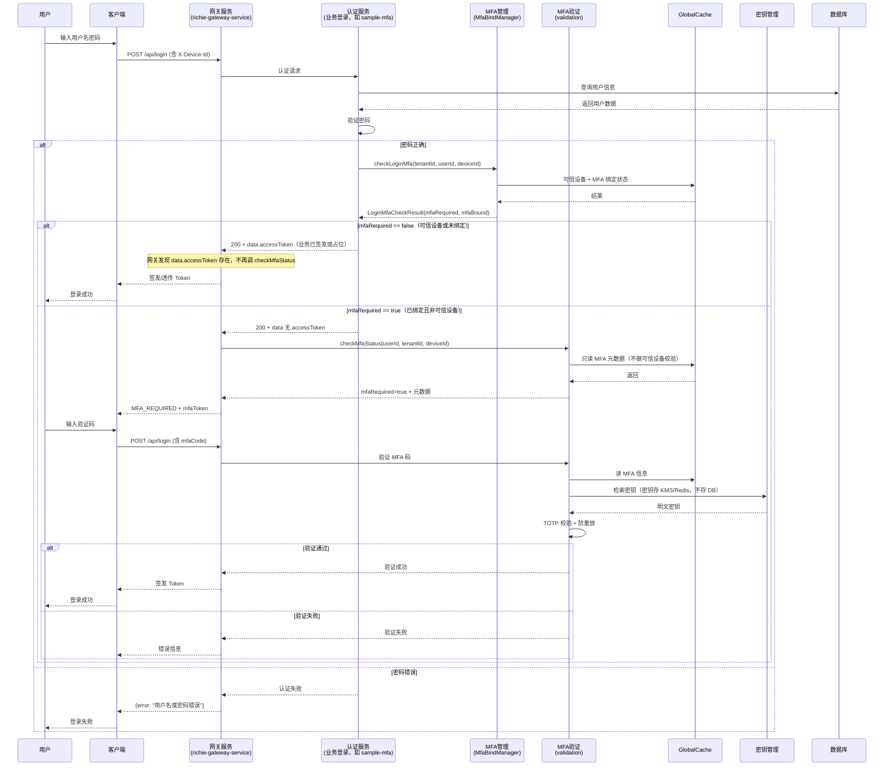

---

## 2. 设备绑定流程

### 2.1 完整绑定流程（含密钥加密和Liquibase）

**架构说明**：绑定流程在通用服务中执行，操作数据库，使用Liquibase管理DDL

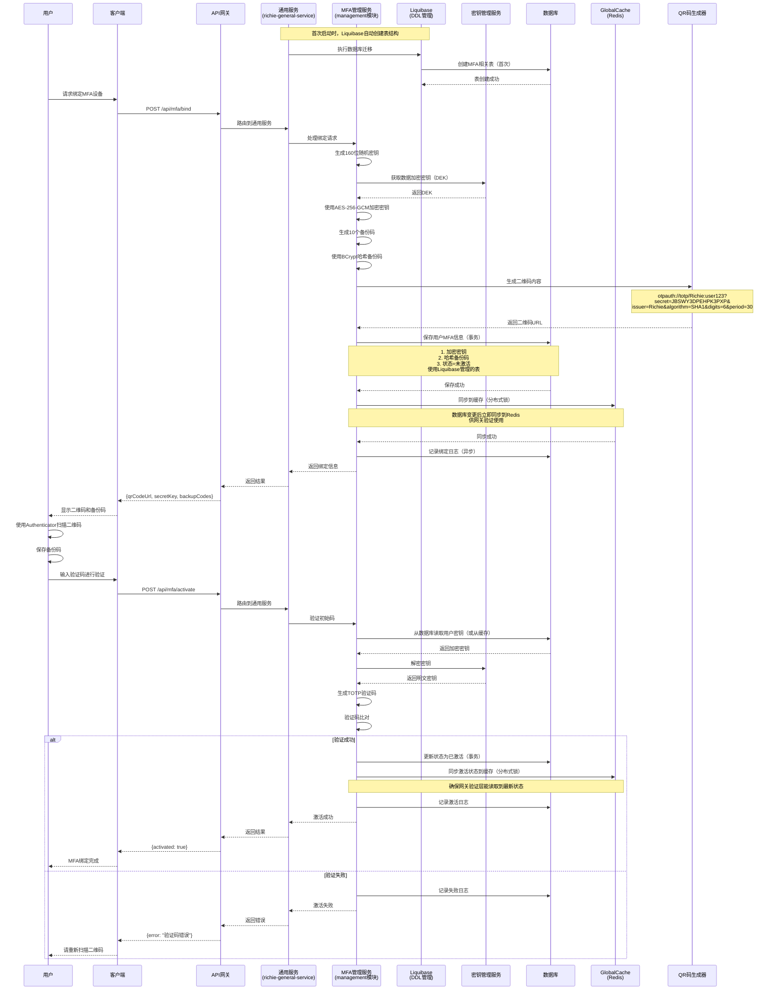

---

## 3. MFA验证流程（带防重放）

### 3.1 详细验证流程（包含防重放检查）

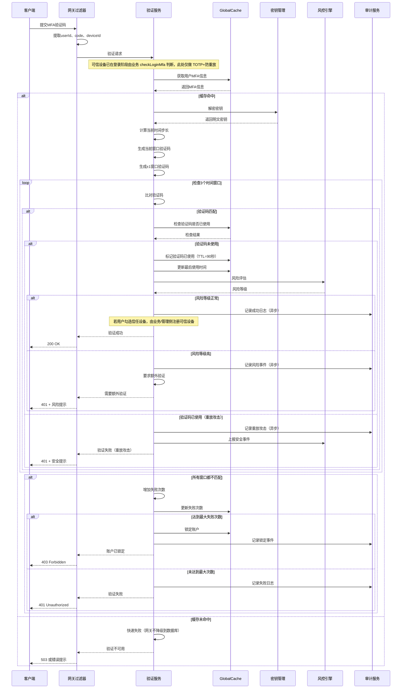

---

## 4. 缓存降级流程

### 4.1 网关验证层缓存故障处理（不降级到数据库）

**架构说明**：网关验证层缓存不可用时快速失败，不降级到数据库，保持网关轻量化

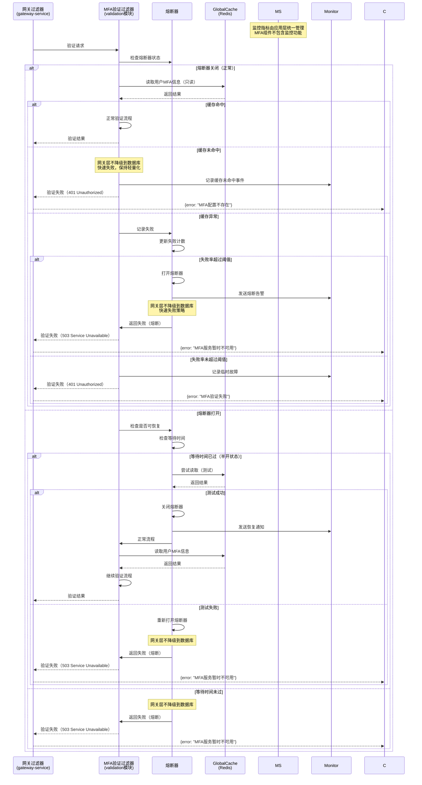

### 4.2 管理服务层缓存降级流程（可降级到数据库）

**架构说明**：管理服务层缓存不可用时可以降级到数据库

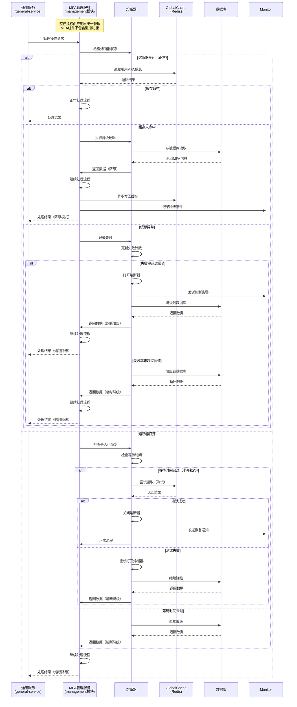

---

## 5. 设备信任验证流程

**说明**：  
- **“是否跳过 MFA”** 在**登录阶段**由业务层 `MfaBindManager.checkLoginMfa` 判断（先查可信设备再查绑定），不在网关验证流程中判断。  
- 本节描述：**登录时**若为可信设备则无需 MFA；以及 **MFA 验证成功后** 用户选择“信任此设备”时，管理服务注册/更新可信设备的流程。

### 5.1 登录阶段可信设备判断 + 验证后可选注册可信设备

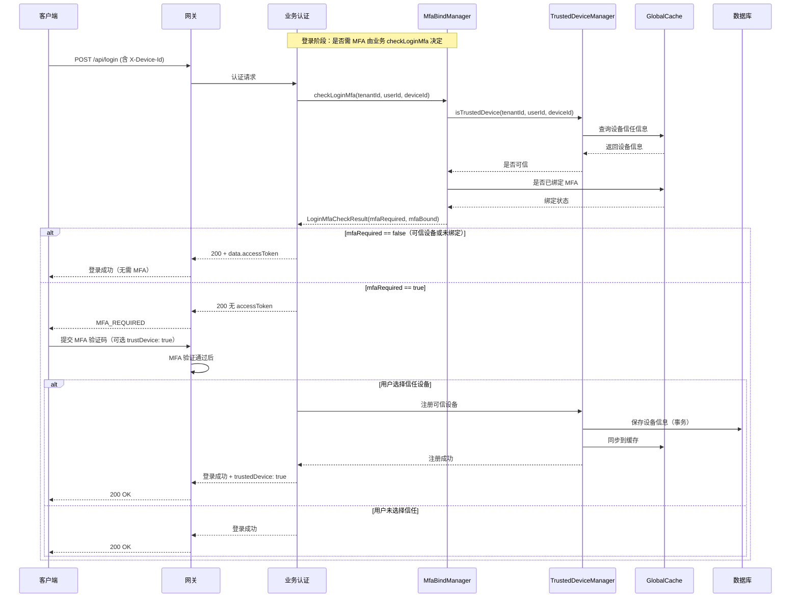

---

## 6. 备份码恢复流程

### 6.1 使用备份码恢复访问

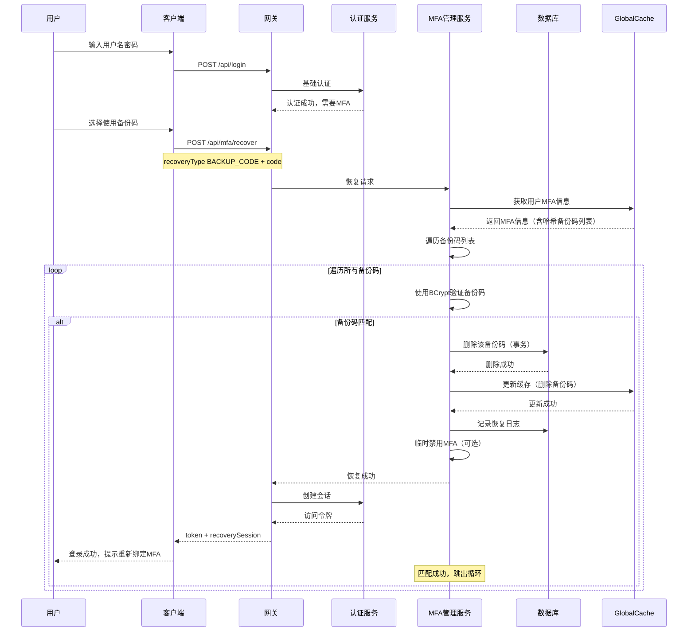

**说明**：若所有备份码均不匹配，则 MS 记录失败尝试与日志，GW 向客户端返回错误，提示用户重试。

---

## 7. 密钥轮换流程

**说明**：当前实现中用户 TOTP 密钥存于 **SecretKeyManager**（KMS/Redis），不存于 `mfa_user_info` 表；轮换时由管理服务与 KMS/Redis 交互，具体策略以组件实现为准。

### 7.1 自动密钥轮换

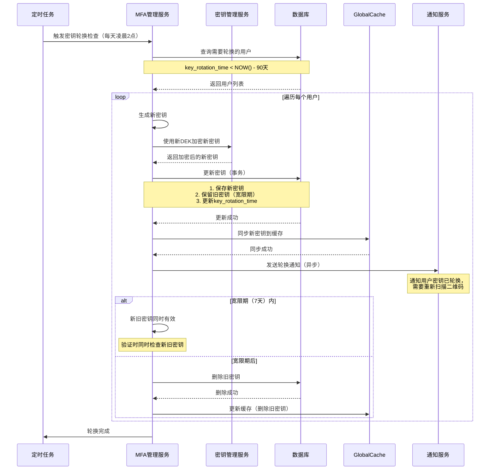

---

## 8. 风控检测流程

### 8.1 风险评分与自适应验证

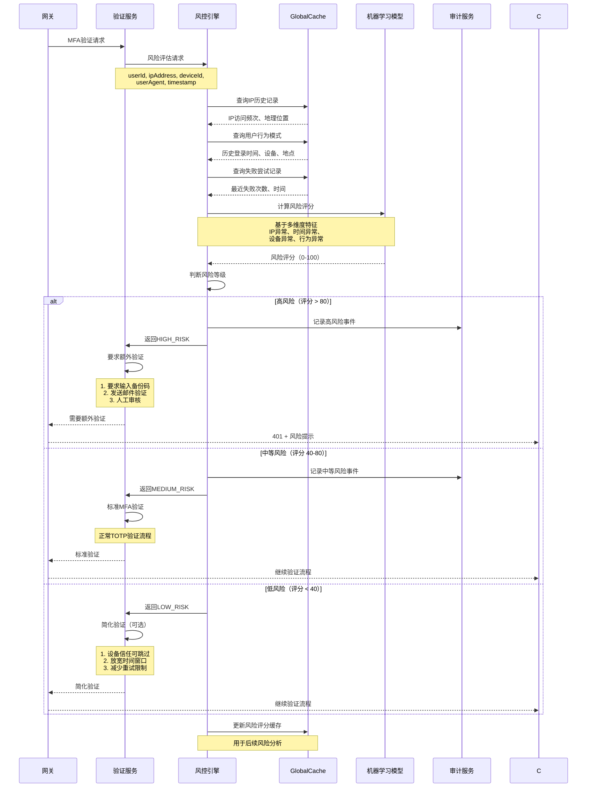

---

## 9. 审计日志流程

**说明**：MFA 组件通过 Spring `ApplicationEventPublisher` 发布审计事件，业务系统通过 `@EventListener` 监听并自行处理（持久化、签名、归档等）。

### 9.1 MFA 审计事件发布与处理

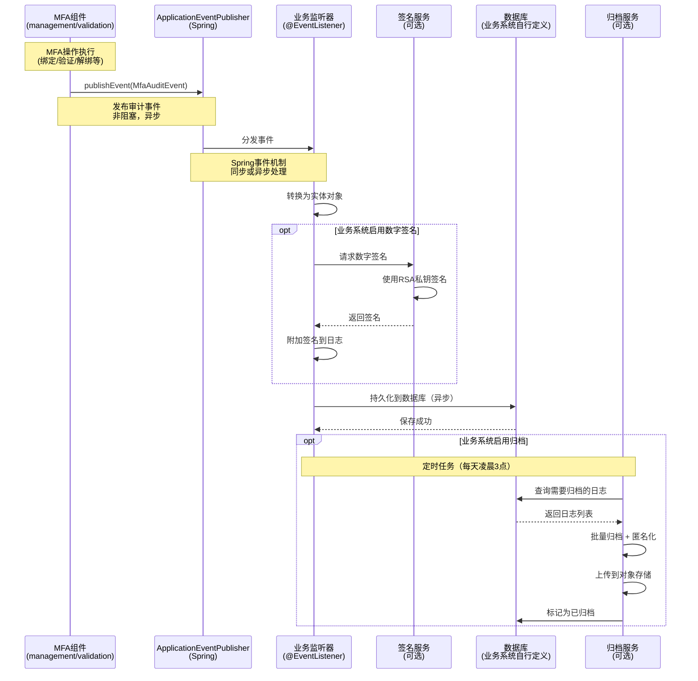

**关键点**：
- MFA 组件只负责发布事件，不直接写数据库
- 业务系统通过 `@EventListener` 监听并自行决定处理方式
- 持久化、签名、归档等由业务系统实现，MFA 组件不关心

---

## 10. 缓存同步流程

### 10.1 数据库变更同步到缓存

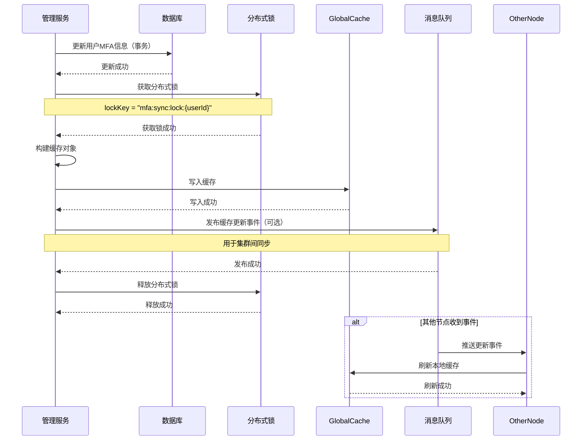

---

*文档版本：v2.0*  
*最后更新：2026年1月15日*
