# MFA组件架构图设计

## 📋 目录

- [颜色图例说明](#颜色图例说明)
- [1. 系统整体架构](#1-系统整体架构)
- [2. 网关验证层架构](#2-网关验证层架构)
- [3. 管理服务层架构](#3-管理服务层架构)
- [4. 数据流架构](#4-数据流架构)
- [5. 安全架构](#5-安全架构)
- [6. 部署架构](#6-部署架构)
- [7. 高可用架构](#7-高可用架构)
- [8. 审计日志架构](#8-审计日志架构)

---

## 颜色图例说明

为了更清晰地展示架构，所有架构图使用统一的颜色标识系统：

### 🎨 颜色分类

| 颜色 | 用途 | 示例 |
|------|------|------|
| 🔵 **蓝色系** | 网关验证层、验证相关组件 | MFA验证过滤器、TOTP引擎、网关节点 |
| 🟠 **橙色系** | 管理服务层、管理相关组件 | MFA管理服务、绑定服务、通用服务节点 |
| 🟢 **绿色系** | 缓存、成功状态、支撑服务 | GlobalCache、Redis、验证成功、KMS服务 |
| 🟡 **黄色系** | 数据库、数据存储 | MySQL、数据库操作、数据持久化 |
| 🔴 **红色系** | 错误、失败、告警 | 验证失败、重放攻击、告警通知 |
| 🟣 **紫色系** | 审计、分析 | 审计日志、日志分析 |
| ⚪ **灰色系** | 对象存储、外部服务 | S3/OSS、消息队列 |

### 📊 节点类型标识

- **深色边框（3px）**：核心组件或关键节点
- **中等边框（2px）**：普通组件或处理节点
- **浅色填充**：辅助组件或可选组件
- **白色文字**：重要组件，需要突出显示

### 🔍 快速识别

- **蓝色节点** = 网关验证相关（部署在gateway-service）
- **橙色节点** = 管理服务相关（部署在general-service）
- **绿色节点** = 缓存/成功状态
- **黄色节点** = 数据库操作
- **红色节点** = 错误/失败场景

---

## 1. 系统整体架构

### 1.1 分层架构图（模块分离）

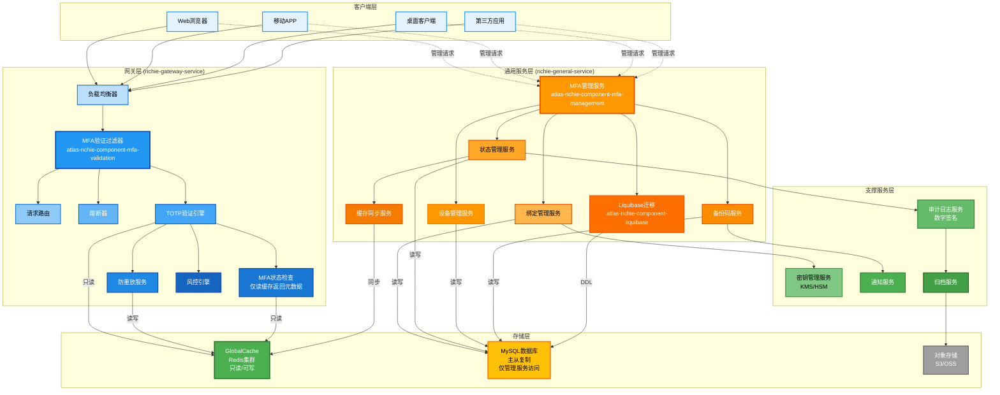

### 1.2 组件交互图

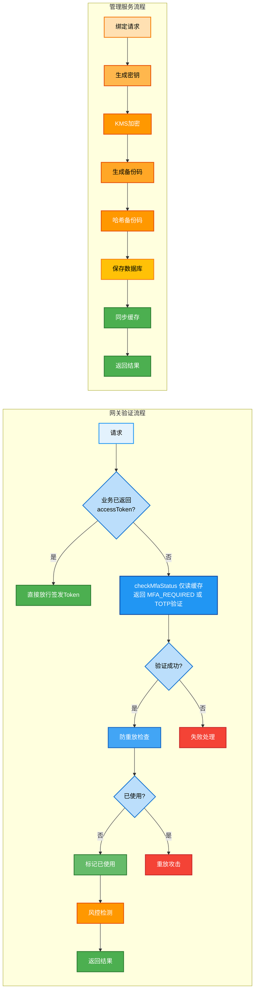

---

## 2. 网关验证层架构

### 2.1 验证过滤器详细架构（网关层）

**部署位置**：`richie-gateway-service`  
**模块**：`richie-component-mfa-validation`

**说明**：可信设备与“是否需要 MFA”由业务登录层 `MfaBindManager.checkLoginMfa` 判断；网关仅在业务未返回 accessToken 时调用 checkMfaStatus（只读缓存，不做设备信任校验），再进入 TOTP 验证。

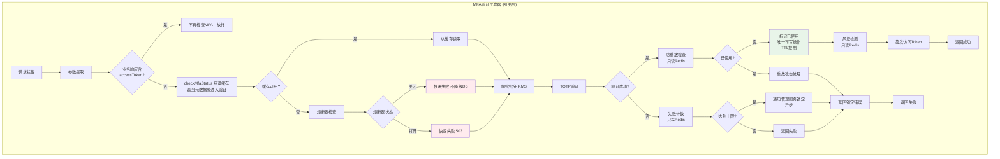

**说明**：网关层缓存不可时时快速失败，不降级到数据库，保持轻量化。

### 2.2 缓存降级架构（网关层 - 快速失败）

**重要说明**：网关层不降级到数据库，缓存不可用时快速失败

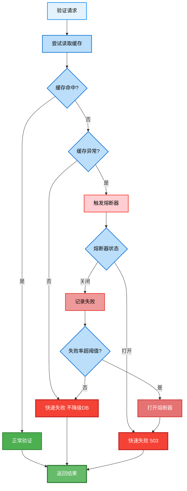

**说明**：网关层缓存未命中或异常时快速失败，不降级到数据库，保持轻量化。

---

## 3. 管理服务层架构

### 3.1 服务模块架构（通用服务层）

**部署位置**：`richie-general-service`  
**模块**：`richie-component-mfa-management`

```mermaid
graph TB
    subgraph Management["MFA管理服务 (通用服务层)"]
        A[API接口层] --> B[服务编排层]
        
        B --> C1[绑定管理服务]
        B --> C2[状态管理服务]
        B --> C3[设备管理服务]
        B --> C4[备份码服务]
        B --> C5[恢复服务]
        
        C1 --> D1[密钥生成]
        C1 --> D2[密钥加密<br/>KMS]
        C1 --> D3[二维码生成]
        C1 --> D4[备份码生成<br/>BCrypt哈希]
        
        C2 --> E1[状态查询<br/>数据库/缓存]
        C2 --> E2[状态更新<br/>数据库+缓存]
        C2 --> E3[账户锁定<br/>数据库+缓存]
        
        C3 --> F1[设备注册<br/>数据库]
        C3 --> F2[设备信任<br/>数据库+缓存]
        C3 --> F3[设备列表<br/>数据库/缓存]
        
        C4 --> G1[备份码生成<br/>BCrypt哈希]
        C4 --> G2[备份码验证<br/>数据库]
        C4 --> G3[备份码删除<br/>数据库]
        
        C5 --> H1[备份码恢复<br/>数据库]
        C5 --> H2[恢复密钥恢复<br/>数据库]
        C5 --> H3[管理员重置<br/>数据库]
        
        C1 --> J[缓存同步服务]
        C2 --> J
        C3 --> J
        C4 --> J
        
        J --> K[分布式锁]
        J --> L[GlobalCache<br/>同步写入]
        J --> M[消息队列<br/>可选]
        
        C1 --> N[发布审计事件<br/>ApplicationEventPublisher]
        C2 --> N
        C3 --> N
        C4 --> N
        C5 --> N
        
        Note over N: MFA组件只发布事件<br/>业务系统监听并处理
        
        R[Liquibase迁移] --> S[DDL管理]
        S --> P
    end
    
    %% API层 - 橙色
    style A fill:#FF9800,stroke:#E65100,stroke-width:3px,color:#FFF
    style B fill:#FFB74D,stroke:#E65100,stroke-width:2px,color:#000
    
    %% 管理服务 - 橙色系
    style C1 fill:#FFA726,stroke:#E65100,stroke-width:2px,color:#000
    style C2 fill:#FF9800,stroke:#E65100,stroke-width:2px,color:#FFF
    style C3 fill:#FB8C00,stroke:#E65100,stroke-width:2px,color:#FFF
    style C4 fill:#F57C00,stroke:#E65100,stroke-width:2px,color:#FFF
    style C5 fill:#EF6C00,stroke:#E65100,stroke-width:2px,color:#FFF
    
    %% 密钥相关 - 蓝色系
    style D1 fill:#E3F2FD,stroke:#2196F3,stroke-width:2px,color:#000
    style D2 fill:#2196F3,stroke:#0D47A1,stroke-width:3px,color:#FFF
    style D3 fill:#42A5F5,stroke:#1565C0,stroke-width:2px,color:#FFF
    style D4 fill:#81C784,stroke:#388E3C,stroke-width:2px,color:#000
    
    %% 状态管理 - 黄色/绿色
    style E1 fill:#FFE082,stroke:#F57F17,stroke-width:2px,color:#000
    style E2 fill:#FFC107,stroke:#F57F17,stroke-width:2px,color:#000
    style E3 fill:#F44336,stroke:#C62828,stroke-width:2px,color:#FFF
    
    %% 设备管理 - 黄色/绿色
    style F1 fill:#FFC107,stroke:#F57F17,stroke-width:2px,color:#000
    style F2 fill:#81C784,stroke:#388E3C,stroke-width:2px,color:#000
    style F3 fill:#FFE082,stroke:#F57F17,stroke-width:2px,color:#000
    
    %% 备份码 - 绿色系
    style G1 fill:#81C784,stroke:#388E3C,stroke-width:2px,color:#000
    style G2 fill:#66BB6A,stroke:#2E7D32,stroke-width:2px,color:#FFF
    style G3 fill:#4CAF50,stroke:#2E7D32,stroke-width:2px,color:#FFF
    
    %% 恢复服务 - 黄色
    style H1 fill:#FFC107,stroke:#F57F17,stroke-width:2px,color:#000
    style H2 fill:#FFD54F,stroke:#F57F17,stroke-width:2px,color:#000
    style H3 fill:#FFE082,stroke:#F57F17,stroke-width:2px,color:#000
    
    %% 缓存同步 - 绿色系
    style J fill:#4CAF50,stroke:#2E7D32,stroke-width:3px,color:#FFF
    style K fill:#81C784,stroke:#388E3C,stroke-width:2px,color:#000
    style L fill:#66BB6A,stroke:#2E7D32,stroke-width:2px,color:#FFF
    style M fill:#A5D6A7,stroke:#4CAF50,stroke-width:2px,color:#000
    
    %% 审计服务 - 紫色系
    style N fill:#BA68C8,stroke:#6A1B9A,stroke-width:2px,color:#FFF
    style O fill:#AB47BC,stroke:#4A148C,stroke-width:2px,color:#FFF
    style Q fill:#9C27B0,stroke:#4A148C,stroke-width:2px,color:#FFF
    
    %% 数据库 - 黄色
    style P fill:#FFC107,stroke:#F57F17,stroke-width:3px,color:#000
    
    %% Liquibase - 蓝色
    style R fill:#2196F3,stroke:#0D47A1,stroke-width:2px,color:#FFF
    style S fill:#42A5F5,stroke:#1565C0,stroke-width:2px,color:#FFF
```

### 3.2 缓存同步架构（管理服务层）

**执行位置**：`richie-general-service`（管理服务）  
**触发时机**：数据库变更后立即同步

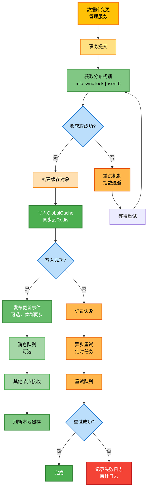

**说明**：数据库变更后立即同步到 Redis，确保网关验证层能读取到最新数据；使用分布式锁（如 `mfa:sync:lock:{userId}`）保证原子性，避免并发冲突。

---

## 4. 数据流架构

### 4.1 验证数据流（网关层）

**执行位置**：`richie-gateway-service`  
**特点**：只读Redis，不操作数据库

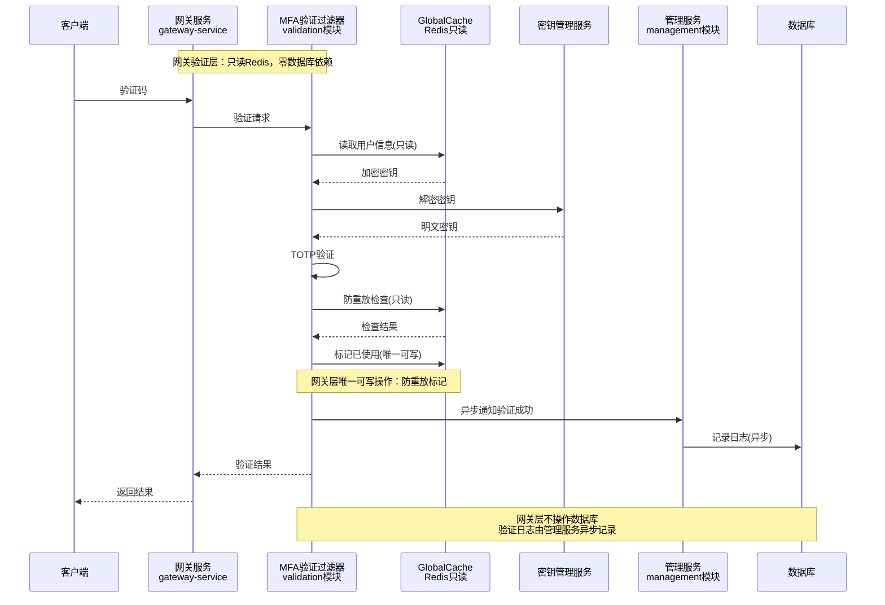

### 4.2 绑定数据流（管理服务层）

**执行位置**：`richie-general-service`  
**特点**：操作数据库，使用Liquibase管理DDL，同步到Redis

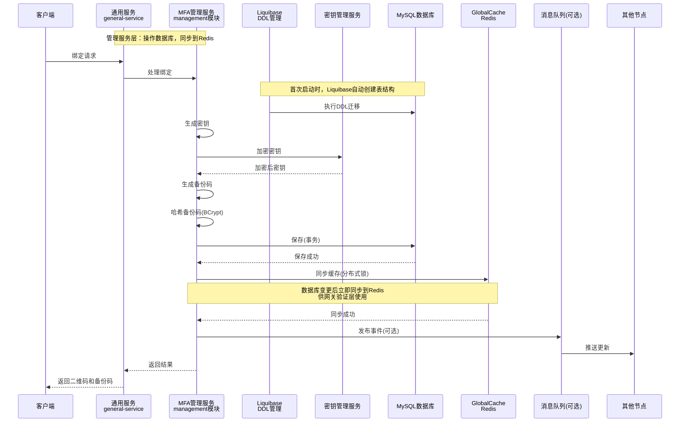

---

## 5. 安全架构

### 5.1 密钥管理架构

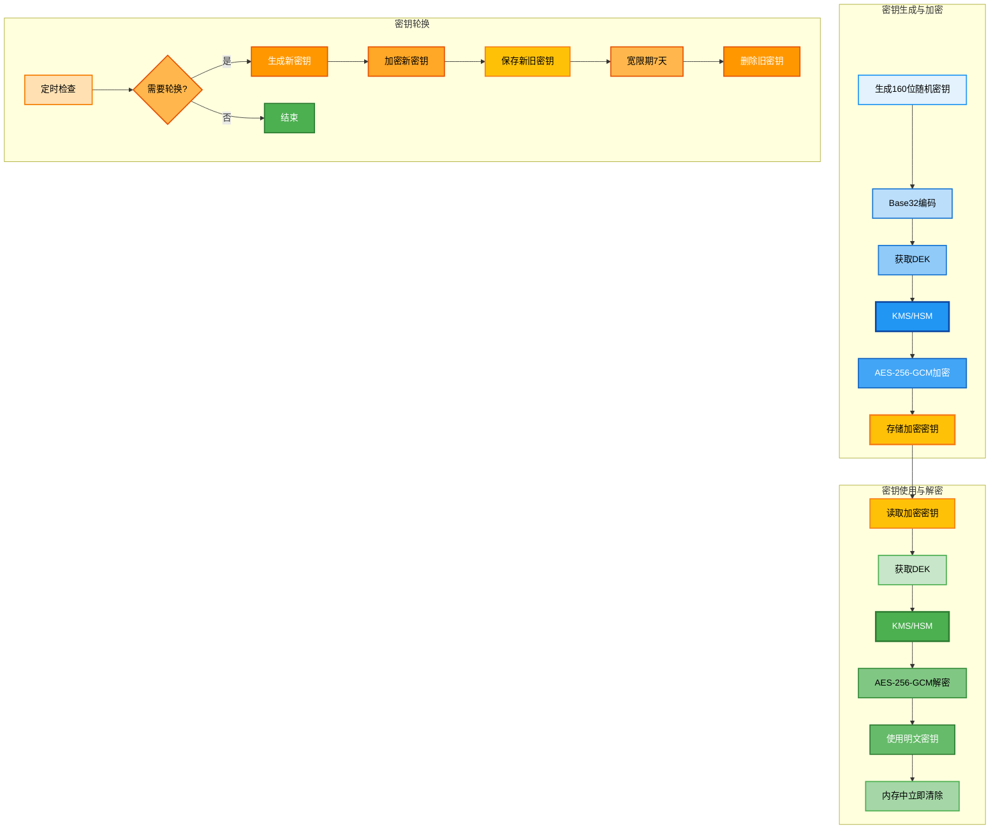

### 5.2 防重放攻击架构

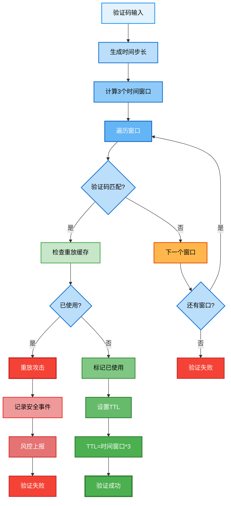

### 5.3 审计日志架构（Spring ApplicationEvent 模式）

**说明**：MFA 组件通过 Spring `ApplicationEventPublisher` 发布审计事件，业务系统通过 `@EventListener` 监听并自行处理（持久化、签名、归档等）。

```mermaid
graph TB
    subgraph MFA["MFA组件层"]
        A[MFA操作执行] --> B[发布审计事件<br/>ApplicationEventPublisher]
    end
    
    subgraph Business["业务系统层"]
        B --> C[业务监听器<br/>@EventListener]
        C --> D[转换为实体对象]
        D --> E{是否启用签名?}
        E -->|是| F[RSA私钥签名]
        E -->|否| G[直接持久化]
        F --> G
        G --> H[保存数据库<br/>业务系统自行定义]
        
        H --> I[定时归档任务]
        I --> J[匿名化处理]
        J --> K[上传对象存储]
    end
    
    subgraph Verify["日志验证流程"]
        L[读取日志] --> M[提取签名]
        M --> N[计算哈希值]
        N --> O[RSA公钥验证]
        O --> P{验证通过?}
        P -->|是| Q[日志完整]
        P -->|否| R[日志被篡改]
    end
    
    %% 日志生成流程 - 蓝色系
    style A fill:#E3F2FD,stroke:#2196F3,stroke-width:2px,color:#000
    style B fill:#BBDEFB,stroke:#1976D2,stroke-width:2px,color:#000
    style C fill:#90CAF9,stroke:#1976D2,stroke-width:2px,color:#000
    style D fill:#64B5F6,stroke:#1565C0,stroke-width:2px,color:#FFF
    style E fill:#42A5F5,stroke:#1565C0,stroke-width:2px,color:#FFF
    style F fill:#2196F3,stroke:#0D47A1,stroke-width:3px,color:#FFF
    style G fill:#1E88E5,stroke:#0D47A1,stroke-width:2px,color:#FFF
    style H fill:#FFC107,stroke:#F57F17,stroke-width:3px,color:#000
    
    %% 归档流程 - 绿色系
    style I fill:#C8E6C9,stroke:#4CAF50,stroke-width:2px,color:#000
    style J fill:#A5D6A7,stroke:#4CAF50,stroke-width:2px,color:#000
    style K fill:#81C784,stroke:#388E3C,stroke-width:2px,color:#000
    
    %% 验证流程 - 橙色系
    style L fill:#FFE0B2,stroke:#F57C00,stroke-width:2px,color:#000
    style M fill:#FFC107,stroke:#F57F17,stroke-width:2px,color:#000
    style N fill:#FFB74D,stroke:#E65100,stroke-width:2px,color:#000
    style O fill:#FFA726,stroke:#E65100,stroke-width:2px,color:#000
    style P fill:#FF9800,stroke:#E65100,stroke-width:2px,color:#FFF
    style Q fill:#FFB74D,stroke:#E65100,stroke-width:2px,color:#000
    
    %% 验证结果 - 绿色/红色
    style R fill:#4CAF50,stroke:#2E7D32,stroke-width:3px,color:#FFF
    style S fill:#F44336,stroke:#C62828,stroke-width:3px,color:#FFF
```

---

## 6. 部署架构

### 6.1 生产环境部署架构

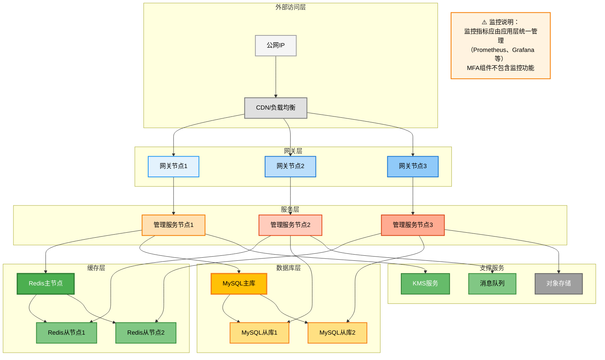

### 6.2 容器化部署架构

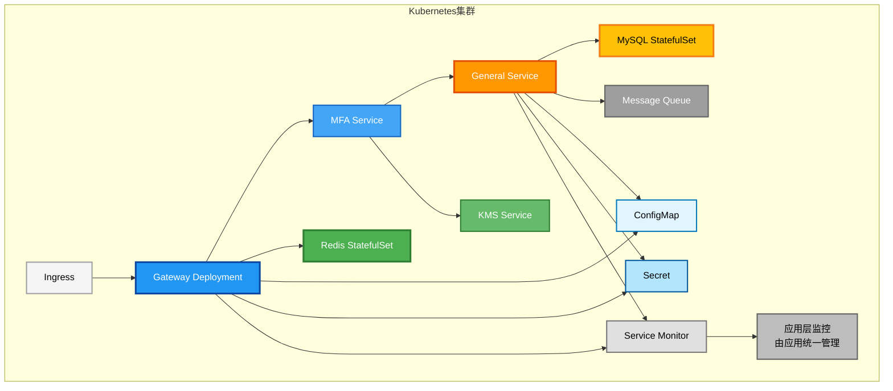

---

## 7. 高可用架构

### 7.1 高可用设计

```mermaid
graph TB
    subgraph GatewayHA["网关高可用"]
        A1[网关节点1] --> B[健康检查]
        A2[网关节点2] --> B
        A3[网关节点3] --> B
        B --> C{健康状态}
        C -->|健康| D[负载均衡]
        C -->|不健康| E[摘除节点]
    end
    
    subgraph CacheHA["缓存高可用"]
        F1[Redis主节点] --> G[Sentinel]
        F2[Redis从节点1] --> G
        F3[Redis从节点2] --> G
        G --> H{主节点故障?}
        H -->|是| I[自动切换]
        H -->|否| J[正常服务]
    end
    
    subgraph DatabaseHA["数据库高可用"]
        K1[MySQL主库] --> L[主从复制]
        K2[MySQL从库1] --> L
        K3[MySQL从库2] --> L
        L --> M{主库故障?}
        M -->|是| N[自动切换]
        M -->|否| O[正常服务]
    end
    
    subgraph ServiceHA["服务高可用"]
        P1[服务实例1] --> Q[服务发现]
        P2[服务实例2] --> Q
        P3[服务实例3] --> Q
        Q --> R[健康检查]
        R --> S{实例健康?}
        S -->|是| T[正常路由]
        S -->|否| U[摘除实例]
    end
    
    %% 网关节点 - 蓝色系
    style A1 fill:#E3F2FD,stroke:#2196F3,stroke-width:2px,color:#000
    style A2 fill:#BBDEFB,stroke:#1976D2,stroke-width:2px,color:#000
    style A3 fill:#90CAF9,stroke:#1976D2,stroke-width:2px,color:#000
    style B fill:#64B5F6,stroke:#1565C0,stroke-width:2px,color:#FFF
    style C fill:#BBDEFB,stroke:#1976D2,stroke-width:2px,color:#000
    style D fill:#4CAF50,stroke:#2E7D32,stroke-width:2px,color:#FFF
    style E fill:#F44336,stroke:#C62828,stroke-width:2px,color:#FFF
    
    %% Redis节点 - 绿色系
    style F1 fill:#4CAF50,stroke:#2E7D32,stroke-width:3px,color:#FFF
    style F2 fill:#81C784,stroke:#388E3C,stroke-width:2px,color:#000
    style F3 fill:#81C784,stroke:#388E3C,stroke-width:2px,color:#000
    style G fill:#66BB6A,stroke:#2E7D32,stroke-width:2px,color:#FFF
    style H fill:#C8E6C9,stroke:#4CAF50,stroke-width:2px,color:#000
    style I fill:#F44336,stroke:#C62828,stroke-width:2px,color:#FFF
    style J fill:#4CAF50,stroke:#2E7D32,stroke-width:2px,color:#FFF
    
    %% MySQL节点 - 黄色系
    style K1 fill:#FFC107,stroke:#F57F17,stroke-width:3px,color:#000
    style K2 fill:#FFE082,stroke:#F57F17,stroke-width:2px,color:#000
    style K3 fill:#FFE082,stroke:#F57F17,stroke-width:2px,color:#000
    style L fill:#FFD54F,stroke:#F57F17,stroke-width:2px,color:#000
    style M fill:#FFE0B2,stroke:#F57C00,stroke-width:2px,color:#000
    style N fill:#F44336,stroke:#C62828,stroke-width:2px,color:#FFF
    style O fill:#4CAF50,stroke:#2E7D32,stroke-width:2px,color:#FFF
    
    %% 服务实例 - 橙色系
    style P1 fill:#FFE0B2,stroke:#F57C00,stroke-width:2px,color:#000
    style P2 fill:#FFCCBC,stroke:#E64A19,stroke-width:2px,color:#000
    style P3 fill:#FFAB91,stroke:#D84315,stroke-width:2px,color:#000
    style Q fill:#FF9800,stroke:#E65100,stroke-width:2px,color:#FFF
    style R fill:#FFB74D,stroke:#E65100,stroke-width:2px,color:#000
    style S fill:#FFB74D,stroke:#E65100,stroke-width:2px,color:#000
    style T fill:#4CAF50,stroke:#2E7D32,stroke-width:2px,color:#FFF
    style U fill:#F44336,stroke:#C62828,stroke-width:2px,color:#FFF
```

### 7.2 容错机制（管理服务层）

**说明**：管理服务层可降级到数据库，网关层不降级

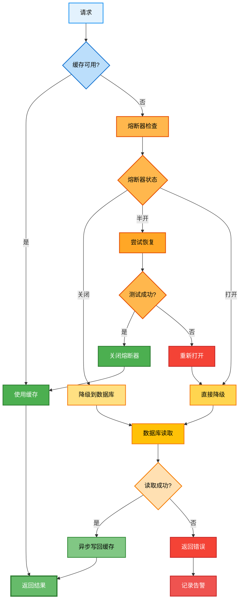

---

## 8. 审计日志架构

> **说明**：MFA组件作为技术组件，不包含监控指标收集功能。监控指标（如Prometheus、Grafana等）应由接入的应用层统一管理和配置。组件只提供必要的审计日志记录功能，用于安全审计和问题排查。

### 8.1 审计日志体系

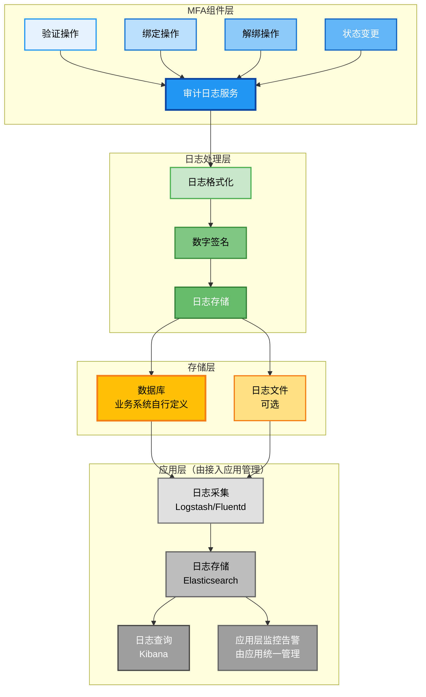

### 8.2 审计日志内容

MFA组件记录的审计日志包含以下信息：

- **操作类型**：BIND、UNBIND、VERIFY、RESET、ENABLE、DISABLE
- **认证方式**：TOTP、HOTP、BACKUP_CODE
- **操作结果**：SUCCESS、FAILED、BLOCKED
- **上下文信息**：IP地址、User-Agent、设备ID
- **数字签名**：RSA-SHA256签名，确保日志完整性

**注意**：监控指标（如QPS、成功率、耗时等）应由接入的应用层通过统一的监控体系（如Prometheus、Micrometer等）进行收集和展示，MFA组件不提供这些功能。

---

*文档版本：v2.0*  
*最后更新：2026年1月15日*
