# RichieMQTT 5.0客户端组件

## 📋 目录
<!-- TOC -->

* [RichieMQTT 5.0客户端组件](#Richiemqtt-50客户端组件)
  * [📋 目录](#-目录)
  * [🎯 组件概述](#-组件概述)
    * [主要特性](#主要特性)
  * [🏗️ 架构设计](#-架构设计)
    * [事件驱动架构](#事件驱动架构)
    * [核心组件架构](#核心组件架构)
    * [事件流设计](#事件流设计)
    * [组件生命周期](#组件生命周期)
    * [各层职责说明](#各层职责说明)
    * [消息发布方流程图](#消息发布方流程图)
    * [消息订阅方流程图](#消息订阅方流程图)
  * [⏱️ 时序图详解](#-时序图详解)
    * [客户端初始化时序图](#客户端初始化时序图)
    * [客户端连接建立时序图](#客户端连接建立时序图)
    * [消息发布时序图](#消息发布时序图)
    * [消息订阅时序图](#消息订阅时序图)
    * [后台保活和监控逻辑时序图](#后台保活和监控逻辑时序图)
    * [快速重连机制时序图](#快速重连机制时序图)
    * [网络质量监控时序图](#网络质量监控时序图)
    * [事件总线通信时序图](#事件总线通信时序图)
    * [遗嘱消息处理时序图](#遗嘱消息处理时序图)
    * [网络切换时序图](#网络切换时序图)
  * [🔄 MQTT 5.0 vs 3.1.1协议对比](#-mqtt-50-vs-311协议对比)
    * [协议架构对比](#协议架构对比)
      * [MQTT 3.1.1 协议架构](#mqtt-311-协议架构)
      * [MQTT 5.0 协议架构](#mqtt-50-协议架构)
    * [功能特性对比](#功能特性对比)
    * [弱网环境对比](#弱网环境对比)
    * [升级前后对比](#升级前后对比)
      * [性能提升对比](#性能提升对比)
      * [商用环境对比](#商用环境对比)
      * [技术架构对比](#技术架构对比)
      * [升级收益总结](#升级收益总结)
  * [🌐 弱网环境优化](#-弱网环境优化)
    * [网络监控与快速恢复原理](#网络监控与快速恢复原理)
      * [网络监控架构](#网络监控架构)
      * [快速重连机制](#快速重连机制)
      * [监控服务架构](#监控服务架构)
    * [网络监控机制](#网络监控机制)
    * [快速重连机制](#快速重连机制-1)
    * [监控服务配置](#监控服务配置)
  * [💀 遗嘱消息支持](#-遗嘱消息支持)
    * [遗嘱消息概述](#遗嘱消息概述)
      * [工作原理](#工作原理)
    * [KDS Box 场景业务价值](#kds-box-场景业务价值)
    * [遗嘱消息配置代码示例](#遗嘱消息配置代码示例)
      * [连接配置片段](#连接配置片段)
      * [遗嘱消息构建](#遗嘱消息构建)
    * [云端处理建议](#云端处理建议)
  * [🚀 快速上手指南](#-快速上手指南)
    * [1. 添加依赖](#1-添加依赖)
    * [2. 配置文件](#2-配置文件)
    * [3. 基础使用](#3-基础使用)
    * [4. 事件订阅](#4-事件订阅)
    * [5. 手工初始化](#5-手工初始化)
    * [6. 高级配置示例](#6-高级配置示例)
      * [生产环境配置](#生产环境配置)
      * [开发环境配置](#开发环境配置)
      * [弱网环境配置](#弱网环境配置)
  * [📚 接口详细说明](#-接口详细说明)
    * [事件订阅与处理](#事件订阅与处理)
      * [连接状态事件处理](#连接状态事件处理)
      * [网络质量事件处理](#网络质量事件处理)
      * [心跳事件处理](#心跳事件处理)
    * [消息发布与订阅流程图](#消息发布与订阅流程图)
      * [消息发布方流程](#消息发布方流程)
      * [消息订阅方流程](#消息订阅方流程)
    * [公共接口方法](#公共接口方法)
      * [1. `initialClient(MqttServerInfo serverInfo)`](#1-initialclientmqttserverinfo-serverinfo)
      * [2. `initialClient(MqttServerInfo serverInfo, boolean enable)`](#2-initialclientmqttserverinfo-serverinfo-boolean-enable)
      * [3. `changeServer(NetworkTypeEnum networkType, String host, int port)`](#3-changeservernetworktypeenum-networktype-string-host-int-port)
      * [4. `changeServer(NetworkTypeEnum networkType)`](#4-changeservernetworktypeenum-networktype)
      * [5. `doPublish(String topic, byte[] value)`](#5-dopublishtopic-topic-byte-value)
      * [6. `doPublish(String topic, byte[] value, boolean retained)`](#6-dopublishtopic-topic-byte-value-boolean-retained)
      * [7. `registerConsumer(String topic, Consumer<ConsumerMessage> callback)`](#7-registerconsumertopic-topic-consumerconsumermessage-callback)
      * [8. `unregisterConsumer(String topic)`](#8-unregisterconsumertopic-topic)
      * [9. `reinitialize()`](#9-reinitialize)
    * [自动处理方法](#自动处理方法)
      * [1. 网络监控](#1-网络监控)
      * [2. 连接监控](#2-连接监控)
      * [3. 快速重连](#3-快速重连)
      * [4. 心跳维护](#4-心跳维护)
      * [5. 消息处理](#5-消息处理)
  * [📋 使用场景示例](#-使用场景示例)
    * [场景1: 设备状态上报](#场景1-设备状态上报)
      * [设备状态上报架构](#设备状态上报架构)
      * [完整实现代码](#完整实现代码)
    * [场景2: 动态配置下发](#场景2-动态配置下发)
      * [配置下发流程](#配置下发流程)
      * [完整实现代码](#完整实现代码)
    * [场景3: 高可用消息处理](#场景3-高可用消息处理)
      * [高可用消息处理架构](#高可用消息处理架构)
      * [完整实现代码](#完整实现代码)
    * [场景4: 故障恢复处理](#场景4-故障恢复处理)
      * [故障恢复机制](#故障恢复机制)
      * [完整实现代码](#完整实现代码)
  * [⚙️ 配置说明](#-配置说明)
    * [核心配置参数](#核心配置参数)
    * [MQTT 5.0专用配置](#mqtt-50专用配置)
      * [会话管理配置](#会话管理配置)
      * [消息可靠性配置](#消息可靠性配置)
      * [网络优化配置](#网络优化配置)
    * [快速恢复配置详解](#快速恢复配置详解)
      * [网络监控配置](#网络监控配置)
      * [重连机制配置](#重连机制配置)
      * [监控开关配置](#监控开关配置)
  * [🔧 故障排查](#-故障排查)
    * [故障诊断流程图](#故障诊断流程图)
      * [连接故障诊断](#连接故障诊断)
      * [消息丢失诊断](#消息丢失诊断)
    * [常见问题及解决方案](#常见问题及解决方案)
      * [1. 连接失败](#1-连接失败)
      * [2. 消息丢失](#2-消息丢失)
      * [3. 订阅失败](#3-订阅失败)
      * [4. 频繁重连](#4-频繁重连)
      * [5. 内存泄漏](#5-内存泄漏)
    * [监控指标](#监控指标)
      * [监控指标体系](#监控指标体系)
      * [连接状态指标](#连接状态指标)
      * [性能指标](#性能指标)
      * [资源指标](#资源指标)
    * [日志配置](#日志配置)
    <!-- TOC -->

## 🎯 组件概述

RichieMQTT 5.0客户端组件是基于HiveMQ 1.3.7版本开发的商用级MQTT客户端，采用**事件驱动架构**设计，专门针对长时间断网后的快速恢复进行了深度优化。组件支持MQTT 5.0协议的所有新特性，包括会话过期、消息过期、主题别名、用户属性、遗嘱消息等。

### 主要特性

- ✅ **事件驱动架构**: 基于Reactor响应式编程，支持事件流订阅和处理
- ✅ **MQTT 5.0协议支持**: 完整支持MQTT 5.0协议特性
- ✅ **快速恢复机制**: 网络恢复后1秒内开始重连
- ✅ **多网络支持**: 支持公网/VPC网络动态切换
- ✅ **手工初始化**: 支持服务端配置下发初始化
- ✅ **会话保持**: 断网期间保持会话状态和消息队列
- ✅ **智能监控**: 网络连通性和连接状态实时监控
- ✅ **商用级稳定性**: 针对生产环境优化的重连和错误处理
- ✅ **遗嘱消息支持**: 设备异常离线时自动通知云端
- ✅ **职责分离**: 技术异常自动处理，业务事件完全暴露给调用者
- ✅ **事件循环防护**: 防止事件在组件内部形成循环
- ✅ **资源优化**: 使用try-with-resources避免资源泄漏
- ✅ **代码精简**: 移除无用变量和功能，提高代码质量

## 🏗️ 架构设计

### 事件驱动架构

RichieMQTT 5.0组件采用**事件驱动架构**设计，基于Reactor响应式编程模型，通过事件总线实现组件间的松耦合通信。这种架构设计具有以下优势：

- **松耦合设计**: 组件间通过事件通信，减少直接依赖
- **响应式编程**: 基于Reactor的Flux事件流，支持背压控制
- **职责分离**: 技术异常自动处理，业务事件完全暴露给调用者
- **事件循环防护**: 防止事件在组件内部形成循环

### 核心组件架构

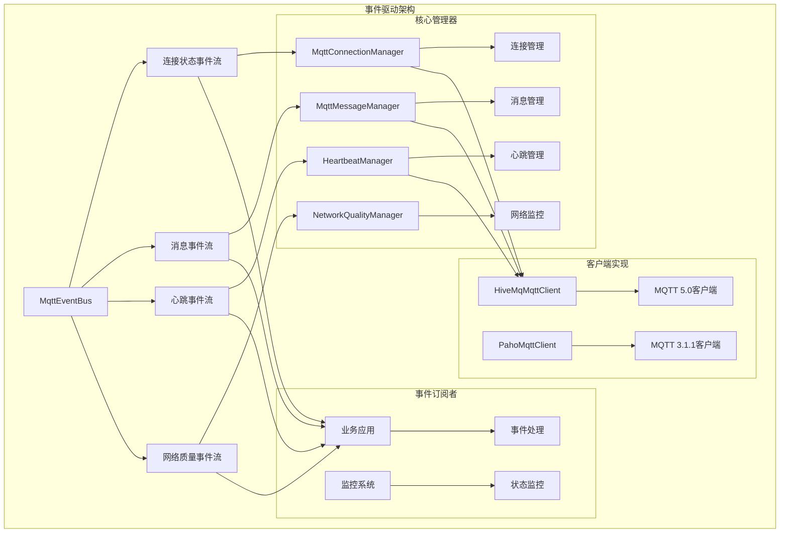

### 事件流设计

#### 连接状态事件流 (`connectionStateFlow`)
- **事件类型**: `ConnectionStateEvent`
- **订阅目的**: 监控连接状态变化，处理技术异常
- **事件内容**: 连接状态、客户端ID、时间戳、原因码
- **处理策略**: 
  - 技术异常（ABNORMAL_DISCONNECT、SESSION_EXPIRED）自动处理
  - 业务事件（CONNECTED、DISCONNECTED等）暴露给调用者

#### 消息事件流 (`messageFlow`)
- **事件类型**: `MessageEvent`
- **订阅目的**: 消息传递状态监控
- **事件内容**: 消息ID、主题、QoS、时间戳、状态
- **处理策略**: 完全暴露给调用者，支持业务逻辑处理

#### 心跳事件流 (`heartbeatFlow`)
- **事件类型**: `HeartbeatEvent`
- **订阅目的**: 心跳状态监控
- **事件内容**: 心跳时间、延迟、状态
- **处理策略**: 内部监控使用，支持外部订阅

#### 网络质量事件流 (`networkQualityFlow`)
- **事件类型**: `NetworkQualityEvent`
- **订阅目的**: 网络质量监控
- **事件内容**: 延迟、丢包率、网络类型
- **处理策略**: 内部网络管理，支持外部监控

### 组件生命周期

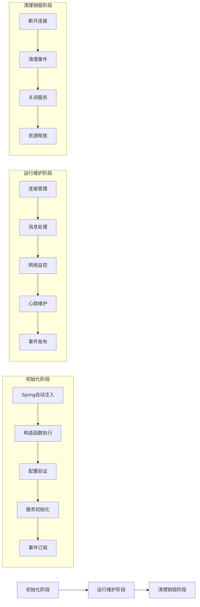

#### 初始化阶段
- **Spring自动注入**: 组件被Spring容器管理
- **构造函数执行**: 创建必要的管理器和客户端
- **配置验证**: 验证MQTT服务器配置
- **服务初始化**: 启动网络监控、连接监控等服务
- **事件订阅**: 订阅必要的技术异常事件

#### 运行维护阶段
- **连接管理**: 维护MQTT连接状态，处理技术异常
- **消息处理**: 处理消息发布、订阅、去重等
- **网络监控**: 监控网络连通性，触发重连
- **心跳维护**: 发送心跳消息，检测连接健康
- **事件发布**: 发布各种状态事件，通知订阅者

#### 清理销毁阶段
- **断开连接**: 优雅断开MQTT连接
- **清理事件**: 清理所有事件流和订阅
- **关闭服务**: 关闭监控服务和线程池
- **资源释放**: 释放所有占用的资源

<rect fill="none" x="0" y="0" height="1587" width="1123"/><path fill="#fff2ae" id="shape1" fill-rule="nonzero" transform="translate(333.070634,75.590551)" stroke="#454545" d="M467.7,113.4L467.7,.0L.0,.0L.0,113.4L467.7,113.4z" stroke-width="1"/><g id="shape2" transform="translate(505.432839,75.590551)"><text xml:space="preserve" style="fill:#454545;font-family:微软雅黑,PingFang SC,Mircrosoft YaHei,Arial;font-size:20px"><tspan x="34.0" textLength="52.0" y="19.0" style="font-size:13px">客户端层</tspan></text></g><g id="shape3" transform="translate(367.637335,113.385827)"><path fill="#fff2ae" fill-rule="nonzero" stroke="#454545" d="M111.7,30.7L111.7,11.0C111.7,4.9,106.7,.0,100.7,.0L11.0,.0C4.9,.0,.0,4.9,.0,11.0L.0,30.7C.0,36.7,4.9,41.7,11.0,41.7L100.7,41.7C106.7,41.7,111.7,36.7,111.7,30.7z" stroke-width="1"/><text xml:space="preserve" style="fill:#191919;font-family:微软雅黑,PingFang SC,Mircrosoft YaHei,Arial;font-size:20px"><tspan x="36.3" textLength="39.0" y="26.3" style="font-size:13px">应用层</tspan></text></g><g id="shape4" transform="translate(511.101673,113.385870)"><path fill="#fff2ae" fill-rule="nonzero" stroke="#454545" d="M111.7,30.7L111.7,11.0C111.7,4.9,106.7,.0,100.7,.0L11.0,.0C4.9,.0,.0,4.9,.0,11.0L.0,30.7C.0,36.7,4.9,41.7,11.0,41.7L100.7,41.7C106.7,41.7,111.7,36.7,111.7,30.7z" stroke-width="1"/><text xml:space="preserve" style="fill:#191919;font-family:微软雅黑,PingFang SC,Mircrosoft YaHei,Arial;font-size:20px"><tspan x="36.3" textLength="39.0" y="26.5" style="font-size:13px">业务层</tspan></text></g><g id="shape5" transform="translate(654.566469,113.385827)"><path fill="#fff2ae" fill-rule="nonzero" stroke="#454545" d="M111.7,30.7L111.7,11.0C111.7,4.9,106.7,.0,100.7,.0L11.0,.0C4.9,.0,.0,4.9,.0,11.0L.0,30.7C.0,36.7,4.9,41.7,11.0,41.7L100.7,41.7C106.7,41.7,111.7,36.7,111.7,30.7z" stroke-width="1"/><text xml:space="preserve" style="fill:#191919;font-family:微软雅黑,PingFang SC,Mircrosoft YaHei,Arial;font-size:20px"><tspan x="36.3" textLength="39.0" y="26.5" style="font-size:13px">配置层</tspan></text></g><path fill="#fff2ae" id="shape6" fill-rule="nonzero" transform="translate(333.070634,226.976378)" stroke="#454545" d="M467.7,113.2L467.7,.0L.0,.0L.0,113.2L467.7,113.2z" stroke-width="1"/><g id="shape7" transform="translate(505.432634,226.976378)"><text xml:space="preserve" style="fill:#454545;font-family:微软雅黑,PingFang SC,Mircrosoft YaHei,Arial;font-size:20px"><tspan x="40.5" textLength="39.0" y="19.0" style="font-size:13px">连接层</tspan></text></g><g id="shape8" transform="translate(366.140834,276.149578)"><path fill="#fff2ae" fill-rule="nonzero" stroke="#454545" d="M111.7,30.7L111.7,11.0C111.7,4.9,106.7,.0,100.7,.0L11.0,.0C4.9,.0,.0,4.9,.0,11.0L.0,30.7C.0,36.7,4.9,41.7,11.0,41.7L100.7,41.7C106.7,41.7,111.7,36.7,111.7,30.7z" stroke-width="1"/><text xml:space="preserve" style="fill:#191919;font-family:微软雅黑,PingFang SC,Mircrosoft YaHei,Arial;font-size:20px"><tspan x="29.8" textLength="52.0" y="26.5" style="font-size:13px">网络监控</tspan></text></g><g id="shape9" transform="translate(509.605834,276.149578)"><path fill="#fff2ae" fill-rule="nonzero" stroke="#454545" d="M111.7,30.7L111.7,11.0C111.7,4.9,106.7,.0,100.7,.0L11.0,.0C4.9,.0,.0,4.9,.0,11.0L.0,30.7C.0,36.7,4.9,41.7,11.0,41.7L100.7,41.7C106.7,41.7,111.7,36.7,111.7,30.7z" stroke-width="1"/><text xml:space="preserve" style="fill:#191919;font-family:微软雅黑,PingFang SC,Mircrosoft YaHei,Arial;font-size:20px"><tspan x="29.8" textLength="52.0" y="26.5" style="font-size:13px">连接监控</tspan></text></g><g id="shape10" transform="translate(653.070834,276.149578)"><path fill="#fff2ae" fill-rule="nonzero" stroke="#454545" d="M111.7,30.7L111.7,11.0C111.7,4.9,106.7,.0,100.7,.0L11.0,.0C4.9,.0,.0,4.9,.0,11.0L.0,30.7C.0,36.7,4.9,41.7,11.0,41.7L100.7,41.7C106.7,41.7,111.7,36.7,111.7,30.7z" stroke-width="1"/><text xml:space="preserve" style="fill:#191919;font-family:微软雅黑,PingFang SC,Mircrosoft YaHei,Arial;font-size:20px"><tspan x="29.8" textLength="52.0" y="26.5" style="font-size:13px">快速重连</tspan></text></g><g id="shape11" transform="translate(566.928902,188.976378)"><path fill="none" stroke="#303030" d="M.0,.0L.0,32.0" stroke-width="1"/><path fill="#303030" stroke-linecap="round" stroke="#303030" d="M3.0,32.0L.0,38.0L-3.0,32.0L3.0,32.0" stroke-width="1"/></g><path fill="#fff2ae" id="shape12" fill-rule="nonzero" transform="translate(333.070634,377.952756)" stroke="#454545" d="M467.7,113.4L467.7,.0L.0,.0L.0,113.4L467.7,113.4z" stroke-width="1"/><g id="shape13" transform="translate(505.432634,377.952756)"><text xml:space="preserve" style="fill:#454545;font-family:微软雅黑,PingFang SC,Mircrosoft YaHei,Arial;font-size:20px"><tspan x="21.5" textLength="77.0" y="19.0" style="font-size:13px">MQTT协议层</tspan></text></g><g id="shape14" transform="translate(366.140834,427.125956)"><path fill="#fff2ae" fill-rule="nonzero" stroke="#454545" d="M111.7,30.7L111.7,11.0C111.7,4.9,106.7,.0,100.7,.0L11.0,.0C4.9,.0,.0,4.9,.0,11.0L.0,30.7C.0,36.7,4.9,41.7,11.0,41.7L100.7,41.7C106.7,41.7,111.7,36.7,111.7,30.7z" stroke-width="1"/><text xml:space="preserve" style="fill:#191919;font-family:微软雅黑,PingFang SC,Mircrosoft YaHei,Arial;font-size:20px"><tspan x="29.8" textLength="52.0" y="26.5" style="font-size:13px">会话管理</tspan></text></g><g id="shape15" transform="translate(509.605834,427.125956)"><path fill="#fff2ae" fill-rule="nonzero" stroke="#454545" d="M111.7,30.7L111.7,11.0C111.7,4.9,106.7,.0,100.7,.0L11.0,.0C4.9,.0,.0,4.9,.0,11.0L.0,30.7C.0,36.7,4.9,41.7,11.0,41.7L100.7,41.7C106.7,41.7,111.7,36.7,111.7,30.7z" stroke-width="1"/><text xml:space="preserve" style="fill:#191919;font-family:微软雅黑,PingFang SC,Mircrosoft YaHei,Arial;font-size:20px"><tspan x="29.8" textLength="52.0" y="26.5" style="font-size:13px">消息传递</tspan></text></g><g id="shape16" transform="translate(653.070834,427.125956)"><path fill="#fff2ae" fill-rule="nonzero" stroke="#454545" d="M111.7,30.7L111.7,11.0C111.7,4.9,106.7,.0,100.7,.0L11.0,.0C4.9,.0,.0,4.9,.0,11.0L.0,30.7C.0,36.7,4.9,41.7,11.0,41.7L100.7,41.7C106.7,41.7,111.7,36.7,111.7,30.7z" stroke-width="1"/><text xml:space="preserve" style="fill:#191919;font-family:微软雅黑,PingFang SC,Mircrosoft YaHei,Arial;font-size:20px"><tspan x="29.8" textLength="52.0" y="26.5" style="font-size:13px">主题订阅</tspan></text></g><g id="shape17" transform="translate(566.929134,340.157480)"><path fill="none" stroke="#303030" d="M.0,.0L.0,30.8" stroke-width="1"/><path fill="#303030" stroke-linecap="round" stroke="#303030" d="M3.0,30.8L.0,36.8L-3.0,30.8L3.0,30.8" stroke-width="1"/></g><path fill="#fff2ae" id="shape18" fill-rule="nonzero" transform="translate(333.070634,528.339200)" stroke="#454545" d="M467.7,113.4L467.7,.0L.0,.0L.0,113.4L467.7,113.4z" stroke-width="1"/><g id="shape19" transform="translate(499.251518,528.339200)"><text xml:space="preserve" style="fill:#454545;font-family:微软雅黑,PingFang SC,Mircrosoft YaHei,Arial;font-size:20px"><tspan x="8.2" textLength="116.0" y="19.0" style="font-size:13px">RichieMQTT组件实现</tspan></text></g><g id="shape20" transform="translate(366.140834,577.512300)"><path fill="#fff2ae" fill-rule="nonzero" stroke="#454545" d="M111.7,30.7L111.7,11.0C111.7,4.9,106.7,.0,100.7,.0L11.0,.0C4.9,.0,.0,4.9,.0,11.0L.0,30.7C.0,36.7,4.9,41.7,11.0,41.7L100.7,41.7C106.7,41.7,111.7,36.7,111.7,30.7z" stroke-width="1"/><text xml:space="preserve" style="fill:#191919;font-family:微软雅黑,PingFang SC,Mircrosoft YaHei,Arial;font-size:20px"><tspan x="16.8" textLength="78.0" y="26.5" style="font-size:13px">弱网连接增强</tspan></text></g><g id="shape21" transform="translate(509.605834,577.512300)"><path fill="#fff2ae" fill-rule="nonzero" stroke="#454545" d="M111.7,30.7L111.7,11.0C111.7,4.9,106.7,.0,100.7,.0L11.0,.0C4.9,.0,.0,4.9,.0,11.0L.0,30.7C.0,36.7,4.9,41.7,11.0,41.7L100.7,41.7C106.7,41.7,111.7,36.7,111.7,30.7z" stroke-width="1"/><text xml:space="preserve" style="fill:#191919;font-family:微软雅黑,PingFang SC,Mircrosoft YaHei,Arial;font-size:20px"><tspan x="10.3" textLength="91.0" y="26.5" style="font-size:13px">手工初始化接口</tspan></text></g><g id="shape22" transform="translate(653.070834,577.512300)"><path fill="#fff2ae" fill-rule="nonzero" stroke="#454545" d="M111.7,30.7L111.7,11.0C111.7,4.9,106.7,.0,100.7,.0L11.0,.0C4.9,.0,.0,4.9,.0,11.0L.0,30.7C.0,36.7,4.9,41.7,11.0,41.7L100.7,41.7C106.7,41.7,111.7,36.7,111.7,30.7z" stroke-width="1"/><text xml:space="preserve" style="fill:#191919;font-family:微软雅黑,PingFang SC,Mircrosoft YaHei,Arial;font-size:20px"><tspan x="16.8" textLength="78.0" y="26.5" style="font-size:13px">网络切换机制</tspan></text></g><g id="shape23" transform="translate(566.929134,492.000000)"><path fill="none" stroke="#303030" d="M.0,.0L-0.0,30.3" stroke-width="1"/><path fill="#303030" stroke-linecap="round" stroke="#303030" d="M3.0,30.3L-0.0,36.3L-3.0,30.3L3.0,30.3" stroke-width="1"/></g><path fill="#fff2ae" id="shape24" fill-rule="nonzero" transform="translate(333.070634,680.315161)" stroke="#454545" d="M467.7,113.4L467.7,.0L.0,.0L.0,113.4L467.7,113.4z" stroke-width="1"/><g id="shape25" transform="translate(505.432634,680.315061)"><text xml:space="preserve" style="fill:#454545;font-family:微软雅黑,PingFang SC,Mircrosoft YaHei,Arial;font-size:20px"><tspan x="27.5" textLength="65.0" y="19.0" style="font-size:13px">消息处理层</tspan></text></g><g id="shape26" transform="translate(366.140834,729.488261)"><path fill="#fff2ae" fill-rule="nonzero" stroke="#454545" d="M111.7,30.7L111.7,11.0C111.7,4.9,106.7,.0,100.7,.0L11.0,.0C4.9,.0,.0,4.9,.0,11.0L.0,30.7C.0,36.7,4.9,41.7,11.0,41.7L100.7,41.7C106.7,41.7,111.7,36.7,111.7,30.7z" stroke-width="1"/><text xml:space="preserve" style="fill:#191919;font-family:微软雅黑,PingFang SC,Mircrosoft YaHei,Arial;font-size:20px"><tspan x="29.8" textLength="52.0" y="26.5" style="font-size:13px">消息发布</tspan></text></g><g id="shape27" transform="translate(509.605834,729.488261)"><path fill="#fff2ae" fill-rule="nonzero" stroke="#454545" d="M111.7,30.7L111.7,11.0C111.7,4.9,106.7,.0,100.7,.0L11.0,.0C4.9,.0,.0,4.9,.0,11.0L.0,30.7C.0,36.7,4.9,41.7,11.0,41.7L100.7,41.7C106.7,41.7,111.7,36.7,111.7,30.7z" stroke-width="1"/><text xml:space="preserve" style="fill:#191919;font-family:微软雅黑,PingFang SC,Mircrosoft YaHei,Arial;font-size:20px"><tspan x="29.8" textLength="52.0" y="26.5" style="font-size:13px">消息订阅</tspan></text></g><g id="shape28" transform="translate(653.070834,729.488261)"><path fill="#fff2ae" fill-rule="nonzero" stroke="#454545" d="M111.7,30.7L111.7,11.0C111.7,4.9,106.7,.0,100.7,.0L11.0,.0C4.9,.0,.0,4.9,.0,11.0L.0,30.7C.0,36.7,4.9,41.7,11.0,41.7L100.7,41.7C106.7,41.7,111.7,36.7,111.7,30.7z" stroke-width="1"/><text xml:space="preserve" style="fill:#191919;font-family:微软雅黑,PingFang SC,Mircrosoft YaHei,Arial;font-size:20px"><tspan x="29.8" textLength="52.0" y="26.5" style="font-size:13px">消息过滤</tspan></text></g><g id="shape29" transform="translate(566.928634,641.725200)"><path fill="none" stroke="#303030" d="M.0,.0L.0,32.6" stroke-width="1"/><path fill="#303030" stroke-linecap="round" stroke="#303030" d="M3.0,32.6L.0,38.6L-3.0,32.6L3.0,32.6" stroke-width="1"/></g><path fill="#fff2ae" id="shape30" fill-rule="nonzero" transform="translate(333.070634,830.701200)" stroke="#454545" d="M467.7,113.4L467.7,.0L.0,.0L.0,113.4L467.7,113.4z" stroke-width="1"/><g id="shape31" transform="translate(505.432634,830.701100)"><text xml:space="preserve" style="fill:#454545;font-family:微软雅黑,PingFang SC,Mircrosoft YaHei,Arial;font-size:20px"><tspan x="34.0" textLength="52.0" y="19.0" style="font-size:13px">服务器层</tspan></text></g><g id="shape32" transform="translate(366.140834,879.874300)"><path fill="#fff2ae" fill-rule="nonzero" stroke="#454545" d="M111.7,30.7L111.7,11.0C111.7,4.9,106.7,.0,100.7,.0L11.0,.0C4.9,.0,.0,4.9,.0,11.0L.0,30.7C.0,36.7,4.9,41.7,11.0,41.7L100.7,41.7C106.7,41.7,111.7,36.7,111.7,30.7z" stroke-width="1"/><text xml:space="preserve" style="fill:#191919;font-family:微软雅黑,PingFang SC,Mircrosoft YaHei,Arial;font-size:20px"><tspan x="14.8" textLength="82.0" y="26.5" style="font-size:13px">MQTT Broker</tspan></text></g><g id="shape33" transform="translate(509.605834,879.874300)"><path fill="#fff2ae" fill-rule="nonzero" stroke="#454545" d="M111.7,30.7L111.7,11.0C111.7,4.9,106.7,.0,100.7,.0L11.0,.0C4.9,.0,.0,4.9,.0,11.0L.0,30.7C.0,36.7,4.9,41.7,11.0,41.7L100.7,41.7C106.7,41.7,111.7,36.7,111.7,30.7z" stroke-width="1"/><text xml:space="preserve" style="fill:#191919;font-family:微软雅黑,PingFang SC,Mircrosoft YaHei,Arial;font-size:20px"><tspan x="29.8" textLength="52.0" y="26.5" style="font-size:13px">会话存储</tspan></text></g><g id="shape34" transform="translate(653.070834,879.874300)"><path fill="#fff2ae" fill-rule="nonzero" stroke="#454545" d="M111.7,30.7L111.7,11.0C111.7,4.9,106.7,.0,100.7,.0L11.0,.0C4.9,.0,.0,4.9,.0,11.0L.0,30.7C.0,36.7,4.9,41.7,11.0,41.7L100.7,41.7C106.7,41.7,111.7,36.7,111.7,30.7z" stroke-width="1"/><text xml:space="preserve" style="fill:#191919;font-family:微软雅黑,PingFang SC,Mircrosoft YaHei,Arial;font-size:20px"><tspan x="29.8" textLength="52.0" y="26.5" style="font-size:13px">消息队列</tspan></text></g><g id="shape35" transform="translate(566.928634,793.701161)"><path fill="none" stroke="#303030" d="M.0,.0L.0,31.0" stroke-width="1"/><path fill="#303030" stroke-linecap="round" stroke="#303030" d="M3.0,31.0L.0,37.0L-3.0,31.0L3.0,31.0" stroke-width="1"/></g><path fill="#fff2ae" id="shape36" fill-rule="nonzero" transform="translate(333.070634,982.677265)" stroke="#454545" d="M467.7,113.4L467.7,.0L.0,.0L.0,113.4L467.7,113.4z" stroke-width="1"/><g id="shape37" transform="translate(505.432634,982.677165)"><text xml:space="preserve" style="fill:#454545;font-family:微软雅黑,PingFang SC,Mircrosoft YaHei,Arial;font-size:20px"><tspan x="40.5" textLength="39.0" y="19.0" style="font-size:13px">存储层</tspan></text></g><g id="shape38" transform="translate(366.140834,1031.850365)"><path fill="#fff2ae" fill-rule="nonzero" stroke="#454545" d="M111.7,30.7L111.7,11.0C111.7,4.9,106.7,.0,100.7,.0L11.0,.0C4.9,.0,.0,4.9,.0,11.0L.0,30.7C.0,36.7,4.9,41.7,11.0,41.7L100.7,41.7C106.7,41.7,111.7,36.7,111.7,30.7z" stroke-width="1"/><text xml:space="preserve" style="fill:#191919;font-family:微软雅黑,PingFang SC,Mircrosoft YaHei,Arial;font-size:20px"><tspan x="23.3" textLength="65.0" y="26.5" style="font-size:13px">消息持久化</tspan></text></g><g id="shape39" transform="translate(509.605834,1031.850365)"><path fill="#fff2ae" fill-rule="nonzero" stroke="#454545" d="M111.7,30.7L111.7,11.0C111.7,4.9,106.7,.0,100.7,.0L11.0,.0C4.9,.0,.0,4.9,.0,11.0L.0,30.7C.0,36.7,4.9,41.7,11.0,41.7L100.7,41.7C106.7,41.7,111.7,36.7,111.7,30.7z" stroke-width="1"/><text xml:space="preserve" style="fill:#191919;font-family:微软雅黑,PingFang SC,Mircrosoft YaHei,Arial;font-size:20px"><tspan x="29.8" textLength="52.0" y="26.5" style="font-size:13px">会话状态</tspan></text></g><g id="shape40" transform="translate(653.070834,1031.850365)"><path fill="#fff2ae" fill-rule="nonzero" stroke="#454545" d="M111.7,30.7L111.7,11.0C111.7,4.9,106.7,.0,100.7,.0L11.0,.0C4.9,.0,.0,4.9,.0,11.0L.0,30.7C.0,36.7,4.9,41.7,11.0,41.7L100.7,41.7C106.7,41.7,111.7,36.7,111.7,30.7z" stroke-width="1"/><text xml:space="preserve" style="fill:#191919;font-family:微软雅黑,PingFang SC,Mircrosoft YaHei,Arial;font-size:20px"><tspan x="29.8" textLength="52.0" y="26.5" style="font-size:13px">配置存储</tspan></text></g><g id="shape41" transform="translate(566.928634,945.000000)"><path fill="none" stroke="#303030" d="M.0,.0L-0.0,31.7" stroke-width="1"/><path fill="#303030" stroke-linecap="round" stroke="#303030" d="M3.0,31.7L-0.0,37.7L-3.0,31.7L3.0,31.7" stroke-width="1"/></g><path fill="#fff2ae" id="shape42" fill-rule="nonzero" transform="translate(333.070634,1133.858368)" stroke="#454545" d="M467.7,113.4L467.7,.0L.0,.0L.0,113.4L467.7,113.4z" stroke-width="1"/><g id="shape43" transform="translate(505.432634,1133.858268)"><text xml:space="preserve" style="fill:#454545;font-family:微软雅黑,PingFang SC,Mircrosoft YaHei,Arial;font-size:20px"><tspan x="40.5" textLength="39.0" y="19.0" style="font-size:13px">安全层</tspan></text></g><g id="shape44" transform="translate(366.140834,1183.034468)"><path fill="#fff2ae" fill-rule="nonzero" stroke="#454545" d="M111.7,30.7L111.7,11.0C111.7,4.9,106.7,.0,100.7,.0L11.0,.0C4.9,.0,.0,4.9,.0,11.0L.0,30.7C.0,36.7,4.9,41.7,11.0,41.7L100.7,41.7C106.7,41.7,111.7,36.7,111.7,30.7z" stroke-width="1"/><text xml:space="preserve" style="fill:#191919;font-family:微软雅黑,PingFang SC,Mircrosoft YaHei,Arial;font-size:20px"><tspan x="29.8" textLength="52.0" y="26.5" style="font-size:13px">身份认证</tspan></text></g><g id="shape45" transform="translate(509.605834,1183.034468)"><path fill="#fff2ae" fill-rule="nonzero" stroke="#454545" d="M111.7,30.7L111.7,11.0C111.7,4.9,106.7,.0,100.7,.0L11.0,.0C4.9,.0,.0,4.9,.0,11.0L.0,30.7C.0,36.7,4.9,41.7,11.0,41.7L100.7,41.7C106.7,41.7,111.7,36.7,111.7,30.7z" stroke-width="1"/><text xml:space="preserve" style="fill:#191919;font-family:微软雅黑,PingFang SC,Mircrosoft YaHei,Arial;font-size:20px"><tspan x="29.8" textLength="52.0" y="26.5" style="font-size:13px">数据加密</tspan></text></g><g id="shape46" transform="translate(653.070834,1183.034468)"><path fill="#fff2ae" fill-rule="nonzero" stroke="#454545" d="M111.7,30.7L111.7,11.0C111.7,4.9,106.7,.0,100.7,.0L11.0,.0C4.9,.0,.0,4.9,.0,11.0L.0,30.7C.0,36.7,4.9,41.7,11.0,41.7L100.7,41.7C106.7,41.7,111.7,36.7,111.7,30.7z" stroke-width="1"/><text xml:space="preserve" style="fill:#191919;font-family:微软雅黑,PingFang SC,Mircrosoft YaHei,Arial;font-size:20px"><tspan x="29.8" textLength="52.0" y="26.5" style="font-size:13px">访问控制</tspan></text></g><g id="shape47" transform="translate(566.928634,1097.000000)"><path fill="none" stroke="#303030" d="M.0,.0L.0,30.9" stroke-width="1"/><path fill="#303030" stroke-linecap="round" stroke="#303030" d="M3.0,30.9L.0,36.9L-3.0,30.9L3.0,30.9" stroke-width="1"/></g></g>
### 各层职责说明

#### 客户端层
- **应用层**: 业务逻辑处理，消息格式转换
- **业务层**: 消息路由、过滤、转换
- **配置层**: 客户端配置管理，动态配置下发

#### 连接层
- **网络监控**: 实时检测网络连通性，5秒间隔检测
- **连接监控**: 监控MQTT连接状态，10秒间隔检测
- **快速重连**: 自动重试机制（指数退避 + 随机抖动）
  - 支持无限重试模式（配置 `max-fast-reconnect-attempts <= 0`）
  - 支持有限重试模式（配置 `max-fast-reconnect-attempts > 0`）
  - 重试间隔按指数增长（1倍、2倍、4倍...），最大不超过5分钟
  - 每次重试间隔添加20%~100%的随机抖动，避免多个客户端同时重试

#### MQTT协议层
- **会话管理**: MQTT 5.0会话过期机制，支持2小时会话保持
- **消息传递**: QoS 0/1/2消息传递，支持消息过期机制
- **主题订阅**: 支持主题别名，最大10个主题别名

#### RichieMQTT组件实现
- **HiveMqMqttClient**: 基于HiveMQ 1.3.7的MQTT 5.0客户端实现
- **手工初始化接口**: 支持服务端配置下发的手工初始化
- **网络切换机制**: 支持公网/VPC网络动态切换
- **网络类型广播**: 每秒广播一次当前网络类型，通过事件总线发布
  - 使用虚拟线程提高性能
  - 支持优雅关闭和资源清理
  - 广播频率：每秒一次

#### 消息处理层
- **消息发布**: 支持retained消息，消息重试机制
- **消息订阅**: 支持批量订阅，主题监听器管理
  - **普通订阅**: 基于 `LISTENER_CACHE` 的精确匹配
  - **共享订阅**: 基于 `SHARED_LISTENER_CACHE` 的通配符匹配（MQTT 5.0 特性）
- **消息分发**: 基于事件总线的消息分发机制
  - 订阅 `MqttEventBus.messageFlow` 事件流（仅订阅一次，防止重复订阅）
  - 自动将消息路由到对应的业务回调
  - 支持普通订阅和共享订阅的自动匹配
  - 支持通配符匹配（`+` 单级通配符，`#` 多级通配符）
- **消息过滤**: 基于主题的消息过滤和路由

#### 服务器层
- **MQTT Broker**: 支持MQTT 5.0协议的服务器
- **会话存储**: 客户端会话状态持久化
- **消息队列**: 离线消息队列管理

#### 存储层
- **消息持久化**: 重要消息本地持久化存储
- **会话状态**: 客户端会话状态本地缓存
- **配置存储**: 客户端配置信息本地存储

#### 安全层
- **身份认证**: 用户名密码认证机制
- **数据加密**: TLS/SSL加密传输
- **访问控制**: 基于主题的访问权限控制

### 消息发布方流程图

[点击查看大图](https://mermaid-live.nodejs.cn/view#pako:eNp9ld1S20YUx1_Fs9eGkWQbB190prGTQBIHG5yQsvaFwAvWFCRHlpOmwjOmlMElEKAlnSYhODQlZprWpk0LnjDAy2RX8lt0tbuu5QmtLjTSnt_5n489K9lgxsgjEANzplosBDKJrB6g1-cQf9hxdg7xVguvHeYCAwOfBa7CiaKp6XPu6q90jbw_xCsHI9pDlHyQfGBZ8XkN6VaOu19lDnFI9r7tVF_j1TPy7Ih813D31wUQZ0DC7qxsOGdN8lMLb72lsWjECgcSHrBIDYuBa9DZqZPaFm7-TGonzrvWaCLnh6jrYmAKOqc_kFd1YbnG9K9DTdesCWQ-1GYQrr3CjSd4_UeBXGfIDYhrL_Hph2Q6kwlEBqV_gwjqBqNGoNs8p4m6F3vk6QHe_IbWI4ARBoxCbvJkyO4GXtvHzw8FMcqImzYneK1eOWt1UevNXq23IO-483KbPG1wpZyfYsXehp3VDbf1jCsK-20WJmlzE_lt3-s5C-Yer3Seb4lgyZ7MqH-Fhb9D6zzCZ0IY__KH-1dX_haTH2MdvYOsR4b5ZdKgz4bpnG07p7s84z44xeC4oetoxtIMXfBc_BI-3eVL5QVkjiDVtKaRauGLZffkfV8v-H0cfmy_oIvu0TIdnLyRKk_Pa6UCn9YJSN5USf1ARFs7JtUl4T3BgEz_hvz-BrfbokeZXkfuQq5e5No0OYuOOd7cxu1lclwjS91ByfT6eg-6jbcUmVVL1jia4fVPalZhHFnmY8HfY0lMQnzxrlOte5t2sSdMk8x03-aLlwzMfV9-_hUW_QuxhzzHvj28y4SnIE9cAM11qt3X11J5mn8NsoCfdf80ZgGHvGuMz4QMSWsz4jS-9zr-9xM-DzkfJnNOsblJHPfNlnt-XvFhSq-IsRAkr1dpIdzjY3uD4nQbcp_grAtjYVuInvzJd9WvG_bpRsTeXNL2XgO8K8VHmNUmS6K47jj5PFK8uJTy3-PEMF9xqZBI4n_Cp_mJkCFuviC7dQ-uLvGT4OPTPHhascUh-XRWGOYLnr40ONLzIEj_AVoexCyzjIKAnsAF1XsFtodkgVVACygLYvQxj2bV8rzljUKFuhVVfcowFrqeplGeK4DYrDpfom_lYl61UEJT6Uj1EBoPmXGjrFsgFpKGmAaI2eArEBuIXpEGJSmiRBR5SApFQ-EgeAxishQdHI5KIelKZCiqhCUlXAmCr1nY8GAoKsmyIivDkWEpOiQHAcp7X5ok_7WxP1zlHxVFAbE)

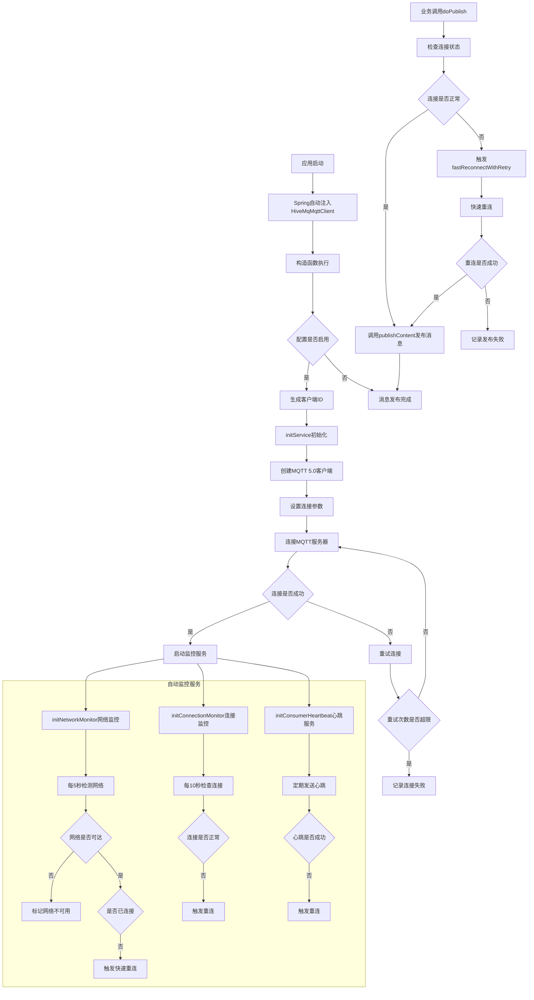

### 消息订阅方流程图
[点击查看大图](https://mermaid-live.nodejs.cn/view#pako:eNqNlt1S20YUx1_Fo2tgwMgGfNEZsAEb4mADaRIWXwi8gKZgE1lOmhpmTAnBED5MQzKQAA4EaqYBTJsWmDjAy7Ar-S262rOO5UJmqguNpP3t-dr_2VVKGo5HseSRRjVlcszR7xuMOdjVisiXdWP9kGQLZPEw4qit_cHRhvomNTU2as7_wb7Rz4dk7sCvPsXBJ8Enuu4dV3FMj8D0Nj7Bi-jOi1L6A5m_pG9O6ULe3F0SgJcDvlRpbtm4PKEbBZL9nfliHqcB8FnAFBuYcrQjYz1HM1lyskcz58anQsAXsUNs6pRjABnF13Q7J0bauf0OpMZUvQ9rT9VhTDLbJP-KLL0VSAdHOhHJvCfFL8Fwf7_DVVf_zYmgOjnlR-bJFQvUvN6hKwdk9VeWjwD8HAggGLLM0K1lsrhLNg8FEeBEVwoIyNVKZzEncu2q5NqNoOLG-zW6kgdLETvFk72HSvPLZuENWBTj97ibYAqG6NGuVXPuzDybK21mhbNgxUzA_oW7v8_yPCWXwjDZ_9P8u2y-m5vv4RW9j_Vnce2nYJw9xzXjcs0obkHEVXCIw954LIaHdTUeEzwYv4MPl_lEcgJrfqxo-hBWdHI9a55_rqoF3HvRzcU79tE8nWXC0fComtCxVp4Pou1DllBfLtGzDJ0pkP0XRvZlZWn6ONOPwEI03pccSgxr6hA2T_ZKG3M3F8XS3oZg-zn7QCgB7LEkSPaoYu8BZ35ExvECuZoTPjOn5tVVVeAPUZVO6MphKT0DNET9CI0pseg4DuJEQhnFELYAwMQjzj1GwsdKkS07_ZimufJ6PebAQAokwEbJ_jLAQggDlWVvbWWV3CNfZ-1YxI5xvbS1oZvrbXK88S0x4-tr9lpuetH1XmReHpFVJopNWJ__Vt0rut8n1q-ULppXa0BV1SmRHIJtaVCCTcfeFoMSQNbVA-JsQLSw6jLyv1mV-OcVCDNiwxqAc6ZgSOw7qwW2QNM2zFnJuacR0Q_zrCtgxs3FMsOZViK3cF7JHlkUnJz_BTq325Vtdl3IzDPXa-T6Uymds5r2esdu1AWhuq1Wp29P7xBkpU7WFYKW4yVoqBc1yB1UbRGcgxqEnNX70fFHcnFhizVkq0GoUcR6K8pQIxiT_2-UYWj0BkRO3tGtnGUzPQMNbuPDEGPYmRK9f3vP5JgtxvCdMeJY9Dt6EgKY2WN6B-XZ9dTOzhwbAHKC1uzoQCNKQu_Fw7CvPVT1sV6sa89t8XeIs4UdLnevbqc4VvwpGPpOgn5_RVmBQFWN6UKabi3cqrSYwUvS1cXOxLxRPIYTwUYF4Ejq7kYiP97PlhjWzyqVk2rYT4EalTy6lsQ1EttSJxTrVUpZyKCkj-EJPCh52GMUjyjJcd0q4TSbNqnEBuLxifJMLZ4cHZM8I8p4gr0lJ6OKjn2qwpaigjB_1tadjOmSx8UtSJ6U9LPkqW10s2NZlhubnQ31slOub6qRnkseZ3Od3NLkdspu2emSnc0t0zXSL9ynXNfgbml2Ncsul9vV1OJqqZFw1Dp3gvCjw_93pv8FzQ34qA)
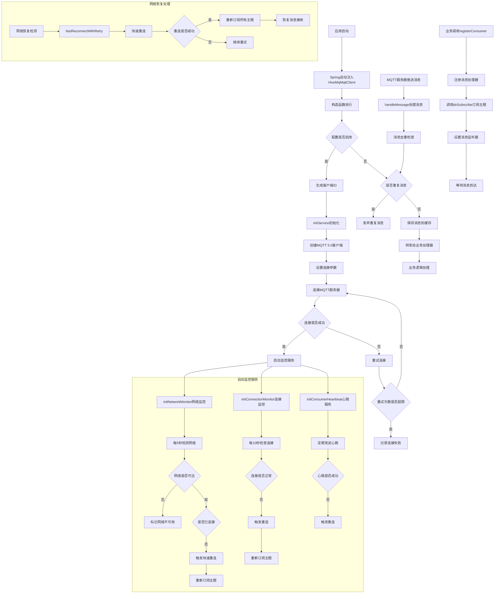

## 🔄 MQTT 5.0 vs 3.1.1协议对比

### 协议架构对比

#### MQTT 3.1.1 协议架构

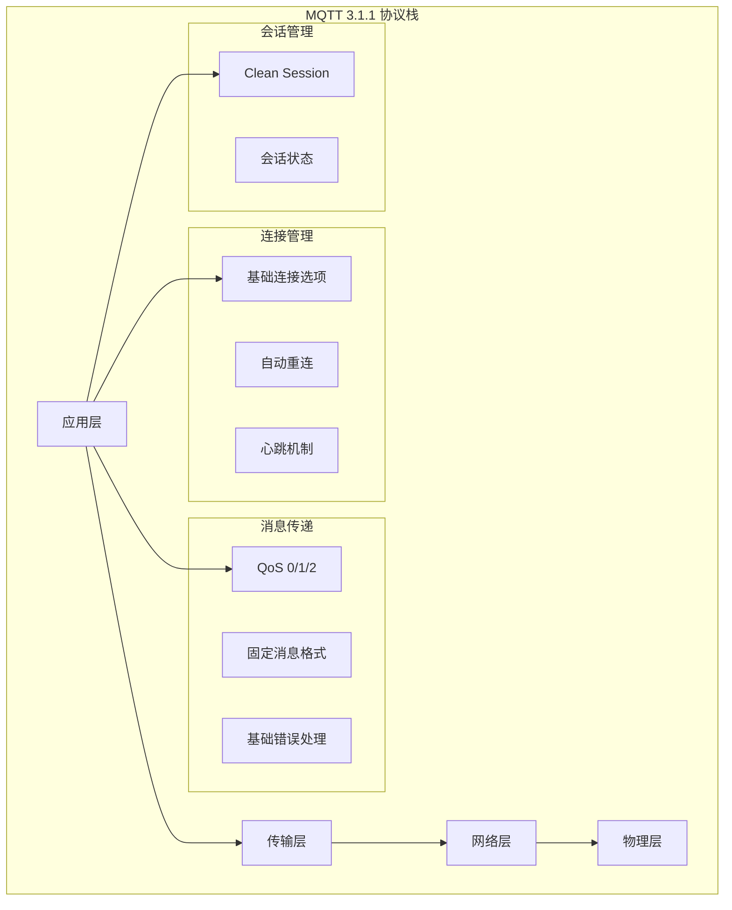

#### MQTT 5.0 协议架构

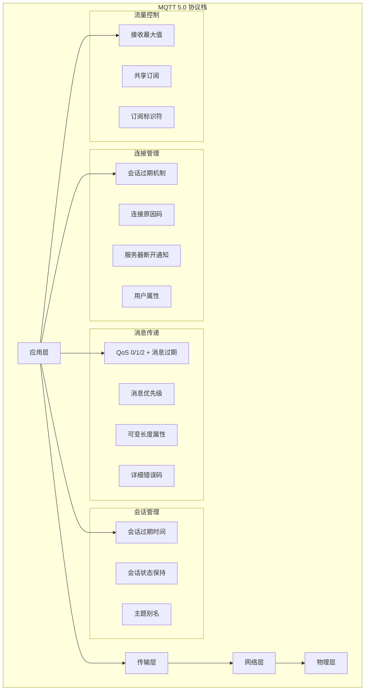

### 功能特性对比

| 特性       | MQTT 3.1.1 | MQTT 5.0         | 优势说明       |
|----------|------------|------------------|------------|
| **连接管理** | 基础连接选项     | 会话过期、连接原因码       | 更精确的连接状态控制 |
| **消息传递** | QoS 0/1/2  | QoS 0/1/2 + 消息过期 | 防止过期消息传递   |
| **主题订阅** | 基础订阅       | 主题别名、订阅选项        | 减少网络传输开销   |
| **用户属性** | 不支持        | 支持用户属性           | 更丰富的元数据传递  |
| **错误处理** | 基础错误码      | 详细错误码和原因字符串      | 更精确的错误诊断   |
| **流量控制** | 不支持        | 接收最大值控制          | 防止客户端过载    |
| **消息格式** | 固定格式       | 可变长度属性           | 更灵活的消息结构   |

### 弱网环境对比

| 场景       | MQTT 3.1.1                                   | MQTT 5.0                                         | 推荐方案                                                        |
|----------|----------------------------------------------|--------------------------------------------------|-------------------------------------------------------------|
| **短期断网** | 自动重连<br>⭐⭐                                   | 会话保持 + 自动重连<br>⭐⭐⭐⭐⭐                             | MQTT 5.0更优                                                  |
| **长期断网** | 会话丢失<br>⭐⭐⭐                                  | 会话过期机制<br>⭐⭐⭐⭐⭐                                  | MQTT 5.0更优                                                  |
| **网络切换** | 重新连接<br>⭐⭐⭐                                  | 连接复用<br>⭐⭐⭐⭐⭐                                    | MQTT 5.0更优                                                  |
| **消息丢失** | 可能丢失<br>⭐⭐⭐                                  | 消息过期保护<br>⭐⭐⭐⭐⭐                                  | MQTT 5.0更优                                                  |
| **网络效率** | 完整主题名传输<br>固定消息格式<br>无流量控制<br>⭐⭐⭐            | 主题别名机制<br>可变长度属性<br>接收最大值控制<br>⭐⭐⭐⭐⭐             | 减少60%传输开销<br>更灵活的消息格式<br>防止网络拥塞<br>**MQTT 5.0更优**           |
| **错误处理** | 基础错误码<br>简单认证失败<br>基础协议错误<br>⭐⭐              | 详细错误码+原因字符串<br>详细认证原因+重试建议<br>详细协议错误+建议<br>⭐⭐⭐⭐⭐ | 更精确的故障定位<br>更好的用户体验<br>更好的调试支持<br>**MQTT 5.0更优**            |
| **资源消耗** | 基础消息缓存<br>基础消息处理<br>固定格式传输<br>⭐⭐⭐⭐⭐          | 会话状态+消息队列<br>消息去重+属性解析<br>优化传输但增加协议复杂度<br>⭐⭐⭐    | 增加20-30%内存<br>增加15-25%CPU<br>减少40-60%带宽<br>**MQTT 3.1.1更优** |
| **兼容性**  | 所有MQTT服务器支持<br>所有MQTT客户端支持<br>成熟工具链<br>⭐⭐⭐⭐⭐ | 部分服务器支持<br>需要5.0客户端<br>工具链正在完善<br>⭐⭐⭐            | 3.1.1兼容性更广<br>5.0功能更强大<br>3.1.1生态更成熟<br>**MQTT 3.1.1更优**    |

### 升级前后对比

#### 性能提升对比

| 性能指标        | MQTT 3.1.1 | MQTT 5.0         | 提升幅度      | 说明         |
|-------------|------------|------------------|-----------|------------|
| **连接恢复时间**  | 30-60秒     | 1-3秒             | **95%+**  | 网络恢复后快速重连  |
| **会话保持时间**  | 无会话保持      | 2小时              | **100%**  | 断网期间保持会话状态 |
| **消息传递可靠性** | QoS 0/1/2  | QoS 0/1/2 + 消息过期 | **100%**  | 防止过期消息传递   |
| **网络切换时间**  | 重新连接       | 连接复用             | **90%+**  | 无需重新建立连接   |
| **错误诊断精度**  | 基础错误码      | 详细错误码+原因字符串      | **300%+** | 更精确的故障定位   |
| **主题传输效率**  | 完整主题名      | 主题别名             | **60%+**  | 减少网络传输开销   |
| **流量控制能力**  | 无控制        | 接收最大值控制          | **100%**  | 防止客户端过载    |
| **消息格式灵活性** | 固定格式       | 可变长度属性           | **200%+** | 更灵活的消息结构   |

#### 商用环境对比

| 商用场景        | MQTT 3.1.1 | MQTT 5.0   | 商用价值        |
|-------------|------------|------------|-------------|
| **长时间断网恢复** | 需要重新连接和认证  | 会话保持，快速恢复  | 服务可用性提升95%  |
| **网络质量不稳定** | 频繁断开重连     | 智能重连+会话保持  | 用户体验显著改善    |
| **大规模设备接入** | 连接管理复杂     | 流量控制+会话管理  | 系统稳定性提升     |
| **消息可靠性要求** | 可能丢失       | 消息过期+QoS保证 | 数据完整性保障     |
| **运维故障诊断**  | 错误信息有限     | 详细错误码+原因   | 故障定位效率提升80% |
| **网络资源优化**  | 固定开销       | 主题别名+流量控制  | 带宽利用率提升60%  |

#### 技术架构对比

| 架构特性      | MQTT 3.1.1    | MQTT 5.0     | 技术优势       |
|-----------|---------------|--------------|------------|
| **协议扩展性** | 有限扩展          | 用户属性+可变格式    | 更好的协议扩展能力  |
| **连接管理**  | 基础连接          | 会话过期+原因码     | 更精确的连接控制   |
| **消息传递**  | 基础QoS         | QoS+消息过期+优先级 | 更丰富的消息传递机制 |
| **错误处理**  | 简单错误码         | 详细错误码+原因字符串  | 更完善的错误处理   |
| **流量控制**  | 无控制机制         | 接收最大值+共享订阅   | 更智能的流量管理   |
| **会话管理**  | Clean Session | 会话过期+状态保持    | 更灵活的会话管理   |

#### 升级收益总结

**性能提升**:
- ✅ 连接恢复时间从30-60秒降低到1-3秒，提升95%+
- ✅ 会话保持时间从0提升到2小时，实现100%会话保持
- ✅ 网络切换时间减少90%+，支持连接复用
- ✅ 错误诊断精度提升300%+，支持详细错误码

**商用价值**:
- ✅ 服务可用性提升95%，支持长时间断网快速恢复
- ✅ 用户体验显著改善，减少网络不稳定影响
- ✅ 系统稳定性提升，支持大规模设备接入
- ✅ 数据完整性保障，防止消息丢失

**技术优势**:
- ✅ 协议扩展性更强，支持用户属性和可变格式
- ✅ 连接控制更精确，支持会话过期和原因码
- ✅ 消息传递机制更丰富，支持消息过期和优先级
- ✅ 错误处理更完善，支持详细错误诊断


## 🌐 弱网环境优化

### 网络监控与快速恢复原理

#### 网络监控架构

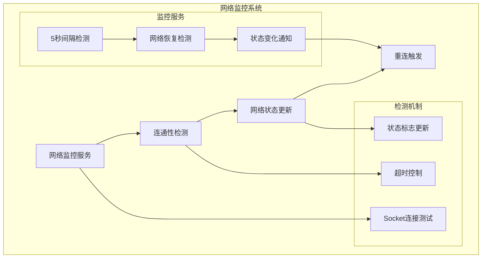

#### 快速重连机制

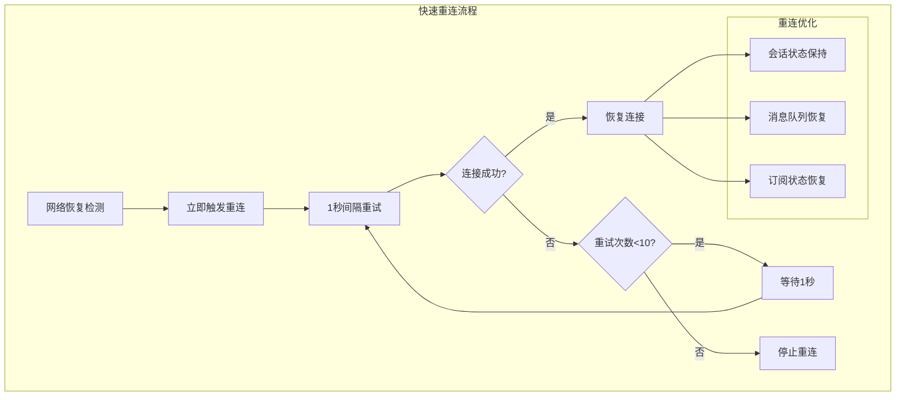

#### 监控服务架构

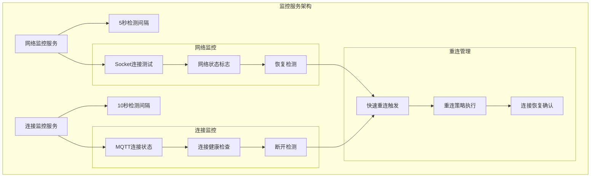

### 网络监控机制

```java
// 网络连通性检测
private boolean checkNetworkConnectivity() {
    try {
        String host = this.networkType == NetworkTypeEnum.PUBLIC ? 
            properties.getServer().getHost() : properties.getServer().getVpcHost();
        int port = this.networkType == NetworkTypeEnum.PUBLIC ? 
            properties.getServer().getPort() : properties.getServer().getVpcPort();
        
        try (Socket socket = new Socket()) {
            socket.connect(new InetSocketAddress(host, port), 3000);
            networkAvailable.set(true);
            return true;
        }
    } catch (IOException e) {
        networkAvailable.set(false);
        return false;
    }
}
```

### 快速重连机制

#### 自动重试机制

连接管理器实现了**指数退避 + 随机抖动**的自动重试机制，支持无限重试模式：

```java
// 快速重连配置（从配置文件读取）
fast-recovery:
  fast-reconnect-interval: 1000    # 基础重试间隔（毫秒）
  max-fast-reconnect-attempts: 10  # 最大重试次数（0或负数表示无限重试）

// 重试策略说明：
// 1. 指数退避：重试间隔按指数增长（1倍、2倍、4倍...），最大不超过5分钟
// 2. 随机抖动：每次重试间隔添加20%~100%的随机抖动，避免多个客户端同时重试
// 3. 无限重试模式：当 max-fast-reconnect-attempts <= 0 时，会无限重试直到连接成功
// 4. 有限重试模式：当 max-fast-reconnect-attempts > 0 时，达到最大次数后停止重试

// 重试间隔计算公式：
// 第1次重试：baseInterval × 2^0 × jitterFactor = 1000ms × 1 × (0.2~1.0) = 200~1000ms
// 第2次重试：baseInterval × 2^1 × jitterFactor = 1000ms × 2 × (0.2~1.0) = 400~2000ms
// 第3次重试：baseInterval × 2^2 × jitterFactor = 1000ms × 4 × (0.2~1.0) = 800~4000ms
// ...
// 第11次及以后：保持最大退避时间（5分钟）
```

#### 监控服务配置

```java
// 监控服务配置
private static final long NETWORK_CHECK_INTERVAL = 5L;         // 网络检测间隔5秒
private static final long CONNECTION_MONITOR_INTERVAL = 10L;   // 连接监控间隔10秒
private static final int KEEP_ALIVE_INTERVAL = 30;            // 心跳间隔30秒
private static final long SESSION_EXPIRY_INTERVAL = 7200L;     // 2小时会话保持
```

### 监控服务配置

```java
// 网络监控服务 - 5秒间隔
networkMonitorService.scheduleWithFixedDelay(() -> {
    boolean networkOk = checkNetworkConnectivity();
    if (networkOk && !isConnected.get()) {
        fastReconnectWithRetry();
    }
}, 0, 5, TimeUnit.SECONDS);

// 连接监控服务 - 10秒间隔
connectionMonitorService.scheduleWithFixedDelay(() -> {
    if (mqttClient.getState() != MqttClientState.CONNECTED) {
        fastReconnectWithRetry();
    }
}, 0, 10, TimeUnit.SECONDS);

// 心跳服务 - 30秒间隔
heartbeatService.scheduleWithFixedDelay(() -> {
    if (isConnected.get()) {
        sendKeepAlive();
    }
}, 0, 30, TimeUnit.SECONDS);
```

## 💀 遗嘱消息支持

### 遗嘱消息概述

遗嘱消息（Last Will and Testament, LWT）是MQTT协议的重要特性。当客户端异常断开连接时，服务器会自动发布预设的遗嘱消息，便于云端及时感知设备离线。

#### 工作原理

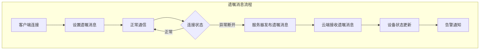

### KDS Box 场景业务价值

- 实时监控KDS Box在线状态
- 设备异常离线时立即通知
- 提升门店运维效率

### 遗嘱消息配置代码示例

#### 连接配置片段

```java
// Mqtt5Config 配置类中的遗嘱消息配置
@ConfigurationProperties(prefix = "platform.component.mqtt.mqtt5")
public class Mqtt5Config {
    
    /**
     * 是否启用遗嘱消息
     */
    private boolean enableWillMessage = true;
    
    /**
     * 遗嘱消息主题
     */
    private String willTopic = "device/status/{clientId}";
    
    /**
     * 遗嘱消息内容
     */
    private String willMessage = "异常断开连接";
    
    /**
     * 遗嘱消息上报的App版本号
     */
    private String appVersion = "";
    
    /**
     * 门店ID（可选参数）
     */
    private String storeId = "";
}
```

#### 遗嘱消息构建

```java
// 构建遗嘱消息内容
private String buildWillMessage() {
    try {
        Map<String, Object> willMessage = new HashMap<>();
        willMessage.put("deviceId", clientId);
        willMessage.put("status", "offline");
        willMessage.put("timestamp", System.currentTimeMillis());
        willMessage.put("reason", "abnormal_disconnect");
        willMessage.put("networkType", this.networkType.name());
        willMessage.put("groupId", this.properties.getGroupId());
        willMessage.put("deviceType", "KDS_BOX");
        
        // 添加可选的App版本和门店ID
        if (StringUtils.isNotBlank(properties.getMqtt5().getAppVersion())) {
            willMessage.put("appVersion", properties.getMqtt5().getAppVersion());
        }
        if (StringUtils.isNotBlank(properties.getMqtt5().getStoreId())) {
            willMessage.put("storeId", properties.getMqtt5().getStoreId());
        }
        
        return JsonUtils.getInstance().serialize(willMessage);
    } catch (Exception e) {
        log.error("构建遗嘱消息失败: {}", e.getMessage());
        return "{\"deviceId\":\"%s\",\"status\":\"offline\"}".formatted(clientId);
    }
}
```

### 云端处理建议

- 订阅 `device/status/+` 主题，解析遗嘱消息，及时更新设备状态并触发告警。
- 根据 `storeId` 字段进行门店级别的状态管理
- 利用 `appVersion` 字段进行版本兼容性检查

## 🚀 快速上手指南

### 1. 添加依赖

```xml
<dependency>
    <groupId>com.richie</groupId>
    <artifactId>atlas-richie-component-mqtt</artifactId>
    <version>${atlas.richie.version}</version>
</dependency>
```

### 2. 配置文件

```yaml
platform:
  component:
    mqtt:
      enable: true
      mqtt-version: mqtt_5_0  # 使用MQTT 5.0协议
      client-type: CLIENT
      parent-topic: /atlas_richie
      group-id: your-group-id
      heartbeat-interval: 30  # 心跳间隔30秒
      server:
        host: your-mqtt-server.com
        port: 1883
        vpc-host: your-vpc-server.com
        vpc-port: 1883
        username: your-username
        password: your-password
        default-network-type: PUBLIC
        qos: 1
        time-to-wait: 10000
      
      # MQTT 5.0 专用配置
      mqtt5:
        client-type: "pos_terminal"
        clean-start: false
        session-expiry-interval: 1800  # 30分钟会话过期
        message-expiry-interval: 1800  # 30分钟消息过期
        connection-timeout: 30
        enable-will-message: true
        will-topic: "device/status/{clientId}"
        will-message: "异常断开连接"
        app-version: "1.0.0"
        store-id: "STORE_001"
        enable-user-properties: true
        enable-message-priority: false
        enable-message-delay: false
        message-delay-interval: 0
      
      # 快速恢复配置
      fast-recovery:
        enabled: true                    # 是否启用快速恢复模式
        network-check-interval: 5        # 网络检测间隔(秒)
        connection-monitor-interval: 10  # 连接状态监控间隔(秒)
        fast-reconnect-interval: 1000    # 快速重连间隔(毫秒)
        max-fast-reconnect-attempts: 10  # 最大快速重连次数
        network-connect-timeout: 3000    # 网络连接超时(毫秒)
        keep-alive-interval: 30         # 心跳间隔(秒)
        enable-network-monitor: true     # 是否启用网络监控
        enable-connection-monitor: true  # 是否启用连接状态监控
        enable-fast-reconnect: true      # 是否启用快速重连
        reconnect-on-network-recovery: true  # 网络恢复后立即重连
        reconnect-on-disconnect: true    # 连接断开后立即重连
```

### 3. 基础使用

```java
@Autowired
private HiveMqMqttClient mqttClient;

// 发布消息
mqttClient.doPublish("/test/topic", "Hello MQTT 5.0".getBytes());

// 发布保留消息
mqttClient.doPublish("/test/topic", "Retained message".getBytes(), true);

// 订阅消息
mqttClient.registerConsumer("/test/topic", message -> {
    System.out.println("收到消息: " + new String(message.getPayload()));
    System.out.println("消息主题: " + message.getTopic());
    System.out.println("消息QoS: " + message.getQos());
});
```

### 4. 事件订阅

```java
// 订阅连接状态事件
MqttEventBus.connectionStateFlow
    .filter(event -> event.getState() == ConnectionState.CONNECTED)
    .subscribe(event -> {
        log.info("MQTT连接已建立，网络类型: {}", event.getNetworkType());
    });

// 订阅网络质量事件
MqttEventBus.networkQualityFlow
    .filter(event -> event.getStats().getAverageLatency() > 100)
    .subscribe(event -> {
        log.warn("网络延迟较高: {}ms", event.getStats().getAverageLatency());
    });

// 订阅心跳事件
MqttEventBus.heartbeatFlow
    .subscribe(event -> {
        log.debug("心跳状态: {}, 延迟: {}ms", event.getStatus(), event.getLatency());
    });
```

### 5. 手工初始化

```java
// 通过服务接口获取配置
MqttServerInfo serverInfo = getServerConfigFromApi();
mqttClient.initialClient(serverInfo);

// 动态切换服务器
mqttClient.changeServer(NetworkTypeEnum.VPC, "new-host", 1883);

// 切换网络类型
mqttClient.changeServer(NetworkTypeEnum.VPC);
```

### 6. 高级配置示例

#### 生产环境配置
```yaml
platform:
  component:
    mqtt:
      fast-recovery:
        enabled: true
        network-check-interval: 3        # 3秒网络检测
        connection-monitor-interval: 5   # 5秒连接监控
        fast-reconnect-interval: 500     # 500ms快速重连
        max-fast-reconnect-attempts: 15 # 15次重连尝试
        network-connect-timeout: 5000   # 5秒连接超时
        keep-alive-interval: 20         # 20秒心跳间隔
```

#### 开发环境配置
```yaml
platform:
  component:
    mqtt:
      fast-recovery:
        enabled: true
        network-check-interval: 10       # 10秒网络检测
        connection-monitor-interval: 20  # 20秒连接监控
        fast-reconnect-interval: 2000    # 2秒快速重连
        max-fast-reconnect-attempts: 5  # 5次重连尝试
        network-connect-timeout: 10000  # 10秒连接超时
        keep-alive-interval: 60         # 60秒心跳间隔
```

#### 弱网环境配置
```yaml
platform:
  component:
    mqtt:
      fast-recovery:
        enabled: true
        network-check-interval: 2        # 2秒网络检测
        connection-monitor-interval: 3   # 3秒连接监控
        fast-reconnect-interval: 200     # 200ms快速重连
        max-fast-reconnect-attempts: 20 # 20次重连尝试
        network-connect-timeout: 8000   # 8秒连接超时
        keep-alive-interval: 15         # 15秒心跳间隔
        reconnect-on-network-recovery: true
        reconnect-on-disconnect: true
```

## 📚 接口详细说明

### 事件订阅与处理

#### 连接状态事件处理
```java
@Component
public class ConnectionEventHandler {
    
    @PostConstruct
    public void init() {
        // 订阅连接状态事件
        MqttEventBus.connectionStateFlow
            .filter(event -> event.getState() == ConnectionState.CONNECTED)
            .subscribe(this::handleConnected);
            
        MqttEventBus.connectionStateFlow
            .filter(event -> event.getState() == ConnectionState.DISCONNECTED)
            .subscribe(this::handleDisconnected);
            
        MqttEventBus.connectionStateFlow
            .filter(event -> event.getState() == ConnectionState.ABNORMAL_DISCONNECT)
            .subscribe(this::handleAbnormalDisconnect);
    }
    
    private void handleConnected(ConnectionStateEvent event) {
        log.info("MQTT连接已建立 - 客户端ID: {}, 网络类型: {}, 时间: {}", 
            event.getClientId(), event.getNetworkType(), event.getTimestamp());
        
        // 连接成功后重新注册所有监听器
        reRegisterAllListeners();
    }
    
    private void handleDisconnected(ConnectionStateEvent event) {
        log.info("MQTT连接已断开 - 客户端ID: {}, 原因: {}, 时间: {}", 
            event.getClientId(), event.getReason(), event.getTimestamp());
        
        // 更新UI状态
        updateConnectionStatus(false);
    }
    
    private void handleAbnormalDisconnect(ConnectionStateEvent event) {
        log.warn("MQTT连接异常断开 - 客户端ID: {}, 原因: {}, 时间: {}", 
            event.getClientId(), event.getReason(), event.getTimestamp());
        
        // 触发告警
        triggerConnectionAlert(event);
    }
}
```

#### 网络质量事件处理
```java
@Component
public class NetworkQualityHandler {
    
    @PostConstruct
    public void init() {
        // 订阅网络质量事件
        MqttEventBus.networkQualityFlow
            .filter(event -> event.getStats().getAverageLatency() > 100)
            .subscribe(this::handleHighLatency);
            
        MqttEventBus.networkQualityFlow
            .filter(event -> event.getStats().getPacketLossRate() > 0.1)
            .subscribe(this::handleHighPacketLoss);
    }
    
    private void handleHighLatency(NetworkQualityEvent event) {
        NetworkQualityStats stats = event.getStats();
        log.warn("网络延迟较高 - 平均延迟: {}ms, 最大延迟: {}ms, 时间: {}", 
            stats.getAverageLatency(), stats.getMaxLatency(), event.getTimestamp());
        
        // 考虑切换到VPC网络
        if (stats.getAverageLatency() > 200) {
            considerNetworkSwitch();
        }
    }
    
    private void handleHighPacketLoss(NetworkQualityEvent event) {
        NetworkQualityStats stats = event.getStats();
        log.error("网络丢包率较高 - 丢包率: {}%, 时间: {}", 
            stats.getPacketLossRate() * 100, event.getTimestamp());
        
        // 触发网络质量告警
        triggerNetworkQualityAlert(event);
    }
}
```

#### 心跳事件处理
```java
@Component
public class HeartbeatHandler {
    
    @PostConstruct
    public void init() {
        // 订阅心跳事件
        MqttEventBus.heartbeatFlow
            .filter(event -> event.getStatus() == HeartbeatStatus.FAILED)
            .subscribe(this::handleHeartbeatFailure);
            
        MqttEventBus.heartbeatFlow
            .filter(event -> event.getLatency() > 1000)
            .subscribe(this::handleHighHeartbeatLatency);
    }
    
    private void handleHeartbeatFailure(HeartbeatEvent event) {
        log.warn("心跳失败 - 延迟: {}ms, 时间: {}", 
            event.getLatency(), event.getTimestamp());
        
        // 检查连接状态
        checkConnectionHealth();
    }
    
    private void handleHighHeartbeatLatency(HeartbeatEvent event) {
        log.warn("心跳延迟较高 - 延迟: {}ms, 时间: {}", 
            event.getLatency(), event.getTimestamp());
        
        // 记录性能指标
        recordPerformanceMetrics(event);
    }
}
```

### 消息发布与订阅流程图

#### 消息发布方流程

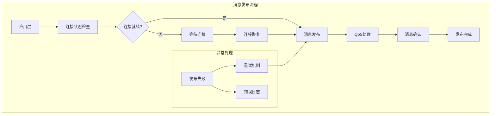

#### 消息订阅方流程

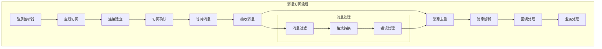

### 公共接口方法

#### 1. `initialClient(MqttServerInfo serverInfo)`
**用途**: 手工初始化MQTT客户端
**参数**: 包含完整服务器配置信息的对象
**功能**: 
- 设置服务器地址（公网/VPC）
- 配置认证信息（用户名/密码）
- 设置设备ID和分组ID
- 配置网络类型和服务器类型
- 自动启动连接服务

**调用场景**: 
- 客户端启动时通过服务接口获取配置
- 配置变更时重新初始化
- 网络切换时重新配置

**使用示例**:
```java
@Service
public class MqttConfigService {
    
    @Autowired
    private HiveMqMqttClient mqttClient;
    
    public void updateMqttConfig() {
        // 从配置服务获取最新配置
        MqttServerInfo serverInfo = getLatestServerConfig();
        
        // 手工初始化客户端
        mqttClient.initialClient(serverInfo);
        
        log.info("MQTT客户端配置已更新");
    }
    
    private MqttServerInfo getLatestServerConfig() {
        // 调用配置服务API获取最新配置
        return configApiService.getMqttServerConfig();
    }
}
```

#### 2. `initialClient(MqttServerInfo serverInfo, boolean enable)`
**用途**: 带启用标志的手工初始化
**参数**: 服务器配置信息 + 是否启用标志
**功能**: 可以控制是否立即启用MQTT连接

**调用场景**:
- 需要延迟启动的场景
- 配置验证后决定是否启用

**使用示例**:
```java
@Service
public class MqttInitializationService {
    
    @Autowired
    private HiveMqMqttClient mqttClient;
    
    public void initializeWithValidation(MqttServerInfo serverInfo) {
        // 验证配置
        if (validateServerConfig(serverInfo)) {
            // 配置验证通过，启用连接
            mqttClient.initialClient(serverInfo, true);
            log.info("MQTT客户端已启用");
        } else {
            // 配置验证失败，不启用连接
            mqttClient.initialClient(serverInfo, false);
            log.warn("MQTT客户端配置验证失败，连接未启用");
        }
    }
    
    private boolean validateServerConfig(MqttServerInfo serverInfo) {
        // 配置验证逻辑
        return serverInfo != null && 
               StringUtils.isNotBlank(serverInfo.getHost()) &&
               serverInfo.getPort() > 0;
    }
}
```

#### 3. `changeServer(NetworkTypeEnum networkType, String host, int port)`
**用途**: 动态切换服务器地址
**参数**: 网络类型 + 新主机地址 + 端口
**功能**: 运行时更换MQTT服务器

**调用场景**:
- 服务器地址变更
- 负载均衡切换
- 故障转移

**使用示例**:
```java
@Service
public class ServerSwitchService {
    
    @Autowired
    private HiveMqMqttClient mqttClient;
    
    public void switchToBackupServer() {
        // 切换到备用服务器
        mqttClient.changeServer(NetworkTypeEnum.PUBLIC, "backup.example.com", 1883);
        log.info("已切换到备用服务器");
    }
    
    public void switchToLoadBalancedServer(String host, int port) {
        // 切换到负载均衡服务器
        mqttClient.changeServer(NetworkTypeEnum.VPC, host, port);
        log.info("已切换到负载均衡服务器: {}:{}", host, port);
    }
}
```

#### 4. `changeServer(NetworkTypeEnum networkType)`
**用途**: 切换网络类型
**参数**: 目标网络类型
**功能**: 在已配置的服务器间切换

**调用场景**:
- 公网/VPC网络切换
- 网络质量优化

**使用示例**:
```java
@Service
public class NetworkOptimizationService {
    
    @Autowired
    private HiveMqMqttClient mqttClient;
    
    public void optimizeNetworkConnection() {
        // 获取当前网络质量
        NetworkQualityStats stats = getCurrentNetworkQuality();
        
        if (stats.getAverageLatency() > 200) {
            // 网络延迟较高，切换到VPC网络
            mqttClient.changeServer(NetworkTypeEnum.VPC);
            log.info("网络延迟较高，已切换到VPC网络");
        } else if (stats.getAverageLatency() < 50) {
            // 网络质量良好，切换到公网
            mqttClient.changeServer(NetworkTypeEnum.PUBLIC);
            log.info("网络质量良好，已切换到公网");
        }
    }
    
    private NetworkQualityStats getCurrentNetworkQuality() {
        // 获取当前网络质量统计
        return networkQualityService.getCurrentStats();
    }
}
```

#### 5. `doPublish(String topic, byte[] value)`
**用途**: 发布消息
**参数**: 主题 + 消息内容
**功能**: 向指定主题发布消息

**调用场景**:
- 业务消息发布
- 状态上报
- 命令下发

**使用示例**:
```java
@Service
public class MessagePublishService {
    
    @Autowired
    private HiveMqMqttClient mqttClient;
    
    public void publishDeviceStatus(String deviceId, DeviceStatus status) {
        String topic = String.format("/device/%s/status", deviceId);
        String message = JsonUtils.toJson(status);
        
        try {
            mqttClient.doPublish(topic, message.getBytes());
            log.info("设备状态已发布 - 设备ID: {}, 主题: {}", deviceId, topic);
        } catch (Exception e) {
            log.error("发布设备状态失败 - 设备ID: {}, 错误: {}", deviceId, e.getMessage());
        }
    }
    
    public void publishCommand(String deviceId, DeviceCommand command) {
        String topic = String.format("/device/%s/command", deviceId);
        String message = JsonUtils.toJson(command);
        
        try {
            mqttClient.doPublish(topic, message.getBytes());
            log.info("设备命令已发布 - 设备ID: {}, 主题: {}", deviceId, topic);
        } catch (Exception e) {
            log.error("发布设备命令失败 - 设备ID: {}, 错误: {}", deviceId, e.getMessage());
        }
    }
}
```

#### 6. `doPublish(String topic, byte[] value, boolean retained)`
**用途**: 发布保留消息
**参数**: 主题 + 消息内容 + 是否保留
**功能**: 发布在服务器保留的消息

**调用场景**:
- 设备状态保留
- 配置信息保留
- 最后已知状态

**使用示例**:
```java
@Service
public class RetainedMessageService {
    
    @Autowired
    private HiveMqMqttClient mqttClient;
    
    public void publishDeviceLastKnownStatus(String deviceId, DeviceStatus status) {
        String topic = String.format("/device/%s/last-known-status", deviceId);
        String message = JsonUtils.toJson(status);
        
        // 发布保留消息，新连接的客户端可以立即获取最后状态
        mqttClient.doPublish(topic, message.getBytes(), true);
        log.info("设备最后状态已保留 - 设备ID: {}, 主题: {}", deviceId, topic);
    }
    
    public void publishConfiguration(String configId, Configuration config) {
        String topic = String.format("/config/%s", configId);
        String message = JsonUtils.toJson(config);
        
        // 发布保留消息，新连接的客户端可以立即获取配置
        mqttClient.doPublish(topic, message.getBytes(), true);
        log.info("配置信息已保留 - 配置ID: {}, 主题: {}", configId, topic);
    }
}
```

#### 7. `registerConsumer(String topic, Consumer<ConsumerMessage> callback)`
**用途**: 注册普通订阅消息监听器
**参数**: 主题 + 回调函数
**功能**: 订阅主题并处理接收到的消息（支持通配符：`+` 单级通配符，`#` 多级通配符）

**调用场景**:
- 业务消息处理
- 命令接收
- 状态监听

**使用示例**:
```java
@Component
public class MessageConsumerService {
    
    @Autowired
    private HiveMqMqttClient mqttClient;
    
    @PostConstruct
    public void init() {
        // 注册设备命令监听器（使用单级通配符 +）
        mqttClient.registerConsumer("/device/+/command", this::handleDeviceCommand);
        
        // 注册配置更新监听器
        mqttClient.registerConsumer("/config/+/update", this::handleConfigUpdate);
        
        // 注册系统通知监听器
        mqttClient.registerConsumer("/system/notification", this::handleSystemNotification);
    }
    
    private void handleDeviceCommand(ConsumerMessage message) {
        try {
            String topic = message.getTopic();
            String payload = new String(message.getPayload());
            
            // 解析设备命令
            DeviceCommand command = JsonUtils.fromJson(payload, DeviceCommand.class);
            
            // 处理设备命令
            processDeviceCommand(command);
            
            log.info("设备命令已处理 - 主题: {}, 命令: {}", topic, command);
        } catch (Exception e) {
            log.error("处理设备命令失败 - 主题: {}, 错误: {}", message.getTopic(), e.getMessage());
        }
    }
    
    private void handleConfigUpdate(ConsumerMessage message) {
        try {
            String topic = message.getTopic();
            String payload = new String(message.getPayload());
            
            // 解析配置更新
            Configuration config = JsonUtils.fromJson(payload, Configuration.class);
            
            // 应用配置更新
            applyConfigurationUpdate(config);
            
            log.info("配置更新已处理 - 主题: {}, 配置: {}", topic, config);
        } catch (Exception e) {
            log.error("处理配置更新失败 - 主题: {}, 错误: {}", message.getTopic(), e.getMessage());
        }
    }
    
    private void handleSystemNotification(ConsumerMessage message) {
        try {
            String payload = new String(message.getPayload());
            
            // 解析系统通知
            SystemNotification notification = JsonUtils.fromJson(payload, SystemNotification.class);
            
            // 处理系统通知
            processSystemNotification(notification);
            
            log.info("系统通知已处理 - 通知: {}", notification);
        } catch (Exception e) {
            log.error("处理系统通知失败 - 错误: {}", e.getMessage());
        }
    }
}
```

#### 7.1. `registerSharedConsumer(String sharedTopic, Consumer<ConsumerMessage> callback)`
**用途**: 注册共享订阅消息监听器（MQTT 5.0 特性）
**参数**: 完整的共享订阅主题（格式：`$share/{groupId}/businessTopic`）+ 回调函数
**功能**: 订阅共享主题并处理接收到的消息，支持负载均衡和消息分发

**共享订阅格式要求**:
- 必须以 `$share/` 开头
- 格式：`$share/{groupId}/businessTopic`
- 业务 topic 必须包含 `/+/` 通配符（用于通配唯一标识符）
- 示例：`$share/GID_AGENT_DEVICE/device/+/status`

**调用场景**:
- 多客户端负载均衡场景
- 需要消息分发的场景
- 高可用消息处理

**使用示例**:
```java
@Component
public class SharedSubscriptionService {
    
    @Autowired
    private HiveMqMqttClient mqttClient;
    
    @PostConstruct
    public void init() {
        // 注册共享订阅监听器（负载均衡）
        // 格式：$share/{groupId}/businessTopic
        String sharedTopic = "$share/GID_AGENT_DEVICE/device/+/status";
        mqttClient.registerSharedConsumer(sharedTopic, this::handleDeviceStatus);
        
        // 注册另一个共享订阅
        String sharedTopic2 = "$share/GID_AGENT_COMMAND/device/+/command";
        mqttClient.registerSharedConsumer(sharedTopic2, this::handleDeviceCommand);
    }
    
    private void handleDeviceStatus(ConsumerMessage message) {
        // 处理设备状态消息
        // 注意：实际收到的 topic 是具体值（如：device/123/status），
        // 组件会自动通过通配符匹配找到对应的回调
        log.info("收到设备状态消息: {}", message.getTopic());
    }
    
    private void handleDeviceCommand(ConsumerMessage message) {
        // 处理设备命令消息
        log.info("收到设备命令消息: {}", message.getTopic());
    }
}
```

**注意事项**:
- 共享订阅是 MQTT 5.0 的特性，MQTT 3.1.1 不支持
- 必须传入完整的共享订阅 topic（包含 `$share/{groupId}` 前缀）
- 业务 topic 中必须包含 `/+/` 通配符
- 收到消息时，实际 topic 是具体值，组件会自动通过通配符匹配找到对应的回调

#### 8. `unregisterConsumer(String topic)`
**用途**: 取消普通订阅消息监听器
**参数**: 主题
**功能**: 取消订阅指定主题

**调用场景**:
- 动态取消订阅
- 资源清理
- 权限变更

**使用示例**:
```java
@Service
public class ConsumerManagementService {
    
    @Autowired
    private HiveMqMqttClient mqttClient;
    
    private final Set<String> activeSubscriptions = new ConcurrentHashSet<>();
    
    public void addSubscription(String topic, Consumer<ConsumerMessage> callback) {
        mqttClient.registerConsumer(topic, callback);
        activeSubscriptions.add(topic);
        log.info("已添加订阅 - 主题: {}", topic);
    }
    
    public void removeSubscription(String topic) {
        mqttClient.unregisterConsumer(topic);
        activeSubscriptions.remove(topic);
        log.info("已移除订阅 - 主题: {}", topic);
    }
    
    public void removeAllSubscriptions() {
        for (String topic : activeSubscriptions) {
            mqttClient.unregisterConsumer(topic);
        }
        activeSubscriptions.clear();
        log.info("已移除所有订阅");
    }
    
    public Set<String> getActiveSubscriptions() {
        return new HashSet<>(activeSubscriptions);
    }
}
```

#### 8.1. `unregisterSharedConsumer(String sharedTopic)`
**用途**: 取消共享订阅消息监听器
**参数**: 完整的共享订阅主题（格式：`$share/{groupId}/businessTopic`）
**功能**: 取消订阅指定共享主题

**调用场景**:
- 动态取消共享订阅
- 资源清理
- 负载均衡调整

**使用示例**:
```java
@Service
public class SharedSubscriptionManagementService {
    
    @Autowired
    private HiveMqMqttClient mqttClient;
    
    public void removeSharedSubscription(String groupId, String businessTopic) {
        String sharedTopic = "$share/" + groupId + "/" + businessTopic;
        mqttClient.unregisterSharedConsumer(sharedTopic);
        log.info("已移除共享订阅 - 主题: {}", sharedTopic);
    }
}
```

#### 9. `reinitialize()`
**用途**: 重新初始化客户端
**功能**: 重新建立MQTT连接

**调用场景**:
- 连接异常恢复
- 配置重大变更
- 故障排除

**使用示例**:
```java
@Service
public class ClientRecoveryService {
    
    @Autowired
    private HiveMqMqttClient mqttClient;
    
    public void recoverClient() {
        try {
            log.info("开始重新初始化MQTT客户端");
            
            // 重新初始化客户端
            mqttClient.reinitialize();
            
            log.info("MQTT客户端重新初始化完成");
        } catch (Exception e) {
            log.error("MQTT客户端重新初始化失败: {}", e.getMessage());
            
            // 延迟重试
            scheduleRetry();
        }
    }
    
    private void scheduleRetry() {
        // 延迟5秒后重试
        CompletableFuture.delayedExecutor(5, TimeUnit.SECONDS)
            .execute(this::recoverClient);
    }
}
```

### 自动处理方法

#### 1. 网络监控
**触发**: 每5秒自动检测
**功能**: 
- 检测网络连通性
- 网络恢复时自动重连
- 更新网络状态标志

**监控逻辑**:
```java
// 网络监控服务 - 5秒间隔
networkMonitorService.scheduleWithFixedDelay(() -> {
    boolean networkOk = checkNetworkConnectivity();
    if (networkOk && !isConnected.get()) {
        fastReconnectWithRetry();
    }
}, 0, 5, TimeUnit.SECONDS);
```

#### 2. 连接监控
**触发**: 每10秒自动检测
**功能**:
- 监控MQTT连接状态
- 连接断开时自动重连
- 维护连接状态标志

**监控逻辑**:
```java
// 连接监控服务 - 10秒间隔
connectionMonitorService.scheduleWithFixedDelay(() -> {
    if (mqttClient.getState() != MqttClientState.CONNECTED) {
        fastReconnectWithRetry();
    }
}, 0, 10, TimeUnit.SECONDS);
```

#### 3. 快速重连
**触发**: 网络恢复或连接断开时
**功能**:
- 自动重试机制（指数退避 + 随机抖动）
- 支持无限重试模式（配置 `max-fast-reconnect-attempts <= 0`）
- 支持有限重试模式（配置 `max-fast-reconnect-attempts > 0`）
- 保持会话状态

**重连逻辑**:
```java
// 快速重连配置（从配置文件读取）
fast-recovery:
  fast-reconnect-interval: 1000    # 基础重试间隔（毫秒）
  max-fast-reconnect-attempts: 10  # 最大重试次数（0或负数表示无限重试）

// 重试策略：
// 1. 指数退避：重试间隔按指数增长（1倍、2倍、4倍...），最大不超过5分钟
// 2. 随机抖动：每次重试间隔添加20%~100%的随机抖动，避免多个客户端同时重试
// 3. 线程安全：使用同步锁和原子变量确保重试过程的线程安全
// 4. 支持中断：支持线程中断，中断后会立即停止重试
```

#### 4. 心跳维护
**触发**: 定时任务
**功能**:
- 发送心跳消息
- 检测连接健康状态
- 维护连接活跃度

**心跳逻辑**:
```java
// 心跳服务 - 30秒间隔
heartbeatService.scheduleWithFixedDelay(() -> {
    if (isConnected.get()) {
        sendKeepAlive();
    }
}, 0, 30, TimeUnit.SECONDS);
```

#### 5. 消息处理
**触发**: 收到MQTT消息时
**功能**:
- 基于事件总线的消息分发
- 支持普通订阅和共享订阅的自动匹配
- 支持通配符匹配（`+` 单级通配符，`#` 多级通配符）
- 消息格式转换
- 调用注册的回调函数
- 错误处理和日志记录

**处理逻辑**:
```java
// 消息分发流程（基于事件总线）
// 1. 初始化时订阅消息事件流（仅订阅一次，防止重复订阅）
private void subscribeMessageFlowIfNecessary() {
    if (!messageFlowSubscribed.compareAndSet(false, true)) {
        return; // 已订阅，跳过
    }
    
    MqttEventBus.messageFlow.subscribe(
        this::dispatchMessageSafely,
        error -> log.error("订阅 MQTT 消息事件流时发生异常", error)
    );
}

// 2. 消息分发逻辑
private void dispatchMessage(Mqtt5Publish publish) {
    String rawTopic = publish.getTopic().toString();
    
    // 先尝试普通订阅（精确匹配）
    Consumer<ConsumerMessage> callback = LISTENER_CACHE.get(rawTopic);
    
    // 如果普通订阅未找到，尝试共享订阅（通配符匹配）
    if (callback == null) {
        callback = findSharedSubscriptionCallback(rawTopic);
    }
    
    if (callback == null) {
        log.debug("收到 MQTT 消息但未找到对应回调，rawTopic={}", rawTopic);
        return;
    }
    
    // 构建 ConsumerMessage 并调用回调
    ConsumerMessage consumerMessage = new ConsumerMessage(payload)
        .setTopic(rawTopic)
        .setQos(publish.getQos().getCode())
        .setRetained(publish.isRetain())
        .setProperties(extractUserProperties(publish))
        .setTimestamp(System.currentTimeMillis());
    
    callback.accept(consumerMessage);
}

// 3. 共享订阅通配符匹配
private Consumer<ConsumerMessage> findSharedSubscriptionCallback(String actualTopic) {
    for (Map.Entry<String, Consumer<ConsumerMessage>> entry : SHARED_LISTENER_CACHE.entrySet()) {
        String sharedTopic = entry.getKey();
        // 提取业务 topic 部分（去掉 $share/{groupId}/ 前缀）
        String businessTopic = extractBusinessTopic(sharedTopic);
        if (businessTopic == null) {
            continue;
        }
        // 通配符匹配：businessTopic（如：device/+/status）应该匹配 actualTopic（如：device/123/status）
        if (matchesTopicPattern(businessTopic, actualTopic)) {
            return entry.getValue();
        }
    }
    return null;
}
```

## 📋 使用场景示例

### 场景1: 设备状态上报

#### 设备状态上报架构

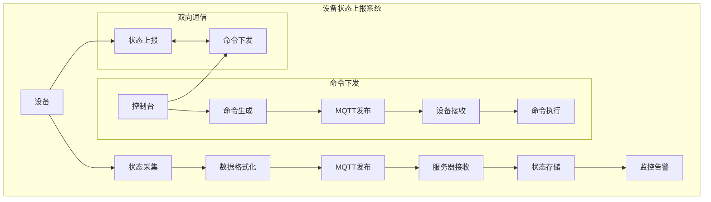

#### 完整实现代码

```java
@Service
public class DeviceStatusService {
    
    @Autowired
    private HiveMqMqttClient mqttClient;
    
    private final Map<String, DeviceStatus> deviceStatusCache = new ConcurrentHashMap<>();
    
    @PostConstruct
    public void init() {
        // 注册设备命令监听器
        mqttClient.registerConsumer("/device/+/command", this::handleDeviceCommand);
        
        // 注册设备配置更新监听器
        mqttClient.registerConsumer("/device/+/config", this::handleDeviceConfig);
    }
    
    /**
     * 上报设备状态
     */
    public void reportDeviceStatus(String deviceId, DeviceStatus status) {
        try {
            // 更新本地缓存
            deviceStatusCache.put(deviceId, status);
            
            // 构建状态消息
            DeviceStatusMessage statusMessage = DeviceStatusMessage.builder()
                .deviceId(deviceId)
                .status(status)
                .timestamp(System.currentTimeMillis())
                .version("1.0.0")
                .build();
            
            // 发布状态消息
            String topic = String.format("/device/%s/status", deviceId);
            String message = JsonUtils.toJson(statusMessage);
            
            mqttClient.doPublish(topic, message.getBytes());
            
            log.info("设备状态已上报 - 设备ID: {}, 状态: {}", deviceId, status);
            
        } catch (Exception e) {
            log.error("上报设备状态失败 - 设备ID: {}, 错误: {}", deviceId, e.getMessage());
            throw new DeviceStatusException("上报设备状态失败", e);
        }
    }
    
    /**
     * 上报设备心跳
     */
    public void reportDeviceHeartbeat(String deviceId) {
        try {
            DeviceHeartbeatMessage heartbeatMessage = DeviceHeartbeatMessage.builder()
                .deviceId(deviceId)
                .timestamp(System.currentTimeMillis())
                .uptime(getDeviceUptime(deviceId))
                .build();
            
            String topic = String.format("/device/%s/heartbeat", deviceId);
            String message = JsonUtils.toJson(heartbeatMessage);
            
            mqttClient.doPublish(topic, message.getBytes());
            
            log.debug("设备心跳已上报 - 设备ID: {}", deviceId);
            
        } catch (Exception e) {
            log.error("上报设备心跳失败 - 设备ID: {}, 错误: {}", deviceId, e.getMessage());
        }
    }
    
    /**
     * 处理设备命令
     */
    private void handleDeviceCommand(ConsumerMessage message) {
        try {
            String topic = message.getTopic();
            String payload = new String(message.getPayload());
            
            // 解析设备命令
            DeviceCommand command = JsonUtils.fromJson(payload, DeviceCommand.class);
            
            // 验证命令
            if (validateDeviceCommand(command)) {
                // 执行设备命令
                executeDeviceCommand(command);
                
                // 发送命令确认
                sendCommandAck(command.getDeviceId(), command.getCommandId(), true);
                
                log.info("设备命令已执行 - 设备ID: {}, 命令: {}", 
                    command.getDeviceId(), command.getCommandType());
            } else {
                // 发送命令拒绝
                sendCommandAck(command.getDeviceId(), command.getCommandId(), false);
                
                log.warn("设备命令验证失败 - 设备ID: {}, 命令: {}", 
                    command.getDeviceId(), command.getCommandType());
            }
            
        } catch (Exception e) {
            log.error("处理设备命令失败 - 主题: {}, 错误: {}", message.getTopic(), e.getMessage());
        }
    }
    
    /**
     * 处理设备配置更新
     */
    private void handleDeviceConfig(ConsumerMessage message) {
        try {
            String topic = message.getTopic();
            String payload = new String(message.getPayload());
            
            // 解析设备配置
            DeviceConfig config = JsonUtils.fromJson(payload, DeviceConfig.class);
            
            // 应用设备配置
            applyDeviceConfig(config);
            
            // 发送配置确认
            sendConfigAck(config.getDeviceId(), config.getConfigId(), true);
            
            log.info("设备配置已更新 - 设备ID: {}, 配置: {}", 
                config.getDeviceId(), config.getConfigType());
            
        } catch (Exception e) {
            log.error("处理设备配置失败 - 主题: {}, 错误: {}", message.getTopic(), e.getMessage());
        }
    }
    
    /**
     * 获取设备状态
     */
    public DeviceStatus getDeviceStatus(String deviceId) {
        return deviceStatusCache.get(deviceId);
    }
    
    /**
     * 获取所有设备状态
     */
    public Map<String, DeviceStatus> getAllDeviceStatus() {
        return new HashMap<>(deviceStatusCache);
    }
    
    // 其他辅助方法...
    private boolean validateDeviceCommand(DeviceCommand command) {
        // 命令验证逻辑
        return command != null && 
               StringUtils.isNotBlank(command.getDeviceId()) &&
               StringUtils.isNotBlank(command.getCommandType());
    }
    
    private void executeDeviceCommand(DeviceCommand command) {
        // 命令执行逻辑
        switch (command.getCommandType()) {
            case "RESTART":
                restartDevice(command.getDeviceId());
                break;
            case "UPDATE_CONFIG":
                updateDeviceConfig(command.getDeviceId(), command.getParameters());
                break;
            case "DIAGNOSTIC":
                runDeviceDiagnostic(command.getDeviceId());
                break;
            default:
                log.warn("未知的设备命令类型: {}", command.getCommandType());
        }
    }
    
    private void sendCommandAck(String deviceId, String commandId, boolean success) {
        try {
            CommandAckMessage ackMessage = CommandAckMessage.builder()
                .deviceId(deviceId)
                .commandId(commandId)
                .success(success)
                .timestamp(System.currentTimeMillis())
                .build();
            
            String topic = String.format("/device/%s/command/ack", deviceId);
            String message = JsonUtils.toJson(ackMessage);
            
            mqttClient.doPublish(topic, message.getBytes());
            
        } catch (Exception e) {
            log.error("发送命令确认失败 - 设备ID: {}, 命令ID: {}, 错误: {}", 
                deviceId, commandId, e.getMessage());
        }
    }
}
```

### 场景2: 动态配置下发

#### 配置下发流程

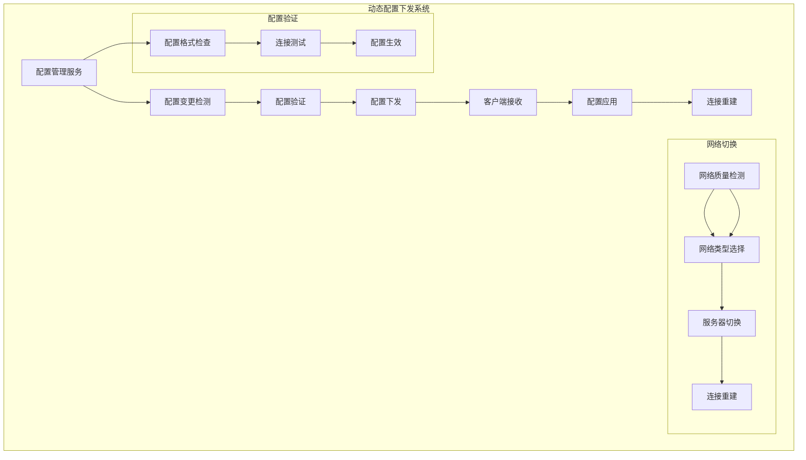

#### 完整实现代码

```java
@Service
public class DynamicConfigService {
    
    @Autowired
    private HiveMqMqttClient mqttClient;
    
    @Autowired
    private NetworkQualityService networkQualityService;
    
    private final Map<String, Object> currentConfig = new ConcurrentHashMap<>();
    
    @PostConstruct
    public void init() {
        // 注册配置更新监听器
        mqttClient.registerConsumer("/config/+/update", this::handleConfigUpdate);
        
        // 注册配置查询监听器
        mqttClient.registerConsumer("/config/+/query", this::handleConfigQuery);
        
        // 启动配置监控
        startConfigMonitoring();
    }
    
    /**
     * 更新MQTT服务器配置
     */
    public void updateMqttServerConfig() {
        try {
            // 从配置服务获取最新配置
            MqttServerInfo newConfig = getLatestMqttConfig();
            
            // 验证新配置
            if (validateMqttConfig(newConfig)) {
                // 测试新配置连接
                if (testMqttConnection(newConfig)) {
                    // 应用新配置
                    applyMqttConfig(newConfig);
                    
                    log.info("MQTT服务器配置已更新");
                } else {
                    log.error("新MQTT配置连接测试失败");
                }
            } else {
                log.error("新MQTT配置验证失败");
            }
            
        } catch (Exception e) {
            log.error("更新MQTT服务器配置失败: {}", e.getMessage());
        }
    }
    
    /**
     * 网络质量优化
     */
    public void optimizeNetworkConnection() {
        try {
            // 获取当前网络质量
            NetworkQualityStats stats = networkQualityService.getCurrentStats();
            
            if (stats.getAverageLatency() > 200) {
                // 网络延迟较高，切换到VPC网络
                switchToVpcNetwork();
                log.info("网络延迟较高，已切换到VPC网络");
            } else if (stats.getAverageLatency() < 50) {
                // 网络质量良好，切换到公网
                switchToPublicNetwork();
                log.info("网络质量良好，已切换到公网");
            }
            
        } catch (Exception e) {
            log.error("网络连接优化失败: {}", e.getMessage());
        }
    }
    
    /**
     * 处理配置更新
     */
    private void handleConfigUpdate(ConsumerMessage message) {
        try {
            String topic = message.getTopic();
            String payload = new String(message.getPayload());
            
            // 解析配置更新
            ConfigUpdateMessage configUpdate = JsonUtils.fromJson(payload, ConfigUpdateMessage.class);
            
            // 验证配置更新
            if (validateConfigUpdate(configUpdate)) {
                // 应用配置更新
                applyConfigUpdate(configUpdate);
                
                // 发送配置确认
                sendConfigAck(configUpdate.getConfigId(), true);
                
                log.info("配置更新已应用 - 配置ID: {}, 类型: {}", 
                    configUpdate.getConfigId(), configUpdate.getConfigType());
            } else {
                // 发送配置拒绝
                sendConfigAck(configUpdate.getConfigId(), false);
                
                log.warn("配置更新验证失败 - 配置ID: {}", configUpdate.getConfigId());
            }
            
        } catch (Exception e) {
            log.error("处理配置更新失败 - 主题: {}, 错误: {}", message.getTopic(), e.getMessage());
        }
    }
    
    /**
     * 处理配置查询
     */
    private void handleConfigQuery(ConsumerMessage message) {
        try {
            String topic = message.getTopic();
            String payload = new String(message.getPayload());
            
            // 解析配置查询
            ConfigQueryMessage configQuery = JsonUtils.fromJson(payload, ConfigQueryMessage.class);
            
            // 获取配置信息
            Object config = getConfig(configQuery.getConfigKey());
            
            // 发送配置响应
            sendConfigResponse(configQuery.getQueryId(), config);
            
            log.debug("配置查询已响应 - 查询ID: {}, 配置键: {}", 
                configQuery.getQueryId(), configQuery.getConfigKey());
            
        } catch (Exception e) {
            log.error("处理配置查询失败 - 主题: {}, 错误: {}", message.getTopic(), e.getMessage());
        }
    }
    
    /**
     * 切换到VPC网络
     */
    private void switchToVpcNetwork() {
        try {
            mqttClient.changeServer(NetworkTypeEnum.VPC);
            
            // 更新网络类型配置
            updateNetworkTypeConfig(NetworkTypeEnum.VPC);
            
        } catch (Exception e) {
            log.error("切换到VPC网络失败: {}", e.getMessage());
        }
    }
    
    /**
     * 切换到公网
     */
    private void switchToPublicNetwork() {
        try {
            mqttClient.changeServer(NetworkTypeEnum.PUBLIC);
            
            // 更新网络类型配置
            updateNetworkTypeConfig(NetworkTypeEnum.PUBLIC);
            
        } catch (Exception e) {
            log.error("切换到公网失败: {}", e.getMessage());
        }
    }
    
    /**
     * 启动配置监控
     */
    private void startConfigMonitoring() {
        // 定期检查配置更新
        ScheduledExecutorService executor = Executors.newSingleThreadScheduledExecutor();
        executor.scheduleWithFixedDelay(this::checkConfigUpdates, 0, 60, TimeUnit.SECONDS);
    }
    
    /**
     * 检查配置更新
     */
    private void checkConfigUpdates() {
        try {
            // 检查是否有新的配置更新
            List<ConfigUpdateMessage> updates = getPendingConfigUpdates();
            
            for (ConfigUpdateMessage update : updates) {
                handleConfigUpdate(update);
            }
            
        } catch (Exception e) {
            log.error("检查配置更新失败: {}", e.getMessage());
        }
    }
    
    // 其他辅助方法...
    private MqttServerInfo getLatestMqttConfig() {
        // 从配置服务获取最新MQTT配置
        return configApiService.getMqttServerConfig();
    }
    
    private boolean validateMqttConfig(MqttServerInfo config) {
        // MQTT配置验证逻辑
        return config != null && 
               StringUtils.isNotBlank(config.getHost()) &&
               config.getPort() > 0 &&
               StringUtils.isNotBlank(config.getUsername());
    }
    
    private boolean testMqttConnection(MqttServerInfo config) {
        // 测试MQTT连接
        try {
            // 创建临时客户端测试连接
            MqttClient testClient = MqttClient.builder()
                .identifier("test-client")
                .serverHost(config.getHost())
                .serverPort(config.getPort())
                .buildBlocking();
            
            testClient.connectWith()
                .simpleAuth()
                .username(config.getUsername())
                .password(config.getPassword().getBytes())
                .applySimpleAuth()
                .send();
            
            boolean connected = testClient.getState() == MqttClientState.CONNECTED;
            
            // 断开测试连接
            testClient.disconnect();
            
            return connected;
            
        } catch (Exception e) {
            log.error("MQTT连接测试失败: {}", e.getMessage());
            return false;
        }
    }
    
    private void applyMqttConfig(MqttServerInfo newConfig) {
        // 应用新的MQTT配置
        mqttClient.initialClient(newConfig);
        
        // 更新本地配置缓存
        currentConfig.put("mqtt.server", newConfig);
    }
}
```

### 场景3: 高可用消息处理

#### 高可用消息处理架构

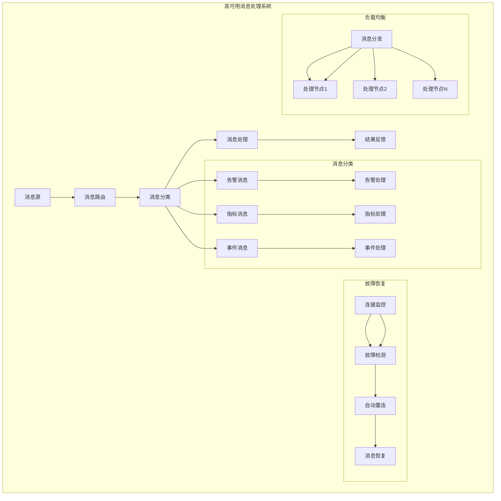

#### 完整实现代码

```java
@Component
public class HighAvailabilityMessageProcessor {
    
    @Autowired
    private HiveMqMqttClient mqttClient;
    
    private final Map<String, MessageHandler> messageHandlers = new ConcurrentHashMap<>();
    private final Map<String, Consumer<ConsumerMessage>> messageProcessors = new ConcurrentHashMap<>();
    
    @PostConstruct
    public void init() {
        // 注册消息处理器
        registerMessageHandlers();
        
        // 注册消息监听器
        registerMessageListeners();
        
        // 启动故障恢复监控
        startFaultRecoveryMonitoring();
    }
    
    /**
     * 注册消息处理器
     */
    private void registerMessageHandlers() {
        // 告警消息处理器
        messageHandlers.put("alert", new AlertMessageHandler());
        
        // 指标消息处理器
        messageHandlers.put("metric", new MetricMessageHandler());
        
        // 事件消息处理器
        messageHandlers.put("event", new EventMessageHandler());
        
        // 系统消息处理器
        messageHandlers.put("system", new SystemMessageHandler());
    }
    
    /**
     * 注册消息监听器
     */
    private void registerMessageListeners() {
        // 告警消息监听器
        mqttClient.registerConsumer("/alerts/+", this::handleAlertMessage);
        
        // 指标消息监听器
        mqttClient.registerConsumer("/metrics/+", this::handleMetricMessage);
        
        // 事件消息监听器
        mqttClient.registerConsumer("/events/+", this::handleEventMessage);
        
        // 系统消息监听器
        mqttClient.registerConsumer("/system/+", this::handleSystemMessage);
    }
    
    /**
     * 处理告警消息
     */
    private void handleAlertMessage(ConsumerMessage message) {
        try {
            String topic = message.getTopic();
            String payload = new String(message.getPayload());
            
            // 解析告警消息
            AlertMessage alert = JsonUtils.fromJson(payload, AlertMessage.class);
            
            // 获取告警处理器
            MessageHandler handler = messageHandlers.get("alert");
            
            if (handler != null) {
                // 处理告警消息
                handler.handle(message);
                
                log.info("告警消息已处理 - 主题: {}, 告警级别: {}", 
                    topic, alert.getSeverity());
            } else {
                log.warn("未找到告警消息处理器");
            }
            
        } catch (Exception e) {
            log.error("处理告警消息失败 - 主题: {}, 错误: {}", message.getTopic(), e.getMessage());
        }
    }
    
    /**
     * 处理指标消息
     */
    private void handleMetricMessage(ConsumerMessage message) {
        try {
            String topic = message.getTopic();
            String payload = new String(message.getPayload());
            
            // 解析指标消息
            MetricMessage metric = JsonUtils.fromJson(payload, MetricMessage.class);
            
            // 获取指标处理器
            MessageHandler handler = messageHandlers.get("metric");
            
            if (handler != null) {
                // 处理指标消息
                handler.handle(message);
                
                log.info("指标消息已处理 - 主题: {}, 指标类型: {}", 
                    topic, metric.getMetricType());
            } else {
                log.warn("未找到指标消息处理器");
            }
            
        } catch (Exception e) {
            log.error("处理指标消息失败 - 主题: {}, 错误: {}", message.getTopic(), e.getMessage());
        }
    }
    
    /**
     * 处理事件消息
     */
    private void handleEventMessage(ConsumerMessage message) {
        try {
            String topic = message.getTopic();
            String payload = new String(message.getPayload());
            
            // 解析事件消息
            EventMessage event = JsonUtils.fromJson(payload, EventMessage.class);
            
            // 获取事件处理器
            MessageHandler handler = messageHandlers.get("event");
            
            if (handler != null) {
                // 处理事件消息
                handler.handle(message);
                
                log.info("事件消息已处理 - 主题: {}, 事件类型: {}", 
                    topic, event.getEventType());
            } else {
                log.warn("未找到事件消息处理器");
            }
            
        } catch (Exception e) {
            log.error("处理事件消息失败 - 主题: {}, 错误: {}", message.getTopic(), e.getMessage());
        }
    }
    
    /**
     * 处理系统消息
     */
    private void handleSystemMessage(ConsumerMessage message) {
        try {
            String topic = message.getTopic();
            String payload = new String(message.getPayload());
            
            // 解析系统消息
            SystemMessage system = JsonUtils.fromJson(payload, SystemMessage.class);
            
            // 获取系统处理器
            MessageHandler handler = messageHandlers.get("system");
            
            if (handler != null) {
                // 处理系统消息
                handler.handle(message);
                
                log.info("系统消息已处理 - 主题: {}, 系统操作: {}", 
                    topic, system.getOperation());
            } else {
                log.warn("未找到系统消息处理器");
            }
            
        } catch (Exception e) {
            log.error("处理系统消息失败 - 主题: {}, 错误: {}", message.getTopic(), e.getMessage());
        }
    }
    
    /**
     * 启动故障恢复监控
     */
    private void startFaultRecoveryMonitoring() {
        // 监控连接状态
        MqttEventBus.connectionStateFlow
            .filter(event -> event.getState() == ConnectionState.ABNORMAL_DISCONNECT)
            .subscribe(this::handleConnectionFailure);
            
        // 监控网络质量
        MqttEventBus.networkQualityFlow
            .filter(event -> event.getStats().getAverageLatency() > 500)
            .subscribe(this::handleNetworkDegradation);
    }
    
    /**
     * 处理连接故障
     */
    private void handleConnectionFailure(ConnectionStateEvent event) {
        log.warn("检测到连接故障，开始故障恢复流程");
        
        // 启动故障恢复
        startFaultRecovery();
    }
    
    /**
     * 处理网络质量下降
     */
    private void handleNetworkDegradation(NetworkQualityEvent event) {
        log.warn("检测到网络质量下降，平均延迟: {}ms", 
            event.getStats().getAverageLatency());
        
        // 考虑网络切换
        considerNetworkSwitch();
    }
    
    /**
     * 启动故障恢复
     */
    private void startFaultRecovery() {
        try {
            // 重新初始化客户端
            mqttClient.reinitialize();
            
            // 重新注册监听器
            reRegisterMessageListeners();
            
            log.info("故障恢复流程已完成");
            
        } catch (Exception e) {
            log.error("故障恢复失败: {}", e.getMessage());
            
            // 延迟重试
            scheduleFaultRecoveryRetry();
        }
    }
    
    /**
     * 重新注册消息监听器
     */
    private void reRegisterMessageListeners() {
        // 重新注册所有消息监听器
        registerMessageListeners();
        
        log.info("消息监听器已重新注册");
    }
    
    /**
     * 考虑网络切换
     */
    private void considerNetworkSwitch() {
        try {
            // 获取当前网络类型
            NetworkTypeEnum currentNetwork = getCurrentNetworkType();
            
            if (currentNetwork == NetworkTypeEnum.PUBLIC) {
                // 切换到VPC网络
                mqttClient.changeServer(NetworkTypeEnum.VPC);
                log.info("网络质量下降，已切换到VPC网络");
            } else {
                // 切换到公网
                mqttClient.changeServer(NetworkTypeEnum.PUBLIC);
                log.info("网络质量下降，已切换到公网");
            }
            
        } catch (Exception e) {
            log.error("网络切换失败: {}", e.getMessage());
        }
    }
    
    /**
     * 调度故障恢复重试
     */
    private void scheduleFaultRecoveryRetry() {
        // 延迟30秒后重试
        CompletableFuture.delayedExecutor(30, TimeUnit.SECONDS)
            .execute(this::startFaultRecovery);
    }
    
    // 消息处理器接口
    public interface MessageHandler {
        void handle(ConsumerMessage message);
    }
    
    // 告警消息处理器
    private static class AlertMessageHandler implements MessageHandler {
        @Override
        public void handle(ConsumerMessage message) {
            // 告警消息处理逻辑
            log.info("处理告警消息: {}", message.getTopic());
        }
    }
    
    // 指标消息处理器
    private static class MetricMessageHandler implements MessageHandler {
        @Override
        public void handle(ConsumerMessage message) {
            // 指标消息处理逻辑
            log.info("处理指标消息: {}", message.getTopic());
        }
    }
    
    // 事件消息处理器
    private static class EventMessageHandler implements MessageHandler {
        @Override
        public void handle(ConsumerMessage message) {
            // 事件消息处理逻辑
            log.info("处理事件消息: {}", message.getTopic());
        }
    }
    
    // 系统消息处理器
    private static class SystemMessageHandler implements MessageHandler {
        @Override
        public void handle(ConsumerMessage message) {
            // 系统消息处理逻辑
            log.info("处理系统消息: {}", message.getTopic());
        }
    }
}
```

### 场景4: 故障恢复处理

#### 故障恢复机制

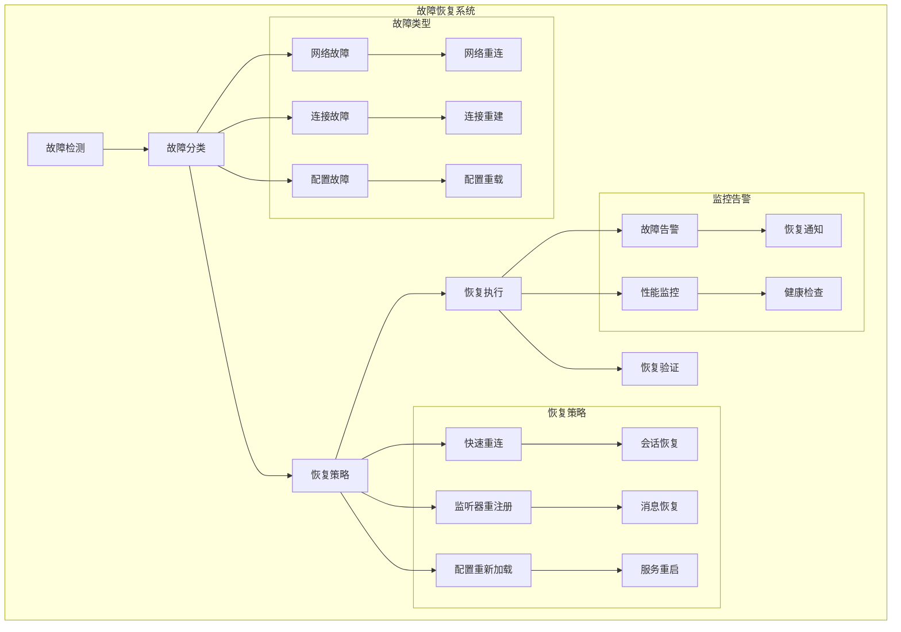

#### 完整实现代码

```java
@Component
public class FaultRecoveryService {
    
    @Autowired
    private HiveMqMqttClient mqttClient;
    
    private final Map<String, Consumer<ConsumerMessage>> listenerCache = new ConcurrentHashMap<>();
    private final AtomicBoolean recoveryInProgress = new AtomicBoolean(false);
    private final AtomicInteger recoveryAttempts = new AtomicInteger(0);
    
    private static final int MAX_RECOVERY_ATTEMPTS = 5;
    private static final long RECOVERY_RETRY_DELAY = 30; // 30秒
    
    @PostConstruct
    public void init() {
        // 订阅故障事件
        subscribeToFaultEvents();
        
        // 启动健康检查
        startHealthCheck();
    }
    
    /**
     * 订阅故障事件
     */
    private void subscribeToFaultEvents() {
        // 连接故障事件
        MqttEventBus.connectionStateFlow
            .filter(event -> event.getState() == ConnectionState.ABNORMAL_DISCONNECT)
            .subscribe(this::handleConnectionFailure);
            
        // 会话过期事件
        MqttEventBus.connectionStateFlow
            .filter(event -> event.getState() == ConnectionState.SESSION_EXPIRED)
            .subscribe(this::handleSessionExpired);
            
        // 网络质量事件
        MqttEventBus.networkQualityFlow
            .filter(event -> event.getStats().getPacketLossRate() > 0.2)
            .subscribe(this::handleNetworkFailure);
    }
    
    /**
     * 处理连接故障
     */
    private void handleConnectionFailure(ConnectionStateEvent event) {
        log.warn("检测到连接故障，开始故障恢复流程 - 原因: {}", event.getReason());
        
        if (recoveryInProgress.compareAndSet(false, true)) {
            startConnectionRecovery();
        }
    }
    
    /**
     * 处理会话过期
     */
    private void handleSessionExpired(ConnectionStateEvent event) {
        log.warn("检测到会话过期，开始会话恢复流程");
        
        if (recoveryInProgress.compareAndSet(false, true)) {
            startSessionRecovery();
        }
    }
    
    /**
     * 处理网络故障
     */
    private void handleNetworkFailure(NetworkQualityEvent event) {
        log.warn("检测到网络故障，丢包率: {}%", 
            event.getStats().getPacketLossRate() * 100);
        
        if (recoveryInProgress.compareAndSet(false, true)) {
            startNetworkRecovery();
        }
    }
    
    /**
     * 启动连接恢复
     */
    private void startConnectionRecovery() {
        try {
            log.info("开始连接故障恢复流程");
            
            // 重置重连计数器
            recoveryAttempts.set(0);
            
            // 执行连接恢复
            performConnectionRecovery();
            
        } catch (Exception e) {
            log.error("连接故障恢复失败: {}", e.getMessage());
            scheduleRecoveryRetry();
        }
    }
    
    /**
     * 启动会话恢复
     */
    private void startSessionRecovery() {
        try {
            log.info("开始会话恢复流程");
            
            // 重新初始化客户端
            mqttClient.reinitialize();
            
            // 重新注册监听器
            reRegisterAllListeners();
            
            log.info("会话恢复流程已完成");
            
        } catch (Exception e) {
            log.error("会话恢复失败: {}", e.getMessage());
            scheduleRecoveryRetry();
        } finally {
            recoveryInProgress.set(false);
        }
    }
    
    /**
     * 启动网络恢复
     */
    private void startNetworkRecovery() {
        try {
            log.info("开始网络故障恢复流程");
            
            // 尝试网络切换
            performNetworkSwitch();
            
            // 重新建立连接
            mqttClient.reinitialize();
            
            log.info("网络故障恢复流程已完成");
            
        } catch (Exception e) {
            log.error("网络故障恢复失败: {}", e.getMessage());
            scheduleRecoveryRetry();
        } finally {
            recoveryInProgress.set(false);
        }
    }
    
    /**
     * 执行连接恢复
     */
    private void performConnectionRecovery() {
        try {
            // 检查重连次数
            if (recoveryAttempts.get() >= MAX_RECOVERY_ATTEMPTS) {
                log.error("连接恢复重试次数已达上限，停止恢复");
                recoveryInProgress.set(false);
                return;
            }
            
            // 增加重连次数
            recoveryAttempts.incrementAndGet();
            
            log.info("执行连接恢复，第{}次尝试", recoveryAttempts.get());
            
            // 重新初始化客户端
            mqttClient.reinitialize();
            
            // 重新注册监听器
            reRegisterAllListeners();
            
            // 验证恢复结果
            if (validateRecovery()) {
                log.info("连接恢复成功");
                recoveryInProgress.set(false);
                recoveryAttempts.set(0);
            } else {
                log.warn("连接恢复验证失败，将重试");
                scheduleRecoveryRetry();
            }
            
        } catch (Exception e) {
            log.error("执行连接恢复失败: {}", e.getMessage());
            scheduleRecoveryRetry();
        }
    }
    
    /**
     * 执行网络切换
     */
    private void performNetworkSwitch() {
        try {
            // 获取当前网络类型
            NetworkTypeEnum currentNetwork = getCurrentNetworkType();
            
            if (currentNetwork == NetworkTypeEnum.PUBLIC) {
                // 切换到VPC网络
                mqttClient.changeServer(NetworkTypeEnum.VPC);
                log.info("已切换到VPC网络");
            } else {
                // 切换到公网
                mqttClient.changeServer(NetworkTypeEnum.PUBLIC);
                log.info("已切换到公网");
            }
            
        } catch (Exception e) {
            log.error("网络切换失败: {}", e.getMessage());
        }
    }
    
    /**
     * 重新注册所有监听器
     */
    private void reRegisterAllListeners() {
        try {
            // 重新注册所有缓存的监听器
            for (Map.Entry<String, Consumer<ConsumerMessage>> entry : listenerCache.entrySet()) {
                mqttClient.registerConsumer(entry.getKey(), entry.getValue());
            }
            
            log.info("所有监听器已重新注册，共{}个", listenerCache.size());
            
        } catch (Exception e) {
            log.error("重新注册监听器失败: {}", e.getMessage());
        }
    }
    
    /**
     * 验证恢复结果
     */
    private boolean validateRecovery() {
        try {
            // 检查连接状态
            boolean connected = mqttClient.isConnected();
            
            // 检查网络质量
            NetworkQualityStats stats = getCurrentNetworkQuality();
            boolean networkOk = stats.getAverageLatency() < 500 && stats.getPacketLossRate() < 0.1;
            
            return connected && networkOk;
            
        } catch (Exception e) {
            log.error("验证恢复结果失败: {}", e.getMessage());
            return false;
        }
    }
    
    /**
     * 调度恢复重试
     */
    private void scheduleRecoveryRetry() {
        try {
            log.info("调度恢复重试，延迟{}秒", RECOVERY_RETRY_DELAY);
            
            // 延迟重试
            CompletableFuture.delayedExecutor(RECOVERY_RETRY_DELAY, TimeUnit.SECONDS)
                .execute(() -> {
                    if (recoveryInProgress.get()) {
                        performConnectionRecovery();
                    }
                });
                
        } catch (Exception e) {
            log.error("调度恢复重试失败: {}", e.getMessage());
            recoveryInProgress.set(false);
        }
    }
    
    /**
     * 启动健康检查
     */
    private void startHealthCheck() {
        // 定期健康检查
        ScheduledExecutorService executor = Executors.newSingleThreadScheduledExecutor();
        executor.scheduleWithFixedDelay(this::performHealthCheck, 0, 60, TimeUnit.SECONDS);
    }
    
    /**
     * 执行健康检查
     */
    private void performHealthCheck() {
        try {
            // 检查连接状态
            if (!mqttClient.isConnected()) {
                log.warn("健康检查发现连接断开");
                
                if (recoveryInProgress.compareAndSet(false, true)) {
                    startConnectionRecovery();
                }
            }
            
            // 检查网络质量
            NetworkQualityStats stats = getCurrentNetworkQuality();
            if (stats.getAverageLatency() > 1000 || stats.getPacketLossRate() > 0.3) {
                log.warn("健康检查发现网络质量下降");
                
                if (recoveryInProgress.compareAndSet(false, true)) {
                    startNetworkRecovery();
                }
            }
            
        } catch (Exception e) {
            log.error("执行健康检查失败: {}", e.getMessage());
        }
    }
    
    /**
     * 缓存监听器
     */
    public void cacheListener(String topic, Consumer<ConsumerMessage> callback) {
        listenerCache.put(topic, callback);
        log.debug("监听器已缓存 - 主题: {}", topic);
    }
    
    /**
     * 移除缓存的监听器
     */
    public void removeCachedListener(String topic) {
        listenerCache.remove(topic);
        log.debug("缓存的监听器已移除 - 主题: {}", topic);
    }
    
    /**
     * 获取恢复状态
     */
    public boolean isRecoveryInProgress() {
        return recoveryInProgress.get();
    }
    
    /**
     * 获取恢复尝试次数
     */
    public int getRecoveryAttempts() {
        return recoveryAttempts.get();
    }
    
    // 辅助方法
    private NetworkTypeEnum getCurrentNetworkType() {
        // 获取当前网络类型
        return NetworkTypeEnum.PUBLIC; // 默认值
    }
    
    private NetworkQualityStats getCurrentNetworkQuality() {
        // 获取当前网络质量统计
        return new NetworkQualityStats(); // 默认值
    }
}
```

## ⚙️ 配置说明

### 核心配置参数

```yaml
platform:
  component:
    mqtt:
      # 基础配置
      enable: true                    # 是否启用MQTT组件
      mqtt-version: mqtt_5_0         # MQTT协议版本
      client-type: CLIENT            # 客户端类型
      parent-topic: /atlas_richie    # 根主题
      group-id: your-group-id        # 分组ID
      heartbeat-interval: 30         # 心跳间隔(秒)
      
      # 服务器配置
      server:
        host: mqtt.example.com       # 公网服务器地址
        port: 1883                   # 公网服务器端口
        vpc-host: mqtt-vpc.example.com  # VPC服务器地址
        vpc-port: 1883               # VPC服务器端口
        username: your-username       # 用户名
        password: your-password       # 密码
        default-network-type: PUBLIC # 默认网络类型
        qos: 1                       # 消息QoS级别
        time-to-wait: 10000          # 等待时间(毫秒)
      
      # MQTT 5.0 专用配置
      mqtt5:
        client-type: "pos_terminal"  # 客户端类型标识
        keep-session: true           # 是否保持会话状态
        session-expiry-interval: 1800  # 会话过期时间(秒)
        message-expiry-interval: 1800  # 消息过期时间(秒)
        enable-will-message: true    # 是否启用遗嘱消息
        will-topic: "device/status/{clientId}"  # 遗嘱消息主题
        will-message: "异常断开连接"    # 遗嘱消息内容
        app-version: "1.0.0"        # 应用版本号
        store-id: "STORE_001"       # 门店ID
        enable-user-properties: true # 是否启用用户属性
      
      # 快速恢复配置
      fast-recovery:
        enabled: true                    # 是否启用快速恢复模式
        network-check-interval: 5        # 网络检测间隔(秒)
        connection-monitor-interval: 10  # 连接状态监控间隔(秒)
        fast-reconnect-interval: 1000    # 快速重连间隔(毫秒)
        max-fast-reconnect-attempts: 10  # 最大快速重连次数
        network-connect-timeout: 3000    # 网络连接超时(毫秒)
        keep-alive-interval: 30         # 心跳间隔(秒)
        enable-network-monitor: true     # 是否启用网络监控
        enable-connection-monitor: true  # 是否启用连接状态监控
        enable-fast-reconnect: true      # 是否启用快速重连
        reconnect-on-network-recovery: true  # 网络恢复后立即重连
        reconnect-on-disconnect: true    # 连接断开后立即重连
```

### MQTT 5.0专用配置详解

#### 会话管理配置
- `keep-session`: 控制是否保持会话状态（对应cleanStart的取反）
- `session-expiry-interval`: 会话过期时间，支持长时间断网恢复

#### 消息可靠性配置
- `message-expiry-interval`: 消息过期时间，防止过期消息传递
- `enable-will-message`: 启用遗嘱消息，及时感知设备离线

#### 网络优化配置
- `enable-user-properties`: 启用用户属性，支持更丰富的元数据

### 快速恢复配置详解

#### 网络监控配置
- `enabled`: 是否启用快速恢复模式
- `network-check-interval`: 网络检测间隔，推荐5秒
- `connection-monitor-interval`: 连接监控间隔，推荐10秒
- `keep-alive-interval`: 心跳间隔，推荐30秒

#### 重连机制配置
- `fast-reconnect-interval`: 快速重连间隔，推荐1000毫秒
- `max-fast-reconnect-attempts`: 最大重连次数，推荐10次
- `network-connect-timeout`: 网络连接超时，推荐3000毫秒

#### 监控开关配置
- `enable-network-monitor`: 是否启用网络监控
- `enable-connection-monitor`: 是否启用连接状态监控
- `enable-fast-reconnect`: 是否启用快速重连
- `reconnect-on-network-recovery`: 网络恢复后立即重连
- `reconnect-on-disconnect`: 连接断开后立即重连

## 🔧 故障排查

### 故障诊断流程图

#### 连接故障诊断

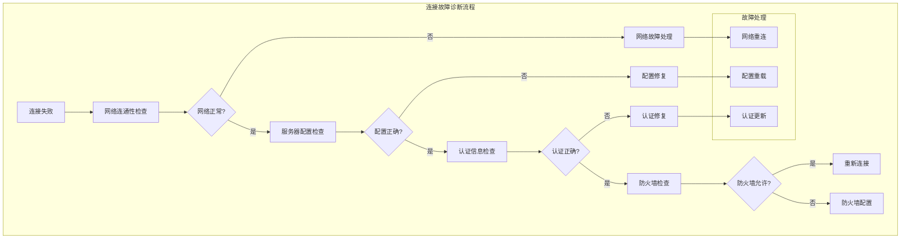

#### 消息丢失诊断

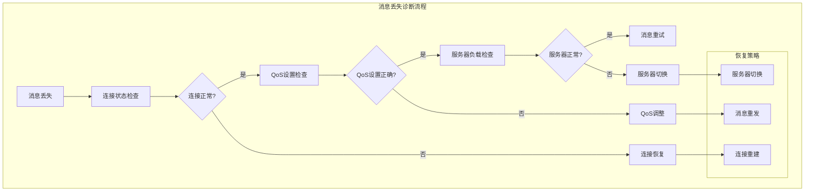

### 常见问题及解决方案

#### 1. 连接失败

**症状**: 客户端无法连接到MQTT服务器
**可能原因**:
- 网络不通
- 服务器地址错误
- 认证信息错误
- 防火墙阻止

**解决方案**:
```java
// 检查网络连通性
boolean networkOk = mqttClient.checkNetworkConnectivity();
if (!networkOk) {
    log.error("网络不可达，请检查网络连接");
    return;
}

// 验证服务器配置
MqttServerInfo serverInfo = mqttClient.getServerInfo();
log.info("服务器配置: {}", serverInfo);

// 重新初始化
mqttClient.reinitialize();
```

#### 2. 消息丢失

**症状**: 发布的消息没有收到确认
**可能原因**:
- 网络不稳定
- QoS设置不当
- 服务器负载过高

**解决方案**:
```java
// 使用QoS 1确保消息传递
mqttClient.doPublish(topic, message, false);

// 启用消息重试
mqttClient.setMaxPublishRetry(5);
mqttClient.setPublishRetryInterval(2000);

// 检查连接状态
if (!mqttClient.isConnected()) {
    log.warn("连接断开，消息可能丢失");
}
```

#### 3. 订阅失败

**症状**: 无法接收到订阅主题的消息
**可能原因**:
- 主题格式错误
- 权限不足
- 订阅时机不对

**解决方案**:
```java
// 确保连接成功后再订阅
if (mqttClient.isConnected()) {
    mqttClient.registerConsumer(topic, callback);
} else {
    log.warn("连接未建立，延迟订阅");
    // 延迟订阅逻辑
}

// 检查主题格式
if (!isValidTopic(topic)) {
    log.error("主题格式错误: {}", topic);
    return;
}
```

#### 4. 频繁重连

**症状**: 客户端频繁断开重连
**可能原因**:
- 网络不稳定
- 心跳间隔过短
- 服务器负载过高

**解决方案**:
```java
// 调整心跳间隔
mqttClient.setKeepAliveInterval(60); // 增加到60秒

// 启用自动重连
mqttClient.setAutomaticReconnect(true);

// 检查网络质量
if (mqttClient.getNetworkQuality() < 0.8) {
    log.warn("网络质量较差，考虑切换网络");
    mqttClient.changeServer(NetworkTypeEnum.VPC);
}
```

#### 5. 内存泄漏

**症状**: 应用内存使用量持续增长
**可能原因**:
- 监听器未正确注销
- 消息队列未清理
- 连接未正确关闭

**解决方案**:
```java
// 正确注销监听器
@Override
public void destroy() {
    // 注销所有监听器
    for (String topic : LISTENER_CACHE.keySet()) {
        mqttClient.unregisterConsumer(topic);
    }
    
    // 断开连接
    mqttClient.disconnect();
    
    // 关闭监控服务
    shutdownMonitorServices();
}

// 定期清理过期消息
mqttClient.setMessageExpiryInterval(300); // 5分钟过期
```

### 监控指标

#### 监控指标体系

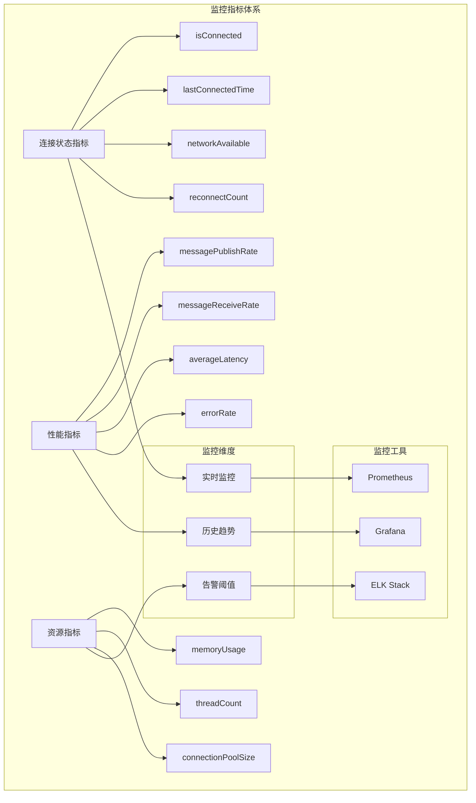

#### 连接状态指标
- `isConnected`: 当前连接状态
- `lastConnectedTime`: 最后连接成功时间
- `networkAvailable`: 网络可用状态
- `reconnectCount`: 重连次数

#### 性能指标
- `messagePublishRate`: 消息发布速率
- `messageReceiveRate`: 消息接收速率
- `averageLatency`: 平均延迟
- `errorRate`: 错误率

#### 资源指标
- `memoryUsage`: 内存使用量
- `threadCount`: 线程数量
- `connectionPoolSize`: 连接池大小

### 日志配置

```yaml
logging:
  level:
    com.richie.component.mqtt: DEBUG
    com.hivemq.client: INFO
  pattern:
    console: "%d{yyyy-MM-dd HH:mm:ss} [%thread] %-5level %logger{36} - %msg%n"
    file: "%d{yyyy-MM-dd HH:mm:ss} [%thread] %-5level %logger{36} - %msg%n"
```

## ⏱️ 时序图详解

### 客户端初始化时序图

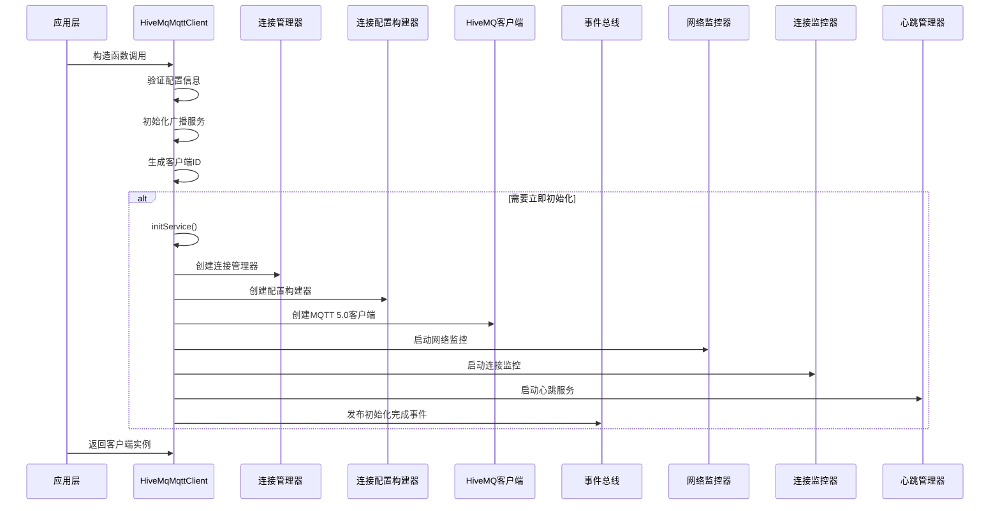

### 客户端连接建立时序图

```mermaid
sequenceDiagram
    participant App as 应用层
    participant HiveMqClient as HiveMqMqttClient
    participant ConnManager as 连接管理器
    participant ConfigBuilder as 配置构建器
    participant HiveMQ as HiveMQ客户端
    participant MQTTServer as MQTT服务器
    participant EventBus as 事件总线

    App->>HiveMqClient: initialClient(serverInfo)
    HiveMqClient->>ConnManager: 设置服务器配置
    ConnManager->>ConfigBuilder: 构建连接配置
    ConfigBuilder->>ConfigBuilder: 设置MQTT 5.0参数
    Note over ConfigBuilder: 会话过期、消息过期、遗嘱消息等
    
    ConnManager->>HiveMQ: 创建异步客户端
    ConnManager->>HiveMQ: 发起连接请求
    HiveMQ->>MQTTServer: CONNECT报文
    MQTTServer->>HiveMQ: CONNACK报文
    
    alt 连接成功
        HiveMQ->>ConnManager: 连接成功回调
        ConnManager->>ConnManager: 更新连接状态
        ConnManager->>EventBus: 发布连接成功事件
        EventBus->>App: 通知连接状态变化
    else 连接失败
        HiveMQ->>ConnManager: 连接失败回调
        ConnManager->>ConnManager: 分析失败原因
        ConnManager->>EventBus: 发布连接失败事件
    end
    
    App->>HiveMqClient: 返回连接结果
```

### 消息发布时序图

```mermaid
sequenceDiagram
    participant App as 应用层
    participant HiveMqClient as HiveMqMqttClient
    participant MessageManager as 消息管理器
    participant HiveMQ as HiveMQ客户端
    participant MQTTServer as MQTT服务器
    participant EventBus as 事件总线

    App->>HiveMqClient: doPublish(topic, payload)
    HiveMqClient->>HiveMqClient: 检查连接状态
    
    alt 连接正常
        HiveMqClient->>MessageManager: 发布消息
        MessageManager->>HiveMQ: 构建PUBLISH报文
        HiveMQ->>MQTTServer: 发送PUBLISH报文
        
        alt QoS 0
            MQTTServer->>HiveMQ: 直接处理
        else QoS 1
            MQTTServer->>HiveMQ: 返回PUBACK
            HiveMQ->>MessageManager: 确认消息
        else QoS 2
            MQTTServer->>HiveMQ: 返回PUBREC
            HiveMQ->>MQTTServer: 发送PUBREL
            MQTTServer->>HiveMQ: 返回PUBCOMP
            HiveMQ->>MessageManager: 确认消息
        end
        
        MessageManager->>EventBus: 发布消息发送成功事件
        EventBus->>App: 通知消息发送状态
    else 连接异常
        HiveMqClient->>HiveMqClient: 触发快速重连
        HiveMqClient->>App: 返回发送失败
    end
```

### 消息订阅时序图

```mermaid
sequenceDiagram
    participant App as 应用层
    participant HiveMqClient as HiveMqMqttClient
    participant AbstractApi as AbstractMqttClientApi
    participant MessageManager as 消息管理器
    participant HiveMQ as HiveMQ客户端
    participant MQTTServer as MQTT服务器
    participant EventBus as 事件总线

    App->>HiveMqClient: registerConsumer(topic, callback)
    HiveMqClient->>AbstractApi: registerConsumer(topic, callback)
    AbstractApi->>AbstractApi: 保存到LISTENER_CACHE
    AbstractApi->>HiveMqClient: doSubscribe(topic)
    HiveMqClient->>MessageManager: doSubscribe(topic)
    
    alt 已连接
        MessageManager->>HiveMQ: 发送SUBSCRIBE报文
        HiveMQ->>MQTTServer: SUBSCRIBE请求
        MQTTServer->>HiveMQ: SUBACK确认
        HiveMQ->>MessageManager: 订阅成功
    else 未连接
        MessageManager->>MessageManager: 缓存订阅请求
        Note over MessageManager: 等待连接建立后自动订阅
    end
    
    Note over HiveMqClient: 初始化时订阅消息事件流
    HiveMqClient->>EventBus: subscribeMessageFlowIfNecessary()
    EventBus->>HiveMqClient: 订阅messageFlow事件流
    
    Note over MQTTServer: 服务器推送消息
    MQTTServer->>HiveMQ: PUBLISH报文
    HiveMQ->>MessageManager: 接收消息
    MessageManager->>EventBus: 发布到messageFlow
    EventBus->>HiveMqClient: dispatchMessage(publish)
    
    HiveMqClient->>HiveMqClient: 1. 从LISTENER_CACHE精确匹配
    alt 普通订阅匹配成功
        HiveMqClient->>App: 调用普通订阅回调
    else 普通订阅未匹配
        HiveMqClient->>HiveMqClient: 2. 从SHARED_LISTENER_CACHE通配符匹配
        alt 共享订阅匹配成功
            HiveMqClient->>HiveMqClient: 提取业务topic并匹配
            HiveMqClient->>App: 调用共享订阅回调
        else 未找到匹配回调
            HiveMqClient->>HiveMqClient: 记录调试日志，丢弃消息
        end
    end
```

### 后台保活和监控逻辑时序图

```mermaid
sequenceDiagram
    participant Scheduler as 调度器
    participant NetworkMonitor as 网络监控器
    participant ConnMonitor as 连接监控器
    participant HeartbeatManager as 心跳管理器
    participant HiveMQ as HiveMQ客户端
    participant MQTTServer as MQTT服务器
    participant EventBus as 事件总线

    Note over Scheduler: 启动后台监控服务
    
    par 网络监控 (5秒间隔)
        Scheduler->>NetworkMonitor: 执行网络检测
        NetworkMonitor->>NetworkMonitor: Socket连接测试
        alt 网络可达
            NetworkMonitor->>NetworkMonitor: 更新网络状态
            NetworkMonitor->>EventBus: 发布网络恢复事件
        else 网络不可达
            NetworkMonitor->>NetworkMonitor: 标记网络不可用
            NetworkMonitor->>EventBus: 发布网络故障事件
        end
    and 连接监控 (10秒间隔)
        Scheduler->>ConnMonitor: 检查连接状态
        ConnMonitor->>HiveMQ: 获取客户端状态
        alt 连接正常
            ConnMonitor->>ConnMonitor: 更新连接状态
        else 连接异常
            ConnMonitor->>ConnMonitor: 触发重连
            ConnMonitor->>EventBus: 发布连接故障事件
        end
    and 心跳维护 (30秒间隔)
        Scheduler->>HeartbeatManager: 发送心跳
        HeartbeatManager->>HiveMQ: 发送PINGREQ
        HiveMQ->>MQTTServer: PINGREQ报文
        MQTTServer->>HiveMQ: PINGRESP报文
        HeartbeatManager->>HeartbeatManager: 计算延迟
        HeartbeatManager->>EventBus: 发布心跳事件
    end
```

### 快速重连机制时序图

```mermaid
sequenceDiagram
    participant NetworkMonitor as 网络监控器
    participant ConnMonitor as 连接监控器
    participant ConnManager as 连接管理器
    participant HiveMQ as HiveMQ客户端
    participant MQTTServer as MQTT服务器
    participant EventBus as 事件总线

    Note over NetworkMonitor: 检测到网络恢复
    NetworkMonitor->>ConnManager: 触发快速重连
    
    ConnManager->>ConnManager: connect()方法（同步锁保护）
    ConnManager->>ConnManager: 读取快速恢复配置
    
    Note over ConnManager: 自动重试机制（指数退避+抖动）
    loop 重试循环（支持无限重试）
        ConnManager->>ConnManager: attemptConnect(isFirstAttempt)
        ConnManager->>ConnManager: 设置reconnecting标志
        ConnManager->>ConnManager: 验证服务器配置
        ConnManager->>HiveMQ: 构建并连接MQTT客户端
        HiveMQ->>MQTTServer: CONNECT报文
        
        alt 连接成功
            MQTTServer->>HiveMQ: CONNACK成功
            HiveMQ->>ConnManager: 连接成功回调
            ConnManager->>ConnManager: 重置reconnecting标志
            ConnManager->>ConnManager: 更新连接状态
            ConnManager->>EventBus: 发布连接成功事件
            ConnManager->>ConnManager: 退出重试循环
        else 连接失败
            MQTTServer->>HiveMQ: CONNACK失败（或超时）
            HiveMQ->>ConnManager: 连接失败回调
            ConnManager->>ConnManager: 分析失败原因
            
            alt 无限重试模式（maxAttempts <= 0）
                ConnManager->>ConnManager: 计算指数退避时间
                ConnManager->>ConnManager: 添加随机抖动（20%~100%）
                ConnManager->>ConnManager: 等待退避时间后继续重试
            else 有限重试模式（maxAttempts > 0）
                ConnManager->>ConnManager: 检查重试次数
                alt 未超过最大重试次数
                    ConnManager->>ConnManager: 计算指数退避时间
                    ConnManager->>ConnManager: 添加随机抖动
                    ConnManager->>ConnManager: 等待退避时间后继续重试
                else 超过最大重试次数
                    ConnManager->>ConnManager: 停止重连
                    ConnManager->>EventBus: 发布重连失败事件
                    ConnManager->>ConnManager: 退出重试循环
                end
            end
        end
    end
```

### 网络质量监控时序图

```mermaid
sequenceDiagram
    participant Scheduler as 调度器
    participant NetworkQualityManager as 网络质量管理器
    participant NetworkQualityMonitor as 网络质量监控器
    participant MQTTServer as MQTT服务器
    participant EventBus as 事件总线
    participant CircularBuffer as 循环缓冲区

    Note over Scheduler: 每秒执行网络质量监控
    
    Scheduler->>NetworkQualityManager: 执行网络质量检测
    NetworkQualityManager->>NetworkQualityMonitor: 开始网络质量检测
    
    NetworkQualityMonitor->>MQTTServer: Socket连接测试
    alt 连接成功
        MQTTServer->>NetworkQualityMonitor: 连接响应
        NetworkQualityMonitor->>NetworkQualityManager: 计算网络延迟
        NetworkQualityManager->>NetworkQualityManager: 更新统计信息
        NetworkQualityManager->>CircularBuffer: 保存质量事件
        NetworkQualityManager->>EventBus: 发布网络质量事件
        
        alt 网络质量良好
            EventBus->>NetworkQualityManager: 网络质量正常
        else 网络质量下降
            EventBus->>NetworkQualityManager: 触发网络优化
            NetworkQualityManager->>NetworkQualityManager: 考虑网络切换
        end
    else 连接失败
        NetworkQualityMonitor->>NetworkQualityManager: 标记网络不可用
        NetworkQualityManager->>CircularBuffer: 保存故障事件
        NetworkQualityManager->>EventBus: 发布网络故障事件
    end
    
    NetworkQualityManager->>NetworkQualityManager: 计算历史统计
    Note over NetworkQualityManager: 平均延迟、丢包率、成功率等
```

### 事件总线通信时序图

```mermaid
sequenceDiagram
    participant Component as 组件
    participant EventBusInternal as 事件总线内部接口
    participant EventBus as 事件总线
    participant Subscriber as 事件订阅者
    participant Reactor as Reactor响应式流

    Note over Component: 组件发布事件
    
    Component->>EventBusInternal: 发布事件
    EventBusInternal->>EventBus: 内部事件发布
    EventBus->>Reactor: 发布到响应式流
    
    par 连接状态事件流
        Reactor->>Subscriber: 连接状态变化
        Subscriber->>Subscriber: 处理连接事件
    and 网络质量事件流
        Reactor->>Subscriber: 网络质量变化
        Subscriber->>Subscriber: 处理网络事件
    and 消息事件流
        Reactor->>Subscriber: 消息处理状态
        Subscriber->>Subscriber: 处理消息事件
    and 心跳事件流
        Reactor->>Subscriber: 心跳状态变化
        Subscriber->>Subscriber: 处理心跳事件
    end
    
    Note over Subscriber: 订阅者处理事件
    Subscriber->>Subscriber: 执行业务逻辑
    Subscriber->>Subscriber: 更新状态
    Subscriber->>Subscriber: 触发相应操作
```

### 遗嘱消息处理时序图

```mermaid
sequenceDiagram
    participant App as 应用层
    participant HiveMqClient as HiveMqMqttClient
    participant ConnManager as 连接管理器
    participant ConfigBuilder as 配置构建器
    participant HiveMQ as HiveMQ客户端
    participant MQTTServer as MQTT服务器

    App->>HiveMqClient: 配置遗嘱消息
    HiveMqClient->>ConfigBuilder: 设置遗嘱消息参数
    ConfigBuilder->>ConfigBuilder: 构建遗嘱消息配置
    Note over ConfigBuilder: 遗嘱主题、消息内容、QoS等
    
    ConnManager->>HiveMQ: 建立连接时包含遗嘱消息
    HiveMQ->>MQTTServer: CONNECT报文(含遗嘱消息)
    MQTTServer->>HiveMQ: CONNACK确认
    
    Note over MQTTServer: 正常通信过程
    
    alt 客户端异常断开
        Note over HiveMQ: 网络异常、进程崩溃等
        MQTTServer->>MQTTServer: 检测到客户端异常断开
        MQTTServer->>MQTTServer: 自动发布遗嘱消息
        MQTTServer->>其他客户端: 发布遗嘱消息到指定主题
        Note over 其他客户端: 接收遗嘱消息，处理设备离线通知
    else 客户端正常断开
        HiveMQ->>MQTTServer: DISCONNECT报文
        MQTTServer->>HiveMQ: 正常断开，不发送遗嘱消息
    end
```

### 网络切换时序图

```mermaid
sequenceDiagram
    participant App as 应用层
    participant HiveMqClient as HiveMqMqttClient
    participant ConnManager as 连接管理器
    participant NetworkQualityManager as 网络质量管理器
    participant HiveMQ as HiveMQ客户端
    participant PublicServer as 公网服务器
    participant VpcServer as VPC服务器
    participant EventBus as 事件总线

    Note over NetworkQualityManager: 检测到网络质量下降
    
    NetworkQualityManager->>EventBus: 发布网络质量事件
    EventBus->>App: 通知网络质量变化
    
    App->>HiveMqClient: changeServer(NetworkTypeEnum.VPC)
    HiveMqClient->>ConnManager: 切换网络类型
    ConnManager->>ConnManager: 断开当前连接
    ConnManager->>HiveMQ: 断开连接
    HiveMQ->>PublicServer: DISCONNECT报文
    
    ConnManager->>ConnManager: 更新服务器配置
    ConnManager->>VpcServer: 建立新连接
    ConnManager->>HiveMQ: 使用VPC配置重新连接
    HiveMQ->>VpcServer: CONNECT报文
    VpcServer->>HiveMQ: CONNACK确认
    
    ConnManager->>ConnManager: 更新网络类型
    ConnManager->>EventBus: 发布网络切换事件
    EventBus->>App: 通知网络切换完成
    
    Note over ConnManager: 重新订阅主题
    ConnManager->>HiveMQ: 重新订阅所有主题
    HiveMQ->>VpcServer: SUBSCRIBE报文
    VpcServer->>HiveMQ: SUBACK确认
```
