# Atlas Richie MQTT Component (atlas-richie-component-mqtt)

## 📖 Table of Contents

- [🎯 Component Overview](#-component-overview)
  - [Key Features](#key-features)
- [🏗️ Architecture Design](#️-architecture-design)
  - [Event-Driven Architecture](#event-driven-architecture)
  - [Core Component Architecture](#core-component-architecture)
  - [Event Stream Design](#event-stream-design)
  - [Component Lifecycle](#component-lifecycle)
  - [Layer Responsibilities](#layer-responsibilities)
  - [Publisher Flow Diagram](#publisher-flow-diagram)
  - [Subscriber Flow Diagram](#subscriber-flow-diagram)
- [📎 🔄 MQTT 5.0 vs 3.1.1 Protocol Comparison](#-🔄-mqtt-50-vs-311-protocol-comparison)
  - [Protocol Architecture Comparison](#protocol-architecture-comparison)
  - [Feature Comparison](#feature-comparison)
  - [Weak-Network Comparison](#weak-network-comparison)
  - [Before/After Upgrade Comparison](#beforeafter-upgrade-comparison)
- [📎 🌐 Weak-Network Optimization](#-🌐-weak-network-optimization)
  - [Network Monitoring and Fast Recovery Principles](#network-monitoring-and-fast-recovery-principles)
  - [Network Monitoring Mechanism](#network-monitoring-mechanism)
  - [Fast Reconnect Mechanism](#fast-reconnect-mechanism)
  - [Monitor Service Configuration](#monitor-service-configuration)
- [📎 💀 Will Message Support](#-💀-will-message-support)
  - [Will Message Overview](#will-message-overview)
  - [KDS Box Business Value](#kds-box-business-value)
  - [Will Message Configuration Examples](#will-message-configuration-examples)
  - [Cloud Processing Recommendations](#cloud-processing-recommendations)
- [🚀 Quick Start Guide](#-quick-start-guide)
  - [1. Add Dependency](#1-add-dependency)
  - [2. Configuration File](#2-configuration-file)
  - [3. Basic Usage](#3-basic-usage)
  - [4. Event Subscription](#4-event-subscription)
  - [5. Manual Initialization](#5-manual-initialization)
  - [6. Advanced Configuration Examples](#6-advanced-configuration-examples)
- [📚 Interface Reference](#-interface-reference)
  - [Event Subscription and Handling](#event-subscription-and-handling)
  - [Message Publish and Subscribe Flow Diagram](#message-publish-and-subscribe-flow-diagram)
  - [Public Interface Methods](#public-interface-methods)
  - [Automatic Handling Methods](#automatic-handling-methods)
- [🔧 Core Capabilities](#-core-capabilities)
  - [Scenario 1: Device Status Reporting](#scenario-1-device-status-reporting)
  - [Scenario 2: Dynamic Configuration Push](#scenario-2-dynamic-configuration-push)
  - [Scenario 3: High-Availability Message Processing](#scenario-3-high-availability-message-processing)
  - [Scenario 4: Fault Recovery Handling](#scenario-4-fault-recovery-handling)
- [⚙️ Configuration Reference](#️-configuration-reference)
  - [Core Configuration Parameters](#core-configuration-parameters)
  - [MQTT 5.0-Specific Configuration Details](#mqtt-50-specific-configuration-details)
  - [Fast Recovery Configuration Details](#fast-recovery-configuration-details)
- [🔧 Troubleshooting](#-troubleshooting)
  - [Fault Diagnosis Flow Diagram](#fault-diagnosis-flow-diagram)
  - [Common Issues and Solutions](#common-issues-and-solutions)
  - [Monitoring Metrics](#monitoring-metrics)
  - [Log Configuration](#log-configuration)
- [📎 ⏱️ Sequence Diagram Reference](#-⏱️-sequence-diagram-reference)
  - [Client Initialization Sequence](#client-initialization-sequence)
  - [Client Connection Establishment Sequence](#client-connection-establishment-sequence)
  - [Message Publishing Sequence](#message-publishing-sequence)
  - [Message Subscription Sequence](#message-subscription-sequence)
  - [Background Keepalive and Monitoring Sequence](#background-keepalive-and-monitoring-sequence)
  - [Fast Reconnect Sequence](#fast-reconnect-sequence)
  - [Network Quality Monitoring Sequence](#network-quality-monitoring-sequence)
  - [Event Bus Communication Sequence](#event-bus-communication-sequence)
  - [Will Message Handling Sequence](#will-message-handling-sequence)
  - [Network Switch Sequence](#network-switch-sequence)
## 🎯 Component Overview

RichieMQTT 5.0 Client Component is a commercial-grade MQTT client built on HiveMQ 1.3.7. It uses an **event-driven architecture** and is specifically optimized for fast recovery after long disconnections. The component supports every new MQTT 5.0 feature, including session expiry, message expiry, topic aliases, user properties, and will messages.

### Key Features

- ✅ **Event-driven architecture**: Built on Reactor reactive programming, with event stream subscription and handling
- ✅ **MQTT 5.0 protocol support**: Full support for all MQTT 5.0 protocol features
- ✅ **Fast recovery mechanism**: Reconnect within 1 second after network recovery
- ✅ **Multi-network support**: Dynamic switching between public and VPC networks
- ✅ **Manual initialization**: Supports server-pushed configuration initialization
- ✅ **Session preservation**: Maintains session state and message queue during outages
- ✅ **Smart monitoring**: Real-time monitoring of network reachability and connection state
- ✅ **Commercial-grade stability**: Reconnect and error handling optimized for production
- ✅ **Will message support**: Notifies the cloud automatically when a device goes offline abnormally
- ✅ **Separation of concerns**: Technical exceptions are handled automatically; business events are fully exposed to callers
- ✅ **Event loop protection**: Prevents events from cycling inside the component
- ✅ **Resource optimization**: Uses try-with-resources to avoid resource leaks
- ✅ **Code simplification**: Removes unused variables and features to improve code quality

## 🏗️ Architecture Design

### Event-Driven Architecture

The RichieMQTT 5.0 component uses an **event-driven architecture** based on the Reactor reactive programming model, with an event bus enabling loosely coupled communication between components. The design offers the following advantages:

- **Loose coupling**: Components communicate through events, reducing direct dependencies
- **Reactive programming**: Reactor-based Flux event streams with backpressure support
- **Separation of concerns**: Technical exceptions handled automatically; business events fully exposed to callers
- **Event loop protection**: Prevents events from cycling inside the component

### Core Component Architecture

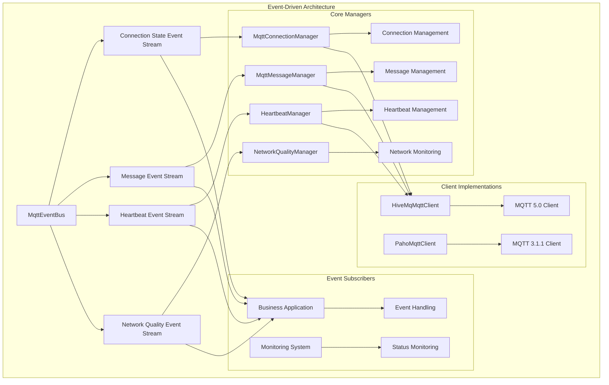

### Event Stream Design

#### Connection State Event Stream (`connectionStateFlow`)
- **Event type**: `ConnectionStateEvent`
- **Subscription purpose**: Monitor connection state changes, handle technical exceptions
- **Event content**: Connection state, client ID, timestamp, reason code
- **Handling strategy**:
  - Technical exceptions (`ABNORMAL_DISCONNECT`, `SESSION_EXPIRED`) handled automatically
  - Business events (`CONNECTED`, `DISCONNECTED`, etc.) exposed to callers

#### Message Event Stream (`messageFlow`)
- **Event type**: `MessageEvent`
- **Subscription purpose**: Monitor message delivery status
- **Event content**: Message ID, topic, QoS, timestamp, status
- **Handling strategy**: Fully exposed to callers, supports business logic handling

#### Heartbeat Event Stream (`heartbeatFlow`)
- **Event type**: `HeartbeatEvent`
- **Subscription purpose**: Monitor heartbeat status
- **Event content**: Heartbeat time, latency, status
- **Handling strategy**: Used for internal monitoring, supports external subscriptions

#### Network Quality Event Stream (`networkQualityFlow`)
- **Event type**: `NetworkQualityEvent`
- **Subscription purpose**: Monitor network quality
- **Event content**: Latency, packet loss rate, network type
- **Handling strategy**: Internal network management, supports external monitoring

### Component Lifecycle

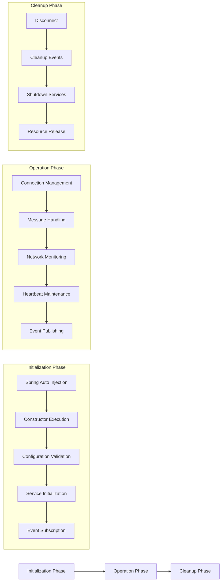

#### Initialization Phase
- **Spring auto injection**: Component is managed by Spring container
- **Constructor execution**: Creates necessary managers and clients
- **Configuration validation**: Validates MQTT server configuration
- **Service initialization**: Starts network monitoring, connection monitoring, etc.
- **Event subscription**: Subscribes to required technical exception events

#### Operation Phase
- **Connection management**: Maintains MQTT connection state, handles technical exceptions
- **Message handling**: Handles message publishing, subscription, deduplication, etc.
- **Network monitoring**: Monitors network reachability, triggers reconnection
- **Heartbeat maintenance**: Sends heartbeat messages, detects connection health
- **Event publishing**: Publishes status events to notify subscribers

#### Cleanup Phase
- **Disconnect**: Gracefully disconnects the MQTT connection
- **Cleanup events**: Cleans up all event streams and subscriptions
- **Shutdown services**: Stops monitoring services and thread pools
- **Resource release**: Releases all occupied resources

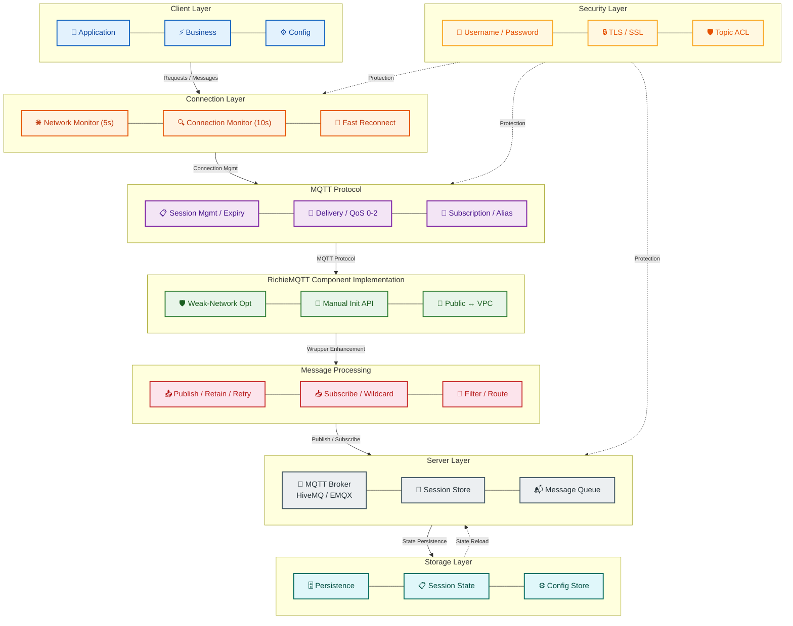
### Layer Responsibilities

#### Client Layer
- **Application Layer**: Business logic processing, message format conversion
- **Business Layer**: Message routing, filtering, transformation
- **Config Layer**: Client configuration management, dynamic config push

#### Connection Layer
- **Network monitoring**: Real-time detection of network reachability, 5-second interval
- **Connection monitoring**: Monitors MQTT connection state, 10-second interval
- **Fast reconnect**: Automatic retry mechanism (exponential backoff + random jitter)
  - Supports infinite retry mode (configure `max-fast-reconnect-attempts <= 0`)
  - Supports finite retry mode (configure `max-fast-reconnect-attempts > 0`)
  - Retry interval grows exponentially (1x, 2x, 4x...), capped at 5 minutes
  - Each retry interval adds 20%~100% random jitter to avoid simultaneous retries from multiple clients

#### MQTT Protocol Layer
- **Session management**: MQTT 5.0 session expiry mechanism, supports 2-hour session persistence
- **Message delivery**: QoS 0/1/2 delivery with message expiry support
- **Topic subscription**: Topic aliases supported, up to 10 topic aliases

#### RichieMQTT Component Implementation
- **HiveMqMqttClient**: MQTT 5.0 client implementation based on HiveMQ 1.3.7
- **Manual initialization interface**: Supports manual initialization via server-pushed configuration
- **Network switch mechanism**: Dynamic public/VPC network switching
- **Network type broadcast**: Broadcasts the current network type once per second via the event bus
  - Uses virtual threads for better performance
  - Supports graceful shutdown and resource cleanup
  - Broadcast frequency: once per second

#### Message Handling Layer
- **Message publishing**: Supports retained messages and retry mechanism
- **Message subscription**: Supports batch subscription and topic listener management
  - **Normal subscription**: Exact-match lookup based on `LISTENER_CACHE`
  - **Shared subscription**: Wildcard match based on `SHARED_LISTENER_CACHE` (MQTT 5.0 feature)
- **Message dispatch**: Event bus-based message dispatching
  - Subscribes to `MqttEventBus.messageFlow` (only once, to prevent duplicate subscriptions)
  - Automatically routes messages to the corresponding business callback
  - Supports automatic matching for both normal and shared subscriptions
  - Supports wildcard matching (`+` single-level wildcard, `#` multi-level wildcard)
- **Message filtering**: Topic-based message filtering and routing

#### Server Layer
- **MQTT Broker**: Server that supports the MQTT 5.0 protocol
- **Session storage**: Persistent client session state
- **Message queue**: Offline message queue management

#### Storage Layer
- **Message persistence**: Local persistence for important messages
- **Session state**: Local cache of client session state
- **Configuration storage**: Local storage of client configuration

#### Security Layer
- **Identity authentication**: Username/password authentication
- **Data encryption**: TLS/SSL encryption in transit
- **Access control**: Topic-based access permission control

### Publisher Flow Diagram

[View full size](https://mermaid-live.nodejs.cn/view#pako:eNp9ld1S20YUx1_Fs9eGkWQbB190prGTQBIHG5yQsvaFwAvWFCRHlpOmwjOmlMElEKAlnSYhODQlZprWpk0LnjDAy2RX8lt0tbuu5QmtLjTSnt_5n489K9lgxsgjEANzplosBDKJrB6g1-cQf9hxdg7xVguvHeYCAwOfBa7CiaKp6XPu6q90jbw_xCsHI9pDlHyQfGBZ8XkN6VaOu19lDnFI9r7tVF_j1TPy7Ih813D31wUQZ0DC7qxsOGdN8lMLb72lsWjECgcSHrBIDYuBa9DZqZPaFm7-TGonzrvWaCLnh6jrYmAKOqc_kFd1YbnG9K9DTdesCWQ-1GYQrr3CjSd4_UeBXGfIDYhrL_Hph2Q6kwlEBqV_gwjqBqNGoNs8p4m6F3vk6QHe_IbWI4ARBoxCbvJkyO4GXtvHzw8FMcqImzYneK1eOWt1UevNXq23IO-483KbPG1wpZyfYsXehp3VDbf1jCsK-20WJmlzE_lt3-s5C-Yer3Seb4lgyZ7MqH-Fhb9D6zzCZ0IY__KH-1dX_haTH2MdvYOsR4b5ZdKgz4bpnG07p7s84z44xeC4oetoxtIMXfBc_BI-3eVL5QVkjiDVtKaRauGLZffkfV8v-H0cfmy_oIvu0TIdnLyRKk_Pa6UCn9YJSN5USf1ARFs7JtUl4T3BgEz_hvz-BrfbokeZXkfuQq5e5No0OYuOOd7cxu1lclwjS91ByfT6eg-6jbcUmVVL1jia4fVPalZhHFnmY8HfY0lMQnzxrlOte5t2sSdMk8x03-aLlwzMfV9-_hUW_QuxhzzHvj28y4SnIE9cAM11qt3X11J5mn8NsoCfdf80ZgGHvGuMz4QMSWsz4jS-9zr-9xM-DzkfJnNOsblJHPfNlnt-XvFhSq-IsRAkr1dpIdzjY3uD4nQbcp_grAtjYVuInvzJd9WvG_bpRsTeXNL2XgO8K8VHmNUmS6K47jj5PFK8uJTy3-PEMF9xqZBI4n_Cp_mJkCFuviC7dQ-uLvGT4OPTPHhascUh-XRWGOYLnr40ONLzIEj_AVoexCyzjIKAnsAF1XsFtodkgVVACygLYvQxj2bV8rzljUKFuhVVfcowFrqeplGeK4DYrDpfom_lYl61UEJT6Uj1EBoPmXGjrFsgFpKGmAaI2eArEBuIXpEGJSmiRBR5SApFQ-EgeAxishQdHI5KIelKZCiqhCUlXAmCr1nY8GAoKsmyIivDkWEpOiQHAcp7X5ok_7WxP1zlHxVFAbE)

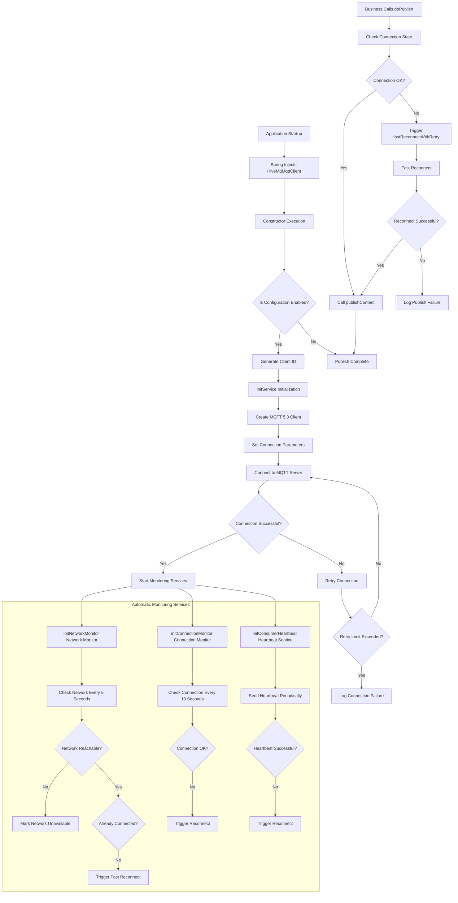

### Subscriber Flow Diagram
[View full size](https://mermaid-live.nodejs.cn/view#pako:eNqNlt1S20YUx1_Fo2tgwMgGfNEZsAEb4mADaRIWXwi8gKZgE1lOmhpmTAnBED5MQzKQAA4EaqYBTJsWmDjAy7Ar-S262rOO5UJmqguNpP3t-Dr_2VVKGo5HseSRRjVlcszR7xuMOdjVisiXdWP9kGQLZPEw4qit_cHRhvomNTU2as7_wb7Rz4dk7sCvPsXBJ8Enuu4dV3FMj8D0Nj7Bi-jOi1L6A5m_pG9O6ULe3F0SgJcDvlRpbtm4PKEbBZL9nfliHqcB8FnAFBuYcrQjYz1HM1lyskcz58anQsAXsUNs6pRjABnF13Q7J0bauf0OpMZUvQ9rT9VhTDLbJP-KLL0VSAdHOhHJvCfFL8Fwf7_DVVf_zYmgOjnlR-bJFQvUvN6hKwdk9VeWjwD8HAggGLLM0K1lsrhLNg8FEeBEVwoIyNVKZzEncu2q5NqNoOLG-zW6kgdLETvFk72HSvPLZuENWBTj97ibYAqG6NGuVXPuzDybK21mhbNgxUzA_oW7v8_yPCWXwjDZ_9P8u2y-m5vv4RW9j_Vnce2nYJw9xzXjcs0obkHEVXCIw954LIaHdTUeEzwYv4MPl_lEcgJrfqxo-hBWdHI9a55_rqoF3HvRzcU79tE8nWXC0fComtCxVp4Pou1DllBfLtGzDJ0pkP0XRvZlZWn6ONOPwEI03pccSgxr6hA2T_ZKG3M3F8XS3oZg-zn7QCgB7LEkSPaoYu8BZ35ExvECuZoTPjOn5tVVVeAPUZVO6MphKT0DNET9CI0pseg4DuJEQhnFELYAwMQjzj1GwsdKkS07_ZimufJ6PebAQAokwEbJ_jLAQggDlWVvbWWV3CNfZ-1YxI5xvbS1oZvrbXK88S0x4-tr9lpuetH1XmReHpFVJopNWJ__Vt0rut8n1q-ULppXa0BV1SmRHIJtaVCCTcfeFoMSQNbVA-JsQLSw6jLyv1mV-OcVCDNiwxqAc6ZgSOw7qwW2QNM2zFnJuacR0Q_zrCtgxs3FMsOZViK3cF7JHlkUnJz_BTq325Vtdl3IzDPXa-T6Uymds5r2esdu1AWhuq1Wp29P7xBkpU7WFYKW4yVoqBc1yB1UbRGcgxqEnNX70fFHcnFhizVkq0GoUcR6K8pQIxiT_2-UYWj0BkRO3tGtnGUzPQMNbuPDEGPYmRK9f3vP5JgtxvCdMeJY9Dt6EgKY2WN6B-XZ9dTOzhwbAHKC1uzoQCNKQu_Fw7CvPVT1sV6sa89t8XeIs4UdLnevbqc4VvwpGPpOgn5_RVmBQFWN6UKabi3cqrSYwUvS1cXOxLxRPIYTwUYF4Ejq7kYiP97PlhjWzyqVk2rYT4EalTy6lsQ1EttSJxTrVUpZyKCkj-EJPCh52GMUjyjJcd0q4TSbNqnEBuLxifJMLZ4cHZM8I8p4gr0lJ6OKjn2qwpaigjB_1tadjOmSx8UtSJ6U9LPkqW10s2NZlhubnQ31slOub6qRnkseZ3Od3NLkdspu2emSnc0t0zXSL9ynXNfgbml2Ncsul9vV1OJqqZFw1Dp3gvCjw_93pv8FzQ34qA)
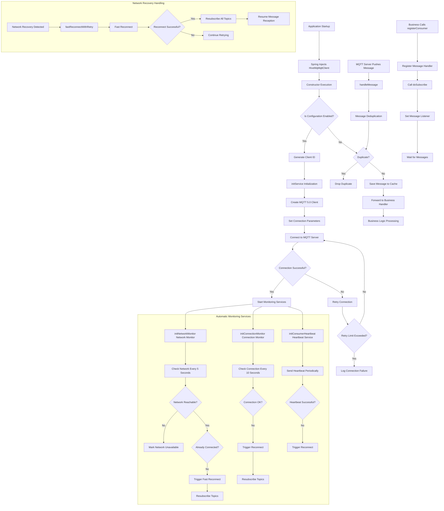

## 📎 🔄 MQTT 5.0 vs 3.1.1 Protocol Comparison

### Protocol Architecture Comparison

#### `MQTT` 3.1.1 Protocol Architecture

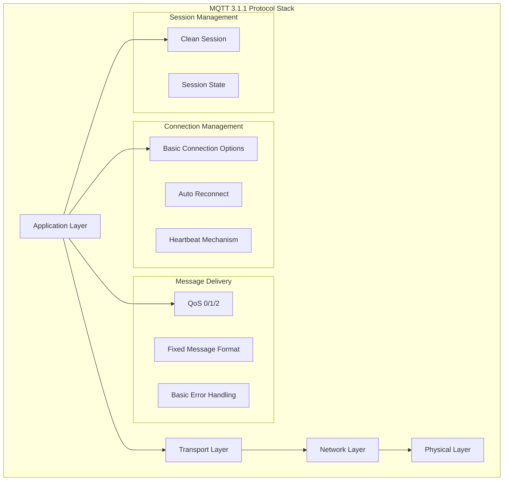

#### `MQTT` 5.0 Protocol Architecture

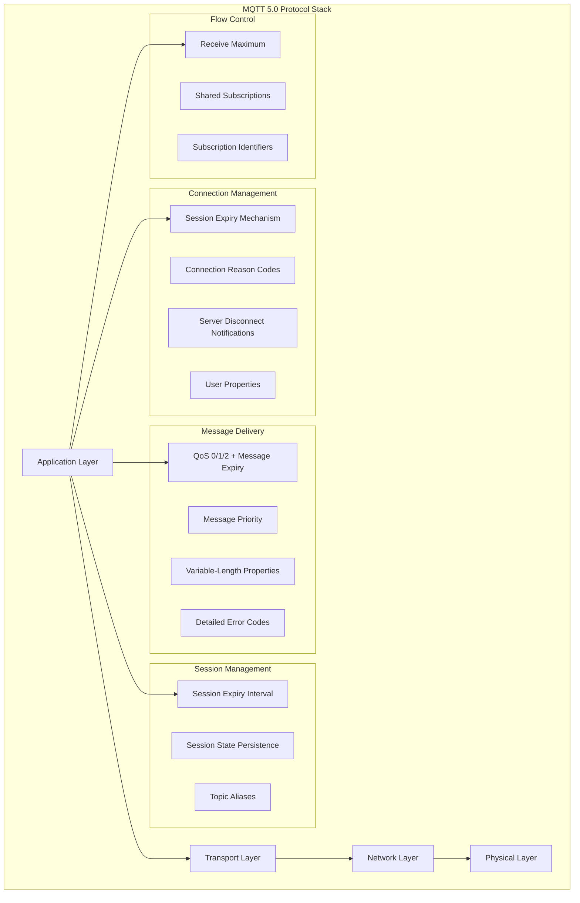

### Feature Comparison

| Feature            | MQTT 3.1.1       | MQTT 5.0                  | Advantage                          |
|--------------------|------------------|---------------------------|------------------------------------|
| **Connection Management** | Basic options     | Session expiry, reason codes | More precise connection state control |
| **Message Delivery**  | QoS 0/1/2        | QoS 0/1/2 + Message Expiry | Prevents expired message delivery    |
| **Topic Subscription**| Basic subscription | Topic aliases, subscription options | Reduces network overhead       |
| **User Properties**  | Not supported    | Supported                 | Richer metadata transfer             |
| **Error Handling**   | Basic error codes | Detailed codes + reason strings | More precise error diagnostics  |
| **Flow Control**     | Not supported    | Receive Maximum control   | Prevents client overload              |
| **Message Format**   | Fixed format     | Variable-length properties | More flexible message structure     |

### Weak-Network Comparison

| Scenario           | MQTT 3.1.1                                   | MQTT 5.0                                         | Recommendation                                                 |
|--------------------|----------------------------------------------|--------------------------------------------------|----------------------------------------------------------------|
| **Short Outage**   | Auto reconnect<br>⭐⭐                          | Session keep + auto reconnect<br>⭐⭐⭐⭐⭐             | MQTT 5.0 is better                                             |
| **Long Outage**    | Session loss<br>⭐⭐⭐                            | Session expiry mechanism<br>⭐⭐⭐⭐⭐                  | MQTT 5.0 is better                                             |
| **Network Switch** | Reconnect<br>⭐⭐⭐                                | Connection reuse<br>⭐⭐⭐⭐⭐                          | MQTT 5.0 is better                                             |
| **Message Loss**   | Possible loss<br>⭐⭐⭐                            | Message expiry protection<br>⭐⭐⭐⭐⭐                | MQTT 5.0 is better                                             |
| **Network Efficiency** | Full topic name transfer<br>Fixed format<br>No flow control<br>⭐⭐⭐ | Topic aliases<br>Variable properties<br>Receive Maximum control<br>⭐⭐⭐⭐⭐ | 60% less overhead<br>More flexible format<br>Prevents congestion<br>**MQTT 5.0 is better** |
| **Error Handling** | Basic codes<br>Simple auth failures<br>Basic protocol errors<br>⭐⭐ | Detailed codes + reason strings<br>Detailed auth reasons + retry hints<br>Detailed protocol errors + hints<br>⭐⭐⭐⭐⭐ | More precise fault localization<br>Better UX<br>Better debugging<br>**MQTT 5.0 is better** |
| **Resource Usage** | Basic message cache<br>Basic message handling<br>Fixed format transfer<br>⭐⭐⭐⭐⭐ | Session state + message queue<br>Dedup + property parsing<br>Optimized transfer but more protocol complexity<br>⭐⭐⭐ | +20-30% memory<br>+15-25% CPU<br>-40-60% bandwidth<br>**MQTT 3.1.1 is better** |
| **Compatibility**  | All MQTT servers<br>All MQTT clients<br>Mature toolchain<br>⭐⭐⭐⭐⭐ | Some servers<br>Requires 5.0 client<br>Toolchain maturing<br>⭐⭐⭐ | 3.1.1 has broader compatibility<br>5.0 is more powerful<br>3.1.1 ecosystem is more mature<br>**MQTT 3.1.1 is better** |

### Before/After Upgrade Comparison

#### Performance Improvement Comparison

| Performance Metric       | MQTT 3.1.1 | MQTT 5.0                  | Improvement | Description                              |
|--------------------------|------------|---------------------------|-------------|------------------------------------------|
| **Connection Recovery Time** | 30-60s      | 1-3s                      | **95%+**    | Fast reconnect after network recovery     |
| **Session Retention Time**   | None        | 2 hours                   | **100%**    | Session state preserved during outage     |
| **Message Delivery Reliability** | QoS 0/1/2 | QoS 0/1/2 + Message Expiry | **100%**    | Prevents expired message delivery         |
| **Network Switch Time**       | Reconnect   | Connection reuse          | **90%+**    | No need to re-establish connection         |
| **Error Diagnostic Precision**| Basic codes | Detailed codes + reason strings | **300%+** | More precise fault localization         |
| **Topic Transfer Efficiency** | Full topic  | Topic aliases              | **60%+**    | Reduces network overhead                  |
| **Flow Control Capability**   | None        | Receive Maximum control    | **100%**    | Prevents client overload                  |
| **Message Format Flexibility**| Fixed       | Variable-length properties | **200%+**   | More flexible message structure           |

#### Production Environment Comparison

| Production Scenario          | MQTT 3.1.1     | MQTT 5.0       | Production Value              |
|------------------------------|----------------|----------------|-------------------------------|
| **Long Outage Recovery**     | Reconnect + auth | Session keep + fast recovery | +95% service availability  |
| **Unstable Network**         | Frequent reconnects | Smart reconnect + session keep | Significantly better UX  |
| **Large-Scale Device Access**| Complex connection management | Flow control + session management | Better system stability  |
| **Message Reliability Needs**| Possible loss  | Message expiry + QoS guarantee | Data integrity assurance   |
| **Ops Fault Diagnosis**      | Limited error info | Detailed codes + reasons | +80% diagnostic efficiency |
| **Network Resource Optimization** | Fixed overhead | Topic aliases + flow control | +60% bandwidth utilization |

#### Technical Architecture Comparison

| Architecture Feature       | MQTT 3.1.1          | MQTT 5.0                 | Technical Advantage              |
|----------------------------|---------------------|--------------------------|----------------------------------|
| **Protocol Extensibility** | Limited             | User properties + variable format | Better protocol extensibility   |
| **Connection Management**  | Basic               | Session expiry + reason codes     | More precise connection control  |
| **Message Delivery**       | Basic QoS           | QoS + message expiry + priority   | Richer delivery mechanisms       |
| **Error Handling**         | Simple codes        | Detailed codes + reason strings   | Better error handling            |
| **Flow Control**           | No mechanism        | Receive Maximum + shared subscriptions | Smarter flow management     |
| **Session Management**     | Clean Session       | Session expiry + state persistence | More flexible session management |

#### Upgrade Benefits Summary

**Performance Improvements**:
- ✅ Connection recovery time reduced from 30-60s to 1-3s, a 95%+ improvement
- ✅ Session retention improved from 0 to 2 hours, achieving 100% session preservation
- ✅ Network switch time reduced by 90%+, supports connection reuse
- ✅ Error diagnostic precision improved by 300%+, supports detailed error codes

**Production Value**:
- ✅ Service availability up by 95%, supports long-outage fast recovery
- ✅ Significantly better UX, reduces impact of unstable networks
- ✅ Improved system stability, supports large-scale device access
- ✅ Data integrity guaranteed, prevents message loss

**Technical Advantages**:
- ✅ More extensible protocol, supports user properties and variable formats
- ✅ More precise connection control, supports session expiry and reason codes
- ✅ Richer message delivery mechanisms, supports message expiry and priority
- ✅ Better error handling, supports detailed error diagnostics


## 📎 🌐 Weak-Network Optimization

### Network Monitoring and Fast Recovery Principles

#### Network Monitoring Architecture

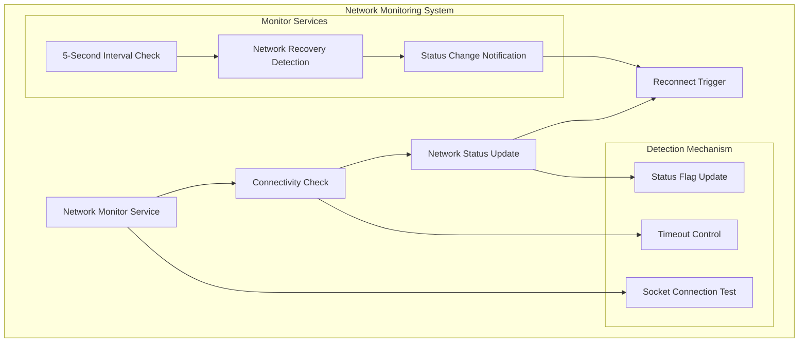

#### Fast Reconnect Mechanism

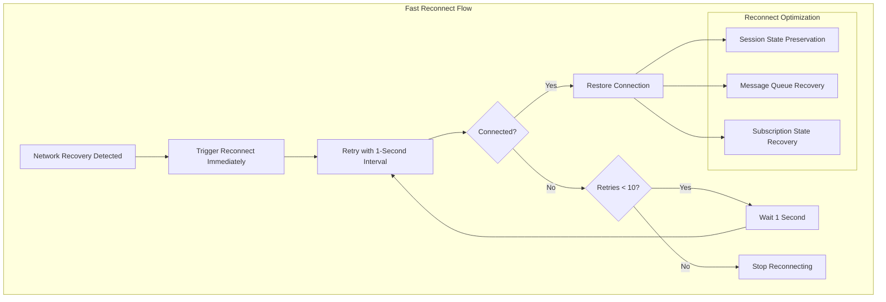

#### Monitor Service Architecture

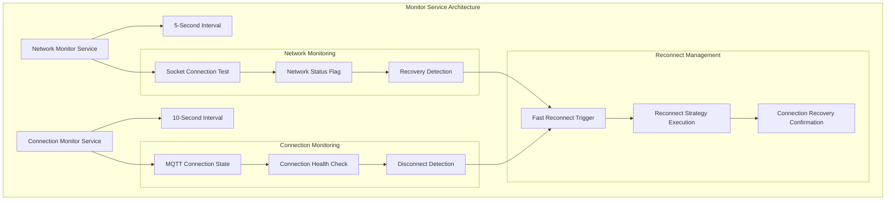

### Network Monitoring Mechanism

```java
// Network connectivity check
private boolean checkNetworkConnectivity() {
    try {
        String host = this.networkType == NetworkTypeEnum.PUBLIC ? 
            properties.getServer().getHost() : properties.getServer().getVpcHost();
        int port = this.networkType == NetworkTypeEnum.PUBLIC ? 
            properties.getServer().getPort() : properties.getServer().getVpcPort();
        
        try (Socket socket = new Socket()) {
            socket.connect(new InetSocketAddress(host, port), 3000);
            networkAvailable.set(true);
            return true;
        }
    } catch (IOException e) {
        networkAvailable.set(false);
        return false;
    }
}
```

### Fast Reconnect Mechanism

#### Automatic Retry Mechanism

The connection manager implements an **exponential backoff + random jitter** automatic retry mechanism, supporting infinite retry mode:

```java
// Fast reconnect configuration (read from configuration file)
fast-recovery:
  fast-reconnect-interval: 1000    # Base retry interval (milliseconds)
  max-fast-reconnect-attempts: 10  # Max retry attempts (0 or negative means infinite retry)

// Retry strategy notes:
// 1. Exponential backoff: retry interval grows exponentially (1x, 2x, 4x...), capped at 5 minutes
// 2. Random jitter: each retry interval adds 20%~100% random jitter to avoid simultaneous retries from multiple clients
// 3. Infinite retry mode: when max-fast-reconnect-attempts <= 0, retries indefinitely until successful
// 4. Finite retry mode: when max-fast-reconnect-attempts > 0, stops after the maximum count

// Retry interval formula:
// 1st retry: baseInterval × 2^0 × jitterFactor = 1000ms × 1 × (0.2~1.0) = 200~1000ms
// 2nd retry: baseInterval × 2^1 × jitterFactor = 1000ms × 2 × (0.2~1.0) = 400~2000ms
// 3rd retry: baseInterval × 2^2 × jitterFactor = 1000ms × 4 × (0.2~1.0) = 800~4000ms
// ...
// 11th retry and beyond: holds the maximum backoff (5 minutes)
```

#### Monitor Service Configuration

```java
// Monitor service configuration
private static final long NETWORK_CHECK_INTERVAL = 5L;         // Network check every 5 seconds
private static final long CONNECTION_MONITOR_INTERVAL = 10L;   // Connection monitor every 10 seconds
private static final int KEEP_ALIVE_INTERVAL = 30;            // Heartbeat every 30 seconds
private static final long SESSION_EXPIRY_INTERVAL = 7200L;     // 2-hour session preservation
```

### Monitor Service Configuration

```java
// Network monitor service - 5 second interval
networkMonitorService.scheduleWithFixedDelay(() -> {
    boolean networkOk = checkNetworkConnectivity();
    if (networkOk && !isConnected.get()) {
        fastReconnectWithRetry();
    }
}, 0, 5, TimeUnit.SECONDS);

// Connection monitor service - 10 second interval
connectionMonitorService.scheduleWithFixedDelay(() -> {
    if (mqttClient.getState() != MqttClientState.CONNECTED) {
        fastReconnectWithRetry();
    }
}, 0, 10, TimeUnit.SECONDS);

// Heartbeat service - 30 second interval
heartbeatService.scheduleWithFixedDelay(() -> {
    if (isConnected.get()) {
        sendKeepAlive();
    }
}, 0, 30, TimeUnit.SECONDS);
```

## 📎 💀 Will Message Support

### Will Message Overview

The Last Will and Testament (LWT) is an important MQTT feature. When a client disconnects abnormally, the broker automatically publishes a preconfigured will message so the cloud can detect the offline device in time.

#### Working Principle

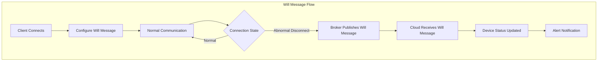

### `KDS` `Box` Business Value

- Real-time monitoring of KDS Box online status
- Immediate notification when a device goes offline abnormally
- Improved store operations efficiency

### Will Message Configuration Examples

#### Connection Configuration Snippet

```java
// Will message configuration in Mqtt5Config
@ConfigurationProperties(prefix = "platform.component.mqtt.mqtt5")
public class Mqtt5Config {
    
    /**
     * Whether to enable the will message
     */
    private boolean enableWillMessage = true;
    
    /**
     * Will message topic
     */
    private String willTopic = "device/status/{clientId}";
    
    /**
     * Will message content
     */
    private String willMessage = "Abnormal disconnect";
    
    /**
     * App version reported with the will message
     */
    private String appVersion = "";
    
    /**
     * Store ID (optional)
     */
    private String storeId = "";
}
```

#### Will Message Construction

```java
// Build will message content
private String buildWillMessage() {
    try {
        Map<String, Object> willMessage = new HashMap<>();
        willMessage.put("deviceId", clientId);
        willMessage.put("status", "offline");
        willMessage.put("timestamp", System.currentTimeMillis());
        willMessage.put("reason", "abnormal_disconnect");
        willMessage.put("networkType", this.networkType.name());
        willMessage.put("groupId", this.properties.getGroupId());
        willMessage.put("deviceType", "KDS_BOX");
        
        // Add optional app version and store ID
        if (StringUtils.isNotBlank(properties.getMqtt5().getAppVersion())) {
            willMessage.put("appVersion", properties.getMqtt5().getAppVersion());
        }
        if (StringUtils.isNotBlank(properties.getMqtt5().getStoreId())) {
            willMessage.put("storeId", properties.getMqtt5().getStoreId());
        }
        
        return JsonUtils.getInstance().serialize(willMessage);
    } catch (Exception e) {
        log.error("Failed to build will message: {}", e.getMessage());
        return "{\"deviceId\":\"%s\",\"status\":\"offline\"}".formatted(clientId);
    }
}
```

### Cloud Processing Recommendations

- Subscribe to the `device/status/+` topic, parse will messages, update device status promptly, and trigger alerts.
- Use the `storeId` field for store-level status management
- Use the `appVersion` field for version compatibility checks

## 🚀 Quick Start Guide

### 1) Add Dependency

```xml
<dependency>
    <groupId>com.richie</groupId>
    <artifactId>atlas-richie-component-mqtt</artifactId>
    <version>${atlas.richie.version}</version>
</dependency>
```

### 2) Configuration File

```yaml
platform:
  component:
    mqtt:
      enable: true
      mqtt-version: mqtt_5_0  # Use MQTT 5.0
      client-type: CLIENT
      parent-topic: /atlas_richie
      group-id: your-group-id
      heartbeat-interval: 30  # Heartbeat every 30 seconds
      server:
        host: your-mqtt-server.com
        port: 1883
        vpc-host: your-vpc-server.com
        vpc-port: 1883
        username: your-username
        password: your-password
        default-network-type: PUBLIC
        qos: 1
        time-to-wait: 10000
      
      # MQTT 5.0 specific configuration
      mqtt5:
        client-type: "pos_terminal"
        clean-start: false
        session-expiry-interval: 1800  # 30-minute session expiry
        message-expiry-interval: 1800  # 30-minute message expiry
        connection-timeout: 30
        enable-will-message: true
        will-topic: "device/status/{clientId}"
        will-message: "Abnormal disconnect"
        app-version: "1.0.0"
        store-id: "STORE_001"
        enable-user-properties: true
        enable-message-priority: false
        enable-message-delay: false
        message-delay-interval: 0
      
      # Fast recovery configuration
      fast-recovery:
        enabled: true                    # Enable fast recovery mode
        network-check-interval: 5        # Network check interval (seconds)
        connection-monitor-interval: 10  # Connection monitor interval (seconds)
        fast-reconnect-interval: 1000    # Fast reconnect interval (ms)
        max-fast-reconnect-attempts: 10  # Max fast reconnect attempts
        network-connect-timeout: 3000    # Network connect timeout (ms)
        keep-alive-interval: 30         # Heartbeat interval (seconds)
        enable-network-monitor: true     # Enable network monitoring
        enable-connection-monitor: true  # Enable connection monitoring
        enable-fast-reconnect: true      # Enable fast reconnect
        reconnect-on-network-recovery: true  # Reconnect immediately after network recovery
        reconnect-on-disconnect: true    # Reconnect immediately after disconnect
```

### 3) Basic Usage

```java
@Autowired
private HiveMqMqttClient mqttClient;

// Publish a message
mqttClient.doPublish("/test/topic", "Hello MQTT 5.0".getBytes());

// Publish a retained message
mqttClient.doPublish("/test/topic", "Retained message".getBytes(), true);

// Subscribe to messages
mqttClient.registerConsumer("/test/topic", message -> {
    System.out.println("Received message: " + new String(message.getPayload()));
    System.out.println("Message topic: " + message.getTopic());
    System.out.println("Message QoS: " + message.getQos());
});
```

### 4) Event Subscription

```java
// Subscribe to connection state events
MqttEventBus.connectionStateFlow
    .filter(event -> event.getState() == ConnectionState.CONNECTED)
    .subscribe(event -> {
        log.info("MQTT connection established, network type: {}", event.getNetworkType());
    });

// Subscribe to network quality events
MqttEventBus.networkQualityFlow
    .filter(event -> event.getStats().getAverageLatency() > 100)
    .subscribe(event -> {
        log.warn("High network latency: {}ms", event.getStats().getAverageLatency());
    });

// Subscribe to heartbeat events
MqttEventBus.heartbeatFlow
    .subscribe(event -> {
        log.debug("Heartbeat status: {}, latency: {}ms", event.getStatus(), event.getLatency());
    });
```

### 5) Manual Initialization

```java
// Get configuration from a service interface
MqttServerInfo serverInfo = getServerConfigFromApi();
mqttClient.initialClient(serverInfo);

// Dynamically switch server
mqttClient.changeServer(NetworkTypeEnum.VPC, "new-host", 1883);

// Switch network type
mqttClient.changeServer(NetworkTypeEnum.VPC);
```

### 6) Advanced Configuration Examples

#### Production Environment Configuration
```yaml
platform:
  component:
    mqtt:
      fast-recovery:
        enabled: true
        network-check-interval: 3        # 3-second network check
        connection-monitor-interval: 5   # 5-second connection monitor
        fast-reconnect-interval: 500     # 500ms fast reconnect
        max-fast-reconnect-attempts: 15 # 15 reconnect attempts
        network-connect-timeout: 5000   # 5-second connect timeout
        keep-alive-interval: 20         # 20-second heartbeat interval
```

#### Development Environment Configuration
```yaml
platform:
  component:
    mqtt:
      fast-recovery:
        enabled: true
        network-check-interval: 10       # 10-second network check
        connection-monitor-interval: 20  # 20-second connection monitor
        fast-reconnect-interval: 2000    # 2-second fast reconnect
        max-fast-reconnect-attempts: 5  # 5 reconnect attempts
        network-connect-timeout: 10000  # 10-second connect timeout
        keep-alive-interval: 60         # 60-second heartbeat interval
```

#### Weak-Network Environment Configuration
```yaml
platform:
  component:
    mqtt:
      fast-recovery:
        enabled: true
        network-check-interval: 2        # 2-second network check
        connection-monitor-interval: 3   # 3-second connection monitor
        fast-reconnect-interval: 200     # 200ms fast reconnect
        max-fast-reconnect-attempts: 20 # 20 reconnect attempts
        network-connect-timeout: 8000   # 8-second connect timeout
        keep-alive-interval: 15         # 15-second heartbeat interval
        reconnect-on-network-recovery: true
        reconnect-on-disconnect: true
```

## 📚 Interface Reference

### Event Subscription and Handling

#### Connection State Event Handling
```java
@Component
public class ConnectionEventHandler {
    
    @PostConstruct
    public void init() {
        // Subscribe to connection state events
        MqttEventBus.connectionStateFlow
            .filter(event -> event.getState() == ConnectionState.CONNECTED)
            .subscribe(this::handleConnected);
            
        MqttEventBus.connectionStateFlow
            .filter(event -> event.getState() == ConnectionState.DISCONNECTED)
            .subscribe(this::handleDisconnected);
            
        MqttEventBus.connectionStateFlow
            .filter(event -> event.getState() == ConnectionState.ABNORMAL_DISCONNECT)
            .subscribe(this::handleAbnormalDisconnect);
    }
    
    private void handleConnected(ConnectionStateEvent event) {
        log.info("MQTT connection established - client ID: {}, network type: {}, time: {}", 
            event.getClientId(), event.getNetworkType(), event.getTimestamp());
        
        // Re-register all listeners after successful connection
        reRegisterAllListeners();
    }
    
    private void handleDisconnected(ConnectionStateEvent event) {
        log.info("MQTT connection closed - client ID: {}, reason: {}, time: {}", 
            event.getClientId(), event.getReason(), event.getTimestamp());
        
        // Update UI status
        updateConnectionStatus(false);
    }
    
    private void handleAbnormalDisconnect(ConnectionStateEvent event) {
        log.warn("MQTT connection abnormal disconnect - client ID: {}, reason: {}, time: {}", 
            event.getClientId(), event.getReason(), event.getTimestamp());
        
        // Trigger alert
        triggerConnectionAlert(event);
    }
}
```

#### Network Quality Event Handling
```java
@Component
public class NetworkQualityHandler {
    
    @PostConstruct
    public void init() {
        // Subscribe to network quality events
        MqttEventBus.networkQualityFlow
            .filter(event -> event.getStats().getAverageLatency() > 100)
            .subscribe(this::handleHighLatency);
            
        MqttEventBus.networkQualityFlow
            .filter(event -> event.getStats().getPacketLossRate() > 0.1)
            .subscribe(this::handleHighPacketLoss);
    }
    
    private void handleHighLatency(NetworkQualityEvent event) {
        NetworkQualityStats stats = event.getStats();
        log.warn("High network latency - avg latency: {}ms, max latency: {}ms, time: {}", 
            stats.getAverageLatency(), stats.getMaxLatency(), event.getTimestamp());
        
        // Consider switching to VPC
        if (stats.getAverageLatency() > 200) {
            considerNetworkSwitch();
        }
    }
    
    private void handleHighPacketLoss(NetworkQualityEvent event) {
        NetworkQualityStats stats = event.getStats();
        log.error("High packet loss - loss rate: {}%, time: {}", 
            stats.getPacketLossRate() * 100, event.getTimestamp());
        
        // Trigger network quality alert
        triggerNetworkQualityAlert(event);
    }
}
```

#### Heartbeat Event Handling
```java
@Component
public class HeartbeatHandler {
    
    @PostConstruct
    public void init() {
        // Subscribe to heartbeat events
        MqttEventBus.heartbeatFlow
            .filter(event -> event.getStatus() == HeartbeatStatus.FAILED)
            .subscribe(this::handleHeartbeatFailure);
            
        MqttEventBus.heartbeatFlow
            .filter(event -> event.getLatency() > 1000)
            .subscribe(this::handleHighHeartbeatLatency);
    }
    
    private void handleHeartbeatFailure(HeartbeatEvent event) {
        log.warn("Heartbeat failed - latency: {}ms, time: {}", 
            event.getLatency(), event.getTimestamp());
        
        // Check connection health
        checkConnectionHealth();
    }
    
    private void handleHighHeartbeatLatency(HeartbeatEvent event) {
        log.warn("High heartbeat latency - latency: {}ms, time: {}", 
            event.getLatency(), event.getTimestamp());
        
        // Record performance metrics
        recordPerformanceMetrics(event);
    }
}
```

### Message Publish and Subscribe Flow Diagram

#### Publisher Flow

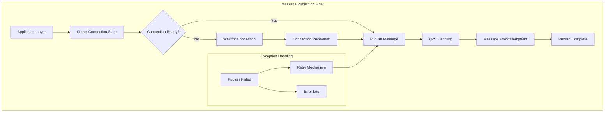

#### Subscriber Flow

```mermaid
graph TB
    subgraph "Message Subscription Flow"
        A[Register Listener] --> B[Subscribe Topic]
        B --> C[Establish Connection]
        C --> D[Subscription Confirmation]
        D --> E[Wait for Message]
        E --> F[Receive Message]
        F --> G[Message Deduplication]
        G --> H[Message Parsing]
        H --> I[Callback Handling]
        I --> J[Business Processing]
        
        subgraph "Message Handling"
            K[Message Filtering]
            L[Format Conversion]
            M[Error Handling]
        end
        
        F --> K
        K --> L
        L --> M
        M --> G
    end
```

### Public Interface Methods

#### 1. `initialClient(MqttServerInfo serverInfo)`
**Purpose**: Manually initialize the MQTT client
**Parameters**: An object containing complete server configuration
**Functionality**: 
- Sets server addresses (public/VPC)
- Configures authentication (username/password)
- Sets device ID and group ID
- Configures network type and server type
- Automatically starts the connection service

**Usage scenarios**: 
- When the client starts and fetches configuration from a service interface
- When configuration changes and re-initialization is needed
- When the network switches and reconfiguration is required

**Example**:
```java
@Service
public class MqttConfigService {
    
    @Autowired
    private HiveMqMqttClient mqttClient;
    
    public void updateMqttConfig() {
        // Fetch latest configuration from the config service
        MqttServerInfo serverInfo = getLatestServerConfig();
        
        // Manually initialize the client
        mqttClient.initialClient(serverInfo);
        
        log.info("MQTT client configuration updated");
    }
    
    private MqttServerInfo getLatestServerConfig() {
        // Call config service API to get the latest configuration
        return configApiService.getMqttServerConfig();
    }
}
```

#### 2. `initialClient(MqttServerInfo serverInfo, boolean enable)`
**Purpose**: Manual initialization with an enable flag
**Parameters**: Server configuration + enable flag
**Functionality**: Can control whether the MQTT connection is enabled immediately

**Usage scenarios**:
- Scenarios requiring delayed startup
- Decide whether to enable after configuration validation

**Example**:
```java
@Service
public class MqttInitializationService {
    
    @Autowired
    private HiveMqMqttClient mqttClient;
    
    public void initializeWithValidation(MqttServerInfo serverInfo) {
        // Validate configuration
        if (validateServerConfig(serverInfo)) {
            // Config is valid, enable connection
            mqttClient.initialClient(serverInfo, true);
            log.info("MQTT client enabled");
        } else {
            // Config invalid, do not enable connection
            mqttClient.initialClient(serverInfo, false);
            log.warn("MQTT client configuration validation failed, connection not enabled");
        }
    }
    
    private boolean validateServerConfig(MqttServerInfo serverInfo) {
        // Configuration validation logic
        return serverInfo != null && 
               StringUtils.isNotBlank(serverInfo.getHost()) &&
               serverInfo.getPort() > 0;
    }
}
```

#### 3. `changeServer(NetworkTypeEnum networkType, String host, int port)`
**Purpose**: Dynamically switch the server address
**Parameters**: Network type + new host + port
**Functionality**: Swap the MQTT server at runtime

**Usage scenarios**:
- Server address changes
- Load balancing
- Failover

**Example**:
```java
@Service
public class ServerSwitchService {
    
    @Autowired
    private HiveMqMqttClient mqttClient;
    
    public void switchToBackupServer() {
        // Switch to backup server
        mqttClient.changeServer(NetworkTypeEnum.PUBLIC, "backup.example.com", 1883);
        log.info("Switched to backup server");
    }
    
    public void switchToLoadBalancedServer(String host, int port) {
        // Switch to load-balanced server
        mqttClient.changeServer(NetworkTypeEnum.VPC, host, port);
        log.info("Switched to load-balanced server: {}:{}", host, port);
    }
}
```

#### 4. `changeServer(NetworkTypeEnum networkType)`
**Purpose**: Switch the network type
**Parameters**: Target network type
**Functionality**: Switch between already-configured servers

**Usage scenarios**:
- Public/VPC network switching
- Network quality optimization

**Example**:
```java
@Service
public class NetworkOptimizationService {
    
    @Autowired
    private HiveMqMqttClient mqttClient;
    
    public void optimizeNetworkConnection() {
        // Get current network quality
        NetworkQualityStats stats = getCurrentNetworkQuality();
        
        if (stats.getAverageLatency() > 200) {
            // High latency, switch to VPC
            mqttClient.changeServer(NetworkTypeEnum.VPC);
            log.info("High latency, switched to VPC network");
        } else if (stats.getAverageLatency() < 50) {
            // Good network quality, switch to public
            mqttClient.changeServer(NetworkTypeEnum.PUBLIC);
            log.info("Good network quality, switched to public network");
        }
    }
    
    private NetworkQualityStats getCurrentNetworkQuality() {
        // Get current network quality statistics
        return networkQualityService.getCurrentStats();
    }
}
```

#### 5. `doPublish(String topic, byte[] value)`
**Purpose**: Publish a message
**Parameters**: Topic + message content
**Functionality**: Publish a message to the specified topic

**Usage scenarios**:
- Business message publishing
- Status reporting
- Command push

**Example**:
```java
@Service
public class MessagePublishService {
    
    @Autowired
    private HiveMqMqttClient mqttClient;
    
    public void publishDeviceStatus(String deviceId, DeviceStatus status) {
        String topic = String.format("/device/%s/status", deviceId);
        String message = JsonUtils.toJson(status);
        
        try {
            mqttClient.doPublish(topic, message.getBytes());
            log.info("Device status published - device ID: {}, topic: {}", deviceId, topic);
        } catch (Exception e) {
            log.error("Failed to publish device status - device ID: {}, error: {}", deviceId, e.getMessage());
        }
    }
    
    public void publishCommand(String deviceId, DeviceCommand command) {
        String topic = String.format("/device/%s/command", deviceId);
        String message = JsonUtils.toJson(command);
        
        try {
            mqttClient.doPublish(topic, message.getBytes());
            log.info("Device command published - device ID: {}, topic: {}", deviceId, topic);
        } catch (Exception e) {
            log.error("Failed to publish device command - device ID: {}, error: {}", deviceId, e.getMessage());
        }
    }
}
```

#### 6. `doPublish(String topic, byte[] value, boolean retained)`
**Purpose**: Publish a retained message
**Parameters**: Topic + message content + retain flag
**Functionality**: Publishes a message that the server retains

**Usage scenarios**:
- Device status retention
- Configuration retention
- Last known state

**Example**:
```java
@Service
public class RetainedMessageService {
    
    @Autowired
    private HiveMqMqttClient mqttClient;
    
    public void publishDeviceLastKnownStatus(String deviceId, DeviceStatus status) {
        String topic = String.format("/device/%s/last-known-status", deviceId);
        String message = JsonUtils.toJson(status);
        
        // Publish retained message; new subscribers get the last state immediately
        mqttClient.doPublish(topic, message.getBytes(), true);
        log.info("Last device status retained - device ID: {}, topic: {}", deviceId, topic);
    }
    
    public void publishConfiguration(String configId, Configuration config) {
        String topic = String.format("/config/%s", configId);
        String message = JsonUtils.toJson(config);
        
        // Publish retained message; new subscribers get the configuration immediately
        mqttClient.doPublish(topic, message.getBytes(), true);
        log.info("Configuration retained - config ID: {}, topic: {}", configId, topic);
    }
}
```

#### 7. `registerConsumer(String topic, Consumer<ConsumerMessage> callback)`
**Purpose**: Register a normal subscription message listener
**Parameters**: Topic + callback function
**Functionality**: Subscribes to a topic and processes incoming messages (supports wildcards: `+` single-level, `#` multi-level)

**Usage scenarios**:
- Business message processing
- Command reception
- Status monitoring

**Example**:
```java
@Component
public class MessageConsumerService {
    
    @Autowired
    private HiveMqMqttClient mqttClient;
    
    @PostConstruct
    public void init() {
        // Register device command listener (uses single-level wildcard +)
        mqttClient.registerConsumer("/device/+/command", this::handleDeviceCommand);
        
        // Register configuration update listener
        mqttClient.registerConsumer("/config/+/update", this::handleConfigUpdate);
        
        // Register system notification listener
        mqttClient.registerConsumer("/system/notification", this::handleSystemNotification);
    }
    
    private void handleDeviceCommand(ConsumerMessage message) {
        try {
            String topic = message.getTopic();
            String payload = new String(message.getPayload());
            
            // Parse device command
            DeviceCommand command = JsonUtils.fromJson(payload, DeviceCommand.class);
            
            // Process device command
            processDeviceCommand(command);
            
            log.info("Device command processed - topic: {}, command: {}", topic, command);
        } catch (Exception e) {
            log.error("Failed to handle device command - topic: {}, error: {}", message.getTopic(), e.getMessage());
        }
    }
    
    private void handleConfigUpdate(ConsumerMessage message) {
        try {
            String topic = message.getTopic();
            String payload = new String(message.getPayload());
            
            // Parse configuration update
            Configuration config = JsonUtils.fromJson(payload, Configuration.class);
            
            // Apply configuration update
            applyConfigurationUpdate(config);
            
            log.info("Configuration update processed - topic: {}, config: {}", topic, config);
        } catch (Exception e) {
            log.error("Failed to handle configuration update - topic: {}, error: {}", message.getTopic(), e.getMessage());
        }
    }
    
    private void handleSystemNotification(ConsumerMessage message) {
        try {
            String payload = new String(message.getPayload());
            
            // Parse system notification
            SystemNotification notification = JsonUtils.fromJson(payload, SystemNotification.class);
            
            // Process system notification
            processSystemNotification(notification);
            
            log.info("System notification processed - notification: {}", notification);
        } catch (Exception e) {
            log.error("Failed to handle system notification - error: {}", e.getMessage());
        }
    }
}
```

#### 7.1. `registerSharedConsumer(String sharedTopic, Consumer<ConsumerMessage> callback)`
**Purpose**: Register a shared subscription message listener (MQTT 5.0 feature)
**Parameters**: Full shared subscription topic (format: `$share/{groupId}/businessTopic`) + callback function
**Functionality**: Subscribes to a shared topic and processes incoming messages; supports load balancing and message distribution

**Shared subscription format requirements**:
- Must start with `$share/`
- Format: `$share/{groupId}/businessTopic`
- Business topic must include the `/+/` wildcard (to match unique identifiers)
- Example: `$share/GID_AGENT_DEVICE/device/+/status`

**Usage scenarios**:
- Multi-client load balancing
- Scenarios requiring message distribution
- High-availability message processing

**Example**:
```java
@Component
public class SharedSubscriptionService {
    
    @Autowired
    private HiveMqMqttClient mqttClient;
    
    @PostConstruct
    public void init() {
        // Register shared subscription listener (load balancing)
        // Format: $share/{groupId}/businessTopic
        String sharedTopic = "$share/GID_AGENT_DEVICE/device/+/status";
        mqttClient.registerSharedConsumer(sharedTopic, this::handleDeviceStatus);
        
        // Register another shared subscription
        String sharedTopic2 = "$share/GID_AGENT_COMMAND/device/+/command";
        mqttClient.registerSharedConsumer(sharedTopic2, this::handleDeviceCommand);
    }
    
    private void handleDeviceStatus(ConsumerMessage message) {
        // Handle device status message
        // Note: the actual received topic is a specific value (e.g. device/123/status);
        // the component automatically matches via wildcard
        log.info("Received device status message: {}", message.getTopic());
    }
    
    private void handleDeviceCommand(ConsumerMessage message) {
        // Handle device command message
        log.info("Received device command message: {}", message.getTopic());
    }
}
```

**Notes**:
- Shared subscriptions are an MQTT 5.0 feature; MQTT 3.1.1 does not support them
- The full shared subscription topic (including `$share/{groupId}` prefix) must be passed in
- The business topic must contain the `/+/` wildcard
- When a message arrives, the actual topic is a specific value; the component matches the corresponding callback via wildcard

#### 8. `unregisterConsumer(String topic)`
**Purpose**: Unregister a normal subscription message listener
**Parameters**: Topic
**Functionality**: Cancels the subscription for the specified topic

**Usage scenarios**:
- Dynamic subscription cancellation
- Resource cleanup
- Permission changes

**Example**:
```java
@Service
public class ConsumerManagementService {
    
    @Autowired
    private HiveMqMqttClient mqttClient;
    
    private final Set<String> activeSubscriptions = new ConcurrentHashSet<>();
    
    public void addSubscription(String topic, Consumer<ConsumerMessage> callback) {
        mqttClient.registerConsumer(topic, callback);
        activeSubscriptions.add(topic);
        log.info("Subscription added - topic: {}", topic);
    }
    
    public void removeSubscription(String topic) {
        mqttClient.unregisterConsumer(topic);
        activeSubscriptions.remove(topic);
        log.info("Subscription removed - topic: {}", topic);
    }
    
    public void removeAllSubscriptions() {
        for (String topic : activeSubscriptions) {
            mqttClient.unregisterConsumer(topic);
        }
        activeSubscriptions.clear();
        log.info("All subscriptions removed");
    }
    
    public Set<String> getActiveSubscriptions() {
        return new HashSet<>(activeSubscriptions);
    }
}
```

#### 8.1. `unregisterSharedConsumer(String sharedTopic)`
**Purpose**: Unregister a shared subscription message listener
**Parameters**: Full shared subscription topic (format: `$share/{groupId}/businessTopic`)
**Functionality**: Cancels the shared subscription for the specified topic

**Usage scenarios**:
- Dynamic shared subscription cancellation
- Resource cleanup
- Load balancing adjustments

**Example**:
```java
@Service
public class SharedSubscriptionManagementService {
    
    @Autowired
    private HiveMqMqttClient mqttClient;
    
    public void removeSharedSubscription(String groupId, String businessTopic) {
        String sharedTopic = "$share/" + groupId + "/" + businessTopic;
        mqttClient.unregisterSharedConsumer(sharedTopic);
        log.info("Shared subscription removed - topic: {}", sharedTopic);
    }
}
```

#### 9. `reinitialize()`
**Purpose**: Reinitialize the client
**Functionality**: Re-establishes the MQTT connection

**Usage scenarios**:
- Recover from connection anomalies
- Major configuration changes
- Troubleshooting

**Example**:
```java
@Service
public class ClientRecoveryService {
    
    @Autowired
    private HiveMqMqttClient mqttClient;
    
    public void recoverClient() {
        try {
            log.info("Starting MQTT client reinitialization");
            
            // Reinitialize the client
            mqttClient.reinitialize();
            
            log.info("MQTT client reinitialization complete");
        } catch (Exception e) {
            log.error("MQTT client reinitialization failed: {}", e.getMessage());
            
            // Retry after a delay
            scheduleRetry();
        }
    }
    
    private void scheduleRetry() {
        // Retry after 5 seconds
        CompletableFuture.delayedExecutor(5, TimeUnit.SECONDS)
            .execute(this::recoverClient);
    }
}
```

### Automatic Handling Methods

#### 1. Network Monitoring
**Trigger**: Automatically every 5 seconds
**Functionality**: 
- Checks network connectivity
- Auto-reconnects on network recovery
- Updates the network status flag

**Monitoring logic**:
```java
// Network monitor service - 5 second interval
networkMonitorService.scheduleWithFixedDelay(() -> {
    boolean networkOk = checkNetworkConnectivity();
    if (networkOk && !isConnected.get()) {
        fastReconnectWithRetry();
    }
}, 0, 5, TimeUnit.SECONDS);
```

#### 2. Connection Monitoring
**Trigger**: Automatically every 10 seconds
**Functionality**:
- Monitors the MQTT connection state
- Auto-reconnects on disconnection
- Maintains the connection state flag

**Monitoring logic**:
```java
// Connection monitor service - 10 second interval
connectionMonitorService.scheduleWithFixedDelay(() -> {
    if (mqttClient.getState() != MqttClientState.CONNECTED) {
        fastReconnectWithRetry();
    }
}, 0, 10, TimeUnit.SECONDS);
```

#### 3. Fast Reconnect
**Trigger**: When the network recovers or the connection drops
**Functionality**:
- Automatic retry mechanism (exponential backoff + random jitter)
- Supports infinite retry mode (configure `max-fast-reconnect-attempts <= 0`)
- Supports finite retry mode (configure `max-fast-reconnect-attempts > 0`)
- Preserves session state

**Reconnect logic**:
```java
// Fast reconnect configuration (read from configuration file)
fast-recovery:
  fast-reconnect-interval: 1000    # Base retry interval (milliseconds)
  max-fast-reconnect-attempts: 10  # Max retry attempts (0 or negative means infinite retry)

// Retry strategy:
// 1. Exponential backoff: retry interval grows exponentially (1x, 2x, 4x...), capped at 5 minutes
// 2. Random jitter: each retry interval adds 20%~100% random jitter to avoid simultaneous retries from multiple clients
// 3. Thread safety: uses synchronized locks and atomic variables to ensure thread safety during retry
// 4. Interrupt support: supports thread interrupt; stops retry immediately on interrupt
```

#### 4. Heartbeat Maintenance
**Trigger**: Scheduled task
**Functionality**:
- Sends heartbeat messages
- Detects connection health
- Maintains connection liveness

**Heartbeat logic**:
```java
// Heartbeat service - 30 second interval
heartbeatService.scheduleWithFixedDelay(() -> {
    if (isConnected.get()) {
        sendKeepAlive();
    }
}, 0, 30, TimeUnit.SECONDS);
```

#### 5. Message Handling
**Trigger**: When an MQTT message is received
**Functionality**:
- Event bus-based message dispatch
- Supports automatic matching for normal and shared subscriptions
- Supports wildcard matching (`+` single-level, `#` multi-level)
- Message format conversion
- Invokes registered callback functions
- Error handling and logging

**Handling logic**:
```java
// Message dispatch flow (event bus based)
// 1. Subscribe to the message event stream on init (only once, to prevent duplicate subscriptions)
private void subscribeMessageFlowIfNecessary() {
    if (!messageFlowSubscribed.compareAndSet(false, true)) {
        return; // Already subscribed, skip
    }
    
    MqttEventBus.messageFlow.subscribe(
        this::dispatchMessageSafely,
        error -> log.error("Error subscribing to MQTT message event stream", error)
    );
}

// 2. Message dispatch logic
private void dispatchMessage(Mqtt5Publish publish) {
    String rawTopic = publish.getTopic().toString();
    
    // Try normal subscription first (exact match)
    Consumer<ConsumerMessage> callback = LISTENER_CACHE.get(rawTopic);
    
    // If no normal subscription matches, try shared subscription (wildcard match)
    if (callback == null) {
        callback = findSharedSubscriptionCallback(rawTopic);
    }
    
    if (callback == null) {
        log.debug("Received MQTT message but no matching callback found, rawTopic={}", rawTopic);
        return;
    }
    
    // Build ConsumerMessage and invoke callback
    ConsumerMessage consumerMessage = new ConsumerMessage(payload)
        .setTopic(rawTopic)
        .setQos(publish.getQos().getCode())
        .setRetained(publish.isRetain())
        .setProperties(extractUserProperties(publish))
        .setTimestamp(System.currentTimeMillis());
    
    callback.accept(consumerMessage);
}

// 3. Shared subscription wildcard matching
private Consumer<ConsumerMessage> findSharedSubscriptionCallback(String actualTopic) {
    for (Map.Entry<String, Consumer<ConsumerMessage>> entry : SHARED_LISTENER_CACHE.entrySet()) {
        String sharedTopic = entry.getKey();
        // Extract business topic portion (remove $share/{groupId}/ prefix)
        String businessTopic = extractBusinessTopic(sharedTopic);
        if (businessTopic == null) {
            continue;
        }
        // Wildcard match: businessTopic (e.g. device/+/status) should match actualTopic (e.g. device/123/status)
        if (matchesTopicPattern(businessTopic, actualTopic)) {
            return entry.getValue();
        }
    }
    return null;
}
```

## 🔧 Core Capabilities

### Scenario 1 — Device Status Reporting

#### Device Status Reporting Architecture

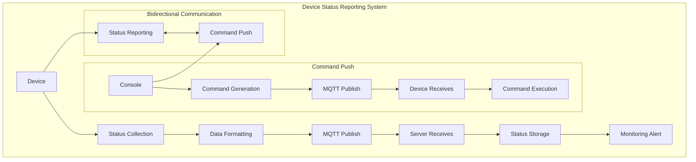

#### Complete Implementation

```java
@Service
public class DeviceStatusService {
    
    @Autowired
    private HiveMqMqttClient mqttClient;
    
    private final Map<String, DeviceStatus> deviceStatusCache = new ConcurrentHashMap<>();
    
    @PostConstruct
    public void init() {
        // Register device command listener
        mqttClient.registerConsumer("/device/+/command", this::handleDeviceCommand);
        
        // Register device configuration update listener
        mqttClient.registerConsumer("/device/+/config", this::handleDeviceConfig);
    }
    
    /**
     * Report device status
     */
    public void reportDeviceStatus(String deviceId, DeviceStatus status) {
        try {
            // Update local cache
            deviceStatusCache.put(deviceId, status);
            
            // Build status message
            DeviceStatusMessage statusMessage = DeviceStatusMessage.builder()
                .deviceId(deviceId)
                .status(status)
                .timestamp(System.currentTimeMillis())
                .version("1.0.0")
                .build();
            
            // Publish status message
            String topic = String.format("/device/%s/status", deviceId);
            String message = JsonUtils.toJson(statusMessage);
            
            mqttClient.doPublish(topic, message.getBytes());
            
            log.info("Device status reported - device ID: {}, status: {}", deviceId, status);
            
        } catch (Exception e) {
            log.error("Failed to report device status - device ID: {}, error: {}", deviceId, e.getMessage());
            throw new DeviceStatusException("Failed to report device status", e);
        }
    }
    
    /**
     * Report device heartbeat
     */
    public void reportDeviceHeartbeat(String deviceId) {
        try {
            DeviceHeartbeatMessage heartbeatMessage = DeviceHeartbeatMessage.builder()
                .deviceId(deviceId)
                .timestamp(System.currentTimeMillis())
                .uptime(getDeviceUptime(deviceId))
                .build();
            
            String topic = String.format("/device/%s/heartbeat", deviceId);
            String message = JsonUtils.toJson(heartbeatMessage);
            
            mqttClient.doPublish(topic, message.getBytes());
            
            log.debug("Device heartbeat reported - device ID: {}", deviceId);
            
        } catch (Exception e) {
            log.error("Failed to report device heartbeat - device ID: {}, error: {}", deviceId, e.getMessage());
        }
    }
    
    /**
     * Handle device command
     */
    private void handleDeviceCommand(ConsumerMessage message) {
        try {
            String topic = message.getTopic();
            String payload = new String(message.getPayload());
            
            // Parse device command
            DeviceCommand command = JsonUtils.fromJson(payload, DeviceCommand.class);
            
            // Validate command
            if (validateDeviceCommand(command)) {
                // Execute device command
                executeDeviceCommand(command);
                
                // Send command ack
                sendCommandAck(command.getDeviceId(), command.getCommandId(), true);
                
                log.info("Device command executed - device ID: {}, command: {}", 
                    command.getDeviceId(), command.getCommandType());
            } else {
                // Send command rejection
                sendCommandAck(command.getDeviceId(), command.getCommandId(), false);
                
                log.warn("Device command validation failed - device ID: {}, command: {}", 
                    command.getDeviceId(), command.getCommandType());
            }
            
        } catch (Exception e) {
            log.error("Failed to handle device command - topic: {}, error: {}", message.getTopic(), e.getMessage());
        }
    }
    
    /**
     * Handle device configuration update
     */
    private void handleDeviceConfig(ConsumerMessage message) {
        try {
            String topic = message.getTopic();
            String payload = new String(message.getPayload());
            
            // Parse device configuration
            DeviceConfig config = JsonUtils.fromJson(payload, DeviceConfig.class);
            
            // Apply device configuration
            applyDeviceConfig(config);
            
            // Send configuration ack
            sendConfigAck(config.getDeviceId(), config.getConfigId(), true);
            
            log.info("Device configuration updated - device ID: {}, config: {}", 
                config.getDeviceId(), config.getConfigType());
            
        } catch (Exception e) {
            log.error("Failed to handle device configuration - topic: {}, error: {}", message.getTopic(), e.getMessage());
        }
    }
    
    /**
     * Get device status
     */
    public DeviceStatus getDeviceStatus(String deviceId) {
        return deviceStatusCache.get(deviceId);
    }
    
    /**
     * Get all device statuses
     */
    public Map<String, DeviceStatus> getAllDeviceStatus() {
        return new HashMap<>(deviceStatusCache);
    }
    
    // Other helper methods...
    private boolean validateDeviceCommand(DeviceCommand command) {
        // Command validation logic
        return command != null && 
               StringUtils.isNotBlank(command.getDeviceId()) &&
               StringUtils.isNotBlank(command.getCommandType());
    }
    
    private void executeDeviceCommand(DeviceCommand command) {
        // Command execution logic
        switch (command.getCommandType()) {
            case "RESTART":
                restartDevice(command.getDeviceId());
                break;
            case "UPDATE_CONFIG":
                updateDeviceConfig(command.getDeviceId(), command.getParameters());
                break;
            case "DIAGNOSTIC":
                runDeviceDiagnostic(command.getDeviceId());
                break;
            default:
                log.warn("Unknown device command type: {}", command.getCommandType());
        }
    }
    
    private void sendCommandAck(String deviceId, String commandId, boolean success) {
        try {
            CommandAckMessage ackMessage = CommandAckMessage.builder()
                .deviceId(deviceId)
                .commandId(commandId)
                .success(success)
                .timestamp(System.currentTimeMillis())
                .build();
            
            String topic = String.format("/device/%s/command/ack", deviceId);
            String message = JsonUtils.toJson(ackMessage);
            
            mqttClient.doPublish(topic, message.getBytes());
            
        } catch (Exception e) {
            log.error("Failed to send command ack - device ID: {}, command ID: {}, error: {}", 
                deviceId, commandId, e.getMessage());
        }
    }
}
```

### Scenario 2 — Dynamic Configuration Push

#### Configuration Push Flow

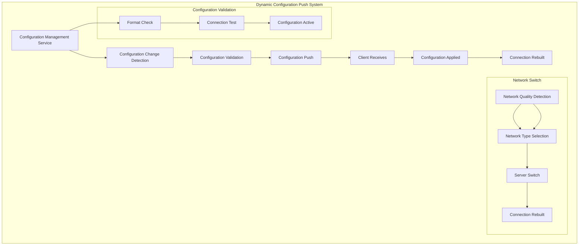

#### Complete Implementation

```java
@Service
public class DynamicConfigService {
    
    @Autowired
    private HiveMqMqttClient mqttClient;
    
    @Autowired
    private NetworkQualityService networkQualityService;
    
    private final Map<String, Object> currentConfig = new ConcurrentHashMap<>();
    
    @PostConstruct
    public void init() {
        // Register configuration update listener
        mqttClient.registerConsumer("/config/+/update", this::handleConfigUpdate);
        
        // Register configuration query listener
        mqttClient.registerConsumer("/config/+/query", this::handleConfigQuery);
        
        // Start configuration monitor
        startConfigMonitoring();
    }
    
    /**
     * Update MQTT server configuration
     */
    public void updateMqttServerConfig() {
        try {
            // Fetch latest configuration from the config service
            MqttServerInfo newConfig = getLatestMqttConfig();
            
            // Validate the new configuration
            if (validateMqttConfig(newConfig)) {
                // Test connection with new configuration
                if (testMqttConnection(newConfig)) {
                    // Apply new configuration
                    applyMqttConfig(newConfig);
                    
                    log.info("MQTT server configuration updated");
                } else {
                    log.error("New MQTT configuration connection test failed");
                }
            } else {
                log.error("New MQTT configuration validation failed");
            }
            
        } catch (Exception e) {
            log.error("Failed to update MQTT server configuration: {}", e.getMessage());
        }
    }
    
    /**
     * Network quality optimization
     */
    public void optimizeNetworkConnection() {
        try {
            // Get current network quality
            NetworkQualityStats stats = networkQualityService.getCurrentStats();
            
            if (stats.getAverageLatency() > 200) {
                // High latency, switch to VPC
                switchToVpcNetwork();
                log.info("High latency, switched to VPC network");
            } else if (stats.getAverageLatency() < 50) {
                // Good network quality, switch to public
                switchToPublicNetwork();
                log.info("Good network quality, switched to public network");
            }
            
        } catch (Exception e) {
            log.error("Network optimization failed: {}", e.getMessage());
        }
    }
    
    /**
     * Handle configuration update
     */
    private void handleConfigUpdate(ConsumerMessage message) {
        try {
            String topic = message.getTopic();
            String payload = new String(message.getPayload());
            
            // Parse configuration update
            ConfigUpdateMessage configUpdate = JsonUtils.fromJson(payload, ConfigUpdateMessage.class);
            
            // Validate configuration update
            if (validateConfigUpdate(configUpdate)) {
                // Apply configuration update
                applyConfigUpdate(configUpdate);
                
                // Send configuration ack
                sendConfigAck(configUpdate.getConfigId(), true);
                
                log.info("Configuration update applied - config ID: {}, type: {}", 
                    configUpdate.getConfigId(), configUpdate.getConfigType());
            } else {
                // Send configuration rejection
                sendConfigAck(configUpdate.getConfigId(), false);
                
                log.warn("Configuration update validation failed - config ID: {}", configUpdate.getConfigId());
            }
            
        } catch (Exception e) {
            log.error("Failed to handle configuration update - topic: {}, error: {}", message.getTopic(), e.getMessage());
        }
    }
    
    /**
     * Handle configuration query
     */
    private void handleConfigQuery(ConsumerMessage message) {
        try {
            String topic = message.getTopic();
            String payload = new String(message.getPayload());
            
            // Parse configuration query
            ConfigQueryMessage configQuery = JsonUtils.fromJson(payload, ConfigQueryMessage.class);
            
            // Get configuration value
            Object config = getConfig(configQuery.getConfigKey());
            
            // Send configuration response
            sendConfigResponse(configQuery.getQueryId(), config);
            
            log.debug("Configuration query answered - query ID: {}, config key: {}", 
                configQuery.getQueryId(), configQuery.getConfigKey());
            
        } catch (Exception e) {
            log.error("Failed to handle configuration query - topic: {}, error: {}", message.getTopic(), e.getMessage());
        }
    }
    
    /**
     * Switch to VPC network
     */
    private void switchToVpcNetwork() {
        try {
            mqttClient.changeServer(NetworkTypeEnum.VPC);
            
            // Update network type configuration
            updateNetworkTypeConfig(NetworkTypeEnum.VPC);
            
        } catch (Exception e) {
            log.error("Failed to switch to VPC network: {}", e.getMessage());
        }
    }
    
    /**
     * Switch to public network
     */
    private void switchToPublicNetwork() {
        try {
            mqttClient.changeServer(NetworkTypeEnum.PUBLIC);
            
            // Update network type configuration
            updateNetworkTypeConfig(NetworkTypeEnum.PUBLIC);
            
        } catch (Exception e) {
            log.error("Failed to switch to public network: {}", e.getMessage());
        }
    }
    
    /**
     * Start configuration monitor
     */
    private void startConfigMonitoring() {
        // Periodic configuration update check
        ScheduledExecutorService executor = Executors.newSingleThreadScheduledExecutor();
        executor.scheduleWithFixedDelay(this::checkConfigUpdates, 0, 60, TimeUnit.SECONDS);
    }
    
    /**
     * Check configuration updates
     */
    private void checkConfigUpdates() {
        try {
            // Check for new configuration updates
            List<ConfigUpdateMessage> updates = getPendingConfigUpdates();
            
            for (ConfigUpdateMessage update : updates) {
                handleConfigUpdate(update);
            }
            
        } catch (Exception e) {
            log.error("Failed to check configuration updates: {}", e.getMessage());
        }
    }
    
    // Other helper methods...
    private MqttServerInfo getLatestMqttConfig() {
        // Fetch latest MQTT configuration from the config service
        return configApiService.getMqttServerConfig();
    }
    
    private boolean validateMqttConfig(MqttServerInfo config) {
        // MQTT configuration validation logic
        return config != null && 
               StringUtils.isNotBlank(config.getHost()) &&
               config.getPort() > 0 &&
               StringUtils.isNotBlank(config.getUsername());
    }
    
    private boolean testMqttConnection(MqttServerInfo config) {
        // Test MQTT connection
        try {
            // Create a temporary client to test the connection
            MqttClient testClient = MqttClient.builder()
                .identifier("test-client")
                .serverHost(config.getHost())
                .serverPort(config.getPort())
                .buildBlocking();
            
            testClient.connectWith()
                .simpleAuth()
                .username(config.getUsername())
                .password(config.getPassword().getBytes())
                .applySimpleAuth()
                .send();
            
            boolean connected = testClient.getState() == MqttClientState.CONNECTED;
            
            // Disconnect the test client
            testClient.disconnect();
            
            return connected;
            
        } catch (Exception e) {
            log.error("MQTT connection test failed: {}", e.getMessage());
            return false;
        }
    }
    
    private void applyMqttConfig(MqttServerInfo newConfig) {
        // Apply new MQTT configuration
        mqttClient.initialClient(newConfig);
        
        // Update local config cache
        currentConfig.put("mqtt.server", newConfig);
    }
}
```

### Scenario 3 — High-Availability Message Processing

#### High-Availability Message Processing Architecture

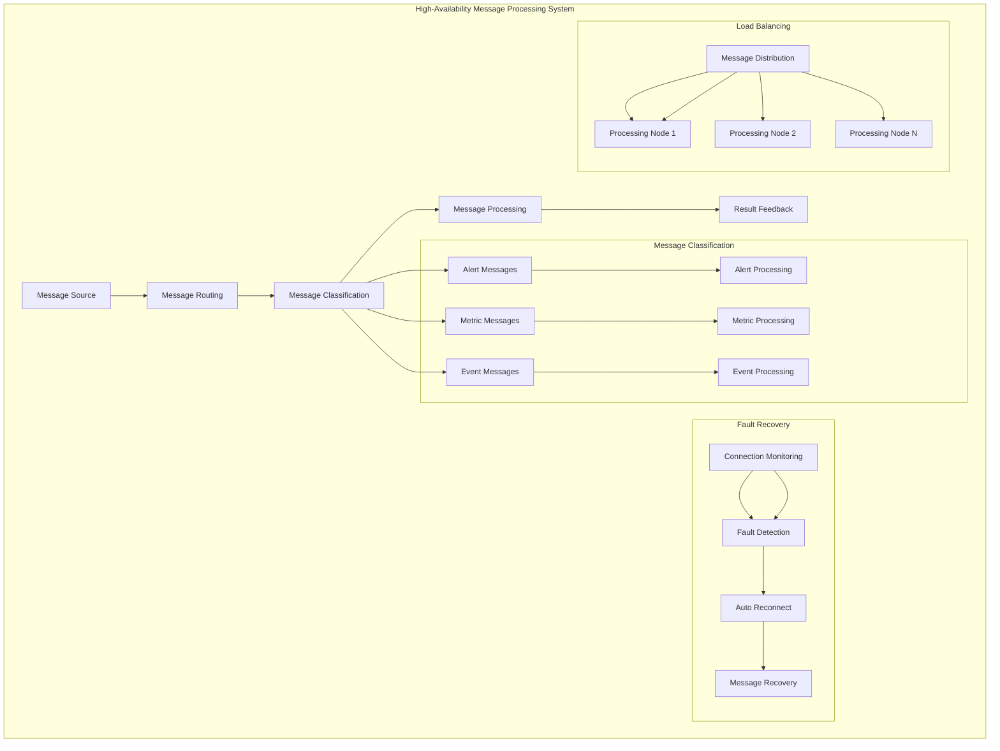

#### Complete Implementation

```java
@Component
public class HighAvailabilityMessageProcessor {
    
    @Autowired
    private HiveMqMqttClient mqttClient;
    
    private final Map<String, MessageHandler> messageHandlers = new ConcurrentHashMap<>();
    private final Map<String, Consumer<ConsumerMessage>> messageProcessors = new ConcurrentHashMap<>();
    
    @PostConstruct
    public void init() {
        // Register message handlers
        registerMessageHandlers();
        
        // Register message listeners
        registerMessageListeners();
        
        // Start fault recovery monitor
        startFaultRecoveryMonitoring();
    }
    
    /**
     * Register message handlers
     */
    private void registerMessageHandlers() {
        // Alert message handler
        messageHandlers.put("alert", new AlertMessageHandler());
        
        // Metric message handler
        messageHandlers.put("metric", new MetricMessageHandler());
        
        // Event message handler
        messageHandlers.put("event", new EventMessageHandler());
        
        // System message handler
        messageHandlers.put("system", new SystemMessageHandler());
    }
    
    /**
     * Register message listeners
     */
    private void registerMessageListeners() {
        // Alert message listener
        mqttClient.registerConsumer("/alerts/+", this::handleAlertMessage);
        
        // Metric message listener
        mqttClient.registerConsumer("/metrics/+", this::handleMetricMessage);
        
        // Event message listener
        mqttClient.registerConsumer("/events/+", this::handleEventMessage);
        
        // System message listener
        mqttClient.registerConsumer("/system/+", this::handleSystemMessage);
    }
    
    /**
     * Handle alert messages
     */
    private void handleAlertMessage(ConsumerMessage message) {
        try {
            String topic = message.getTopic();
            String payload = new String(message.getPayload());
            
            // Parse alert message
            AlertMessage alert = JsonUtils.fromJson(payload, AlertMessage.class);
            
            // Get alert handler
            MessageHandler handler = messageHandlers.get("alert");
            
            if (handler != null) {
                // Process alert message
                handler.handle(message);
                
                log.info("Alert message processed - topic: {}, severity: {}", 
                    topic, alert.getSeverity());
            } else {
                log.warn("Alert message handler not found");
            }
            
        } catch (Exception e) {
            log.error("Failed to handle alert message - topic: {}, error: {}", message.getTopic(), e.getMessage());
        }
    }
    
    /**
     * Handle metric messages
     */
    private void handleMetricMessage(ConsumerMessage message) {
        try {
            String topic = message.getTopic();
            String payload = new String(message.getPayload());
            
            // Parse metric message
            MetricMessage metric = JsonUtils.fromJson(payload, MetricMessage.class);
            
            // Get metric handler
            MessageHandler handler = messageHandlers.get("metric");
            
            if (handler != null) {
                // Process metric message
                handler.handle(message);
                
                log.info("Metric message processed - topic: {}, metric type: {}", 
                    topic, metric.getMetricType());
            } else {
                log.warn("Metric message handler not found");
            }
            
        } catch (Exception e) {
            log.error("Failed to handle metric message - topic: {}, error: {}", message.getTopic(), e.getMessage());
        }
    }
    
    /**
     * Handle event messages
     */
    private void handleEventMessage(ConsumerMessage message) {
        try {
            String topic = message.getTopic();
            String payload = new String(message.getPayload());
            
            // Parse event message
            EventMessage event = JsonUtils.fromJson(payload, EventMessage.class);
            
            // Get event handler
            MessageHandler handler = messageHandlers.get("event");
            
            if (handler != null) {
                // Process event message
                handler.handle(message);
                
                log.info("Event message processed - topic: {}, event type: {}", 
                    topic, event.getEventType());
            } else {
                log.warn("Event message handler not found");
            }
            
        } catch (Exception e) {
            log.error("Failed to handle event message - topic: {}, error: {}", message.getTopic(), e.getMessage());
        }
    }
    
    /**
     * Handle system messages
     */
    private void handleSystemMessage(ConsumerMessage message) {
        try {
            String topic = message.getTopic();
            String payload = new String(message.getPayload());
            
            // Parse system message
            SystemMessage system = JsonUtils.fromJson(payload, SystemMessage.class);
            
            // Get system handler
            MessageHandler handler = messageHandlers.get("system");
            
            if (handler != null) {
                // Process system message
                handler.handle(message);
                
                log.info("System message processed - topic: {}, operation: {}", 
                    topic, system.getOperation());
            } else {
                log.warn("System message handler not found");
            }
            
        } catch (Exception e) {
            log.error("Failed to handle system message - topic: {}, error: {}", message.getTopic(), e.getMessage());
        }
    }
    
    /**
     * Start fault recovery monitor
     */
    private void startFaultRecoveryMonitoring() {
        // Monitor connection state
        MqttEventBus.connectionStateFlow
            .filter(event -> event.getState() == ConnectionState.ABNORMAL_DISCONNECT)
            .subscribe(this::handleConnectionFailure);
            
        // Monitor network quality
        MqttEventBus.networkQualityFlow
            .filter(event -> event.getStats().getAverageLatency() > 500)
            .subscribe(this::handleNetworkDegradation);
    }
    
    /**
     * Handle connection failure
     */
    private void handleConnectionFailure(ConnectionStateEvent event) {
        log.warn("Connection failure detected, starting fault recovery");
        
        // Start fault recovery
        startFaultRecovery();
    }
    
    /**
     * Handle network quality degradation
     */
    private void handleNetworkDegradation(NetworkQualityEvent event) {
        log.warn("Network quality degradation detected, average latency: {}ms", 
            event.getStats().getAverageLatency());
        
        // Consider switching network
        considerNetworkSwitch();
    }
    
    /**
     * Start fault recovery
     */
    private void startFaultRecovery() {
        try {
            // Reinitialize the client
            mqttClient.reinitialize();
            
            // Re-register listeners
            reRegisterMessageListeners();
            
            log.info("Fault recovery complete");
            
        } catch (Exception e) {
            log.error("Fault recovery failed: {}", e.getMessage());
            
            // Retry after a delay
            scheduleFaultRecoveryRetry();
        }
    }
    
    /**
     * Re-register message listeners
     */
    private void reRegisterMessageListeners() {
        // Re-register all message listeners
        registerMessageListeners();
        
        log.info("Message listeners re-registered");
    }
    
    /**
     * Consider network switch
     */
    private void considerNetworkSwitch() {
        try {
            // Get current network type
            NetworkTypeEnum currentNetwork = getCurrentNetworkType();
            
            if (currentNetwork == NetworkTypeEnum.PUBLIC) {
                // Switch to VPC network
                mqttClient.changeServer(NetworkTypeEnum.VPC);
                log.info("Network quality degraded, switched to VPC network");
            } else {
                // Switch to public network
                mqttClient.changeServer(NetworkTypeEnum.PUBLIC);
                log.info("Network quality degraded, switched to public network");
            }
            
        } catch (Exception e) {
            log.error("Network switch failed: {}", e.getMessage());
        }
    }
    
    /**
     * Schedule fault recovery retry
     */
    private void scheduleFaultRecoveryRetry() {
        // Retry after 30 seconds
        CompletableFuture.delayedExecutor(30, TimeUnit.SECONDS)
            .execute(this::startFaultRecovery);
    }
    
    // Message handler interface
    public interface MessageHandler {
        void handle(ConsumerMessage message);
    }
    
    // Alert message handler
    private static class AlertMessageHandler implements MessageHandler {
        @Override
        public void handle(ConsumerMessage message) {
            // Alert message processing logic
            log.info("Processing alert message: {}", message.getTopic());
        }
    }
    
    // Metric message handler
    private static class MetricMessageHandler implements MessageHandler {
        @Override
        public void handle(ConsumerMessage message) {
            // Metric message processing logic
            log.info("Processing metric message: {}", message.getTopic());
        }
    }
    
    // Event message handler
    private static class EventMessageHandler implements MessageHandler {
        @Override
        public void handle(ConsumerMessage message) {
            // Event message processing logic
            log.info("Processing event message: {}", message.getTopic());
        }
    }
    
    // System message handler
    private static class SystemMessageHandler implements MessageHandler {
        @Override
        public void handle(ConsumerMessage message) {
            // System message processing logic
            log.info("Processing system message: {}", message.getTopic());
        }
    }
}
```

### Scenario 4 — Fault Recovery Handling

#### Fault Recovery Mechanism

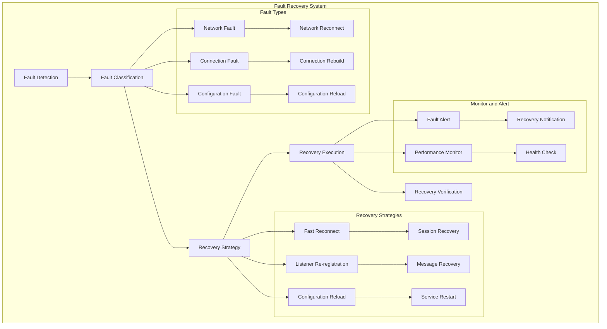

#### Complete Implementation

```java
@Component
public class FaultRecoveryService {
    
    @Autowired
    private HiveMqMqttClient mqttClient;
    
    private final Map<String, Consumer<ConsumerMessage>> listenerCache = new ConcurrentHashMap<>();
    private final AtomicBoolean recoveryInProgress = new AtomicBoolean(false);
    private final AtomicInteger recoveryAttempts = new AtomicInteger(0);
    
    private static final int MAX_RECOVERY_ATTEMPTS = 5;
    private static final long RECOVERY_RETRY_DELAY = 30; // 30 seconds
    
    @PostConstruct
    public void init() {
        // Subscribe to fault events
        subscribeToFaultEvents();
        
        // Start health check
        startHealthCheck();
    }
    
    /**
     * Subscribe to fault events
     */
    private void subscribeToFaultEvents() {
        // Connection fault events
        MqttEventBus.connectionStateFlow
            .filter(event -> event.getState() == ConnectionState.ABNORMAL_DISCONNECT)
            .subscribe(this::handleConnectionFailure);
            
        // Session expired events
        MqttEventBus.connectionStateFlow
            .filter(event -> event.getState() == ConnectionState.SESSION_EXPIRED)
            .subscribe(this::handleSessionExpired);
            
        // Network quality events
        MqttEventBus.networkQualityFlow
            .filter(event -> event.getStats().getPacketLossRate() > 0.2)
            .subscribe(this::handleNetworkFailure);
    }
    
    /**
     * Handle connection failure
     */
    private void handleConnectionFailure(ConnectionStateEvent event) {
        log.warn("Connection failure detected, starting recovery - reason: {}", event.getReason());
        
        if (recoveryInProgress.compareAndSet(false, true)) {
            startConnectionRecovery();
        }
    }
    
    /**
     * Handle session expired
     */
    private void handleSessionExpired(ConnectionStateEvent event) {
        log.warn("Session expired, starting session recovery");
        
        if (recoveryInProgress.compareAndSet(false, true)) {
            startSessionRecovery();
        }
    }
    
    /**
     * Handle network failure
     */
    private void handleNetworkFailure(NetworkQualityEvent event) {
        log.warn("Network failure detected, packet loss: {}%", 
            event.getStats().getPacketLossRate() * 100);
        
        if (recoveryInProgress.compareAndSet(false, true)) {
            startNetworkRecovery();
        }
    }
    
    /**
     * Start connection recovery
     */
    private void startConnectionRecovery() {
        try {
            log.info("Starting connection fault recovery");
            
            // Reset retry counter
            recoveryAttempts.set(0);
            
            // Perform connection recovery
            performConnectionRecovery();
            
        } catch (Exception e) {
            log.error("Connection fault recovery failed: {}", e.getMessage());
            scheduleRecoveryRetry();
        }
    }
    
    /**
     * Start session recovery
     */
    private void startSessionRecovery() {
        try {
            log.info("Starting session recovery");
            
            // Reinitialize the client
            mqttClient.reinitialize();
            
            // Re-register listeners
            reRegisterAllListeners();
            
            log.info("Session recovery complete");
            
        } catch (Exception e) {
            log.error("Session recovery failed: {}", e.getMessage());
            scheduleRecoveryRetry();
        } finally {
            recoveryInProgress.set(false);
        }
    }
    
    /**
     * Start network recovery
     */
    private void startNetworkRecovery() {
        try {
            log.info("Starting network fault recovery");
            
            // Try network switch
            performNetworkSwitch();
            
            // Re-establish connection
            mqttClient.reinitialize();
            
            log.info("Network fault recovery complete");
            
        } catch (Exception e) {
            log.error("Network fault recovery failed: {}", e.getMessage());
            scheduleRecoveryRetry();
        } finally {
            recoveryInProgress.set(false);
        }
    }
    
    /**
     * Perform connection recovery
     */
    private void performConnectionRecovery() {
        try {
            // Check retry count
            if (recoveryAttempts.get() >= MAX_RECOVERY_ATTEMPTS) {
                log.error("Max recovery retries reached, stopping recovery");
                recoveryInProgress.set(false);
                return;
            }
            
            // Increment retry count
            recoveryAttempts.incrementAndGet();
            
            log.info("Performing connection recovery, attempt #{}", recoveryAttempts.get());
            
            // Reinitialize the client
            mqttClient.reinitialize();
            
            // Re-register listeners
            reRegisterAllListeners();
            
            // Validate recovery result
            if (validateRecovery()) {
                log.info("Connection recovery successful");
                recoveryInProgress.set(false);
                recoveryAttempts.set(0);
            } else {
                log.warn("Connection recovery validation failed, will retry");
                scheduleRecoveryRetry();
            }
            
        } catch (Exception e) {
            log.error("Connection recovery execution failed: {}", e.getMessage());
            scheduleRecoveryRetry();
        }
    }
    
    /**
     * Perform network switch
     */
    private void performNetworkSwitch() {
        try {
            // Get current network type
            NetworkTypeEnum currentNetwork = getCurrentNetworkType();
            
            if (currentNetwork == NetworkTypeEnum.PUBLIC) {
                // Switch to VPC network
                mqttClient.changeServer(NetworkTypeEnum.VPC);
                log.info("Switched to VPC network");
            } else {
                // Switch to public network
                mqttClient.changeServer(NetworkTypeEnum.PUBLIC);
                log.info("Switched to public network");
            }
            
        } catch (Exception e) {
            log.error("Network switch failed: {}", e.getMessage());
        }
    }
    
    /**
     * Re-register all listeners
     */
    private void reRegisterAllListeners() {
        try {
            // Re-register all cached listeners
            for (Map.Entry<String, Consumer<ConsumerMessage>> entry : listenerCache.entrySet()) {
                mqttClient.registerConsumer(entry.getKey(), entry.getValue());
            }
            
            log.info("All listeners re-registered, total: {}", listenerCache.size());
            
        } catch (Exception e) {
            log.error("Failed to re-register listeners: {}", e.getMessage());
        }
    }
    
    /**
     * Validate recovery result
     */
    private boolean validateRecovery() {
        try {
            // Check connection state
            boolean connected = mqttClient.isConnected();
            
            // Check network quality
            NetworkQualityStats stats = getCurrentNetworkQuality();
            boolean networkOk = stats.getAverageLatency() < 500 && stats.getPacketLossRate() < 0.1;
            
            return connected && networkOk;
            
        } catch (Exception e) {
            log.error("Recovery validation failed: {}", e.getMessage());
            return false;
        }
    }
    
    /**
     * Schedule recovery retry
     */
    private void scheduleRecoveryRetry() {
        try {
            log.info("Scheduling recovery retry, delay {} seconds", RECOVERY_RETRY_DELAY);
            
            // Delay retry
            CompletableFuture.delayedExecutor(RECOVERY_RETRY_DELAY, TimeUnit.SECONDS)
                .execute(() -> {
                    if (recoveryInProgress.get()) {
                        performConnectionRecovery();
                    }
                });
                
        } catch (Exception e) {
            log.error("Failed to schedule recovery retry: {}", e.getMessage());
            recoveryInProgress.set(false);
        }
    }
    
    /**
     * Start health check
     */
    private void startHealthCheck() {
        // Periodic health check
        ScheduledExecutorService executor = Executors.newSingleThreadScheduledExecutor();
        executor.scheduleWithFixedDelay(this::performHealthCheck, 0, 60, TimeUnit.SECONDS);
    }
    
    /**
     * Perform health check
     */
    private void performHealthCheck() {
        try {
            // Check connection state
            if (!mqttClient.isConnected()) {
                log.warn("Health check found disconnected");
                
                if (recoveryInProgress.compareAndSet(false, true)) {
                    startConnectionRecovery();
                }
            }
            
            // Check network quality
            NetworkQualityStats stats = getCurrentNetworkQuality();
            if (stats.getAverageLatency() > 1000 || stats.getPacketLossRate() > 0.3) {
                log.warn("Health check found network degradation");
                
                if (recoveryInProgress.compareAndSet(false, true)) {
                    startNetworkRecovery();
                }
            }
            
        } catch (Exception e) {
            log.error("Health check failed: {}", e.getMessage());
        }
    }
    
    /**
     * Cache a listener
     */
    public void cacheListener(String topic, Consumer<ConsumerMessage> callback) {
        listenerCache.put(topic, callback);
        log.debug("Listener cached - topic: {}", topic);
    }
    
    /**
     * Remove cached listener
     */
    public void removeCachedListener(String topic) {
        listenerCache.remove(topic);
        log.debug("Cached listener removed - topic: {}", topic);
    }
    
    /**
     * Get recovery status
     */
    public boolean isRecoveryInProgress() {
        return recoveryInProgress.get();
    }
    
    /**
     * Get recovery attempt count
     */
    public int getRecoveryAttempts() {
        return recoveryAttempts.get();
    }
    
    // Helper methods
    private NetworkTypeEnum getCurrentNetworkType() {
        // Get current network type
        return NetworkTypeEnum.PUBLIC; // default
    }
    
    private NetworkQualityStats getCurrentNetworkQuality() {
        // Get current network quality statistics
        return new NetworkQualityStats(); // default
    }
}
```

## ⚙️ Configuration Reference

### Core Configuration Parameters

```yaml
platform:
  component:
    mqtt:
      # Basic configuration
      enable: true                    # Whether to enable the MQTT component
      mqtt-version: mqtt_5_0         # MQTT protocol version
      client-type: CLIENT            # Client type
      parent-topic: /atlas_richie    # Root topic
      group-id: your-group-id        # Group ID
      heartbeat-interval: 30         # Heartbeat interval (seconds)
      
      # Server configuration
      server:
        host: mqtt.example.com       # Public server address
        port: 1883                   # Public server port
        vpc-host: mqtt-vpc.example.com  # VPC server address
        vpc-port: 1883               # VPC server port
        username: your-username       # Username
        password: your-password       # Password
        default-network-type: PUBLIC # Default network type
        qos: 1                       # Message QoS level
        time-to-wait: 10000          # Wait time (milliseconds)
      
      # MQTT 5.0 specific configuration
      mqtt5:
        client-type: "pos_terminal"  # Client type identifier
        keep-session: true           # Whether to preserve session state
        session-expiry-interval: 1800  # Session expiry time (seconds)
        message-expiry-interval: 1800  # Message expiry time (seconds)
        enable-will-message: true    # Whether to enable will message
        will-topic: "device/status/{clientId}"  # Will message topic
        will-message: "Abnormal disconnect"    # Will message content
        app-version: "1.0.0"        # Application version
        store-id: "STORE_001"       # Store ID
        enable-user-properties: true # Whether to enable user properties
      
      # Fast recovery configuration
      fast-recovery:
        enabled: true                    # Enable fast recovery mode
        network-check-interval: 5        # Network check interval (seconds)
        connection-monitor-interval: 10  # Connection monitor interval (seconds)
        fast-reconnect-interval: 1000    # Fast reconnect interval (ms)
        max-fast-reconnect-attempts: 10  # Max fast reconnect attempts
        network-connect-timeout: 3000    # Network connect timeout (ms)
        keep-alive-interval: 30         # Heartbeat interval (seconds)
        enable-network-monitor: true     # Enable network monitoring
        enable-connection-monitor: true  # Enable connection monitoring
        enable-fast-reconnect: true      # Enable fast reconnect
        reconnect-on-network-recovery: true  # Reconnect immediately after network recovery
        reconnect-on-disconnect: true    # Reconnect immediately after disconnect
```

### `MQTT` 5.0-Specific Configuration Details

#### Session Management Configuration
- `keep-session`: Whether to preserve session state (inverse of `cleanStart`)
- `session-expiry-interval`: Session expiry time, supports long-outage recovery

#### Message Reliability Configuration
- `message-expiry-interval`: Message expiry time, prevents expired message delivery
- `enable-will-message`: Enable will message for timely offline detection

#### Network Optimization Configuration
- `enable-user-properties`: Enable user properties for richer metadata

### Fast Recovery Configuration Details

#### Network Monitoring Configuration
- `enabled`: Whether to enable fast recovery mode
- `network-check-interval`: Network check interval, 5 seconds recommended
- `connection-monitor-interval`: Connection monitor interval, 10 seconds recommended
- `keep-alive-interval`: Heartbeat interval, 30 seconds recommended

#### Reconnect Mechanism Configuration
- `fast-reconnect-interval`: Fast reconnect interval, 1000 ms recommended
- `max-fast-reconnect-attempts`: Max reconnect attempts, 10 recommended
- `network-connect-timeout`: Network connect timeout, 3000 ms recommended

#### Monitor Switch Configuration
- `enable-network-monitor`: Whether to enable network monitoring
- `enable-connection-monitor`: Whether to enable connection monitoring
- `enable-fast-reconnect`: Whether to enable fast reconnect
- `reconnect-on-network-recovery`: Reconnect immediately after network recovery
- `reconnect-on-disconnect`: Reconnect immediately after disconnect

## 🔧 Troubleshooting

### Fault Diagnosis Flow Diagram

#### Connection Fault Diagnosis

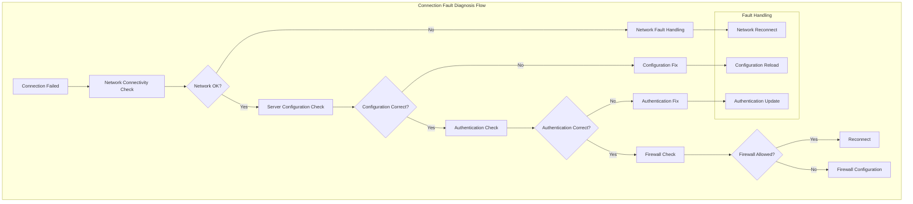

#### Message Loss Diagnosis

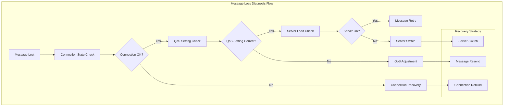

### Common Issues and Solutions

#### 1. Connection Failure

**Symptoms**: Client cannot connect to the MQTT server
**Possible causes**:
- Network unreachable
- Incorrect server address
- Wrong credentials
- Firewall blocking

**Solution**:
```java
// Check network connectivity
boolean networkOk = mqttClient.checkNetworkConnectivity();
if (!networkOk) {
    log.error("Network unreachable, please check the network connection");
    return;
}

// Validate server configuration
MqttServerInfo serverInfo = mqttClient.getServerInfo();
log.info("Server configuration: {}", serverInfo);

// Reinitialize
mqttClient.reinitialize();
```

#### 2. Message Loss

**Symptoms**: Published messages receive no acknowledgment
**Possible causes**:
- Unstable network
- Improper QoS setting
- High server load

**Solution**:
```java
// Use QoS 1 to ensure message delivery
mqttClient.doPublish(topic, message, false);

// Enable message retry
mqttClient.setMaxPublishRetry(5);
mqttClient.setPublishRetryInterval(2000);

// Check connection state
if (!mqttClient.isConnected()) {
    log.warn("Connection lost, messages may be lost");
}
```

#### 3. Subscription Failure

**Symptoms**: Unable to receive messages from the subscribed topic
**Possible causes**:
- Malformed topic
- Insufficient permissions
- Wrong subscription timing

**Solution**:
```java
// Ensure subscription happens after the connection is established
if (mqttClient.isConnected()) {
    mqttClient.registerConsumer(topic, callback);
} else {
    log.warn("Connection not established, delayed subscription");
    // Delayed subscription logic
}

// Check topic format
if (!isValidTopic(topic)) {
    log.error("Malformed topic: {}", topic);
    return;
}
```

#### 4. Frequent Reconnection

**Symptoms**: Client keeps disconnecting and reconnecting
**Possible causes**:
- Unstable network
- Heartbeat interval too short
- High server load

**Solution**:
```java
// Adjust heartbeat interval
mqttClient.setKeepAliveInterval(60); // Increase to 60 seconds

// Enable auto reconnect
mqttClient.setAutomaticReconnect(true);

// Check network quality
if (mqttClient.getNetworkQuality() < 0.8) {
    log.warn("Poor network quality, consider switching networks");
    mqttClient.changeServer(NetworkTypeEnum.VPC);
}
```

#### 5. Memory Leak

**Symptoms**: Application memory usage keeps growing
**Possible causes**:
- Listeners not properly unregistered
- Message queue not cleaned up
- Connection not properly closed

**Solution**:
```java
// Properly unregister listeners
@Override
public void destroy() {
    // Unregister all listeners
    for (String topic : LISTENER_CACHE.keySet()) {
        mqttClient.unregisterConsumer(topic);
    }
    
    // Disconnect
    mqttClient.disconnect();
    
    // Shut down monitor services
    shutdownMonitorServices();
}

// Periodically clean up expired messages
mqttClient.setMessageExpiryInterval(300); // 5-minute expiry
```

### Monitoring Metrics

#### Monitoring Metrics System

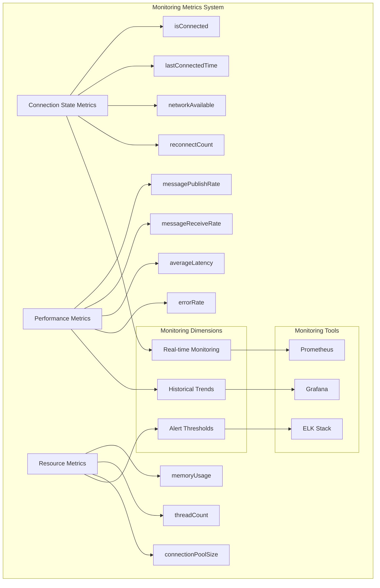

#### Connection State Metrics
- `isConnected`: Current connection state
- `lastConnectedTime`: Last successful connection time
- `networkAvailable`: Network availability
- `reconnectCount`: Reconnect count

#### Performance Metrics
- `messagePublishRate`: Message publish rate
- `messageReceiveRate`: Message receive rate
- `averageLatency`: Average latency
- `errorRate`: Error rate

#### Resource Metrics
- `memoryUsage`: Memory usage
- `threadCount`: Thread count
- `connectionPoolSize`: Connection pool size

### Log Configuration

```yaml
logging:
  level:
    com.richie.component.mqtt: DEBUG
    com.hivemq.client: INFO
  pattern:
    console: "%d{yyyy-MM-dd HH:mm:ss} [%thread] %-5level %logger{36} - %msg%n"
    file: "%d{yyyy-MM-dd HH:mm:ss} [%thread] %-5level %logger{36} - %msg%n"
```

## 📎 ⏱️ Sequence Diagram Reference

### Client Initialization Sequence

```mermaid
sequenceDiagram
    participant App as Application
    participant HiveMqClient as HiveMqMqttClient
    participant ConnManager as Connection Manager
    participant ConfigBuilder as Connection Config Builder
    participant HiveMQ as HiveMQ Client
    participant EventBus as Event Bus
    participant NetworkMonitor as Network Monitor
    participant ConnMonitor as Connection Monitor
    participant HeartbeatManager as Heartbeat Manager

    App->>HiveMqClient: Constructor call
    HiveMqClient->>HiveMqClient: Validate configuration
    HiveMqClient->>HiveMqClient: Initialize broadcast service
    HiveMqClient->>HiveMqClient: Generate client ID
    
    alt If immediate initialization is needed
        HiveMqClient->>HiveMqClient: initService()
        HiveMqClient->>ConnManager: Create connection manager
        HiveMqClient->>ConfigBuilder: Create config builder
        HiveMqClient->>HiveMQ: Create MQTT 5.0 client
        
        HiveMqClient->>NetworkMonitor: Start network monitor
        HiveMqClient->>ConnMonitor: Start connection monitor
        HiveMqClient->>HeartbeatManager: Start heartbeat service
        
        HiveMqClient->>EventBus: Publish init complete event
    end
    
    App->>HiveMqClient: Return client instance
```

### Client Connection Establishment Sequence

```mermaid
sequenceDiagram
    participant App as Application
    participant HiveMqClient as HiveMqMqttClient
    participant ConnManager as Connection Manager
    participant ConfigBuilder as Config Builder
    participant HiveMQ as HiveMQ Client
    participant MQTTServer as MQTT Server
    participant EventBus as Event Bus

    App->>HiveMqClient: initialClient(serverInfo)
    HiveMqClient->>ConnManager: Set server configuration
    ConnManager->>ConfigBuilder: Build connection config
    ConfigBuilder->>ConfigBuilder: Set MQTT 5.0 parameters
    Note over ConfigBuilder: Session expiry, message expiry, will message, etc.
    
    ConnManager->>HiveMQ: Create async client
    ConnManager->>HiveMQ: Initiate connection
    HiveMQ->>MQTTServer: CONNECT packet
    MQTTServer->>HiveMQ: CONNACK packet
    
    alt Connection success
        HiveMQ->>ConnManager: Connection success callback
        ConnManager->>ConnManager: Update connection state
        ConnManager->>EventBus: Publish connection success event
        EventBus->>App: Notify connection state change
    else Connection failure
        HiveMQ->>ConnManager: Connection failure callback
        ConnManager->>ConnManager: Analyze failure reason
        ConnManager->>EventBus: Publish connection failure event
    end
    
    App->>HiveMqClient: Return connection result
```

### Message Publishing Sequence

```mermaid
sequenceDiagram
    participant App as Application
    participant HiveMqClient as HiveMqMqttClient
    participant MessageManager as Message Manager
    participant HiveMQ as HiveMQ Client
    participant MQTTServer as MQTT Server
    participant EventBus as Event Bus

    App->>HiveMqClient: doPublish(topic, payload)
    HiveMqClient->>HiveMqClient: Check connection state
    
    alt Connection OK
        HiveMqClient->>MessageManager: Publish message
        MessageManager->>HiveMQ: Build PUBLISH packet
        HiveMQ->>MQTTServer: Send PUBLISH packet
        
        alt QoS 0
            MQTTServer->>HiveMQ: Handle directly
        else QoS 1
            MQTTServer->>HiveMQ: Return PUBACK
            HiveMQ->>MessageManager: Acknowledge
        else QoS 2
            MQTTServer->>HiveMQ: Return PUBREC
            HiveMQ->>MQTTServer: Send PUBREL
            MQTTServer->>HiveMQ: Return PUBCOMP
            HiveMQ->>MessageManager: Acknowledge
        end
        
        MessageManager->>EventBus: Publish message-sent success event
        EventBus->>App: Notify message send status
    else Connection error
        HiveMqClient->>HiveMqClient: Trigger fast reconnect
        HiveMqClient->>App: Return send failure
    end
```

### Message Subscription Sequence

```mermaid
sequenceDiagram
    participant App as Application
    participant HiveMqClient as HiveMqMqttClient
    participant AbstractApi as AbstractMqttClientApi
    participant MessageManager as Message Manager
    participant HiveMQ as HiveMQ Client
    participant MQTTServer as MQTT Server
    participant EventBus as Event Bus

    App->>HiveMqClient: registerConsumer(topic, callback)
    HiveMqClient->>AbstractApi: registerConsumer(topic, callback)
    AbstractApi->>AbstractApi: Save to LISTENER_CACHE
    AbstractApi->>HiveMqClient: doSubscribe(topic)
    HiveMqClient->>MessageManager: doSubscribe(topic)
    
    alt Already connected
        MessageManager->>HiveMQ: Send SUBSCRIBE packet
        HiveMQ->>MQTTServer: SUBSCRIBE request
        MQTTServer->>HiveMQ: SUBACK
        HiveMQ->>MessageManager: Subscription success
    else Not connected
        MessageManager->>MessageManager: Cache subscription request
        Note over MessageManager: Auto-subscribe when connection is established
    end
    
    Note over HiveMqClient: Subscribe to message event stream on init
    HiveMqClient->>EventBus: subscribeMessageFlowIfNecessary()
    EventBus->>HiveMqClient: Subscribe to messageFlow event stream
    
    Note over MQTTServer: Server pushes message
    MQTTServer->>HiveMQ: PUBLISH packet
    HiveMQ->>MessageManager: Receive message
    MessageManager->>EventBus: Publish to messageFlow
    EventBus->>HiveMqClient: dispatchMessage(publish)
    
    HiveMqClient->>HiveMqClient: 1. Exact match from LISTENER_CACHE
    alt Normal subscription matched
        HiveMqClient->>App: Invoke normal subscription callback
    else Normal subscription not matched
        HiveMqClient->>HiveMqClient: 2. Wildcard match from SHARED_LISTENER_CACHE
        alt Shared subscription matched
            HiveMqClient->>HiveMqClient: Extract business topic and match
            HiveMqClient->>App: Invoke shared subscription callback
        else No matching callback
            HiveMqClient->>HiveMqClient: Log debug, drop message
        end
    end
```

### Background Keepalive and Monitoring Sequence

```mermaid
sequenceDiagram
    participant Scheduler as Scheduler
    participant NetworkMonitor as Network Monitor
    participant ConnMonitor as Connection Monitor
    participant HeartbeatManager as Heartbeat Manager
    participant HiveMQ as HiveMQ Client
    participant MQTTServer as MQTT Server
    participant EventBus as Event Bus

    Note over Scheduler: Start background monitoring services
    
    par Network monitoring (5-second interval)
        Scheduler->>NetworkMonitor: Run network check
        NetworkMonitor->>NetworkMonitor: Socket connection test
        alt Network reachable
            NetworkMonitor->>NetworkMonitor: Update network state
            NetworkMonitor->>EventBus: Publish network recovery event
        else Network unreachable
            NetworkMonitor->>NetworkMonitor: Mark network unavailable
            NetworkMonitor->>EventBus: Publish network fault event
        end
    and Connection monitoring (10-second interval)
        Scheduler->>ConnMonitor: Check connection state
        ConnMonitor->>HiveMQ: Get client state
        alt Connection OK
            ConnMonitor->>ConnMonitor: Update connection state
        else Connection error
            ConnMonitor->>ConnMonitor: Trigger reconnect
            ConnMonitor->>EventBus: Publish connection fault event
        end
    and Heartbeat maintenance (30-second interval)
        Scheduler->>HeartbeatManager: Send heartbeat
        HeartbeatManager->>HiveMQ: Send PINGREQ
        HiveMQ->>MQTTServer: PINGREQ packet
        MQTTServer->>HiveMQ: PINGRESP packet
        HeartbeatManager->>HeartbeatManager: Calculate latency
        HeartbeatManager->>EventBus: Publish heartbeat event
    end
```

### Fast Reconnect Sequence

```mermaid
sequenceDiagram
    participant NetworkMonitor as Network Monitor
    participant ConnMonitor as Connection Monitor
    participant ConnManager as Connection Manager
    participant HiveMQ as HiveMQ Client
    participant MQTTServer as MQTT Server
    participant EventBus as Event Bus

    Note over NetworkMonitor: Network recovery detected
    NetworkMonitor->>ConnManager: Trigger fast reconnect
    
    ConnManager->>ConnManager: connect() method (protected by synchronized lock)
    ConnManager->>ConnManager: Read fast recovery configuration
    
    Note over ConnManager: Automatic retry mechanism (exponential backoff + jitter)
    loop Retry loop (supports infinite retry)
        ConnManager->>ConnManager: attemptConnect(isFirstAttempt)
        ConnManager->>ConnManager: Set reconnecting flag
        ConnManager->>ConnManager: Validate server configuration
        ConnManager->>HiveMQ: Build and connect MQTT client
        HiveMQ->>MQTTServer: CONNECT packet
        
        alt Connection success
            MQTTServer->>HiveMQ: CONNACK success
            HiveMQ->>ConnManager: Connection success callback
            ConnManager->>ConnManager: Reset reconnecting flag
            ConnManager->>ConnManager: Update connection state
            ConnManager->>EventBus: Publish connection success event
            ConnManager->>ConnManager: Exit retry loop
        else Connection failure
            MQTTServer->>HiveMQ: CONNACK failure (or timeout)
            HiveMQ->>ConnManager: Connection failure callback
            ConnManager->>ConnManager: Analyze failure reason
            
            alt Infinite retry mode (maxAttempts <= 0)
                ConnManager->>ConnManager: Calculate exponential backoff
                ConnManager->>ConnManager: Add random jitter (20%~100%)
                ConnManager->>ConnManager: Wait backoff time and continue
            else Finite retry mode (maxAttempts > 0)
                ConnManager->>ConnManager: Check retry count
                alt Under max retry count
                    ConnManager->>ConnManager: Calculate exponential backoff
                    ConnManager->>ConnManager: Add random jitter
                    ConnManager->>ConnManager: Wait backoff time and continue
                else Over max retry count
                    ConnManager->>ConnManager: Stop reconnecting
                    ConnManager->>EventBus: Publish reconnect failure event
                    ConnManager->>ConnManager: Exit retry loop
                end
            end
        end
    end
```

### Network Quality Monitoring Sequence

```mermaid
sequenceDiagram
    participant Scheduler as Scheduler
    participant NetworkQualityManager as Network Quality Manager
    participant NetworkQualityMonitor as Network Quality Monitor
    participant MQTTServer as MQTT Server
    participant EventBus as Event Bus
    participant CircularBuffer as Circular Buffer

    Note over Scheduler: Network quality check runs every second
    
    Scheduler->>NetworkQualityManager: Run network quality check
    NetworkQualityManager->>NetworkQualityMonitor: Start network quality check
    
    NetworkQualityMonitor->>MQTTServer: Socket connection test
    alt Connection success
        MQTTServer->>NetworkQualityMonitor: Connection response
        NetworkQualityMonitor->>NetworkQualityManager: Calculate network latency
        NetworkQualityManager->>NetworkQualityManager: Update statistics
        NetworkQualityManager->>CircularBuffer: Save quality event
        NetworkQualityManager->>EventBus: Publish network quality event
        
        alt Network quality good
            EventBus->>NetworkQualityManager: Network quality normal
        else Network quality degraded
            EventBus->>NetworkQualityManager: Trigger network optimization
            NetworkQualityManager->>NetworkQualityManager: Consider network switch
        end
    else Connection failure
        NetworkQualityMonitor->>NetworkQualityManager: Mark network unavailable
        NetworkQualityManager->>CircularBuffer: Save fault event
        NetworkQualityManager->>EventBus: Publish network fault event
    end
    
    NetworkQualityManager->>NetworkQualityManager: Calculate historical statistics
    Note over NetworkQualityManager: Avg latency, packet loss, success rate, etc.
```

### Event Bus Communication Sequence

```mermaid
sequenceDiagram
    participant Component as Component
    participant EventBusInternal as Event Bus Internal Interface
    participant EventBus as Event Bus
    participant Subscriber as Event Subscriber
    participant Reactor as Reactor Reactive Stream

    Note over Component: Component publishes event
    
    Component->>EventBusInternal: Publish event
    EventBusInternal->>EventBus: Internal event publish
    EventBus->>Reactor: Publish to reactive stream
    
    par Connection state event stream
        Reactor->>Subscriber: Connection state change
        Subscriber->>Subscriber: Process connection event
    and Network quality event stream
        Reactor->>Subscriber: Network quality change
        Subscriber->>Subscriber: Process network event
    and Message event stream
        Reactor->>Subscriber: Message processing status
        Subscriber->>Subscriber: Process message event
    and Heartbeat event stream
        Reactor->>Subscriber: Heartbeat state change
        Subscriber->>Subscriber: Process heartbeat event
    end
    
    Note over Subscriber: Subscriber handles event
    Subscriber->>Subscriber: Execute business logic
    Subscriber->>Subscriber: Update state
    Subscriber->>Subscriber: Trigger corresponding actions
```

### Will Message Handling Sequence

```mermaid
sequenceDiagram
    participant App as Application
    participant HiveMqClient as HiveMqMqttClient
    participant ConnManager as Connection Manager
    participant ConfigBuilder as Config Builder
    participant HiveMQ as HiveMQ Client
    participant MQTTServer as MQTT Server

    App->>HiveMqClient: Configure will message
    HiveMqClient->>ConfigBuilder: Set will message parameters
    ConfigBuilder->>ConfigBuilder: Build will message configuration
    Note over ConfigBuilder: Will topic, message content, QoS, etc.
    
    ConnManager->>HiveMQ: Include will message when connecting
    HiveMQ->>MQTTServer: CONNECT packet (with will message)
    MQTTServer->>HiveMQ: CONNACK
    
    Note over MQTTServer: Normal communication
    
    alt Client abnormal disconnect
        Note over HiveMQ: Network error, process crash, etc.
        MQTTServer->>MQTTServer: Detect client abnormal disconnect
        MQTTServer->>MQTTServer: Auto-publish will message
        MQTTServer->>Other Clients: Publish will message to topic
        Note over Other Clients: Receive will message, handle device offline notification
    else Client normal disconnect
        HiveMQ->>MQTTServer: DISCONNECT packet
        MQTTServer->>HiveMQ: Normal disconnect, no will message
    end
```

### Network Switch Sequence

```mermaid
sequenceDiagram
    participant App as Application
    participant HiveMqClient as HiveMqMqttClient
    participant ConnManager as Connection Manager
    participant NetworkQualityManager as Network Quality Manager
    participant HiveMQ as HiveMQ Client
    participant PublicServer as Public Server
    participant VpcServer as VPC Server
    participant EventBus as Event Bus

    Note over NetworkQualityManager: Network quality degradation detected
    
    NetworkQualityManager->>EventBus: Publish network quality event
    EventBus->>App: Notify network quality change
    
    App->>HiveMqClient: changeServer(NetworkTypeEnum.VPC)
    HiveMqClient->>ConnManager: Switch network type
    ConnManager->>ConnManager: Disconnect current connection
    ConnManager->>HiveMQ: Disconnect
    HiveMQ->>PublicServer: DISCONNECT packet
    
    ConnManager->>ConnManager: Update server configuration
    ConnManager->>VpcServer: Establish new connection
    ConnManager->>HiveMQ: Reconnect with VPC configuration
    HiveMQ->>VpcServer: CONNECT packet
    VpcServer->>HiveMQ: CONNACK
    
    ConnManager->>ConnManager: Update network type
    ConnManager->>EventBus: Publish network switch event
    EventBus->>App: Notify network switch complete
    
    Note over ConnManager: Resubscribe topics
    ConnManager->>HiveMQ: Resubscribe all topics
    HiveMQ->>VpcServer: SUBSCRIBE packet
    VpcServer->>HiveMQ: SUBACK
```