# atlas-richie-component-oauth System Design Document

## 1. Architecture Overview

### 1.1 Design Goals

This component is designed to achieve the following core goals:

1. **Gateway OAuth 2.0 → 2.1 Upgrade**: Upgrade the existing Gateway's OAuth implementation from 2.0 to the 2.1 standard, following the RFC 9000 series specifications
2. **MCP Shared Component**: Provide standardized OAuth 2.1 authorization support for the Model Context Protocol (MCP), enabling MCP Server and MCP Client to seamlessly integrate into the existing authentication system
3. **Component-Based Reuse**: Split OAuth functionality into independently deployable, flexibly composable components through a Maven multi-module design

### 1.2 Module Relationship Diagram

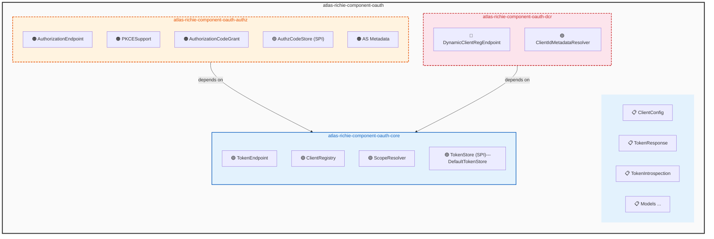

### 1.3 Dependency Diagram

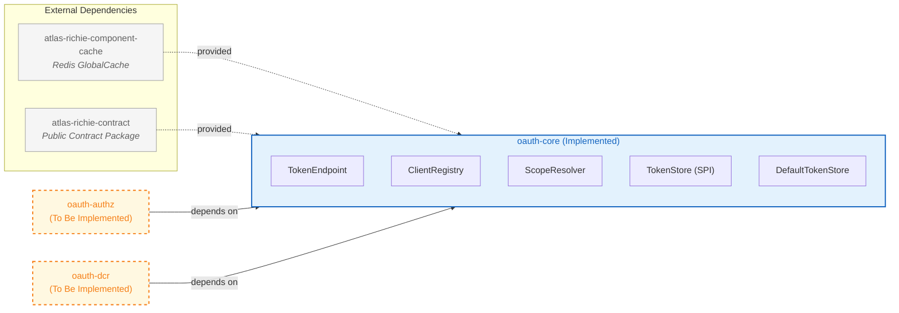

### 1.4 Technology Stack

| Technology | Version/Specification |
|--------|------------|
| Java | JDK 25 |
| Spring Boot | 4.0.6 |
| Maven | 3.9+ |
| OAuth | OAuth 2.1 (RFC 9000 Series) |
| MCP | Model Context Protocol 2025-11-25 |
| Redis | GlobalCache API |
| JWT | auth0 java-jwt |

---

## 2. Core Module (oauth-core) — Existing Design

### 2.1 Package Structure

| Package | Description | Source File Count |
|---------|------|----------|
| `com.richie.component.oauth.core` | Core components: TokenEndpoint, ClientRegistry, ScopeResolver | 3 |
| `com.richie.component.oauth.core.spi` | SPI interface: TokenStore | 1 |
| `com.richie.component.oauth.core.support` | SPI implementation: DefaultTokenStore | 1 |
| `com.richie.component.oauth.core.model` | Domain models: ClientConfig, TokenResponse, etc. | 5 |
| `com.richie.component.oauth.core.config` | Configuration classes: OAuth2Properties, OAuth2RedisKey, OAuth2AutoConfiguration | 3 |
| `com.richie.component.oauth.core.exception` | Exception classes: InvalidClientException, InvalidGrantException, TokenExpiredException | 3 |

### 2.2 Package Map

```
com.richie.component.oauth.core
├── TokenEndpoint.java          # OAuth Token endpoint (@Component)
├── ClientRegistry.java         # Client registry (@Component)
├── ScopeResolver.java          # Scope path resolver (@Component)
├── spi/
│   └── TokenStore.java         # Token storage SPI interface
├── support/
│   └── DefaultTokenStore.java  # Redis implementation
├── model/
│   ├── GrantType.java          # Grant Type enum
│   ├── ClientConfig.java       # Client configuration model
│   ├── TokenResponse.java      # Token response model
│   ├── TokenIntrospection.java # Token introspection response
│   └── OAuth2ErrorResponse.java # OAuth2 error response
├── config/
│   ├── OAuth2Properties.java   # Configuration properties class
│   ├── OAuth2RedisKey.java     # Redis Key enum
│   └── OAuth2AutoConfiguration.java # Auto-configuration class
└── exception/
    ├── InvalidClientException.java
    ├── InvalidGrantException.java
    └── TokenExpiredException.java
```

### 2.3 Public API Design

#### 2.3.1 TokenEndpoint

**Class Responsibility**: OAuth 2.1 Token endpoint, responsible for the full token lifecycle management: issuance, refresh, validation, and revocation.

**Constructor**:
```java
public TokenEndpoint(TokenStore tokenStore, ClientRegistry clientRegistry, OAuth2Properties properties)
```

**Public Methods**:

| Method Signature | Description | Return Type | Throws Exception |
|---------|------|---------|---------|
| `TokenResponse generateToken(String clientId, String clientSecret, String ip)` | Issue token using client_credentials mode | `TokenResponse` | `BusinessException` |
| `TokenResponse refreshToken(String refreshToken, String ip)` | Refresh token using refresh_token mode (with distributed lock) | `TokenResponse` | `BusinessException` |
| `void revokeToken(String token, String tokenTypeHint)` | Revoke token (access_token→blacklist, refresh_token→delete) | `void` | - |
| `TokenIntrospection introspectToken(String accessToken)` | Introspect token (returns active + clientId + scope) | `TokenIntrospection` | - |
| `ClientConfig verifyAccessToken(String accessToken)` | Verify JWT signature, expiration, blacklist; returns client config or null | `ClientConfig` | - |
| `List<String> getIpWhitelist(String accessToken)` | Get client's IP whitelist | `List<String>` | - |

#### 2.3.2 ClientRegistry

**Class Responsibility**: Client registry, responsible for reading and writing OAuth client configurations, with data stored in Redis Hash.

**Constructor**:
```java
public ClientRegistry()
```

**Public Methods**:

| Method Signature | Description | Return Type |
|---------|------|---------|
| `<T> T getClientConfig(String clientId, ClientConfig.Field field)` | Get single field value from Redis Hash | `T` |
| `Map<ClientConfig.Field, Object> getClientConfig(String clientId, Field f1, Field f2)` | Get multiple field values in batch | `Map<Field, Object>` |
| `boolean isClientValid(String clientId)` | Check if client is enabled | `boolean` |
| `boolean verifyClientSecret(String clientId, String clientSecret)` | Timing-safe comparison of client secret | `boolean` |
| `ClientConfig registerTestClient(String clientName)` | Register test client to Redis | `ClientConfig` |

#### 2.3.3 ScopeResolver

**Class Responsibility**: Scope path resolver that uses Ant path matching to find the Scopes required by an interface based on the request path and HTTP method.

**Constructor**:
```java
public ScopeResolver()
```

**Public Methods**:

| Method Signature | Description | Return Type |
|---------|------|---------|
| `List<String> getRequiredScopes(String path, String method)` | Get required scopes by path and method (AntPath matching) | `List<String>` |
| `boolean verifyScope(Set<String> tokenScopes, List<String> requiredScopes)` | Verify whether token scopes meet requirements (OR logic) | `boolean` |
| `Set<String> extractScopesFromToken(String accessToken)` | Parse scope claim from JWT | `Set<String>` |

### 2.4 TokenEndpoint State Machine

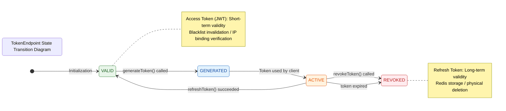

### 2.5 TokenStore SPI Extension Design

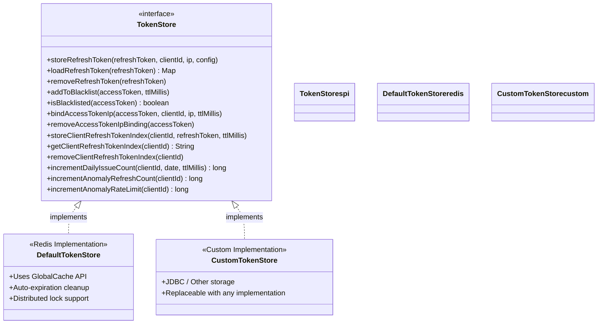

### 2.6 Configuration Properties Table

**Configuration Prefix**: `platform.component.oauth`

| Property Name | Type | Default Value | Description |
|--------|------|--------|------|
| `enabled` | boolean | `false` | Whether to enable the OAuth 2.1 component |
| `tokenSecret` | String | - | Token signing secret (32 chars recommended) |
| `defaultTokenValidDuration` | Integer | `2` | Default access_token validity (hours) |
| `defaultRefreshTokenValidDuration` | Integer | `720` | Default refresh_token validity (hours, i.e., 30 days) |
| `revokePreviousTokensOnIssue` | boolean | `false` | Whether to immediately revoke old tokens when issuing a new token |
| `enableDailyIssueLimit` | boolean | `true` | Whether to enable daily issuance count limit |

### 2.7 Redis Key Schema Table

| Key Enum | Prefix | Template | Description |
|---------|------|------|------|
| `OAUTH2_CLIENT_CONFIG` | `third-party-client:` | `third-party-client:%s` | Client configuration (Hash) |
| `OAUTH2_REFRESH_TOKEN` | `refresh-token:` | `refresh-token:%s` | Refresh Token storage (Hash) |
| `OAUTH2_CLIENT_REFRESH_TOKEN_INDEX` | `client-refresh-token:` | `client-refresh-token:%s` | Client Refresh Token index |
| `OAUTH2_DAILY_TOKEN_ISSUE_COUNT` | `oauth2:daily:issue-count:` | `oauth2:daily:issue-count:%s` | Daily issuance count |
| `OAUTH2_REFRESH_TOKEN_LOCK` | `refresh-token-lock:` | `refresh-token-lock:%s` | Refresh Token distributed lock |
| `OAUTH2_ACCESS_TOKEN_BLACKLIST` | `access-token-blacklist:` | `access-token-blacklist:%s` | Access Token blacklist |
| `OAUTH2_ACCESS_TOKEN_IP_BIND` | `access-token-ip:` | `access-token-ip:%s` | Access Token IP binding |
| `OAUTH2_ANOMALY_REFRESH_COUNT` | `oauth2:anomaly:refresh:count:` | `oauth2:anomaly:refresh:count:%s` | Anomalous refresh count |
| `OAUTH2_ANOMALY_RATELIMIT` | `oauth2:anomaly:ratelimit:oauth2:` | `oauth2:anomaly:ratelimit:oauth2:%s` | Anomalous rate limit count |
| `OAUTH2_ANOMALY_TOKEN_IPS` | `oauth2:anomaly:token:ips:` | `oauth2:anomaly:token:ips:%s` | Anomalous Token IP list |
| `OAUTH2_AUDIT_EVENTS` | `oauth2:audit:events` | `oauth2:audit:events` | Audit events (List) |
| `GATEWAY_API_INDEX` | `gateway:api:index` | `gateway:api:index` | Gateway API index (Set) |
| `GATEWAY_API_CONFIG` | `gateway:api:` | `gateway:api:%s` | Gateway API configuration (Hash) |
| `GATEWAY_API_SCOPES` | `gateway:api:scopes:` | `gateway:api:scopes:%s` | API corresponding scopes (Set) |
| `GATEWAY_SCOPE_CONFIG` | `gateway:scope:` | `gateway:scope:%s` | Scope configuration |

### 2.8 Sequence Diagrams

#### 2.8.1 Client Credentials Grant Flow (generateToken)

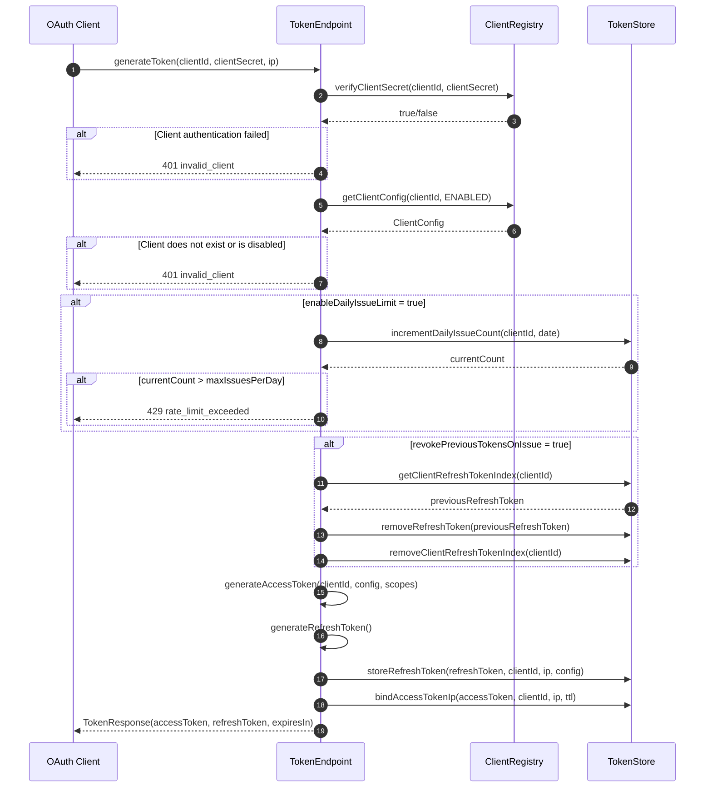

#### 2.8.2 Token Refresh Flow (refreshToken)

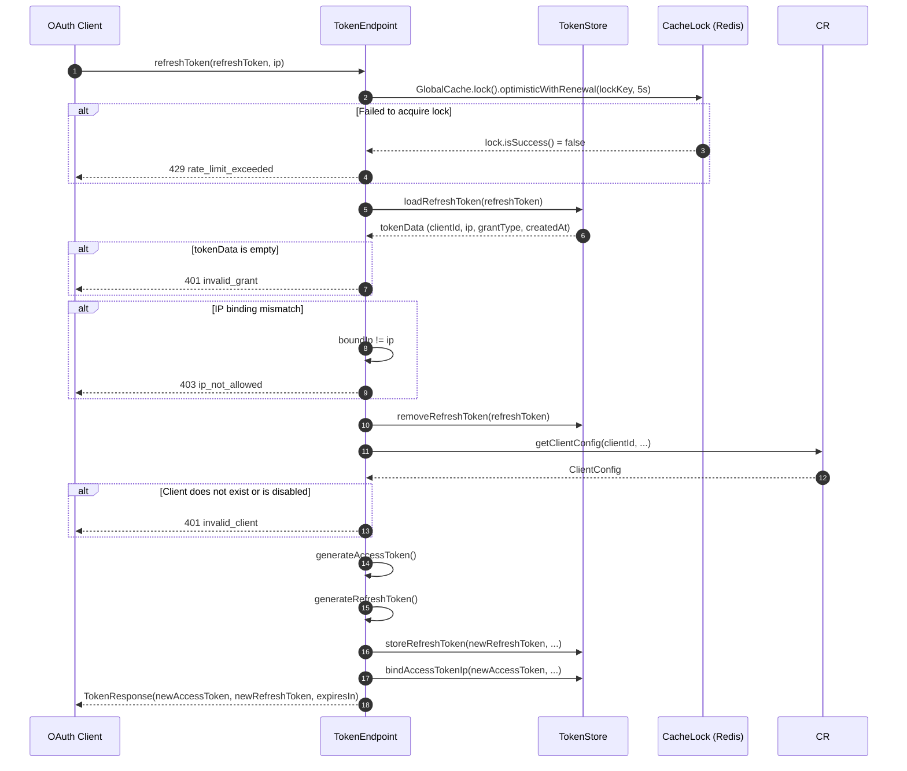

#### 2.8.3 Token Revocation Flow (revokeToken)

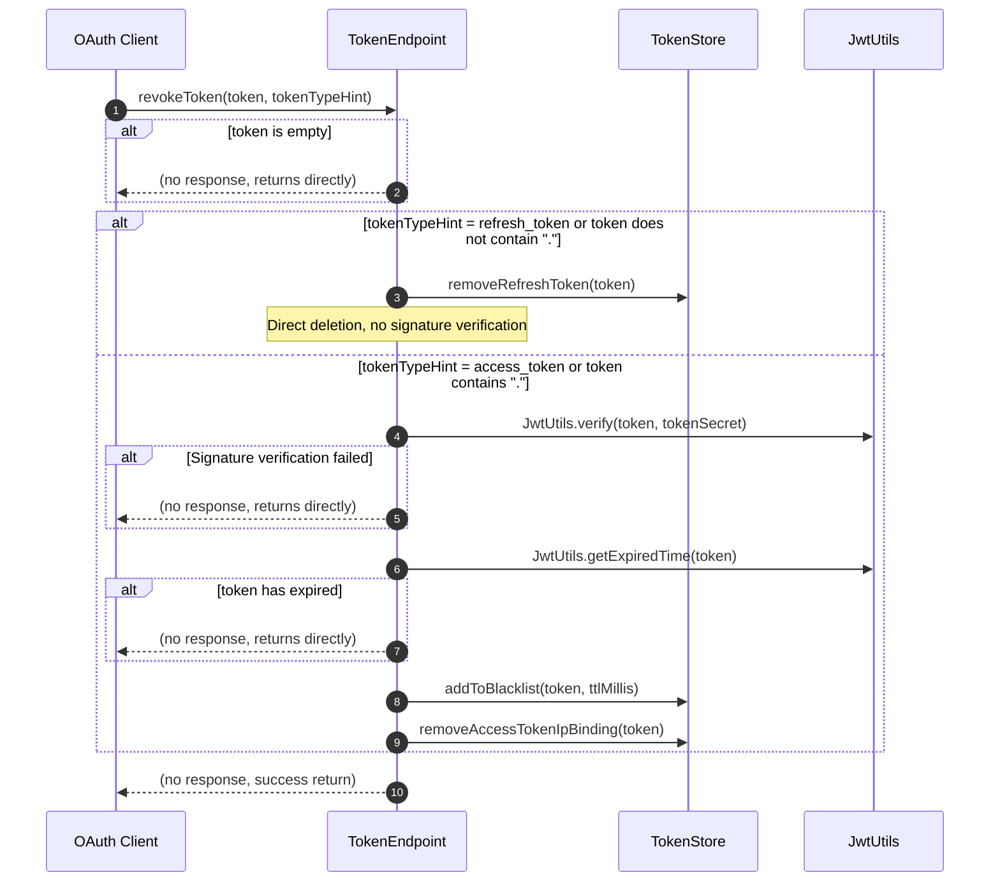

#### 2.8.4 Token Validation Flow (verifyAccessToken)

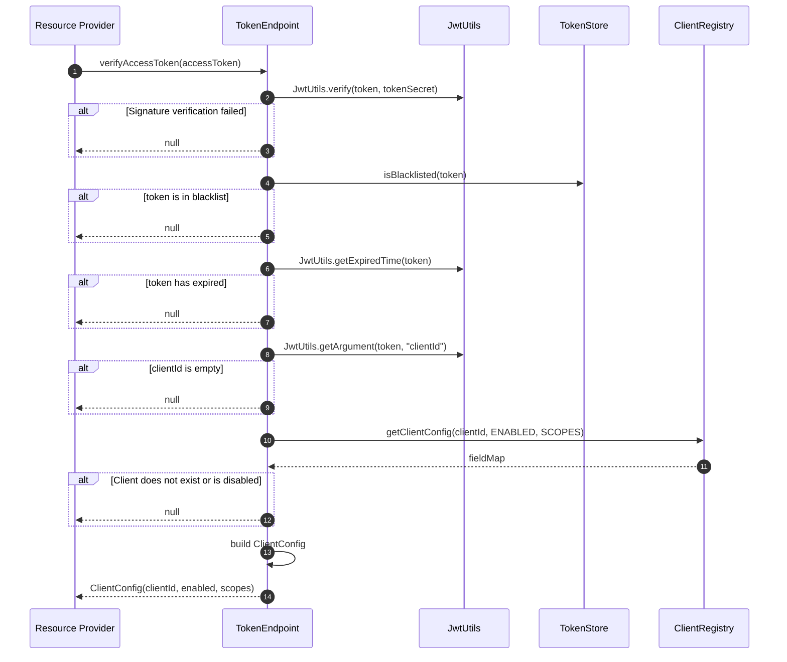

---

## 3. Authorization Code Module (oauth-authz) — Design Proposal

### 3.1 Design Goals

Implement the OAuth 2.1 Authorization Code + PKCE flow, following the [MCP Authorization Spec (2025-11-25)](https://modelcontextprotocol.io/specification/2025-11-25/basic/authorization) specification.

### 3.2 Module Structure

```
atlas-richie-component-oauth-authz
├── pom.xml
└── src/main/java/com/richie/component/oauth/authz/
    ├── AuthorizationEndpoint.java        # Authorization endpoint
    ├── AuthorizationCodeGrant.java      # Authorization code grant handler
    ├── PKCESupport.java                 # PKCE S256 support
    ├── AuthorizationCodeStore.java       # Authorization code storage SPI
    ├── DefaultAuthorizationCodeStore.java # Redis implementation
    ├── AuthorizationServerMetadata.java  # RFC 8414 metadata
    └── config/
        └── OAuth2AuthzAutoConfiguration.java
```

### 3.3 Public API Design

#### 3.3.1 AuthorizationEndpoint

**Class Responsibility**: Handles OAuth 2.1 authorization endpoint requests, including authorization requests (GET /authorize) and user authorization consent (POST /authorize).

**Package**: `com.richie.component.oauth.authz`

**Constructor**:
```java
public AuthorizationEndpoint(
    ClientRegistry clientRegistry,
    AuthorizationCodeStore authzCodeStore,
    PKCESupport pkceSupport,
    OAuth2Properties properties
)
```

**Public Methods**:

| Method Signature | Description | Return Type |
|---------|------|---------|
| `void handleAuthorizationRequest(HttpServletRequest request, HttpServletResponse response)` | Handle GET /authorize, redirect to login page | `void` |
| `void handleAuthorizationConsent(HttpServletRequest request, HttpServletResponse response)` | Handle POST /authorize (user grants consent), generate authorization code and redirect | `void` |

**Internal Methods (Private)**:

| Method Signature | Description | Return Type |
|---------|------|---------|
| `AuthorizationCode generateAuthorizationCode(String clientId, String redirectUri, String codeChallenge, String state)` | Generate authorization code and store | `AuthorizationCode` |

#### 3.3.2 AuthorizationCodeStore (SPI)

**Class Responsibility**: Defines the contract for authorization code storage, supporting PKCE binding.

**Package**: `com.richie.component.oauth.authz.spi`

```java
public interface AuthorizationCodeStore {
    /**
     * Store authorization code
     * @param code Authorization code
     * @param clientId Client ID
     * @param redirectUri Redirect URI
     * @param codeChallenge PKCE code_challenge
     * @param codeChallengeMethod PKCE method (S256)
     * @param scopes Requested scopes
     * @param userId User ID
     * @param ttlSeconds Validity period (seconds, default 600)
     */
    void storeAuthorizationCode(
        String code,
        String clientId,
        String redirectUri,
        String codeChallenge,
        String codeChallengeMethod,
        List<String> scopes,
        String userId,
        long ttlSeconds
    );

    /**
     * Load authorization code
     * @param code Authorization code
     * @return Map of authorization code data, including clientId, redirectUri, codeChallenge, scopes, userId, etc.
     */
    Map<String, String> loadAuthorizationCode(String code);

    /**
     * Delete authorization code after use (one-time)
     * @param code Authorization code
     */
    void consumeAuthorizationCode(String code);
}
```

#### 3.3.3 DefaultAuthorizationCodeStore

**Class Responsibility**: Redis implementation of AuthorizationCodeStore.

**Package**: `com.richie.component.oauth.authz.support`

```java
@Slf4j
public class DefaultAuthorizationCodeStore implements AuthorizationCodeStore {

    private static final long DEFAULT_TTL_SECONDS = 600; // 10 minutes

    @Override
    public void storeAuthorizationCode(
        String code,
        String clientId,
        String redirectUri,
        String codeChallenge,
        String codeChallengeMethod,
        List<String> scopes,
        String userId,
        long ttlSeconds
    ) {
        String key = OAuth2RedisKey.OAUTH2_AUTHZ_CODE.getKey(code);
        Map<String, Object> data = Map.of(
            "clientId", clientId,
            "redirectUri", redirectUri,
            "codeChallenge", codeChallenge != null ? codeChallenge : "",
            "codeChallengeMethod", codeChallengeMethod != null ? codeChallengeMethod : "",
            "scopes", String.join(" ", scopes != null ? scopes : Collections.emptyList()),
            "userId", userId != null ? userId : "",
            "createdAt", String.valueOf(System.currentTimeMillis())
        );
        long ttl = ttlSeconds > 0 ? ttlSeconds : DEFAULT_TTL_SECONDS;
        GlobalCache.struct().set(key, data, TimeUnit.SECONDS.toMillis(ttl));
        log.debug("Store authorization code: code={}, clientId={}, ttl={}s", code, clientId, ttl);
    }

    @Override
    @SuppressWarnings("unchecked")
    public Map<String, String> loadAuthorizationCode(String code) {
        String key = OAuth2RedisKey.OAUTH2_AUTHZ_CODE.getKey(code);
        return GlobalCache.field().getAll(key, String.class);
    }

    @Override
    public void consumeAuthorizationCode(String code) {
        String key = OAuth2RedisKey.OAUTH2_AUTHZ_CODE.getKey(code);
        GlobalCache.key().removeCache(key);
        log.debug("Consume authorization code: code={}", code);
    }
}
```

#### 3.3.4 PKCESupport

**Class Responsibility**: PKCE S256 challenge generation and verification.

**Package**: `com.richie.component.oauth.authz`

```java
@Slf4j
@Component
public class PKCESupport {

    /**
     * Generate PKCE code_verifier
     * @return 43-128 character random string
     */
    public String generateCodeVerifier() {
        byte[] bytes = new byte[32];
        new SecureRandom().nextBytes(bytes);
        return Base64.getUrlEncoder().withoutPadding().encodeToString(bytes);
    }

    /**
     * Generate PKCE code_challenge (S256)
     * @param codeVerifier code_verifier
     * @return BASE64URL(SHA256(code_verifier))
     */
    public String generateCodeChallenge(String codeVerifier) {
        if (codeVerifier == null || codeVerifier.isBlank()) {
            throw new IllegalArgumentException("code_verifier cannot be empty");
        }
        try {
            MessageDigest digest = MessageDigest.getInstance("SHA-256");
            byte[] hash = digest.digest(codeVerifier.getBytes(StandardCharsets.US_ASCII));
            return Base64.getUrlEncoder().withoutPadding().encodeToString(hash);
        } catch (NoSuchAlgorithmException e) {
            throw new RuntimeException("SHA-256 algorithm unavailable", e);
        }
    }

    /**
     * Verify that PKCE code_challenge matches code_verifier
     * @param codeChallenge code_challenge
     * @param codeChallengeMethod method (must be S256)
     * @param codeVerifier code_verifier
     * @return whether it matches
     */
    public boolean verifyChallenge(String codeChallenge, String codeChallengeMethod, String codeVerifier) {
        if (codeChallenge == null || codeVerifier == null) {
            return false;
        }
        if (!"S256".equalsIgnoreCase(codeChallengeMethod)) {
            log.warn("Unsupported PKCE method: {}", codeChallengeMethod);
            return false;
        }
        String expectedChallenge = generateCodeChallenge(codeVerifier);
        return MessageDigest.isEqual(
            codeChallenge.getBytes(StandardCharsets.UTF_8),
            expectedChallenge.getBytes(StandardCharsets.UTF_8)
        );
    }
}
```

#### 3.3.5 AuthorizationCodeGrant

**Class Responsibility**: Handles the code→token exchange flow in authorization code mode. Requires extending the `generateToken` method of TokenEndpoint.

**Package**: `com.richie.component.oauth.authz`

```java
@Slf4j
@Component
public class AuthorizationCodeGrant {

    private final TokenStore tokenStore;
    private final ClientRegistry clientRegistry;
    private final AuthorizationCodeStore authzCodeStore;
    private final PKCESupport pkceSupport;
    private final OAuth2Properties properties;

    public AuthorizationCodeGrant(
        TokenStore tokenStore,
        ClientRegistry clientRegistry,
        AuthorizationCodeStore authzCodeStore,
        PKCESupport pkceSupport,
        OAuth2Properties properties
    ) {
        this.tokenStore = tokenStore;
        this.clientRegistry = clientRegistry;
        this.authzCodeStore = authzCodeStore;
        this.pkceSupport = pkceSupport;
        this.properties = properties;
    }

    /**
     * Exchange authorization code for Token
     * @param clientId Client ID
     * @param clientSecret Client secret
     * @param code Authorization code
     * @param codeVerifier PKCE code_verifier
     * @param redirectUri Redirect URI (must match the authorization request)
     * @param resource RFC 8707 resource parameter
     * @param ip Client IP
     * @return Token response
     */
    public TokenResponse exchangeCodeForToken(
        String clientId,
        String clientSecret,
        String code,
        String codeVerifier,
        String redirectUri,
        String resource,
        String ip
    ) {
        // 1. Verify client credentials
        if (!clientRegistry.verifyClientSecret(clientId, clientSecret)) {
            throw new BusinessException(OAuth2Constants.ERROR_INVALID_CLIENT, "Client authentication failed");
        }

        // 2. Load and verify authorization code
        Map<String, String> codeData = authzCodeStore.loadAuthorizationCode(code);
        if (codeData == null || codeData.isEmpty()) {
            throw new BusinessException(OAuth2Constants.ERROR_INVALID_GRANT, "Authorization code is invalid or has expired");
        }

        // 3. Verify client_id matches
        if (!clientId.equals(codeData.get("clientId"))) {
            throw new BusinessException(OAuth2Constants.ERROR_INVALID_GRANT, "Client ID mismatch");
        }

        // 4. Verify redirect_uri matches
        String storedRedirectUri = codeData.get("redirectUri");
        if (StringUtils.isNotBlank(redirectUri) && !redirectUri.equals(storedRedirectUri)) {
            throw new BusinessException(OAuth2Constants.ERROR_INVALID_GRANT, "Redirect URI mismatch");
        }

        // 5. Verify PKCE
        String codeChallenge = codeData.get("codeChallenge");
        String codeChallengeMethod = codeData.get("codeChallengeMethod");
        if (StringUtils.isNotBlank(codeChallenge) && !"plain".equalsIgnoreCase(codeChallengeMethod)) {
            if (!pkceSupport.verifyChallenge(codeChallenge, codeChallengeMethod, codeVerifier)) {
                throw new BusinessException(OAuth2Constants.ERROR_INVALID_GRANT, "PKCE verification failed");
            }
        }

        // 6. Consume authorization code (one-time use)
        authzCodeStore.consumeAuthorizationCode(code);

        // 7. Load client configuration
        ClientConfig config = loadClientConfig(clientId);
        if (config == null || !Boolean.TRUE.equals(config.getEnabled())) {
            throw new BusinessException(OAuth2Constants.ERROR_INVALID_CLIENT, "Client does not exist or is disabled");
        }

        // 8. Parse scopes
        String scopesStr = codeData.get("scopes");
        List<String> scopes = StringUtils.isNotBlank(scopesStr)
            ? Arrays.asList(scopesStr.split("\\s+"))
            : (config.getScopes() != null ? config.getScopes() : Collections.emptyList());

        // 9. Generate Token
        String accessToken = generateAccessToken(clientId, config, scopes, resource);
        String refreshToken = generateRefreshToken();

        // 10. Store refresh_token
        tokenStore.storeRefreshToken(refreshToken, clientId, ip, config);

        // 11. Bind IP
        long expiresIn = config.getTokenValidDuration() != null
            ? config.getTokenValidDuration() * 3600L
            : OAuth2Constants.DEFAULT_ACCESS_TOKEN_EXPIRES_IN;
        long ttlMillis = expiresIn * 1000L;
        tokenStore.bindAccessTokenIp(accessToken, clientId, ip, ttlMillis);

        return TokenResponse.builder()
            .accessToken(accessToken)
            .tokenType(OAuth2Constants.TOKEN_TYPE_BEARER)
            .expiresIn(expiresIn)
            .refreshToken(refreshToken)
            .scope(String.join(" ", scopes))
            .build();
    }

    // ... private helper methods (generateAccessToken, generateRefreshToken, loadClientConfig)
}
```

#### 3.3.6 AuthorizationServerMetadata

**Class Responsibility**: RFC 8414 Authorization Server Metadata endpoint.

**Package**: `com.richie.component.oauth.authz`

```java
/**
 * RFC 8414 Authorization Server Metadata
 * Endpoint: /.well-known/oauth-authorization-server
 */
@Data
@Builder
@NoArgsConstructor
@AllArgsConstructor
public class AuthorizationServerMetadata {

    /**
     * Authorization server identifier
     */
    private String issuer;

    /**
     * RFC 8414 authorization endpoint URL
     */
    private String authorizationEndpoint;

    /**
     * RFC 7009 token revocation endpoint URL
     */
    private String tokenEndpoint;

    /**
     * RFC 7662 token introspection endpoint URL
     */
    private String introspectionEndpoint;

    /**
     * Supported OAuth 2.0 response types
     */
    private List<String> responseTypesSupported;

    /**
     * Supported PKCE code_challenge methods
     */
    private List<String> codeChallengeMethodsSupported;

    /**
     * Supported grant_types
     */
    private List<String> grantTypesSupported;

    /**
     * Supported scopes
     */
    private List<String> scopesSupported;
}
```

### 3.4 TokenEndpoint Extension Requirements

To support the `authorization_code` grant, TokenEndpoint needs to add the following methods or overload existing methods:

```java
// New method: support authorization_code grant
public TokenResponse generateToken(
    String clientId,
    String clientSecret,
    String code,           // Authorization code
    String codeVerifier,    // PKCE verifier
    String redirectUri,     // Redirect URI
    String resource,       // RFC 8707 resource parameter
    String ip
);

// New method: support resource parameter for access_token generation
private String generateAccessToken(String clientId, ClientConfig config, List<String> scopes, String resource);
```

### 3.5 RFC 8707 Resource Parameter Support

RFC 8707 defines the `resource` parameter, used to specify the target resource server. Implementation points:

1. **JWT aud claim**: When resource is specified, the `aud` claim of the generated JWT access_token should contain the resource URI
2. **Audience Validation**: Add audience validation logic in `verifyAccessToken`

```java
// Extension in TokenEndpoint
private String generateAccessToken(String clientId, ClientConfig config, List<String> scopes, String resource) {
    // ... existing logic ...

    Map<String, String> params = new HashMap<>();
    params.put(OAuth2Constants.JWT_CLAIM_CLIENT_ID, clientId);
    params.put(OAuth2Constants.JWT_CLAIM_TYPE, OAuth2Constants.JWT_CLAIM_TYPE_THIRD_PARTY);
    if (finalScopes != null && !finalScopes.isEmpty()) {
        params.put(OAuth2Constants.JWT_CLAIM_SCOPE, String.join(" ", finalScopes));
    }

    // RFC 8707: resource parameter → aud claim
    if (StringUtils.isNotBlank(resource)) {
        // audience can be a single URI or an array
        params.put("aud", resource);
    }

    return generateJwtToken(clientId, params, tokenSecret, expiredTime);
}
```

### 3.6 Sequence Diagrams

#### 3.6.1 Authorization Code + PKCE Flow

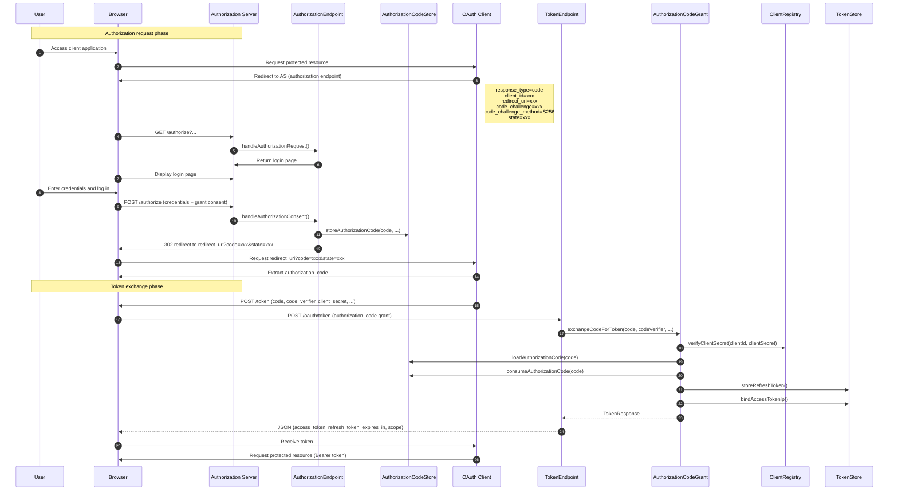

#### 3.6.2 Authorization Server Metadata Discovery Flow

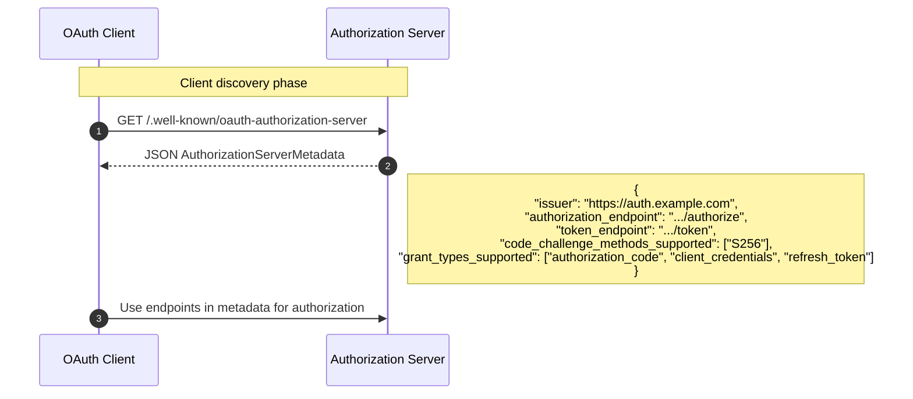

#### 3.6.3 Step-Up Authorization Flow (Insufficient Scope)

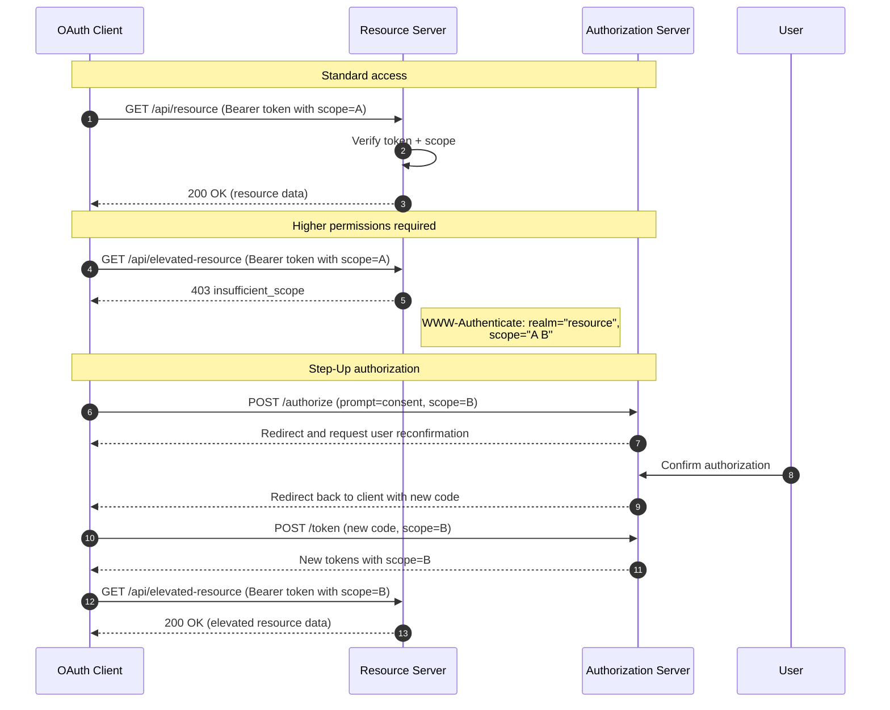

---

## 4. Dynamic Client Registration Module (oauth-dcr) — Design Proposal

### 4.1 Design Goals

Implement RFC 7591 Dynamic Client Registration Protocol and Client ID Metadata Documents support.

### 4.2 Module Structure

```
atlas-richie-component-oauth-dcr
├── pom.xml
└── src/main/java/com/richie/component/oauth/dcr/
    ├── DynamicClientRegistrationEndpoint.java  # DCR endpoint
    ├── ClientRegistrationRequest.java         # DCR request DTO
    ├── ClientRegistrationResponse.java        # DCR response DTO
    ├── ClientIdMetadataDocumentResolver.java  # Client ID Metadata SPI
    ├── DefaultClientIdMetadataDocumentResolver.java # Default implementation
    ├── SSRFProtection.java                    # SSRF protection
    ├── ClientIdMetadataDocument.java         # Client ID Metadata Document
    └── config/
        └── OAuth2DCRAutoConfiguration.java
```

### 4.3 Public API Design

#### 4.3.1 DynamicClientRegistrationEndpoint

**Class Responsibility**: Handles dynamic client registration requests (POST /register).

**Package**: `com.richie.component.oauth.dcr`

**Constructor**:
```java
public DynamicClientRegistrationEndpoint(
    ClientRegistry clientRegistry,
    ClientIdMetadataDocumentResolver metadataResolver,
    OAuth2Properties properties
)
```

**Public Methods**:

| Method Signature | Description | Return Type |
|---------|------|---------|
| `ClientRegistrationResponse registerClient(ClientRegistrationRequest request, HttpServletRequest httpRequest)` | Handle client registration request | `ClientRegistrationResponse` |
| `ClientRegistrationResponse updateClient(String clientId, ClientRegistrationRequest request, HttpServletRequest httpRequest)` | Update registered client | `ClientRegistrationResponse` |

#### 4.3.2 ClientRegistrationRequest

**Package**: `com.richie.component.oauth.dcr.dto`

```java
@Data
@Builder
@NoArgsConstructor
@AllArgsConstructor
public class ClientRegistrationRequest {

    /**
     * Client name
     */
    private String clientName;

    /**
     * RFC 7591 required OAuth 2.0 client URI
     */
    private String clientUri;

    /**
     * Client icon URL
     */
    private String logoUri;

    /**
     * Allowed redirect URI list
     */
    private List<String> redirectUris;

    /**
     * Token endpoint authentication method
     */
    private String tokenEndpointAuthMethod;

    /**
     * Requested grant_types
     */
    private List<String> grantTypes;

    /**
     * Requested scopes
     */
    private List<String> scopes;

    /**
     * Client public key (JWK or JWK Set URL)
     */
    private String jwks;
    private String jwksUri;

    /**
     * Client software identifier
     */
    private String softwareId;
    private String softwareVersion;

    /**
     * RFC 8707 resource metadata
     */
    private List<String> resource;
}
```

#### 4.3.3 ClientRegistrationResponse

**Package**: `com.richie.component.oauth.dcr.dto`

```java
@Data
@Builder
@NoArgsConstructor
@AllArgsConstructor
public class ClientRegistrationResponse {

    /**
     * Client ID (auto-generated)
     */
    private String clientId;

    /**
     * Client secret (auto-generated, returned only when tokenEndpointAuthMethod is not none)
     */
    private String clientSecret;

    /**
     * Client secret expiration time
     */
    private Long clientSecretExpiresAt;

    /**
     * Registration time
     */
    private Long registrationAccessToken;

    /**
     * Registration client URI
     */
    private String registrationClientUri;

    /**
     * Client name
     */
    private String clientName;

    /**
     * Allowed redirect URI list
     */
    private List<String> redirectUris;

    /**
     * Token endpoint authentication method
     */
    private String tokenEndpointAuthMethod;

    /**
     * Requested grant_types
     */
    private List<String> grantTypes;

    /**
     * Requested scopes
     */
    private List<String> scopes;

    /**
     * Client URI
     */
    private String clientUri;

    /**
     * Icon URI
     */
    private String logoUri;

    /**
     * RFC 8707 resource metadata
     */
    private List<String> resource;
}
```

#### 4.3.4 ClientIdMetadataDocumentResolver (SPI)

**Class Responsibility**: Resolves Client ID Metadata Document, supporting RFC 7591 extensions.

**Package**: `com.richie.component.oauth.dcr.spi`

```java
public interface ClientIdMetadataDocumentResolver {

    /**
     * Resolve Client ID Metadata Document
     * @param clientId Client ID
     * @param metadataUri Metadata Document URI
     * @return Resolved Metadata Document
     */
    ClientIdMetadataDocument resolve(String clientId, String metadataUri);

    /**
     * Get the client's default Metadata Document URI
     * @param clientId Client ID
     * @return Metadata Document URI, or null if none
     */
    String getMetadataUri(String clientId);
}
```

#### 4.3.5 ClientIdMetadataDocument

**Package**: `com.richie.component.oauth.dcr.model`

```java
@Data
@Builder
@NoArgsConstructor
@AllArgsConstructor
public class ClientIdMetadataDocument {

    /**
     * Client ID
     */
    private String clientId;

    /**
     * Client Secret Hash
     */
    private String clientSecret;

    /**
     * Client name
     */
    private String clientName;

    /**
     * Allowed redirect URI
     */
    private List<String> redirectUris;

    /**
     * Token endpoint authentication method
     */
    private String tokenEndpointAuthMethod;

    /**
     * Grant Types
     */
    private List<String> grantTypes;

    /**
     * Scopes
     */
    private List<String> scopes;

    /**
     * Contact emails
     */
    private List<String> contacts;

    /**
     * Client URI
     */
    private String clientUri;

    /**
     * Logo URI
     */
    private String logoUri;

    /**
     * Owner
     */
    private String owner;

    /**
     * Suspension date
     */
    String tosUri;
    String policyUri;

    /**
     * JWK Set URI
     */
    private String jwksUri;

    /**
     * RFC 8707 Resource metadata
     */
    private List<String> resource;
}
```

#### 4.3.6 SSRFProtection

**Class Responsibility**: Prevents Server-Side Request Forgery attacks.

**Package**: `com.richie.component.oauth.dcr.support`

```java
@Slf4j
@Component
public class SSRFProtection {

    private final GlobalCache globalCache;
    private final List<String> allowedDomains;
    private final Duration cacheTtl;

    public SSRFProtection(
        GlobalCache globalCache,
        @Value("${platform.component.oauth.dcr.allowed-domains:}") List<String> allowedDomains,
        @Value("${platform.component.oauth.dcr.ssrf-cache-ttl:3600}") long cacheTtlSeconds
    ) {
        this.globalCache = globalCache;
        this.allowedDomains = allowedDomains;
        this.cacheTtl = Duration.ofSeconds(cacheTtlSeconds);
    }

    /**
     * Verify whether URL is safe (prevent SSRF)
     * @param url URL to verify
     * @return whether it is safe
     */
    public boolean isUrlSafe(String url) {
        if (StringUtils.isBlank(url)) {
            return false;
        }

        try {
            URL parsedUrl = new URL(url);

            // Must be HTTPS
            if (!"https".equalsIgnoreCase(parsedUrl.getProtocol())) {
                log.warn("SSRF protection: non-HTTPS URL: {}", url);
                return false;
            }

            String host = parsedUrl.getHost().toLowerCase();

            // Check whether it is an IP address (direct IP access not allowed)
            if (isIpAddress(host)) {
                log.warn("SSRF protection: IP address not allowed: {}", url);
                return false;
            }

            // Check whether it is an internal/reserved address
            if (isReservedAddress(host)) {
                log.warn("SSRF protection: internal/reserved address: {}", url);
                return false;
            }

            // Check domain whitelist
            if (!allowedDomains.isEmpty() && !isInAllowList(host)) {
                log.warn("SSRF protection: domain not in whitelist: {}", url);
                return false;
            }

            // DNS Rebinding protection: resolve and cache IP
            String resolvedIp = resolveAndCacheDns(host);
            if (resolvedIp == null) {
                return false;
            }

            // Resolved IP also cannot be internal
            if (isReservedAddress(resolvedIp)) {
                log.warn("SSRF protection: DNS resolved to internal address: {}", resolvedIp);
                return false;
            }

            return true;
        } catch (MalformedURLException e) {
            log.warn("SSRF protection: invalid URL: {}", url);
            return false;
        }
    }

    private String resolveAndCacheDns(String host) {
        String cacheKey = "ssrf:dns:" + host;
        String cachedIp = globalCache.value().get(cacheKey, String.class);

        if (cachedIp != null) {
            return cachedIp;
        }

        try {
            InetAddress address = InetAddress.getByName(host);
            String ip = address.getHostAddress();
            globalCache.value().set(cacheKey, ip, cacheTtl.toMillis());
            return ip;
        } catch (UnknownHostException e) {
            log.warn("SSRF protection: DNS resolution failed: {}", host);
            return null;
        }
    }

    private boolean isIpAddress(String host) {
        return Pattern.matches("^\\d{1,3}(\\.\\d{1,3}){3}$", host)
            || Pattern.matches("^([0-9a-fA-F]{1,4}:){7}[0-9a-fA-F]{1,4}$", host);
    }

    private boolean isReservedAddress(String address) {
        // Check internal addresses, reserved addresses, etc.
        // 10.0.0.0/8, 172.16.0.0/12, 192.168.0.0/16, 127.0.0.0/8, etc.
        // Implementation omitted...
        return false;
    }

    private boolean isInAllowList(String host) {
        return allowedDomains.stream().anyMatch(domain ->
            host.equals(domain) || host.endsWith("." + domain)
        );
    }
}
```

### 4.4 Sequence Diagrams

#### 4.4.1 DCR Flow

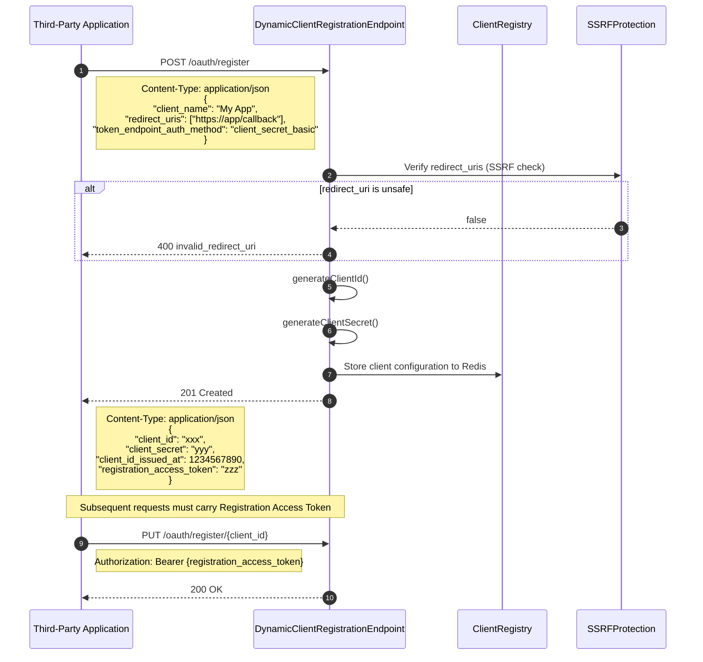

#### 4.4.2 Client ID Metadata Document Flow

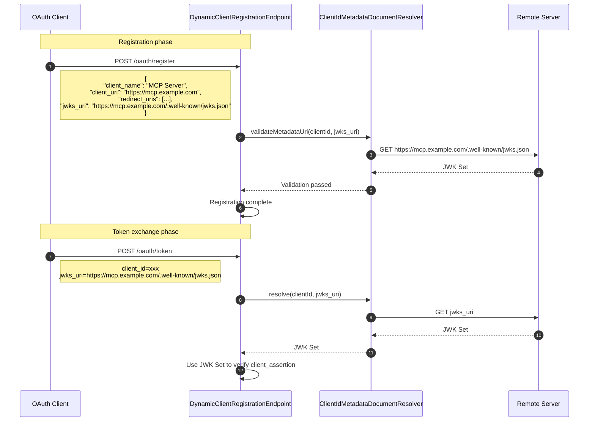

---

## 5. MCP Integration Mapping

### 5.1 MCP Role to OAuth Component Module Mapping Table

| MCP Role | OAuth Role | Atlas OAuth Component | Description |
|----------|-----------|---------------------|------|
| MCP Server | Resource Server (Protected Resource) | `oauth-core` | Use `verifyAccessToken` to validate access token |
| MCP Client | OAuth Client | `oauth-authz` | Client SDK, handles authorization flow |
| Authorization Server | AS | `oauth-authz` | `AuthorizationEndpoint` + `TokenEndpoint` |
| MCP Client (Token Holder) | OAuth Client | `oauth-authz` | `AuthorizationCodeGrant` handles code-to-token exchange |

### 5.2 MCP Server Integration (Resource Server)

MCP Server acts as a Resource Server and needs to:

1. **Token Validation**: Use `TokenEndpoint.verifyAccessToken()` to validate the carried Bearer Token
2. **Scope Validation**: Use `ScopeResolver` to verify whether scopes in the Token meet interface requirements
3. **IP Binding Validation**: Use `TokenEndpoint.getIpWhitelist()` to get the whitelist and verify

```java
// MCP Server-side example
@Service
public class MCPServerResourceValidator {

    private final TokenEndpoint tokenEndpoint;
    private final ScopeResolver scopeResolver;

    public boolean validateRequest(String accessToken, String path, String method, String clientIp) {
        // 1. Verify Token
        ClientConfig config = tokenEndpoint.verifyAccessToken(accessToken);
        if (config == null) {
            return false;
        }

        // 2. Verify Scope
        List<String> requiredScopes = scopeResolver.getRequiredScopes(path, method);
        if (!requiredScopes.isEmpty()) {
            Set<String> tokenScopes = scopeResolver.extractScopesFromToken(accessToken);
            if (!scopeResolver.verifyScope(tokenScopes, requiredScopes)) {
                return false;
            }
        }

        // 3. Verify IP whitelist
        List<String> whitelist = tokenEndpoint.getIpWhitelist(accessToken);
        if (whitelist != null && !whitelist.isEmpty() && !whitelist.contains(clientIp)) {
            return false;
        }

        return true;
    }
}
```

### 5.3 Protected Resource Metadata (RFC 9728)

RFC 9728 defines Protected Resource Metadata. The MCP Server needs to expose the following endpoint:

#### 5.3.1 /.well-known/oauth-protected-resource

```java
/**
 * RFC 9728 Protected Resource Metadata
 * Endpoint: /.well-known/oauth-protected-resource
 */
@Data
@Builder
@NoArgsConstructor
@AllArgsConstructor
public class ProtectedResourceMetadata {

    /**
     * Resource server identifier
     */
    private String resource;

    /**
     * Resource server semantic version
     */
    private String resourceSemanticVersion;

    /**
     * Authorization server identifier list
     */
    private List<String> authorizationServers;

    /**
     * Protected API scopes
     */
    private List<String> scopesSupported;

    /**
     * OAuth client authentication methods supported by the resource server
     */
    private List<String> bearerMethodsSupported;

    /**
     * Supported OAuth features
     */
    private List<String> featuresSupported;
}
```

#### 5.3.2 WWW-Authenticate Header

```java
// Response header when MCP Server returns a protected resource
String wwwAuthenticate = String.format(
    "Bearer realm=\"%s\", resource_metadata=\"%s\"",
    resourceRealm,
    metadataUri
);
response.setHeader("WWW-Authenticate", wwwAuthenticate);
```

### 5.4 Scope Selection Strategy

MCP Server should define the following standard Scopes:

| Scope | Description | Typical Use |
|-------|------|---------|
| `mcp:read` | Read MCP resources | Query tool lists, context, etc. |
| `mcp:write` | Write MCP resources | Modify configuration, upload files, etc. |
| `mcp:execute` | Execute MCP operations | Call tools, execute commands, etc. |
| `mcp:admin` | Administrative functions | User management, system configuration, etc. |

### 5.5 Token Audience Binding (resource parameter)

RFC 8707 specifies that when an MCP Client requests an MCP Server:

1. **At Request Time**: The MCP Client specifies the `resource` parameter (pointing to the MCP Server URI) in the Token request
2. **At Token Generation**: `AuthorizationCodeGrant` writes `resource` into the JWT's `aud` claim
3. **At Validation**: The MCP Server verifies in `verifyAccessToken` whether the `aud` claim contains its own URI

```java
// TokenEndpoint.verifyAccessToken() extension
public ClientConfig verifyAccessToken(String accessToken, String expectedAudience) {
    ClientConfig config = verifyAccessToken(accessToken); // existing logic
    if (config == null) {
        return null;
    }

    // New: verify audience
    if (StringUtils.isNotBlank(expectedAudience)) {
        String tokenAudience = JwtUtils.getArgument(accessToken, "aud");
        if (tokenAudience == null || !tokenAudience.equals(expectedAudience)) {
            log.debug("Token audience mismatch: expected={}, actual={}", expectedAudience, tokenAudience);
            return null;
        }
    }

    return config;
}
```

---

## 6. SPI Extension Points

### 6.1 TokenStore Interface (Existing)

```java
package com.richie.component.oauth.core.spi;

/**
 * Token storage abstraction
 *
 * Defines persistence contracts for refresh_token storage, access_token blacklist, IP binding, etc.
 * Default uses Redis implementation, replaceable via SPI with JDBC or other implementations.
 */
public interface TokenStore {

    // ==================== Refresh Token ====================

    /**
     * Store Refresh Token
     */
    void storeRefreshToken(String refreshToken, String clientId, String ip, ClientConfig config);

    /**
     * Load Refresh Token
     * @return Map containing client_id, ip, grant_type, created_at, etc.
     */
    Map<String, String> loadRefreshToken(String refreshToken);

    /**
     * Delete Refresh Token
     */
    void removeRefreshToken(String refreshToken);

    // ==================== Access Token Blacklist ====================

    /**
     * Add Access Token to blacklist
     * @param accessToken Access Token
     * @param ttlMillis Remaining validity (milliseconds), used to set Redis Key expiration
     */
    void addToBlacklist(String accessToken, long ttlMillis);

    /**
     * Check whether Access Token is in blacklist
     */
    boolean isBlacklisted(String accessToken);

    // ==================== IP Binding ====================

    /**
     * Bind Access Token with IP
     */
    void bindAccessTokenIp(String accessToken, String clientId, String ip, long ttlMillis);

    /**
     * Remove Access Token IP binding
     */
    void removeAccessTokenIpBinding(String accessToken);

    // ==================== Client Refresh Token Index ====================

    /**
     * Store the client's current Refresh Token index (used for revokePreviousTokensOnIssue)
     */
    void storeClientRefreshTokenIndex(String clientId, String refreshToken, long ttlMillis);

    /**
     * Get the client's current Refresh Token index
     */
    String getClientRefreshTokenIndex(String clientId);

    /**
     * Delete the client's Refresh Token index
     */
    void removeClientRefreshTokenIndex(String clientId);

    // ==================== Rate Limiting ====================

    /**
     * Increment daily issuance count
     * @return current count
     */
    long incrementDailyIssueCount(String clientId, String date, long ttlMillis);

    /**
     * Increment anomalous refresh count
     */
    long incrementAnomalyRefreshCount(String clientId);

    /**
     * Increment anomalous rate limit count
     */
    long incrementAnomalyRateLimit(String clientId);
}
```

### 6.2 AuthorizationCodeStore (To Be Implemented)

```java
package com.richie.component.oauth.authz.spi;

/**
 * Authorization code storage abstraction
 *
 * Defines the storage and validation contract for authorization codes.
 * Supports PKCE binding to ensure one-time use of authorization codes.
 */
public interface AuthorizationCodeStore {

    /**
     * Store authorization code
     *
     * @param code Authorization code
     * @param clientId Client ID
     * @param redirectUri Redirect URI
     * @param codeChallenge PKCE code_challenge
     * @param codeChallengeMethod PKCE method (S256 or plain)
     * @param scopes Requested scopes
     * @param userId User ID
     * @param ttlSeconds Validity period (seconds, default 600)
     */
    void storeAuthorizationCode(
        String code,
        String clientId,
        String redirectUri,
        String codeChallenge,
        String codeChallengeMethod,
        List<String> scopes,
        String userId,
        long ttlSeconds
    );

    /**
     * Load authorization code
     *
     * @param code Authorization code
     * @return Map containing client_id, redirect_uri, code_challenge, scopes, user_id, etc.
     */
    Map<String, String> loadAuthorizationCode(String code);

    /**
     * Consume authorization code (one-time use, deleted after call)
     *
     * @param code Authorization code
     */
    void consumeAuthorizationCode(String code);
}
```

### 6.3 ClientIdMetadataDocumentResolver (To Be Implemented)

```java
package com.richie.component.oauth.dcr.spi;

/**
 * Client ID Metadata Document resolver abstraction
 *
 * Supports RFC 7591 extension, allowing clients to declare metadata via external documents.
 * Default implementation reads directly from Redis, extendable to load from remote URLs.
 */
public interface ClientIdMetadataDocumentResolver {

    /**
     * Resolve Client ID Metadata Document
     *
     * @param clientId Client ID
     * @param metadataUri Metadata Document URI (may be null)
     * @return Resolved Metadata Document
     */
    ClientIdMetadataDocument resolve(String clientId, String metadataUri);

    /**
     * Get the client's default Metadata Document URI
     *
     * @param clientId Client ID
     * @return Metadata Document URI, or null if none
     */
    String getMetadataUri(String clientId);
}
```

---

## 7. Security Design

### 7.1 PKCE S256 Mandatory Requirement

**Design Decision**: The OAuth 2.1 specification requires that all authorization code flows must use PKCE, and only the S256 method is supported.

**Implementation Points**:

1. When `AuthorizationEndpoint` handles authorization requests:
   - Verify that `code_challenge` is present
   - Verify that `code_challenge_method` is `S256` (reject `plain`)

2. When `AuthorizationCodeGrant` exchanges Token:
   - Use `PKCESupport.verifyChallenge()` to verify `code_verifier`
   - Return `invalid_grant` on verification failure

```java
// Validation in AuthorizationEndpoint.handleAuthorizationRequest()
if (StringUtils.isBlank(codeChallenge)) {
    throw new BusinessException("code_challenge_required", "code_challenge parameter is required");
}
if (!"S256".equalsIgnoreCase(codeChallengeMethod)) {
    throw new BusinessException("invalid_code_challenge_method", "Only S256 method is supported");
}

// Validation in AuthorizationCodeGrant.exchangeCodeForToken()
if (!pkceSupport.verifyChallenge(codeChallenge, codeChallengeMethod, codeVerifier)) {
    throw new BusinessException(OAuth2Constants.ERROR_INVALID_GRANT, "PKCE verification failed");
}
```

### 7.2 Distributed Lock (Refresh Token Refresh)

**Problem**: Prevent concurrent refresh of the same Refresh Token from causing token replacement conflicts.

**Solution**: Use Redis distributed lock (`CacheLock`) to protect the refresh operation.

```java
// TokenEndpoint.refreshToken()
String lockKey = OAuth2RedisKey.OAUTH2_REFRESH_TOKEN_LOCK.getKey(refreshToken);

try (CacheLock lock = GlobalCache.lock().optimisticWithRenewal(lockKey, 5L)) {
    if (!lock.isSuccess()) {
        throw new BusinessException(OAuth2Constants.ERROR_RATE_LIMIT_EXCEEDED,
            "Refresh token is being processed, please retry later");
    }

    // Execute refresh logic...
}
```

### 7.3 Timing-Safe Secret Comparison

**Problem**: Prevent guessing of client secrets through timing side-channel attacks.

**Solution**: Use `StringUtils.CS.equals()` for timing-safe comparison.

```java
// ClientRegistry.verifyClientSecret()
return Strings.CS.equals(storedSecret, clientSecret);
```

### 7.4 Access Token Blacklist + IP Binding

**Design**:

1. **Blacklist**: When revoking an Access Token, add it to the Redis blacklist with automatic expiration cleanup
2. **IP Binding**: Record the binding relationship between Token and IP at each issuance, with optional verification during validation

```java
// TokenEndpoint.generateToken()
tokenStore.bindAccessTokenIp(accessToken, clientId, ip, accessTokenTtlMillis);

// TokenEndpoint.verifyAccessToken() - optional extension
String boundIp = getBoundIp(accessToken);
if (boundIp != null && !boundIp.equals(requestIp)) {
    log.warn("Access token IP binding mismatch");
    return null;
}
```

### 7.5 Daily Issuance Count Limit

**Calculation Formula**:
```
maxIssuesPerDay = max(24 / tokenValidDuration, 1) + 2
```

**Examples**:
- Token validity 2 hours → maximum 14 times per day
- Token validity 4 hours → maximum 8 times per day
- Token validity 24 hours → maximum 3 times per day

### 7.6 Client ID Metadata Document SSRF Protection

**Protection Measures**:

1. **Protocol Restriction**: Only allow HTTPS
2. **IP Address Restriction**: Forbid direct use of IP addresses for access
3. **Internal Address Detection**: Forbid resolution to internal/reserved addresses
4. **Domain Whitelist**: Configurable allowed domain list
5. **DNS Cache**: Prevent DNS Rebinding attacks

```java
// SSRFProtection.isUrlSafe()
public boolean isUrlSafe(String url) {
    // 1. Protocol check
    if (!"https".equalsIgnoreCase(parsedUrl.getProtocol())) {
        return false;
    }

    // 2. IP check
    if (isIpAddress(host)) {
        return false;
    }

    // 3. Internal address check
    if (isReservedAddress(host)) {
        return false;
    }

    // 4. Whitelist check
    if (!allowedDomains.isEmpty() && !isInAllowList(host)) {
        return false;
    }

    // 5. DNS resolution + cache + resolved IP check
    String resolvedIp = resolveAndCacheDns(host);
    if (isReservedAddress(resolvedIp)) {
        return false;
    }

    return true;
}
```

---

## 8. Redis Key Extensions (oauth-authz + oauth-dcr)

### 8.1 New Redis Keys

| Key Enum | Prefix | Template | Description |
|---------|------|------|------|
| `OAUTH2_AUTHZ_CODE` | `authz-code:` | `authz-code:%s` | Authorization code storage (Hash) |
| `OAUTH2_CLIENT_META` | `client-meta:` | `client-meta:%s` | Client metadata (Hash) |
| `OAUTH2_REGISTRATION_TOKEN` | `reg-token:` | `reg-token:%s` | Registration Access Token |
| `OAUTH2_SSRF_DNS_CACHE` | `ssrf:dns:` | `ssrf:dns:%s` | SSRF DNS cache |

### 8.2 OAuth2RedisKey Extension

```java
// Add to OAuth2RedisKey enum
OAUTH2_AUTHZ_CODE("authz-code:", "authz-code:%s"),
OAUTH2_CLIENT_META("client-meta:", "client-meta:%s"),
OAUTH2_REGISTRATION_TOKEN("reg-token:", "reg-token:%s"),
OAUTH2_SSRF_DNS_CACHE("ssrf:dns:", "ssrf:dns:%s"),
```

---

## 9. Error Code Specification

| Error Code | Error Type (RFC 6749) | Description |
|--------|-------------------|------|
| `invalid_request` | invalid_request | Request parameter missing or invalid |
| `invalid_client` | invalid_client | Client authentication failed |
| `invalid_grant` | invalid_grant | Authorization code/refresh token invalid or expired |
| `unauthorized_client` | unauthorized_client | Client not authorized to use this grant type |
| `unsupported_grant_type` | unsupported_grant_type | Unsupported grant type |
| `invalid_token` | invalid_token | Access Token invalid or expired |
| `insufficient_scope` | insufficient_scope | Insufficient Token scope |
| `access_denied` | access_denied | User denied authorization |
| `rate_limit_exceeded` | (Extension) | Request rate exceeded limit |
| `ip_not_allowed` | (Extension) | IP not in whitelist |

---

## 10. Configuration Examples

### 10.1 application.yml

```yaml
platform:
  component:
    oauth:
      enabled: true
      token-secret: ${OAUTH2_TOKEN_SECRET:your-32-char-secret-key-here}
      default-token-valid-duration: 2        # 2 hours
      default-refresh-token-valid-duration: 720  # 30 days
      revoke-previous-tokens-on-issue: false
      enable-daily-issue-limit: true

    oauth-authz:
      enabled: true
      authorization-code-ttl: 600             # 10 minutes

    oauth-dcr:
      enabled: true
      allowed-domains:
        - example.com
        - trusted-partner.com
      ssrf-cache-ttl: 3600                    # 1 hour
```

### 10.2 Auto-Configuration

`@AutoConfiguration` classes for each module:

```java
// oauth-core
@AutoConfiguration
@EnableConfigurationProperties(OAuth2Properties.class)
@ComponentScan("com.richie.component.oauth.core")
public class OAuth2AutoConfiguration {}

// oauth-authz
@AutoConfiguration
@ComponentScan("com.richie.component.oauth.authz")
@Import(OAuth2AutoConfiguration.class)  // depends on core configuration
public class OAuth2AuthzAutoConfiguration {}

// oauth-dcr
@AutoConfiguration
@ComponentScan("com.richie.component.oauth.dcr")
@Import(OAuth2AutoConfiguration.class)  // depends on core configuration
public class OAuth2DCRAutoConfiguration {}
```

---

## 11. Implementation Priority

### Phase 1: oauth-authz Core (High Priority)

1. `PKCESupport` - PKCE S256 implementation
2. `AuthorizationCodeStore` SPI + `DefaultAuthorizationCodeStore`
3. `AuthorizationEndpoint` - Authorization endpoint
4. `AuthorizationCodeGrant` - Authorization code to Token
5. `TokenEndpoint` extension - support authorization_code grant + resource parameter

### Phase 2: oauth-authz Extensions (Medium Priority)

1. `AuthorizationServerMetadata` - RFC 8414
2. Step-Up Authorization support

### Phase 3: oauth-dcr (Medium Priority)

1. `DynamicClientRegistrationEndpoint` - DCR endpoint
2. `SSRFProtection` - SSRF protection
3. `ClientIdMetadataDocumentResolver` - Metadata Document resolution

### Phase 4: MCP Integration (Low Priority)

1. Protected Resource Metadata (RFC 9728)
2. MCP Server integration examples
3. Audience validation extension

---

## 12. Reference Specifications

| Specification | Title |
|------|------|
| RFC 6749 | OAuth 2.0 Authorization Framework |
| RFC 6750 | OAuth 2.0 Bearer Token Usage |
| RFC 7009 | OAuth 2.0 Token Revocation |
| RFC 7519 | JSON Web Token (JWT) |
| RFC 7521 | Assertion Framework for OAuth 2.0 |
| RFC 7591 | OAuth 2.0 Dynamic Client Registration Protocol |
| RFC 7592 | OAuth 2.0 Dynamic Client Registration Management Protocol |
| RFC 7636 | PKCE for OAuth 2.0 |
| RFC 7662 | OAuth 2.0 Token Introspection |
| RFC 8414 | OAuth 2.0 Authorization Server Metadata |
| RFC 8707 | Resource Indicators for OAuth 2.0 |
| RFC 9728 | Protected Resource Metadata |
| OAuth 2.1 | OAuth 2.1 Authorization Framework (draft) |
| MCP Authorization | Model Context Protocol Authorization Spec (2025-11-25) |

---

*Document Version: 1.0.0*
*Last Updated: 2026-06-12*
*Maintainer: richie696*
