# atlas-richie-component-oauth 系统设计文档

## 1. 架构总览

### 1.1 设计目标

本组件旨在实现以下核心目标：

1. **Gateway OAuth 2.0 → 2.1 升级**：将现有 Gateway 的 OAuth 实现从 2.0 升级到 2.1 标准，遵循 RFC 9000 系列规范
2. **MCP 共享组件**：为 Model Context Protocol (MCP) 提供标准化的 OAuth 2.1 鉴权支持，使 MCP Server 和 MCP Client 能够无缝集成到现有认证体系
3. **组件化复用**：通过 Maven 多模块设计，将 OAuth 功能拆分为可独立部署、可灵活组合的组件

### 1.2 模块关系图

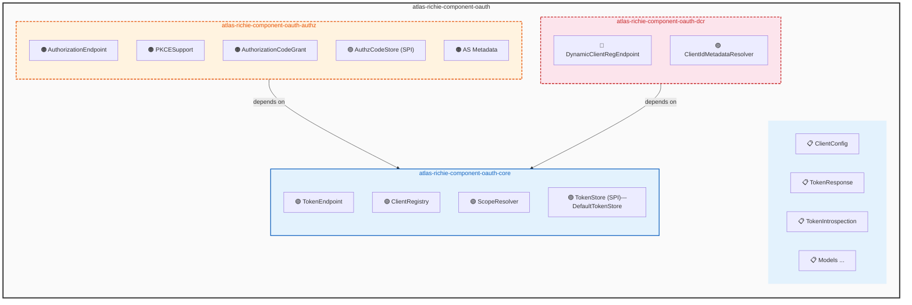

### 1.3 依赖关系图

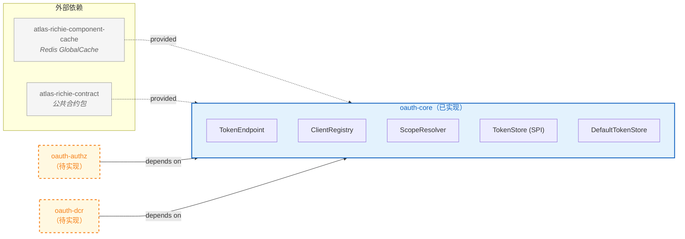

### 1.4 技术栈

| 技术项 | 版本/规范 |
|--------|-----------|
| Java | JDK 25 |
| Spring Boot | 4.0.6 |
| Maven | 3.9+ |
| OAuth | OAuth 2.1 (RFC 9000 系列) |
| MCP | Model Context Protocol 2025-11-25 |
| Redis | GlobalCache API |
| JWT | auth0 java-jwt |

---

## 2. 核心模块 (oauth-core) — 现有设计

### 2.1 Package 结构

| Package | 说明 | 源文件数 |
|---------|------|----------|
| `com.richie.component.oauth.core` | 核心组件：TokenEndpoint、ClientRegistry、ScopeResolver | 3 |
| `com.richie.component.oauth.core.spi` | SPI 接口：TokenStore | 1 |
| `com.richie.component.oauth.core.support` | SPI 实现：DefaultTokenStore | 1 |
| `com.richie.component.oauth.core.model` | 领域模型：ClientConfig、TokenResponse 等 | 5 |
| `com.richie.component.oauth.core.config` | 配置类：OAuth2Properties、OAuth2RedisKey、OAuth2AutoConfiguration | 3 |
| `com.richie.component.oauth.core.exception` | 异常类：InvalidClientException、InvalidGrantException、TokenExpiredException | 3 |

### 2.2 Package 地图

```
com.richie.component.oauth.core
├── TokenEndpoint.java          # OAuth Token 端点 (@Component)
├── ClientRegistry.java         # 客户端注册中心 (@Component)
├── ScopeResolver.java          # Scope 路径解析器 (@Component)
├── spi/
│   └── TokenStore.java         # Token 存储 SPI 接口
├── support/
│   └── DefaultTokenStore.java  # Redis 实现
├── model/
│   ├── GrantType.java          # Grant Type 枚举
│   ├── ClientConfig.java       # 客户端配置模型
│   ├── TokenResponse.java      # Token 响应模型
│   ├── TokenIntrospection.java # Token 内省响应
│   └── OAuth2ErrorResponse.java # OAuth2 错误响应
├── config/
│   ├── OAuth2Properties.java   # 配置属性类
│   ├── OAuth2RedisKey.java     # Redis Key 枚举
│   └── OAuth2AutoConfiguration.java # 自动装配类
└── exception/
    ├── InvalidClientException.java
    ├── InvalidGrantException.java
    └── TokenExpiredException.java
```

### 2.3 公共 API 设计

#### 2.3.1 TokenEndpoint

**类职责**：OAuth 2.1 Token 端点，负责 token 全生命周期管理：签发、刷新、验证、撤销。

**构造函数**：
```java
public TokenEndpoint(TokenStore tokenStore, ClientRegistry clientRegistry, OAuth2Properties properties)
```

**公共方法**：

| 方法签名 | 说明 | 返回类型 | 抛出异常 |
|---------|------|---------|---------|
| `TokenResponse generateToken(String clientId, String clientSecret, String ip)` | client_credentials 模式签发 token | `TokenResponse` | `BusinessException` |
| `TokenResponse refreshToken(String refreshToken, String ip)` | refresh_token 模式刷新 token（带分布式锁） | `TokenResponse` | `BusinessException` |
| `void revokeToken(String token, String tokenTypeHint)` | 撤销 token（access_token→黑名单，refresh_token→删除） | `void` | - |
| `TokenIntrospection introspectToken(String accessToken)` | 内省 token（返回 active + clientId + scope） | `TokenIntrospection` | - |
| `ClientConfig verifyAccessToken(String accessToken)` | 验证 JWT 签名、过期、黑名单；返回客户端配置或 null | `ClientConfig` | - |
| `List<String> getIpWhitelist(String accessToken)` | 获取客户端的 IP 白名单 | `List<String>` | - |

#### 2.3.2 ClientRegistry

**类职责**：客户端注册中心，负责 OAuth 客户端配置的读写，数据存储在 Redis Hash。

**构造函数**：
```java
public ClientRegistry()
```

**公共方法**：

| 方法签名 | 说明 | 返回类型 |
|---------|------|---------|
| `<T> T getClientConfig(String clientId, ClientConfig.Field field)` | 从 Redis Hash 获取单个字段值 | `T` |
| `Map<ClientConfig.Field, Object> getClientConfig(String clientId, Field f1, Field f2)` | 批量获取多个字段值 | `Map<Field, Object>` |
| `boolean isClientValid(String clientId)` | 检查客户端是否启用 | `boolean` |
| `boolean verifyClientSecret(String clientId, String clientSecret)` | 时序安全比较客户端密钥 | `boolean` |
| `ClientConfig registerTestClient(String clientName)` | 注册测试客户端到 Redis | `ClientConfig` |

#### 2.3.3 ScopeResolver

**类职责**：Scope 路径解析器，根据请求路径和 HTTP 方法使用 Ant 路径匹配查找接口所需的 Scope。

**构造函数**：
```java
public ScopeResolver()
```

**公共方法**：

| 方法签名 | 说明 | 返回类型 |
|---------|------|---------|
| `List<String> getRequiredScopes(String path, String method)` | 根据路径和方法获取所需 scopes（AntPath 匹配） | `List<String>` |
| `boolean verifyScope(Set<String> tokenScopes, List<String> requiredScopes)` | 验证 token scopes 是否满足要求（OR 逻辑） | `boolean` |
| `Set<String> extractScopesFromToken(String accessToken)` | 从 JWT 中解析 scope claim | `Set<String>` |

### 2.4 TokenEndpoint 状态机

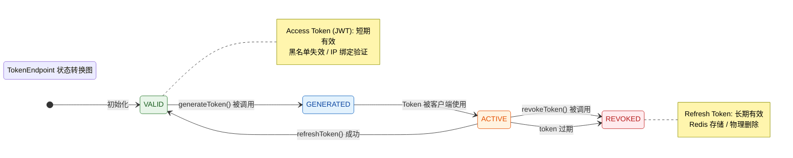

### 2.5 TokenStore SPI 扩展设计

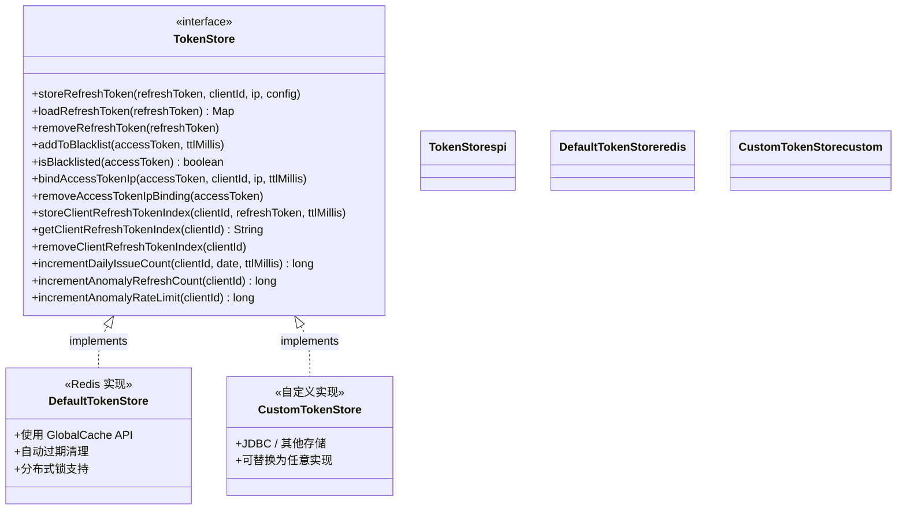

### 2.6 配置属性表

**配置前缀**：`platform.component.oauth`

| 属性名 | 类型 | 默认值 | 说明 |
|--------|------|--------|------|
| `enabled` | boolean | `false` | 是否启用 OAuth 2.1 组件 |
| `tokenSecret` | String | - | Token 签发密钥（推荐 32 位） |
| `defaultTokenValidDuration` | Integer | `2` | access_token 默认有效期（小时） |
| `defaultRefreshTokenValidDuration` | Integer | `720` | refresh_token 默认有效期（小时，即 30 天） |
| `revokePreviousTokensOnIssue` | boolean | `false` | 签发新 token 时是否立即作废旧 token |
| `enableDailyIssueLimit` | boolean | `true` | 是否启用每日签发次数限制 |

### 2.7 Redis Key Schema 表

| Key 枚举 | 前缀 | 模板 | 说明 |
|---------|------|------|------|
| `OAUTH2_CLIENT_CONFIG` | `third-party-client:` | `third-party-client:%s` | 客户端配置（Hash） |
| `OAUTH2_REFRESH_TOKEN` | `refresh-token:` | `refresh-token:%s` | Refresh Token 存储（Hash） |
| `OAUTH2_CLIENT_REFRESH_TOKEN_INDEX` | `client-refresh-token:` | `client-refresh-token:%s` | 客户端 Refresh Token 索引 |
| `OAUTH2_DAILY_TOKEN_ISSUE_COUNT` | `oauth2:daily:issue-count:` | `oauth2:daily:issue-count:%s` | 每日签发计数 |
| `OAUTH2_REFRESH_TOKEN_LOCK` | `refresh-token-lock:` | `refresh-token-lock:%s` | Refresh Token 分布式锁 |
| `OAUTH2_ACCESS_TOKEN_BLACKLIST` | `access-token-blacklist:` | `access-token-blacklist:%s` | Access Token 黑名单 |
| `OAUTH2_ACCESS_TOKEN_IP_BIND` | `access-token-ip:` | `access-token-ip:%s` | Access Token IP 绑定 |
| `OAUTH2_ANOMALY_REFRESH_COUNT` | `oauth2:anomaly:refresh:count:` | `oauth2:anomaly:refresh:count:%s` | 异常刷新计数 |
| `OAUTH2_ANOMALY_RATELIMIT` | `oauth2:anomaly:ratelimit:oauth2:` | `oauth2:anomaly:ratelimit:oauth2:%s` | 异常限流计数 |
| `OAUTH2_ANOMALY_TOKEN_IPS` | `oauth2:anomaly:token:ips:` | `oauth2:anomaly:token:ips:%s` | 异常 Token IP 列表 |
| `OAUTH2_AUDIT_EVENTS` | `oauth2:audit:events` | `oauth2:audit:events` | 审计事件（List） |
| `GATEWAY_API_INDEX` | `gateway:api:index` | `gateway:api:index` | 网关接口索引（Set） |
| `GATEWAY_API_CONFIG` | `gateway:api:` | `gateway:api:%s` | 网关接口配置（Hash） |
| `GATEWAY_API_SCOPES` | `gateway:api:scopes:` | `gateway:api:scopes:%s` | 接口对应 scopes（Set） |
| `GATEWAY_SCOPE_CONFIG` | `gateway:scope:` | `gateway:scope:%s` | Scope 配置 |

### 2.8 时序图

#### 2.8.1 Client Credentials Grant Flow (generateToken)

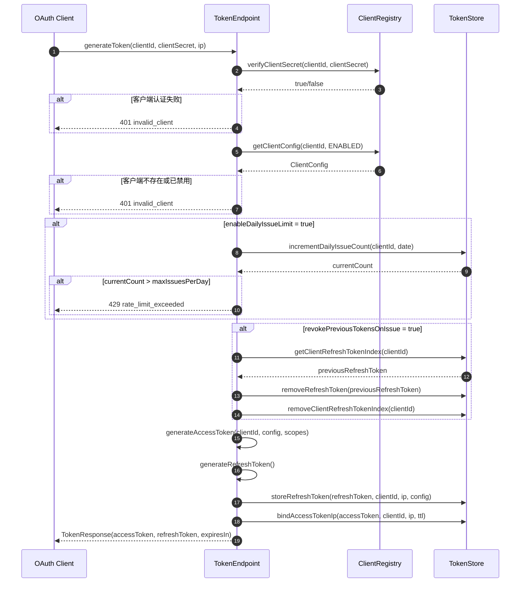

#### 2.8.2 Token Refresh Flow (refreshToken)

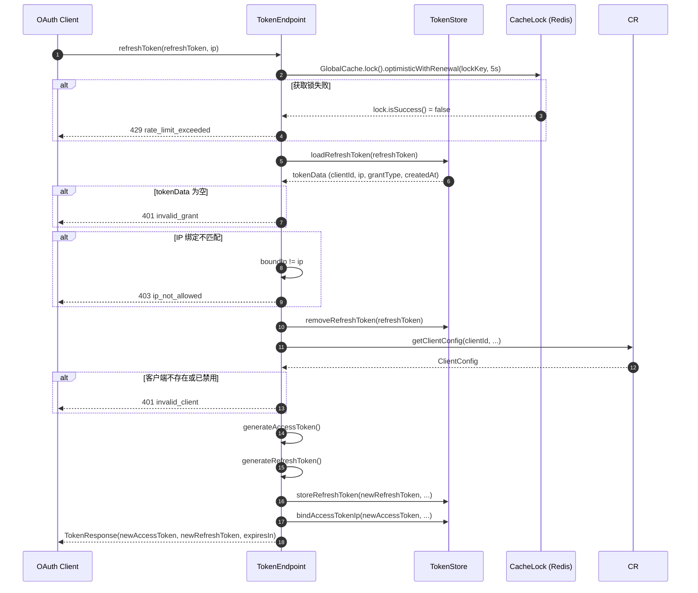

#### 2.8.3 Token Revocation Flow (revokeToken)

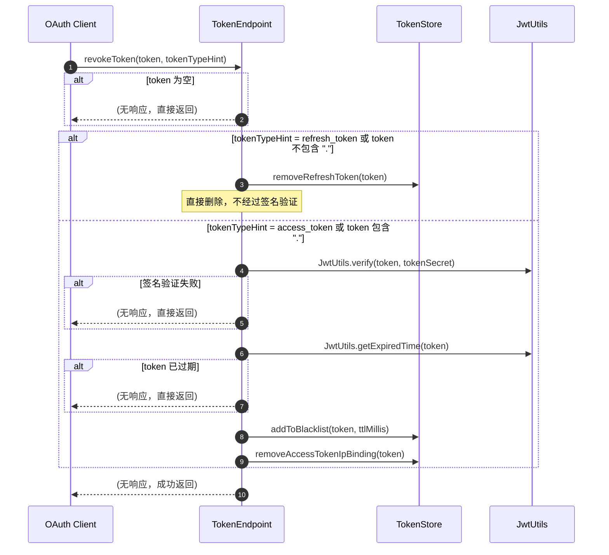

#### 2.8.4 Token Validation Flow (verifyAccessToken)

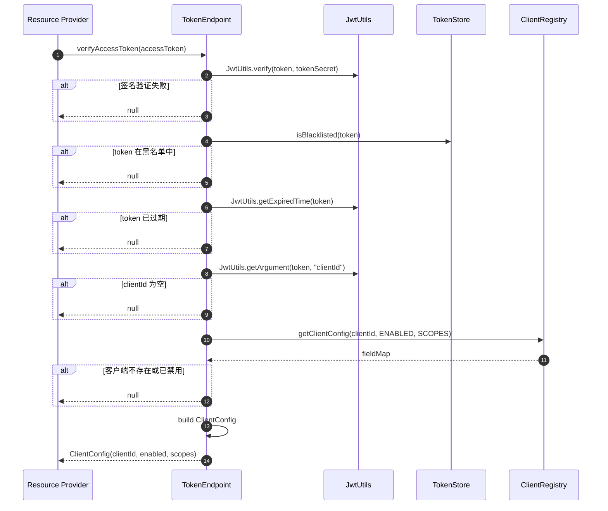

---

## 3. 授权码模块 (oauth-authz) — 设计方案

### 3.1 设计目标

实现 OAuth 2.1 Authorization Code + PKCE 流程，遵循 [MCP Authorization Spec (2025-11-25)](https://modelcontextprotocol.io/specification/2025-11-25/basic/authorization) 规范。

### 3.2 模块结构

```
atlas-richie-component-oauth-authz
├── pom.xml
└── src/main/java/com/richie/component/oauth/authz/
    ├── AuthorizationEndpoint.java        # 授权端点
    ├── AuthorizationCodeGrant.java      # 授权码模式处理
    ├── PKCESupport.java                 # PKCE S256 支持
    ├── AuthorizationCodeStore.java       # 授权码存储 SPI
    ├── DefaultAuthorizationCodeStore.java # Redis 实现
    ├── AuthorizationServerMetadata.java  # RFC 8414 元数据
    └── config/
        └── OAuth2AuthzAutoConfiguration.java
```

### 3.3 公共 API 设计

#### 3.3.1 AuthorizationEndpoint

**类职责**：处理 OAuth 2.1 授权端点请求，包括授权请求（GET /authorize）和用户授权确认（POST /authorize）。

**Package**：`com.richie.component.oauth.authz`

**构造函数**：
```java
public AuthorizationEndpoint(
    ClientRegistry clientRegistry,
    AuthorizationCodeStore authzCodeStore,
    PKCESupport pkceSupport,
    OAuth2Properties properties
)
```

**公共方法**：

| 方法签名 | 说明 | 返回类型 |
|---------|------|---------|
| `void handleAuthorizationRequest(HttpServletRequest request, HttpServletResponse response)` | 处理 GET /authorize，重定向到登录页面 | `void` |
| `void handleAuthorizationConsent(HttpServletRequest request, HttpServletResponse response)` | 处理 POST /authorize（用户同意授权），生成授权码并重定向 | `void` |

**内部方法（私有）**：

| 方法签名 | 说明 | 返回类型 |
|---------|------|---------|
| `AuthorizationCode generateAuthorizationCode(String clientId, String redirectUri, String codeChallenge, String state)` | 生成授权码并存储 | `AuthorizationCode` |

#### 3.3.2 AuthorizationCodeStore (SPI)

**类职责**：定义授权码存储的契约，支持 PKCE binding。

**Package**：`com.richie.component.oauth.authz.spi`

```java
public interface AuthorizationCodeStore {
    /**
     * 存储授权码
     * @param code 授权码
     * @param clientId 客户端 ID
     * @param redirectUri 重定向 URI
     * @param codeChallenge PKCE code_challenge
     * @param codeChallengeMethod PKCE method (S256)
     * @param scopes 申请的 scopes
     * @param userId 用户 ID
     * @param ttlSeconds 有效期（秒，默认 600）
     */
    void storeAuthorizationCode(
        String code,
        String clientId,
        String redirectUri,
        String codeChallenge,
        String codeChallengeMethod,
        List<String> scopes,
        String userId,
        long ttlSeconds
    );

    /**
     * 加载授权码
     * @param code 授权码
     * @return 授权码数据 Map，包含 clientId, redirectUri, codeChallenge, scopes, userId 等
     */
    Map<String, String> loadAuthorizationCode(String code);

    /**
     * 使用后删除授权码（一次性）
     * @param code 授权码
     */
    void consumeAuthorizationCode(String code);
}
```

#### 3.3.3 DefaultAuthorizationCodeStore

**类职责**：AuthorizationCodeStore 的 Redis 实现。

**Package**：`com.richie.component.oauth.authz.support`

```java
@Slf4j
public class DefaultAuthorizationCodeStore implements AuthorizationCodeStore {

    private static final long DEFAULT_TTL_SECONDS = 600; // 10 分钟

    @Override
    public void storeAuthorizationCode(
        String code,
        String clientId,
        String redirectUri,
        String codeChallenge,
        String codeChallengeMethod,
        List<String> scopes,
        String userId,
        long ttlSeconds
    ) {
        String key = OAuth2RedisKey.OAUTH2_AUTHZ_CODE.getKey(code);
        Map<String, Object> data = Map.of(
            "clientId", clientId,
            "redirectUri", redirectUri,
            "codeChallenge", codeChallenge != null ? codeChallenge : "",
            "codeChallengeMethod", codeChallengeMethod != null ? codeChallengeMethod : "",
            "scopes", String.join(" ", scopes != null ? scopes : Collections.emptyList()),
            "userId", userId != null ? userId : "",
            "createdAt", String.valueOf(System.currentTimeMillis())
        );
        long ttl = ttlSeconds > 0 ? ttlSeconds : DEFAULT_TTL_SECONDS;
        GlobalCache.struct().set(key, data, TimeUnit.SECONDS.toMillis(ttl));
        log.debug("存储授权码: code={}, clientId={}, ttl={}s", code, clientId, ttl);
    }

    @Override
    @SuppressWarnings("unchecked")
    public Map<String, String> loadAuthorizationCode(String code) {
        String key = OAuth2RedisKey.OAUTH2_AUTHZ_CODE.getKey(code);
        return GlobalCache.field().getAll(key, String.class);
    }

    @Override
    public void consumeAuthorizationCode(String code) {
        String key = OAuth2RedisKey.OAUTH2_AUTHZ_CODE.getKey(code);
        GlobalCache.key().removeCache(key);
        log.debug("消费授权码: code={}", code);
    }
}
```

#### 3.3.4 PKCESupport

**类职责**：PKCE S256 挑战生成与验证。

**Package**：`com.richie.component.oauth.authz`

```java
@Slf4j
@Component
public class PKCESupport {

    /**
     * 生成 PKCE code_verifier
     * @return 43-128 位随机字符串
     */
    public String generateCodeVerifier() {
        byte[] bytes = new byte[32];
        new SecureRandom().nextBytes(bytes);
        return Base64.getUrlEncoder().withoutPadding().encodeToString(bytes);
    }

    /**
     * 生成 PKCE code_challenge (S256)
     * @param codeVerifier code_verifier
     * @return BASE64URL(SHA256(code_verifier))
     */
    public String generateCodeChallenge(String codeVerifier) {
        if (codeVerifier == null || codeVerifier.isBlank()) {
            throw new IllegalArgumentException("code_verifier 不能为空");
        }
        try {
            MessageDigest digest = MessageDigest.getInstance("SHA-256");
            byte[] hash = digest.digest(codeVerifier.getBytes(StandardCharsets.US_ASCII));
            return Base64.getUrlEncoder().withoutPadding().encodeToString(hash);
        } catch (NoSuchAlgorithmException e) {
            throw new RuntimeException("SHA-256 算法不可用", e);
        }
    }

    /**
     * 验证 PKCE code_challenge 与 code_verifier 匹配
     * @param codeChallenge code_challenge
     * @param codeChallengeMethod method (必须为 S256)
     * @param codeVerifier code_verifier
     * @return 是否匹配
     */
    public boolean verifyChallenge(String codeChallenge, String codeChallengeMethod, String codeVerifier) {
        if (codeChallenge == null || codeVerifier == null) {
            return false;
        }
        if (!"S256".equalsIgnoreCase(codeChallengeMethod)) {
            log.warn("不支持的 PKCE method: {}", codeChallengeMethod);
            return false;
        }
        String expectedChallenge = generateCodeChallenge(codeVerifier);
        return MessageDigest.isEqual(
            codeChallenge.getBytes(StandardCharsets.UTF_8),
            expectedChallenge.getBytes(StandardCharsets.UTF_8)
        );
    }
}
```

#### 3.3.5 AuthorizationCodeGrant

**类职责**：处理授权码模式下的 code→token 交换流程。需要扩展 TokenEndpoint 的 `generateToken` 方法。

**Package**：`com.richie.component.oauth.authz`

```java
@Slf4j
@Component
public class AuthorizationCodeGrant {

    private final TokenStore tokenStore;
    private final ClientRegistry clientRegistry;
    private final AuthorizationCodeStore authzCodeStore;
    private final PKCESupport pkceSupport;
    private final OAuth2Properties properties;

    public AuthorizationCodeGrant(
        TokenStore tokenStore,
        ClientRegistry clientRegistry,
        AuthorizationCodeStore authzCodeStore,
        PKCESupport pkceSupport,
        OAuth2Properties properties
    ) {
        this.tokenStore = tokenStore;
        this.clientRegistry = clientRegistry;
        this.authzCodeStore = authzCodeStore;
        this.pkceSupport = pkceSupport;
        this.properties = properties;
    }

    /**
     * 使用授权码换取 Token
     * @param clientId 客户端 ID
     * @param clientSecret 客户端密钥
     * @param code 授权码
     * @param codeVerifier PKCE code_verifier
     * @param redirectUri 重定向 URI（需与授权请求一致）
     * @param resource RFC 8707 resource 参数
     * @param ip 客户端 IP
     * @return Token 响应
     */
    public TokenResponse exchangeCodeForToken(
        String clientId,
        String clientSecret,
        String code,
        String codeVerifier,
        String redirectUri,
        String resource,
        String ip
    ) {
        // 1. 验证客户端凭证
        if (!clientRegistry.verifyClientSecret(clientId, clientSecret)) {
            throw new BusinessException(OAuth2Constants.ERROR_INVALID_CLIENT, "客户端认证失败");
        }

        // 2. 加载并验证授权码
        Map<String, String> codeData = authzCodeStore.loadAuthorizationCode(code);
        if (codeData == null || codeData.isEmpty()) {
            throw new BusinessException(OAuth2Constants.ERROR_INVALID_GRANT, "授权码无效或已过期");
        }

        // 3. 验证 client_id 匹配
        if (!clientId.equals(codeData.get("clientId"))) {
            throw new BusinessException(OAuth2Constants.ERROR_INVALID_GRANT, "客户端 ID 不匹配");
        }

        // 4. 验证 redirect_uri 匹配
        String storedRedirectUri = codeData.get("redirectUri");
        if (StringUtils.isNotBlank(redirectUri) && !redirectUri.equals(storedRedirectUri)) {
            throw new BusinessException(OAuth2Constants.ERROR_INVALID_GRANT, "重定向 URI 不匹配");
        }

        // 5. 验证 PKCE
        String codeChallenge = codeData.get("codeChallenge");
        String codeChallengeMethod = codeData.get("codeChallengeMethod");
        if (StringUtils.isNotBlank(codeChallenge) && !"plain".equalsIgnoreCase(codeChallengeMethod)) {
            if (!pkceSupport.verifyChallenge(codeChallenge, codeChallengeMethod, codeVerifier)) {
                throw new BusinessException(OAuth2Constants.ERROR_INVALID_GRANT, "PKCE 验证失败");
            }
        }

        // 6. 消费授权码（一次性使用）
        authzCodeStore.consumeAuthorizationCode(code);

        // 7. 加载客户端配置
        ClientConfig config = loadClientConfig(clientId);
        if (config == null || !Boolean.TRUE.equals(config.getEnabled())) {
            throw new BusinessException(OAuth2Constants.ERROR_INVALID_CLIENT, "客户端不存在或已禁用");
        }

        // 8. 解析 scopes
        String scopesStr = codeData.get("scopes");
        List<String> scopes = StringUtils.isNotBlank(scopesStr)
            ? Arrays.asList(scopesStr.split("\\s+"))
            : (config.getScopes() != null ? config.getScopes() : Collections.emptyList());

        // 9. 生成 Token
        String accessToken = generateAccessToken(clientId, config, scopes, resource);
        String refreshToken = generateRefreshToken();

        // 10. 存储 refresh_token
        tokenStore.storeRefreshToken(refreshToken, clientId, ip, config);

        // 11. 绑定 IP
        long expiresIn = config.getTokenValidDuration() != null
            ? config.getTokenValidDuration() * 3600L
            : OAuth2Constants.DEFAULT_ACCESS_TOKEN_EXPIRES_IN;
        long ttlMillis = expiresIn * 1000L;
        tokenStore.bindAccessTokenIp(accessToken, clientId, ip, ttlMillis);

        return TokenResponse.builder()
            .accessToken(accessToken)
            .tokenType(OAuth2Constants.TOKEN_TYPE_BEARER)
            .expiresIn(expiresIn)
            .refreshToken(refreshToken)
            .scope(String.join(" ", scopes))
            .build();
    }

    // ... private helper methods (generateAccessToken, generateRefreshToken, loadClientConfig)
}
```

#### 3.3.6 AuthorizationServerMetadata

**类职责**：RFC 8414 Authorization Server Metadata 端点。

**Package**：`com.richie.component.oauth.authz`

```java
/**
 * RFC 8414 Authorization Server Metadata
 * 端点：/.well-known/oauth-authorization-server
 */
@Data
@Builder
@NoArgsConstructor
@AllArgsConstructor
public class AuthorizationServerMetadata {

    /**
     * 授权服务器的标识符
     */
    private String issuer;

    /**
     * RFC 8414 授权端点 URL
     */
    private String authorizationEndpoint;

    /**
     * RFC 7009 Token 撤销端点 URL
     */
    private String tokenEndpoint;

    /**
     * RFC 7662 Token 内省端点 URL
     */
    private String introspectionEndpoint;

    /**
     * 支持的 OAuth 2.0 响应类型
     */
    private List<String> responseTypesSupported;

    /**
     * 支持的 PKCE code_challenge 方法
     */
    private List<String> codeChallengeMethodsSupported;

    /**
     * 支持的 grant_types
     */
    private List<String> grantTypesSupported;

    /**
     * 支持的 scopes
     */
    private List<String> scopesSupported;
}
```

### 3.4 TokenEndpoint 扩展需求

为支持 `authorization_code` grant，TokenEndpoint 需要新增以下方法或重载现有方法：

```java
// 新增方法：支持 authorization_code grant
public TokenResponse generateToken(
    String clientId,
    String clientSecret,
    String code,           // 授权码
    String codeVerifier,    // PKCE verifier
    String redirectUri,     // 重定向 URI
    String resource,       // RFC 8707 resource 参数
    String ip
);

// 新增方法：支持 resource 参数的 access_token 生成
private String generateAccessToken(String clientId, ClientConfig config, List<String> scopes, String resource);
```

### 3.5 RFC 8707 Resource Parameter 支持

RFC 8707 定义了 `resource` 参数，用于指定目标资源服务器。实现要点：

1. **JWT aud claim**：当指定 resource 时，生成的 JWT access_token 的 `aud` claim 应包含 resource URI
2. **Audience 验证**：在 `verifyAccessToken` 中增加 audience 验证逻辑

```java
// 在 TokenEndpoint 中扩展
private String generateAccessToken(String clientId, ClientConfig config, List<String> scopes, String resource) {
    // ... 现有逻辑 ...

    Map<String, String> params = new HashMap<>();
    params.put(OAuth2Constants.JWT_CLAIM_CLIENT_ID, clientId);
    params.put(OAuth2Constants.JWT_CLAIM_TYPE, OAuth2Constants.JWT_CLAIM_TYPE_THIRD_PARTY);
    if (finalScopes != null && !finalScopes.isEmpty()) {
        params.put(OAuth2Constants.JWT_CLAIM_SCOPE, String.join(" ", finalScopes));
    }

    // RFC 8707: resource parameter → aud claim
    if (StringUtils.isNotBlank(resource)) {
        // audience 可以是单个 URI 或数组
        params.put("aud", resource);
    }

    return generateJwtToken(clientId, params, tokenSecret, expiredTime);
}
```

### 3.6 时序图

#### 3.6.1 Authorization Code + PKCE Flow

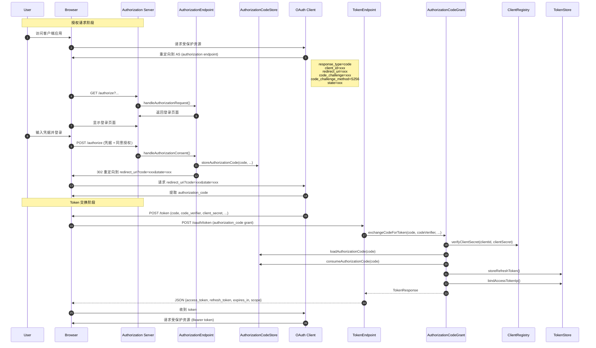

#### 3.6.2 Authorization Server Metadata Discovery Flow

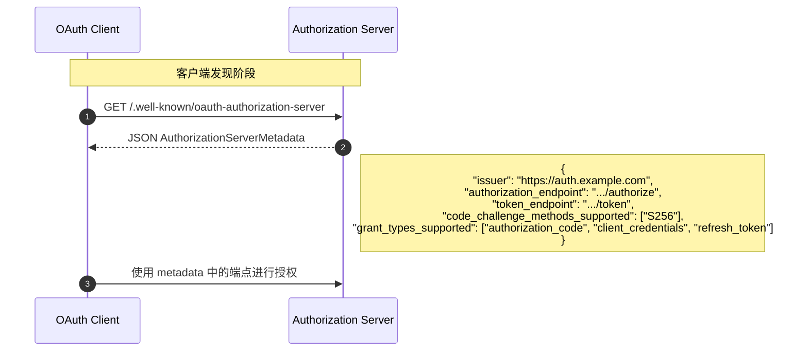

#### 3.6.3 Step-Up Authorization Flow (Insufficient Scope)

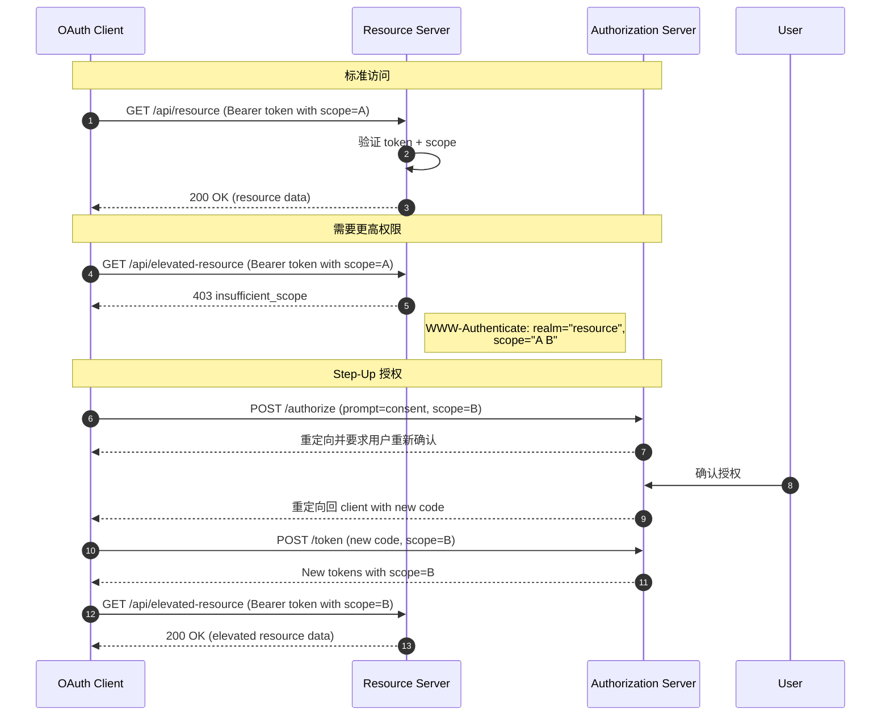

---

## 4. 动态客户端注册模块 (oauth-dcr) — 设计方案

### 4.1 设计目标

实现 RFC 7591 Dynamic Client Registration Protocol 以及 Client ID Metadata Documents 支持。

### 4.2 模块结构

```
atlas-richie-component-oauth-dcr
├── pom.xml
└── src/main/java/com/richie/component/oauth/dcr/
    ├── DynamicClientRegistrationEndpoint.java  # DCR 端点
    ├── ClientRegistrationRequest.java         # DCR 请求 DTO
    ├── ClientRegistrationResponse.java        # DCR 响应 DTO
    ├── ClientIdMetadataDocumentResolver.java  # Client ID Metadata SPI
    ├── DefaultClientIdMetadataDocumentResolver.java # 默认实现
    ├── SSRFProtection.java                    # SSRF 防护
    ├── ClientIdMetadataDocument.java         # Client ID Metadata Document
    └── config/
        └── OAuth2DCRAutoConfiguration.java
```

### 4.3 公共 API 设计

#### 4.3.1 DynamicClientRegistrationEndpoint

**类职责**：处理动态客户端注册请求（POST /register）。

**Package**：`com.richie.component.oauth.dcr`

**构造函数**：
```java
public DynamicClientRegistrationEndpoint(
    ClientRegistry clientRegistry,
    ClientIdMetadataDocumentResolver metadataResolver,
    OAuth2Properties properties
)
```

**公共方法**：

| 方法签名 | 说明 | 返回类型 |
|---------|------|---------|
| `ClientRegistrationResponse registerClient(ClientRegistrationRequest request, HttpServletRequest httpRequest)` | 处理客户端注册请求 | `ClientRegistrationResponse` |
| `ClientRegistrationResponse updateClient(String clientId, ClientRegistrationRequest request, HttpServletRequest httpRequest)` | 更新已注册的客户端 | `ClientRegistrationResponse` |

#### 4.3.2 ClientRegistrationRequest

**Package**：`com.richie.component.oauth.dcr.dto`

```java
@Data
@Builder
@NoArgsConstructor
@AllArgsConstructor
public class ClientRegistrationRequest {

    /**
     * 客户端名称
     */
    private String clientName;

    /**
     * RFC 7591 要求的 OAuth 2.0 客户端 URI
     */
    private String clientUri;

    /**
     * 客户端图标 URL
     */
    private String logoUri;

    /**
     * 允许的重定向 URI 列表
     */
    private List<String> redirectUris;

    /**
     * 令牌端点认证方法
     */
    private String tokenEndpointAuthMethod;

    /**
     * 申请的 grant_types
     */
    private List<String> grantTypes;

    /**
     * 申请的 scopes
     */
    private List<String> scopes;

    /**
     * 客户端公钥（JWK 或 JWK Set URL）
     */
    private String jwks;
    private String jwksUri;

    /**
     * 客户端软件标识
     */
    private String softwareId;
    private String softwareVersion;

    /**
     * RFC 8707 resource 元数据
     */
    private List<String> resource;
}
```

#### 4.3.3 ClientRegistrationResponse

**Package**：`com.richie.component.oauth.dcr.dto`

```java
@Data
@Builder
@NoArgsConstructor
@AllArgsConstructor
public class ClientRegistrationResponse {

    /**
     * 客户端 ID（自动生成）
     */
    private String clientId;

    /**
     * 客户端密钥（自动生成，仅当 tokenEndpointAuthMethod 非 none 时返回）
     */
    private String clientSecret;

    /**
     * 客户端密钥过期时间
     */
    private Long clientSecretExpiresAt;

    /**
     * 注册时间
     */
    private Long registrationAccessToken;

    /**
     * 注册客户端 URI
     */
    private String registrationClientUri;

    /**
     * 客户端名称
     */
    private String clientName;

    /**
     * 允许的重定向 URI 列表
     */
    private List<String> redirectUris;

    /**
     * 令牌端点认证方法
     */
    private String tokenEndpointAuthMethod;

    /**
     * 申请的 grant_types
     */
    private List<String> grantTypes;

    /**
     * 申请的 scopes
     */
    private List<String> scopes;

    /**
     * 客户端 URI
     */
    private String clientUri;

    /**
     * 图标 URI
     */
    private String logoUri;

    /**
     * RFC 8707 resource 元数据
     */
    private List<String> resource;
}
```

#### 4.3.4 ClientIdMetadataDocumentResolver (SPI)

**类职责**：解析 Client ID Metadata Document，支持 RFC 7591 扩展。

**Package**：`com.richie.component.oauth.dcr.spi`

```java
public interface ClientIdMetadataDocumentResolver {

    /**
     * 解析 Client ID Metadata Document
     * @param clientId 客户端 ID
     * @param metadataUri Metadata Document URI
     * @return 解析后的 Metadata Document
     */
    ClientIdMetadataDocument resolve(String clientId, String metadataUri);

    /**
     * 获取客户端的默认 Metadata Document URI
     * @param clientId 客户端 ID
     * @return Metadata Document URI，若无则返回 null
     */
    String getMetadataUri(String clientId);
}
```

#### 4.3.5 ClientIdMetadataDocument

**Package**：`com.richie.component.oauth.dcr.model`

```java
@Data
@Builder
@NoArgsConstructor
@AllArgsConstructor
public class ClientIdMetadataDocument {

    /**
     * 客户端 ID
     */
    private String clientId;

    /**
     * 客户端 Secret Hash
     */
    private String clientSecret;

    /**
     * 客户端名称
     */
    private String clientName;

    /**
     * 允许的重定向 URI
     */
    private List<String> redirectUris;

    /**
     * 令牌端点认证方法
     */
    private String tokenEndpointAuthMethod;

    /**
     * Grant Types
     */
    private List<String> grantTypes;

    /**
     * Scopes
     */
    private List<String> scopes;

    /**
     * 联系人邮箱
     */
    private List<String> contacts;

    /**
     * 客户端 URI
     */
    private String clientUri;

    /**
     * Logo URI
     */
    private String logoUri;

    /**
     * 所有者
     */
    private String owner;

    /**
     * 停止运营日期
     */
    String tosUri;
    String policyUri;

    /**
     * JWK Set URI
     */
    private String jwksUri;

    /**
     * RFC 8707 Resource 元数据
     */
    private List<String> resource;
}
```

#### 4.3.6 SSRFProtection

**类职责**：防止 Server-Side Request Forgery 攻击。

**Package**：`com.richie.component.oauth.dcr.support`

```java
@Slf4j
@Component
public class SSRFProtection {

    private final GlobalCache globalCache;
    private final List<String> allowedDomains;
    private final Duration cacheTtl;

    public SSRFProtection(
        GlobalCache globalCache,
        @Value("${platform.component.oauth.dcr.allowed-domains:}") List<String> allowedDomains,
        @Value("${platform.component.oauth.dcr.ssrf-cache-ttl:3600}") long cacheTtlSeconds
    ) {
        this.globalCache = globalCache;
        this.allowedDomains = allowedDomains;
        this.cacheTtl = Duration.ofSeconds(cacheTtlSeconds);
    }

    /**
     * 验证 URL 是否安全（防止 SSRF）
     * @param url 待验证的 URL
     * @return 是否安全
     */
    public boolean isUrlSafe(String url) {
        if (StringUtils.isBlank(url)) {
            return false;
        }

        try {
            URL parsedUrl = new URL(url);

            // 必须是 HTTPS
            if (!"https".equalsIgnoreCase(parsedUrl.getProtocol())) {
                log.warn("SSRF 防护：非 HTTPS URL: {}", url);
                return false;
            }

            String host = parsedUrl.getHost().toLowerCase();

            // 检查是否为 IP 地址（不允许直接 IP 访问）
            if (isIpAddress(host)) {
                log.warn("SSRF 防护：不允许 IP 地址: {}", url);
                return false;
            }

            // 检查是否为内网/保留地址
            if (isReservedAddress(host)) {
                log.warn("SSRF 防护：内网/保留地址: {}", url);
                return false;
            }

            // 检查域名白名单
            if (!allowedDomains.isEmpty() && !isInAllowList(host)) {
                log.warn("SSRF 防护：域名不在白名单中: {}", url);
                return false;
            }

            // DNS Rebinding 防护：解析并缓存 IP
            String resolvedIp = resolveAndCacheDns(host);
            if (resolvedIp == null) {
                return false;
            }

            // 解析后的 IP 也不能是内网
            if (isReservedAddress(resolvedIp)) {
                log.warn("SSRF 防护：DNS 解析后为内网地址: {}", resolvedIp);
                return false;
            }

            return true;
        } catch (MalformedURLException e) {
            log.warn("SSRF 防护：无效的 URL: {}", url);
            return false;
        }
    }

    private String resolveAndCacheDns(String host) {
        String cacheKey = "ssrf:dns:" + host;
        String cachedIp = globalCache.value().get(cacheKey, String.class);

        if (cachedIp != null) {
            return cachedIp;
        }

        try {
            InetAddress address = InetAddress.getByName(host);
            String ip = address.getHostAddress();
            globalCache.value().set(cacheKey, ip, cacheTtl.toMillis());
            return ip;
        } catch (UnknownHostException e) {
            log.warn("SSRF 防护：DNS 解析失败: {}", host);
            return null;
        }
    }

    private boolean isIpAddress(String host) {
        return Pattern.matches("^\\d{1,3}(\\.\\d{1,3}){3}$", host)
            || Pattern.matches("^([0-9a-fA-F]{1,4}:){7}[0-9a-fA-F]{1,4}$", host);
    }

    private boolean isReservedAddress(String address) {
        // 检查内网地址、保留地址等
        // 10.0.0.0/8, 172.16.0.0/12, 192.168.0.0/16, 127.0.0.0/8, etc.
        // 实现省略...
        return false;
    }

    private boolean isInAllowList(String host) {
        return allowedDomains.stream().anyMatch(domain ->
            host.equals(domain) || host.endsWith("." + domain)
        );
    }
}
```

### 4.4 时序图

#### 4.4.1 DCR Flow

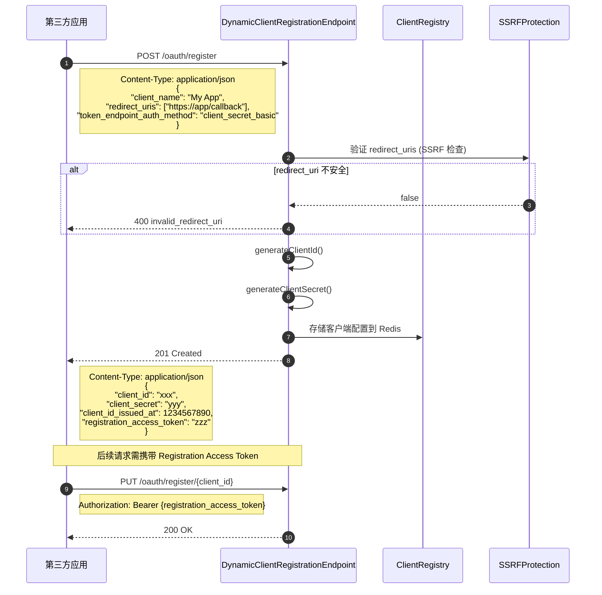

#### 4.4.2 Client ID Metadata Document Flow

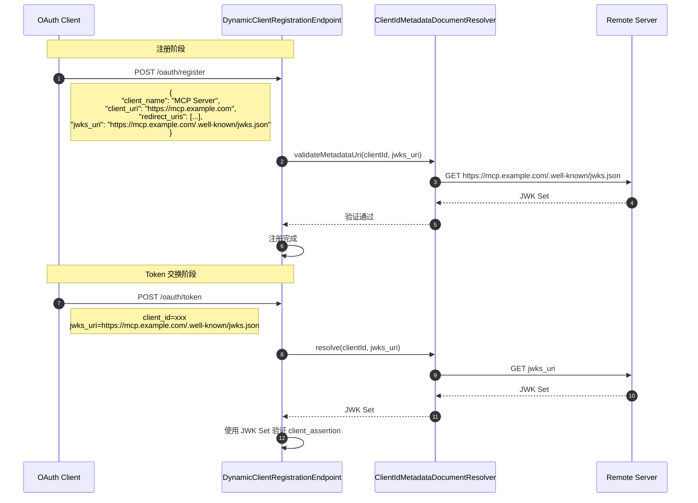

---

## 5. MCP 集成映射

### 5.1 MCP Role 与 OAuth Component 模块映射表

| MCP Role | OAuth Role | Atlas OAuth Component | 说明 |
|----------|-----------|---------------------|------|
| MCP Server | Resource Server (受保护资源) | `oauth-core` | 使用 `verifyAccessToken` 验证访问令牌 |
| MCP Client | OAuth Client | `oauth-authz` | 客户端 SDK，处理授权流程 |
| Authorization Server | AS | `oauth-authz` | `AuthorizationEndpoint` + `TokenEndpoint` |
| MCP Client (持有令牌) | OAuth Client | `oauth-authz` | `AuthorizationCodeGrant` 处理 code 换 token |

### 5.2 MCP Server 集成 (Resource Server)

MCP Server 作为 Resource Server，需要：

1. **Token 验证**：使用 `TokenEndpoint.verifyAccessToken()` 验证携带的 Bearer Token
2. **Scope 验证**：使用 `ScopeResolver` 验证 Token 中的 scopes 是否满足接口要求
3. **IP 绑定验证**：使用 `TokenEndpoint.getIpWhitelist()` 获取白名单并验证

```java
// MCP Server 侧示例
@Service
public class MCPServerResourceValidator {

    private final TokenEndpoint tokenEndpoint;
    private final ScopeResolver scopeResolver;

    public boolean validateRequest(String accessToken, String path, String method, String clientIp) {
        // 1. 验证 Token
        ClientConfig config = tokenEndpoint.verifyAccessToken(accessToken);
        if (config == null) {
            return false;
        }

        // 2. 验证 Scope
        List<String> requiredScopes = scopeResolver.getRequiredScopes(path, method);
        if (!requiredScopes.isEmpty()) {
            Set<String> tokenScopes = scopeResolver.extractScopesFromToken(accessToken);
            if (!scopeResolver.verifyScope(tokenScopes, requiredScopes)) {
                return false;
            }
        }

        // 3. 验证 IP 白名单
        List<String> whitelist = tokenEndpoint.getIpWhitelist(accessToken);
        if (whitelist != null && !whitelist.isEmpty() && !whitelist.contains(clientIp)) {
            return false;
        }

        return true;
    }
}
```

### 5.3 Protected Resource Metadata (RFC 9728)

RFC 9728 定义了 Protected Resource Metadata。MCP Server 需要暴露以下端点：

#### 5.3.1 /.well-known/oauth-protected-resource

```java
/**
 * RFC 9728 Protected Resource Metadata
 * 端点：/.well-known/oauth-protected-resource
 */
@Data
@Builder
@NoArgsConstructor
@AllArgsConstructor
public class ProtectedResourceMetadata {

    /**
     * 资源服务器标识符
     */
    private String resource;

    /**
     * 资源服务器语义版本
     */
    private String resourceSemanticVersion;

    /**
     * 授权服务器标识符列表
     */
    private List<String> authorizationServers;

    /**
     * 保护的 API 范围
     */
    private List<String> scopesSupported;

    /**
     * 资源服务器支持的 OAuth 客户端认证方法
     */
    private List<String> bearerMethodsSupported;

    /**
     * 支持的 OAuth 特性
     */
    private List<String> featuresSupported;
}
```

#### 5.3.2 WWW-Authenticate Header

```java
// MCP Server 返回受保护资源时的响应头
String wwwAuthenticate = String.format(
    "Bearer realm=\"%s\", resource_metadata=\"%s\"",
    resourceRealm,
    metadataUri
);
response.setHeader("WWW-Authenticate", wwwAuthenticate);
```

### 5.4 Scope 选择策略

MCP Server 应定义以下标准 Scope：

| Scope | 说明 | 典型用途 |
|-------|------|---------|
| `mcp:read` | 读取 MCP 资源 | 查询工具列表、上下文等 |
| `mcp:write` | 写入 MCP 资源 | 修改配置、上传文件等 |
| `mcp:execute` | 执行 MCP 操作 | 调用工具、执行命令等 |
| `mcp:admin` | 管理功能 | 用户管理、系统配置等 |

### 5.5 Token Audience 绑定 (resource parameter)

RFC 8707 规定，当 MCP Client 请求 MCP Server 时：

1. **请求时**：MCP Client 在 Token 请求中指定 `resource` 参数（指向 MCP Server URI）
2. **Token 生成时**：`AuthorizationCodeGrant` 将 `resource` 写入 JWT 的 `aud` claim
3. **验证时**：MCP Server 在 `verifyAccessToken` 中验证 `aud` claim 是否包含自己的 URI

```java
// TokenEndpoint.verifyAccessToken() 扩展
public ClientConfig verifyAccessToken(String accessToken, String expectedAudience) {
    ClientConfig config = verifyAccessToken(accessToken); // 现有逻辑
    if (config == null) {
        return null;
    }

    // 新增：验证 audience
    if (StringUtils.isNotBlank(expectedAudience)) {
        String tokenAudience = JwtUtils.getArgument(accessToken, "aud");
        if (tokenAudience == null || !tokenAudience.equals(expectedAudience)) {
            log.debug("Token audience 不匹配: expected={}, actual={}", expectedAudience, tokenAudience);
            return null;
        }
    }

    return config;
}
```

---

## 6. SPI 扩展点

### 6.1 TokenStore Interface (已存在)

```java
package com.richie.component.oauth.core.spi;

/**
 * Token 存储抽象
 *
 * 定义 refresh_token 存储、access_token 黑名单、IP 绑定等持久化契约。
 * 默认使用 Redis 实现，可通过 SPI 替换为 JDBC 等实现。
 */
public interface TokenStore {

    // ==================== Refresh Token ====================

    /**
     * 存储 Refresh Token
     */
    void storeRefreshToken(String refreshToken, String clientId, String ip, ClientConfig config);

    /**
     * 加载 Refresh Token
     * @return Map 包含 client_id, ip, grant_type, created_at 等
     */
    Map<String, String> loadRefreshToken(String refreshToken);

    /**
     * 删除 Refresh Token
     */
    void removeRefreshToken(String refreshToken);

    // ==================== Access Token Blacklist ====================

    /**
     * 将 Access Token 加入黑名单
     * @param accessToken Access Token
     * @param ttlMillis 剩余有效期（毫秒），用于设置 Redis Key 过期时间
     */
    void addToBlacklist(String accessToken, long ttlMillis);

    /**
     * 检查 Access Token 是否在黑名单中
     */
    boolean isBlacklisted(String accessToken);

    // ==================== IP Binding ====================

    /**
     * 绑定 Access Token 与 IP
     */
    void bindAccessTokenIp(String accessToken, String clientId, String ip, long ttlMillis);

    /**
     * 移除 Access Token IP 绑定
     */
    void removeAccessTokenIpBinding(String accessToken);

    // ==================== Client Refresh Token Index ====================

    /**
     * 存储客户端当前 Refresh Token 索引（用于 revokePreviousTokensOnIssue）
     */
    void storeClientRefreshTokenIndex(String clientId, String refreshToken, long ttlMillis);

    /**
     * 获取客户端当前 Refresh Token 索引
     */
    String getClientRefreshTokenIndex(String clientId);

    /**
     * 删除客户端 Refresh Token 索引
     */
    void removeClientRefreshTokenIndex(String clientId);

    // ==================== Rate Limiting ====================

    /**
     * 递增每日签发计数
     * @return 当前计数
     */
    long incrementDailyIssueCount(String clientId, String date, long ttlMillis);

    /**
     * 递增异常刷新计数
     */
    long incrementAnomalyRefreshCount(String clientId);

    /**
     * 递增异常限流计数
     */
    long incrementAnomalyRateLimit(String clientId);
}
```

### 6.2 AuthorizationCodeStore (待实现)

```java
package com.richie.component.oauth.authz.spi;

/**
 * 授权码存储抽象
 *
 * 定义授权码（Authorization Code）的存储与验证契约。
 * 支持 PKCE binding，保证授权码一次性使用。
 */
public interface AuthorizationCodeStore {

    /**
     * 存储授权码
     *
     * @param code 授权码
     * @param clientId 客户端 ID
     * @param redirectUri 重定向 URI
     * @param codeChallenge PKCE code_challenge
     * @param codeChallengeMethod PKCE method (S256 或 plain)
     * @param scopes 申请的 scopes
     * @param userId 用户 ID
     * @param ttlSeconds 有效期（秒，默认 600）
     */
    void storeAuthorizationCode(
        String code,
        String clientId,
        String redirectUri,
        String codeChallenge,
        String codeChallengeMethod,
        List<String> scopes,
        String userId,
        long ttlSeconds
    );

    /**
     * 加载授权码
     *
     * @param code 授权码
     * @return Map 包含 client_id, redirect_uri, code_challenge, scopes, user_id 等
     */
    Map<String, String> loadAuthorizationCode(String code);

    /**
     * 消费授权码（一次性使用，调用后删除）
     *
     * @param code 授权码
     */
    void consumeAuthorizationCode(String code);
}
```

### 6.3 ClientIdMetadataDocumentResolver (待实现)

```java
package com.richie.component.oauth.dcr.spi;

/**
 * Client ID Metadata Document 解析器抽象
 *
 * 支持 RFC 7591 扩展，允许客户端通过外部文档声明元数据。
 * 默认实现直接从 Redis 读取，可扩展为从远程 URL 加载。
 */
public interface ClientIdMetadataDocumentResolver {

    /**
     * 解析 Client ID Metadata Document
     *
     * @param clientId 客户端 ID
     * @param metadataUri Metadata Document URI（可为 null）
     * @return 解析后的 Metadata Document
     */
    ClientIdMetadataDocument resolve(String clientId, String metadataUri);

    /**
     * 获取客户端的默认 Metadata Document URI
     *
     * @param clientId 客户端 ID
     * @return Metadata Document URI，若无则返回 null
     */
    String getMetadataUri(String clientId);
}
```

---

## 7. 安全设计

### 7.1 PKCE S256 强制要求

**设计决策**：OAuth 2.1 规范要求所有授权码流程必须使用 PKCE，且只支持 S256 方法。

**实现要点**：

1. `AuthorizationEndpoint` 在处理授权请求时：
   - 验证 `code_challenge` 存在
   - 验证 `code_challenge_method` 为 `S256`（拒绝 `plain`）

2. `AuthorizationCodeGrant` 在交换 Token 时：
   - 使用 `PKCESupport.verifyChallenge()` 验证 `code_verifier`
   - 验证失败返回 `invalid_grant`

```java
// AuthorizationEndpoint.handleAuthorizationRequest() 中的校验
if (StringUtils.isBlank(codeChallenge)) {
    throw new BusinessException("code_challenge_required", "code_challenge 参数必填");
}
if (!"S256".equalsIgnoreCase(codeChallengeMethod)) {
    throw new BusinessException("invalid_code_challenge_method", "仅支持 S256 method");
}

// AuthorizationCodeGrant.exchangeCodeForToken() 中的校验
if (!pkceSupport.verifyChallenge(codeChallenge, codeChallengeMethod, codeVerifier)) {
    throw new BusinessException(OAuth2Constants.ERROR_INVALID_GRANT, "PKCE 验证失败");
}
```

### 7.2 分布式锁（Refresh Token 刷新）

**问题**：防止同一 Refresh Token 并发刷新导致 Token 替换冲突。

**解决方案**：使用 Redis 分布式锁（`CacheLock`）保护刷新操作。

```java
// TokenEndpoint.refreshToken()
String lockKey = OAuth2RedisKey.OAUTH2_REFRESH_TOKEN_LOCK.getKey(refreshToken);

try (CacheLock lock = GlobalCache.lock().optimisticWithRenewal(lockKey, 5L)) {
    if (!lock.isSuccess()) {
        throw new BusinessException(OAuth2Constants.ERROR_RATE_LIMIT_EXCEEDED,
            "刷新令牌正在处理中，请稍后重试");
    }

    // 执行刷新逻辑...
}
```

### 7.3 时序安全密钥比较

**问题**：防止通过时间侧信道攻击猜测客户端密钥。

**解决方案**：使用 `StringUtils.CS.equals()` 进行时序安全比较。

```java
// ClientRegistry.verifyClientSecret()
return Strings.CS.equals(storedSecret, clientSecret);
```

### 7.4 Access Token 黑名单 + IP 绑定

**设计**：

1. **黑名单**：撤销 Access Token 时，将其加入 Redis 黑名单，过期时间自动清理
2. **IP 绑定**：每次签发时记录 Token 与 IP 的绑定关系，验证时可选择校验

```java
// TokenEndpoint.generateToken()
tokenStore.bindAccessTokenIp(accessToken, clientId, ip, accessTokenTtlMillis);

// TokenEndpoint.verifyAccessToken() - 可选扩展
String boundIp = getBoundIp(accessToken);
if (boundIp != null && !boundIp.equals(requestIp)) {
    log.warn("Access token IP 绑定不匹配");
    return null;
}
```

### 7.5 每日签发次数限制

**计算公式**：
```
maxIssuesPerDay = max(24 / tokenValidDuration, 1) + 2
```

**示例**：
- Token 有效期 2 小时 → 每天最多 14 次
- Token 有效期 4 小时 → 每天最多 8 次
- Token 有效期 24 小时 → 每天最多 3 次

### 7.6 Client ID Metadata Document SSRF 防护

**防护措施**：

1. **协议限制**：只允许 HTTPS
2. **IP 地址限制**：禁止直接使用 IP 地址访问
3. **内网地址检测**：禁止解析到内网/保留地址
4. **域名白名单**：可配置的允许域名列表
5. **DNS 缓存**：防止 DNS Rebinding 攻击

```java
// SSRFProtection.isUrlSafe()
public boolean isUrlSafe(String url) {
    // 1. 协议检查
    if (!"https".equalsIgnoreCase(parsedUrl.getProtocol())) {
        return false;
    }

    // 2. IP 检查
    if (isIpAddress(host)) {
        return false;
    }

    // 3. 内网地址检查
    if (isReservedAddress(host)) {
        return false;
    }

    // 4. 白名单检查
    if (!allowedDomains.isEmpty() && !isInAllowList(host)) {
        return false;
    }

    // 5. DNS 解析 + 缓存 + 解析后 IP 检查
    String resolvedIp = resolveAndCacheDns(host);
    if (isReservedAddress(resolvedIp)) {
        return false;
    }

    return true;
}
```

---

## 8. Redis Key 扩展（oauth-authz + oauth-dcr）

### 8.1 新增 Redis Key

| Key 枚举 | 前缀 | 模板 | 说明 |
|---------|------|------|------|
| `OAUTH2_AUTHZ_CODE` | `authz-code:` | `authz-code:%s` | 授权码存储（Hash） |
| `OAUTH2_CLIENT_META` | `client-meta:` | `client-meta:%s` | 客户端元数据（Hash） |
| `OAUTH2_REGISTRATION_TOKEN` | `reg-token:` | `reg-token:%s` | 注册 Access Token |
| `OAUTH2_SSRF_DNS_CACHE` | `ssrf:dns:` | `ssrf:dns:%s` | SSRF DNS 缓存 |

### 8.2 OAuth2RedisKey 扩展

```java
// 在 OAuth2RedisKey 枚举中添加
OAUTH2_AUTHZ_CODE("authz-code:", "authz-code:%s"),
OAUTH2_CLIENT_META("client-meta:", "client-meta:%s"),
OAUTH2_REGISTRATION_TOKEN("reg-token:", "reg-token:%s"),
OAUTH2_SSRF_DNS_CACHE("ssrf:dns:", "ssrf:dns:%s"),
```

---

## 9. 错误码规范

| 错误码 | 错误类型 (RFC 6749) | 说明 |
|--------|-------------------|------|
| `invalid_request` | invalid_request | 请求参数缺失或无效 |
| `invalid_client` | invalid_client | 客户端认证失败 |
| `invalid_grant` | invalid_grant | 授权码/刷新令牌无效或已过期 |
| `unauthorized_client` | unauthorized_client | 客户端未被授权使用此 grant type |
| `unsupported_grant_type` | unsupported_grant_type | 不支持的 grant type |
| `invalid_token` | invalid_token | Access Token 无效或已过期 |
| `insufficient_scope` | insufficient_scope | Token scope 不足 |
| `access_denied` | access_denied | 用户拒绝授权 |
| `rate_limit_exceeded` | (扩展) | 请求频率超限 |
| `ip_not_allowed` | (扩展) | IP 不在白名单中 |

---

## 10. 配置示例

### 10.1 application.yml

```yaml
platform:
  component:
    oauth:
      enabled: true
      token-secret: ${OAUTH2_TOKEN_SECRET:your-32-char-secret-key-here}
      default-token-valid-duration: 2        # 2 小时
      default-refresh-token-valid-duration: 720  # 30 天
      revoke-previous-tokens-on-issue: false
      enable-daily-issue-limit: true

    oauth-authz:
      enabled: true
      authorization-code-ttl: 600             # 10 分钟

    oauth-dcr:
      enabled: true
      allowed-domains:
        - example.com
        - trusted-partner.com
      ssrf-cache-ttl: 3600                    # 1 小时
```

### 10.2 自动装配

各模块的 `@AutoConfiguration` 类：

```java
// oauth-core
@AutoConfiguration
@EnableConfigurationProperties(OAuth2Properties.class)
@ComponentScan("com.richie.component.oauth.core")
public class OAuth2AutoConfiguration {}

// oauth-authz
@AutoConfiguration
@ComponentScan("com.richie.component.oauth.authz")
@Import(OAuth2AutoConfiguration.class)  // 依赖 core 配置
public class OAuth2AuthzAutoConfiguration {}

// oauth-dcr
@AutoConfiguration
@ComponentScan("com.richie.component.oauth.dcr")
@Import(OAuth2AutoConfiguration.class)  // 依赖 core 配置
public class OAuth2DCRAutoConfiguration {}
```

---

## 11. 实现优先级

### Phase 1: oauth-authz 核心 (高优先级)

1. `PKCESupport` - PKCE S256 实现
2. `AuthorizationCodeStore` SPI + `DefaultAuthorizationCodeStore`
3. `AuthorizationEndpoint` - 授权端点
4. `AuthorizationCodeGrant` - 授权码换 Token
5. `TokenEndpoint` 扩展 - 支持 authorization_code grant + resource 参数

### Phase 2: oauth-authz 扩展 (中优先级)

1. `AuthorizationServerMetadata` - RFC 8414
2. Step-Up Authorization 支持

### Phase 3: oauth-dcr (中优先级)

1. `DynamicClientRegistrationEndpoint` - DCR 端点
2. `SSRFProtection` - SSRF 防护
3. `ClientIdMetadataDocumentResolver` - Metadata Document 解析

### Phase 4: MCP 集成 (低优先级)

1. Protected Resource Metadata (RFC 9728)
2. MCP Server 集成示例
3. Audience 验证扩展

---

## 12. 参考规范

| 规范 | 标题 |
|------|------|
| RFC 6749 | OAuth 2.0 Authorization Framework |
| RFC 6750 | OAuth 2.0 Bearer Token Usage |
| RFC 7009 | OAuth 2.0 Token Revocation |
| RFC 7519 | JSON Web Token (JWT) |
| RFC 7521 | Assertion Framework for OAuth 2.0 |
| RFC 7591 | OAuth 2.0 Dynamic Client Registration Protocol |
| RFC 7592 | OAuth 2.0 Dynamic Client Registration Management Protocol |
| RFC 7636 | PKCE for OAuth 2.0 |
| RFC 7662 | OAuth 2.0 Token Introspection |
| RFC 8414 | OAuth 2.0 Authorization Server Metadata |
| RFC 8707 | Resource Indicators for OAuth 2.0 |
| RFC 9728 | Protected Resource Metadata |
| OAuth 2.1 | OAuth 2.1 Authorization Framework (draft) |
| MCP Authorization | Model Context Protocol Authorization Spec (2025-11-25) |

---

*文档版本：1.0.0*
*最后更新：2026-06-12*
*维护者：richie696*
