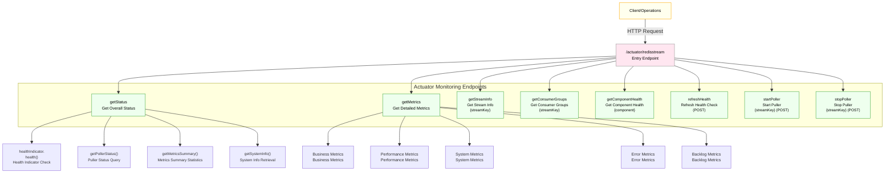
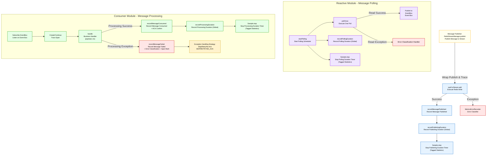

# Redis Stream - Actuator Integration Guide

## Overview
This component builds on Spring Boot Actuator and Micrometer to expose health, metrics, and management capabilities for Redis Stream. It supports manual health refresh, single-component health queries, poller start/stop, and backlog statistics.

## Exposed Endpoints

- GET `/actuator/redisstream`
  - Returns the overall status (health summary, poller status, metrics summary, JVM info)

- GET `/actuator/redisstream/metrics`
  - Returns detailed metrics: business / performance / system / error / backlog

- GET `/actuator/redisstream/{streamKey}`
  - Returns basic info for the specified Stream (length, groups, first/lastId), reactive puller, and metrics

- GET `/actuator/redisstream/{streamKey}/groups`
  - Returns consumer group information for the specified Stream

- GET `/actuator/redisstream/health/{component}`
  - Returns health for a single component (supported: `redis|stream|consumerGroup|poller|business`)

- POST `/actuator/redisstream/health/refresh`
  - Force refresh of health checks (run all checks immediately and cache the results)

- POST `/actuator/redisstream/{streamKey}/start`
  - Start the puller for the specified Stream (sample uses the default group/consumer)

- POST `/actuator/redisstream/{streamKey}/stop`
  - Stop the puller for the specified Stream

## Metrics Description (Selected)

- Business counts: `messagesPublished`, `messagesConsumed`, `messagesAcknowledged`, `messagesFailed`, `messagesRetried`
- Performance timings:
  - Processing duration `redis.stream.processing.duration` (tag: `stream`)
  - Polling duration `redis.stream.polling.duration` (tag: `stream`)
  - Publishing duration `redis.stream.publishing.duration` (tag: `stream`)
  - All of the above also have an "untagged/global" series for overall observation
- System metrics: `activeConsumers`, `activePollers`, `messageBacklog`, `activeConnections`
- Error classification: `timeoutErrors`, `connectionErrors`, `serializationErrors`, `totalErrors`

## Health Check Aggregation

`RedisStreamHealthIndicator` checks each component (`redis/stream/consumerGroup/poller/business`) individually, then aggregates with `HealthLevel(UP/DEGRADED/DOWN)`:
- Critical components (`redis`, `stream`) fail → overall `DOWN`
- Non-critical components fail or warn → overall `DEGRADED`
- All components healthy → overall `UP`

## Actuator Workflow



## Component Internal Workflow



## Production Configuration Recommendations

```yaml
platform:
  cache:
    redis:
      stream:
        monitoring:
          enabled: true
          metrics:
            enabled: true
            detailed: false          # histograms/quantiles are off by default; enable temporarily when needed
            sampling-rate: 0.05      # for high QPS, suggest 0.05~0.3; tune higher for low QPS / stress tests
          performance:
            enabled: true
            record-processing-time: true
            record-polling-time: true
            record-publishing-time: true
          error-monitoring:
            enabled: true
            classify-by-type: true
            record-stack-trace: false
          business-monitoring:
            enabled: true
            record-message-count: true
            record-retry-count: true
            record-ack-count: true
```

## Usage Tips

- Tagged timers and untagged timers now share a unified sampling logic, avoiding duplicate-stat conflicts.
- Use single-component health for precise pinpointing: `/actuator/redisstream/health/{component}`.
- Unused endpoint utility methods (e.g., timer/gauge reads) should be cleaned up to reduce redundancy.
