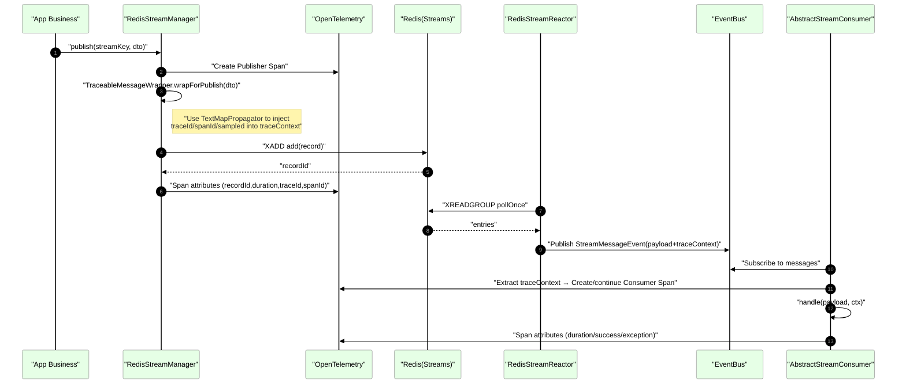
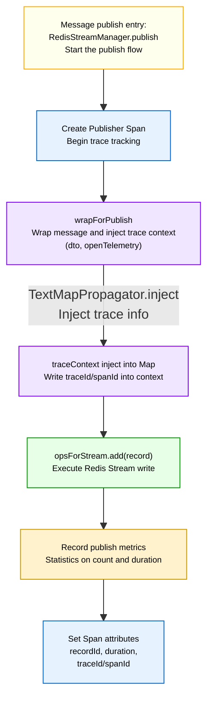
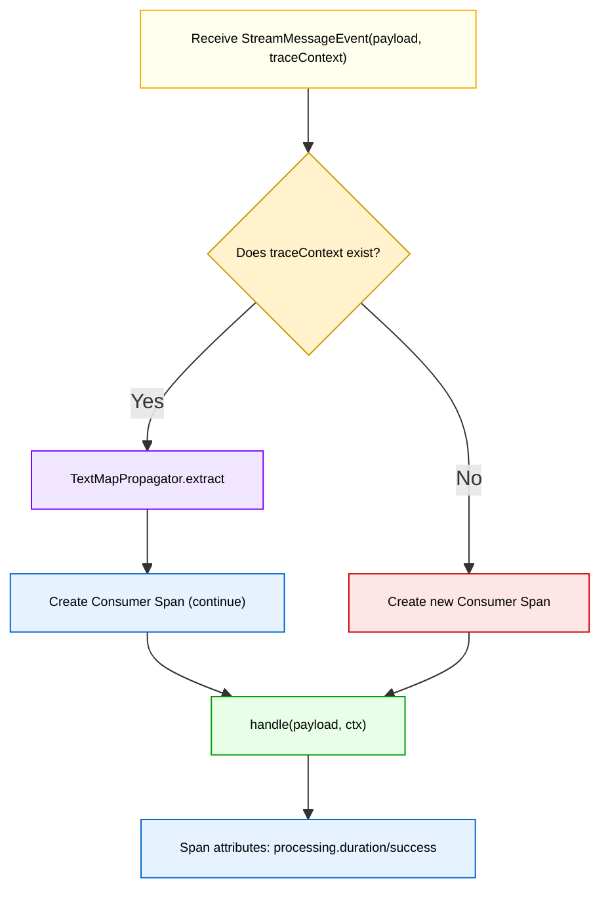
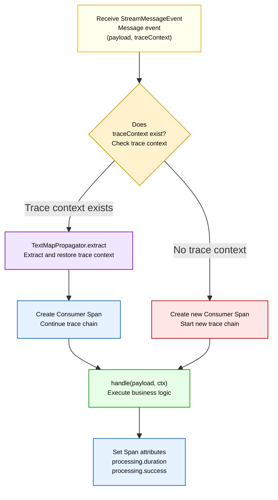

# Redis Stream - OpenTelemetry Trace Propagation Guide

This document explains how the current component propagates OpenTelemetry context (traceId, spanId, sampled) through the complete "publish → poll → consume" chain, and provides the core flow diagrams along with key logic descriptions.

## 1. Design Goals
- End-to-end: the publisher generates (or continues) a Span, allowing the upstream and downstream stages (puller, consumer) to continue the same trace.
- Non-intrusive: business message classes don't need to implement extra interfaces, and business fields remain untouched.
- Standardized: OTel TextMapPropagator is used to inject and extract context.

## 2. Key Participants
- `RedisStreamManager.publish(...)`: publisher entry point, creates a Publisher Span and injects OTel context into the message wrapper.
- `TraceableMessageWrapper`: transparent wrapper, responsible for injecting and extracting trace context (via TextMapPropagator).
- `RedisStreamReactor`: puller, forwards Redis records to the in-application EventBus.
- `AbstractStreamConsumer`: consumer, extracts context from the event and creates/continues the Consumer Span.

## 3. Trace Propagation Sequence Diagram

## 4. Publisher Core Logic

Key points:
- Inside `TraceableMessageWrapper.wrapForPublish(dto, otel)`:
  - Reads the current `Span.current().getSpanContext()`;
  - Uses `openTelemetry.getPropagators().getTextMapPropagator().inject(Context.current(), traceContext, setter)` to inject;
  - Business objects are not modified; the propagated data lives in the wrapper's `traceContext` Map.

## 5. Consumer Core Logic

Key points:
- Inside `AbstractStreamConsumer`:
  - If `TraceableMessageWrapper` is present and `hasValidTraceContext()` returns true, the trace context is extracted first and the Consumer Span is created on top of that context; otherwise a new Span is created.
  - On exception, `recordError(...)` is recorded and `processing.success=false` is tagged.

## 6. TraceableMessageWrapper Role Description

## 7. Coordination with Metrics (Micrometer)

- Publishing, polling, and processing all adopt a "dual-channel" timing strategy: untagged (global aggregation) plus a per-`stream`-tagged `Timer`;
- Sampling is uniformly controlled by `metrics.samplingRate` and independent switches (processing/polling/publishing), avoiding duplication and inconsistency;
- Fine-grained exception classification (timeout / connection / serialization) is performed through `MetricsErrorRecorder`, compatible with common Lettuce/Jedis exceptions.

## 8. End-to-End Verification Recommendations

- Print `traceId/spanId` at the publisher entry and on the consumer side (already exposed as Span attributes);
- Use an OTel backend (e.g. Tempo/Jaeger) to search for the publisher's `traceId`; it should chain the Reactor and Consumer Spans together;
- Combine with the Actuator endpoints `/actuator/redisstream` and `/actuator/redisstream/metrics` to verify metrics and health information.

## 9. FAQ
- Failed to continue the trace: check whether the event object correctly carries `traceContext`, and whether the consumer invoked `extract`;
- Multiple wrapping: make sure `wrapForPublish` is only called at the publisher entry;
- High overhead: tune `sampling-rate` and set `detailed=false`, and disable some of the expensive statistics switches as needed.
