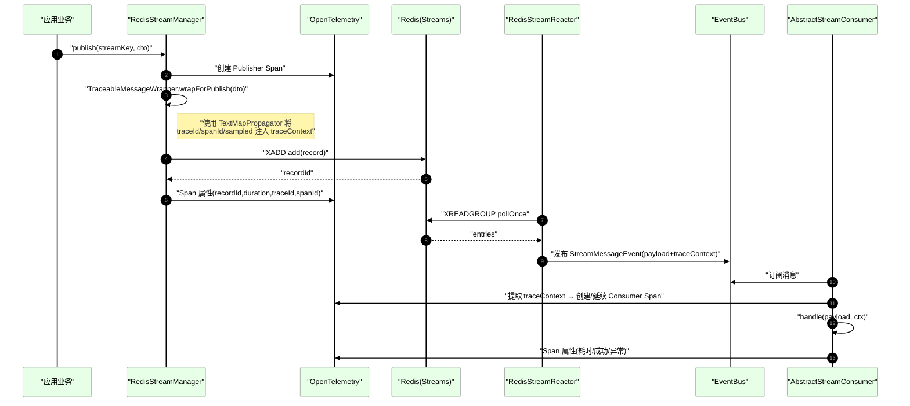

# Richie Redis Stream Usage Guide

> **Note (2026-06)**: Stream MQ has been split out into the standalone module `atlas-richie-component-redis-streammq`, with the facade `StreamMQ.stream()`. The `GlobalCache.stream()` syntax used in earlier versions of this document is historical; please refer to the streammq module as the source of truth.

This document is intended for business teams using Stream MQ and covers three major areas:

- Sending and receiving messages (publishing and consumption)
- Distributed tracing (Java Agent integration and configuration)
- Monitoring and operations (Actuator endpoints and health checks)

---

## 1. Sending and Receiving Messages

### 1.1 Dependencies and Terminology
- Message carriers need to implement or reuse `BaseStreamMessage`. The framework uses JSON serialization internally and writes the complete message (business payload + trace context) into Redis Stream after Base64-encoding it.
- Producers publish via `StreamFunction.publish(streamKey, payload)`; consumers annotate the consumer class with `@RedisStreamConsumer` and implement the `handle` method on `AbstractStreamConsumer<T>`.

### 1.2 Publishing Messages (Producer)

- Recommended: publish messages via `StreamMQ.stream().publish(streamKey, payload)` (depends on `atlas-richie-component-redis-streammq`).
- On publish, the framework automatically:
  - Routes the message to the corresponding queue based on the `streamKey` and payload you provide
  
  * And handles distributed tracing and metric monitoring at the same time

Usage notes:
- `streamKey` should be partitioned by domain, e.g. `order-events`, `user-events`.
- `payload` is the business DTO and must be JSON-serializable. To standardize the message type, the DTO must implement the marker interface `BaseStreamMessage`, and implementing the DTO as a `record` class is recommended.

### 1.3 Consuming Messages (Consumer)
- Annotate the consumer class:

  ```java
  @RedisStreamConsumer("order-events")
  public class OrderEventConsumer extends AbstractStreamConsumer<OrderEvent> {
      @Override
      protected void handle(OrderEvent payload, EventContext ctx) throws Exception {
          // 处理业务逻辑
      }
  }
  ```

- Configuration-driven consumer instances (example):

  ```yaml
  platform:
    cache:
      redis:
        stream:
          consumers:
            enabled: true
            configs:
              order-events:
                stream-key: "order-events"
                group: "order-processors"
                consumer: "order-consumer-1"
                target-type: "com.example.OrderEvent"
                auto-ack: true
                concurrency: 4
                error-strategy: SKIP   # SKIP | RETRY | NO_ACK
                max-retries: 3
                retry-delay: 1s
                idempotency-enabled: true
                auto-start: true
  ```

Configuration field descriptions (fields under `consumers.configs.[name]`):

| Field | Type | Description | Example / Default |
|-------|------|-------------|-------------------|
| enabled | boolean | Whether to enable configuration-based consumer auto-assembly | true |
| configs | map | Consumer configuration map; the key is the config name (must match `@RedisStreamConsumer("name")`) | - |
| stream-key | string | Target Redis Stream key | "order-events" |
| group | string | Consumer group name | "order-processors" |
| consumer | string | Current instance's consumer name, used to distinguish different instances within the same group | "order-consumer-1" (default: "default-consumer") |
| target-type | class | Business payload type (must be a JSON-deserializable class, ideally a record). When this field is not set, the consumer is treated as a dead-letter queue consumer and defaults to `DeadLetterMessage` | "com.example.OrderEvent" |
| auto-ack | boolean | Whether to auto-ACK on success; when set to `false`, you must manually call the `ack` method on the `ctx` parameter of the `handle` method to commit the ACK to Redis | true |
| concurrency | int | Number of concurrent consumers | 4 (default: 1) |
| error-strategy | enum | Error handling strategy: `SKIP` skips and continues; `RETRY` performs a simple one-time retry; `NO_ACK` leaves the message unacknowledged for later processing | SKIP |
| max-retries | int | Maximum retry attempts (effective when the strategy is `RETRY`; the current implementation retries once and is reserved for extension) | 3 |
| retry-delay | duration | Retry delay (standard Spring Duration expression) | 1s |
| idempotency-enabled | boolean | Whether to enable idempotent deduplication | true |
| auto-start | boolean | Whether the consumer should auto-start after application startup | true |


Implementation details (built into the framework, included here only as a flow explanation for context):
- The framework auto-decodes Base64 → parses the map → reads `payload` and converts it to `target-type`;
- Automatically extracts the trace context, creates a CONSUMER span on the consumer side, and establishes parent/child relationships;
- Supports concurrent processing, error strategies (SKIP / RETRY / NO_ACK), and automatic ACK;
- Idempotency protection: by default, in-memory dedup with Redis as the fallback (configurable TTL and namespace).

### 1.4 Dead-Letter Queue (DLQ)
- The framework supports "convention over configuration": when the config name is recognized as a DLQ (e.g., starts with `dlq-`/`dlq:` or contains `dead-letter`) and `target-type` is not explicitly set, it defaults to `DeadLetterMessage`.

- Unified utility: `DeadLetterQueueUtil` provides strategies such as `GLOBAL`, `BY_MESSAGE_TYPE`, `BY_SOURCE_STREAM`, and `HYBRID`.

- The consumer side can decide in `onError` whether to send the message to the DLQ based on business rules.

- Configuration example:

  ```yaml
  
  # 死信队列专用配置
  platform:
      cache:
          redis:
              stream:
                  consumers:
                      enabled: true
                      configs:
                          # ==================== 全局死信队列 ====================
                          # 所有类型的死信消息都发送到 dlq:global
                          # target-type 默认为 DeadLetterMessage，无需显式配置
                          dlq-global:
                              stream-key: "dlq:global"
                              group: "dlq-global-processors"
                              consumer: "dlq-global-consumer"
                              auto-ack: true
                              concurrency: 3
                              error-strategy: skip
                              auto-start: true
  
                          # ==================== 按消息类型分组的死信队列 ====================
                          # UserInfo/OrderInfo 类型的死信消息
                          dlq-type-userinfo:
                              stream-key: "dlq:type:UserInfo"
                              group: "dlq-type-processors"
                              consumer: "dlq-userinfo-consumer"
                              auto-ack: true
                              concurrency: 2
                              error-strategy: skip
                              auto-start: true
  
                          dlq-type-orderinfo:
                              stream-key: "dlq:type:OrderInfo"
                              group: "dlq-type-processors"
                              consumer: "dlq-orderinfo-consumer"
                              auto-ack: true
                              concurrency: 2
                              error-strategy: skip
                              auto-start: true
  
                          # ==================== 按源队列分组的死信队列 ====================
                          # 来自 user-events/order-events 队列的死信消息
                          dlq-stream-user-events:
                              stream-key: "dlq:stream:user-events"
                              group: "dlq-stream-processors"
                              consumer: "dlq-user-events-consumer"
                              auto-ack: true
                              concurrency: 1
                              error-strategy: skip
                              auto-start: true
  
                          dlq-stream-order-events:
                              stream-key: "dlq:stream:order-events"
                              group: "dlq-stream-processors"
                              consumer: "dlq-order-events-consumer"
                              auto-ack: true
                              concurrency: 1
                              error-strategy: skip
                              auto-start: true
  
                          # ==================== 混合模式死信队列策略 ====================
                          # 同时处理全局和类型分组的死信消息
                          dlq-hybrid-global:
                              stream-key: "dlq:global"
                              group: "dlq-hybrid-processors"
                              consumer: "dlq-hybrid-global-consumer"
                              auto-ack: true
                              concurrency: 3
                              error-strategy: skip
                              auto-start: true
  
                          dlq-hybrid-type:
                              stream-key: "dlq:type:UserInfo"
                              group: "dlq-hybrid-processors"
                              consumer: "dlq-hybrid-type-consumer"
                              auto-ack: true
                              concurrency: 2
                              error-strategy: skip
                              auto-start: true
  ```

- Example code:

  ```java
  package com.richie.component.cache.subscriber;
  
  import domain.com.richie.component.cache.OrderInfo;
  import stream.redis.com.richie.component.cache.AbstractStreamConsumer;
  import stream.redis.com.richie.component.cache.EventContext;
  import stream.redis.com.richie.component.cache.RedisStreamConsumer;
  import utils.redis.com.richie.component.cache.DeadLetterQueueUtil;
  import service.com.richie.component.cache.OrderService;
  import lombok.RequiredArgsConstructor;
  import lombok.extern.slf4j.Slf4j;
  import org.springframework.stereotype.Component;
  
  import java.math.BigDecimal;
  
  /**
   * 订单信息 Redis Stream 消费者
   *
   * <p>演示如何自定义死信队列策略
   *
   * @author richie696
   * @since 2025-01-27
   */
  @Slf4j
  @Component
  @RequiredArgsConstructor
  @RedisStreamConsumer("order-events")
  public class OrderStreamConsumer extends AbstractStreamConsumer<OrderInfo> {
  
      private final OrderService orderService;
  
      /**
       * 处理订单信息消息
       */
      @Override
      protected void handle(OrderInfo orderInfo, EventContext ctx) throws Exception {
          log.info("处理订单信息: orderId={}, userId={}", orderInfo.getOrderId(), orderInfo.getUserId());
  
          // 模拟业务处理
          orderService.processOrder(orderInfo);
  
          // 手动确认消息
          ctx.ack();
      }
  
      /**
       * 错误处理方法
       *
       * <p>当消息处理发生异常时调用，用户决定如何处理错误
       * <p>包括：是否发送到死信队列、使用什么策略、发送告警通知等
       *
       * @param e 异常对象
       * @param orderInfo 发生错误的消息负载
       * @param ctx 事件上下文
       */
      @Override
      protected void onError(Throwable e, OrderInfo orderInfo, EventContext ctx) {
          log.error("处理订单消息时发生错误: orderId={}, userId={}, error={}",
                  orderInfo.getOrderId(), orderInfo.getUserId(), e.getMessage(), e);
  
          // 用户决定是否发送到死信队列
          boolean shouldSendToDeadLetter = orderService.shouldSendToDeadLetter(e, orderInfo, ctx);
  
          if (shouldSendToDeadLetter) {
              // 根据业务规则选择死信队列策略
              DeadLetterQueueUtil.DeadLetterStrategy strategy = selectDeadLetterStrategy(orderInfo);
  
              // 发送到死信队列（使用指定策略）
              boolean success = sendToDeadLetterQueue(orderInfo, e, ctx, strategy);
              if (success) {
                  log.info("订单消息已发送到死信队列: orderId={}, amount={}, strategy={}",
                          orderInfo.getOrderId(), orderInfo.getAmount(), strategy);
              } else {
                  log.error("发送到死信队列失败: orderId={}, amount={}",
                          orderInfo.getOrderId(), orderInfo.getAmount());
              }
          } else {
              log.info("根据业务规则，不发送到死信队列: orderId={}, amount={}",
                      orderInfo.getOrderId(), orderInfo.getAmount());
          }
  
          // 其他错误处理逻辑：
          // 1. 更新订单状态为处理失败
          // 2. 发送告警通知
          // 3. 记录到业务日志
          // 4. 通知相关业务人员等
  
          // 示例：记录订单处理失败
          log.warn("订单处理失败，需要人工干预: orderId={}, userId={}, error={}",
                  orderInfo.getOrderId(), orderInfo.getUserId(), e.getMessage());
      }
  
      /**
       * 选择死信队列策略
       *
       * <p>根据订单信息选择不同的死信队列策略
       *
       * @param orderInfo 订单信息
       * @return 死信队列策略
       */
      private DeadLetterQueueUtil.DeadLetterStrategy selectDeadLetterStrategy(OrderInfo orderInfo) {
          // 根据订单金额选择不同的死信队列策略
          if (orderInfo.getAmount() != null && orderInfo.getAmount().compareTo(BigDecimal.valueOf(1000)) > 0) {
              // 高金额订单使用按源队列分组策略（便于重点监控）
              return DeadLetterQueueUtil.DeadLetterStrategy.BY_SOURCE_STREAM;
          } else if (orderInfo.getAmount() != null && orderInfo.getAmount().compareTo(BigDecimal.valueOf(100)) > 0) {
              // 中等金额订单使用按消息类型分组策略
              return DeadLetterQueueUtil.DeadLetterStrategy.BY_MESSAGE_TYPE;
          } else {
              // 低金额订单使用全局死信队列策略
              return DeadLetterQueueUtil.DeadLetterStrategy.GLOBAL;
          }
      }
  
  }
  
  ```

  

### 1.5 Best Practices
- A single Stream should only carry a clear family of business-domain event types; avoid overly "mixed" usage.
- Consumer group granularity: align with deployment units or responsibilities; consumer names distinguish instances.
- Use `NO_ACK` with caution (it retains pending entries); prefer SKIP/RETRY.
- For idempotency keys, prefer business-unique keys (you can override `buildIdempotencyKey`).

---

## 2. Distributed Tracing (OpenTelemetry Java Agent)

### 2.0 Fundamentals Overview (Propagation Mechanism)

The following excerpt is taken from the "Redis-Stream-Tracing-Propagation" document to help you quickly understand how it works before using it:

- Key participants:
  - Producer `RedisStreamManager.publish`: creates a Publisher Span, wraps the message and injects the W3C context (`traceparent` / `tracestate`) along with auxiliary fields (`traceId` / `spanId` / `sampled`).
  - Wrapper `TraceableMessageWrapper`: non-invasively wraps business messages; injects on the producer side and extracts on the consumer side.
  - Puller `RedisStreamReactor`: pulls via XREADGROUP and forwards records as in-app events.
  - Consumer `AbstractStreamConsumer`: extracts the context from events, creates or continues a Consumer Span, and records processing duration and exceptions.
- Propagation essentials:
  - Message contents are stored as the Base64-encoded field `data`, internally containing `payload` and `traceContext`.
  - When the Java Agent is active, `GlobalOpenTelemetry` is used preferentially; otherwise it falls back to the in-app instance.
  - If the propagator is Noop (common when no Agent is attached), the trace cannot be continued, and the upstream/downstream `traceId` will be disconnected.




### 2.1 Integration Approach
- Uses non-invasive Java Agent integration (recommended).
- The in-app auto-configuration already handles compatibility and will preferentially use the Java Agent's global `OpenTelemetry` when detected.
- To avoid "double writing", it is recommended to disable Spring/Micrometer's built-in exports (example):
  
  ```yaml
  management:
    tracing:
      enabled: false
    otlp:
      tracing.export.enabled: false
      metrics.export.enabled: false
  platform:
    cache:
      redis:
        stream:
          tracing:
            enabled: false
  ```

### 2.2 Development / Test Example Parameters (Verified)

```bash
-javaagent:D:\Projects\richie-platform\richie-component-template\sample-cache\libs\opentelemetry-javaagent.jar \
-Dotel.java.global-autoconfigure.enabled=true \
-Dotel.exporter.otlp.protocol=grpc \
-Dotel.exporter.otlp.endpoint=http://10.100.0.90:4317 \
-Dotel.service.name=richie-component-template \
-Dotel.traces.sampler=parentbased_traceidratio \
-Dotel.traces.sampler.arg=1.0
```

Notes: the parameters above are suitable for development and testing. Differentiated configuration is recommended for production environments (see the next section).

### 2.3 Recommended Production Parameters (Placeholder Example)

```bash
-javaagent:${OTEL_AGENT_PATH} \
-Dotel.java.global-autoconfigure.enabled=true \
-Dotel.exporter.otlp.protocol=grpc \
-Dotel.exporter.otlp.endpoint=${OTLP_ENDPOINT} \
-Dotel.service.name=${SERVICE_NAME} \
-Dotel.resource.attributes=deployment.environment=prod,service.version=${SERVICE_VERSION},cloud.region=${REGION} \
-Dotel.traces.sampler=parentbased_traceidratio \
-Dotel.traces.sampler.arg=${SAMPLER_RATIO} \
-Dotel.exporter.otlp.timeout=10s
```

Placeholder descriptions:
- `${OTEL_AGENT_PATH}`: absolute path of the javaagent (e.g., `/opt/otel/opentelemetry-javaagent.jar`)
- `${OTLP_ENDPOINT}`: OTLP Collector address (e.g., `http://otel-collector:4317`)
- `${SERVICE_NAME}`: service name (matches the APM backend)
- `${SERVICE_VERSION}`: service version (e.g., `1.2.3`)
- `${REGION}`: deployment region (e.g., `cn-north-1`)
- `${SAMPLER_RATIO}`: sampling rate (recommended `0.05 ~ 0.2`, depending on throughput and cost)

Notes:
- In production, use reasonable sampling to avoid the cost and performance overhead of full (`1.0`) sampling;
- Make sure `GlobalOpenTelemetry` is available (the agent is active); otherwise the propagator may be `Noop`, in which case the `traceId` of message producers and consumers may not stay consistent (i.e., propagation fails), causing the trace to break;
- The framework already injects `traceparent` / `tracestate` / `traceId` / `spanId` / `sampled` into messages, allowing downstream services to continue chaining traces.

---

## 3. Monitoring and Operations

### 3.0 Architecture Overview (Actuator Workflow)

The following excerpt is taken from the "Redis-Stream-Actuator-Structure" document to give you a holistic understanding before operating the endpoints:

- Exposed endpoints (the current version uses the unified `/actuator/redis-stream` system; see 3.2 for details):
  - Overview: `GET /actuator/redis-stream`
  - Details: `GET /actuator/redis-stream/{streamKey}`, `GET /actuator/redis-stream/{streamKey}/groups`
  - Metrics: `GET /actuator/redis-stream/metrics/*` (summary / business / performance / system / errors / backlog)
  - Health refresh: `GET|POST /actuator/redis-stream/health/refresh`
  - Link list (optional): `GET /actuator/redis-stream-links`
  
- Workflow essentials:
  - The overview aggregates results from health indicators (component-level: redis / stream / consumerGroup / poller / business).
  - The detail page consolidates: basic Stream info, consumer groups, puller snapshots, and (optional) metrics.
  - Each metric category can be queried independently, and all response structures include a `desc` field for frontend display.
  - Health checks prioritize dynamic inspection of "registered streams / groups / pullers", falling back to basic connectivity tests when there are no active ones.
  
  ```mermaid
  flowchart TD
    A[Client/运维人员] -->|HTTP请求| B["/actuator/redisstream<br/>入口端点"]
    
    subgraph ActuatorEndpoints["Actuator 监控端点"]
      C["getStatus<br/>获取整体状态"]
      D["getMetrics<br/>获取详细指标"]
      E["getStreamInfo<br/>获取Stream信息<br/>{streamKey}"]
      F["getConsumerGroups<br/>获取消费者组<br/>{streamKey}"]
      G["getComponentHealth<br/>获取组件健康状态<br/>{component}"]
      H["refreshHealth<br/>刷新健康检查<br/>(POST)"]
      I["startPoller<br/>启动拉取器<br/>{streamKey} (POST)"]
      J["stopPoller<br/>停止拉取器<br/>{streamKey} (POST)"]
    end
  
    B --> C
    B --> D
    B --> E
    B --> F
    B --> G
    B --> H
    B --> I
    B --> J
  
    C --> C1["healthIndicator.<br/>health()<br/>健康指示器检查"]
    C --> C2["getPollerStatus()<br/>拉取器状态查询"]
    C --> C3["getMetricsSummary()<br/>指标摘要统计"]
    C --> C4["getSystemInfo()<br/>系统信息获取"]
  
    D --> D1["Business Metrics<br/>业务指标"]
    D --> D2["Performance Metrics<br/>性能指标"]
    D --> D3["System Metrics<br/>系统指标"]
    D --> D4["Error Metrics<br/>错误指标"]
    D --> D5["Backlog Metrics<br/>积压指标"]
  
    style A fill:#ffe,stroke:#fa0,color:#000
    style B fill:#ffe6f0,stroke:#999,color:#000
    style C fill:#efe,stroke:#4a4,color:#000
    style D fill:#efe,stroke:#4a4,color:#000
    style E fill:#efe,stroke:#4a4,color:#000
    style F fill:#efe,stroke:#4a4,color:#000
    style G fill:#efe,stroke:#4a4,color:#000
    style H fill:#efe,stroke:#4a4,color:#000
    style I fill:#efe,stroke:#4a4,color:#000
    style J fill:#efe,stroke:#4a4,color:#000
  
    %% 自定义CSS样式来调整节点大小
    classDef default font-size:12px;
    classDef longText font-size:11px,min-width:140px;
    
    class E,F,G,H,I,J,C1,C2,C3,C4 longText;
  ```
  
  

### 3.1 Actuator Exposure Configuration

```yaml
management:
  endpoints:
    web:
      exposure:
        include: "health,info,redis-stream,redis-stream-links"
```

To expose all endpoints (recommended only on internal or protected networks):

```yaml
management:
  endpoints:
    web:
      exposure:
        include: "*"
```

### 3.2 Endpoints and Paths

Overview and details:
- GET `/actuator/redis-stream`: overall status (includes health, metrics summary, system info)

- GET `/actuator/redis-stream/{streamKey}`: details for a specific Stream (consumer groups, puller status, optional metrics)

- GET `/actuator/redis-stream/{streamKey}/groups`: consumer group info for a specific Stream

  

Metrics breakdown:
- GET `/actuator/redis-stream/metrics/summary`: metrics summary (business / performance / system / errors)

- GET `/actuator/redis-stream/metrics/business`

- GET `/actuator/redis-stream/metrics/performance`

- GET `/actuator/redis-stream/metrics/system`

- GET `/actuator/redis-stream/metrics/errors`

- GET `/actuator/redis-stream/metrics/backlog`

  

Health refresh:
- GET `/actuator/redis-stream/health/refresh` (convenience refresh)
- POST `/actuator/redis-stream/health/refresh`

Link list (optional, for enhanced display):
- GET `/actuator/redis-stream-links`: provides fixed clickable links and descriptions on the Actuator root page (when this endpoint is enabled).

  

Notes:
- Metrics response structures uniformly include a `desc` field to help the frontend display meaning;
- In the consumer group list: `name` / `consumers` / `pending` / `lastDeliveredId` use a `{ value, desc }` structure;
- Health checks dynamically traverse registered streams and consumer groups, falling back to basic connectivity tests when necessary;
- If `redis-stream-links` is not enabled, the Actuator root page only displays templated paths (`{seg1}/{seg2}`).

### 3.3 Common Issues and Troubleshooting
- Encounter `NoopTextMapPropagator`: usually caused by the Java Agent not being enabled or `GlobalOpenTelemetry` not being initialized properly;
- Empty metrics / health: check `management.endpoints.web.exposure.include` and whether the endpoints are enabled;
- Double-write issue: make sure Micrometer/OTLP auto-export is disabled, or keep only one path;
- Useless test/default streams: health checks have been changed to dynamically detect registered streams to avoid false positives.


### 3.4 Monitoring Configuration (Business / Performance / Error / Health)

Recommended production configuration (example, from `platform.cache.redis.stream.monitoring.*`):

```yaml
platform:
  cache:
    redis:
      stream:
        monitoring:
          enabled: true                 # 生产建议开启
          metrics:
            enabled: true               # 上报指标
            detailed: false             # 默认关闭直方图/分位数，必要时临时开启
            sampling-rate: 0.1          # 高并发建议 0.05 - 0.3
          performance:
            enabled: true               # 开启性能统计
            record-processing-time: true
            record-polling-time: true
            record-publishing-time: true
          error-monitoring:
            enabled: true
            classify-by-type: true      # 按错误类型分类，便于差异化告警
            record-stack-trace: false   # 仅定位问题时临时开启
          business-monitoring:
            enabled: true               # 业务计数推荐开启
            record-message-count: true
            record-retry-count: true
            record-ack-count: true
          health-check:
            enabled: true
            interval: 30s               # 30s~60s
            timeout: 5s                 # 3s~5s
```

Configuration field descriptions:

| Path | Type | Description | Recommendation / Default |
|------|------|-------------|--------------------------|
| monitoring.enabled | boolean | Master monitoring switch (when disabled, health checks and metric collection are skipped) | Enable in production (default false) |
| monitoring.metrics.enabled | boolean | Micrometer metrics switch | Enable in production |
| monitoring.metrics.detailed | boolean | Percentiles / histograms (P50 / P95 / P99); increases CPU and memory overhead | Default true; recommend `false` in production, enable on demand |
| monitoring.metrics.sampling-rate | double | Metric sampling rate 0.0-1.0 | High concurrency 0.05-0.3; low concurrency / stress test 1.0 |
| monitoring.performance.enabled | boolean | Performance statistics (processing / polling / publishing duration) | Enable in production |
| monitoring.performance.record-processing-time | boolean | Record processing duration | Enable in production |
| monitoring.performance.record-polling-time | boolean | Record polling duration | Enable in production |
| monitoring.performance.record-publishing-time | boolean | Record publishing duration | Enable in production |
| monitoring.error-monitoring.enabled | boolean | Error metrics switch | Enable in production |
| monitoring.error-monitoring.classify-by-type | boolean | Whether to classify counts by error type | Enable (for differentiated alerting) |
| monitoring.error-monitoring.record-stack-trace | boolean | Whether to record stack traces (significantly increases overhead) | Default false; enable during troubleshooting |
| monitoring.business-monitoring.enabled | boolean | Business counter switch (publish / consume / ack / retry, etc.) | Enable in production |
| monitoring.business-monitoring.record-message-count | boolean | Whether to record publish / consume counts | Enable |
| monitoring.business-monitoring.record-retry-count | boolean | Whether to record retry counts | Enable |
| monitoring.business-monitoring.record-ack-count | boolean | Whether to record ACK counts | Enable |
| monitoring.health-check.enabled | boolean | Health check switch | Enable in production |
| monitoring.health-check.interval | duration | Health check interval | 30s ~ 60s |
| monitoring.health-check.timeout | duration | Per-check timeout | 3s ~ 5s |