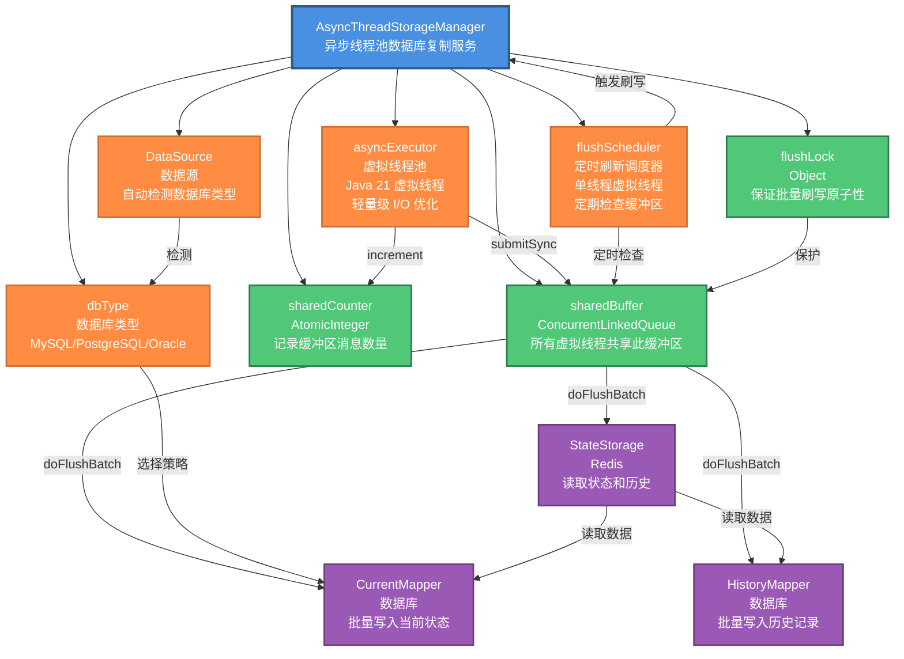
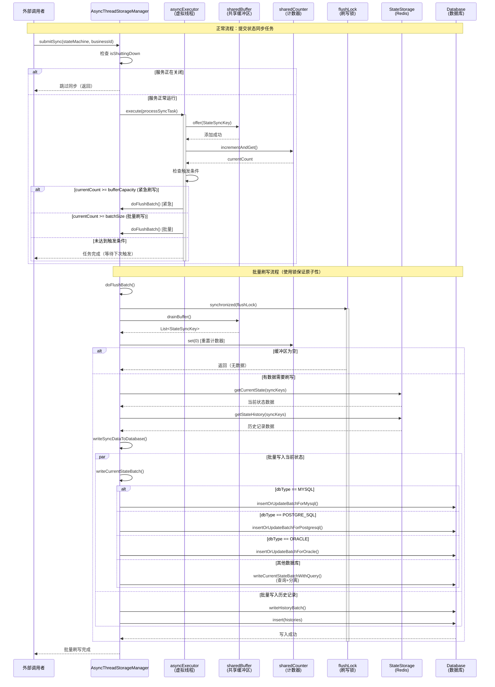
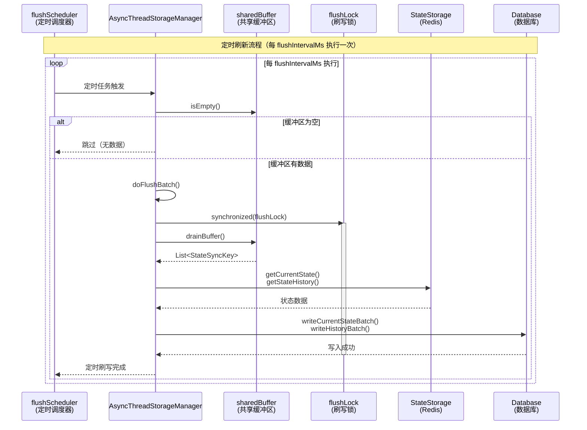

# AsyncThreadStorageManager 工作原理图

## 架构图



## 核心组件说明

### 1. 异步执行线程池 (asyncExecutor)

- **作用**：执行 `submitSync()` 任务，将状态同步键添加到共享缓冲区
- **类型**：`ExecutorService`（虚拟线程）
- **实现**：`Executors.newVirtualThreadPerTaskExecutor()`
- **特点**：
  - 使用 Java 21 虚拟线程，轻量级，可创建数百万个线程
  - 在 I/O 阻塞时自动释放平台线程，提高资源利用率
  - 无需手动管理线程池大小，由 JVM 自动调度

### 2. 定时刷新调度器 (flushScheduler)

- **作用**：定期检查共享缓冲区，如果有数据则触发刷写，确保数据及时持久化
- **类型**：`ScheduledExecutorService`（单线程虚拟线程）
- **实现**：`Executors.newScheduledThreadPool(1, Thread.ofVirtual().factory())`
- **调度间隔**：`flushIntervalMs`（默认 2000ms）
- **特点**：
  - 即使未达到批量大小，也会定期刷写缓冲区中的数据
  - 确保数据及时持久化，避免长时间停留在缓冲区
  - 使用虚拟线程，资源占用极低

### 3. 共享缓冲区 (sharedBuffer & sharedCounter)

- **sharedBuffer**：`ConcurrentLinkedQueue<StateSyncKey>`，存储待同步的状态同步键
- **sharedCounter**：`AtomicInteger`，记录当前缓冲区中的消息数量
- **特点**：
  - 所有虚拟线程共享同一个缓冲区，支持跨线程批量累积
  - 使用 `ConcurrentLinkedQueue` 和 `AtomicInteger` 保证线程安全
  - 不再使用 ThreadLocal，避免了虚拟线程场景下的问题

### 4. 批量刷写锁 (flushLock)

- **作用**：保证批量刷写的原子性，避免多个线程同时触发刷写导致数据丢失
- **类型**：`Object`（synchronized 锁）
- **使用场景**：在 `doFlushBatch()` 方法中使用 `synchronized` 保护

### 5. 数据库类型检测 (dbType)

- **作用**：根据不同的数据库类型选择不同的批量插入或更新策略
- **检测方式**：通过 `DataSource` 的 `DatabaseMetaData` 自动检测
- **支持类型**：
  - MySQL：使用 `INSERT ... ON DUPLICATE KEY UPDATE`
  - PostgreSQL：使用 `INSERT ... ON CONFLICT ... DO UPDATE`
  - Oracle：使用 `MERGE INTO`
  - 其他：回退到查询+分离方式

## 数据流向

```
状态变更事件
    │
    ▼
submitSync(stateMachineName, businessId)
    │
    ▼
asyncExecutor.execute() [虚拟线程异步执行]
    │
    ▼
sharedBuffer.offer(StateSyncKey) [添加到共享缓冲区]
    │
    ▼
sharedCounter.incrementAndGet() [增加计数器]
    │
    ▼
检查触发条件：
  - currentCount >= bufferCapacity? → doFlushBatch() [紧急刷写]
  - currentCount >= batchSize? → doFlushBatch() [批量刷写]
    │
    ▼
定时刷新任务（每 flushIntervalMs 执行一次）
    │
    ├─→ 检查 sharedBuffer 是否有数据
    └─→ 有数据 → doFlushBatch() [定时刷写]
    │
    ▼
doFlushBatch() [使用 flushLock 保证原子性]
    │
    ├─→ drainBuffer() [从共享缓冲区批量取出数据]
    │
    ├─→ StateStorage.getCurrentState() [从 Redis 读取当前状态]
    ├─→ StateStorage.getStateHistory() [从 Redis 读取历史记录]
    │
    ▼
批量写入数据库：
    ├─→ writeCurrentStateBatch() [根据 dbType 选择策略]
    │   ├─→ MySQL: insertOrUpdateBatchForMysql()
    │   ├─→ PostgreSQL: insertOrUpdateBatchForPostgresql()
    │   ├─→ Oracle: insertOrUpdateBatchForOracle()
    │   └─→ 其他: writeCurrentStateBatchWithQuery() [查询+分离]
    │
    └─→ writeHistoryBatch() [批量写入历史记录]
```

## 时序图



### 定时刷新时序图



## 触发刷写的条件

1. **批量大小触发**：`sharedCounter >= batchSize`（默认 200）
  - 当计数器达到批量大小时，自动触发刷写
  - 每个虚拟线程在添加数据后都会检查此条件
2. **缓冲区容量触发**：`sharedCounter >= bufferCapacity`（默认 10000，紧急刷写）
  - 当缓冲区达到最大容量时，立即触发紧急刷写
  - 避免缓冲区溢出，保证系统稳定性
3. **定时触发**：`flushScheduler` 每 `flushIntervalMs`（默认 2000ms）执行一次
  - 定期检查共享缓冲区，如果有数据则触发刷写
  - 确保数据及时持久化，即使未达到批量大小也会定期刷写
  - 使用共享缓冲区，定时任务可以正常访问
4. **服务关闭触发**：`@PreDestroy` 方法中刷写剩余缓冲区
  - 优雅关闭时，确保所有待同步数据都被写入数据库

## 线程安全机制

- **共享缓冲区**：使用 `ConcurrentLinkedQueue` 保证线程安全的队列操作
- **共享计数器**：使用 `AtomicInteger` 保证线程安全的计数操作
- **批量刷写锁**：使用 `synchronized` 锁保证批量刷写的原子性
- **关闭标志**：`isShuttingDown` 使用 `AtomicBoolean` 防止关闭期间继续处理

## 数据库兼容性

### 支持的数据库及策略


| 数据库类型      | 批量插入或更新策略                          | SQL 语法                                 |
| ---------- | ---------------------------------- | -------------------------------------- |
| MySQL      | `insertOrUpdateBatchForMysql`      | `INSERT ... ON DUPLICATE KEY UPDATE`   |
| PostgreSQL | `insertOrUpdateBatchForPostgresql` | `INSERT ... ON CONFLICT ... DO UPDATE` |
| Oracle     | `insertOrUpdateBatchForOracle`     | `MERGE INTO ...`                       |
| 其他         | `writeCurrentStateBatchWithQuery`  | 查询+分离方式（兼容所有数据库）                       |


### 自动检测机制

- 在 `@PostConstruct` 方法中，通过 `DataSource.getConnection()` 获取连接
- 使用 `DatabaseMetaData.getDatabaseProductName()` 获取数据库产品名称
- 根据产品名称自动映射到对应的 `DbType`
- 检测失败时自动回退到查询+分离方式，保证兼容性

## 优雅关闭流程

```
@PreDestroy shutdown()
    │
    ├─→ isShuttingDown.set(true) [设置关闭标志]
    │
    ├─→ shutdownExecutor(flushScheduler) [关闭定时刷新调度器]
    │   └─→ 停止定时任务
    │
    ├─→ shutdownExecutor(asyncExecutor) [关闭虚拟线程执行器]
    │   └─→ 等待任务完成或超时后强制关闭
    │
    ├─→ doFlushBatch() [刷写剩余的共享缓冲区]
    │   └─→ 确保所有待同步数据都被写入数据库
    │
    └─→ 完成关闭
```

## 性能优化

### 虚拟线程优势

- **轻量级**：可以创建数百万个虚拟线程，不受平台线程数量限制
- **I/O 优化**：在 I/O 阻塞时自动释放平台线程，提高资源利用率
- **简化管理**：无需手动管理线程池大小，由 JVM 自动调度

### 批量操作优化

- **数据库原生语法**：支持的数据库使用原生批量插入或更新语法，性能更优
- **减少数据库交互**：从 3 次（查询+插入+更新）减少到 1 次（批量插入或更新）
- **智能回退**：不支持的数据库自动回退到查询+分离方式，保证功能正常

### 线程安全优化

- **无锁队列**：使用 `ConcurrentLinkedQueue` 实现高性能的并发队列
- **原子操作**：使用 `AtomicInteger` 实现无锁的计数操作
- **最小化锁范围**：只在批量刷写时使用锁，减少锁竞争

## 配置参数


| 参数               | 类型  | 默认值   | 说明                        |
| ---------------- | --- | ----- | ------------------------- |
| `batchSize`      | int | 200   | 批量写入数据库的记录数，达到此数量时触发批量写入  |
| `bufferCapacity` | int | 10000 | 最大缓冲条数，当缓冲区达到此大小时立即触发紧急刷写 |


## 注意事项

1. **虚拟线程要求**：需要 Java 21+ 版本支持
2. **数据库类型检测**：首次启动时会自动检测数据库类型，检测失败会回退到查询+分离方式
3. **批量大小设置**：根据实际业务量和数据库性能调整 `batchSize` 和 `bufferCapacity`
4. **关闭时机**：服务关闭时会自动刷写剩余缓冲区，确保数据不丢失

