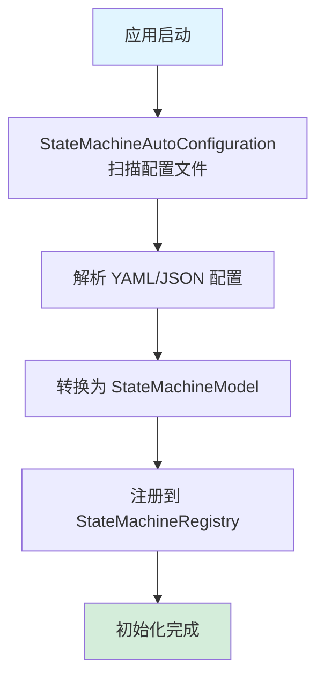
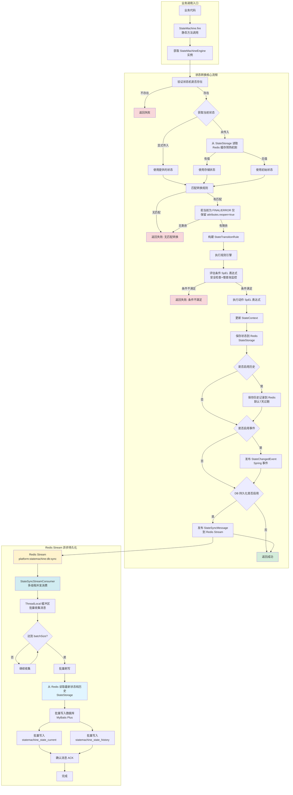
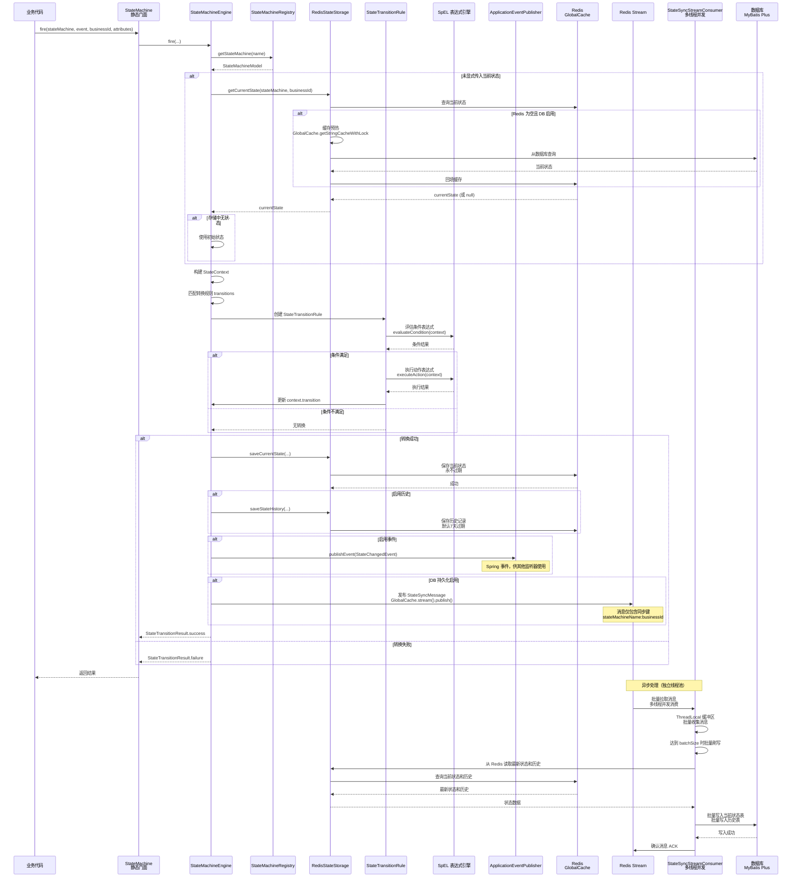
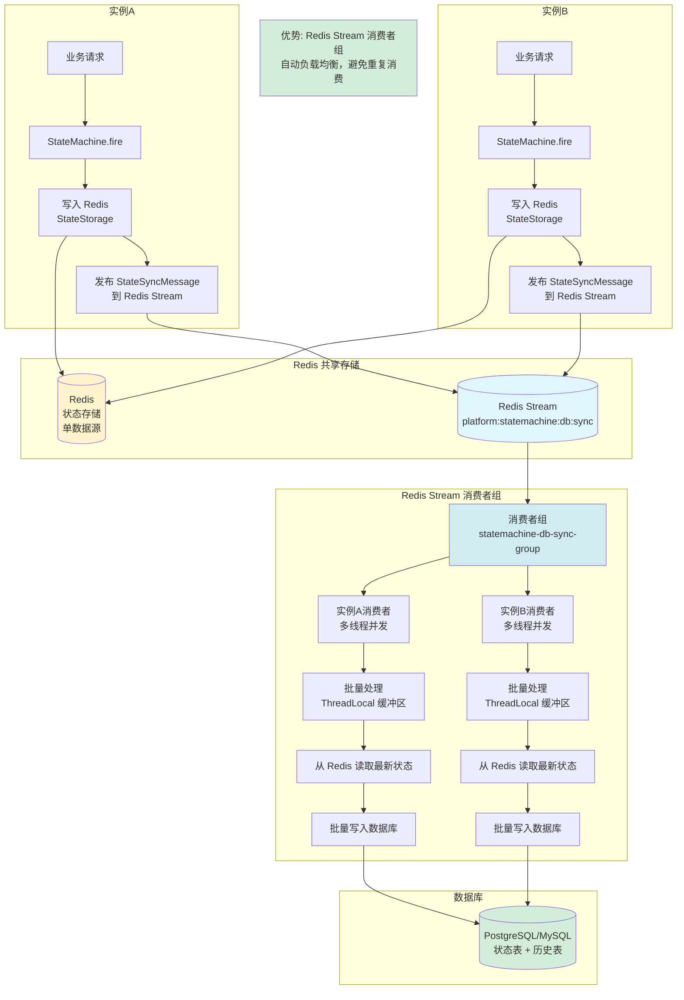
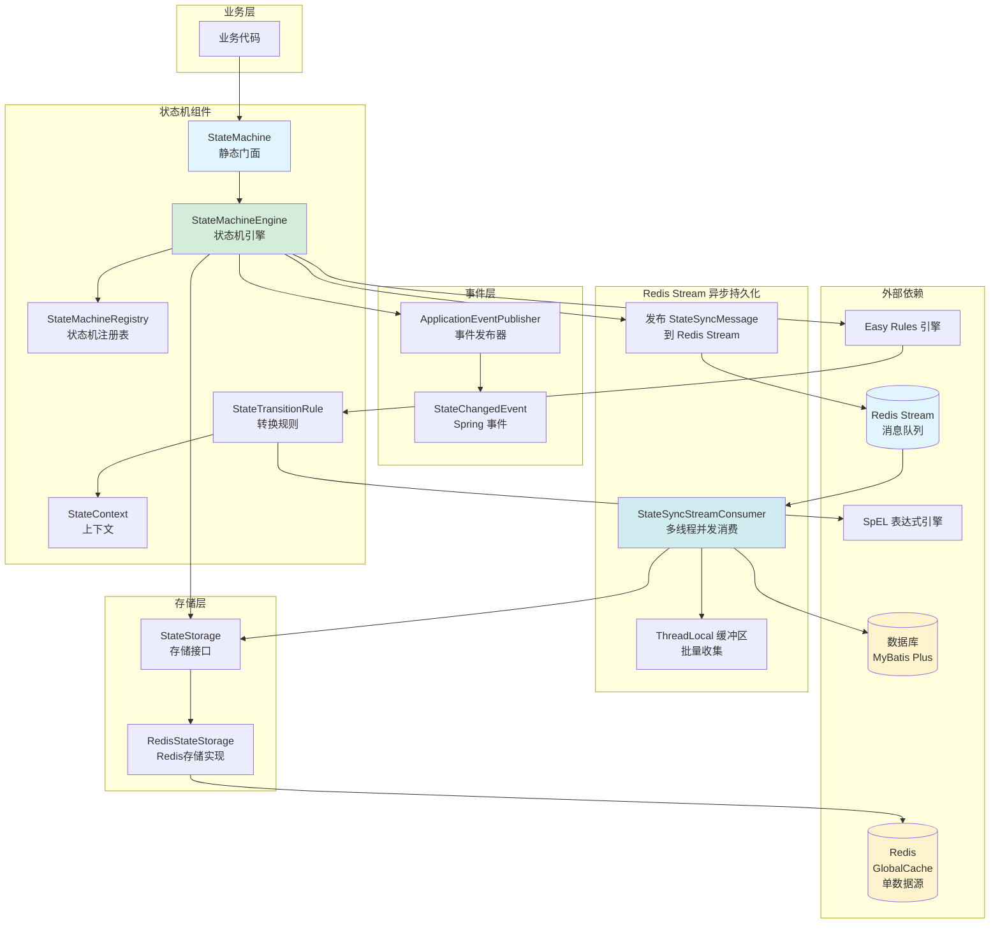

# 状态机组件流程图

## 1. 启动初始化流程图

## 2. 业务调用层流程图（静态外观 + Redis Stream 异步持久化）

## 3. 查询操作流程图（Redis 缓存预热）

```mermaid
graph TB
    subgraph 查询当前状态
        QueryState[业务代码查询] --> StaticCallState[StateMachine.getCurrentState]
        StaticCallState --> QueryEngine[StateMachineEngine.getCurrentState]
        QueryEngine --> QueryRedis[从 Redis 查询<br/>RedisStateStorage]
        QueryRedis --> CheckRedis{Redis 中有数据?}
        CheckRedis -->|有| ReturnState[返回状态]
        CheckRedis -->|无| CheckDBEnabled{DB 持久化启用?}
        CheckDBEnabled -->|否| ReturnNull[返回 null<br/>使用初始状态]
        CheckDBEnabled -->|是| CacheWarmup[缓存预热机制<br/>GlobalCache.getStringCacheWithLock]
        CacheWarmup --> Lock[获取分布式锁]
        Lock --> QueryDB[从数据库查询<br/>StateMachineStateCurrentMapper]
        QueryDB --> HasData{数据库有数据?}
        HasData -->|有| WriteRedis[写入 Redis<br/>回填缓存]
        HasData -->|无| ReturnNull
        WriteRedis --> ReturnState
        ReturnNull --> ReturnState
    end
    
    subgraph 查询状态历史
        QueryHistory[业务代码查询历史] --> StaticCallHistory[StateMachine.getStateHistory]
        StaticCallHistory --> QueryHistEngine[StateMachineEngine.getStateHistory]
        QueryHistEngine --> QueryHistRedis[从 Redis 查询历史<br/>RedisStateStorage]
        QueryHistRedis --> ReturnHistory[返回历史列表<br/>默认保留7天]
    end
    
    style ReturnState fill:#d4edda
    style ReturnHistory fill:#d4edda
    style QueryRedis fill:#fff3cd
    style CacheWarmup fill:#e1f5ff
    style QueryDB fill:#d1ecf1
```

## 状态转换详细流程（Redis Stream 异步持久化）

## 多实例部署场景下的数据流（Redis Stream 分布式消费）

## 组件架构图（Redis Stream 异步持久化）

## 关键设计点说明

1. **Redis 作为单数据源（Single Source of Truth）**：
   - 当前状态和历史记录均先写入 Redis
   - 数据库作为异步持久化副本，通过 Redis Stream 异步写入
   - 缓存预热机制：启动时如果 Redis 为空，自动从数据库加载并回填 Redis

2. **Redis Stream 异步持久化**：
   - 状态变更后直接发布 `StateSyncMessage` 到 Redis Stream（不通过 Spring 事件）
   - 消息仅包含同步键（stateMachineName:businessId），不包含状态数据
   - 消费者从 Redis 读取最新状态和历史，确保数据一致性

3. **多线程并发消费**：
   - `StateSyncStreamConsumer` 支持多线程并发处理（可配置 concurrency）
   - 使用 ThreadLocal 缓冲区批量收集消息
   - 达到 batchSize 时批量刷写到数据库，提升性能

4. **批量写入优化**：
   - 批量查询已存在记录，减少数据库查询次数
   - 批量插入和更新，减少数据库压力
   - 通过唯一约束去重，避免重复写入

5. **历史记录过期**：
   - 默认保留7天（可配置）
   - 自动过期，避免 Redis 数据量过大

## 架构优势

✅ **多实例部署支持**：
- Redis Stream 消费者组自动负载均衡
- 避免重复消费，确保数据一致性
- 支持水平扩展，提升处理能力

✅ **高性能**：
- Redis 作为单数据源，查询延迟低（毫秒级）
- 批量处理减少数据库压力
- 多线程并发消费提升吞吐量

✅ **可靠性**：
- Redis Stream 消息持久化 + ACK 机制
- 缓存预热机制确保数据一致性
- 错误处理策略可配置（SKIP/RETRY）

