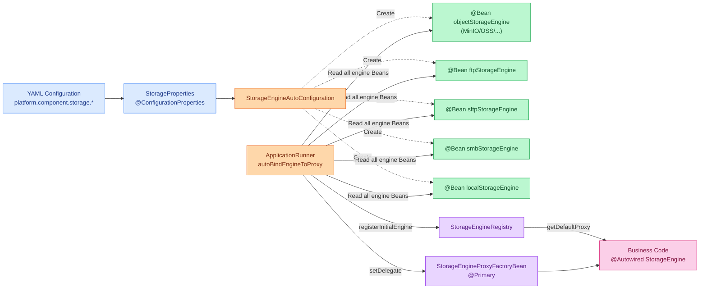
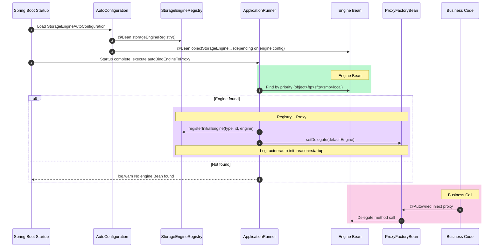
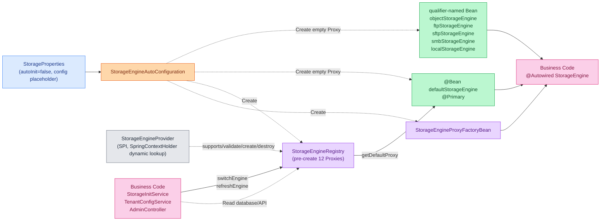
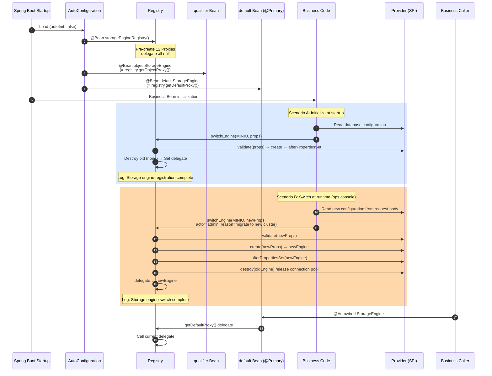

# Atlas Richie Storage Component (atlas-richie-component-storage)

- [Overview](#overview)
- [Thread Safety and Client Lifecycle](#thread-safety-and-client-lifecycle)
  - [Design Principles](#design-principles)
  - [Thread Safety Endorsement for Each Engine Client](#thread-safety-endorsement-for-each-engine-client)
  - [Usage Recommendations](#usage-recommendations)
  - [Negative Examples (Do Not Use)](#negative-examples-do-not-use)
- [Core Features](#core-features)
- [Quick Start](#quick-start)
  - [1. Add Dependency](#1-add-dependency)
  - [2. Select Storage Implementation](#2-select-storage-implementation)
  - [3. Configure Storage](#3-configure-storage)
  - [4. Usage Example](#4-usage-example)
- [Core Interfaces](#core-interfaces)
  - [StorageEngine](#storageengine)
- [Configuration Description](#configuration-description)
  - [Local Storage Configuration](#local-storage-configuration)
  - [Object Storage Configuration](#object-storage-configuration)
  - [FTP/SFTP/SMB Configuration](#ftp/sftp/smb-configuration)
- [Dual-Mode Architecture](#dual-mode-architecture)
  - [Use Case Comparison](#use-case-comparison)
  - [Automatic Mode (Default)](#automatic-mode-default)
  - [Manual Mode](#manual-mode)
  - [Supported Engine Type Enums](#supported-engine-type-enums)
  - [Internal Architecture](#internal-architecture)
- [Observability: HealthIndicator + Micrometer Metrics](#observability-healthindicator-+-micrometer-metrics)
  - [HealthIndicator (Health Check)](#healthindicator-health-check)
  - [Micrometer Metrics Binder](#micrometer-metrics-binder)
  - [Disable Example (No Monitoring)](#disable-example-no-monitoring)
- [Storage Engine Comparison](#storage-engine-comparison)
- [Best Practices](#best-practices)
- [Business-side Controller Reference Implementation](#business-side-controller-reference-implementation)
- [FAQ](#faq)
  - [Q: How to switch the storage backend?](#q-how-to-switch-the-storage-backend?)
  - [Q: What image formats are supported?](#q-what-image-formats-are-supported?)
  - [Q: How to implement file deduplication?](#q-how-to-implement-file-deduplication?)
- [Related Documentation](#related-documentation)
---

## 📖 Contents

- [Overview](#overview)
- [Thread Safety and Client Lifecycle](#thread-safety-and-client-lifecycle)
  - [Design Principles](#design-principles)
  - [Thread Safety Endorsement for Each Engine Client](#thread-safety-endorsement-for-each-engine-client)
  - [Usage Recommendations](#usage-recommendations)
  - [Negative Examples (Do Not Use)](#negative-examples-do-not-use)
- [Core Features](#core-features)
- [Quick Start](#quick-start)
  - [1. Add Dependency](#1-add-dependency)
  - [2. Select Storage Implementation](#2-select-storage-implementation)
  - [3. Configure Storage](#3-configure-storage)
  - [4. Usage Example](#4-usage-example)
- [Core Interfaces](#core-interfaces)
  - [StorageEngine](#storageengine)
- [Configuration Description](#configuration-description)
  - [Local Storage Configuration](#local-storage-configuration)
  - [Object Storage Configuration](#object-storage-configuration)
  - [FTP/SFTP/SMB Configuration](#ftp/sftp/smb-configuration)
- [Dual-Mode Architecture](#dual-mode-architecture)
  - [Use Case Comparison](#use-case-comparison)
  - [Automatic Mode (Default)](#automatic-mode-default)
  - [Manual Mode](#manual-mode)
  - [Supported Engine Type Enums](#supported-engine-type-enums)
  - [Internal Architecture](#internal-architecture)
- [Observability: HealthIndicator + Micrometer Metrics](#observability-healthindicator-+-micrometer-metrics)
  - [HealthIndicator (Health Check)](#healthindicator-health-check)
  - [Micrometer Metrics Binder](#micrometer-metrics-binder)
  - [Disable Example (No Monitoring)](#disable-example-no-monitoring)
- [Storage Engine Comparison](#storage-engine-comparison)
- [Best Practices](#best-practices)
- [Business-side Controller Reference Implementation](#business-side-controller-reference-implementation)
- [FAQ](#faq)
  - [Q: How to switch the storage backend?](#q-how-to-switch-the-storage-backend?)
  - [Q: What image formats are supported?](#q-what-image-formats-are-supported?)
  - [Q: How to implement file deduplication?](#q-how-to-implement-file-deduplication?)
- [Related Documentation](#related-documentation)

---

## Overview

`richie-component-storage` is the unified object storage abstraction component of the Richie platform. It provides a unified storage interface and supports multiple storage backends (local, cloud storage, FTP/SFTP/SMB, etc.).

## Thread Safety and Client Lifecycle

> **This component is thread-safe, and `StorageEngine` should be used as a singleton.**

### `Design` `Principles`

- `StorageEngine` implementation classes are registered as Spring `@Service` beans, which are **singletons** by default, and all threads share the same instance.
- Each storage SDK client is registered within the component as a **Spring singleton bean**, and its lifecycle is managed uniformly by the container.
- `StorageEngine` itself is **stateless**. All configuration required for operations is injected through the constructor, and method calls do not modify any shared mutable state. It naturally supports multi-threaded concurrency.

### `Thread` `Safety` `Endorsement` for `Each` `Engine` `Client`

#### `Object` `Storage`

| Storage Engine | Client Type           | Officially Declared Thread-Safe | Recommended Pattern                       |
|----------------|-----------------------|:-------------------------------:|-------------------------------------------|
| Aliyun OSS     | `OSSClient`           |               Yes               | Singleton, reuse connection pool          |
| Tencent COS    | `COSClient`           |               Yes               | Singleton, internal connection pool       |
| Huawei OBS     | `ObsClient`           |               Yes               | Singleton, usable in concurrent scenarios |
| Kingsoft KS3   | `Ks3Client`           |               Yes               | Singleton, supports concurrent use        |
| AWS S3         | `S3Client`            |               Yes               | Singleton, internal connection pool       |
| MinIO          | `MinioAsyncClient`    |               Yes               | Singleton, Okhttp is thread-safe          |
| Volcano TOS    | `TOSV2`               |               Yes               | Singleton, Transport is thread-safe       |
| Azure Blob     | `BlobContainerClient` |               Yes               | Singleton, guaranteed by Microsoft        |

#### `File` `Transfer` / `Network` `Storage`

| Storage Engine | Client/Resource Type            | Thread-Safe Mechanism | Recommended Pattern                                                           |
|----------------|---------------------------------|:---------------------:|-------------------------------------------------------------------------------|
| FTP            | `FtpClientPool`                 |          Yes          | Singleton connection pool (Apache Commons Pool), borrow/return is thread-safe |
| SFTP           | `SshClient` + `SftpSessionPool` |          Yes          | `SshClient` singleton + session pool, Apache MINA SSHD is thread-safe         |
| SMB            | `CIFSContext`                   |          Yes          | Singleton context, jcifs-ng `BaseContext` is thread-safe                      |
| Local          | No client (direct file I/O)     |          Yes          | `LocalStorageEngine` is stateless, directly operates the local file system    |

### `Usage` `Recommendations`

1. **Do not manually create `StorageEngine` instances in automatic mode**. Obtain it directly through Spring dependency injection (for manual mode, please refer to the "Dual-Mode Architecture" section):
   ```java
   @Service
   @RequiredArgsConstructor
   public class FileService {
       private final StorageEngine storageEngine; // Singleton injection, thread-safe
   }
   ```
2. **Do not close/destroy clients after each operation**. Each SDK client maintains an internal HTTP connection pool. Frequent creation and destruction will lead to connection pool resource leaks (e.g., `ClientBuilderConfiguration` residue), which may cause memory inflation and file descriptor exhaustion after long-term operation.
3. **Do not create underlying SDK clients yourself in business code** (e.g., `new OSSClientBuilder().build(...)`). They should be managed uniformly by the component to avoid conflicts with the component's internal singleton clients.

### `Negative` `Examples` (`Do` `Not` `Use`)

```java
// Wrong: Create a new StorageEngine or SDK client for every request
public void upload(File file) {
    OSSClient client = new OSSClientBuilder().build(endpoint, credentials);
    // ... use client
    client.shutdown(); // Frequent creation/destruction leads to resource leaks
}

// Correct: Inject the singleton StorageEngine through Spring
@Autowired
private StorageEngine storageEngine;

public void upload(File file) {
    storageEngine.putObject(key, file); // Thread-safe, connection pool reuse
}
```

## Core Features

- **Unified Storage Interface** - Provides the `StorageEngine` interface that shields underlying storage differences
- **Multiple Storage Backend Support** - Supports local storage, cloud storage (S3/OSS/COS/OBS, etc.), and FTP/SFTP/SMB
- **File Upload/Download** - Supports uploading and downloading files, streams, and JSON data
- **Image Processing** - Supports format conversion and compression when uploading images
- **Resumable Transfer** - Supports resumable download of large files
- **Dual-Mode Architecture** - Automatic mode works out of the box; manual mode supports hot switching at runtime
- **Multi-Engine Coexistence** - Object storage + FTP/SFTP/SMB/Local can run simultaneously, with precise selection via `@Qualifier`
- **JDK Dynamic Proxy** - Independent Proxy for each engine type, transparent to business code injection

## Quick Start

### 1) `Add` `Dependency`

```xml
<dependency>
    <groupId>com.richie.component</groupId>
    <artifactId>atlas-richie-component-storage-core</artifactId>
    <version>${atlas.richie.version}</version>
</dependency>
```

### 2) `Select` `Storage` `Implementation`

Choose the corresponding storage implementation module based on your needs:

- **Local Storage**: `richie-component-storage-local`
- **AWS S3**: `richie-component-storage-s3`
- **Aliyun OSS**: `richie-component-storage-oss`
- **Tencent COS**: `richie-component-storage-cos`
- **Huawei OBS**: `richie-component-storage-obs`
- **MinIO**: `richie-component-storage-minio`
- **Kingsoft KS3**: `richie-component-storage-ks3`
- **Volcano TOS**: `richie-component-storage-tos`
- **Azure Blob**: `richie-component-storage-azure`
- **SFTP**: `richie-component-storage-sftp`
- **SMB**: `richie-component-storage-smb`

### 3) `Configure` `Storage`

```yaml
platform:
  component:
    storage:
      # Local storage configuration
      local:
        path: ./storage/
      # Object storage configuration
      object:
        engine: minio  # or aws_s3, aliyun_oss, tencent_cos, huawei_obs, ksyun_ks3, volcengine_tos, azure_blob
        endpoint: http://localhost:9000
        region: us-east-1
        accessKeyId: your-access-key
        accessKeySecret: your-secret-key
        bucketName: my-bucket
        basePath: /files/
```

### 4) `Usage` `Example`

```java
@Service
@RequiredArgsConstructor
public class FileService {
    
    private final StorageEngine storageEngine;
    
    // Upload file
    public void uploadFile(String key, File file) {
        UploadResponse response = storageEngine.putObject(key, file);
        if (response.isSuccess()) {
            log.info("Upload successful: {}", response.getUrl());
        }
    }
    
    // Download file
    public void downloadFile(String key, File targetPath) {
        DownloadResponse<byte[]> response = storageEngine.getObject(key, targetPath, false);
        if (response.isSuccess()) {
            log.info("Download successful: {}", targetPath);
        }
    }
    
    // Upload JSON data
    public void uploadData(String key, Map<String, Object> data) {
        UploadResponse response = storageEngine.putData(key, data);
        if (response.isSuccess()) {
            log.info("Data upload successful: {}", key);
        }
    }
    
    // Download JSON data
    public <T> T downloadData(String key, TypeReference<T> typeRef) {
        DownloadResponse<T> response = storageEngine.getData(key, typeRef);
        if (response.isSuccess()) {
            return response.getData();
        }
        return null;
    }
}
```

## Core Interfaces

### `StorageEngine`

```java
public interface StorageEngine {
    // Upload file
    UploadResponse putObject(String key, File file);
    UploadResponse putObject(String key, InputStream inputStream);
    
    // Upload data (JSON)
    UploadResponse putData(String key, Object object);
    UploadResponse putData(String key, Map<?, ?> collection);
    UploadResponse putData(String key, Collection<?> collection);
    
    // Upload image (supports processing)
    UploadResponse putImage(String key, File file, ImageOptions options);
    UploadResponse putImage(String key, InputStream inputStream, ImageOptions options);
    
    // Download file
    DownloadResponse<byte[]> getObject(String key, File targetPath, boolean returnData);
    DownloadResponse<byte[]> getResumableObject(String key, String targetPath, boolean returnData);
    
    // Download data (JSON)
    <T> DownloadResponse<T> getData(String key, TypeReference<T> typeReference);
    
    // Check if file exists
    boolean existsObject(String key);
}
```

## Configuration Description

### `Local` `Storage` `Configuration`

```yaml
platform:
  component:
    storage:
      local:
        path: ./storage/  # Storage path
        cache:
          contentMaxSize: 1048576  # Maximum content size (bytes)
```

### `Object` `Storage` `Configuration`

```yaml
platform:
  component:
    storage:
      object:
        engine: minio  # Storage engine
        storageType: STANDARD  # Storage type (STANDARD, IA, ARCHIVE, etc.)
        endpoint: http://localhost:9000  # Access endpoint
        region: us-east-1  # Region
        accessKeyId: your-access-key  # Access key ID
        accessKeySecret: your-secret-key  # Access key
        bucketName: my-bucket  # Bucket name
        basePath: /files/  # Base path
```

### `FTP`/`SFTP`/`SMB` `Configuration`

```yaml
platform:
  component:
    storage:
      ftp:
        enable: true
        host: ftp.example.com
        port: 21
        username: user
        password: pass
        basePath: /storage/
      sftp:
        enable: true
        host: sftp.example.com
        port: 22
        username: user
        password: pass
        identityFile: /path/to/key
        basePath: /storage/
      smb3:
        enable: true
        domain: example.com
        username: user
        password: pass
        basePath: /storage/
```

## Dual-Mode Architecture

This component supports two initialization modes, controlled by the `auto-init` property:

| Mode                         | Configuration Value                   | Applicable Scenario                                                                          | Engine Creation Method                                 |
|------------------------------|---------------------------------------|----------------------------------------------------------------------------------------------|--------------------------------------------------------|
| **Automatic Mode** (default) | `auto-init: true` (or not configured) | Configuration is fixed in YAML/config file, no need to switch after startup                  | YAML + Spring Boot auto-registration to `Registry`     |
| **Manual Mode**              | `auto-init: false`                    | Configuration comes from database/Nacos/admin console, **requires hot switching at runtime** | Business code manually calls `Registry.switchEngine()` |

### `Use` `Case` `Comparison`

| Scenario                                                                                 | Recommended Mode   | Reason                                                                   |
|------------------------------------------------------------------------------------------|--------------------|--------------------------------------------------------------------------|
| Small/medium projects with fixed storage backend (e.g., MinIO only)                      | **Automatic Mode** | Configure YAML once and use it, zero business code                       |
| Multi-environment differences (different backends for dev/prod)                          | **Automatic Mode** | profile + YAML switching, no code changes needed                         |
| Configuration stored in database, tenant isolation (each tenant has independent storage) | **Manual Mode**    | Dynamically create engines after startup based on tenant configuration   |
| Ops console switches storage backend (migration without downtime)                        | **Manual Mode**    | `switchEngine` hot switching, connection pool auto-rebuilt               |
| Multi-engine coexistence (object storage + FTP + SFTP used simultaneously)               | **Manual Mode**    | Manually register multiple engines to Registry                           |
| Grayscale switching (e.g., S3 → MinIO smooth migration)                                  | **Manual Mode**    | Register the new engine first, then atomically switch via `switchEngine` |

> **The two modes are mutually exclusive and cannot be used simultaneously in the same system.** In automatic mode, calling `switchEngine()` is prohibited; in manual mode, configuring engine-related YAML is prohibited.

### `Automatic` `Mode` (`Default`)

That is, the usage in the "Quick Start" section above. Engine registration is completed through YAML configuration + Spring Boot auto-configuration, no additional code required.

**Architecture Diagram**:



**Startup Flow Diagram**:



### `Manual` `Mode`

Business code fully controls the engine lifecycle. `auto-init=false` disables automatic registration, and `StorageEngineRegistry` pre-creates empty Proxy placeholders. Business code creates/switches engines by calling `switchEngine` at the appropriate time (e.g., startup `@PostConstruct`, tenant login, admin operation).

**Architecture Diagram**:



**Runtime Flow Diagram (Startup + Switching)**:



#### 1. `Configure` to `Disable` `Auto` `Initialization`

```yaml
platform:
  component:
    storage:
      auto-init: false  # Disable automatic mode
      # Note: Do not configure engine-related properties like object / local / ftp in manual mode
```

#### 2. `Manually` `Initialize` the `Engine`

After the application starts, create and register engine instances by calling `StorageEngineRegistry.switchEngine()`. Configuration parameters reuse `StorageProperties`, which business code can construct itself:

```java
@Service
@RequiredArgsConstructor
public class StorageInitService {

    private final StorageEngineRegistry registry;

    /**
     * Called after application startup (e.g., initialize after reading configuration from database)
     */
    public void initStorageEngine(StorageConfigFromDb dbConfig) {
        // 1. Construct StorageProperties
        StorageProperties properties = new StorageProperties();
        ObjectConfig objectConfig = properties.getObject();
        objectConfig.setEngine(StorageEngineEnum.MINIO);
        objectConfig.setEndpoint(dbConfig.getEndpoint());
        objectConfig.setRegion(dbConfig.getRegion());
        objectConfig.setAccessKeyId(dbConfig.getAccessKeyId());
        objectConfig.setAccessKeySecret(dbConfig.getAccessKeySecret());
        objectConfig.setBucketName(dbConfig.getBucketName());
        objectConfig.setBasePath(dbConfig.getBasePath());

        // 2. Create engine through Registry and register to Proxy
        registry.switchEngine(StorageEngineEnum.MINIO, properties);
    }
}
```

#### 3. `Hot` `Switching` at `Runtime`

When the admin console modifies storage configuration, call `switchEngine()` to switch the specified type of engine. The Registry automatically destroys the old engine (releasing connection pool and other resources), creates the new engine, and updates the corresponding Proxy reference, **without affecting other types of engines**:

```java
@PostMapping("/api/admin/storage/switch")
public void switchStorage(@RequestBody StorageConfigRequest request) {
    StorageProperties properties = new StorageProperties();
    ObjectConfig config = properties.getObject();
    config.setEndpoint(request.getEndpoint());
    config.setRegion(request.getRegion());
    config.setAccessKeyId(request.getAccessKeyId());
    config.setAccessKeySecret(request.getAccessKeySecret());
    config.setBucketName(request.getBucketName());

    StorageEngineEnum engineType = StorageEngineEnum.fromConfigValue(request.getEngineType());
    registry.switchEngine(engineType, properties);
}
```

#### 3.1 `File` `Protocol` `Engine` `Switching` (`FTP` / `SFTP` / `SMB`)

`switchEngine()` also applies to file protocol engines such as FTP/SFTP/SMB. The following example shows the admin console dynamically switching the FTP host (the connection pool will be automatically destroyed and rebuilt during switching, transparent to business calling threads):

```java
@Service
@RequiredArgsConstructor
public class FtpServerAdminService {

    private final StorageEngineRegistry registry;

    public void switchFtpServer(String newHost, int newPort, String username, String password) {
        StorageProperties props = StorageProperties.builder().build();
        props.getFtp().setHost(newHost);
        props.getFtp().setPort(newPort);
        props.getFtp().setUsername(username);
        props.getFtp().setPassword(password);

        // actor identifies the ops operator; reason is written to the audit log
        registry.switchEngine(
                StorageEngineEnum.FTP, props,
                SecurityContextHolder.getContext().getAuthentication().getName(),
                "Ops console switches FTP server");
    }
}
```

Similarly, the SFTP switching example (note that SFTP closes the Apache MINA SSHD client and cleans up the session pool during switching):

```java
public void switchSftp(String host, int port, String user, String password) {
    StorageProperties props = StorageProperties.builder().build();
    props.getSftp().setHost(host);
    props.getSftp().setPort(port);
    props.getSftp().setUsername(user);
    props.getSftp().setPassword(password);
    registry.switchEngine(StorageEngineEnum.SFTP, props,
            currentOperator(), "Switch SFTP bastion");
}
```

SMB switching (when authentication fails, `validate()` will directly throw an exception, the old engine remains unchanged, and will not pollute the running state):

```java
public void switchSmb(String host, String domain, String user, String password) {
    StorageProperties props = StorageProperties.builder().build();
    props.getSmb3().setHost(host);
    props.getSmb3().setDomain(domain);
    props.getSmb3().setUsername(user);
    props.getSmb3().setPassword(password);
    try {
        registry.switchEngine(StorageEngineEnum.SMB, props, currentOperator(), "Switch SMB domain controller");
    } catch (IllegalArgumentException e) {
        // Configuration validation failed, old SMB engine continues to work
        log.warn("SMB configuration validation failed, keep old engine: {}", e.getMessage());
    }
}
```

#### 3.2 `Safe` `Refresh` — `Failure` `Rollback` (refreshEngine)

`switchEngine()` throws an exception when the new engine fails to initialize but **does not affect the old engine**. If you want to keep the reference to the old engine from being replaced by any transient exception, you can use `refreshEngine()`, which has the same semantics but the API name more clearly expresses the "in-place refresh" intent:

```java
public void refreshLocal(String newPath) {
    StorageProperties props = StorageProperties.builder()
            .local(new LocalConfig(newPath))
            .build();
    StorageEngine newEngine = registry.refreshEngine(StorageEngineEnum.LOCAL, props,
            currentOperator(), "Refresh local storage path");
    // newEngine is always available; if the old engine fails, it remains as-is
}
```

Rollback semantics of `refreshEngine()`:
- Engine not initialized → throw `IllegalStateException` (different from `switchEngine` which allows first-time creation)
- `validate()` fails → throw exception, old delegate unchanged
- `create()` + `afterPropertiesSet()` fails → automatically `destroy()` the new engine then throw exception, old delegate unchanged
- Old engine `destroy()` fails → only log warn, new engine still takes effect

#### 4. `Multi`-`Engine` `Coexistence`

Multiple engine types can be registered in the system at the same time. Typical scenario: object storage (business data) + FTP/SMB (inter-system data exchange). The Registry maintains independent Proxies for each engine type, which do not affect each other:

```java
@Service
@RequiredArgsConstructor
public class StorageInitService {

    private final StorageEngineRegistry registry;

    /**
     * Initialize multi-engine coexistence
     */
    public void initEngines(StorageConfigFromDb dbConfig) {
        // Register object storage (business data upload/download)
        StorageProperties objectProps = buildObjectProperties(dbConfig);
        registry.switchEngine(StorageEngineEnum.MINIO, objectProps);

        // Register FTP (data exchange with external systems)
        StorageProperties ftpProps = buildFtpProperties(dbConfig);
        registry.switchEngine(StorageEngineEnum.FTP, ftpProps);

        // Register local storage (temporary file cache)
        StorageProperties localProps = buildLocalProperties(dbConfig);
        registry.switchEngine(StorageEngineEnum.LOCAL, localProps);
    }
}
```

#### 5. Business Code Selects Engine Precisely via `@Qualifier`

Whether in automatic or manual mode, business code can inject a specific type of engine via `@Qualifier`:

```java
@Service
@RequiredArgsConstructor
public class DataSyncService {

    // Object storage - business data upload/download
    @Autowired @Qualifier("objectStorageEngine")
    private StorageEngine objectEngine;

    // FTP - data exchange with external systems
    @Autowired @Qualifier("ftpStorageEngine")
    private StorageEngine ftpEngine;

    // Local storage - temporary file cache
    @Autowired @Qualifier("localStorageEngine")
    private StorageEngine localEngine;

    // Default engine (@Primary, points to the registered engine with the highest priority)
    @Autowired
    private StorageEngine defaultEngine;

    public void uploadAvatar(String key, File file) {
        objectEngine.putObject(key, file); // Goes to object storage
    }

    public void syncToRemote(String key, File file) {
        ftpEngine.putObject(key, file); // Goes to FTP
    }
}
```

> **Qualifier Mapping Table**:
> | Qualifier | Description | Automatic Mode Source | Manual Mode Source |
> |---|---|---|---|
> | `@Qualifier("objectStorageEngine")` | Object storage | `@Service` Bean | Registry `objectProxy` |
> | `@Qualifier("ftpStorageEngine")` | FTP | `@Service` Bean | Registry `ProxyHolder(FTP)` |
> | `@Qualifier("sftpStorageEngine")` | SFTP | `@Service` Bean | Registry `ProxyHolder(SFTP)` |
> | `@Qualifier("smbStorageEngine")` | SMB | `@Service` Bean | Registry `ProxyHolder(SMB)` |
> | `@Qualifier("localStorageEngine")` | Local storage | `@Service` Bean | Registry `ProxyHolder(LOCAL)` |
> | No `@Qualifier` (`@Primary`) | Default engine | ProxyFactoryBean proxy | Registry `defaultProxy` |

> **Important Constraint**: Business code must inject the proxy object via `@Autowired StorageEngine`. **Prohibited** from directly holding or caching the instance reference returned by `StorageEngineRegistry.getEngine()`, otherwise after hot switching it will point to the destroyed old engine.

### `Supported` `Engine` `Type` `Enums`

| Enum Value | `configValue` | Description |
|--------|--------------|------|
| `MINIO` | `minio` | MinIO |
| `AWS_S3` | `aws_s3` | AWS S3 |
| `ALIYUN_OSS` | `aliyun_oss` | Aliyun OSS |
| `TENCENT_COS` | `tencent_cos` | Tencent COS |
| `HUAWEI_OBS` | `huawei_obs` | Huawei OBS |
| `KSYUN_KS3` | `ksyun_ks3` | Kingsoft KS3 |
| `VOLCENGINE_TOS` | `volcengine_tos` | Volcano TOS |
| `AZURE_BLOB` | `azure_blob` | Azure Blob |
| `FTP` | `ftp` | FTP |
| `SFTP` | `sftp` | SFTP |
| `SMB` | `smb` | SMB |
| `LOCAL` | `local` | Local Storage |

> `StorageEngineEnum.fromConfigValue("aws_s3")` can convert a string configuration value to an enum.

### `Internal` `Architecture`

```
Business Code
  │
  ├── @Autowired StorageEngine (Proxy @Primary) ──────▶ defaultProxy.delegate
  │                                                       │
  ├── @Qualifier("objectStorageEngine") StorageEngine ──▶ @Service Bean (automatic) / objectProxy.delegate (manual)
  ├── @Qualifier("ftpStorageEngine") StorageEngine ─────▶ @Service Bean (automatic) / ProxyHolder(FTP).delegate (manual)
  ├── @Qualifier("sftpStorageEngine") StorageEngine ────▶ @Service Bean (automatic) / ProxyHolder(SFTP).delegate (manual)
  ├── @Qualifier("smbStorageEngine") StorageEngine ─────▶ @Service Bean (automatic) / ProxyHolder(SMB).delegate (manual)
  └── @Qualifier("localStorageEngine") StorageEngine ───▶ @Service Bean (automatic) / ProxyHolder(LOCAL).delegate (manual)

                        ┌──────────────────────────────────────┐
                        │         StorageEngineRegistry         │
                        │                                      │
                        │  Map<StorageEngineEnum, ProxyHolder> │
                        │    ├─ MINIO   → ProxyHolder(delegate)│
                        │    ├─ FTP     → ProxyHolder(delegate)│
                        │    ├─ SFTP    → ProxyHolder(delegate)│
                        │    ├─ SMB     → ProxyHolder(delegate)│
                        │    ├─ LOCAL   → ProxyHolder(delegate)│
                        │    └─ ...                            │
                        │  objectProxy → ProxyHolder(delegate) │
                        │  defaultEngineType / defaultEngineId │
                        └──────────────┬───────────────────────┘
                                      │ getBeansOfType()
                                      ▼
                        ┌──────────────────────────────────────┐
                        │   StorageEngineProvider (SPI)        │
                        │   create() / afterPropertiesSet()    │
                        │   destroy() / validate()             │
                        └──────────────────────────────────────┘
```

## Observability: HealthIndicator + Micrometer Metrics

The storage engine provides two optional observability beans under the Spring Boot Actuator framework. When not connected to Prometheus/Grafana/APM, they can be turned off to avoid noise logs such as "CollectorRegistry cannot find collector".

### `HealthIndicator` (`Health` `Check`)

Controlled through Spring Boot's standard `management.health.*` namespace:

```yaml
management:
  health:
    storage:
      enabled: false   # Disable storage engine health check
    defaults:
      enabled: false   # Disable all HealthIndicators (global)
```

- Bean name: `storageHealthIndicator` (→ `management.health.storage.enabled`)
- Default value: `true` (enabled when not configured)
- Endpoint: After registration, view via `/actuator/health`. The current engine count, default engine type, and engine ID will be exposed in details

### `Micrometer` `Metrics` `Binder`

Controlled through Spring Boot's standard `management.metrics.enable.*` namespace:

```yaml
management:
  metrics:
    enable:
      storage: NONE   # Disable storage metrics (default ALL)
```

- Property: `management.metrics.enable.storage`
- Value: `ALL` (default, enabled) / `NONE` (disabled)
- Registered metrics: default engine type (gauge), number of registered engines (gauge), switch count (counter × 12 engines), registration count (counter × 12 engines)

### `Disable` `Example` (`No` `Monitoring`)

```yaml
management:
  health:
    storage:
      enabled: false
  metrics:
    enable:
      storage: NONE
```

After fully disabling, `/actuator/health` no longer exposes the storage engine status, and the Prometheus exporter no longer attempts to collect storage-related metrics, with zero noise.

## Storage Engine Comparison

| Storage Engine | engine value | endpoint format | region required | Special Notes |
|---------|----------|--------------|-------------|---------|
| MinIO | `MINIO` | `http://host:port` | Optional | Supports custom domain |
| AWS S3 | `AWS_S3` | `s3.region.amazonaws.com` | Required | Supports multiple storage types |
| Aliyun OSS | `ALIYUN_OSS` | `oss-cn-region.aliyuncs.com` | Required | Supports image processing |
| Tencent COS | `TENCENT_COS` | `cos.region.myqcloud.com` | Required | Supports multi-AZ storage |
| Huawei OBS | `HUAWEI_OBS` | `obs.region.myhuaweicloud.com` | Required | Supports lifecycle management |
| Kingsoft KS3 | `KSYUN_KS3` | `ks3-cn-region.ksyuncs.com` | Required | S3-compatible protocol |
| Volcano TOS | `VOLCENGINE_TOS` | `tos-cn-region.volces.com` | Required | Supports image processing |
| Azure Blob | `AZURE_BLOB` | `account.blob.core.windows.net` | Required | Requires connection string |

> **Note**: The configuration differences between storage backends are significant. Please refer to the corresponding sub-component documentation for detailed configuration instructions.

## Best Practices

1. **Choose the Right Storage Backend**
   - Development/test environment: Use local storage or MinIO
   - Production environment: Choose the corresponding cloud storage based on the cloud service provider

2. **File Path Conventions**
   - Use relative paths, avoid absolute paths
   - Organize paths by date/business dimension, e.g., `/2024/01/15/user-123/avatar.jpg`

3. **Large File Handling**
   - Use `getResumableObject` to support resumable transfer
   - Set `returnData=false` to avoid out-of-memory errors

4. **Error Handling**
   - Check `UploadResponse.isSuccess()` and `DownloadResponse.isSuccess()`
   - Record error information for troubleshooting

5. **Component Boundary Constraints (Recommended)**
   - `richie-component-storage` only provides capability interfaces and engine implementations, and does not include built-in HTTP Controllers
   - Business services define their own upload/issuance interfaces to avoid all consumers automatically exposing the same route
   - The Controller only handles authentication, parameter validation, and business key generation; the actual capabilities are delegated to `StorageEngine`

## Business-side Controller Reference Implementation

> Note: The following examples are standard MVC usage on the "business service side" and should not be placed in the storage component itself.

```java
package com.example.storage.controller;

import bean.com.richie.component.storage.DirectUploadPolicy;
import core.com.richie.component.storage.StorageEngine;
import jakarta.validation.constraints.Max;
import jakarta.validation.constraints.Min;
import jakarta.validation.constraints.NotBlank;
import lombok.Data;
import lombok.RequiredArgsConstructor;
import org.springframework.validation.annotation.Validated;
import org.springframework.web.bind.annotation.*;

@RestController
@RequestMapping("/api/storage/upload")
@Validated
@RequiredArgsConstructor
public class StorageUploadController {

    private final StorageUploadService storageUploadService;

    @PostMapping("/policy")
    public ApiResponse<DirectUploadPolicy> issuePolicy(@RequestBody @Validated IssuePolicyRequest request) {
        return ApiResponse.ok(storageUploadService.issuePolicy(request));
    }

    @Data
    public static class IssuePolicyRequest {
        @NotBlank
        private String bizType; // e.g., agent-attachment
        @NotBlank
        private String fileName;
        @Min(60)
        @Max(3600)
        private int expireSeconds = 600;
    }

    @Data
    public static class ApiResponse<T> {
        private Integer code;
        private String message;
        private T data;
        public static <T> ApiResponse<T> ok(T data) {
            ApiResponse<T> r = new ApiResponse<>();
            r.code = 0;
            r.message = "OK";
            r.data = data;
            return r;
        }
    }
}
```

```java
package com.example.storage.controller;

import bean.com.richie.component.storage.DirectUploadPolicy;

public interface StorageUploadService {
    DirectUploadPolicy issuePolicy(StorageUploadController.IssuePolicyRequest request);
}
```

```java
package com.example.storage.controller;

import bean.com.richie.component.storage.DirectUploadPolicy;
import core.com.richie.component.storage.StorageEngine;
import lombok.RequiredArgsConstructor;
import org.springframework.stereotype.Service;

@Service
@RequiredArgsConstructor
public class StorageUploadServiceImpl implements StorageUploadService {

    private final StorageEngine storageEngine;

    @Override
    public DirectUploadPolicy issuePolicy(StorageUploadController.IssuePolicyRequest request) {
        // Business system defines its own key rules (tenant, date, business domain, etc.)
        String key = buildObjectKey(request.getBizType(), request.getFileName());
        // Pass through to call component capabilities
        return storageEngine.issueDirectUploadPolicy(key, request.getExpireSeconds());
    }

    private String buildObjectKey(String bizType, String fileName) {
        String safeBiz = (bizType == null || bizType.isBlank()) ? "default" : bizType.trim();
        String safeName = fileName.replaceAll("\\s+", "_");
        return safeBiz + "/" + java.time.LocalDate.now() + "/" + safeName;
    }
}
```

## FAQ

### `Q` — `How` to switch the storage backend?

A: Two ways:
- **Automatic Mode**: Modify the `engine` field in the configuration, and add the corresponding storage implementation module dependency, then restart the application.
- **Manual Mode**: Use `StorageEngineRegistry.switchEngine(engineType, properties)` to hot switch at runtime, no restart required. See the "Dual-Mode Architecture" section for details.

### `Q` — `What` image formats are supported?

A: Configured through `ImageOptions`, supports common image format conversion and compression.

### `Q` — `How` to implement file deduplication?

A: The local storage implementation already supports content deduplication based on SHA-256. Cloud storage needs to be implemented based on the specific implementation.

## Related Documentation

- [Local Storage Implementation](./atlas-richie-component-storage-local/README.md)
- [AWS S3 Implementation](./atlas-richie-component-storage-s3/README.md)
- [Aliyun OSS Implementation](./atlas-richie-component-storage-oss/README.md)
- [Tencent COS Implementation](./atlas-richie-component-storage-cos/README.md)
- [Huawei OBS Implementation](./atlas-richie-component-storage-obs/README.md)
- [MinIO Implementation](./atlas-richie-component-storage-minio/README.md)
- [Kingsoft KS3 Implementation](./atlas-richie-component-storage-ks3/README.md)
- [Volcano TOS Implementation](./atlas-richie-component-storage-tos/README.md)
- [Azure Blob Implementation](./atlas-richie-component-storage-azure/README.md)
- [SFTP Implementation](./atlas-richie-component-storage-sftp/README.md)
- [SMB Implementation](./atlas-richie-component-storage-smb/README.md)

