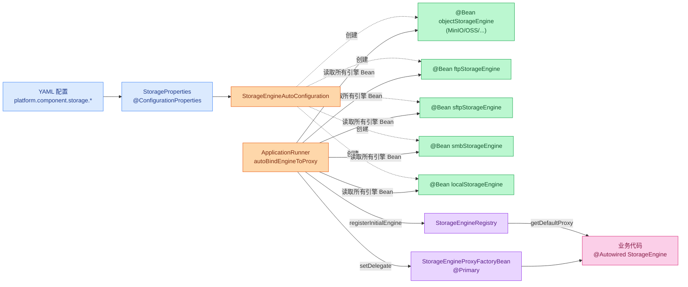
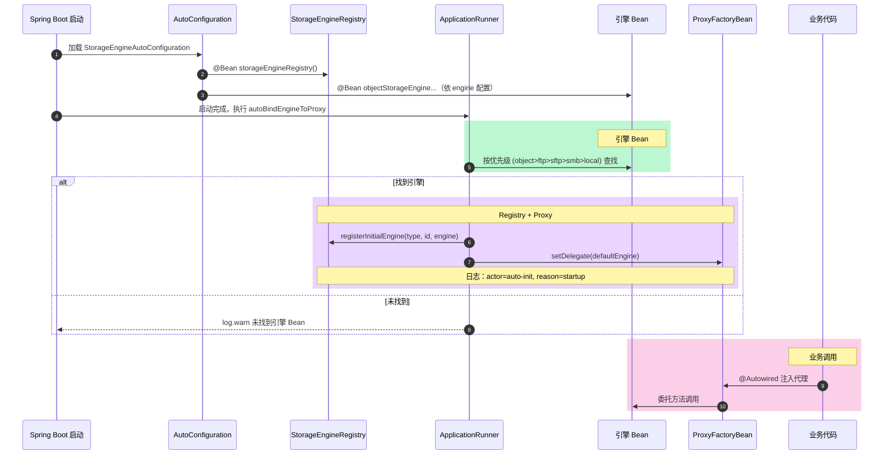
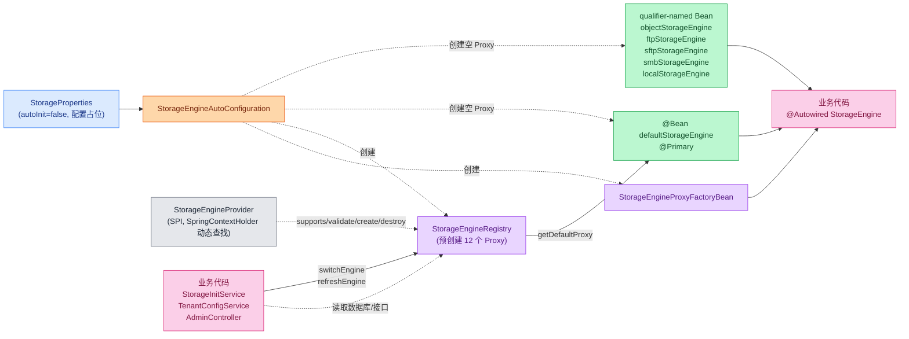
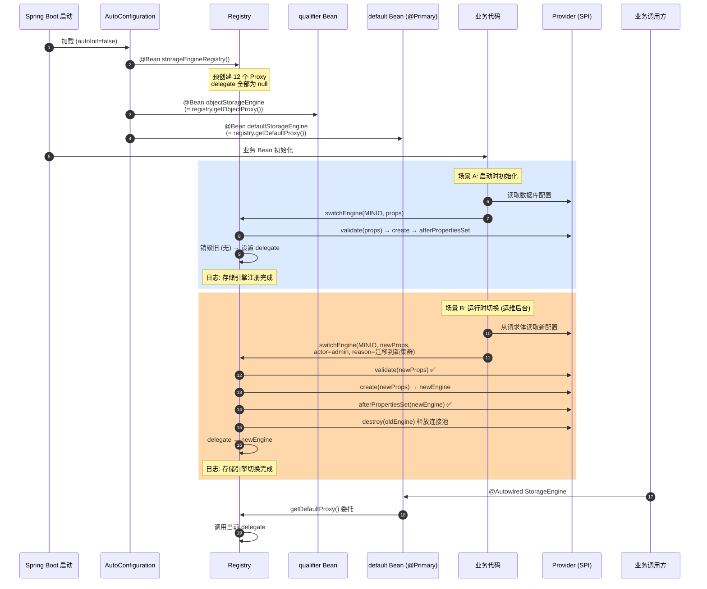

# Richie Component Storage

## 概述

`richie-component-storage` 是Richie平台统一的对象存储抽象组件，提供了统一的存储接口，支持多种存储后端（本地、云存储、FTP/SFTP/SMB等）。

## 线程安全与客户端生命周期

> **本组件是线程安全的，`StorageEngine` 应作为单例使用。**

### 设计原则

- `StorageEngine` 实现类注册为 Spring `@Service` Bean，默认即为**单例**，所有线程共享同一实例。
- 各存储 SDK 客户端在组件内部均以 **Spring 单例 Bean** 方式注册，由容器统一管理生命周期。
- `StorageEngine` 本身是**无状态**的，所有操作所需的配置通过构造函数注入，方法调用不修改任何共享可变状态，天然支持多线程并发。

### 各引擎客户端线程安全背书

#### 对象存储

| 存储引擎       | 客户端类型                 | 官方是否声明线程安全 | 推荐模式              |
|------------|-----------------------|:----------:|-------------------|
| 阿里云 OSS    | `OSSClient`           |    ✅ 是     | 单例，复用连接池          |
| 腾讯云 COS    | `COSClient`           |    ✅ 是     | 单例，内部维护连接池        |
| 华为云 OBS    | `ObsClient`           |    ✅ 是     | 单例，可在并发场景下使用      |
| 金山云 KS3    | `Ks3Client`           |    ✅ 是     | 单例，支持并发使用         |
| AWS S3     | `S3Client`            |    ✅ 是     | 单例，内部连接池          |
| MinIO      | `MinioAsyncClient`    |    ✅ 是     | 单例，Okhttp 线程安全    |
| 火山引擎 TOS   | `TOSV2`               |    ✅ 是     | 单例，Transport 线程安全 |
| Azure Blob | `BlobContainerClient` |    ✅ 是     | 单例，微软官方保证         |

#### 文件传输 / 网络存储

| 存储引擎 | 客户端/资源类型                        | 线程安全机制 | 推荐模式                                       |
|------|---------------------------------|:------:|--------------------------------------------|
| FTP  | `FtpClientPool`                 |  ✅ 是   | 单例连接池（Apache Commons Pool），池内借用/归还天然线程安全   |
| SFTP | `SshClient` + `SftpSessionPool` |  ✅ 是   | `SshClient` 单例 + 会话池，Apache MINA SSHD 线程安全 |
| SMB  | `CIFSContext`                   |  ✅ 是   | 单例上下文，jcifs-ng `BaseContext` 线程安全          |
| 本地   | 无客户端（直接文件 I/O）                  |  ✅ 是   | `LocalStorageEngine` 无状态，直接操作本地文件系统        |

### 使用建议

1. **自动模式下不要手动创建 `StorageEngine` 实例**，直接通过 Spring 依赖注入获取即可（手动模式请参考“双模式架构”章节）：
   ```java
   @Service
   @RequiredArgsConstructor
   public class FileService {
       private final StorageEngine storageEngine; // 单例注入，线程安全
   }
   ```
2. **不要在每次操作后关闭/销毁客户端**。各 SDK 客户端内部维护了 HTTP 连接池，频繁创建和销毁会导致连接池资源泄漏（如 `ClientBuilderConfiguration` 残留），长期运行后可能造成内存膨胀和文件描述符耗尽。
3. **不要在业务代码中自行创建底层 SDK 客户端**（如 `new OSSClientBuilder().build(...)`），应统一由组件管理，避免与组件内部的单例客户端产生冲突。

### 反面示例（请勿使用）

```java
// ❌ 错误：每次请求创建新的 StorageEngine 或 SDK 客户端
public void upload(File file) {
    OSSClient client = new OSSClientBuilder().build(endpoint, credentials);
    // ... 使用 client
    client.shutdown(); // 频繁创建/销毁，导致资源泄漏
}

// ✅ 正确：通过 Spring 注入单例 StorageEngine
@Autowired
private StorageEngine storageEngine;

public void upload(File file) {
    storageEngine.putObject(key, file); // 线程安全，连接池复用
}
```

## 核心特性

- ✅ **统一存储接口** - 提供 `StorageEngine` 接口，屏蔽底层存储差异
- ✅ **多存储后端支持** - 支持本地、云存储（S3/OSS/COS/OBS等）、FTP/SFTP/SMB
- ✅ **文件上传/下载** - 支持文件、流、JSON数据的上传和下载
- ✅ **图片处理** - 支持图片上传时的格式转换和压缩
- ✅ **断点续传** - 支持大文件的断点续传下载
- ✅ **双模式架构** - 自动模式开箱即用，手动模式支持运行时热切换
- ✅ **多引擎并存** - 对象存储 + FTP/SFTP/SMB/本地可同时运行，通过 `@Qualifier` 精确选择
- ✅ **JDK 动态代理** - 每种引擎类型独立 Proxy，业务代码注入无感知

## 快速开始

### 1. 添加依赖

```xml
<dependency>
    <groupId>com.richie.component</groupId>
    <artifactId>atlas-richie-component-storage-core</artifactId>
    <version>${atlas.richie.version}</version>
</dependency>
```

### 2. 选择存储实现

根据需求选择对应的存储实现模块：

- **本地存储**: `richie-component-storage-local`
- **AWS S3**: `richie-component-storage-s3`
- **阿里云 OSS**: `richie-component-storage-oss`
- **腾讯云 COS**: `richie-component-storage-cos`
- **华为云 OBS**: `richie-component-storage-obs`
- **MinIO**: `richie-component-storage-minio`
- **金山云 KS3**: `richie-component-storage-ks3`
- **火山引擎 TOS**: `richie-component-storage-tos`
- **Azure Blob**: `richie-component-storage-azure`
- **SFTP**: `richie-component-storage-sftp`
- **SMB**: `richie-component-storage-smb`

### 3. 配置存储

```yaml
platform:
  component:
    storage:
      # 本地存储配置
      local:
        path: ./storage/
      # 对象存储配置
      object:
        engine: minio  # 或 aws_s3, aliyun_oss, tencent_cos, huawei_obs, ksyun_ks3, volcengine_tos, azure_blob
        endpoint: http://localhost:9000
        region: us-east-1
        accessKeyId: your-access-key
        accessKeySecret: your-secret-key
        bucketName: my-bucket
        basePath: /files/
```

### 4. 使用示例

```java
@Service
@RequiredArgsConstructor
public class FileService {
    
    private final StorageEngine storageEngine;
    
    // 上传文件
    public void uploadFile(String key, File file) {
        UploadResponse response = storageEngine.putObject(key, file);
        if (response.isSuccess()) {
            log.info("上传成功: {}", response.getUrl());
        }
    }
    
    // 下载文件
    public void downloadFile(String key, File targetPath) {
        DownloadResponse<byte[]> response = storageEngine.getObject(key, targetPath, false);
        if (response.isSuccess()) {
            log.info("下载成功: {}", targetPath);
        }
    }
    
    // 上传JSON数据
    public void uploadData(String key, Map<String, Object> data) {
        UploadResponse response = storageEngine.putData(key, data);
        if (response.isSuccess()) {
            log.info("数据上传成功: {}", key);
        }
    }
    
    // 下载JSON数据
    public <T> T downloadData(String key, TypeReference<T> typeRef) {
        DownloadResponse<T> response = storageEngine.getData(key, typeRef);
        if (response.isSuccess()) {
            return response.getData();
        }
        return null;
    }
}
```

## 核心接口

### StorageEngine

```java
public interface StorageEngine {
    // 上传文件
    UploadResponse putObject(String key, File file);
    UploadResponse putObject(String key, InputStream inputStream);
    
    // 上传数据（JSON）
    UploadResponse putData(String key, Object object);
    UploadResponse putData(String key, Map<?, ?> collection);
    UploadResponse putData(String key, Collection<?> collection);
    
    // 上传图片（支持处理）
    UploadResponse putImage(String key, File file, ImageOptions options);
    UploadResponse putImage(String key, InputStream inputStream, ImageOptions options);
    
    // 下载文件
    DownloadResponse<byte[]> getObject(String key, File targetPath, boolean returnData);
    DownloadResponse<byte[]> getResumableObject(String key, String targetPath, boolean returnData);
    
    // 下载数据（JSON）
    <T> DownloadResponse<T> getData(String key, TypeReference<T> typeReference);
    
    // 检查文件是否存在
    boolean existsObject(String key);
}
```

## 配置说明

### 本地存储配置

```yaml
platform:
  component:
    storage:
      local:
        path: ./storage/  # 存储路径
        cache:
          contentMaxSize: 1048576  # 内容最大大小（字节）
```

### 对象存储配置

```yaml
platform:
  component:
    storage:
      object:
        engine: minio  # 存储引擎
        storageType: STANDARD  # 存储类型（STANDARD, IA, ARCHIVE等）
        endpoint: http://localhost:9000  # 访问端点
        region: us-east-1  # 区域
        accessKeyId: your-access-key  # 访问密钥ID
        accessKeySecret: your-secret-key  # 访问密钥
        bucketName: my-bucket  # 存储桶名称
        basePath: /files/  # 基础路径
```

### FTP/SFTP/SMB 配置

```yaml
platform:
  component:
    storage:
      ftp:
        enable: true
        host: ftp.example.com
        port: 21
        username: user
        password: pass
        basePath: /storage/
      sftp:
        enable: true
        host: sftp.example.com
        port: 22
        username: user
        password: pass
        identityFile: /path/to/key
        basePath: /storage/
      smb3:
        enable: true
        domain: example.com
        username: user
        password: pass
        basePath: /storage/
```

## 双模式架构

本组件支持两种初始化模式，通过 `auto-init` 属性控制：

| 模式 | 配置值 | 适用场景 | 引擎创建方式 |
|------|--------|---------|-------------|
| **自动模式**（默认） | `auto-init: true`（或不配置） | 配置固定写在 YAML/配置文件，启动后无需切换 | YAML + Spring Boot 自动注册到 `Registry` |
| **手动模式** | `auto-init: false` | 配置来自数据库/Nacos/管理后台，**需要运行时热切换** | 业务代码手工调用 `Registry.switchEngine()` |

### 使用场景对照

| 场景 | 推荐模式 | 理由 |
|------|---------|------|
| 中小型项目，存储后端写死（如只用 MinIO） | **自动模式** | YAML 配一次即用，零业务代码 |
| 多环境差异（dev/prod 不同后端） | **自动模式** | profile + YAML 切换，无需改代码 |
| 配置存数据库，租户隔离（每个租户独立存储） | **手动模式** | 启动后根据租户配置动态创建引擎 |
| 运维后台切换存储后端（不停机迁移） | **手动模式** | `switchEngine` 热切换，连接池自动重建 |
| 多引擎并存（对象存储 + FTP + SFTP 同时使用） | **手动模式** | 手工注册多个引擎到 Registry |
| 灰度切换（如 S3 → MinIO 平滑迁移） | **手动模式** | 先注册新引擎，`switchEngine` 原子切换 |

> **两种模式互斥，不可在同一系统中同时使用。** 自动模式下禁止调用 `switchEngine()`；手动模式下禁止配置引擎相关 YAML。

### 自动模式（默认）

即前文“快速开始”中的用法，通过 YAML 配置 + Spring Boot 自动配置完成引擎注册，无需额外代码。

**架构图**：



**启动流程图**：



### 手动模式

业务代码完全控制引擎生命周期。`auto-init=false` 关闭自动注册，`StorageEngineRegistry` 预创建空 Proxy 占位，业务代码在合适的时机（如启动 `@PostConstruct`、租户登录、管理员操作）调用 `switchEngine` 创建/切换引擎。

**架构图**：



**运行时流程图（启动 + 切换）**：



#### 1. 配置关闭自动初始化

```yaml
platform:
  component:
    storage:
      auto-init: false  # 关闭自动模式
      # 注意：手动模式下不要配置 object / local / ftp 等引擎相关属性
```

#### 2. 手工初始化引擎

应用启动后，通过 `StorageEngineRegistry.switchEngine()` 创建并注册引擎实例。配置参数复用 `StorageProperties`，业务代码自行构造即可：

```java
@Service
@RequiredArgsConstructor
public class StorageInitService {

    private final StorageEngineRegistry registry;

    /**
     * 应用启动后调用（如从数据库读取配置后初始化）
     */
    public void initStorageEngine(StorageConfigFromDb dbConfig) {
        // 1. 构造 StorageProperties
        StorageProperties properties = new StorageProperties();
        ObjectConfig objectConfig = properties.getObject();
        objectConfig.setEngine(StorageEngineEnum.MINIO);
        objectConfig.setEndpoint(dbConfig.getEndpoint());
        objectConfig.setRegion(dbConfig.getRegion());
        objectConfig.setAccessKeyId(dbConfig.getAccessKeyId());
        objectConfig.setAccessKeySecret(dbConfig.getAccessKeySecret());
        objectConfig.setBucketName(dbConfig.getBucketName());
        objectConfig.setBasePath(dbConfig.getBasePath());

        // 2. 通过 Registry 创建引擎并注册到 Proxy
        registry.switchEngine(StorageEngineEnum.MINIO, properties);
    }
}
```

#### 3. 运行时热切换

管理后台修改存储配置时，调用 `switchEngine()` 即可切换指定类型的引擎。Registry 自动销毁旧引擎（释放连接池等资源）、创建新引擎并更新对应 Proxy 引用，**不影响其他类型的引擎**：

```java
@PostMapping("/api/admin/storage/switch")
public void switchStorage(@RequestBody StorageConfigRequest request) {
    StorageProperties properties = new StorageProperties();
    ObjectConfig config = properties.getObject();
    config.setEndpoint(request.getEndpoint());
    config.setRegion(request.getRegion());
    config.setAccessKeyId(request.getAccessKeyId());
    config.setAccessKeySecret(request.getAccessKeySecret());
    config.setBucketName(request.getBucketName());

    StorageEngineEnum engineType = StorageEngineEnum.fromConfigValue(request.getEngineType());
    registry.switchEngine(engineType, properties);
}
```

#### 3.1 文件协议引擎切换（FTP / SFTP / SMB）

`switchEngine()` 同样适用于 FTP/SFTP/SMB 等文件协议引擎。下例展示管理后台动态切换 FTP 主机（连接池会在切换时自动销毁并重建，业务调用线程无感知）：

```java
@Service
@RequiredArgsConstructor
public class FtpServerAdminService {

    private final StorageEngineRegistry registry;

    public void switchFtpServer(String newHost, int newPort, String username, String password) {
        StorageProperties props = StorageProperties.builder().build();
        props.getFtp().setHost(newHost);
        props.getFtp().setPort(newPort);
        props.getFtp().setUsername(username);
        props.getFtp().setPassword(password);

        // actor 标识运维操作者；reason 写入审计日志
        registry.switchEngine(
                StorageEngineEnum.FTP, props,
                SecurityContextHolder.getContext().getAuthentication().getName(),
                "运维后台切换FTP服务器");
    }
}
```

类似地，SFTP 切换示例（注意 SFTP 在切换时会关闭 Apache MINA SSHD 客户端并清理 session 池）：

```java
public void switchSftp(String host, int port, String user, String password) {
    StorageProperties props = StorageProperties.builder().build();
    props.getSftp().setHost(host);
    props.getSftp().setPort(port);
    props.getSftp().setUsername(user);
    props.getSftp().setPassword(password);
    registry.switchEngine(StorageEngineEnum.SFTP, props,
            currentOperator(), "切换SFTP跳板机");
}
```

SMB 切换（认证失败时 `validate()` 会直接抛异常，旧引擎保持不变，不会污染运行态）：

```java
public void switchSmb(String host, String domain, String user, String password) {
    StorageProperties props = StorageProperties.builder().build();
    props.getSmb3().setHost(host);
    props.getSmb3().setDomain(domain);
    props.getSmb3().setUsername(user);
    props.getSmb3().setPassword(password);
    try {
        registry.switchEngine(StorageEngineEnum.SMB, props, currentOperator(), "切换SMB域控");
    } catch (IllegalArgumentException e) {
        // 配置校验失败，旧 SMB 引擎继续工作
        log.warn("SMB 配置校验失败，保持旧引擎: {}", e.getMessage());
    }
}
```

#### 3.2 安全刷新：失败回滚（refreshEngine）

`switchEngine()` 在新引擎初始化失败时会**抛异常但不影响旧引擎**。若希望保留旧引擎的引用不被任何瞬时异常替换，可使用 `refreshEngine()` 语义相同的双重方法，但 API 名称更明确表达"原地刷新"意图：

```java
public void refreshLocal(String newPath) {
    StorageProperties props = StorageProperties.builder()
            .local(new LocalConfig(newPath))
            .build();
    StorageEngine newEngine = registry.refreshEngine(StorageEngineEnum.LOCAL, props,
            currentOperator(), "刷新本地存储路径");
    // newEngine 一定可用；旧引擎若失败则原样保留
}
```

`refreshEngine()` 的回滚语义：
- 引擎未初始化 → 抛 `IllegalStateException`（区别于 `switchEngine` 的允许首次创建）
- `validate()` 失败 → 抛异常，旧 delegate 不变
- `create()` + `afterPropertiesSet()` 失败 → 自动 `destroy()` 新引擎后抛异常，旧 delegate 不变
- 旧引擎 `destroy()` 失败 → 仅记 warn，新引擎仍生效

#### 4. 多引擎并存

系统中可以同时注册多种引擎类型，典型场景：对象存储（业务数据） + FTP/SMB（系统间数据交换）。Registry 为每种引擎类型维护独立的 Proxy，互不影响：

```java
@Service
@RequiredArgsConstructor
public class StorageInitService {

    private final StorageEngineRegistry registry;

    /**
     * 初始化多引擎并存
     */
    public void initEngines(StorageConfigFromDb dbConfig) {
        // 注册对象存储（业务数据上传/下载）
        StorageProperties objectProps = buildObjectProperties(dbConfig);
        registry.switchEngine(StorageEngineEnum.MINIO, objectProps);

        // 注册 FTP（与外部系统数据交换）
        StorageProperties ftpProps = buildFtpProperties(dbConfig);
        registry.switchEngine(StorageEngineEnum.FTP, ftpProps);

        // 注册本地存储（临时文件缓存）
        StorageProperties localProps = buildLocalProperties(dbConfig);
        registry.switchEngine(StorageEngineEnum.LOCAL, localProps);
    }
}
```

#### 5. 业务代码通过 @Qualifier 精确选择引擎

无论自动模式还是手动模式，业务代码都可以通过 `@Qualifier` 注入特定类型的引擎：

```java
@Service
@RequiredArgsConstructor
public class DataSyncService {

    // 对象存储 —— 业务数据上传/下载
    @Autowired @Qualifier("objectStorageEngine")
    private StorageEngine objectEngine;

    // FTP —— 与外部系统数据交换
    @Autowired @Qualifier("ftpStorageEngine")
    private StorageEngine ftpEngine;

    // 本地存储 —— 临时文件缓存
    @Autowired @Qualifier("localStorageEngine")
    private StorageEngine localEngine;

    // 默认引擎（@Primary，指向优先级最高的已注册引擎）
    @Autowired
    private StorageEngine defaultEngine;

    public void uploadAvatar(String key, File file) {
        objectEngine.putObject(key, file); // 走对象存储
    }

    public void syncToRemote(String key, File file) {
        ftpEngine.putObject(key, file); // 走 FTP
    }
}
```

> **限定符对照表**：
> | 限定符 | 说明 | 自动模式来源 | 手动模式来源 |
> |---|---|---|---|
> | `@Qualifier("objectStorageEngine")` | 对象存储 | `@Service` Bean | Registry `objectProxy` |
> | `@Qualifier("ftpStorageEngine")` | FTP | `@Service` Bean | Registry `ProxyHolder(FTP)` |
> | `@Qualifier("sftpStorageEngine")` | SFTP | `@Service` Bean | Registry `ProxyHolder(SFTP)` |
> | `@Qualifier("smbStorageEngine")` | SMB | `@Service` Bean | Registry `ProxyHolder(SMB)` |
> | `@Qualifier("localStorageEngine")` | 本地存储 | `@Service` Bean | Registry `ProxyHolder(LOCAL)` |
> | 无 `@Qualifier`（`@Primary`） | 默认引擎 | ProxyFactoryBean 代理 | Registry `defaultProxy` |

> **重要约束**：业务代码必须通过 `@Autowired StorageEngine` 注入代理对象，**禁止**直接持有或缓存 `StorageEngineRegistry.getEngine()` 返回的实例引用，否则热切换后将指向已销毁的旧引擎。

### 支持的引擎类型枚举

| 枚举值 | `configValue` | 说明 |
|--------|--------------|------|
| `MINIO` | `minio` | MinIO |
| `AWS_S3` | `aws_s3` | AWS S3 |
| `ALIYUN_OSS` | `aliyun_oss` | 阿里云 OSS |
| `TENCENT_COS` | `tencent_cos` | 腾讯云 COS |
| `HUAWEI_OBS` | `huawei_obs` | 华为云 OBS |
| `KSYUN_KS3` | `ksyun_ks3` | 金山云 KS3 |
| `VOLCENGINE_TOS` | `volcengine_tos` | 火山引擎 TOS |
| `AZURE_BLOB` | `azure_blob` | Azure Blob |
| `FTP` | `ftp` | FTP |
| `SFTP` | `sftp` | SFTP |
| `SMB` | `smb` | SMB |
| `LOCAL` | `local` | 本地存储 |

> `StorageEngineEnum.fromConfigValue("aws_s3")` 可将字符串配置值转换为枚举。

### 内部架构

```
业务代码
  │
  ├── @Autowired StorageEngine (Proxy @Primary) ──────▶ defaultProxy.delegate
  │                                                       │
  ├── @Qualifier("objectStorageEngine") StorageEngine ──▶ @Service Bean (自动) / objectProxy.delegate (手动)
  ├── @Qualifier("ftpStorageEngine") StorageEngine ─────▶ @Service Bean (自动) / ProxyHolder(FTP).delegate (手动)
  ├── @Qualifier("sftpStorageEngine") StorageEngine ────▶ @Service Bean (自动) / ProxyHolder(SFTP).delegate (手动)
  ├── @Qualifier("smbStorageEngine") StorageEngine ─────▶ @Service Bean (自动) / ProxyHolder(SMB).delegate (手动)
  └── @Qualifier("localStorageEngine") StorageEngine ───▶ @Service Bean (自动) / ProxyHolder(LOCAL).delegate (手动)

                        ┌──────────────────────────────────────┐
                        │         StorageEngineRegistry         │
                        │                                      │
                        │  Map<StorageEngineEnum, ProxyHolder> │
                        │    ├─ MINIO   → ProxyHolder(delegate)│
                        │    ├─ FTP     → ProxyHolder(delegate)│
                        │    ├─ SFTP    → ProxyHolder(delegate)│
                        │    ├─ SMB     → ProxyHolder(delegate)│
                        │    ├─ LOCAL   → ProxyHolder(delegate)│
                        │    └─ ...                            │
                        │  objectProxy → ProxyHolder(delegate) │
                        │  defaultEngineType / defaultEngineId │
                        └──────────────┬───────────────────────┘
                                      │ getBeansOfType()
                                      ▼
                        ┌──────────────────────────────────────┐
                        │   StorageEngineProvider (SPI)        │
                        │   create() / afterPropertiesSet()    │
                        │   destroy() / validate()             │
                        └──────────────────────────────────────┘
```

## 可观测性：HealthIndicator + Micrometer 指标

存储引擎在 Spring Boot Actuator 框架下提供两个可选的观测 Bean。未对接 Prometheus/Grafana/APM 时可关闭，避免 CollectorRegistry 找不到收集器等噪音日志。

### HealthIndicator（健康检查）

通过 Spring Boot 标准的 `management.health.*` 命名空间控制：

```yaml
management:
  health:
    storage:
      enabled: false   # 关闭存储引擎健康检查
    defaults:
      enabled: false   # 关闭所有 HealthIndicator（全局）
```

- Bean 名：`storageHealthIndicator`（→ `management.health.storage.enabled`）
- 默认值：`true`（未配置时启用）
- 端点：注册后可通过 `/actuator/health` 查看，当前引擎数量、默认引擎类型、引擎 ID 均会暴露在 details

### Micrometer 指标绑定器

通过 Spring Boot 标准的 `management.metrics.enable.*` 命名空间控制：

```yaml
management:
  metrics:
    enable:
      storage: NONE   # 关闭存储指标（默认 ALL）
```

- 属性：`management.metrics.enable.storage`
- 取值：`ALL`（默认，启用）/ `NONE`（禁用）
- 注册指标：默认引擎类型（gauge）、已注册引擎数（gauge）、切换次数（counter × 12 引擎）、注册次数（counter × 12 引擎）

### 关闭示例（不接监控）

```yaml
management:
  health:
    storage:
      enabled: false
  metrics:
    enable:
      storage: NONE
```

完全关闭后，`/actuator/health` 不再暴露存储引擎状态，Prometheus exporter 也不再尝试收集存储相关 metric，零噪音。

## 存储引擎对比

| 存储引擎 | engine 值 | endpoint 格式 | region 要求 | 特殊说明 |
|---------|----------|--------------|-------------|---------|
| MinIO | `MINIO` | `http://host:port` | 可选 | 支持自定义域名 |
| AWS S3 | `AWS_S3` | `s3.region.amazonaws.com` | 必填 | 支持多种存储类型 |
| 阿里云 OSS | `ALIYUN_OSS` | `oss-cn-region.aliyuncs.com` | 必填 | 支持图片处理 |
| 腾讯云 COS | `TENCENT_COS` | `cos.region.myqcloud.com` | 必填 | 支持多可用区存储 |
| 华为云 OBS | `HUAWEI_OBS` | `obs.region.myhuaweicloud.com` | 必填 | 支持生命周期管理 |
| 金山云 KS3 | `KSYUN_KS3` | `ks3-cn-region.ksyuncs.com` | 必填 | 兼容 S3 协议 |
| 火山引擎 TOS | `VOLCENGINE_TOS` | `tos-cn-region.volces.com` | 必填 | 支持图片处理 |
| Azure Blob | `AZURE_BLOB` | `account.blob.core.windows.net` | 必填 | 需要连接字符串 |

> **注意**: 各存储后端的配置差异较大，请参考对应的子组件文档了解详细配置说明。

## 最佳实践

1. **选择合适的存储后端**
   - 开发/测试环境：使用本地存储或 MinIO
   - 生产环境：根据云服务商选择对应的云存储

2. **文件路径规范**
   - 使用相对路径，避免绝对路径
   - 使用日期/业务维度组织路径，如：`/2024/01/15/user-123/avatar.jpg`

3. **大文件处理**
   - 使用 `getResumableObject` 支持断点续传
   - 设置 `returnData=false` 避免内存溢出

4. **错误处理**
   - 检查 `UploadResponse.isSuccess()` 和 `DownloadResponse.isSuccess()`
   - 记录错误信息用于排查问题

5. **组件边界约束（推荐）**
   - `richie-component-storage` 只提供能力接口与引擎实现，不内置 HTTP Controller
   - 业务服务自行定义上传/签发接口，避免所有引用方自动暴露同一路由
   - Controller 中仅做鉴权、参数校验、业务 key 生成，实际能力委托给 `StorageEngine`

## 业务侧 Controller 参考实现

> 说明：以下示例为“业务服务侧”的标准 MVC 用法，不应放入 storage 组件本身。

```java
package com.example.storage.controller;

import bean.com.richie.component.storage.DirectUploadPolicy;
import core.com.richie.component.storage.StorageEngine;
import jakarta.validation.constraints.Max;
import jakarta.validation.constraints.Min;
import jakarta.validation.constraints.NotBlank;
import lombok.Data;
import lombok.RequiredArgsConstructor;
import org.springframework.validation.annotation.Validated;
import org.springframework.web.bind.annotation.*;

@RestController
@RequestMapping("/api/storage/upload")
@Validated
@RequiredArgsConstructor
public class StorageUploadController {

    private final StorageUploadService storageUploadService;

    @PostMapping("/policy")
    public ApiResponse<DirectUploadPolicy> issuePolicy(@RequestBody @Validated IssuePolicyRequest request) {
        return ApiResponse.ok(storageUploadService.issuePolicy(request));
    }

    @Data
    public static class IssuePolicyRequest {
        @NotBlank
        private String bizType; // 例如: agent-attachment
        @NotBlank
        private String fileName;
        @Min(60)
        @Max(3600)
        private int expireSeconds = 600;
    }

    @Data
    public static class ApiResponse<T> {
        private Integer code;
        private String message;
        private T data;
        public static <T> ApiResponse<T> ok(T data) {
            ApiResponse<T> r = new ApiResponse<>();
            r.code = 0;
            r.message = "OK";
            r.data = data;
            return r;
        }
    }
}
```

```java
package com.example.storage.controller;

import bean.com.richie.component.storage.DirectUploadPolicy;

public interface StorageUploadService {
    DirectUploadPolicy issuePolicy(StorageUploadController.IssuePolicyRequest request);
}
```

```java
package com.example.storage.controller;

import bean.com.richie.component.storage.DirectUploadPolicy;
import core.com.richie.component.storage.StorageEngine;
import lombok.RequiredArgsConstructor;
import org.springframework.stereotype.Service;

@Service
@RequiredArgsConstructor
public class StorageUploadServiceImpl implements StorageUploadService {

    private final StorageEngine storageEngine;

    @Override
    public DirectUploadPolicy issuePolicy(StorageUploadController.IssuePolicyRequest request) {
        // 业务系统自己定义 key 规则（租户、日期、业务域等）
        String key = buildObjectKey(request.getBizType(), request.getFileName());
        // 透传调用组件能力
        return storageEngine.issueDirectUploadPolicy(key, request.getExpireSeconds());
    }

    private String buildObjectKey(String bizType, String fileName) {
        String safeBiz = (bizType == null || bizType.isBlank()) ? "default" : bizType.trim();
        String safeName = fileName.replaceAll("\\s+", "_");
        return safeBiz + "/" + java.time.LocalDate.now() + "/" + safeName;
    }
}
```

## 常见问题

### Q: 如何切换存储后端？

A: 两种方式：
- **自动模式**：修改配置中的 `engine` 字段，并引入对应的存储实现模块依赖，重启应用。
- **手动模式**：通过 `StorageEngineRegistry.switchEngine(engineType, properties)` 运行时热切换，无需重启。详见“双模式架构”章节。

### Q: 支持哪些图片格式？

A: 通过 `ImageOptions` 配置，支持常见的图片格式转换和压缩。

### Q: 如何实现文件去重？

A: 本地存储实现已支持基于 SHA-256 的内容去重，云存储需要根据具体实现。

## 相关文档

- [本地存储实现](./atlas-richie-component-storage-local/README.md)
- [AWS S3 实现](./atlas-richie-component-storage-s3/README.md)
- [阿里云 OSS 实现](./atlas-richie-component-storage-oss/README.md)
- [腾讯云 COS 实现](./atlas-richie-component-storage-cos/README.md)
- [华为云 OBS 实现](./atlas-richie-component-storage-obs/README.md)
- [MinIO 实现](./atlas-richie-component-storage-minio/README.md)
- [金山云 KS3 实现](./atlas-richie-component-storage-ks3/README.md)
- [火山引擎 TOS 实现](./atlas-richie-component-storage-tos/README.md)
- [Azure Blob 实现](./atlas-richie-component-storage-azure/README.md)
- [SFTP 实现](./atlas-richie-component-storage-sftp/README.md)
- [SMB 实现](./atlas-richie-component-storage-smb/README.md)

