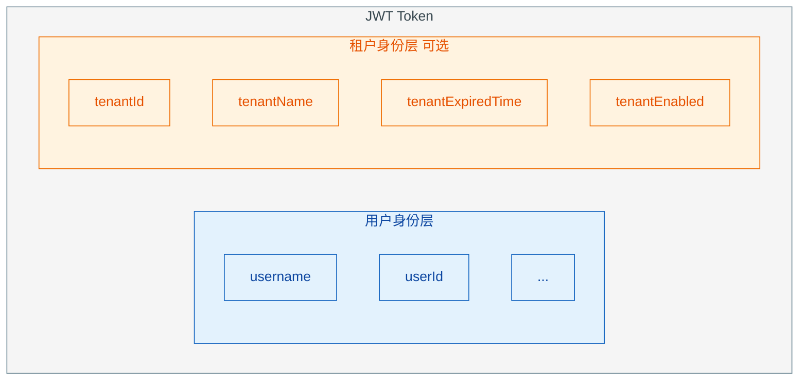
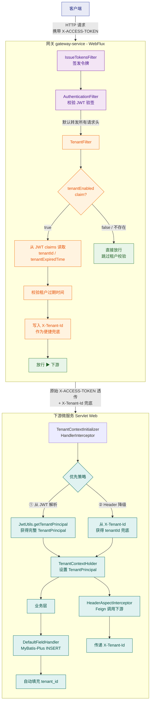
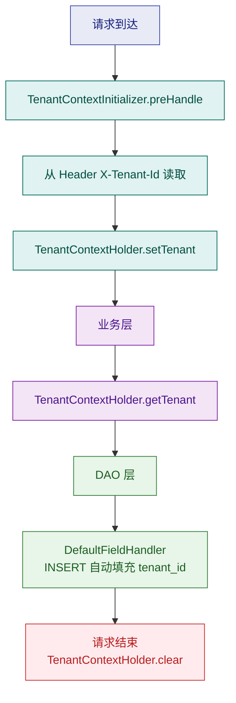

# atlas-richie-component-tenant — 多租户能力组件

> **版本**: 1.0.0-SNAPSHOT  
> **技术栈**: JDK 25 · Spring Boot 4.0.6 · MyBatis-Plus 3.5.12 · WebFlux / Servlet

---

## 目录

- [概述](#概述)
- [设计原则](#设计原则)
- [架构总览](#架构总览)
- [热插拔非侵入设计](#热插拔非侵入设计)
- [租户身份模型](#租户身份模型)
- [租户上下文传播](#租户上下文传播)
- [JWT 集成](#jwt-集成)
- [网关过滤器链](#网关过滤器链)
- [服务间传递](#服务间传递)
- [DAO 数据隔离](#dao-数据隔离)
- [配置参考](#配置参考)
- [快速开始](#快速开始)
- [文档索引](#文档索引)

---

## 概述

`atlas-richie-component-tenant` 是 Atlas Richie 平台的多租户能力组件，覆盖从 **认证层（JWT）** 到 **数据层（DAO）** 的完整租户隔离方案。

核心能力：

| 能力       | 说明                                                     | 状态     |
|----------|--------------------------------------------------------|--------|
| 租户身份模型   | `TenantPrincipal` 作为租户主体，与用户认证正交                       | ✅ 已实现  |
| 热插拔设计    | classpath 决定能力存在，零代码侵入                                 | ✅ 已实现  |
| JWT 集成   | tenantId / tenantName / tenantEnabled 写入 claims        | ✅ 已实现  |
| 网关租户校验   | `TenantFilter` 按 JWT claim 决定是否校验                      | ✅ 已实现  |
| 上下文传播    | TTL / ScopedValue 线程传递 + Header 透传                     | ✅ 已实现  |
| DAO 数据隔离 | MyBatis-Plus 多租户插件（column / table / schema / database） | 🚧 待更新 |
| 动态数据源    | 多数据源路由 & 连接池隔离                                         | 🚧 待更新 |

---

## 设计原则

### 1. 正交性

租户身份（`TenantPrincipal`）与用户身份（`LoginUserPrincipal`）是两层独立概念：



- 不含租户组件的服务：忽略 `tenantId` 等 claims，只解析用户身份
- 含租户组件的服务：自动识别并执行租户校验和隔离

### 2. 非侵入性

- **代码无感**：业务代码无需手动获取/传递 tenantId
- **配置驱动**：`GatewayContract.tenant.enabled` 控制网关层开关
- **渐进引入**：存量 token 无 `tenantEnabled` claim → 自动跳过校验

### 3. 单一信任源

- **JWT claims 是唯一信任源**
- Header `X-Tenant-Id` 仅作为网关到下游服务的便捷透传，不作为鉴权依据
- 下游服务应优先从 JWT claims 中提取完整租户信息（`JwtUtils.getTenantPrincipal(token)`）

---

## 架构总览



### 两层隔离

| 层次      | 机制                             | 职责        |
|---------|--------------------------------|-----------|
| **认证层** | JWT claims → `TenantFilter`    | 令牌级租户身份校验 |
| **数据层** | `TenantContextHolder` → DAO 插件 | 数据行级/库级隔离 |

---

## 热插拔非侵入设计

这是本组件最核心的设计理念：**组件在 classpath 上即启用，移除即消失，业务代码无需任何改动**。

### TenantFeature 全局标志

```java
// atlas-richie-contract 中定义
public final class TenantFeature {
    private static final AtomicBoolean ENABLED = new AtomicBoolean(false);

    public static boolean isEnabled() { return ENABLED.get(); }
    public static void setEnabled(boolean enabled) { ENABLED.set(enabled); }
}
```

### 自动注册机制

```java
// atlas-richie-component-tenant 中
@AutoConfiguration
public class TenantFeatureConfiguration {
    @PostConstruct
    public void init() {
        TenantFeature.setEnabled(true);  // 组件加载即设置标志
    }
}
```

同时注册在 `META-INF/spring/org.springframework.boot.autoconfigure.AutoConfiguration.imports` 中：
```
com.richie.component.tenant.config.TenantFeatureConfiguration
```

### tenantEnabled JWT Claim

`JwtUtils.generateJwtToken(LoginUserPrincipal)` 在生成令牌时自动注入 `tenantEnabled` claim：

```java
public static String generateJwtToken(LoginUserPrincipal userVO, String secret, long expiredTime) {
    Map<String, String> params = new HashMap<>(userVO.getSignParams());
    params.put("tenantEnabled", String.valueOf(userVO.isTenantEnabled() || TenantFeature.isEnabled()));
    return generateJwtToken(userVO.getUsername(), params, secret, expiredTime);
}
```

| 场景              | tenantEnabled claim | 行为                             |
|-----------------|---------------------|--------------------------------|
| 组件未引入 classpath | `false`（或不存在）       | `TenantFilter` 跳过校验            |
| 组件已引入           | `true`              | `TenantFilter` 严格校验            |
| 旧 token（升级前签发）  | 无此 claim            | 解析为 `null` → 等价 `false` → 跳过校验 |

`LoginUserPrincipal` 提供 `tenantEnabled` 字段供子类显式覆盖：

```java
// 子类可在构建时显式指定
userVO.setTenantEnabled(false);  // 当前用户不关联租户
userVO.setTenantEnabled(true);   // 当前用户需租户校验
```

---

## 租户身份模型

### TenantPrincipal

定义在 `atlas-richie-contract` 中，与 `LoginUserPrincipal` 同级：

```java
@Data
@Accessors(chain = true)
public class TenantPrincipal implements Serializable {
    private Long tenantId;                  // 租户 ID（数据库主键）
    private String tenantName;              // 租户展示名称
    private OffsetDateTime expiredTime;     // 租户过期时间（UTC）
}
```

- 纯 POJO，**无任何框架依赖**
- 序列化支持（`implements Serializable`）用于跨线程/跨进程传递
- `expiredTime` 使用 `OffsetDateTime`（UTC），仅在接口输出时转换时区

### 与 LoginUserPrincipal 的协作

| 维度   | LoginUserPrincipal      | TenantPrincipal                               |
|------|-------------------------|-----------------------------------------------|
| 职责   | 用户认证身份                  | 租户隔离身份                                        |
| 存储   | JWT username / userId 等 | JWT tenantId / tenantName / tenantExpiredTime |
| 传递方式 | `SecurityContextHolder` | `TenantContextHolder`                         |
| 生命周期 | 用户会话                    | 请求租户上下文                                       |

---

## 租户上下文传播

### TenantContextHolder

线程级租户上下文容器，提供两种实现：

| 实现                                | 线程模型      | 适用场景        |
|-----------------------------------|-----------|-------------|
| **TTL**（TransmittableThreadLocal） | 线程池异步任务传递 | 传统线程池       |
| **ScopedValue**（JDK 24+）          | 虚拟线程协程传递  | Loom / 虚拟线程 |

```java
public class TenantContextHolder {
    public static void setTenant(TenantPrincipal tenant) { ... }
    public static TenantPrincipal getTenant() { ... }
    public static void clear() { ... }
}
```

### TenantResolver SPI

```java
public interface TenantResolver {
    TenantPrincipal resolve(HttpServletRequest request);
}
```

允许各微服务自定义从请求中解析租户的方式（Header / JWT / 其他）。

### TenantContextInitializer

Servlet `HandlerInterceptor`，在每个请求进入后自动从 Header 解析租户并设置到 `TenantContextHolder`：

```java
public class TenantContextInitializer implements HandlerInterceptor {
    @Override
    public boolean preHandle(HttpServletRequest request, ...) {
        String tenantId = request.getHeader(GlobalConstants.X_TENANT_ID);
        if (tenantId != null) {
            TenantPrincipal tenant = new TenantPrincipal().setTenantId(Long.valueOf(tenantId));
            TenantContextHolder.setTenant(tenant);
        }
        return true;
    }

    @Override
    public void afterCompletion(...) {
        TenantContextHolder.clear();  // 请求结束清理
    }
}
```

### 数据流总结



---

## JWT 集成

### 生成令牌

```java
// 方式一：通过 TenantPrincipal 生成（推荐，类型安全）
TenantPrincipal tenant = new TenantPrincipal()
    .setTenantId(1001L)
    .setTenantName("某租户");
String token = JwtUtils.generateJwtToken("admin", tenant, secret, expiredTime);

// 方式二：通过 LoginUserPrincipal（自动注入 tenantEnabled）
LoginUserPrincipal userVO = new UserPrincipal()
    .setUsername("admin");
userVO.addParam("tenantId", "1001");
userVO.addParam("tenantName", "某租户");
String token = JwtUtils.generateJwtToken(userVO, secret, expiredTime);
```

### JWT Claims 结构

```json
{
  "username": "admin",
  "tenantId": "1001",
  "tenantName": "某租户",
  "tenantExpiredTime": "1778659200",
  "tenantEnabled": "true",
  "deviceId": "xxx",
  "hardwareFingerprint": "yyy",
  ...
}
```

### 提取租户信息

```java
// 获取单字段
String tenantId = JwtUtils.getArgument(token, "tenantId");

// 获取完整 TenantPrincipal（推荐）
TenantPrincipal tenant = JwtUtils.getTenantPrincipal(token);
if (tenant != null) {
    Long id = tenant.getTenantId();
    String name = tenant.getTenantName();
    OffsetDateTime expired = tenant.getExpiredTime();
}
```

`getTenantPrincipal()` 内部逻辑：解析 `tenantId` / `tenantName` / `tenantExpiredTime` 三个 claim，组装为 `TenantPrincipal` 对象；无 `tenantId` claim 时返回 `null`。

---

## 网关过滤器链

### IssueTokensFilter

拦截登录成功响应，提取 `LoginUserPrincipal` 并签发 JWT：

1. 解析登录接口的 JSON 返回值 → `LoginUserPrincipal`
2. 注入 deviceId / hardwareFingerprint 等附加参数
3. 调用 `SignatureService.createSignature(result)` → 内部使用 `JwtUtils.generateJwtToken()`
4. `JwtUtils` 在生成时自动注入 `tenantEnabled` claim

### AuthenticationFilter

校验请求中 JWT 的有效性（签名、过期时间、黑名单）。

### TenantFilter

排序：`FilterOrder.TENANT_FILTER = 300`

```java
protected Mono<Void> doFilter(ServerWebExchange exchange, GatewayFilterChain chain) {
    String token = exchange.getRequest().getHeaders().getFirst(JwtUtils.X_ACCESS_TOKEN);

    // Step 1: 检查 tenantEnabled claim
    String enabledStr = JwtUtils.getArgument(token, "tenantEnabled");
    if (!"true".equals(enabledStr)) {
        return chain.filter(exchange);  // 跳过租户校验
    }

    // Step 2: 要求 tenantId 存在
    String tenantIdStr = JwtUtils.getArgument(token, "tenantId");
    if (StringUtils.isBlank(tenantIdStr)) {
        return NetworkUtils.returnError(response, HttpStatus.UNAUTHORIZED, i18n.get("MSG_GATEWAY_TIP_6"));
    }

    // Step 3: 校验租户过期
    String tenantExpiredStr = JwtUtils.getArgument(token, "tenantExpiredTime");
    // ... 过期检查 ...

    // Step 4: X-Tenant-Id 写入请求头，传递给下游
    ServerHttpRequest mutatedRequest = exchange.getRequest().mutate()
        .headers(headers -> headers.set(GlobalConstants.X_TENANT_ID, tenantIdStr))
        .build();
    return chain.filter(exchange.mutate().request(mutatedRequest).build());
}
```

| 条件                                  | 结果                 |
|-------------------------------------|--------------------|
| `tenantEnabled` 不存在                 | 放行（兼容旧令牌）          |
| `tenantEnabled=false`               | 放行                 |
| `tenantEnabled=true` + 有 `tenantId` | 校验 → 设 Header → 放行 |
| `tenantEnabled=true` + 无 `tenantId` | 401 拒绝             |
| `tenantEnabled=true` + 租户已过期        | 失效令牌 + 401 拒绝      |

`enableVerifyFilter()` 由 `config.getTenant().isEnable()` 控制，作为部署级开关。

---

## 服务间传递

### HTTP 调用（Feign）

`HeaderAspectInterceptor` 自动从 `TenantContextHolder` 读取租户 ID，写入 Feign 请求头：

```
请求头: X-Tenant-Id: 1001
```

下游服务的 `TenantContextInitializer` 自动从 Header 解析并设置上下文。

### 消息队列（RocketMQ）

消费者基类 `AbstractBaseConsumer` 在消费前自动从消息头解析 `X-Tenant-Id` 并设置上下文：

```java
public abstract class AbstractBaseConsumer<T> {
    public void onMessage(T message, MessageExt messageExt) {
        String tenantId = messageExt.getProperty(GlobalConstants.X_TENANT_ID);
        if (tenantId != null) {
            TenantContextHolder.setTenant(new TenantPrincipal().setTenantId(Long.valueOf(tenantId)));
        }
        try {
            process(message, messageExt);
        } finally {
            TenantContextHolder.clear();
        }
    }
}
```

### AccessLogAspect

AOP 切面拦截 Controller 调用，从请求头读取 `X-Tenant-Id` 写入日志上下文，便于租户维度的日志检索。

---

## DAO 数据隔离

> 🚧 **本节内容占位，后续更新。**

### DefaultFieldHandler（已实现）

MyBatis-Plus 自动填充器，`INSERT` 时从 `TenantContextHolder` 读取 `tenantId` 并写入实体：

```java
@Component
public class DefaultFieldHandler implements MetaObjectHandler {
    @Override
    public void insertFill(MetaObject metaObject) {
        TenantPrincipal tenant = TenantContextHolder.getTenant();
        if (tenant != null && tenant.getTenantId() != null) {
            this.strictInsertFill(metaObject, "tenantId", Long.class, tenant.getTenantId());
        }
    }
}
```

### 待补充内容

- MyBatis-Plus 多租户 SQL 拦截器（column 模式）
- 多数据源路由（table / schema / database 模式）
- 策略配置与切换
- 事务内租户冻结与治理

详细 DAO 层设计文档请参考 `docs/` 目录。

---

## 配置参考

### GatewayContract（共享契约）

```yaml
platform:
  gateway:
    tenant:
      enabled: true        # 部署级租户开关
```

`GatewayConfig.getTenant().isEnable()` 控制 `TenantFilter.enableVerifyFilter()`。

### TenantAutoConfiguration（下游服务自动配置）

| 条件                                                        | 行为                                                                                        |
|-----------------------------------------------------------|-------------------------------------------------------------------------------------------|
| Servlet Web + classpath 有 `atlas-richie-component-tenant` | 自动注册 `TenantContextInitializer`                                                           |
| WebFlux（网关）                                               | 不注册 Servlet 拦截器（由 `TenantAutoConfiguration` 的 `@ConditionalOnWebApplication(SERVLET)` 确保） |
| `TenantFeatureConfiguration`                              | 无条件，Servlet/WebFlux 均激活                                                                   |

---

## 快速开始

### 1. 引入依赖

```xml
<dependency>
    <groupId>com.richie.component</groupId>
    <artifactId>atlas-richie-component-tenant</artifactId>
</dependency>
```

引入后自动激活：
- `TenantFeature.isEnabled()` 返回 `true`
- 所有通过 `JwtUtils` 生成令牌自动带 `tenantEnabled=true` claim
- Servlet 环境自动注册 `TenantContextInitializer`
- DAO 层 `DefaultFieldHandler` 自动填充 `tenant_id`

### 2. 仅使用上下文传播（无需 DAO 隔离）

只需依赖即可，`TenantContextInitializer` 自动将 Header `X-Tenant-Id` 解析到 `TenantContextHolder`：

```java
TenantPrincipal tenant = TenantContextHolder.getTenant();
if (tenant != null) {
    Long tenantId = tenant.getTenantId();
    // 按租户做业务逻辑
}
```

### 3. 自定义租户解析

实现 `TenantResolver` SPI：

```java
@Component
public class MyTenantResolver implements TenantResolver {
    @Override
    public TenantPrincipal resolve(HttpServletRequest request) {
        String tenantId = request.getHeader("X-My-Tenant");
        return tenantId != null ? new TenantPrincipal().setTenantId(Long.valueOf(tenantId)) : null;
    }
}
```

### 4. 构建

```bash
mvn clean install -pl atlas-richie-component/atlas-richie-component-tenant -am -DskipTests
```

---

## 文档索引

### 系统设计（本文档）

| 章节                    | 说明                                                            |
|-----------------------|---------------------------------------------------------------|
| [热插拔非侵入设计](#热插拔非侵入设计) | `TenantFeature` + `tenantEnabled` claim 机制                    |
| [租户身份模型](#租户身份模型)     | `TenantPrincipal`、`LoginUserPrincipal`                        |
| [租户上下文传播](#租户上下文传播)   | `TenantContextHolder`、`TenantResolver`、拦截器                    |
| [JWT 集成](#jwt-集成)     | 生成、提取、校验全流程                                                   |
| [网关过滤器链](#网关过滤器链)     | `IssueTokensFilter` → `AuthenticationFilter` → `TenantFilter` |

### DAO 层详细设计（docs/ 目录）

| 文档                                      | 说明                                             |
|-----------------------------------------|------------------------------------------------|
| [概念设计](docs/多租户MyBatis-Plus通用插件概念设计.md) | 系统概述、技术架构、数据模型、业务流程                            |
| [上下文模块](docs/上下文模块详细设计.md)              | `TenantContextHolder` 接口、ScopedValue / TTL 双实现 |
| [策略模块](docs/策略模块详细设计.md)                | `TenancyStrategy` 工厂、五种隔离策略                    |
| [持久层路由与拦截器](docs/持久层路由与拦截器集成模块详细设计.md)  | `DynamicTenantDataSource`、拦截器链、事务冻结            |
| [可运维与灰度增强](docs/可运维与灰度增强详细设计.md)        | 健康检查、灰度发布、动态配置刷新                               |
