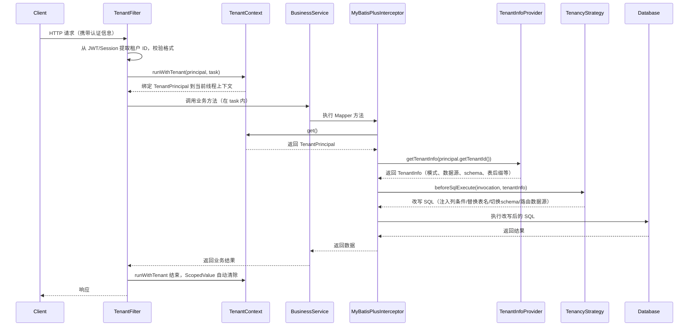
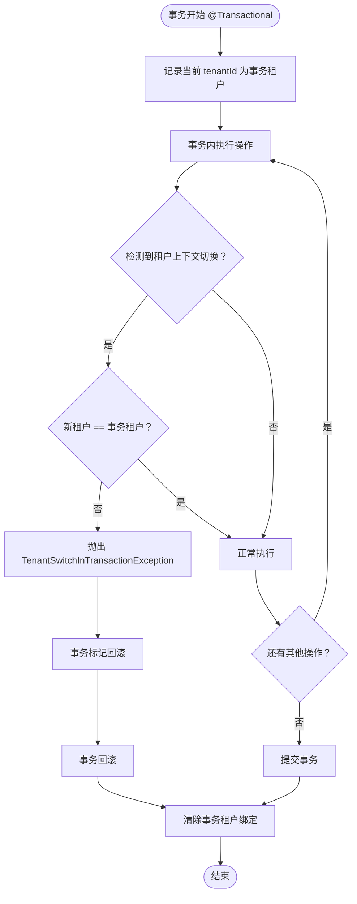
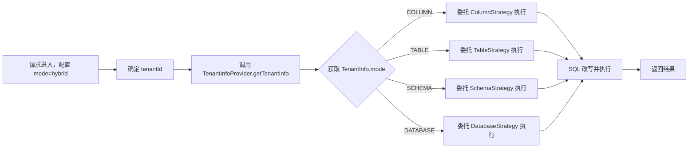

已将 ThreadLocal 降级方案的详细设计补充进概念设计的 **5.2 租户上下文模块**，以下是更新后的完整概念设计文档。

---

# 多租户 MyBatis-Plus 通用插件概念设计

## 1. 系统概述

### 1.1 背景
在多租户 SaaS 平台中，不同租户之间的数据隔离是安全与合规的核心要求。传统做法需要在每个服务中硬编码租户过滤逻辑，导致代码侵入性强、隔离模式调整困难，且难以应对从单库单表到多库多 schema 的演进需求。本系统旨在提供一套**配置驱动、策略可插拔、安全可控**的多租户数据隔离通用组件，以极低的侵入性接入 Spring Boot + MyBatis-Plus 技术栈，统一支撑 **列级、表级、Schema 级、数据库级及混合级**五种隔离模式。

### 1.2 目标

- **通过配置实现多隔离模式切换**：仅需修改 YAML 中的 `mode` 即可在 column / table / schema / database / hybrid 之间切换，无需改动业务代码。
- **在 Spring Boot 自动装配体系下实现低侵入接入**：提供 Starter 及 `AutoConfiguration`，业务系统引入依赖后即自动启用，对现有代码零侵入。
- **保证租户隔离安全、事务一致性与可运维性**：强制租户 ID 与认证主体绑定，事务内冻结租户并禁止切换；提供健康检查、审计日志等可运维能力。
- **预留 SPI 以支持企业级扩展**：针对租户元数据、动态数据源、分布式事务与审计等场景，定义标准扩展接口，后续可无缝集成。

### 1.3 核心特性
- 五种隔离模式：**列（Column）、表（Table）、Schema、Database、混合（Hybrid）**
- 配置驱动：YAML 定义全局模式、数据源、租户标识列等信息
- 安全第一：租户 ID 强制与认证主体绑定校验，不允许从不可信输入直接采纳
- 事务铁律：同一事务内禁止租户切换，违规即回滚
- 虚拟线程友好：租户上下文基于 `ScopedValue`，天然支持 Project Loom
- 零数据库依赖：所有租户元数据来源于配置，无需额外数据表

## 2. 技术架构

系统采用**配置驱动 + 上下文 + 元数据 + 策略执行 + 持久层路由**的分层模型，整体架构如下图所示（文字描述）：

```
┌────────────────────────────────────────────────────────┐
│                    入口层（Filter / Interceptor）        │
│   提取认证租户 → 绑定 TenantContext → 触发上下文传播      │
└───────────────────┬────────────────────────────────────┘
                    │
┌───────────────────▼────────────────────────────────────┐
│                  配置层（MultiTenancyProperties）        │
│  YAML 解析全局模式、数据源映射、租户标识列、前缀/后缀等    │
└───────────────────┬────────────────────────────────────┘
                    │
┌───────────────────▼────────────────────────────────────┐
│              元数据层（TenantInfoProvider SPI）          │
│  提供租户 → 隔离模式/数据源/schema/表后缀 的查询能力      │
│  默认实现：配置驱动；可扩展：数据库/配置中心等             │
└───────────────────┬────────────────────────────────────┘
                    │
┌───────────────────▼────────────────────────────────────┐
│                策略层（TenancyStrategy 实现）            │
│  根据 IsolationMode 匹配合适的执行器                      │
│  - ColumnStrategy  - TableStrategy  - SchemaStrategy    │
│  - DatabaseStrategy - HybridStrategy                    │
└───────────────────┬────────────────────────────────────┘
                    │
┌───────────────────▼────────────────────────────────────┐
│              持久层路由与拦截器集成                        │
│  - DynamicDataSource（AbstractRoutingDataSource）        │
│  - MyBatis-Plus 拦截器链（租户字段注入、表名替换等）      │
│  - 事务管理增强（租户冻结、切换校验）                    │
└────────────────────────────────────────────────────────┘
```

**关键技术选型**

| 技术点            | 选型 / 机制                                                  |
| ----------------- | ------------------------------------------------------------ |
| 租户上下文载体    | `ScopedValue`（主）+ `ThreadLocal` 降级方案                  |
| 动态数据源        | Spring `AbstractRoutingDataSource`                           |
| Schema 切换       | `SET LOCAL search_path`（PostgreSQL）或连接 reset            |
| MyBatis-Plus 集成 | 自定义 `TenantLineInnerInterceptor`、`DynamicTableNameInnerInterceptor` 等 |
| 事务边界守护      | 自定义 `TransactionSynchronization` + AOP                    |
| 分布式事务预留    | SPI：`TenantContextPropagator`、`TenantAwareTransactionManager`、`DistributedTransactionAdapter` |
| 自动装配          | Spring Boot `AutoConfiguration.imports`                      |

## 2.1 数据库兼容性

不同数据库对隔离模式的支持程度不同，尤其是 **MySQL 不区分 schema 与 database**，因此 `schema` 模式在 MySQL 中不可用。本方案采用 JDBC 抽象，隔离能力受底层数据库特性约束，具体兼容关系如下：

| 隔离模式     | PostgreSQL | MySQL | Oracle | SQL Server | 备注                                                         |
| :----------- | :--------- | :---- | :----- | :--------- | :----------------------------------------------------------- |
| **column**   | ✅          | ✅     | ✅      | ✅          | 通过 SQL 条件注入实现，所有关系数据库均支持                  |
| **table**    | ✅          | ✅     | ✅      | ✅          | 动态表名替换，所有数据库均支持                               |
| **schema**   | ✅          | ❌     | ✅      | ✅          | MySQL 中 schema 等同于 database，无法在同一连接下以 schema 隔离多租户，应使用 **database** 模式替代 |
| **database** | ✅          | ✅     | ✅      | ✅          | 通过独立数据源/连接实现，所有数据库均支持                    |
| **hybrid**   | ✅          | ⚠️     | ✅      | ✅          | MySQL 中混合模式下，租户若被分配为 schema 隔离，需回退为 database 模式或禁止使用 |

> **说明**
>
> - MySQL 的 `CREATE SCHEMA` 实质为创建新数据库，无法在单数据库内实现多 schema 隔离，因此配置 `mode: schema` 时将启动校验并抛出 `UnsupportedOperationException`。
> - 对于混合模式，当某个租户的元数据指向 `SCHEMA` 隔离时，若底层为 MySQL 则会启动失败，必须提前在元数据中将其模式设定为 `DATABASE`。
> - 本表仅列出常见数据库，其他数据库需根据其 schema 语义评估，建议在 `TenantInfoProvider` 中增加数据库类型检测以提前拦截不支持的组合。

该兼容性约束会被纳入**配置校验器**（见 5.1），在启动阶段即中断不合法配置，避免运行时风险。

### 2.2 自动建表兼容性

`table-auto-create` 仅对隔离模式为 `table` 的租户生效，通过 `CREATE TABLE IF NOT EXISTS ... LIKE` 按 `table-templates` 列表遍历复制表结构（含列、索引、约束），不复制数据。

**database 模式不提供自动建库能力**——`CREATE DATABASE` 需要 DBA 级权限，不应暴露给应用连接池。database 模式下，数据库实例由运维独立创建后，通过管理 API 注册数据源连接信息完成租户上线。

## 3. 数据模型

本方案采用 **YAML 为种子配置 + DB 为运行时权威源** 的双层模型：

| 层级 | 用途 | 生命周期 |
|------|------|---------|
| YAML `datasource.tenants` | 首次启动的**种子数据**，初始化 `sys_tenant` 表 | 一次性消费，后续重启忽略 |
| `sys_tenant` 表 | 租户运行时元数据的**权威源** | 管理 API 增删改，立即生效 |

> 详见 [租户生命周期详细设计](租户生命周期详细设计.md) §1 权威性规则。

### 3.1 配置模型（YAML）

不同隔离模式的配置复杂度差异显著。以下为各模式的最小工作配置，实际可组合叠加。

#### 通用基础配置

所有模式共享的配置项：

```yaml
multi-tenancy:
  enabled: true
  mode: column                      # column / table / schema / database / hybrid
  force-thread-local: false
  tenant-id-header: X-Tenant-ID
  enforce-auth-tenant: true
  allowed-tenant-pattern: "^[a-zA-Z0-9_\\-]{1,64}$"
  tenant-id-column: tenant_id
  ignore-tables:
    - sys_config
  datasource:
    shared:
      url: jdbc:postgresql://localhost:5432/shared_db
      username: app
      password: password
      hikari:
        maximum-pool-size: 20
    tenants:                        # 种子数据，仅首次启动生效
      tenantA:
        url: jdbc:postgresql://localhost:5432/tenant_a
```

> **`tenant-id-header` 用途**：跨服务调用时通过 HTTP Header / gRPC Metadata 传递租户 ID 的统一 key，默认 `X-Tenant-ID`。
> 
> - **入口**：`TenantIdentityFilter` 用此 header 与 JWT `tenantCode` 交叉校验（不可单独信任 header）。
> - **出站**：所有出站 HTTP/Feign/gRPC 客户端自动注入此 header，值为当前 `TenantContext` 中的租户 ID。
> - **可配置**：允许改名以适配不同的网关/服务网格约定。
> 
> 详见 [上下文模块详细设计](上下文模块详细设计.md) §4 身份解析与 §7 跨服务传递。

#### Column 模式（最简）

仅需通用配置，无额外字段。

```yaml
multi-tenancy:
  mode: column
  # ── 其余使用通用配置即可 ──
```

#### Table 模式

```yaml
multi-tenancy:
  mode: table
  table-name-suffix: _${tenant}
  table-auto-create: true           # 注册租户时自动 CREATE TABLE ... LIKE
  table-templates:                  # 需要按 suffix 复制的表模板列表
    - t_order
    - t_user
    - t_product
  # ── 其余使用通用配置 ──
```

#### Schema 模式

```yaml
multi-tenancy:
  mode: schema
  schema-prefix: tenant_
  # ── 其余使用通用配置 ──
```

> MySQL 不支持 schema 模式，配置校验器会在启动时拒绝。

#### Database 模式

```yaml
multi-tenancy:
  mode: database
  datasource:
    tenants:                        # 种子数据
      tenantA:
        url: jdbc:postgresql://localhost:5432/tenant_a
        username: app
        password: password
  # ── 其余使用通用配置 ──
```

> database 模式**不支持应用侧自动建库**——`CREATE DATABASE` 需 DBA 权限。数据库实例由运维创建后，通过管理 API 注册连接信息完成租户上线。连接信息由 API 调用方显式传入，不通过 YAML 模板自动生成。

#### Hybrid 模式（组合）

```yaml
multi-tenancy:
  mode: hybrid
  table-name-suffix: _${tenant}     # table 租户使用
  table-auto-create: true
  table-templates: [t_order, t_user]
  schema-prefix: tenant_            # schema 租户使用
  datasource:
    tenants:                        # 种子数据，含租户级 mode
      tenant_a:
        mode: COLUMN                # 默认 COLUMN，可省略
      tenant_b:
        mode: TABLE
        table-suffix: _b_custom     # 可选覆盖全局 table-name-suffix
      tenant_c:
        mode: DATABASE
        url: jdbc:postgresql://pg2:5432/tenant_c  # database 租户可覆盖连接信息
  # ── 其余使用通用配置 ──
```

> **hybrid 模式的租户级 mode**：YAML `mode: hybrid` 仅为全局声明。每个租户的隔离模式由 YAML `tenants.<id>.mode` 指定（种子数据，首次启动写入 `sys_tenant.isolation_mode`）；若未配置则默认 `COLUMN`。后续运行期以 `sys_tenant.isolation_mode` 为权威源。
>
> ```sql
> -- hybrid 模式下 sys_tenant 示例：三个租户使用不同策略
> SELECT tenant_id, tenant_name, isolation_mode FROM sys_tenant;
> -- tenant_a | Tenant A Corp | COLUMN     → WHERE tenant_id = 'tenant_a'
> -- tenant_b | Tenant B Ltd  | TABLE      → t_order_tenant_b + 自动建表
> -- tenant_c | Tenant C Bank | DATABASE   → jdbc:.../tenant_tenant_c 独立库
> ```
>
> 详见 [租户生命周期详细设计](租户生命周期详细设计.md) §2 `sys_tenant` 元数据表。

> `tenants` 为种子数据，仅在首次启动且 `sys_tenant` 表为空时写入；后续重启以 DB 为权威源，忽略 YAML `tenants`。

### 3.2 运行时对象模型

**TenantContext**  
- 职责：持有当前线程的租户标识，提供绑定与获取方法。  
- 结构：基于 `ScopedValue` 的单值容器，不可变，随虚拟线程生命周期自动清理；同时提供 `ThreadLocal` 降级实现。

**TenantInfo**  

- 属性：  
  `String tenantId`  
  `IsolationMode mode`  
  `String dataSourceName`  
  `String schemaName`  
  `String tableSuffix`  

由 `TenantInfoProvider` 根据租户 ID 返回，是策略执行的核心元数据。

**IsolationMode 枚举**  
`COLUMN, TABLE, SCHEMA, DATABASE, HYBRID`

**TenancyStrategy 及执行器状态**  
无状态，仅持有配置引用，执行 SQL 拦截和动态路由。

**数据源路由上下文**  
`AbstractRoutingDataSource` 内部维护一个 `Map<Object, DataSource>`（lookup key → DataSource），key 来自 `TenantInfo.dataSourceName` 或固定 shared 值。

## 4. 业务流程图与时序图

### 4.1 租户上下文绑定与 SQL 执行流程




### 4.2 事务内租户冻结与切换检测流程（活动图文字描述）




### 4.3 混合模式分发流程




## 5. 功能模块设计

### 5.1 配置管理模块
- **MultiTenancyProperties**：映射全部 YAML 配置，提供模式、租户标识列、数据源定义等。
- **配置校验器**：启动时校验 `allowed-tenant-pattern`、数据源完整性，以及混合模式下租户元数据存在性。
- **动态配置刷新**（预留）：监听配置变更（Spring Cloud Config / Nacos）后重建部分组件，需保证数据源刷新线程安全。

### 5.2 租户上下文模块

该模块负责在请求生命周期内安全地持有和传递租户 ID，并支持 ScopedValue 与 ThreadLocal 两种实现的无感切换。

- **TenantContextHolder 接口**：定义租户上下文的绑定、获取和清理操作。
  - `void runWithTenant(TenantPrincipal principal, Runnable task)`
  - `TenantPrincipal get()`
  - `void clear()`

- **ScopedValueHolder 实现**：基于 JDK 20+ 的 `ScopedValue`，在 `StructuredTaskScope` 内虚拟线程间自动继承，作用域结束自动清理；**不跨线程池传递**（JDK 刻意设计），需通过 `TaskDecorator` 显式捕获-恢复。
- **ThreadLocalHolder 实现**：基于 `TransmittableThreadLocal`（TTL），可通过 `TtlExecutors` 包装实现线程池自动传递，兼容旧 JDK 与非虚拟线程环境。同样支持嵌套绑定（内部覆盖后恢复外层值）。
- **自动选择机制**：在自动配置阶段检测 `ScopedValue` 是否可用，并允许通过 `multi-tenancy.force-thread-local=true` 强制降级；运行时 JVM 全局只存在一个 `TenantContextHolder` 实例，保证同一上下文不会混用两种机制。
- **TenantContext 门面**：所有对外 API 委托给当前 `TenantContextHolder` 实例，提供静态方法 `runWithTenant`、`get` 和 `clear`。
- **上下文传播器（SPI）**：`TenantContextPropagator`，用于跨线程池/消息队列/RPC 时挂载与恢复租户上下文。ScopedValue 模式默认需要显式捕获-恢复；ThreadLocal + TTL 模式可自动传递。
- **入口绑定器**：提供标准的 Servlet Filter、Reactor Context 支持，实现认证租户提取与绑定。

**跨服务租户传递**：当请求跨越微服务边界时，租户 ID 通过统一的 `X-Tenant-ID`（由 `tenant-id-header` 配置，默认 `X-Tenant-ID`）注入出站协议头，下游服务的 `TenantIdentityFilter` 收到后与 JWT `tenantCode` 交叉校验：

| 协议 | 出站注入方式 | 入站提取方式 |
|------|------------|------------|
| **HTTP**（RestTemplate / WebClient） | `ClientHttpRequestInterceptor` 从 `TenantContext` 读取，通过 `properties.getTenantIdHeader()` 注入 header | `TenantIdentityFilter` 从 `HttpServletRequest` 读取 |
| **OpenFeign** | `TenantFeignInterceptor` 实现 `RequestInterceptor`，通过 `properties.getTenantIdHeader()` 注入 header | 同上（Feign 调用走 HTTP，下游同样经过 Filter 链） |
| **gRPC** | `ClientInterceptor` 通过 `Metadata.Key.of(properties.getTenantIdHeader(), ...)` 注入 gRPC Metadata | `ServerInterceptor` 从 Metadata 提取并写入 `HttpServletRequest` wrapper，使 `TenantIdentityFilter` 无感处理 |

> 安全原则不变：header/metadata 中的 `X-Tenant-ID` **仅供交叉校验**，不可作为租户身份的唯一来源。JWT `tenantCode` 始终是权威源。详见 [上下文模块详细设计](上下文模块详细设计.md) §7。

**定时任务与后台线程**：定时任务无 HTTP 请求上下文（无 JWT、无 `TenantIdentityFilter`），必须显式调用 `TenantContext.runWithTenant(principal, () -> { ... })` 绑定租户。详见 [README 定时任务模板](多租户设计阅读导览.md#定时任务模板)。

**模式迁移与数据迁移**：当租户需要变更隔离模式时，`TenantModeGuard` 仅允许低等级→高等级（COLUMN→TABLE→SCHEMA→DATABASE）迁移。数据迁移由 `TenantDataMigrator` SPI 执行，覆盖 6 条迁移路径，含 SQL 模板、校验机制、回滚策略和人工 SOP。详见 [模式切换数据迁移方案](模式切换数据迁移方案.md)。

### 5.3 元数据模块
- **TenantInfoProvider 接口**：`getTenantInfo(String tenantId)` → `TenantInfo`（DB 中无记录返回 `null`）；`exists(String tenantId)` → `boolean`（O(1) 缓存查询，供 Filter 存在性校验）。
- **DatabaseBasedTenantInfoProvider（默认）**：从 `sys_tenant` 表读取，本地缓存 + Nacos 事件刷新。DB 中未记录的租户返回 `null`（调用方应拒绝请求，引导通过管理 API 注册）。
- **Extension 预留**：可扩展为从 Redis、配置中心等多源聚合。

### 5.4 策略执行模块
- **TenancyStrategy 接口**：定义 `supports(IsolationMode)` 和 `beforeSqlExecute(invocation, tenantInfo)`。
- **ColumnStrategy**：在 SQL 中自动添加 `tenant_id = ?` 条件；INSERT 时填充租户字段；UPDATE/DELETE 无租户条件时拒绝执行。
- **TableStrategy**：根据 `tableSuffix` 动态替换 SQL 中的表名。
- **SchemaStrategy**：利用 `SET LOCAL search_path` 或连接 reset 方式切换 schema；schema 名从 `TenantInfo` 白名单获取，防止注入。
- **DatabaseStrategy**：通过 `AbstractRoutingDataSource` 切换到租户对应的独立数据源。
- **HybridStrategy**：按租户的 `IsolationMode` 委托给以上对应策略。

### 5.5 持久层路由与拦截器集成模块

- **DynamicTenantDataSource**：继承 `AbstractRoutingDataSource`，根据 `TenantInfo.dataSourceName` 决定目标数据源。支持运行时动态添加/删除数据源并保证线程安全。
- **MyBatis-Plus 拦截器链**：
  - `TenantLineInnerInterceptor`：负责 Column 模式下的租户字段过滤。
  - `DynamicTableNameInnerInterceptor`：负责 Table 模式下的表名替换。
  - `BlockAttackInnerInterceptor`：防止全表更新/删除。
  - `MetaObjectHandler`：自动填充插入时的 `tenant_id` 字段。
- **事务管理增强**：
  - 自定义 `TenantAwareDataSourceTransactionManager` 或 `TransactionSynchronization`，在事务开启时冻结租户。
  - AOP 切面监控 `@Transactional` 方法内 `TenantContext` 变更，发现切换即抛出异常并标记回滚。

### 5.6 分布式事务预留模块
- **DistributedTransactionAdapter SPI**：未来可集成 Seata/Atomikos，负责初始化资源代理、注册传播器。
- **TenantAwareTransactionManager**：包装原生事务管理器，增加全局事务租户校验。
- **DataSourceProxyFactory**：在数据源被路由前进行代理包装，使分支事务纳入全局协调。
- 所有预留组件在未启用分布式事务时均为零开销占位符。

### 5.7 自动配置与运维支持模块
- **MultiTenancyAutoConfiguration**：基于 `@ConditionalOnProperty` 条件装配所有组件。
- **Actuator 端点**（预留）：暴露当前活跃租户数、数据源状态、策略命中统计等。
- **审计日志**：拦截器记录每次 SQL 的 `tenantId, userId, sqlHash, datasource, schema, traceId`，便于排障和合规。
- **健康检查**：动态数据源连接池监控、schema 切换无连接污染验证。

---

