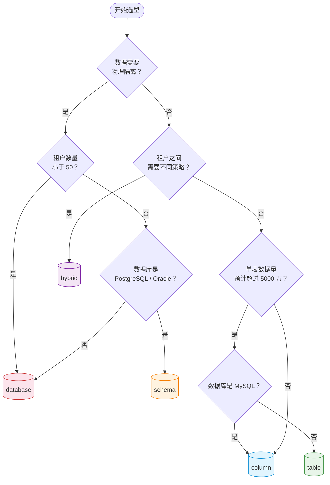

# Richie Component DAO Tenant

## 概述

多租户数据访问增强组件（可选），在 `atlas-richie-component-dao` 基础上为 MyBatis-Plus 增加多租户数据隔离能力。支持 **column / table / schema / database / hybrid** 五种隔离模式，通过配置驱动、策略可插拔，对业务代码零侵入。

**技术栈**：JDK 25 · Spring Boot 4.0.6 · MyBatis-Plus 3.5.12 · ScopedValue · HikariCP

## 隔离策略选型

### 策略对比

| 策略 | 隔离粒度 | 适用场景 | 优势 | 瓶颈 | 运维复杂度 | 资源需求 |
|------|---------|---------|------|------|-----------|---------|
| **column** | 行级 | 租户数量巨大（>1000），SaaS 标准多租户 | 零运维成本，单表管理，扩展简单 | 租户字段遗漏即数据泄漏；单表数据量膨胀导致查询变慢；索引需包含 tenant_id | ⭐ 低 — 单表维护，无需额外数据源管理 | 最低 — 1 个连接池，1 套表，无额外存储 |
| **table** | 表级 | 租户数据量大，需分表减轻单表压力 | 单租户表独立，查询性能优于 column | 表数量 = 租户数 × 业务表数，DDL 变更需全量执行；连接池压力与 column 相同 | ⭐⭐ 中 — DDL 需对每张租户表执行，自动化脚本维护成本高 | 低 — 1 个连接池，按租户扩展表数量，无额外连接开销 |
| **schema** | Schema 级 | PostgreSQL / Oracle，中等租户规模，需物理隔离但共享数据库实例 | 单库管理，schema 级权限隔离 | **MySQL 不支持**；跨 schema 查询受限；连接复用需 `SET LOCAL` 切换 | ⭐⭐ 中 — schema 创建/变更自动化，连接污染需监控 | 中 — 1 个连接池，N 个 schema，共享数据库实例资源 |
| **database** | 数据库级 | 金融/医疗等高合规场景，租户数少（<50） | 最强物理隔离，独立连接池，备份/恢复互不干扰 | 连接池总数 = 租户数 × 池大小，资源开销大；跨库查询需额外方案（如 CDC 汇聚） | ⭐⭐⭐ 高 — 每个租户独立数据库/连接池，备份策略、版本升级需逐库执行 | 高 — 每租户独立连接池（默认 10~20 连接），50 租户 × 20 = 1000 数据库连接 |
| **hybrid** | 混合 | 不同租户对隔离等级有不同要求 | 灵活性最高，可按租户量体裁衣 | 运维复杂度最高；需维护每个租户的隔离模式元数据；测试矩阵大 | ⭐⭐⭐⭐ 极高 — 同时承担多种模式的运维成本，需维护租户级元数据配置，灰度/回滚路径复杂 | 视组合而定 — database 租户每个消耗独立连接池，column/table/schema 租户共用共享池 |

### 决策树



### 典型场景速查

| 如果你想…… | 推荐策略 | 理由 |
|-----------|---------|------|
| 快速启动 SaaS MVP，租户会很多 | column | 零运维，单表 |
| 每个大客户独立数据备份 | database | 备份粒度到数据库 |
| 每天千万级订单，单表扛不住 | table（PG） / column（MySQL）| 分表降锁 |
| 金融合规要求物理隔离 | database | 最强隔离 |
| 给 VIP 租户独立库，普通租户共享表 | hybrid | 按需灵活 |
| 用 MySQL 还想 schema 隔离 | ❌ 不支持 | MySQL schema = database，请用 database |

## 文档索引

> 主方案见 [多租户方案设计.md](docs/多租户方案设计.md)

| 顺序 | 文档 | 说明 |
|------|------|------|
| 1 | [概念设计](docs/多租户MyBatis-Plus通用插件概念设计.md) | 系统概述、技术架构、数据模型、业务流程 |
| 2 | [上下文模块](docs/上下文模块详细设计.md) | `TenantContextHolder` 接口、ScopedValue / TransmittableThreadLocal 双实现 |
| 3 | [策略模块](docs/策略模块详细设计.md) | `TenancyStrategy` 工厂、Column / Table / Schema / Database / Hybrid 五策略 |
| 4 | [租户生命周期](docs/租户生命周期详细设计.md) | `sys_tenant` 元数据表、YAML vs DB 权威性、租户注册/下线/模式迁移 |
| 5 | [持久层路由与拦截器](docs/持久层路由与拦截器集成模块详细设计.md) | `DynamicTenantDataSource`、拦截器链、事务冻结、连接清理 |
| 6 | [可运维与灰度增强](docs/可运维与灰度增强详细设计.md) | 健康检查、灰度发布、动态配置刷新 |
| 7 | [模式切换数据迁移](docs/模式切换数据迁移方案.md) | 6 条迁移路径 SQL 模板、`TenantDataMigrator` SPI、回滚策略、人工 SOP |

## 快速开始

### 引入依赖

```xml
<dependency>
    <groupId>com.richie.component</groupId>
    <artifactId>atlas-richie-component-dao-tenant</artifactId>
</dependency>
```

### 最小配置

不同隔离模式的配置复杂度差异显著，以下为各模式的最小工作配置：

#### Column 模式（最简）

```yaml
multi-tenancy:
  enabled: true
  mode: column
  tenant-id-column: tenant_id
  datasource:
    shared:
      url: jdbc:postgresql://localhost:5432/shared_db
      username: app
      password: password
```

#### Table 模式

```yaml
multi-tenancy:
  enabled: true
  mode: table
  tenant-id-column: tenant_id
  table-name-suffix: _${tenant}
  table-auto-create: true
  table-templates: [t_order, t_user, t_product]
  datasource:
    shared:
      url: jdbc:postgresql://localhost:5432/shared_db
      username: app
      password: password
```

#### Schema 模式

```yaml
multi-tenancy:
  enabled: true
  mode: schema
  tenant-id-column: tenant_id
  schema-prefix: tenant_
  datasource:
    shared:
      url: jdbc:postgresql://localhost:5432/shared_db
      username: app
      password: password
```

> MySQL 不支持 schema 模式。

#### Database 模式

```yaml
multi-tenancy:
  enabled: true
  mode: database
  tenant-id-column: tenant_id
  datasource:
    shared:
      url: jdbc:postgresql://localhost:5432/shared_db
      username: app
      password: password
```

> database 模式不支持应用侧自动建库，数据库实例需 DBA 预先创建，连接信息由 API 显式传入。

#### Hybrid 模式

```yaml
multi-tenancy:
  enabled: true
  mode: hybrid
  tenant-id-column: tenant_id
  table-name-suffix: _${tenant}
  table-auto-create: true
  table-templates: [t_order, t_user, t_product]
  schema-prefix: tenant_
  datasource:
    shared:
      url: jdbc:postgresql://localhost:5432/shared_db
      username: app
      password: password
    tenants:                        # 种子数据，每个租户指定隔离模式
      tenant_a:
        mode: COLUMN                # 默认 COLUMN，可省略
      tenant_b:
        mode: TABLE
      tenant_c:
        mode: DATABASE
```

> hybrid 模式下每个租户的隔离模式通过 `tenants.<id>.mode` 指定（种子数据），未配置时默认 `COLUMN`。运行期以 `sys_tenant.isolation_mode` 为权威源。

### 实体继承

```java
@Data
@EqualsAndHashCode(callSuper = true)
@TableName("sys_user")
public class User extends TenantIdDomain {
    private String username;
    // tenantId, deleted 等字段自动继承
}
```

## 约定

- 所有租户上下文操作通过 `TenantContext` 门面，禁止直接操作 `ScopedValue` / `ThreadLocal`
- SQL 改写由拦截器链自动完成，业务代码无需添加租户过滤条件
- 事务内禁止切换租户，违规立即回滚
- `@Qualifier` 必需时不得省略
- **跨服务租户传递**：统一通过 `X-Tenant-ID` header（由 `multi-tenancy.tenant-id-header` 配置，默认 `X-Tenant-ID`）传递。出站客户端（HTTP/Feign/gRPC）自动注入，入站 `TenantIdentityFilter` 与 JWT 交叉校验。详见 [上下文模块 §7](docs/上下文模块详细设计.md)。

### 跨服务传递速查

| 协议 | 出站拦截器 | 载体 |
|------|----------|------|
| HTTP RestTemplate | `ClientHttpRequestInterceptor` | `X-Tenant-ID` header |
| HTTP WebClient | `ExchangeFilterFunction` | `X-Tenant-ID` header |
| OpenFeign | `TenantFeignInterceptor`（`RequestInterceptor`） | `X-Tenant-ID` header |
| gRPC | `ClientInterceptor` | gRPC Metadata `X-Tenant-ID` |
| MQ | 生产者写入消息头 | 消息头 `X-Tenant-ID` |
| **定时任务** | 无自动传递，需显式绑定 | 见下方模板 |

### 定时任务模板

定时任务无 HTTP 请求上下文（无 JWT、无 Filter），**必须**显式调用 `TenantContext.runWithTenant()` 绑定租户：

```java
@Component
public class TenantCleanupJob {

    @Scheduled(cron = "0 0 3 * * ?")
    public void cleanupExpiredTenants() {
        // 无请求上下文 → 需显式绑定平台租户
        TenantContext.runWithTenant("platform", () -> {
            tenantService.cleanupExpired();
        });
    }

    @Scheduled(cron = "0 30 * * * ?")
    public void batchProcessForTenant() {
        // 遍历所有租户，每个租户独立绑定
        tenantInfoProvider.getAllTenantIds().forEach(tenantId -> {
            TenantContext.runWithTenant(tenantId, () -> {
                orderService.batchProcess();
            });
        });
    }
}
```

> `runWithTenant` 结束后自动清理上下文，无需手动 `clear()`。

## 构建

```bash
mvn clean install -pl atlas-richie-component/atlas-richie-component-dao-tenant -am -DskipTests
```
