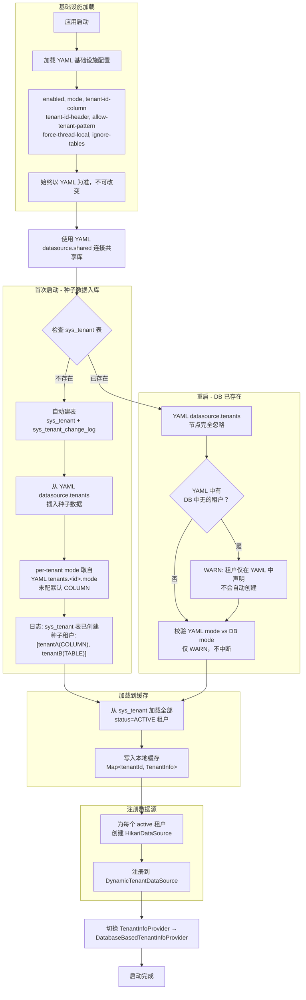
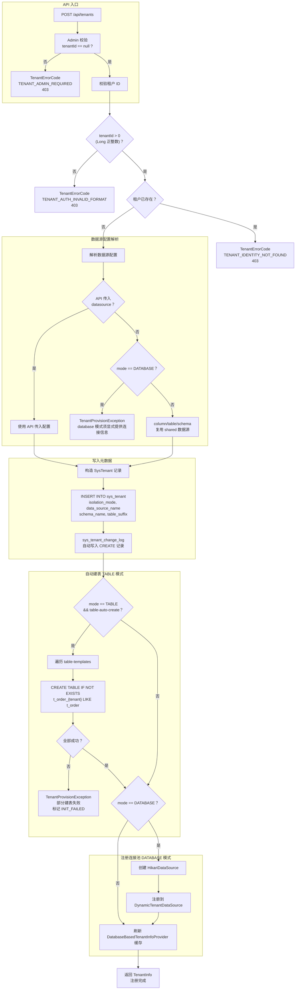
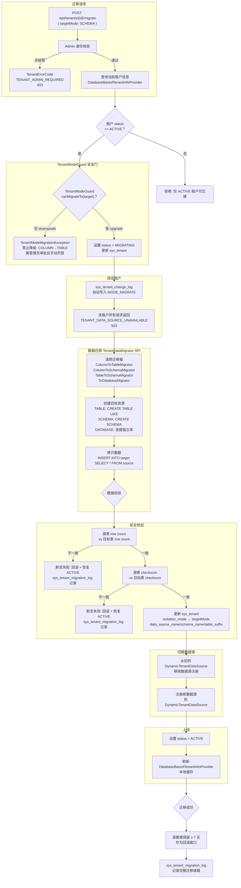

# 租户生命周期详细设计

> 对应《多租户方案设计.md》§6.2 TenantInfoProvider 的扩展实现，解决纯 YAML 驱动无法动态管理租户的致命缺陷。

## 目录

1. [YAML 与 DB 权威性规则](#1-yaml-与-db-权威性规则)
2. [sys_tenant 元数据表](#2-sys_tenant-元数据表)
3. [sys_tenant_change_log 审计表](#3-sys_tenant_change_log-审计表)
4. [DatabaseBasedTenantInfoProvider](#4-databasebasedtenantinfoprovider)
5. [TenantProvisioner 租户注册](#5-tenantprovisioner-租户注册)
    - 5.5 [修改租户元数据](#55-修改租户元数据)
    - 5.6 [恢复激活](#56-恢复激活)
    - 5.7 [注册流程总览](#57-注册流程总览)
6. [TenantModeGuard 模式迁移防护](#6-tenantmodeguard-模式迁移防护)
7. [模式迁移流程](#7-模式迁移流程)
    - 7.1 [迁移流程总览](#71-迁移流程总览)
    - 7.2 [关键规则](#72-关键规则)

---

## 1. YAML 与 DB 权威性规则

### 1.1 配置分层

```
┌─────────────────────────────────────────┐
│  YAML = 基础设施 + 种子配置（bootstrap）  │  ← 只读，仅首次启动消费
├─────────────────────────────────────────┤
│  DB  = 租户运行时配置（runtime authority）│  ← 可读写，运行时动态变更
└─────────────────────────────────────────┘
```

### 1.2 字段归属

| 配置项 | 来源 | 运行时可变 | 说明 |
|--------|------|-----------|------|
| `enabled` | YAML | ❌ | 总开关 |
| `mode` | YAML | ❌ | 全局默认模式，仅用于启动时无租户数据场景下的初始化 |
| `tenant-id-column` | YAML | ❌ | 表结构常量 |
| `tenant-id-header` | YAML | ❌ | 入口协议 |
| `allowed-tenant-pattern` | YAML | ❌ | 安全基线 |
| `force-thread-local` | YAML | ❌ | JVM 级别 |
| `ignore-tables` | YAML + Nacos | ✅ | Nacos 热刷新 |
| `datasource.shared` | YAML | ❌ | 共享库连接（也是 sys_tenant 所在库） |
| `datasource.tenants.*` | ~~YAML（废弃）~~ → DB | — | **仅首次启动种子数据**，sys_tenant 有数据后 YAML 中此节点忽略 |
| `canary.tenants` | YAML + Nacos | ✅ | 灰度配置 |
| `circuit` | YAML + Nacos | ✅ | 熔断配置 |

### 1.3 启动流程（含重启）



**关键铁律**：`sys_tenant` 表一旦存在，YAML `datasource.tenants` 就是只读历史记录，重启也不会重新消费。

### 1.4 运维操作 vs 实际效果

| 运维操作 | 实际效果 | 原因 |
|---------|---------|------|
| YAML 新增租户，重启 | ❌ 不生效，WARN 日志 | DB 已有数据，YAML 不再作为租户来源 |
| 通过管理 API 新增租户 | ✅ 立即生效 | 写入 sys_tenant + 动态注册数据源 |
| YAML 删除租户，重启 | ❌ 不生效 | DB 才是权威源 |
| YAML 修改 shared DB | ✅ 重启生效 | 基础设施配置 |
| YAML 修改 tenant-id-column | ✅ 重启生效 | 基础设施配置 |
| 管理 API 下线租户 | ✅ 立即生效 | DB 状态变更 + 数据源下线 |

---

## 2. sys_tenant 元数据表

```sql
CREATE TABLE sys_tenant (
    id                BIGINT PRIMARY KEY,
    tenant_id         VARCHAR(64)   NOT NULL UNIQUE,   -- 存储为 VARCHAR，但平台内统一解析为 Long
    tenant_name       VARCHAR(128)  NOT NULL,
    isolation_mode    VARCHAR(32)   NOT NULL,          -- COLUMN / TABLE / SCHEMA / DATABASE
    data_source_name  VARCHAR(64),                     -- 数据源标识（database 模式下必填，其他模式可为 shared）
    schema_name       VARCHAR(64),                     -- schema 模式下必填
    table_suffix      VARCHAR(32),                     -- table 模式下必填
    datasource_config JSONB,                            -- database 模式连接信息（加密存储）
    status            VARCHAR(16)   NOT NULL DEFAULT 'ACTIVE',  -- ACTIVE / INACTIVE / MIGRATING
    version           INT           NOT NULL DEFAULT 1,  -- 乐观锁版本号
    created_at        TIMESTAMP     DEFAULT CURRENT_TIMESTAMP,
    updated_at        TIMESTAMP     DEFAULT CURRENT_TIMESTAMP
);

CREATE INDEX idx_sys_tenant_status ON sys_tenant(status);
```

> **tenantId 类型约定**：`sys_tenant.tenant_id` 存储为 `VARCHAR(64)`（兼顾灵活性），但平台内部所有 API、上下文、策略均将其解析为 `Long`。注册时 `TenantProvisioner` 会校验 `tenantId` 是否为合法的 `Long` 值。这是因为 tenantId 可能成为分库路由条件（如 ShardingSphere 的分片键），`String` 类型会给分库路由、SQL 拼接、索引优化带来严重问题。

### 字段填充规则

| 字段 | column | table | schema | database |
|------|--------|-------|--------|----------|
| `isolation_mode` | COLUMN | TABLE | SCHEMA | DATABASE |
| `data_source_name` | `shared` | `shared` | `shared` | `{tenantId}` |
| `schema_name` | NULL | NULL | `tenant_{id}` | NULL |
| `table_suffix` | NULL | `_{tenantId}` | NULL | NULL |
| `datasource_config` | NULL | NULL | NULL | JSON 加密 |

---

## 3. sys_tenant_change_log 审计表

```sql
CREATE TABLE sys_tenant_change_log (
    id               BIGINT PRIMARY KEY,
    tenant_id        VARCHAR(64)   NOT NULL,
    action           VARCHAR(32)   NOT NULL,    -- CREATE / UPDATE / DELETE / MODE_MIGRATE / STATUS_CHANGE
    old_values       JSONB,                     -- 变更前 sys_tenant 行快照
    new_values       JSONB,                     -- 变更后 sys_tenant 行快照
    operator         VARCHAR(64),               -- 操作人标识
    operator_ip      VARCHAR(45),               -- 操作来源 IP
    migration_task_id VARCHAR(64),              -- MODE_MIGRATE 时关联的迁移任务 ID
    created_at       TIMESTAMP DEFAULT CURRENT_TIMESTAMP
);

CREATE INDEX idx_tenant_clog_tenant ON sys_tenant_change_log(tenant_id, created_at DESC);
CREATE INDEX idx_tenant_clog_action ON sys_tenant_change_log(action, created_at DESC);
```

每次 `sys_tenant` 的 INSERT / UPDATE / DELETE 由 `TenantMetadataMapper` 的拦截器或 AOP 自动写入 changelog，不依赖业务代码手动调用。

---

## 4. DatabaseBasedTenantInfoProvider

替代概念设计 §5.3 中的 `ConfigurationBasedTenantInfoProvider`，作为生产环境的默认实现。

### 4.1 缓存架构：本地 Map + 分布式缓存（L2）

租户元数据是**高频读、低频写**的典型场景——每次 SQL 执行都需要查询 `TenantInfo`，但租户注册/下线/模式变更是运维级操作。采用两级缓存架构：

```
getTenantInfo(tenantId)
  ├── 本地 volatile Map 命中 → 返回（0.1ms）
  ├── 分布式缓存（GlobalCache L2）命中 → 回写本地 Map → 返回（1~5ms）
  └── DB 查询 → 回写分布式缓存 + 本地 Map → 返回（10~50ms）
```

**分布式缓存集成方式**：复用 `atlas-richie-component-cache` 的 `GlobalCache` 能力：

| 层级 | 实现 | TTL | 一致性保障 |
|------|------|-----|----------|
| L1 本地缓存 | `volatile Map<String, TenantInfo>` | 无过期（全量替换） | 每次刷新时 `Map.copyOf` 原子替换 |
| L2 分布式缓存 | `GlobalCache.struct().get/set` | 10 分钟 + 随机偏移 | Redis 键空间通知跨实例失效 |
| DB 权威源 | `sys_tenant` 表 | — | 管理 API 写入后立即触发刷新 |

**缓存刷新触发点**：

| 触发源 | 刷新动作 |
|---------|----------|
| 应用启动 | `@PostConstruct` 全量加载 |
| 管理 API（注册/下线/修改/迁移） | API 完成后立即调用 `refresh()` + 写入分布式缓存 |
| Nacos 配置变更 | `@EventListener(RefreshScopeRefreshedEvent)` 触发 |
| Redis 键空间通知 | 其他实例的 API 操作导致缓存变更时，本地自动失效 |

```java
@Component
@ConditionalOnProperty(prefix = "multi-tenancy", name = "enabled", havingValue = "true")
public class DatabaseBasedTenantInfoProvider implements TenantInfoProvider {

    private final TenantMetadataMapper metadataMapper;
    private final MultiTenancyProperties properties;
    private final boolean distributedCacheAvailable;  // 由 @Autowired(required=false) 探测

    /** L1：全量本地缓存 */
    private volatile Map<String, TenantInfo> cache = Map.of();

    private static final String CACHE_KEY_PREFIX = "tenant:info:";
    private static final long CACHE_TTL_MS = 600_000L;  // 10 分钟

    @PostConstruct
    public void init() {
        refresh();
    }

    @Override
    public TenantInfo getTenantInfo(Long tenantId) {
        String key = String.valueOf(tenantId);
        TenantInfo info = cache.get(key);
        if (info != null) return info;

        // L2：分布式缓存回源
        if (distributedCacheAvailable) {
            info = GlobalCache.struct().get(
                CACHE_KEY_PREFIX + key, TenantInfo.class);
            if (info != null) {
                // 回写 L1
                Map<String, TenantInfo> newCache = new HashMap<>(cache);
                newCache.put(key, info);
                this.cache = Map.copyOf(newCache);
                return info;
            }
        }

        // DB 回源
        SysTenant record = metadataMapper.selectOne(
            new LambdaQueryWrapper<SysTenant>()
                .eq(SysTenant::getTenantId, key)
                .eq(SysTenant::getStatus, "ACTIVE"));
        if (record == null) return null;

        info = toTenantInfo(record);
        // 回写 L2 + L1
        if (distributedCacheAvailable) {
            GlobalCache.struct().set(CACHE_KEY_PREFIX + key, info, CACHE_TTL_MS);
        }
        Map<String, TenantInfo> newCache = new HashMap<>(cache);
        newCache.put(key, info);
        this.cache = Map.copyOf(newCache);
        return info;
    }

    @Override
    public boolean exists(Long tenantId) {
        return cache.containsKey(String.valueOf(tenantId));
    }

    /**
     * 全量刷新。启动时、管理 API 操作后、Nacos 事件触发时调用。
     */
    @EventListener(RefreshScopeRefreshedEvent.class)
    public void refresh() {
        List<SysTenant> tenants = metadataMapper.selectList(
            new LambdaQueryWrapper<SysTenant>().eq(SysTenant::getStatus, "ACTIVE"));
        Map<String, TenantInfo> newCache = new HashMap<>();
        for (SysTenant t : tenants) {
            TenantInfo info = toTenantInfo(t);
            newCache.put(t.getTenantId(), info);
            // 回写 L2 分布式缓存
            if (distributedCacheAvailable) {
                GlobalCache.struct().set(
                    CACHE_KEY_PREFIX + t.getTenantId(), info, CACHE_TTL_MS);
            }
        }
        this.cache = Map.copyOf(newCache);
    }

    private TenantInfo toTenantInfo(SysTenant record) {
        return TenantInfo.builder()
            .tenantId(Long.parseLong(record.getTenantId()))
            .mode(record.getIsolationMode())
            .dataSourceName(record.getDataSourceName())
            .schemaName(record.getSchemaName())
            .tableSuffix(record.getTableSuffix())
            .status(TenantStatus.valueOf(record.getStatus()))
            .canary(record.getStatus().equals("CANARY"))
            .build();
    }
}
```

> **依赖说明**：`distributedCacheAvailable` 通过 `@Autowired(required = false) GlobalCache` 探测。未引入 `atlas-richie-component-cache` 的项目自动降级为纯本地缓存，不影响功能。

---

## 5. TenantProvisioner 租户注册

### 5.1 管理 API

> 所有管理接口需平台超管（JWT 中 `tenantId == null`）调用，否则返回 `TenantErrorCode.TENANT_ADMIN_REQUIRED`（403）。

| 方法 | 路径 | 说明 |
|------|------|------|
| `POST` | `/api/tenants` | 注册新租户 |
| `PUT` | `/api/tenants/{tenantId}` | 修改租户元数据（名称、数据库连接信息） |
| `DELETE` | `/api/tenants/{tenantId}` | 下线租户（STATUS → INACTIVE） |
| `PUT` | `/api/tenants/{tenantId}/activate` | 恢复激活（STATUS → ACTIVE） |
| `POST` | `/api/tenants/{id}/migrate` | 模式迁移（见 §7） |

#### POST /api/tenants — 注册新租户

```json
{
  "tenantId": 1001,
  "tenantName": "Bank A",
  "mode": "DATABASE",
  "datasource": {
    "url": "jdbc:postgresql://10.0.1.50:5432/tenant_1001",
    "username": "app",
    "password": "***",
    "hikari": {
      "maximumPoolSize": 10,
      "minimumIdle": 2
    }
  }
}
```

> database 模式**必须**显式传入 `datasource` 连接信息。column / table / schema 模式无需传入，复用 shared 数据源。

#### PUT /api/tenants/{tenantId} — 修改租户元数据

可修改字段：

| 字段 | 说明 | 约束 |
|------|------|------|
| `tenantName` | 租户显示名称 | 最长 128 字符 |
| `datasourceConfig` | 数据库连接信息（database 模式） | 仅在 `isolation_mode == DATABASE` 时生效 |

不可修改字段（结构常量，修改需走迁移流程）：

| 字段 | 不可修改原因 |
|------|------------|
| `tenantId` | 主键，关联所有下游数据 |
| `isolationMode` | 需走模式迁移流程（§7） |
| `schemaName` | 已创建的 schema 不可更名 |
| `tableSuffix` | 已创建的表不可更名 |
| `dataSourceName` | 由 isolation_mode 派生 |

请求示例（仅修改名称 + 连接信息）：

```json
{
  "tenantName": "Bank A (Production)",
  "datasourceConfig": {
    "url": "jdbc:postgresql://10.0.2.100:5432/tenant_bank_a",
    "username": "app_new",
    "password": "***",
    "hikari": {
      "maximumPoolSize": 20,
      "minimumIdle": 5
    }
  }
}
```

`tenantName` 为 `null` 时不更新该字段。`datasourceConfig` 为 `null` 时不更新连接信息。

#### PUT /api/tenants/{tenantId}/activate — 恢复激活

将 `status = INACTIVE` 的租户恢复为 `ACTIVE`，重建连接池并注册到 `DynamicTenantDataSource`。

| 前置条件 | 说明 |
|---------|------|
| 租户 `status == INACTIVE` | 仅 INACTIVE 租户可激活 |
| 目标数据库可连通（database 模式） | 连接池创建前做探活 |

请求体为空。database 模式下，复用 `sys_tenant.datasource_config` 中已有的连接信息创建新的 `HikariDataSource`。

### 5.2 核心实现

```java
@Component
public class TenantProvisioner {

    private final TenantMetadataMapper metadataMapper;
    private final DynamicTenantDataSource dynamicDataSource;
    private final DataSourceCircuitBreaker circuitBreaker;
    private final MultiTenancyProperties properties;
    private final JdbcTemplate jdbcTemplate;

    /**
     * 注册新租户。
     * 线程安全：sys_tenant.tenant_id 有唯一索引，并发插入靠 DB 约束兜底。
     */
    @Transactional
    public TenantInfo provision(TenantProvisionRequest req) {
        // 1. 校验租户 ID（Long 类型，必须为正整数）
        Long tenantId = req.getTenantId();
        if (tenantId == null || tenantId <= 0) {
            throw new IllegalArgumentException("租户 ID 必须为正整数，当前值: " + tenantId);
        }

        // 2. 解析数据源配置（database 模式必须显式传入）
        DataSourceConfig dsConfig = resolveDataSourceConfig(req);

        // 3. 创建 HikariDataSource（仅在 database 模式）
        HikariDataSource ds = null;
        if (req.getMode() == IsolationMode.DATABASE) {
            ds = createHikariDataSource(dsConfig);
        }

        // 4. 构造并插入元数据
        SysTenant record = buildSysTenant(req, dsConfig);
        metadataMapper.insert(record);

        // 5. 自动建表 / 建库（仅在开启对应开关时）
        autoCreateResources(req);

        // 6. 注册数据源到 DynamicTenantDataSource
        if (ds != null) {
            dynamicDataSource.addTenantDataSource(req.getTenantId(), ds);
        }

        // 7. changelog 由 Mapper 拦截器自动写入

        return toTenantInfo(record);
    }

    private DataSourceConfig resolveDataSourceConfig(TenantProvisionRequest req) {
        // database 模式必须显式传入连接信息
        if (req.getMode() == IsolationMode.DATABASE) {
            if (req.getDatasource() != null) {
                return req.getDatasource();
            }
            throw new TenantProvisionException(
                "database 模式必须提供数据源连接信息（API 显式传入）");
        }
        return null;  // column / table / schema 模式复用 shared 数据源
    }
}
```

### 5.3 自动建表（Table 模式）

> database 模式不提供自动建库能力——`CREATE DATABASE` 需要 DBA 级权限，不应暴露给应用连接池。database 模式下，数据库实例由运维先创建，再通过管理 API 注册租户数据源。table 模式下的表创建使用应用已有连接池即可完成，无需额外权限。

**YAML 配置**：

```yaml
multi-tenancy:
  table-auto-create: true              # 注册租户时自动建表（默认 true）
  table-templates:                     # 显式指定需复制的表模板列表
    - t_order
    - t_user
    - t_product
  table-auto-discover: true            # 自动发现模式（默认 false）
  table-auto-discover-exclude:         # 自动发现时排除的表
    - sys_config
    - sys_tenant
    - sys_tenant_change_log
    - flyway_schema_history
    - databasechangelog*
  table-name-suffix: _${tenant}
```

**表模板解析优先级**：

| 优先级 | 来源 | 说明 |
|--------|------|------|
| 1 | `table-templates` 显式列表 | 始终生效，优先级最高 |
| 2 | `table-auto-discover: true` | 从 `information_schema.tables` 自动发现当前 schema 下所有业务表，排除 `table-auto-discover-exclude` 中的表 |
| 3 | 两者合并 | 显式列表 + 自动发现结果去重后合并 |

**自动发现实现**：

```java
/**
 * 表模板解析器。
 * 优先级：显式 table-templates > 自动发现 > 两者合并。
 */
@Component
public class TableTemplateResolver {

    private final JdbcTemplate jdbcTemplate;
    private final MultiTenancyProperties properties;

    /**
     * 解析最终的表模板列表（去重、排除、排序）。
     */
    public List<String> resolve() {
        Set<String> templates = new LinkedHashSet<>();

        // 1. 显式列表始终优先
        if (properties.getTableTemplates() != null) {
            templates.addAll(properties.getTableTemplates());
        }

        // 2. 自动发现
        if (properties.isTableAutoDiscover()) {
            List<String> discovered = discoverTables();
            Set<String> excludes = Set.copyOf(properties.getTableAutoDiscoverExclude());
            for (String table : discovered) {
                if (!excludes.contains(table) && !matchesAnyExclude(table, excludes)) {
                    templates.add(table);
                }
            }
        }

        return List.copyOf(templates);
    }

    private List<String> discoverTables() {
        return jdbcTemplate.queryForList(
            "SELECT table_name FROM information_schema.tables "
                + "WHERE table_schema = current_schema() "
                + "AND table_type = 'BASE TABLE' "
                + "ORDER BY table_name",
            String.class);
    }

    private boolean matchesAnyExclude(String table, Set<String> excludes) {
        for (String exclude : excludes) {
            if (exclude.endsWith("*") && table.startsWith(exclude.substring(0, exclude.length() - 1))) {
                return true;
            }
        }
        return false;
    }
}
```

> **安全说明**：自动发现不会发现其他租户的租户表（如 `t_order_tenantA`），因为排除规则应包含 `table-name-suffix` 模式匹配。建议在生产环境首次使用时，先以 `INFO` 日志输出发现结果，确认表清单正确后再开启 `table-auto-create`。

**`autoCreateResources` 实现**：

```java
private void autoCreateResources(TenantProvisionRequest req) {
    if (req.getMode() == IsolationMode.TABLE) {
        autoCreateTables(req.getTenantId());
    } else if (req.getMode() == IsolationMode.SCHEMA) {
        autoCreateSchema(req.getTenantId());
    }
    // DATABASE 模式不自动建库——需 DBA 级权限，由运维预先创建
}

private void autoCreateTables(String tenantId) {
    if (!properties.isTableAutoCreate()) return;

    List<String> templates = tableTemplateResolver.resolve();  // 使用 TableTemplateResolver
    String suffix = properties.getTableNameSuffix().replace("${tenant}", tenantId);

    int created = 0;
    List<String> failures = new ArrayList<>();

    for (String template : templates) {
        String targetTable = template + suffix;
        try {
            jdbcTemplate.execute(
                String.formatted("CREATE TABLE IF NOT EXISTS `%s` LIKE `%s`",
                    targetTable, template));
            created++;
        } catch (DataAccessException e) {
            failures.add(String.format("%s: %s", targetTable, e.getMessage()));
        }
    }

    if (!failures.isEmpty()) {
        throw new TenantProvisionException(String.formatted(
            "Table auto-create partially failed: created=%d, failed=%d: %s",
            created, failures.size(), String.join(", ", failures)));
    }
}

/**
 * 自动创建 Schema（SCHEMA 模式）。
 * 仅在支持 schema 的数据库中生效（PostgreSQL/Oracle）。
 * MySQL 中 schema = database，不支持在同一连接下以 schema 隔离，配置校验器已在启动时拒绝。
 */
private void autoCreateSchema(String tenantId) {
    if (!properties.isSchemaAutoCreate()) return;

    String schemaName = properties.getSchemaPrefix() + tenantId;
    // 校验 schema 名称安全
    if (!schemaName.matches("^[a-zA-Z0-9_]+$")) {
        throw new TenantProvisionException("Invalid schema name: " + schemaName);
    }

    try {
        jdbcTemplate.execute(
            String.formatted("CREATE SCHEMA IF NOT EXISTS %s", schemaName));

        // 复制共享 schema 中的表结构到新 schema
        List<String> templates = tableTemplateResolver.resolve();
        for (String template : templates) {
            jdbcTemplate.execute(String.formatted(
                "CREATE TABLE IF NOT EXISTS %s.%s (LIKE public.%s INCLUDING ALL)",
                schemaName, template, template));
        }
    } catch (DataAccessException e) {
        throw new TenantProvisionException(
            "Schema auto-create failed for " + schemaName + ": " + e.getMessage());
    }
}
```

**关键决策**：

| 场景 | 处理 |
|------|------|
| 表已存在（重试/幂等） | `IF NOT EXISTS` 跳过 |
| 模板表不存在 | 单个 FAIL，继续尝试其余表 |
| 部分成功部分失败 | 不自动回滚 DDL，全部标记为 INIT_FAILED，运维清理后重试 |
| 建表耗时过长 | 单次注册几十张表足够；如需异步化，加租户状态 PENDING → INITIALIZING → ACTIVE |

### 5.4 下线租户

```
DELETE /api/tenants/{tenantId}
```

```java
@Transactional
public void deprovision(String tenantId) {
    // 1. 标记 status = INACTIVE（软删除，不物理删行）
    SysTenant record = metadataMapper.selectById(tenantId);
    record.setStatus("INACTIVE");
    metadataMapper.updateById(record);

    // 2. 关闭连接池（database 模式）
    DataSource removed = dynamicDataSource.removeTenantDataSource(tenantId);
    if (removed instanceof HikariDataSource hikari) {
        hikari.close();
    }

    // 3. 移除熔断器监控
    circuitBreaker.remove(tenantId);

    // 4. changelog 自动写入
}
```

### 5.5 修改租户元数据

```java
@Transactional
public void update(String tenantId, TenantUpdateRequest req) {
    SysTenant record = metadataMapper.selectById(tenantId);
    if (record == null) {
        throw new TenantNotFoundException(tenantId);
    }

    String oldDatasourceConfig = null;

    // 1. 更新名称
    if (req.getTenantName() != null) {
        record.setTenantName(req.getTenantName());
    }

    // 2. 更新数据源配置（database 模式）
    if (req.getDatasourceConfig() != null) {
        if (record.getIsolationMode() != IsolationMode.DATABASE) {
            throw new IllegalArgumentException("仅 database 模式支持修改连接信息");
        }
        oldDatasourceConfig = record.getDatasourceConfig();
        record.setDatasourceConfig(encrypt(req.getDatasourceConfig()));
    }

    record.setVersion(record.getVersion() + 1);
    metadataMapper.updateById(record);

    // 3. 热更新连接池（database 模式，配置变更时重建）
    if (req.getDatasourceConfig() != null) {
        HikariDataSource oldDs = dynamicDataSource.removeTenantDataSource(tenantId);
        if (oldDs != null) oldDs.close();

        HikariDataSource newDs = createHikariDataSource(req.getDatasourceConfig());
        dynamicDataSource.addTenantDataSource(tenantId, newDs);
    }

    // 4. changelog 自动写入（含 oldDatasourceConfig 快照）
}
```

### 5.6 恢复激活

```java
@Transactional
public void activate(String tenantId) {
    SysTenant record = metadataMapper.selectById(tenantId);
    if (record == null) {
        throw new TenantNotFoundException(tenantId);
    }
    if (!"INACTIVE".equals(record.getStatus())) {
        throw new IllegalStateException(String.formatted(
            "租户 %s 状态为 %s，无法激活", tenantId, record.getStatus()));
    }

    // 1. 恢复状态
    record.setStatus("ACTIVE");
    metadataMapper.updateById(record);

    // 2. 重建连接池（database 模式）
    if (record.getIsolationMode() == IsolationMode.DATABASE) {
        DataSourceConfig dsConfig = decrypt(record.getDatasourceConfig());
        HikariDataSource ds = createHikariDataSource(dsConfig);
        dynamicDataSource.addTenantDataSource(tenantId, ds);
    }

    // 3. 刷新缓存
    // （DatabaseBasedTenantInfoProvider.refresh() 由 changelog 事件触发）

    // 4. changelog 自动写入
}
```

### 5.7 注册流程总览



### 6.1 隔离等级

在 `IsolationMode` 枚举中增加 `level` 字段，按隔离强度排序：

```java
public enum IsolationMode {
    COLUMN(1),   // 行级，最弱
    TABLE(2),    // 表级
    SCHEMA(3),   // Schema 级
    DATABASE(4); // 数据库级，最强

    private final int level;

    /**
     * 是否允许从当前模式迁移到目标模式。
     * 默认仅允许升级（level 增大），降级需走审批。
     */
    public boolean canMigrateTo(IsolationMode target) {
        return this.level < target.level;
    }

    /**
     * 是否是降级操作。
     */
    public boolean isDowngrade(IsolationMode target) {
        return this.level > target.level;
    }
}
```

### 6.2 安全规则

| 方向 | 判定 | 原因 |
|------|------|------|
| `from.level < to.level` | ✅ 允许 | 隔离级别提升，安全性增强 |
| `from.level == to.level` | — | 同级不变，无需迁移 |
| `from.level > to.level` | ❌ 默认禁止 | 降级有数据泄漏/混淆风险，需管理员审批后手动开放 |

具体矩阵：

```
COLUMN(1)  →  TABLE(2)     ✅
           →  SCHEMA(3)    ✅
           →  DATABASE(4)  ✅

TABLE(2)   →  COLUMN(1)    ❌
           →  SCHEMA(3)    ✅
           →  DATABASE(4)  ✅

SCHEMA(3)  →  COLUMN(1)    ❌
           →  TABLE(2)     ❌
           →  DATABASE(4)  ✅

DATABASE(4) → COLUMN(1)    ❌
            → TABLE(2)     ❌
            → SCHEMA(3)    ❌
```

### 6.3 实现

```java
@Component
public class TenantModeGuard {

    /**
     * 校验模式迁移是否允许。
     *
     * @throws TenantModeMigrationException 若迁移被拒绝
     */
    public void validate(IsolationMode from, IsolationMode to) {
        if (from == to) {
            return; // 未变更
        }
        if (from.canMigrateTo(to)) {
            return; // 升级 → 放行
        }
        // 降级 → 禁止
        throw new TenantModeMigrationException(
            String.formatted("禁止从 %s(level=%d) 降级到 %s(level=%d)，存在数据泄漏风险。"
                + "如确需降级，请联系管理员走审批流程。",
                from, from.getLevel(), to, to.getLevel()));
    }
}
```

调用时机：

- **启动时**：对每个 `sys_tenant` 记录校验其 `isolation_mode` 与当前 DB 类型的兼容性
- **API 修改租户模式时**：`TenantProvisioner.updateMode()` 调用前先 `validate`
- **Nacos 配置变更后**：重新加载缓存时二次校验

---

## 7. 模式迁移流程

### 7.1 迁移流程总览



### 7.2 关键规则

模式迁移由 `TenantModeGuard` 管控（仅允许低等级→高等级），数据迁移策略详见 [模式切换数据迁移方案](模式切换数据迁移方案.md)。

**关键规则**：
- 迁移期间租户 `status = MIGRATING`，所有请求返回 503
- `TenantDataMigrator` SPI 提供 4 种内置迁移器：`ColumnToTableMigrator`、`ColumnToSchemaMigrator`、`ToDatabaseMigrator`、`TableToSchemaMigrator`
- 源数据至少保留 7 天作为回滚窗口
- 所有迁移操作写入 `sys_tenant_migration_log` + `sys_tenant_change_log`
