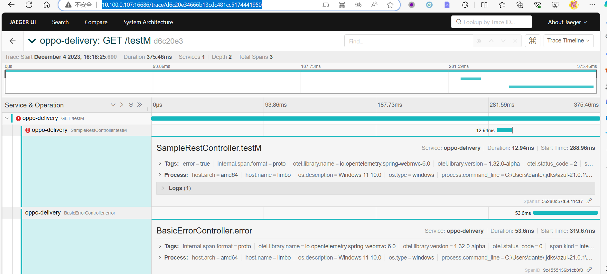

# Richie Component Tracing

## 概述

`richie-component-tracing` 是Richie平台分布式追踪组件，基于 OpenTelemetry 提供分布式追踪能力，支持多种追踪数据导出器（OTLP、Jaeger、Zipkin等），帮助开发人员排查问题和了解系统性能。

## 核心特性

- ✅ **OpenTelemetry 集成** - 基于 OpenTelemetry Java Agent 自动追踪
- ✅ **多导出器支持** - 支持 OTLP、Jaeger、Zipkin 等导出器
- ✅ **自动追踪** - 自动追踪 Spring、HTTP、数据库等组件
- ✅ **日志集成** - 支持在日志中打印 traceId 和 spanId
- ✅ **零代码侵入** - 通过 Java Agent 实现，无需修改代码

## 快速开始

### 1. 添加依赖

```xml
<dependency>
    <groupId>com.richie.component</groupId>
    <artifactId>atlas-richie-component-tracing</artifactId>
    <version>${atlas.richie.version}</version>
</dependency>
```

### 2. 下载 OpenTelemetry Java Agent

从 [OpenTelemetry Java Instrumentation](https://github.com/open-telemetry/opentelemetry-java-instrumentation/releases) 下载最新的 Java Agent JAR 文件。

### 3. 配置 JVM 参数

```bash
-javaagent:/path/to/opentelemetry-javaagent.jar
-Dotel.traces.exporter=otlp
-Dotel.exporter.otlp.endpoint=http://localhost:4317
-Dotel.resource.attributes=service.name=my-service,username=user
```

### 4. 配置应用参数（可选）

```bash
--trace.exporter.host=localhost
--trace.exporter.port=4317
```

### 5. 配置日志输出 traceId 和 spanId

在 `logback-spring.xml` 中添加：

```xml
<property name="FILE_LOG_PATTERN" 
          value="%d{HH:mm:ss} [%thread] %-5level %logger{10} [traceId=%X{trace_id} spanId=%X{span_id}] %msg%n" />
```

## 配置说明

### JVM 参数配置

| 参数 | 说明 | 示例 |
|------|------|------|
| `-javaagent` | OpenTelemetry Java Agent 路径 | `-javaagent:/path/to/opentelemetry-javaagent.jar` |
| `-Dotel.traces.exporter` | 追踪数据导出器 | `otlp`, `jaeger`, `zipkin`, `none` |
| `-Dotel.exporter.otlp.endpoint` | OTLP 导出器端点 | `http://localhost:4317` |
| `-Dotel.resource.attributes` | 资源属性 | `service.name=my-service,username=user` |

### 应用参数配置

| 参数 | 说明 | 示例 |
|------|------|------|
| `--trace.exporter.host` | 追踪数据导出主机地址 | `localhost` |
| `--trace.exporter.port` | 追踪数据导出端口 | `4317` |

### trace.exporter.host 和 otel.exporter.otlp.endpoint 的区别

- **trace.exporter.host**: 用于配置追踪数据的导出目标主机地址，例如指定远程的追踪数据接收端的主机地址。
- **otel.exporter.otlp.endpoint**: 用于配置 OpenTelemetry Protocol (OTLP) 导出器的端点地址，用于指定追踪数据的发送目标地址，通常包括主机名和端口号。

### 导出器配置

#### OTLP 导出器（推荐）

```bash
-Dotel.traces.exporter=otlp
-Dotel.exporter.otlp.endpoint=http://localhost:4317
```

#### Jaeger 导出器

```bash
-Dotel.traces.exporter=jaeger
-Dotel.exporter.jaeger.endpoint=http://localhost:14250
```

#### Zipkin 导出器

```bash
-Dotel.traces.exporter=zipkin
-Dotel.exporter.zipkin.endpoint=http://localhost:9411/api/v2/spans
```

## 功能特性

### 1. 自动追踪

OpenTelemetry Java Agent 自动追踪以下组件：

- **Spring Framework** - Spring MVC、Spring Boot、Spring Cloud
- **HTTP 客户端** - OkHttp、Apache HttpClient、Java HTTP Client
- **数据库** - JDBC、Hibernate、MyBatis
- **消息队列** - Kafka、RabbitMQ、JMS
- **RPC 框架** - gRPC、Dubbo
- **其他** - Redis、MongoDB、Elasticsearch 等

### 2. 日志集成

支持在日志中打印 traceId 和 spanId，方便日志追踪：

```xml
<property name="FILE_LOG_PATTERN" 
          value="%d{HH:mm:ss} [%thread] %-5level %logger{10} [traceId=%X{trace_id} spanId=%X{span_id}] %msg%n" />
```

### 3. 禁用特定代理

可以使用命令行参数或环境变量禁用特定代理：

```bash
# 禁用 Spring Web MVC 代理
-Dotel.instrumentation.spring-web-mvc.enabled=false

# 或使用环境变量
OTEL_INSTRUMENTATION_SPRING_WEB_MVC_ENABLED=false
```

### 4. 支持的组件

OpenTelemetry 官方支持的组件列表请参考：[支持的库和框架](https://github.com/open-telemetry/opentelemetry-java-instrumentation/blob/main/docs/supported-libraries.md#libraries--frameworks)

## 使用 Jaeger UI 查看追踪数据

1. 启动 Jaeger 服务（参考下面的 Docker Compose 配置）
2. 在浏览器中访问 `http://localhost:16686`
3. 选择服务名称和时间范围
4. 查看追踪数据



## Docker Compose 部署示例

### 部署 OpenTelemetry Collector 和 Jaeger

```yaml
version: '3'
services:
  jaeger:
    image: jaegertracing/all-in-one:latest
    container_name: otel_collector_jaeger
    ports:
      - 16686:16686  # Jaeger UI
      - 14250:14250  # gRPC
      - 14268:14268  # HTTP

  otel-collector:
    image: otel/opentelemetry-collector-contrib:latest
    container_name: otel_collector
    volumes:
      - ./otel-collector-config.yaml:/etc/otel-collector-config.yaml
    ports:
      - "8888:8888"   # Prometheus metrics
      - "8889:8889"   # Prometheus exporter metrics
      - "4317:4317"   # OTLP gRPC receiver
      - "1888:1888"   # pprof extension
      - "13133:13133" # health_check extension
      - "55679:55679" # zpages extension
    depends_on:
      - jaeger
    command: ["--config=/etc/otel-collector-config.yaml"]
```

### OpenTelemetry Collector 配置

`otel-collector-config.yaml`:

```yaml
receivers:
  otlp:
    protocols:
      grpc:
        endpoint: 0.0.0.0:4317
      http:
        endpoint: 0.0.0.0:4318

exporters:
  logging:
    loglevel: debug
  jaeger:
    endpoint: jaeger:14250
    tls:
      insecure: true

processors:
  batch:
    timeout: 1s
    send_batch_size: 1024

service:
  extensions: [pprof, zpages, health_check]
  pipelines:
    traces:
      receivers: [otlp]
      processors: [batch]
      exporters: [logging, jaeger]

extensions:
  health_check:
    endpoint: :13133
  pprof:
    endpoint: :1888
  zpages:
    endpoint: :55679
```

## 最佳实践

1. **服务命名**
   - 使用有意义的服务名称，如 `user-service`、`order-service`
   - 避免使用默认的服务名称

2. **资源属性**
   - 添加必要的资源属性，如 `service.name`、`service.version`
   - 添加环境信息，如 `deployment.environment`

3. **采样策略**
   - 生产环境建议使用采样策略，避免追踪数据过多
   - 开发环境可以使用全量采样

4. **性能影响**
   - OpenTelemetry Agent 对性能影响很小（通常 < 1%）
   - 如果性能敏感，可以禁用不必要的代理

5. **日志集成**
   - 在日志中打印 traceId 和 spanId，方便日志追踪
   - 使用统一的日志格式

## 常见问题

### Q: 如何禁用 OpenTelemetry Agent？

A: 使用命令行参数或环境变量禁用：
```bash
-Dotel.javaagent.enabled=false
# 或
OTEL_JAVAAGENT_ENABLED=false
```

### Q: 如何禁用特定组件的追踪？

A: 使用命令行参数或环境变量禁用：
```bash
-Dotel.instrumentation.[name].enabled=false
# 例如
-Dotel.instrumentation.spring-web-mvc.enabled=false
```

### Q: 如何配置采样策略？

A: 使用命令行参数配置：
```bash
-Dotel.traces.sampler=traceidratio
-Dotel.traces.sampler.arg=0.1  # 10% 采样率
```

### Q: 如何查看追踪数据？

A: 使用 Jaeger UI 或 Zipkin UI 查看追踪数据。Jaeger UI 地址：`http://localhost:16686`

### Q: 如何配置自定义追踪？

A: 使用 OpenTelemetry API 手动创建 Span：
```java
Span span = tracer.spanBuilder("my-operation").startSpan();
try (Scope scope = span.makeCurrent()) {
    // 业务逻辑
} finally {
    span.end();
}
```

## 相关文档

- [OpenTelemetry 官方文档](https://opentelemetry.io/docs/)
- [OpenTelemetry Java Instrumentation](https://github.com/open-telemetry/opentelemetry-java-instrumentation)
- [Jaeger 官方文档](https://www.jaegertracing.io/docs/)
- [支持的库和框架](https://github.com/open-telemetry/opentelemetry-java-instrumentation/blob/main/docs/supported-libraries.md)
